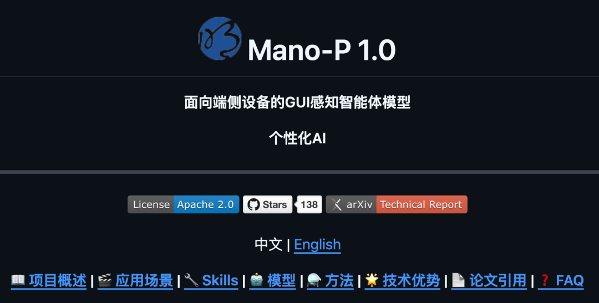
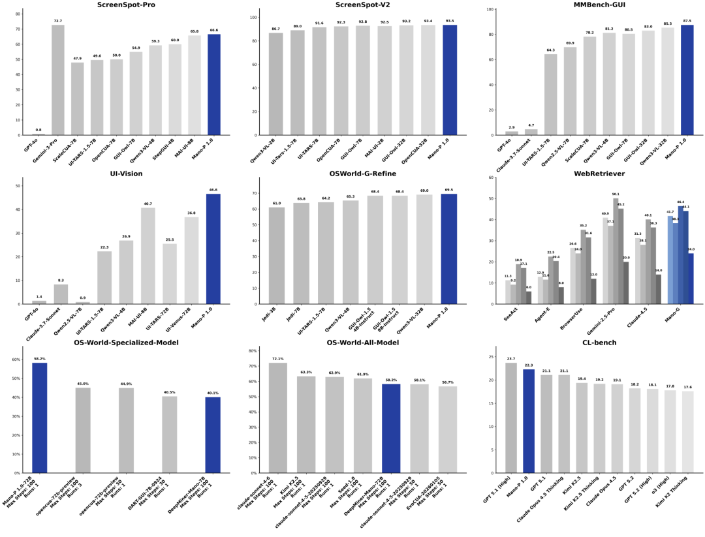
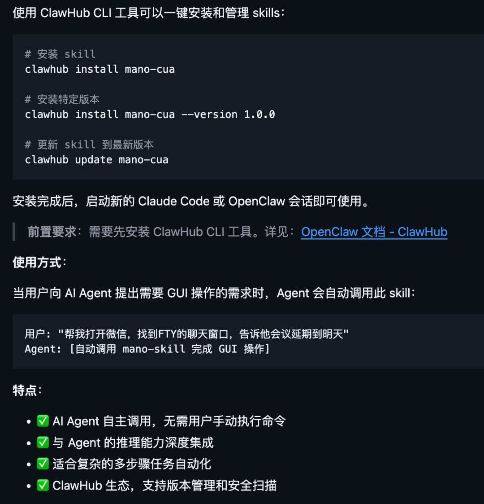
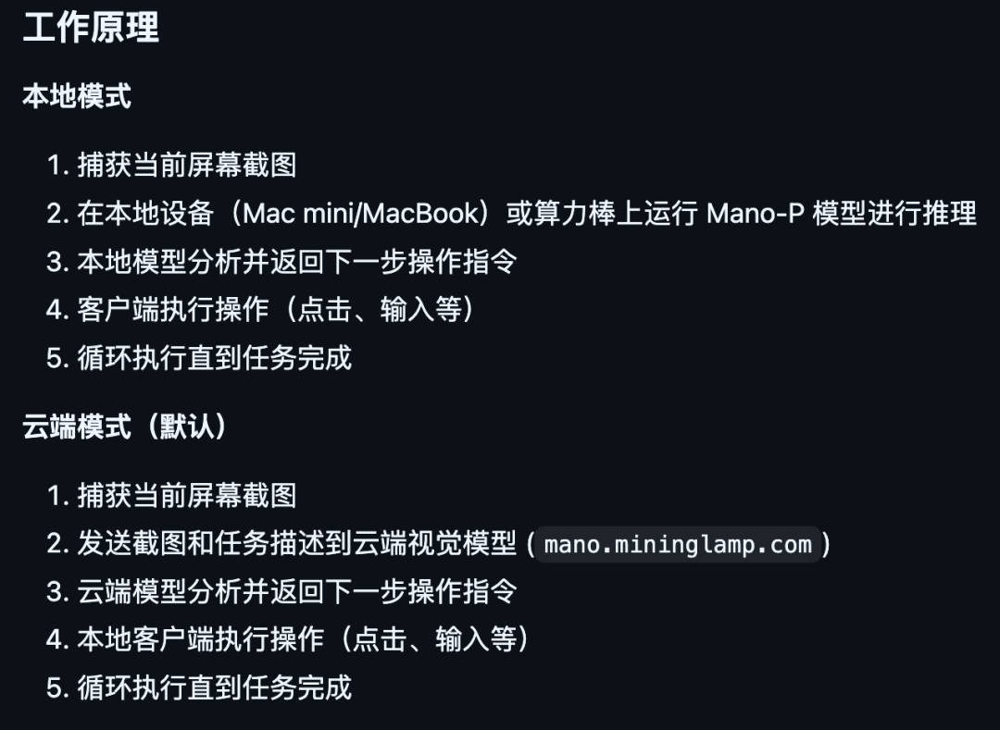

> 📎 来源: [逛逛GitHub](https://mp.weixin.qq.com/s?__biz=MzUxNjg4NDEzNA==&mid=2247532987&idx=1&sn=28d075abf135fb945972a6b8e8a49b18&chksm=f846ceceaf53c594cc467a438a6d4e79c1731acf86c6b622a2d9960b4626a95d5474af0d75fe&mpshare=1&scene=1&srcid=0417MmuTEQKOjpluHF9AkDOu&sharer_shareinfo=b3df42818e5b71443224b8ae717b1c4f&sharer_shareinfo_first=b3df42818e5b71443224b8ae717b1c4f) | 时间: 2026-04-17 13:07

---

操控浏览器这件事，方案已经很成熟了。

CDP、Playwright，随便挑一个都能把网页上的自动化操作安排得明明白白。

但是操控电脑上的桌面软件，我一直没找到好的方案。

桌面应用没有统一的协议可以调，没有 DOM 可以解析，不同软件的界面结构也完全不一样。

你想让 AI 帮你操作电脑上的软件，基本上只能干瞪眼。



直到最近看到一个刚开源的项目 — **Mano-P**，做的就是这件事。

纯视觉理解桌面上的任何软件界面，像人一样去操作，而且全程跑在你自己电脑上，数据不上云。

01

**开源项目简介**

Mano-P 是明略科技开源的一个 GUI-VLA 智能体模型。

说白了，就是一个能看懂你电脑屏幕、自己动手操作桌面上任何软件的 AI。

它不依赖 CDP 协议，不依赖 HTML 解析，也不需要你给它开什么 API。

模型直接看屏幕截图，理解画面上有什么，然后决定该怎么操作。

比如，帮你打麻将。。。

```
开源地址：https://github.com/Mininglamp-AI/Mano-P
```

Mano 这个名字来自西班牙语的"手"，P 有两层意思：Person 和 Party。

意思就是无论个人还是组织，都能用它创建自己的个性化 AI。

目前在 OSWorld 专项模型榜单上排名第一，72B 模型成功率 58.2%，比第二名高了 13.2 个百分点。

而且在全球 13 个多模态基准榜单上拿到了 SOTA。



02

**几个核心亮点**

**① 纯视觉驱动，浏览器之外的世界也能操作**

现在市面上的 GUI Agent，要么依赖 CDP 协议只能操控浏览器，要么需要调系统的 Accessibility API，要么得把截图传到云端让大模型帮忙看。

Mano-P 走的是纯视觉路线。

模型直接看截图，像人一样理解界面内容，然后执行操作。

桌面软件、网页、3D 应用、专业工具，只要有图形界面就能操作。

这和那些只能操控浏览器的方案相比，覆盖面大了不少。

**② 数据不出设备，隐私有保障**

这可能是 Mano-P 和其他云端 Computer Use 方案最大的区别。

本地模式下，所有截图和任务数据完全不出你的设备。

不需要联网，不需要调 API，断网也能跑。

4B 量化模型在 Apple M4 Pro 上的表现：

- 预填充速度 476 tokens/s
- 解码速度 76 tokens/s
- 峰值内存仅 4.3GB

4.3GB，一台普通 M4 MacBook 就能跑起来，不需要什么高端工作站。

对于企业用户来说，业务数据、客户信息、操作记录全部留在本地，不存在数据泄露的风险。

**③ Think -> Act -> Verify 闭环推理**

Mano-P 不是简单的看到什么点什么。

它的工作流程是：先思考当前画面该做什么，然后执行操作，再验证操作结果是否正确。

如果发现不对，它会自己纠错重新来。

这种闭环机制让它在复杂的长任务中也能保持稳定性。

比如一个包含几十步操作的业务流程，中间某一步出了问题，它能自己发现并修正。

03

**怎么用**

Mano-P 提供了三种使用方式，最简单的是 CLI 工具，brew 一行命令装好：

```
brew tap HanningWang/tap
```

装完直接用：

```
# 操作微信发消息
```

如果你用的是 Claude Code 或者 OpenClaw，可以通过 mano-skill 直接把 Mano-P 作为技能装到你的 Agent 里面。



Python SDK（mano-client）后续也会发布。

**硬件方面：**

本地模式需要 M4 芯片 Mac + 32GB 内存。

如果没有 M4 Mac，也可以通过 USB 4.0 算力棒来跑。

不想本地跑的话也有云端模式，不过敏感数据比如本地文件、剪贴板、凭证这些不会上传。



Mano-P 目前还处于开源的第一阶段，开放的是 Mano-CUA Skills 部分。

Mano-CUA 的本地模型和 SDK 组件预计四月底开源，届时所有 CUA 操作都能够在本地 Mac 设备上执行，而不会上传到外部服务器。

后续还会开放训练方法和模型压缩技术，让开发者能够创建符合自身独特需求的本地 GUI-VLA 模型。

整体看下来，Mano-P 解决了一个很实际的问题：桌面软件的自动化操控。

浏览器自动化已经卷成红海了，但桌面端的 GUI Agent 一直是块硬骨头。

Mano-P 用纯视觉的方案绕过了协议和 API 的限制，而且坚持本地运行、数据不上云。

在隐私和安全越来越被重视的当下，这个方向确实值得关注一下。

04

**点击下方卡片，关注逛逛 GitHub**

这个公众号历史发布过很多有趣的开源项目，如果你懒得翻文章一个个找，你直接关注微信公众号：逛逛 GitHub ，后台对话聊天就行了：


