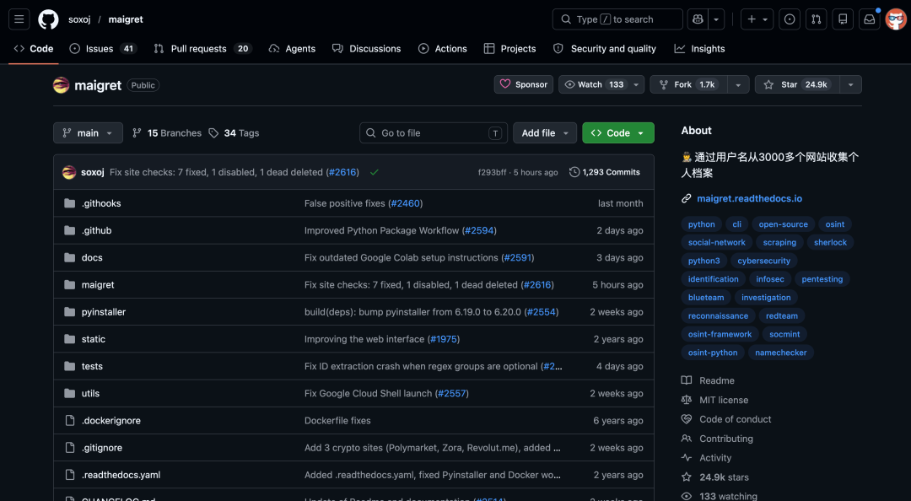
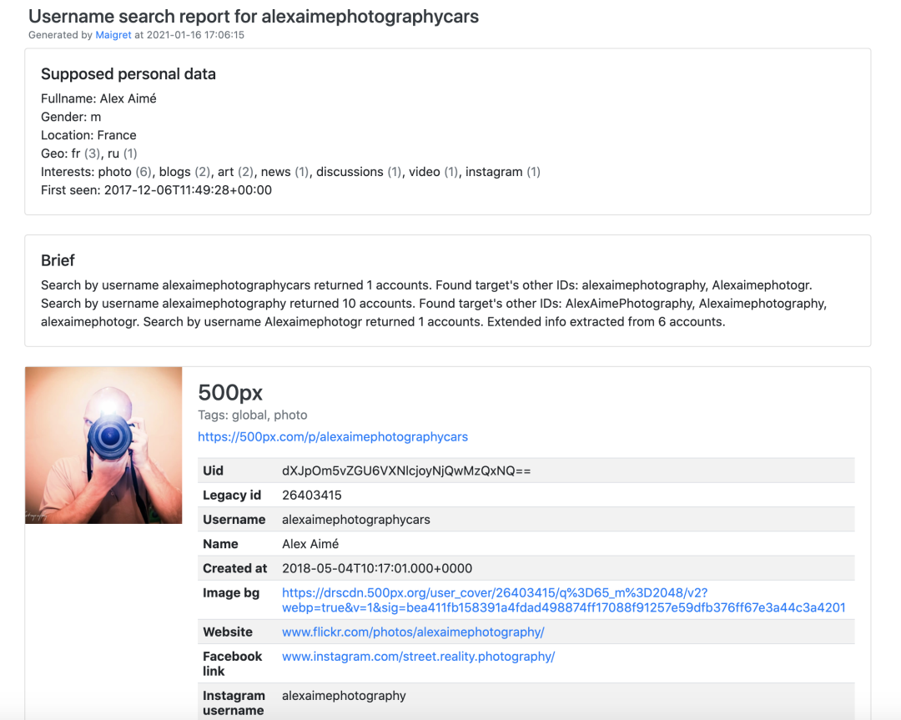
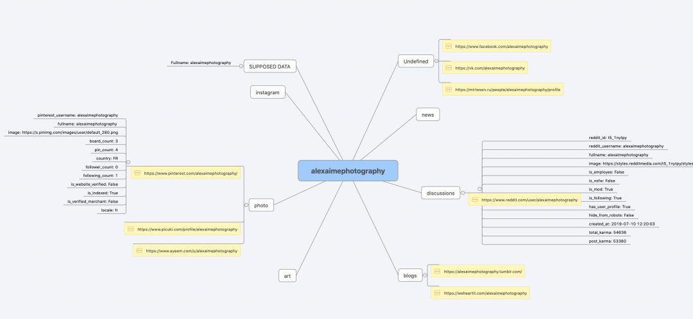

> 📎 来源: [逛逛GitHub](https://mp.weixin.qq.com/s?__biz=MzUxNjg4NDEzNA==&mid=2247533562&idx=1&sn=b1b939773a8a7b7b75c97ddd7d3c4b42&chksm=f8ab17ad810b85cf53355e49aff16611598c24377db063836f5b5430c9bb8a24d02aaa0428a7&mpshare=1&scene=1&srcid=05114WS0y1DLMFVaoe1CA3KZ&sharer_shareinfo=832f13d9dead99f54bd281f73d5a55d3&sharer_shareinfo_first=832f13d9dead99f54bd281f73d5a55d3) | 时间: 2026-05-11 15:20

---

你有没有想过，自己在网上到底注册过多少账号？

大多数人就那几个用户名换来换去，用久了你会发现，各个平台都能找到你的影子。

如果有人拿你的常用用户名去系统性地搜一圈，你的数字画像可能比你想象的要完整得多。。。

最近逛 GitHub 发现一个叫 Maigret 的项目，已经在开源情报圈子里火了挺久了，目前 2.4 万 Star。



名字来源于比利时作家西默农笔下的经典侦探角色梅格雷，光看这命名就知道它的定位了。

01

**开源项目简介**

Maigret 做的事情很直白：

你给它一个用户名，它去 3000 多个网站上搜索这个用户名是否注册了账号，然后把找到的所有公开信息汇总成一份完整的报告。

不需要任何 API Key，装上就能用。


这个项目已经被多个专业 公开来源情报 平台拿去做了商业化产品，包括 Social Links、Crimewall、UserSearch。

能被专业调查机构选中，本身就说明了它的能力。

```
开源地址：github.com/soxoj/maigret
```

**3000+ 站点覆盖 + 递归搜索**

Maigret 默认扫描全球访问量排名前 500 的站点，加上 `-a` 参数可以全量扫描 3000+ 个站点。

更有意思的是递归搜索功能。


它不只是机械地匹配用户名，当在一个站点上发现了新的关联 ID 或者其他用户名时，会自动拿这些新线索继续搜。

一条线索滚下去，可能挖出一整个账号关系网。

还支持按标签筛选站点，比如只搜某个国家的平台，或者只搜特定类型的站点。

**AI 分析模式**

2026 年 4 月刚加的新功能，接入了 LLM 对原始搜索结果进行智能分析，不再是简单地罗列找到的账号，而是能帮你梳理出有价值的关联信息。

报告输出格式也很丰富：HTML、PDF、XMind、JSON、CSV 都支持，还有一个交互式的 D3 图谱，直接在浏览器里可视化浏览结果。

自带 Web 界面，不用盯着命令行看，体验好很多。





站点数据库每 24 小时自动从 GitHub 拉取更新，离线状态下会回退到内置数据库，不会因为几个站点失效就整个废掉。

02

**如何使用**

最简单的方式，两行命令搞定：

```
pip install maigret
```

想要 Web 界面的话，Docker 一键启动：

```
docker run -p 5000:5000 soxoj/maigret:web
```

浏览器打开 http://localhost:5000 就能用了。

它还提供了 Telegram 机器人，直接在 Telegram 里搜就行。

如果你有自己的项目想集成这个能力，Maigret 也可以作为 Python 库直接 import 使用，CLI 只是对一个异步函数的薄封装，完全可以把它嵌入到自己的工作流里。

最后提一句，Maigret 在项目说明里明确标注了仅供教育与合法用途。用的时候请遵守你所在地区的相关法律法规。

在这个数字痕迹无处不在的时代，了解自己的信息暴露面，某种程度上也是一种自我保护...

03

**点击下方卡片，关注逛逛 GitHub**

这个公众号历史发布过很多有趣的开源项目，如果你懒得翻文章一个个找，你直接关注微信公众号：逛逛 GitHub ，后台对话聊天就行了：


