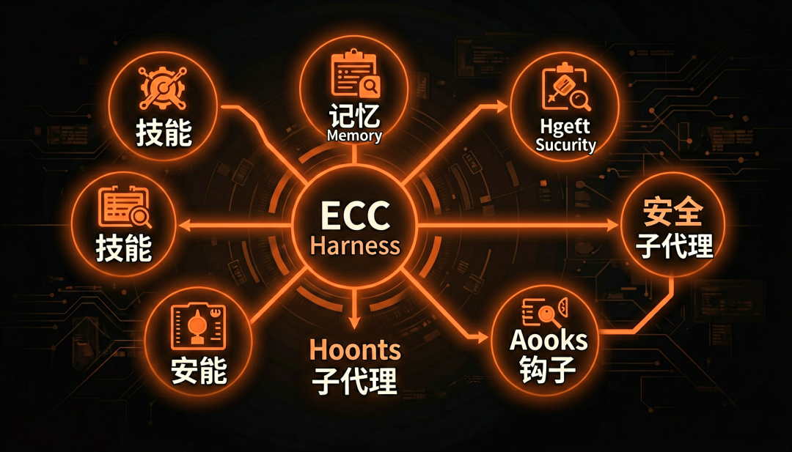
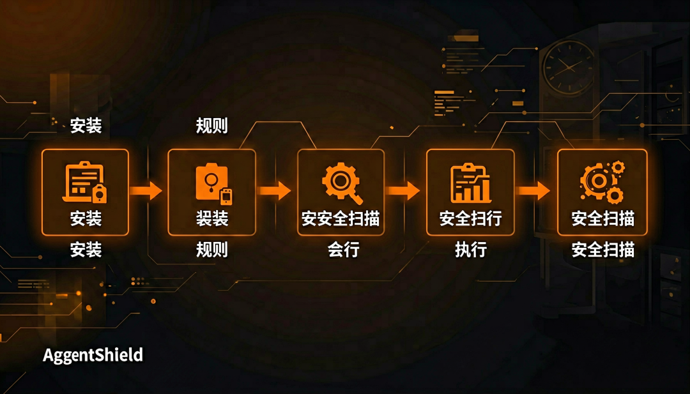
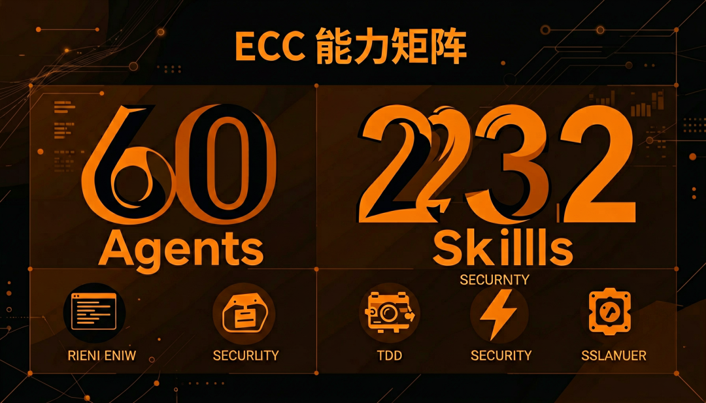
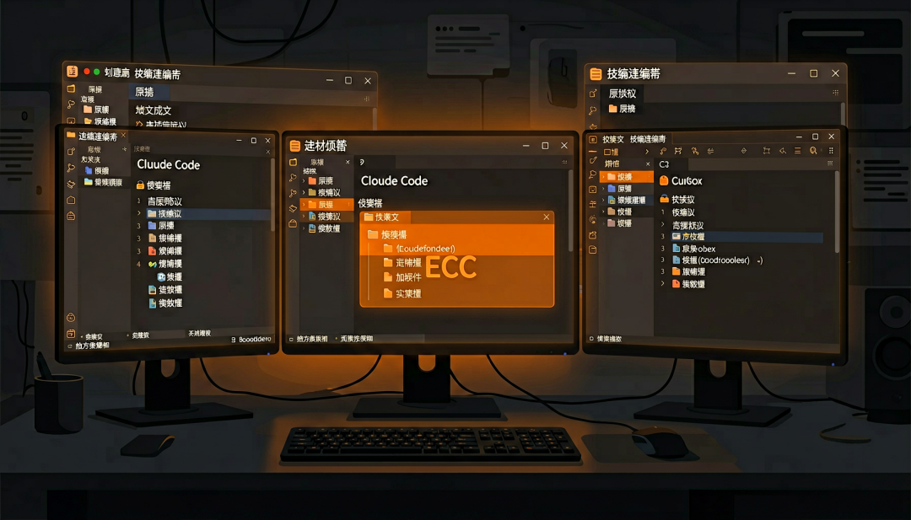
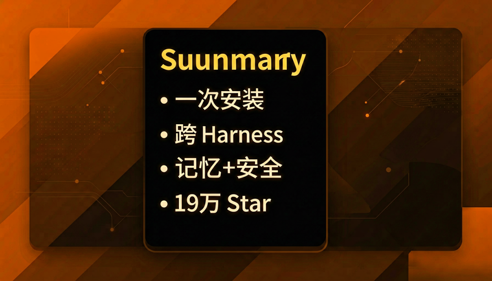

> 📎 来源: [AI武安君](https://mp.weixin.qq.com/s?__biz=MzUxNDkwMTQxMA==&mid=2247484554&idx=1&sn=cfb8ab491cd75a637b66233414f817af&chksm=f8e73d3d9307983ebf7da04163b62033375f7d95dbac562e3b4862fb2fd8f4094e0e3567299a&mpshare=1&scene=1&srcid=0526cgJ5lhAKzE5gqDRx8ldL&sharer_shareinfo=020860b88c42367649b29fd912a05a83&sharer_shareinfo_first=020860b88c42367649b29fd912a05a83) | 时间: 2026-05-26 05:24

---

TECH · TOOLS

# GitHub 炸了：19 万星的 Agent 配置天花板，一天涨 2k+ 星

用大白话讲清 ECC 是什么、为什么突然刷屏，以及你可以转给谁——不是安装教程，是一份「值得收藏」的 Agent 圈见闻。

AI武安君
 /
 AI 工具链

◎ 导 语

如果你今天刷 Agent Trending，大概率会看见同一个名字反复出现：**affaan-m/ECC**。

它今天涨了 **2k+ 颗星**，总 Star 已经 **19 万+**。评论区里有人叫它「Claude Code 圈的配置天花板」，也有人吐槽「又一个巨型仓库」——但数据不会骗人：**愿意点 Star 的人，是在为「Agent 怎么更好用」投票。**

这篇文章只做一件事：**让你 3 分钟搞懂它是什么、为什么火、以及值不值得转给同事。** 不堆命令，不写安装清单。

概念：ECC 把 Skills、记忆、安全装进同一套 Agent 工作台

|  |  |
| --- | --- |
| 01 | / 一句话：ECC 到底是什么？ |

**ECC（Everything Claude Code）不是又一个 ChatGPT 套壳，也不是某家公司的封闭产品。**

你可以把它理解成：

❝ 引用块

"

**一套「让 AI 编程助手更像资深同事」的开源工作台**——里面已经帮你配好了分工、规矩、记忆、安全检查和大量可复用的工作流。

作者 **Affaan Mustafa** 曾用 Claude Code 拿下 **Anthropic 黑客马拉松**；这套东西在真实项目里磨了 **10 个月以上**，MIT 开源，**Claude Code、Cursor、Codex、OpenCode** 等主流工具都能接。

所以它火，不是因为「又多了几个配置文件」，而是因为很多人终于找到一种说法：

|  |  |
| --- | --- |
| 02 | / 为什么突然刷屏？四个真实理由 |

**1. 它戳中了所有人的痛：Agent 越用越「健忘」**

很多人用 Agent 的真实体验是：

• 昨天讲过的项目背景，今天又要重讲一遍

• 装了一堆 MCP，上下文却越用越短

• 改完代码心里没底，不知道有没有踩安全雷

ECC 想解决的就是这类 **Harness（执行环境）** 问题——不是让模型更聪明，而是让 **协作方式更稳**。

**2. 数字很夸张，但背后有「可感知的分量」**

仓库里大致是这些量级（会持续更新）：

|  |  |
| --- | --- |
| 你得到什么 | 直观感受 |
| **60 个专用 Agent** | 像提前雇好了一支小队：有人专门规划、有人专门 Review、有人专门修构建错误 |
| **232 个 Skill** | 像一本「遇到这种情况就这么干」的操作手册，不用每次从零写 prompt |
| **跨工具通用** | 换 IDE 不必从零搭一套规矩 |
| **自带安全扫描** | 黑客松作品 AgentShield 也在这条链路里，少踩「密钥写进配置」的坑 |

这些数字听起来硬核，但分享时的潜台词往往更简单：

**「有人帮我把 Agent 的最佳实践打包好了，我不用自己摸索半年。」**

**3. 它是「开源界的样板间」**

ECC 长期挂在 Trending，很像当年大家转发 **awesome-xxx** 列表——

• 新手：先收藏，知道「正经玩法长什么样」

• 老手：挑自己需要的模块，改一改变成团队规范

• 管理者：拿去当内部 Agent 治理的参考架构

**收藏 ≠ 立刻全装。** 很多人 Star 它，是为了「有个标准答案可以对齐」。

**4. 故事好听：黑客松冠军 + 19 万 Star 的反差**

技术圈愿意传播的项目，通常满足两点：

1. **有结果**（黑客松、真实产品、长期维护）

2. **有争议也有共识**（有人嫌大，有人觉得是天花板）

ECC 正好落在「争议带来讨论、讨论带来传播」的甜区——**非常适合转给「也在折腾 AI 编程」的朋友，聊一句「你试过 ECC 没？」**

流程：从「个人摸索」到「有章法的 Agent 协作」

|  |  |
| --- | --- |
| 03 | / 和普通「配置文件」有啥不一样？ |

很多人第一次会误会：「不就是一堆 Markdown 吗？」

差别在于 **它管的是整条工作流**，而不只是一段 system prompt：

• **Skills**：遇到「写测试」「做 Code Review」「部署」这类事，有现成套路

• **记忆**：会话之间能留下上下文，少做「复读机式」重复解释

• **持续学习**：能从你的使用习惯里提炼模式（Instinct），越用越贴你的团队

• **安全**：不只靠自觉，配置、Hook、密钥风险会被扫一遍

换句话说：

**配置文件告诉你「怎么说」；ECC 更像在帮你搭「怎么长期一起干活」。**

特性：像一支分工明确的 Agent 小队，而不是单打独斗

|  |  |
| --- | --- |
| 04 | / 值得转发的三个场景（附话术） |

**转给同事 / 技术群**

**话术：** GitHub 今天有个叫 ECC 的项目一天涨了 2k+ 星，19 万 Star。不是模型，是 Agent 工作台——带记忆、安全扫描和一堆现成 Skill。你用 Claude Code 或 Cursor 可以瞄一眼仓库 affaan-m/ECC。

**转给正在带团队的人**

**话术：** 我们在纠结 Agent 怎么规范化，这个仓库像开源样板间：分工、Review、安全都有。先收藏对齐认知，比各自瞎配 MCP 省事。

**转给「只想跟上热点」的朋友**

**话术：** Anthropic 黑客松冠军做的 Agent 配置合集，今天 Trending 第一梯队。看不懂安装没关系，当「AI 编程圈本周必看」就行。

|  |  |
| --- | --- |
| 05 | / 谁现在就该关注？谁可以只收藏？ |

**建议现在就看一眼的人：**

• 每天用 Claude Code / Cursor / Codex 写代码

• 团队里已经开始用 Agent，但缺少统一规范

• 担心密钥、Hook、MCP 配太野带来风险

**可以只 Star 收藏、不必急着上手的人：**

• 还在观望 AI 编程，想先知道「正经玩法」

• 已有成熟内部规范，只需要借鉴其中一两个模块

官方文档也提醒：**别一口气全装**——这和「看懂它是什么」并不矛盾。先理解、再按需取用，才是大多数人该有的节奏。

|  |  |
| --- | --- |
| 06 | / 和 pi、OpenClaw 怎么理解？（不站队，只帮你少踩坑） |

• **ECC**：偏「成熟套路 + 团队规范 + 安全默认值」，适合想快速对齐行业最佳实践

• **pi**：偏「极简底座，你自己搭扩展」，适合想深度定制 Agent 形态

• **OpenClaw**：偏「装好就能用的产品体验」，很多建立在 pi 这类底座之上

三者不是非此即彼。分享时可以说：

**「ECC 像是开源界的 Agent 运营手册；pi 像是发动机；产品则是整车。」**

场景：不同工具，可以共用同一套「协作观念」

总结：搞懂 ECC 是什么，比急着安装更重要

|  |  |
| --- | --- |
| ★ 总 结 | GitHub 上的 Star，有时候代表「代码多好」，更多时候代表 **「多少人觉得这个东西讲清了他们的困惑」**。 ECC 今天涨 2k+ 星，背后是一个很朴素的共识： > 大家不想再一个人跟 Agent 反复磨合了，想要一套能分享、能讨论、能对齐的公共答案。 如果你也是这么想的——把这篇转给那个还在闷头配 MCP 的同事，比让他今晚熬夜看安装文档更有用。 |

**仓库：** affaan-m/ECC（GitHub）  
**安全工具：** affaan-m/agentshield

\*本文由 AI武安君根据开源资料与 Agent 数据整理，侧重项目解读与传播视角，不构成官方文档或安全合规承诺。\*
