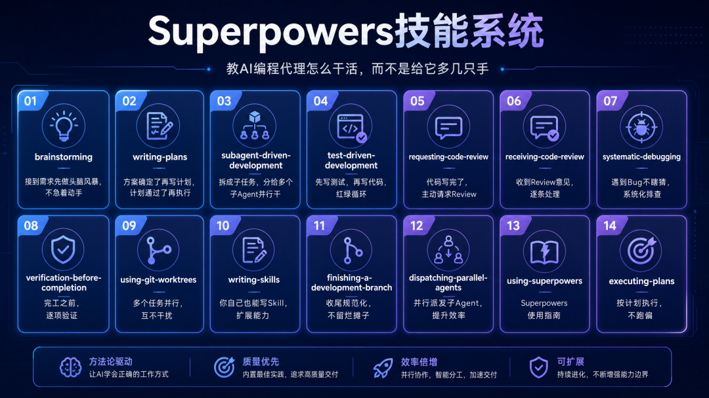
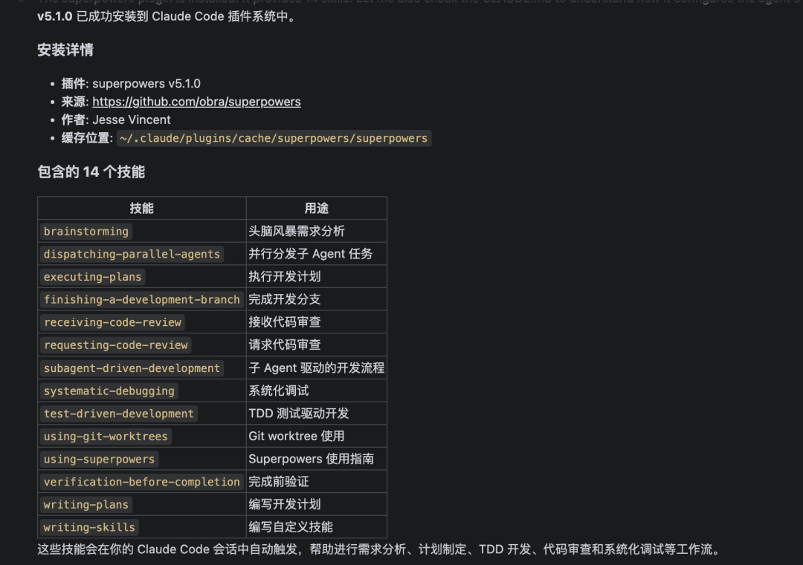
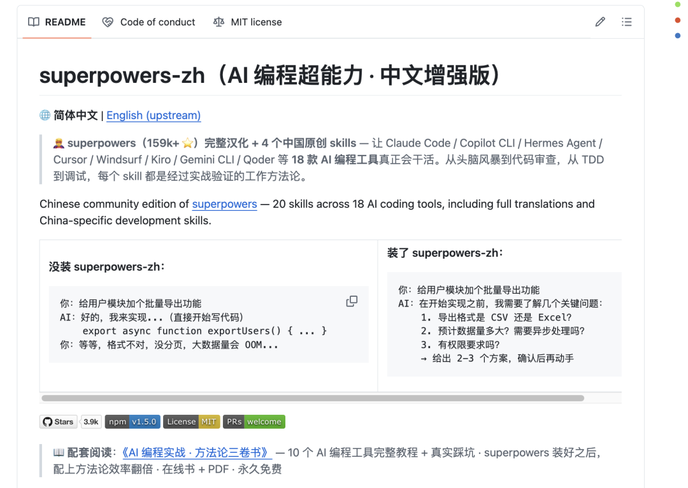
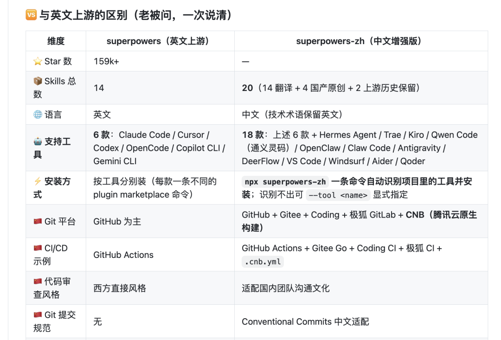

> 📎 来源: [智能进化Wayen](https://mp.weixin.qq.com/s?__biz=MzkzNDY1NzQ0Mg==&mid=2247488099&idx=1&sn=8cd50b6ffbf3fff9edeb7a0c324aa5a4&chksm=c36334d4ed7b0a4e396c5e2bdddd06cb960c53053f3d279b82e55387feec9e26031fd24e4372&mpshare=1&scene=1&srcid=0529YQVObhC9kvJS1ChFHLDA&sharer_shareinfo=7f4ec087ef866cc6a00fe79455b7c6a8&sharer_shareinfo_first=7f4ec087ef866cc6a00fe79455b7c6a8) | 时间: 2026-05-29 12:03

---

↑阅读之前记得关注+星标，每天第一时间接收更新


上周有个朋友问我：你天天用Claude Code写代码，它到底能帮你干多少活？

我想了想说：大概60%。

剩下的40%，不是它不想干，是它不知道怎么干。我举了个例子——让它给用户模块加个批量导出功能，它上来就写，写到一半发现没考虑分页，改。改完发现大文件会OOM，再改。改完发现格式不对，再改。一个功能改了三轮，Token烧了小一万，上下文乱成一锅粥。

我朋友说：这不跟我带的新人一样吗？有热情没章法。

我说：对。但我后来找到了解法，不是换模型，不是调参数，而是装了一个插件。

装完之后，同一个需求，Claude Code先问了我三个问题——导出格式、数据量、权限要求。我回答完，它出了两个方案让我选。我选了一个，它先写测试再写实现，写完自动Review一遍。一次过。

这个插件叫Superpowers。GitHub上159K颗星。（写代码必备）


## 它不是插件，是一套"干活的方法论"



很多人以为Superpowers是个工具包，装了就多几个功能。那肯定不是。

Superpowers是一套**技能系统**。它教你的AI编程代理怎么干活，而不是给它多几只手。

它包含14个技能，覆盖了软件开发的全流程：

| 技能 | 干什么用 |
| --- | --- |
| brainstorming | 接到需求先做头脑风暴，不急着动手 |
| writing-plans | 方案确定了再写计划，计划通过了再执行 |
| subagent-driven-development | 拆成子任务，分给多个子Agent并行干 |
| test-driven-development | 先写测试，再写代码，红绿循环 |
| requesting-code-review | 代码写完了，主动请求Review |
| receiving-code-review | 收到Review意见，逐条处理 |
| systematic-debugging | 遇到Bug不瞎猜，系统化排查 |
| verification-before-completion | 完工之前，逐项验证 |
| using-git-worktrees | 多个任务并行，互不干扰 |
| writing-skills | 你自己也能写Skill，扩展能力 |
| finishing-a-development-branch | 收尾规范化，不留烂摊子 |
| dispatching-parallel-agents | 并行派发子Agent，提升效率 |
| using-superpowers | Superpowers使用指南 |
| executing-plans | 按计划执行，不跑偏 |



每个技能都是一套经过实战验证的工作流程。你的AI编程代理学了这些，就不再是"你问它答"的被动工具，而是一个有方法、有节奏、有质量意识的协作者。

## 装了和没装，差别有多大

我拿一个真实场景对比。

**没装Superpowers：**

我说：“给用户模块加个批量导出功能。”

它秒回：“好的，我来实现。”

然后开始写代码。写到一半发现没考虑分页，改。改完发现大文件会OOM，再改。改完发现格式不对，再改。

一个功能改了三轮，我的Token烧了，它的上下文也乱了。

**装了Superpowers：**

我说同样的话。

它说：“在开始之前，我需要了解几个问题：导出格式是CSV还是Excel？预计数据量多大？需要异步处理吗？有权限要求吗？我给出2-3个方案，你确认后再动手。”

我问了它三个问题，它给了两个方案。我选了一个。它先写测试，再写实现，写完自动Review一遍。一次过。

这就是区别。**一个上来就干，一个想清楚了再干。**

## 大多数人都装错了方向

市面上讲AI编程的教程，90%在教你怎么配模型、怎么调参数、怎么选工具。这些当然重要，但真正决定你的AI编程代理能不能干活的，不是这些。

我试过3个不同的模型，调过十几组参数，换来换去发现：Claude还是那个Claude，Codex还是那个Codex。它们不缺能力，缺的是"怎么干"的指令。

这就像你招了一个名校毕业的程序员，学历好、智商高，但你不告诉他项目规范、代码标准、工作流程，他一样干不好。

Superpowers解决的，就是这个问题。

它不是让你的AI更聪明，而是让它知道怎么干活。**从接到任务到交付代码，14个技能定义了每一步该干什么、怎么干、干到什么程度算完。**

## 哪些工具能用

Superpowers的作者Jesse Vincent把它做成了一个跨平台的技能框架。目前官方支持的工具有：

▸Claude Code（我主力用的）

▸Codex CLI（OpenAI家的）▸Codex App、Gemini CLI

▸OpenCode、Cursor、GitHub Copilot CLI、Factory Droid

每个工具的安装方式不同，但核心思路一样：把14个技能装到你的编程代理脑子里。

## Openclaw和Hermes能装吗

能。但需要走中文增强版。

原版Superpowers官方没把Openclaw和Hermes列进支持列表。但有个中文社区版叫**superpowers-zh**，由国内开发者维护，在原版基础上做了完整汉化，新增了4个中国特色技能，并把支持工具扩展到了17款。



其中包括Openclaw和Hermes Agent。

安装方式很简单：

**Hermes Agent：**

|  |
| --- |
| BASH |
| cd /your/project npx superpowers-zh --tool hermes |

**Openclaw：**

|  |
| --- |
| BASH |
| cd /your/project npx superpowers-zh |

它会自动检测你项目里用了哪些工具，把20个技能装到正确位置。识别不出来就用

```
--tool
```

指定。

装完之后，你的Openclaw或Hermes就有了跟Claude Code一样的干活方法论。接任务先想再干，写代码先测再写，写完自己Review。

## 我的安装建议



如果你只用Claude Code，直接在官方市场装原版Superpowers就行：

|  |
| --- |
| 代码 |
| /plugin install superpowers@claude-plugins-official |

如果你同时用多个工具——比如Claude Code写后端、Openclaw写前端、Hermes做自动化脚本——建议装superpowers-zh：

|  |
| --- |
| 代码 |
| npx superpowers-zh |

一条命令，多个工具一次性配齐。

装完之后，记得给你的编程代理一个适应期。前几次对话它可能会多问你几个问题，别嫌烦。它在学习你的偏好。问得越多，后面越顺畅。

## 写在最后

我经常被问到：AI编程代理到底能不能替代程序员？

我的回答是：短期内不能。但AI编程代理加上好的方法论，可以替代一个没有方法论的程序员。

Superpowers就是那个方法论。

它没有让你的AI变得更聪明，只是给了它一套干活的标准动作。就像木匠不会在柜子背面用胶合板，好的编程代理也不该在没搞清楚需求之前就动笔。

试试看。装完之后用一个星期，你会回来告诉我：原来之前那40%，不是AI不行，是没教它怎么干。

**相关链接：**

▸Superpowers原版：github.com/obra/superpowers

▸Superpowers中文增强版：github.com/jnMetaCode/superpowers-zh

▸Claude Code安装：

```
/plugin install superpowers@claude-plugins-official
```

W∞ 智能进化 · 智能驱动 · 无限可能

我把麻烦事研究透，你只管拿去用。我蹚坑，你受益，有用就关注，常看就星标。

AI时代的新工具和野路子，第一时间同步你。

关于作者：Wayen，世界500强企业教练+AI职场提效专家。专注研究AI提效、人才赋能、管理提升，信奉"把重复的事交给AI，把思考的事留给自己"。


