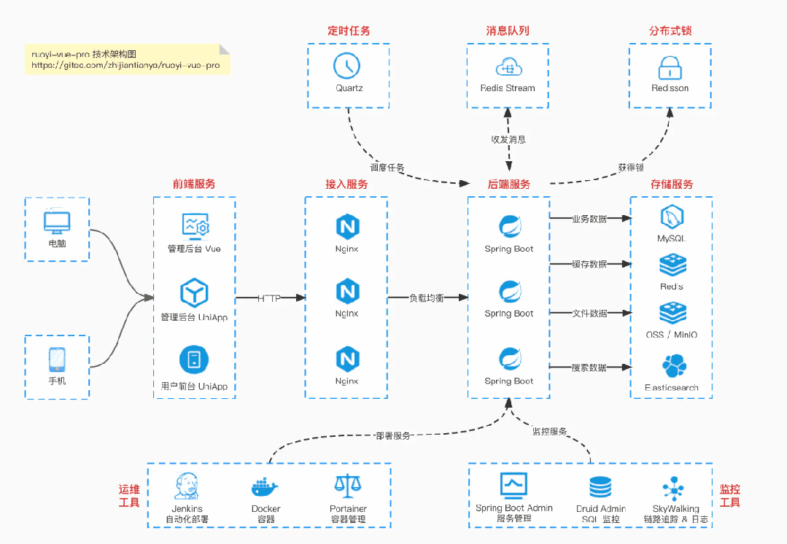
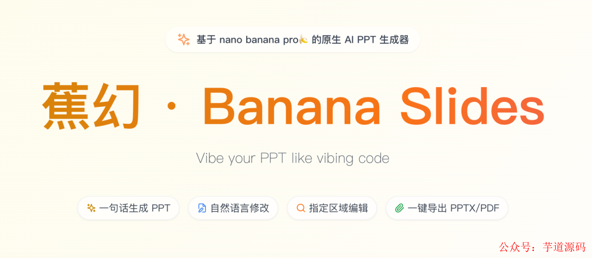
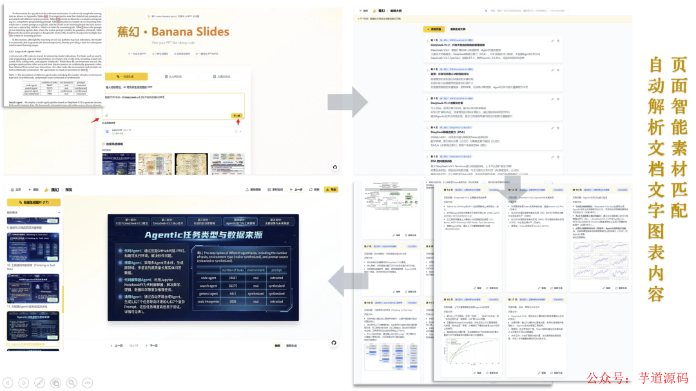
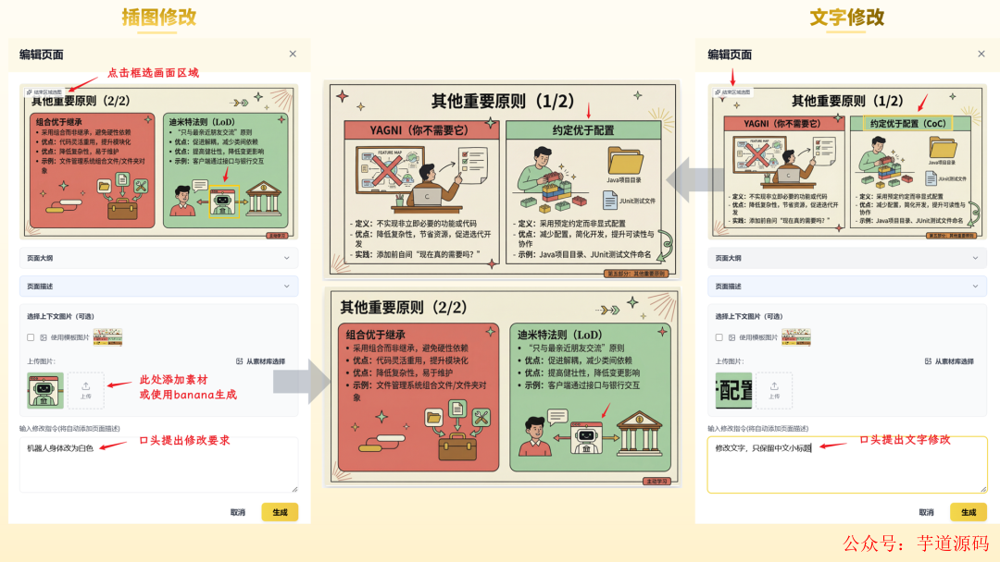
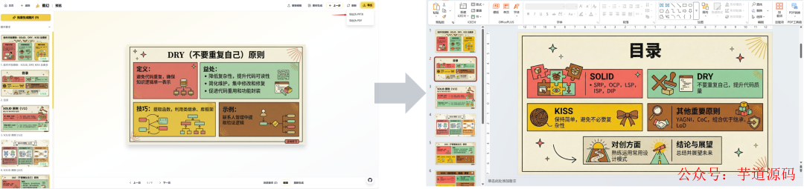
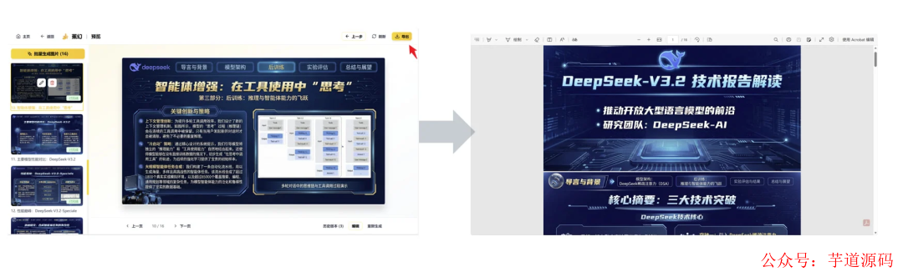
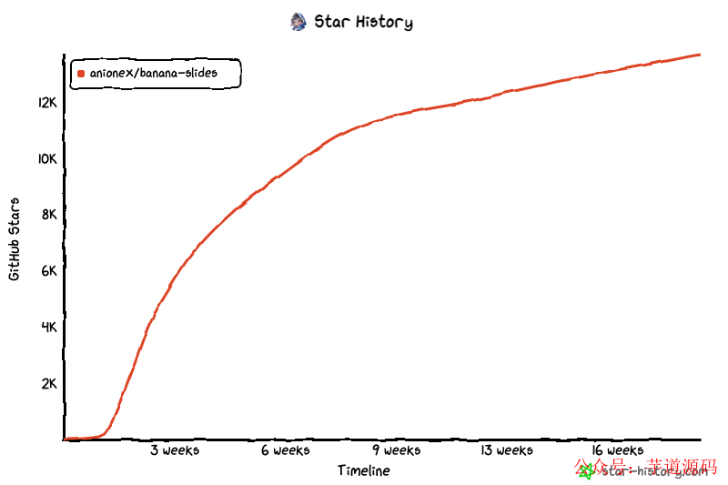
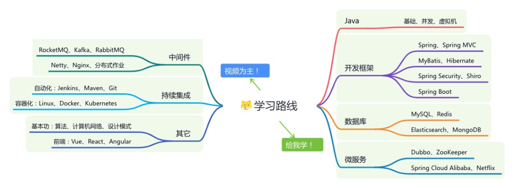

> 📎 来源: [芋道源码](https://mp.weixin.qq.com/s?__biz=MzUzMTA2NTU2Ng==&mid=2247619628&idx=2&sn=099af63c32420b0a5652ab8a140fd62d&chksm=fb456dc438f3a212cdc2f6992cfcbac217f80019b7224b65ef3deebed5caf0b167b5d9fe8f2b&mpshare=1&scene=1&srcid=0424i2zsRCtUG09Cv9nHCLbJ&sharer_shareinfo=ee303e093357742dcc5bb3e5f6f31933&sharer_shareinfo_first=ee303e093357742dcc5bb3e5f6f31933) | 时间: 2026-04-24 11:21

---

> 👉 **这是一个或许对你有用****的社群**

> 🐱 一对一交流/面试小册/简历优化/求职解惑，欢迎加入「**[芋道快速开发平台](http://mp.weixin.qq.com/s?__biz=MzUzMTA2NTU2Ng==&mid=2247576728&idx=1&sn=1298645b025eb51d9078e8c3de7b3c17&chksm=fa4bd329cd3c5a3fd63e455cf39507d3611a7b040be1381fd5ecfc0a7ce3867575fda4b7313d&scene=21#wechat_redirect)**」知识星球。下面是星球提供的部分资料： 

> - [《项目实战（视频）》](http://mp.weixin.qq.com/s?__biz=MzUzMTA2NTU2Ng==&mid=2247576728&idx=1&sn=1298645b025eb51d9078e8c3de7b3c17&chksm=fa4bd329cd3c5a3fd63e455cf39507d3611a7b040be1381fd5ecfc0a7ce3867575fda4b7313d&scene=21#wechat_redirect)：从书中学，往事上**“练”**
> - [《互联网高频面试题》](http://mp.weixin.qq.com/s?__biz=MzUzMTA2NTU2Ng==&mid=2247576728&idx=1&sn=1298645b025eb51d9078e8c3de7b3c17&chksm=fa4bd329cd3c5a3fd63e455cf39507d3611a7b040be1381fd5ecfc0a7ce3867575fda4b7313d&scene=21#wechat_redirect)：面朝简历学习，春暖花开
> - [《架构 x 系统设计》](http://mp.weixin.qq.com/s?__biz=MzUzMTA2NTU2Ng==&mid=2247576728&idx=1&sn=1298645b025eb51d9078e8c3de7b3c17&chksm=fa4bd329cd3c5a3fd63e455cf39507d3611a7b040be1381fd5ecfc0a7ce3867575fda4b7313d&scene=21#wechat_redirect)：摧枯拉朽，掌控面试高频场景题
> - [《精进 Java 学习指南》](http://mp.weixin.qq.com/s?__biz=MzUzMTA2NTU2Ng==&mid=2247576728&idx=1&sn=1298645b025eb51d9078e8c3de7b3c17&chksm=fa4bd329cd3c5a3fd63e455cf39507d3611a7b040be1381fd5ecfc0a7ce3867575fda4b7313d&scene=21#wechat_redirect)：系统学习，互联网主流技术栈
> - [《必读 Java 源码专栏》](http://mp.weixin.qq.com/s?__biz=MzUzMTA2NTU2Ng==&mid=2247576728&idx=1&sn=1298645b025eb51d9078e8c3de7b3c17&chksm=fa4bd329cd3c5a3fd63e455cf39507d3611a7b040be1381fd5ecfc0a7ce3867575fda4b7313d&scene=21#wechat_redirect)：知其然，知其所以然



> 👉**这是一个或许对你有用的开源项目**

> 国产Star破10w的开源项目，前端包括管理后台、微信小程序，后端支持单体、微服务架构

> RBAC权限、数据权限、SaaS多租户、**商城**、支付、工作流、大屏报表、**ERP、CRM**、**AI大模型、IoT物联网**等功能：

> - 多模块：https://gitee.com/zhijiantianya/ruoyi-vue-pro
> - 微服务：https://gitee.com/zhijiantianya/yudao-cloud
> - 视频教程：https://doc.iocoder.cn

> 【国内首批】支持 JDK17/21+SpringBoot3、JDK8/11+Spring Boot2双版本

- [做 PPT 这件事，真的很花时间](https://mp.weixin.qq.com/s?__biz=MzUzMTA2NTU2Ng==&mid=2247487551&idx=1&sn=18f64ba49f3f0f9d8be9d1fdef8857d9&chksm=fa496f8ecd3ee698f4954c00efb80fe955ec9198fff3ef4011e331aa37f55a6a17bc8c0335a8&scene=21&token=899450012&lang=zh_CN#wechat_redirect)
- [banana-slides 是什么](https://mp.weixin.qq.com/s?__biz=MzUzMTA2NTU2Ng==&mid=2247487551&idx=1&sn=18f64ba49f3f0f9d8be9d1fdef8857d9&chksm=fa496f8ecd3ee698f4954c00efb80fe955ec9198fff3ef4011e331aa37f55a6a17bc8c0335a8&scene=21&token=899450012&lang=zh_CN#wechat_redirect)
- [主要功能](https://mp.weixin.qq.com/s?__biz=MzUzMTA2NTU2Ng==&mid=2247487551&idx=1&sn=18f64ba49f3f0f9d8be9d1fdef8857d9&chksm=fa496f8ecd3ee698f4954c00efb80fe955ec9198fff3ef4011e331aa37f55a6a17bc8c0335a8&scene=21&token=899450012&lang=zh_CN#wechat_redirect)
- [和 notebooklm 比一比](https://mp.weixin.qq.com/s?__biz=MzUzMTA2NTU2Ng==&mid=2247487551&idx=1&sn=18f64ba49f3f0f9d8be9d1fdef8857d9&chksm=fa496f8ecd3ee698f4954c00efb80fe955ec9198fff3ef4011e331aa37f55a6a17bc8c0335a8&scene=21&token=899450012&lang=zh_CN#wechat_redirect)
- [技术架构](https://mp.weixin.qq.com/s?__biz=MzUzMTA2NTU2Ng==&mid=2247487551&idx=1&sn=18f64ba49f3f0f9d8be9d1fdef8857d9&chksm=fa496f8ecd3ee698f4954c00efb80fe955ec9198fff3ef4011e331aa37f55a6a17bc8c0335a8&scene=21&token=899450012&lang=zh_CN#wechat_redirect)
- [怎么部署](https://mp.weixin.qq.com/s?__biz=MzUzMTA2NTU2Ng==&mid=2247487551&idx=1&sn=18f64ba49f3f0f9d8be9d1fdef8857d9&chksm=fa496f8ecd3ee698f4954c00efb80fe955ec9198fff3ef4011e331aa37f55a6a17bc8c0335a8&scene=21&token=899450012&lang=zh_CN#wechat_redirect)
- [还在开发中的功能](https://mp.weixin.qq.com/s?__biz=MzUzMTA2NTU2Ng==&mid=2247487551&idx=1&sn=18f64ba49f3f0f9d8be9d1fdef8857d9&chksm=fa496f8ecd3ee698f4954c00efb80fe955ec9198fff3ef4011e331aa37f55a6a17bc8c0335a8&scene=21&token=899450012&lang=zh_CN#wechat_redirect)
- [小结](https://mp.weixin.qq.com/s?__biz=MzUzMTA2NTU2Ng==&mid=2247487551&idx=1&sn=18f64ba49f3f0f9d8be9d1fdef8857d9&chksm=fa496f8ecd3ee698f4954c00efb80fe955ec9198fff3ef4011e331aa37f55a6a17bc8c0335a8&scene=21&token=899450012&lang=zh_CN#wechat_redirect)

---

上周我在 GitHub 上看到一个项目叫 banana-slides，短短几个月收获了大量 Star。我去翻了一下，发现它解决的其实是一个很常见的问题：做 PPT 太麻烦。

这篇文章就来聊聊这个项目，说说它的思路、功能和上手方式。

## [做 PPT 这件事，真的很花时间](https://mp.weixin.qq.com/s?__biz=MzUzMTA2NTU2Ng==&mid=2247576728&idx=1&sn=1298645b025eb51d9078e8c3de7b3c17&scene=21#wechat_redirect)

不管是做汇报、写方案还是交学校作业，PPT 都是逃不开的东西。内容想好了，但排版要花大量时间。字体、对齐、颜色、图文布局，每一步都要手动调整。

现在有不少 AI 生成 PPT 的工具，确实能省事一些，但用下来总有几个问题让人不太满意：

模板是固定的，风格没法怎么调。生成完了也不太好改，多轮修改很麻烦。出来的 PPT 大多看着差不多，没什么个性。图片质量也参差不齐，有时候和内容根本对不上。

简单说，这类工具做出来的东西，快是快，但很难又快又好看。

bana-slides 的作者也有同样的感受，于是他决定自己做一个。

> 基于 Spring Boot + MyBatis Plus + Vue & Element 实现的后台管理系统 + 用户小程序，支持 RBAC 动态权限、多租户、数据权限、工作流、三方登录、支付、短信、商城等功能

> - 项目地址：https://github.com/YunaiV/ruoyi-vue-pro
> - 视频教程：https://doc.iocoder.cn/video/

## [banana-slides 是什么](https://mp.weixin.qq.com/s?__biz=MzUzMTA2NTU2Ng==&mid=2247576728&idx=1&sn=1298645b025eb51d9078e8c3de7b3c17&scene=21#wechat_redirect)

bana-slides（完整名字 banana-slides）是一个基于 Google **Gemini nano banana pro** 模型的 PPT 生成应用。它完全开源，代码放在 GitHub 上，支持自部署。



作者在 README 里解释了为什么要做这个工具。他试过用 Gemini nano banana pro（也就是项目名字里的 🍌）来直接生成 PPT 页面，发现效果出乎意料地好：图文布局自然、风格统一、文字精确。于是他就以此为核心，搭了这套 PPT 生成系统。

和其他 AI PPT 工具最不一样的地方在于：**这个项目把图片生成能力直接用在了每一张幻灯片上，而不是先生成内容再套模板。每一页都是一张图，风格天然统一。**

> 基于 Spring Cloud Alibaba + Gateway + Nacos + RocketMQ + Vue & Element 实现的后台管理系统 + 用户小程序，支持 RBAC 动态权限、多租户、数据权限、工作流、三方登录、支付、短信、商城等功能

> - 项目地址：https://github.com/YunaiV/yudao-cloud
> - 视频教程：https://doc.iocoder.cn/video/

## [主要功能](https://mp.weixin.qq.com/s?__biz=MzUzMTA2NTU2Ng==&mid=2247576728&idx=1&sn=1298645b025eb51d9078e8c3de7b3c17&scene=21#wechat_redirect)

#### [三种起步方式](https://mp.weixin.qq.com/s?__biz=MzUzMTA2NTU2Ng==&mid=2247576728&idx=1&sn=1298645b025eb51d9078e8c3de7b3c17&scene=21#wechat_redirect)

你可以用三种方式来开始做 PPT：

1. **一句话** ：说个主题，AI 自动出大纲和每页内容

2. **大纲** ：先写大纲，再逐步填充页面内容

3. **页面描述** ：直接写每页要放什么，控制粒度更细

三种方式都支持自然语言修改。比如你想改某页，可以直接说"把第三页换成案例分析"，AI 会根据你的指令重新生成。


#### [素材上传与智能解析](https://mp.weixin.qq.com/s?__biz=MzUzMTA2NTU2Ng==&mid=2247576728&idx=1&sn=1298645b025eb51d9078e8c3de7b3c17&scene=21#wechat_redirect)

你可以上传文件，系统会自动读取内容。支持 PDF、Word（.docx）、Markdown、纯文本这几种格式。

上传后，系统会提取文件里的关键信息、图片链接和图表说明，作为生成 PPT 的参考材料。

另外，你也可以上传一张参考图片，告诉系统你想要什么风格。比如上传一个你喜欢的 PPT 截图，AI 就会按照这个风格来出页面。



#### [口头修改指定区域](https://mp.weixin.qq.com/s?__biz=MzUzMTA2NTU2Ng==&mid=2247576728&idx=1&sn=1298645b025eb51d9078e8c3de7b3c17&scene=21#wechat_redirect)

这是这个项目比较有意思的地方。生成好页面之后，如果你对某个区域不满意，可以框选那个部分，然后直接用文字描述要怎么改。比如"这里换成饼图"或者"文字改大一点"。

整个修改流程不需要点复杂的菜单，直接说话就行。作者把这种交互方式叫做"Vibe 式编辑"。



#### [导出为 PPTX 和 PDF](https://mp.weixin.qq.com/s?__biz=MzUzMTA2NTU2Ng==&mid=2247576728&idx=1&sn=1298645b025eb51d9078e8c3de7b3c17&scene=21#wechat_redirect)

生成好之后，可以直接导出为标准的 PPTX 文件或 PDF 文件。默认是 16:9 的比例，不需要再手动调整尺寸。

值得一提的是，项目还在做一个"可自由编辑的 PPTX 导出"功能（目前是 Beta 阶段）。这个功能会把生成的每张幻灯片图片里的文字和布局还原成可以在 PowerPoint 里直接编辑的格式，字体大小、颜色、加粗等样式也会尽量保留。





## [和 notebooklm 比一比](https://mp.weixin.qq.com/s?__biz=MzUzMTA2NTU2Ng==&mid=2247576728&idx=1&sn=1298645b025eb51d9078e8c3de7b3c17&scene=21#wechat_redirect)

Google 的 notebooklm 也有幻灯片生成功能，下面是两个工具的简单对比：

| 功能 | notebooklm | banana-slides |
| --- | --- | --- |
| 页数上限 | 15 页 | 无限制 |
| 二次编辑 | 提示词修改 | 框选编辑 + 口头编辑 |
| 素材添加 | 生成后不能再加 | 生成后可以继续加 |
| 导出格式 | PDF、不可编辑的 PPTX | PDF、可编辑或图片版 PPTX |
| 水印 | 免费版有水印 | 无水印，元素可以自由增减 |

两者定位不完全一样，notebooklm 更侧重于知识整理，banana-slides 则专门为 PPT 生成设计。如果你只是需要从一个长文档快速生成几页幻灯片，notebooklm 够用。但如果你要做有风格感的 PPT，想要更多控制权，banana-slides 更合适。

## [技术架构](https://mp.weixin.qq.com/s?__biz=MzUzMTA2NTU2Ng==&mid=2247576728&idx=1&sn=1298645b025eb51d9078e8c3de7b3c17&scene=21#wechat_redirect)

项目分前端和后端两部分。

**前端** 用 React 18 + TypeScript 写的，构建工具是 Vite，样式用 Tailwind CSS，状态管理用 Zustand。整体来说是比较标准的现代前端技术栈。

**后端** 是 Python + Flask，AI 调用走的是 Google Gemini API，PPT 文件处理用 python-pptx，图片处理用 Pillow。数据存在 SQLite 里，页面生成是并发执行的，用了 ThreadPoolExecutor 来加速。

代码仓库结构比较清晰，前端在 

```
frontend/
```

 目录，后端在 

```
backend/
```

 目录，各自独立。

## [怎么部署](https://mp.weixin.qq.com/s?__biz=MzUzMTA2NTU2Ng==&mid=2247576728&idx=1&sn=1298645b025eb51d9078e8c3de7b3c17&scene=21#wechat_redirect)

有三种部署方式，按照难度从低到高排列：

#### [方式一：一键部署（最简单）](https://mp.weixin.qq.com/s?__biz=MzUzMTA2NTU2Ng==&mid=2247576728&idx=1&sn=1298645b025eb51d9078e8c3de7b3c17&scene=21#wechat_redirect)

项目支持通过雨云平台一键部署，不需要自己装 Docker 或配置服务器。新用户有 15 天免费试用。进去之后直接创建应用，跟着引导操作就行。

#### [方式二：Docker Compose](https://mp.weixin.qq.com/s?__biz=MzUzMTA2NTU2Ng==&mid=2247576728&idx=1&sn=1298645b025eb51d9078e8c3de7b3c17&scene=21#wechat_redirect)

如果你有服务器，用 Docker 部署是最推荐的方式。官方提供了预构建镜像，直接拉下来就能用：

```
docker compose -f docker-compose.prod.yml up -d
```

主要步骤是：克隆仓库、创建 

```
.env
```

 文件填写 API Key，然后执行上面的命令。前端跑在 3000 端口，后端在 5000 端口。

配置 API Key 推荐用 AIHubMix 这个平台，项目本身是以 Gemini 接口格式为标准的，用这个平台可以减少一些迁移成本。

需要注意：**Gemini nano banana pro 模型的 API 调用费用比较高** ，在正式大量使用之前，最好先估算一下成本。

#### [方式三：源码部署](https://mp.weixin.qq.com/s?__biz=MzUzMTA2NTU2Ng==&mid=2247576728&idx=1&sn=1298645b025eb51d9078e8c3de7b3c17&scene=21#wechat_redirect)

如果你想改代码或者做二次开发，可以从源码部署。环境要求是 Python 3.10 以上、Node.js 16 以上，还有 uv 这个 Python 包管理器。

后端启动命令：

```
cd backend        uv run alembic upgrade head && uv run python app.py
```

前端另起一个终端，进入 

```
frontend/
```

 目录安装依赖后启动即可。

## [还在开发中的功能](https://mp.weixin.qq.com/s?__biz=MzUzMTA2NTU2Ng==&mid=2247576728&idx=1&sn=1298645b025eb51d9078e8c3de7b3c17&scene=21#wechat_redirect)

看了一下项目的开发计划，还有几个功能在做：

- 更完整的可编辑 PPTX 导出（支持多层次抠图）
- 网络搜索能力（生成 PPT 时可以联网查资料）
- Agent 模式
- 在线播放功能
- 页面切换动画

目前版本已经有不少可用的功能，并且更新频率不低。仓库的 Star 增长曲线也比较稳。



## [小结](https://mp.weixin.qq.com/s?__biz=MzUzMTA2NTU2Ng==&mid=2247576728&idx=1&sn=1298645b025eb51d9078e8c3de7b3c17&scene=21#wechat_redirect)

bana-slides 这个项目的核心思路是：直接用图片生成模型来做每一张幻灯片，不套模板，风格自然统一。这个方向和传统 AI PPT 工具差别还挺大的。

当然也有一些限制要提一下：Gemini nano banana pro 模型的 API 费用不低，免费额度用完就需要付费了。另外，可编辑 PPTX 导出功能现在还在迭代，效果不完全稳定。

如果你愿意自己折腾一下，这个工具是值得试试的。代码是开源的，部署方式也挺多，文档也有中英文版本。

**GitHub 地址** ：*https://github.com/Anionex/banana-slides*

**在线 Demo** ：*https://bananaslides.online/*

---

欢迎加入我的知识星球，全面提升技术能力。

👉 加入方式，**“**长按**”或“**扫描**”下方二维码噢**：


星球的**内容包括**：项目实战、面试招聘、源码解析、学习路线。





```
文章有帮助的话，在看，转发吧。谢谢支持哟 (*^__^*）
```
