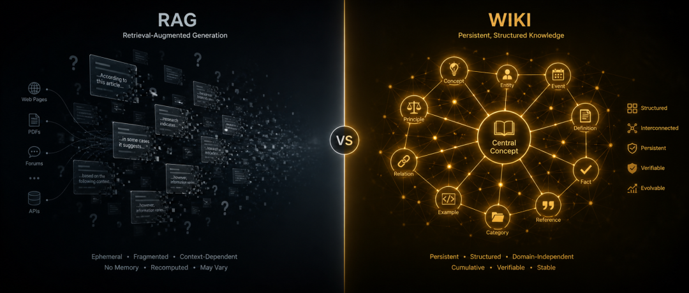
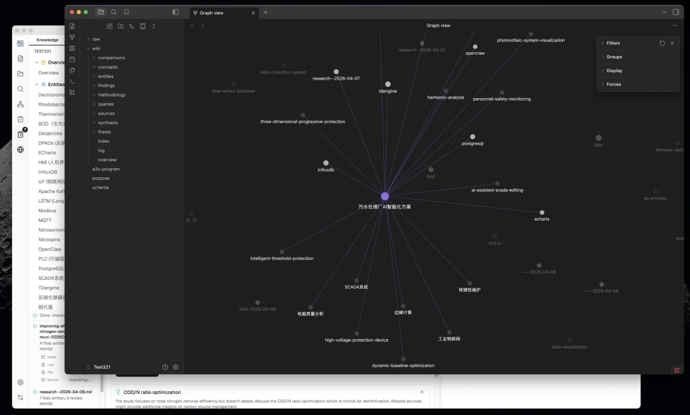
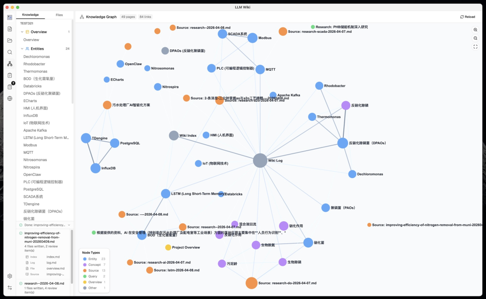
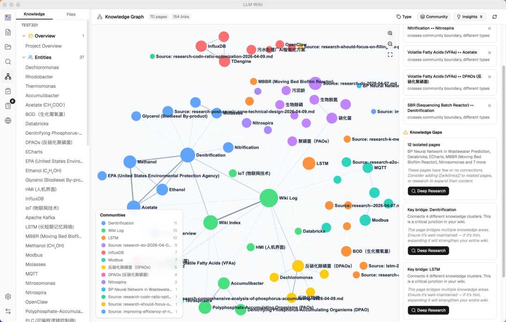
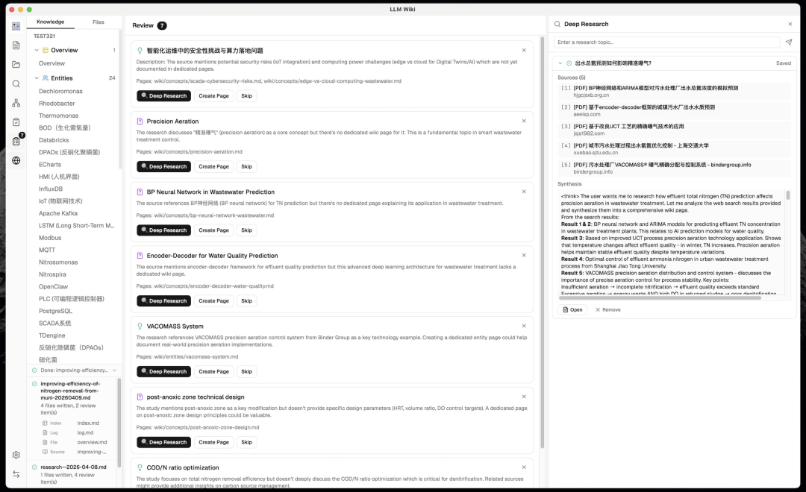
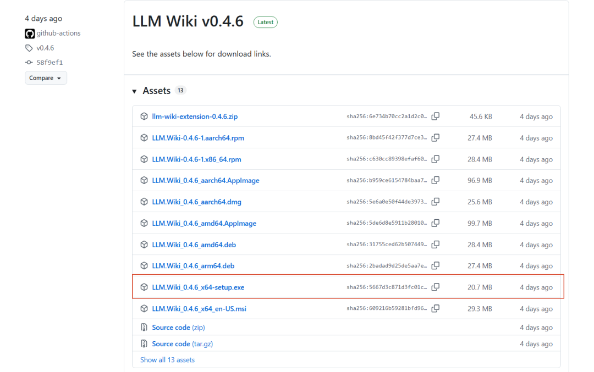
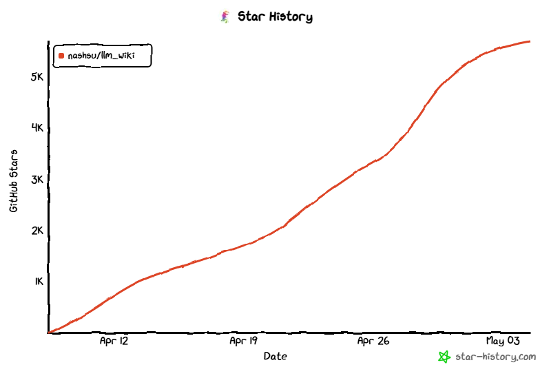

> 📎 来源: [顾北 AI](https://mp.weixin.qq.com/s?__biz=Mzg5ODk3NDc3MA==&mid=2247488901&idx=1&sn=01c19107603748b31626d628982c2bbe&chksm=c1f10df32b165ad3034602661aeec9c0cb77ded90893712d8a27038d6ffe227add982d6d2ce9&mpshare=1&scene=1&srcid=05117P57097xs9CExGGRxkcU&sharer_shareinfo=0340c3b68fc717ecb2991017f63bfec2&sharer_shareinfo_first=0340c3b68fc717ecb2991017f63bfec2) | 时间: 2026-05-11 00:00

---

> **摘要**：有个开源项目悄悄把 Andrej Karpathy 的 LLM Wiki 设计模式做成了全功能桌面应用，Stars 已经 5.8k+。它解决的不是"怎么问 AI 问题"，而是"怎么让 AI 帮你把知识真正积累下来"。

你有没有发现一个规律：用 RAG 搭的 AI 知识库，用了半年之后，跟第一天用起来感觉没什么区别？

文档还是那些文档，答案还是每次从零推理，知识没有在积累，连接没有在形成。你用得越久，反而越觉得它只是个"更贵的搜索引擎"。

这个问题 Karpathy 去年就想到了，他写了一篇设计文档，描述了一种完全不同的思路——用 LLM **持续构建并维护**一个结构化的个人 Wiki。这篇文章和推文详细的介绍看这篇文章就行：👉【[狂揽58.9k star，Karpathy一条推文，一个CLAUDE.md文件，让你的Claude Code聪明数倍。](https://mp.weixin.qq.com/s?__biz=Mzg5ODk3NDc3MA==&mid=2247488633&idx=1&sn=2b3c83401fccea571475934df7ad5f46&scene=21#wechat_redirect)】

文档写的虽然很优雅，但是是基于抽象设计出来的，并没有实现，总感觉差一点意思。

直到这几天，我看到 LLM Wiki 这个项目。


---

## RAG 和 LLM Wiki，本质上是两种不同的哲学

先把这个区别说清楚，因为理解了这个，后面所有功能都好理解了。

**传统 RAG 的逻辑**是这样的：

```
用户提问 → 向量检索相关段落 → LLM 基于段落临时生成答案 → 结束
```

每次对话都是从零开始，互相独立。知识没有积累，上下文没有沉淀，不管你用了多久，系统对你领域的"理解"不会比第一天更深。

**LLM Wiki 的逻辑**是另一套：

```
导入文档 → LLM 两步分析+生成 → 结构化 Wiki 页面持久存储                                         ↓用户提问 → 多相位检索（关键词+图谱扩展+可选向量）→ 基于已编译知识库回答
```

区别在于：**知识是被"编译"过的**。LLM 读完你的文档后，不是直接存下来备查，而是先消化、分析、生成结构化的 Wiki 页面——带 YAML frontmatter、带 

```
[[wikilink]]
```

 交叉引用、有来源追溯，然后这个 Wiki 会持续被维护和更新。

用得越久，Wiki 越丰富，知识网络越稠密，回答质量越高。这跟"用了半年感觉一样"的 RAG 是根本不同的产品。



---

## 两步思维链摄取：先分析，再生成

这是 LLM Wiki 对 Karpathy 原始设计最关键的工程改进之一。

Karpathy 的原始设计里，LLM 读完文档就直接写 Wiki 页面——一步到位。LLM Wiki 把这个过程拆成了串行的两个 LLM 调用：

**第一步（分析）**：

- 提取关键实体、概念、论点
- 识别与现有 Wiki 内容的连接点
- 发现矛盾和知识张力
- 给出 Wiki 结构建议

**第二步（生成）**：

- 基于分析结果生成带 frontmatter 的来源摘要页
- 生成实体页、概念页（含交叉引用）
- 更新 

  ```
  index.md
  ```

  、

  ```
  log.md
  ```

  、

  ```
  overview.md
  ```
- 标记需要人工判断的 Review 项目

这个设计很合理——先让 LLM 想清楚再写，比边读边写质量好得多。另外还有 SHA256 增量缓存：文件内容没变就自动跳过，不浪费 token。



---

## 4 信号知识图谱：比向量相似度更聪明

这是我觉得技术含量最密集的部分。

它没有用单纯的向量相似度来判断页面之间的关联，而是建了一个带权重的知识图谱，用四个信号综合计算相关性：

| 信号 | 权重 | 含义 |
| --- | --- | --- |
| 直接 `[[wikilink]]` | ×3.0 | 显式引用，最强信号 |
| 来源重叠（同一文档衍生） | ×4.0 | 同源内容天然高度相关 |
| Adamic-Adar（共同邻居权重） | ×1.5 | 通过共同节点推断间接关联 |
| 类型亲和（同类型页面） | ×1.0 | 实体对实体、概念对概念 |

这比纯向量检索要聪明：两篇都来自同一本书的页面，哪怕语义上看起来不相似，系统也知道它们之间的联系很强（来源重叠权重最高，×4.0）。

在图谱基础上还跑了 **Louvain 社区检测算法**，自动把你的知识库聚类——发现哪些内容自然成一组，并给每个聚类打"凝聚度分数"。低凝聚度的聚类会被标记，意思是这个知识领域的内容还比较松散，可以有意识地补充。



---

## 图谱洞察：知识库主动告诉你哪里有盲区

这个功能我觉得是整个产品里最有意思的设计理念。

系统会自动分析图谱结构，找出两类东西：

**令人惊喜的连接**：

- 跨社区的边（不同知识聚类之间意外相连的节点）
- 跨类型的链接（实体页连到概念页的非常规关联）
- 外围节点连到核心节点的意外联系

**知识盲区**：

- **孤立页面**：连接少于 1 的页面，说明这个知识点还没有融入知识网络
- **稀疏社区**：凝聚度低于 0.15 且有 3 个以上页面的聚类
- **桥接节点**：同时连接 3 个以上知识聚类的关键节点

发现桥接节点或知识盲区之后，可以一键触发**深度研究**：系统读取你的 

```
overview.md
```

 和 

```
purpose.md
```

（你定义知识库目标的文件），让 LLM 生成针对你领域的专项搜索查询，调用 Tavily API 搜索，合成后自动入库。

整个闭环是：**知识库自己发现自己哪里不够，然后去学习，然后把新内容消化进来**。这个设计思路我认为是这个项目最接近 Karpathy 原始愿景的地方。



---

## 查询：多相位检索，不止是向量

LLM Wiki 的查询走四个阶段：

**Phase 1：分词搜索**英文按词切分+停用词过滤，中文用 CJK 双字符分词（"知识库" → ["知识", "识库", "库"]），标题匹配有额外加分。同时搜索 

```
wiki/
```

 和 

```
raw/sources/
```

。

**Phase 1.5（可选）：向量语义搜索**通过 LanceDB（Rust 嵌入）存向量，走 cosine 相似度，找关键词搜索找不到的语义相关内容。官方给了个数据：开启向量搜索后，综合召回率从 \*\*58.2% 提升到 71.4%\*\*。不是必须的，但值得开。

**Phase 2：图谱扩展**以搜索结果为种子，用 4 信号模型找相关页面，支持 2 跳遍历。

**Phase 3：预算控制**可配置 4K 到 1M tokens 的上下文窗口，按 60% wiki 页面 / 20% 对话历史 / 5% 索引 / 15% 系统提示的比例分配。

这套检索逻辑组合起来，比单纯"向量找最相似"要全面得多。



---

## 技术栈：Tauri + React 19

桌面端用 Tauri v2（Rust 后端），前端 React 19 + TypeScript + Vite，UI 用 shadcn/ui + Tailwind CSS v4，知识图谱可视化用 sigma.js + graphology + ForceAtlas2。

文件格式支持得相当全：PDF、DOCX、PPTX、XLSX/XLS/ODS、图片、视频/音频，还有个 Chrome 插件一键剪辑网页入库（基于 Mozilla Readability.js + Turndown.js，效果比自己手动复制好很多）。

LLM 提供商支持 OpenAI、Anthropic、Google、Ollama 和自定义端点。本地模型的同学也能用，不强依赖云服务。

Wiki 目录完全兼容 Obsidian，会自动生成 

```
.obsidian/
```

 配置文件，如果你已经是 Obsidian 用户，切换成本很低。

---

## 如何安装

### 预编译二进制文件

从 Releases 下载：

- **macOS**：`.dmg`（Apple Silicon + Intel）
- **Windows**：`.msi`
- **Linux**：`.deb` / `.AppImage`



### 从源码构建

```
# 前置条件：Node.js 20+, Rust 1.70+git clone https://github.com/nashsu/llm_wiki.gitcd llm_wikinpm installnpm run tauri dev      # 开发模式npm run tauri build    # 生产构建
```

### Chrome 扩展

1. 打开 `chrome://extensions`
2. 启用「开发者模式」
3. 点击「加载已解压的扩展程序」
4. 选择 `extension/` 目录

## 快速开始

1. 启动应用 → 创建新项目（选择模板）
2. 进入 **设置** → 配置 LLM 提供商（API 密钥 + 模型）
3. 进入 **资料源** → 导入文档（PDF、DOCX、MD 等）
4. 观察 **活动面板** —— LLM 自动构建 Wiki 页面
5. 使用 **聊天** 查询你的知识库
6. 浏览 **知识图谱** 查看关联
7. 查看 **审核** 处理需要你关注的项目
8. 定期运行 **Lint** 维护 Wiki 健康度

## 适合什么人？说实话

这个工具不是给所有人用的。上手有成本，需要你：

- 有一堆文档、论文、书籍、网页需要认真管理
- 愿意花时间初始化配置（LLM 提供商、purpose.md、schema.md）
- 接受知识库是逐渐积累的过程，不是导入完就立刻成型

如果你是以下场景，我觉得认真值得试试：

✅ **研究者/学生**：大量论文需要管理，想建立自己的领域知识图谱

✅ **知识工作者**：有大量行业资料，想要能"聊天"的知识库而不只 是文件夹

✅ **Obsidian 重度用户**：有维护 Vault 的习惯，想让 AI 自动维护 Wiki 内容

✅ **开发者**：对 Karpathy 的 LLM Wiki 模式感兴趣，想要一个直接可用的完整实现

不太适合：只想随手问几个问题的普通用户，这种场景 ChatGPT 就够了，没必要为此搭一套知识库。

---

## 数据和状态

目前 GitHub Stars 5.8k+，Forks 700+，从 2026 年 4 月建仓，不到一个月已经发布了 23 个版本，迭代速度很快。最新是 v0.4.6（2026-05-01），还在活跃开发中。

有预构建包直接下载，macOS（ARM + Intel）、Windows（.msi）、Linux（.deb / .AppImage）都有，不需要自己编译，装 Node.js + Rust 再跑半小时 build。

项目地址：**https://github.com/nashsu/llm\_wiki**



---

说一个我觉得这个项目最核心的洞见：**知识不应该只是被检索，而应该被编译和积累。**

RAG 解决的是"找得到"的问题，LLM Wiki 解决的是"真正懂了"的问题。这是不同层次的目标，不是竞争关系，但很多人把前者当成了后者的解法。

Karpathy 写那篇设计文档的时候说，他想要一个工具，能把他读过的所有东西编译成一个活着的 Wiki。这个愿景现在有了一个具体的实现。

你在用什么方式管理自己的知识库？是 RAG 方案、Obsidian、还是 Notion 之类的工具？欢迎评论区聊聊，或者直接去 GitHub 看看这个项目。

我是顾北，关注我，获取更多好玩有趣的开源仓库！

谢谢你阅读我的文章~

我们下期再见！

PS：本文部分内容由AI辅助创作
