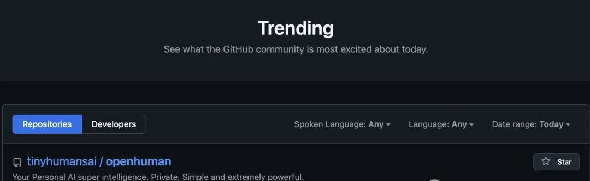
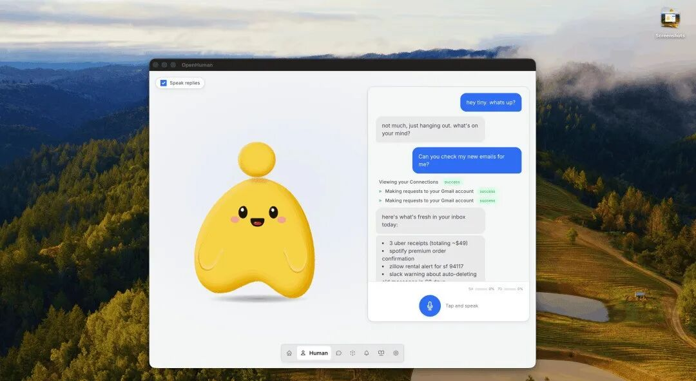
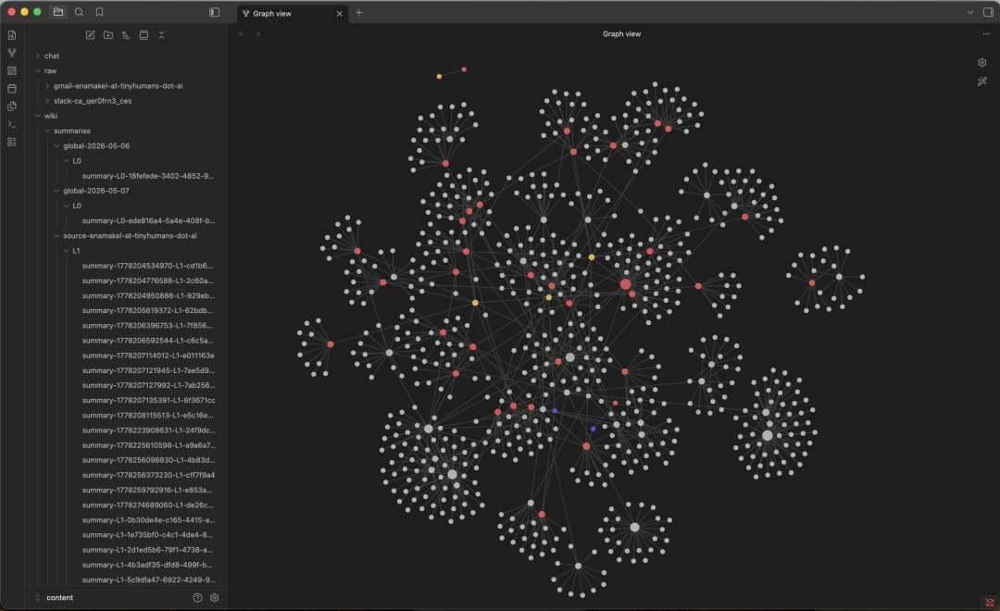
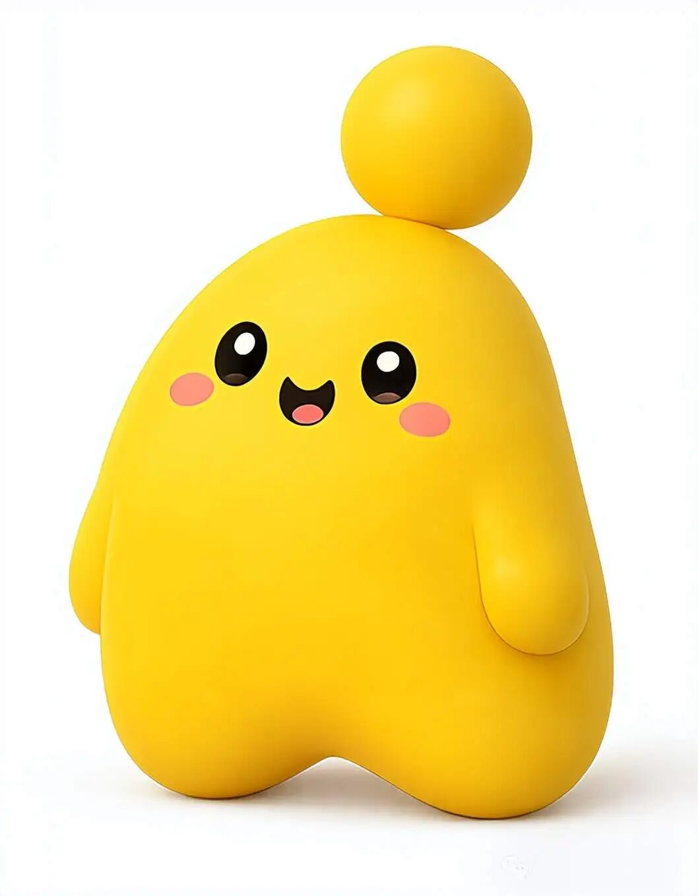
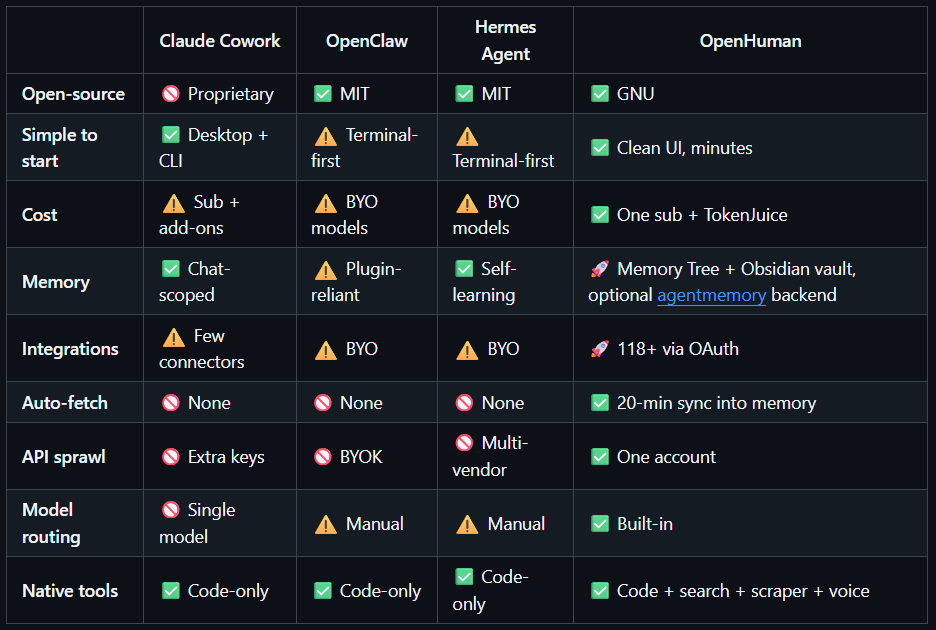

> 📎 来源: [NeoAgent](https://mp.weixin.qq.com/s?__biz=MzY5MTI1OTE0Ng==&mid=2247483939&idx=1&sn=12fc53c67d5ce04113b04b2e05a5afc6&chksm=f5b48007e49fa79f79d63d489bc4eafa26072f7ca460582f4ef4f33f2c2cd3ec9f9345af6f50&mpshare=1&scene=1&srcid=0517S3JfC6F0TvTBvLOJUAYI&sharer_shareinfo=c126f05bf6594937cc6a34c7c78b57b2&sharer_shareinfo_first=c126f05bf6594937cc6a34c7c78b57b2) | 时间: 2026-05-17 23:51

---

> OpenHuman 是一款全自动个人知识库 Agent，通过一键连接 118+ 第三方服务，实现每 20 分钟自动抓取、清洗并压缩数据，构建出“即插即用”的本地记忆树，彻底终结了手动维护知识库的时代。

---

### 摘要

本文深度解析了近期在 GitHub Trending 连续夺冠的开源项目 OpenHuman。不同于需要用户编写 Prompt 或配置工作流的传统 Agent，OpenHuman 走的是“全自动感应”路线：它能一键授权连接 Gmail、GitHub、Notion 等 118 个主流服务，以 20 分钟为周期自动抓取新数据，并利用 TokenJuice 机制将其压缩 80% 后存入本地 SQLite 和 Obsidian 兼容文件。其核心亮点在于“潜意识循环”机制，使 Agent 能在无交互状态下自主思考待办。OpenHuman 的走红标志着个人 Agent 正从“功能驱动”向“理解驱动”跨越。

### 主要内容

1. **全自动“记忆树”构建**：无需手动整理，每 20 分钟自动同步全平台数据，将碎片化信息转化为结构化的本地知识库。
2. **TokenJuice 极端压缩**：通过清洗 HTML、缩短 URL 及去重，减少 80% 的 Token 消耗，大幅降低 LLM 调用成本并提升响应速度。
3. **主动型 Agent 范式**：引入“潜意识循环”和虚拟形象 Mascot，Agent 不再被动等待指令，而是能主动参与会议、规划任务并理解用户习惯。

---

## 虾马之后的新物种：OpenHuman 用 20 分钟了解你的一切

在 Agent 赛道陷入“调教内卷”时，一个名为 **OpenHuman** 的新项目杀出重围。它连续霸榜 GitHub Trending 第一，狂揽 9k+ Star，单日涨粉破千。

它的出现提出了一个尖锐的对比：传统的 Agent（如“Openclaw”、“hermes”类项目）本质上是用户在“教”AI，你需要配置 Skill、写 Prompt、理工作流；而 OpenHuman 的逻辑是——**不用你教，它反过来主动了解你。**

### 从“手动调教”到“自动同步”

Karpathy 曾推崇过一套名为 **LLM Wiki** 的工作流：将个人所有的笔记、项目和待办整理成结构化的 Markdown，丢进 Obsidian 让 AI 持续理解。这套思路虽好，但“维护成本”极高，一旦断更，知识库就会失效。

OpenHuman 将这套“手工活”变成了自动化流水线，核心链路分为三步：

1. **连接（Connect）**：一键授权 118+ 第三方服务（Notion, Slack, GitHub, Stripe 等），无需开发者手动配置复杂的 API Key。
2. **抓取（Fetch）**：引擎每 20 分钟自动轮询，拉取新邮件、代码提交或日程变更，用户无需编写任何轮询脚本。
3. 记忆（Remember）：数据清洗后切成 3000 Token 以内的片段，按时间线和关联度生成“记忆树”，存储在本地 SQLite 中，并同步生成兼容 Obsidian 的 .md 文件。

### TokenJuice 与潜意识循环

为了解决 AI 越用越贵、越用越慢的痛点，OpenHuman 引入了 **TokenJuice 压缩机制**：

- **极致脱水**：将 HTML 转为 Markdown、缩短长 URL、清理非 ASCII 字符。
- **效能飞跃**：实测可砍掉 80% 的 Token 消耗。

此外，该项目最迷人的设计在于其潜意识循环。即使你没有与它交互，Agent 也会在后台读取近期记忆、加载待办，并自主决定下一步行动。它甚至拥有一个名为 **Mascot** 的虚拟形象，能作为独立参会者加入 Google Meet 帮你做会议纪要。

你开会，它旁听记要点。你离开电脑，它在后台继续执行待办任务。

在**潜意识循环**机制下，即使你不主动跟它交互，它也会自己加载待办、读取近期记忆、自主决定还有什么可以干。

OpenHuman和Claude Cowork、OpenClaw、Hermes Agent主流Agent做了对比。

在上手门槛、成本、记忆能力、第三方集成、自动数据同步、模型调度等维度都具备一定优势。

### Agent 的下半场：从“能干”转向“懂你”

在与 Claude Cowork、OpenClaw 等主流框架的横向评测中，OpenHuman 在上手门槛和自动同步维度表现突出。它精准踩中了当前开发者的三大痛点：

- **密钥管理疲劳**：一个账号搞定全平台授权。
- **数据孤岛严重**：全平台数据自动整合成专属记忆树。
- **上下文过载**：内置压缩机制确保护航。

如果说之前的 Agent 都在卷“如何更高效地执行任务”，OpenHuman 则把心思花在了“如何更深度地理解用户”上。毕竟，懂你的 AI，才真正具备成为“数字孪生”的潜力。

---

> 项目地址：https://github.com/tinyhumansai/openhuman
