> 📎 来源: [逛逛GitHub](https://mp.weixin.qq.com/s?__biz=MzUxNjg4NDEzNA==&mid=2247533989&idx=1&sn=9e1ad46fdd67c5d0dec4b7fe4f46b765&chksm=f818a1ce9c7f6a31b207a08d7efedf3c945b0c53c0dc53d84f57975a21c2dde9ebdb07fcf8cd&mpshare=1&scene=1&srcid=05245uxLXFSyEuY6SH1ccpLt&sharer_shareinfo=190703295e12dcec0e2be23477b2a366&sharer_shareinfo_first=190703295e12dcec0e2be23477b2a366) | 时间: 2026-05-24 11:31

---

01

**给 AI 装一套科研全家桶**

现在逛 GitHub 一眼望过去半屏都是 Skill。

scientific-agent-skills 就是刚刚破 2.5 万 Star 的 Skill，本周还在涨。

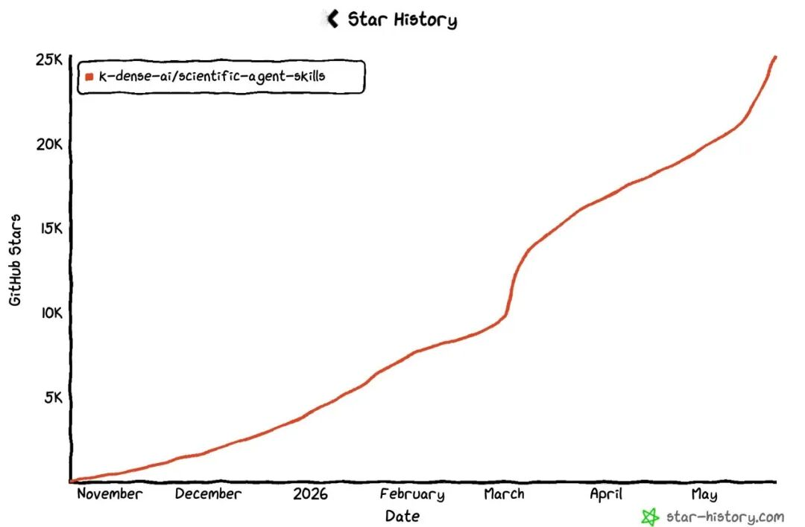

它是一套开箱即用的 Agent 技能包，一口气覆盖了科研、科学计算、工程、数据分析、金融还有写作。

以前你让 Claude 或者 Cursor 帮你做点正经研究，它经常东一榔头西一棒子，不太靠谱。

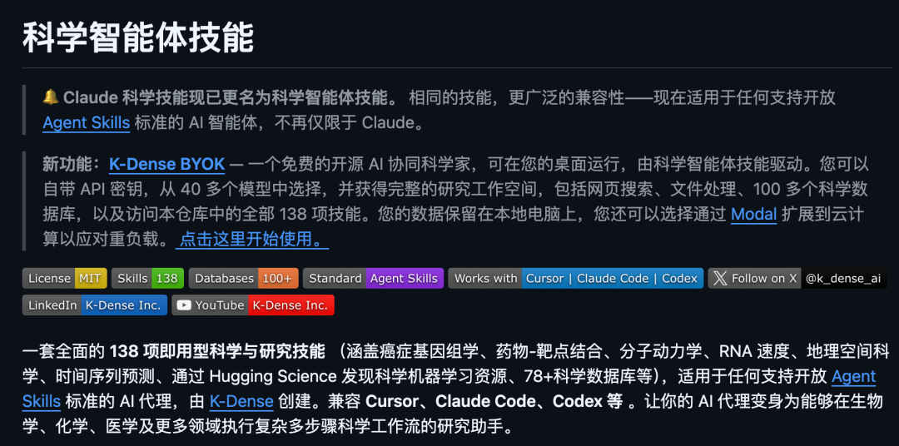

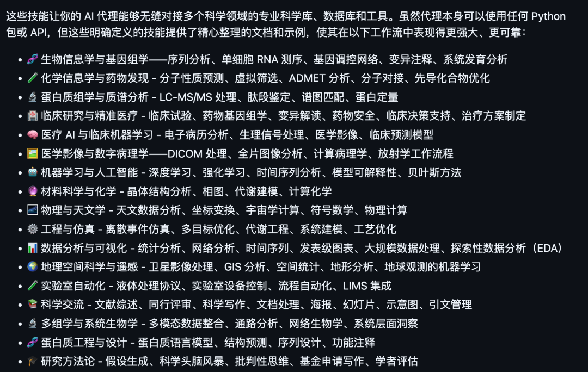

装上这套技能之后，AI 干活就有章法多了，知道该按什么流程来。

如果你是科研党，或者平时要跟数据、跟计算打交道，可以装上感受感受。


```
开源地址：https://github.com/K-Dense-AI/scientific-agent-skills
```

02

**写论文这事被它做成了流水线**

如果说 scientific-agent-skills 是科研全家桶，那 academic-research-skills 就是专门盯着写论文这一件事的特化版。

这个项目本周涨得很猛，一周就加了一万多 Star，现在快两万了。


它专门给 Claude Code 做的学术研究技能，把写论文的全流程串成了一条管线：

查资料、写、审、改、定稿，一环扣一环自动往下走。

我看了下流程设计，确实是按真实写论文的节奏来的，不是随便拼几个 prompt。

但是不是全自动化，还是需要人工干预的。

正在熬论文的研究生应该会很有感触，这玩意儿能帮你省下不少头发。

```
开源地址：https://github.com/Imbad0202/academic-research-skills
```

03

**把陌生代码库变成一张地图**

Understand-Anything 目前接近 2 万 Star。

它能把一个代码库变成可交互的知识图谱，让你能搜索、能提问、还能可视化地到处点点看看。

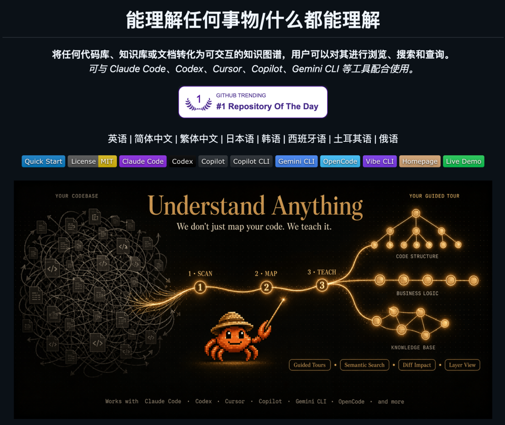

读陌生项目之前，先让它给你画张地图，心里就有底了。

它兼容好几种 AI 工具，不挑食。

如果你经常要看别人的代码，或者刚进新公司面对一堆历史项目，这个能帮你快速上手。

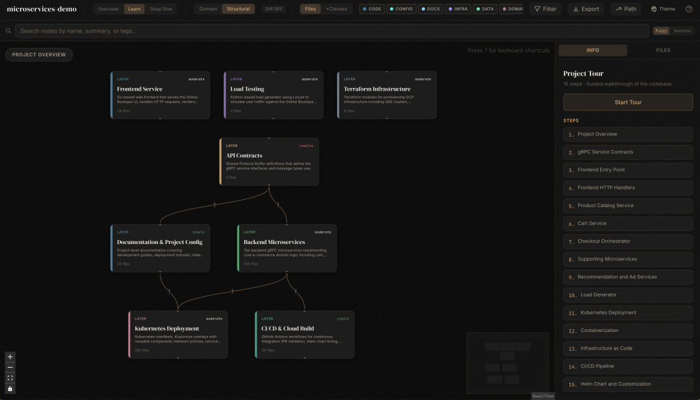

```
开源地址：https://github.com/Lum1104/Understand-Anything
```

04

**让 AI 一上来就懂你整个项目**

这个是本周黑马，一周猛涨 1.4 万多 Star，现在 1.8 万了。

痛点其实大家都懂。

每次让 AI 改代码，它都得先现啃一遍你的项目结构，又慢，还容易啃错地方。

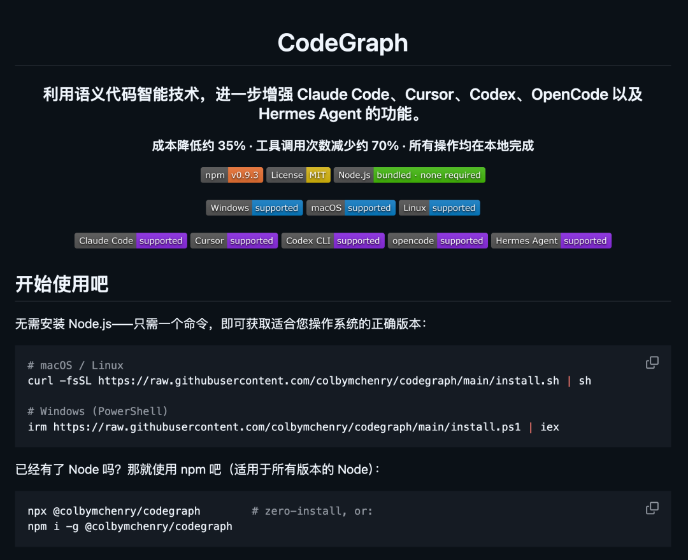

codegraph 的思路是提前把整个代码库索引成一张代码知识图谱，然后喂给 AI。

它支持 Claude Code、Codex、Cursor、OpenCode 这些主流工具，建好图之后，AI 一上来就对你的项目了如指掌，不用每次重新摸索。

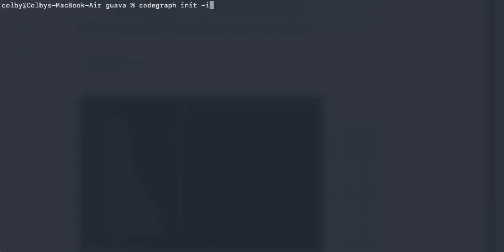

就是给 AI 提前做好功课。

你的项目越大，这东西帮的忙就越明显。

```
开源地址：https://github.com/colbymchenry/codegraph
```

05

**终端里又冒出一个想干掉 Cursor 的**

终端 AI 编程助手现在卷得飞起，oh-my-pi 是本周比较亮眼的一个，目前 6000 多 Star。

它跑在终端里，主打一个改代码改得准。

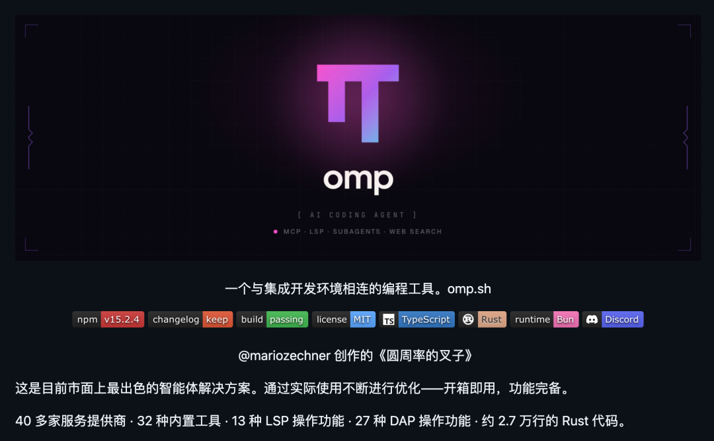

它从 Pi 分支出来，加了挺多东西。

最亮眼的是 Hashline 编辑系统，模型用内容哈希锚点定位代码，不用重新输入整行，解决了空白符不匹配导致编辑失败的经典问题，据说能减少 61% 的 token 消耗。

改起代码又稳又准，不容易改错位置。

现在这类工具不少都在卷功能、卷花活，oh-my-pi 拿编辑精度当差异化武器，思路挺清楚的。

而且，它把编程 Agent 的基础工具进行了打磨，性能到了极致。

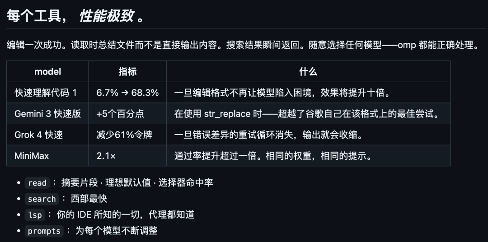

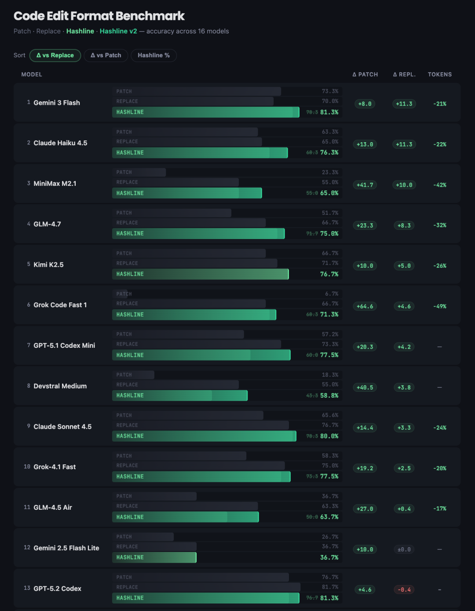

天天泡在终端里写代码的，可以拿它跟手头的工具比一比。

内置 32 个工具、完整的 LSP 集成支持 40 多种语言、DAP 调试支持。

约 27000 行 Rust 代码把 ripgrep、glob、bash、AST 操作、语法高亮全部做进进程内。

支持 40 多个 LLM 提供商，14 种 Web 搜索后端。

还能从 Claude Code、Cursor、Windsurf 等 8 个工具导入配置，迁移成本很低。

```
开源地址：https://github.com/can1357/oh-my-pi
```

06

**把 Agent 做成产品的十二条军规**

老程序员应该都听过经典的 12-factor app，构建云原生应用的十二条原则。

12-factor-agents 就是把这套思路搬到了 AI Agent 上，目前 2.1 万 Star。


搞 AI Agent 开发的话，这个项目建议认真读一读。

它 借用当年 12-Factor Apps 的思路，这 12 条原则覆盖了从工具调用、提示词管理、上下文控制到错误处理的完整链路。

核心理念很清晰：把 LLM 当做自然语言到工具调用的转换引擎，把 Agent 做成无状态的规约器，用确定性代码控制流程而不是让 Agent 自己瞎跑。

项目还附带了三个实战工作坊和脚手架工具，跑一条命令就能初始化一个符合这些原则的新项目。

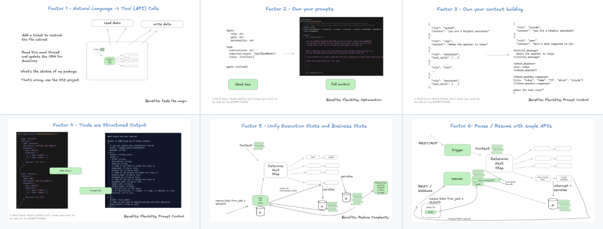

```
开源地址：https://github.com/humanlayer/12-factor-agents
```

07

**从零开始手搓 AI 工程**

跟上面那个正好互补，一个讲原则，这个带实操。

ai-engineering-from-scratch 目前 1.2 万多 Star，口号还挺提气：学会它、造出来、发出去。


这个项目准备了 428 节课、20 个阶段、大约 320 小时的学习内容，从线性代数一直讲到自主多智能体系统。

目前 1.3 万 Star。

每节课结构统一：先讲问题，再讲概念，然后自己从数学原理实现一遍，再用 PyTorch 或 sklearn 实现一遍，最后做成可交付的 AI 工件。

四种语言实现：Python、TypeScript、Rust、Julia。

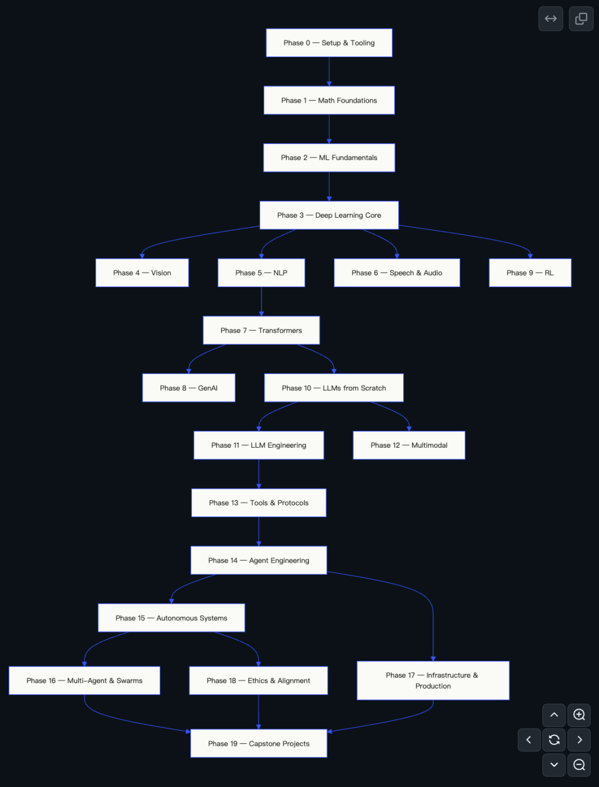

每节课都会产出一个可复用的 AI 工件（Prompt、Skill、Agent 或 MCP Server），可以直接装到 AI Coding 工具里用。

跑个水平测试它会自动告诉你该从哪个阶段开始。

```
开源地址：https://github.com/rohitg00/ai-engineering-from-scratch
```

08

**不联网也能说话的端侧 TTS**

Supertonic 是一个端侧文本转语音系统，大约 99M 参数，在 CPU 上就能跑出很快的实时速度。

它基于 ONNX Runtime 运行，完全离线，不用把文本传到云端。

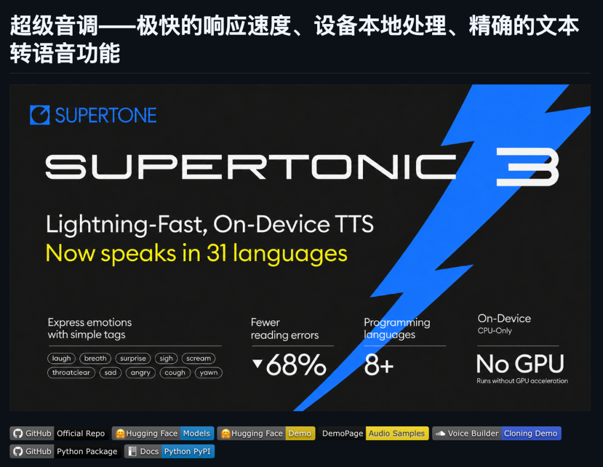

v3 版本支持 31 种语言，还新增了 Expression Tags 功能，可以用标签控制语音的情感表达。

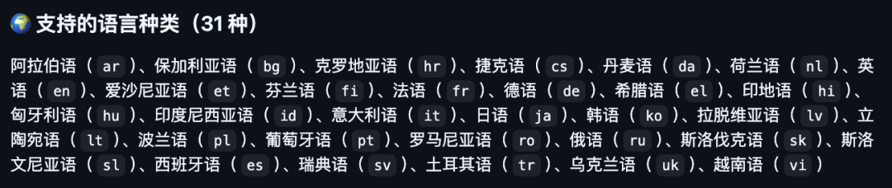

最方便的是它提供了 11 个平台的 SDK：C++、Node.js、Python、Rust等。

基本你想在哪个平台上集成都能直接用，改天我把它融到我的开源项目 Lumi 里面。

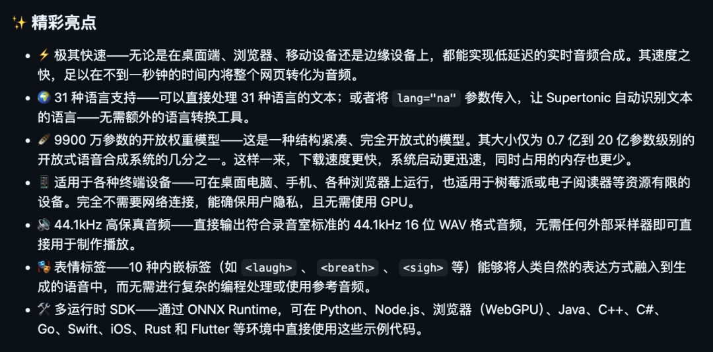

```
开源地址：https://github.com/supertone-inc/supertonic
```

09

**把拍视频拆成一个 AI 剧组**

这个是港大数据智能实验室 HKUDS 出的。

ViMax 的脑洞挺大，它把视频制作拆成了导演、编剧、制片、视频生成器几个 AI 角色，组成一个 Agent 剧组，从剧本一路协作做到成片。

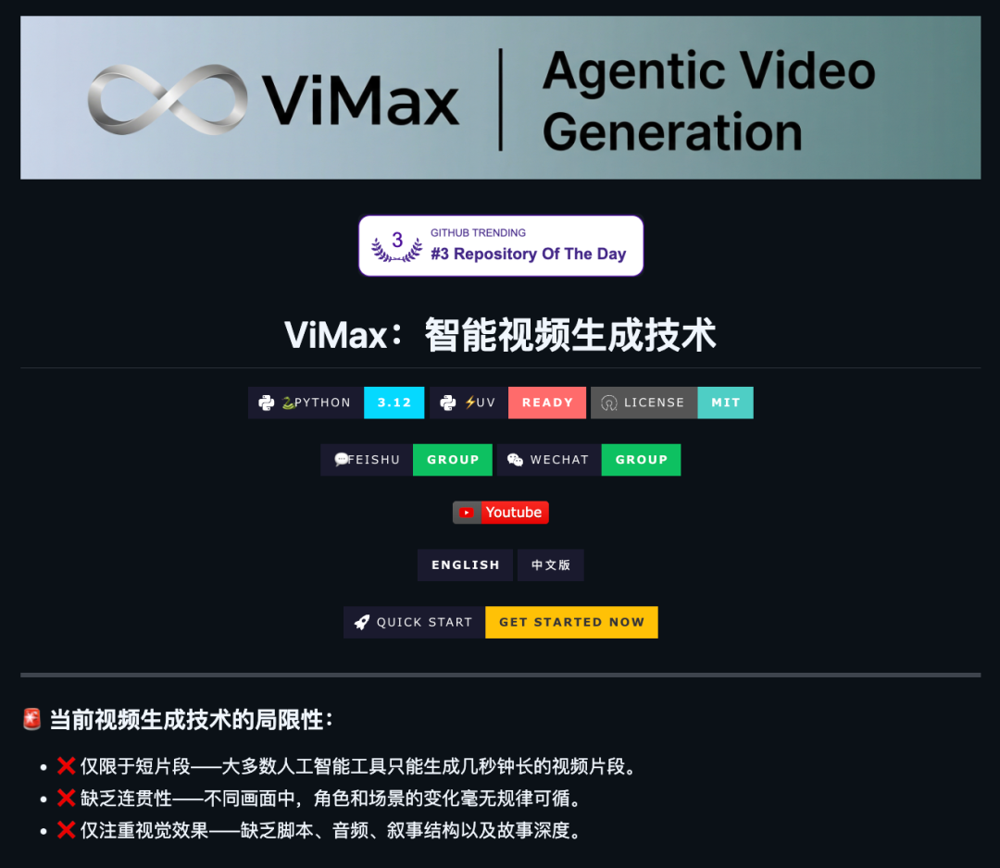

支持三种输入模式：给个灵感就开搞的 Idea2Video、给完整剧本的 Script2Video、甚至能把小说改成视频的 Novel2Video。

这就是 Agent 协作比较性感的形态了，不是一个 AI 单打独斗，而是一群分工干活。

整个流程从写脚本到出片是一条龙的，中间不用你来回切工具。

还有个 AutoCameo 功能，上传你的照片就能把你作为角色嵌入视频里，保持外观一致。

技术上用了六层流水线，从输入解析到视觉合成全部自动化，还模拟多机位拍摄，保持角色位置和背景的一致性。

做 AI 视频、或者对多 Agent 协作感兴趣的，重点关注一下。

```
开源地址：https://github.com/HKUDS/ViMax
```

10

**点击下方卡片，关注逛逛 GitHub**

这个公众号历史发布过很多有趣的开源项目，如果你懒得翻文章一个个找，你直接关注微信公众号：逛逛 GitHub ，后台对话聊天就行了：


