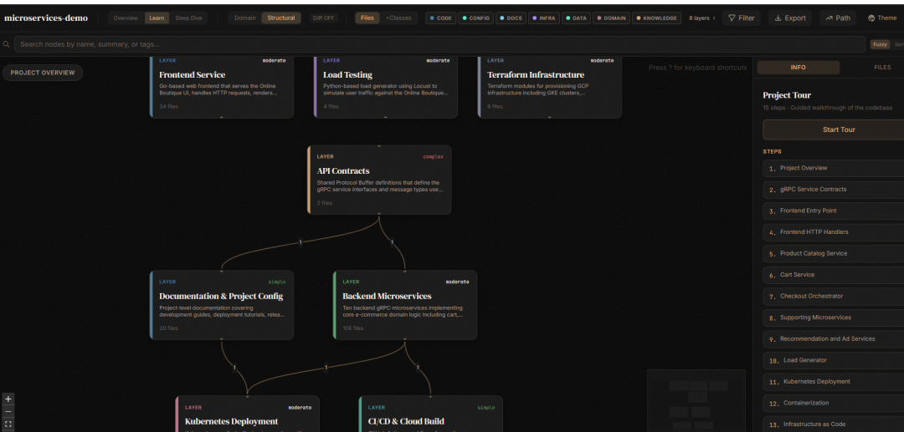

> 📎 来源: [简一陪伴站](https://mp.weixin.qq.com/s?__biz=Mzg3ODI5MTk4NA==&mid=2247485103&idx=1&sn=666131ce85a1ff00ac1adb7a3aadc951&chksm=cef0d026fc6a0e18981b9d4bad0ed719684e68c1121dba3af6a28b6c95f00ecb4a38f7e0cd1e&mpshare=1&scene=1&srcid=0526zzVTC1BXnff2eunGb6AE&sharer_shareinfo=13110a163227e5095f915cba79dba844&sharer_shareinfo_first=13110a163227e5095f915cba79dba844) | 时间: 2026-05-26 12:01

---

今天早上刷 GitHub Trending，第一名又是它——

**Understand-Anything**，今日单日新增 **5,604 个 Star**，总 Star 数破 **31,000**。

不是算法演示，不是论文代码，是一个你今天就能装上去用的工具。

---

**它解决的是什么问题？**

接手一个新项目，代码 20 万行。

你从哪里开始看？

大多数人的答案是：从 README 开始，再翻 main 文件，然后在密密麻麻的函数调用里迷失方向。

Understand-Anything 换了一种方式：

**把整个代码库变成一张可以点击、可以搜索、可以问问题的知识图谱。**

---

**具体能做什么？**

装上之后，在终端里跑一条命令：

```
/understand
```

它会启动 5 个 AI Agent 并行扫描你的项目——分析文件结构、提取函数关系、识别架构层次、生成导览路径。扫完之后，再跑：

```
/understand-dashboard
```

浏览器打开一个交互式界面，你的代码库以图谱形式呈现。每个节点是一个文件或模块，边代表依赖关系，颜色区分架构层（API / Service / Data / UI）。

点一个节点，看它的摘要；搜索"auth 相关的部分在哪"，直接定位；改了一个文件，跑 

```
/understand-diff
```

 看这次改动影响了哪些地方。

还支持直接问：

```
/understand-chat "支付流程是怎么走的？"
```

---

**为什么增速这么猛？**

有几个点让它在同类工具里脱颖而出。

**第一，不是纯 LLM 分析。**

它用 Tree-sitter 做静态解析，先把代码结构提取准确，再交给 LLM 生成语义理解。两步分开，结果更可靠，不是让 AI 凭感觉猜代码。

**第二，支持所有主流 AI 编程工具。**

Claude Code、Cursor、VS Code Copilot、Codex、Gemini CLI……一条安装命令，适配你在用的任何工具。

**第三，图谱可以提交到 Git。**

生成的知识图谱是 JSON 文件，提交一次，团队所有人共享。新人入职直接打开图谱看，不用从零开始扫代码。

---

**怎么装？**

Claude Code 用户：

```
/plugin marketplace add Lum1104/Understand-Anything/plugin install understand-anything
```

macOS / Linux 通用：

**bash**

复制

```
curl -fsSL https://raw.githubusercontent.com/Lum1104/Understand-Anything/main/install.sh | bash
```

Windows：

**powershell**

复制

```
iwr -useb https://raw.githubusercontent.com/Lum1104/Understand-Anything/main/install.ps1 | iex
```

在线 Demo 也可以先体验：**understand-anything.com/demo**



---

**适合谁用？**

接手陌生大型项目的开发者、做代码 Review 的 Tech Lead、需要快速了解某个开源库内部逻辑的人。

如果你日常用 Cursor 或 Claude Code，这个工具值得装一下试试。

---

GitHub 地址：github.com/Lum1104/Understand-Anything

今日新增 ⭐ 5,604，总计 31k+

*数据来源：GitHub Trending 2026年5月26日*

---

> **简一陪伴站** · 每天一个真实好用的 AI 工具
