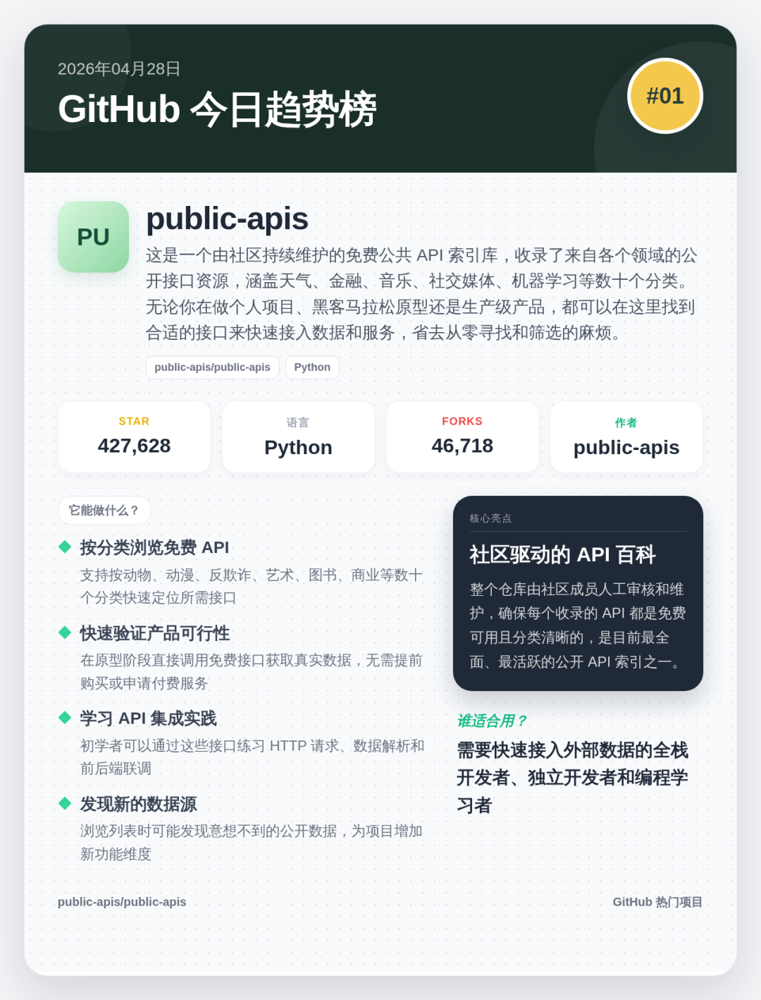
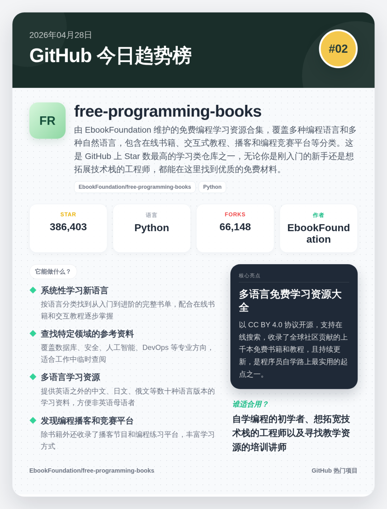
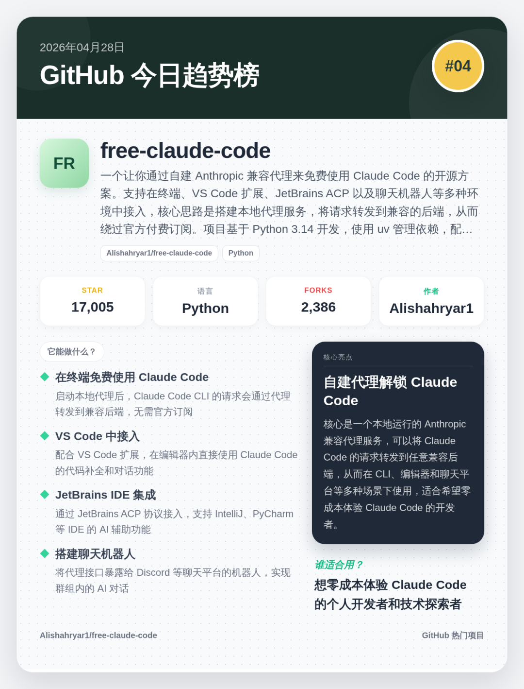
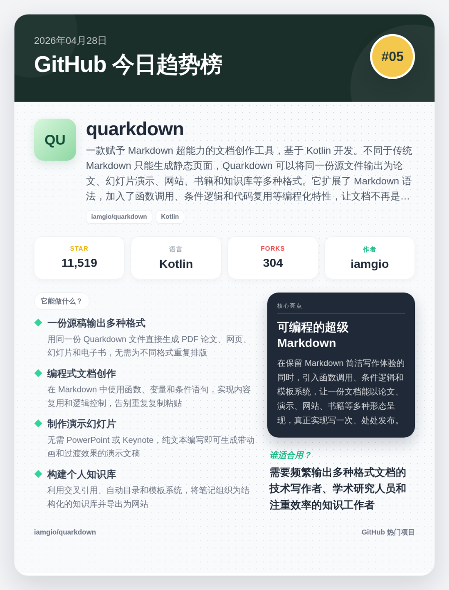

> 📎 来源: [幽森的森](https://mp.weixin.qq.com/s?__biz=MzU0Mzk1MjY3OA==&mid=2247484544&idx=1&sn=b5e7745545e1d6227fd7655f11aeb45d&chksm=fa2e8805f78fa93bac98b6c1dc1998410d2ec1db85a7359f237abbea3a8ef4bec53357c295fa&mpshare=1&scene=1&srcid=0429tp3b8YMyS2HlHlYht8Ci&sharer_shareinfo=22729afe8591cf40ce94e5d189368e95&sharer_shareinfo_first=22729afe8591cf40ce94e5d189368e95) | 时间: 2026-04-29 03:47

---

# 今日 GitHub 爆款 Top 5 | 2026-04-28

## 1. public-apis

⭐ 427,628 star | Python

这是一个由社区持续维护的免费公共 API 索引库，收录了来自各个领域的公开接口资源，涵盖天气、金融、音乐、社交媒体、机器学习等数十个分类。无论你在做个人项目、黑客马拉松原型还是生产级产品，都可以在这里找到合适的接口来快速接入数据和服务，省去从零寻找和筛选的麻烦。

public-apis

### 它能做什么

- **按分类浏览免费 API**：支持按动物、动漫、反欺诈、艺术、图书、商业等数十个分类快速定位所需接口
- **快速验证产品可行性**：在原型阶段直接调用免费接口获取真实数据，无需提前购买或申请付费服务
- **学习 API 集成实践**：初学者可以通过这些接口练习 HTTP 请求、数据解析和前后端联调
- **发现新的数据源**：浏览列表时可能发现意想不到的公开数据，为项目增加新功能维度

**核心亮点**：社区驱动的 API 百科

整个仓库由社区成员人工审核和维护，确保每个收录的 API 都是免费可用且分类清晰的，是目前最全面、最活跃的公开 API 索引之一。

**适合谁看**：需要快速接入外部数据的全栈开发者、独立开发者和编程学习者

## 2. free-programming-books

⭐ 386,403 star | Python

由 EbookFoundation 维护的免费编程学习资源合集，覆盖多种编程语言和多种自然语言，包含在线书籍、交互式教程、播客和编程竞赛平台等分类。这是 GitHub 上 Star 数最高的学习类仓库之一，无论你是刚入门的新手还是想拓展技术栈的工程师，都能在这里找到优质的免费材料。

free-programming-books

### 它能做什么

- **系统性学习新语言**：按语言分类找到从入门到进阶的完整书单，配合在线书籍和交互教程逐步掌握
- **查找特定领域的参考资料**：覆盖数据库、安全、人工智能、DevOps 等专业方向，适合工作中临时查阅
- **多语言学习资源**：提供英语之外的中文、日文、俄文等数十种语言版本的学习资料，方便非英语母语者
- **发现编程播客和竞赛平台**：除书籍外还收录了播客节目和编程练习平台，丰富学习方式

**核心亮点**：多语言免费学习资源大全

以 CC BY 4.0 协议开源，支持在线搜索，收录了全球社区贡献的上千本免费书籍和教程，且持续更新，是程序员自学路上最实用的起点之一。

**适合谁看**：自学编程的初学者、想拓宽技术栈的工程师以及寻找教学资源的培训讲师

## 3. claude-code-templates

⭐ 25,996 star | Python

一款专为 Claude Code 设计的命令行配置与监控工具，提供开箱即用的模板和预设方案，帮助你快速搭建 Claude Code 的开发环境。无论你是刚接触 Claude Code 还是想统一团队配置，这个工具都能减少重复的手动设置，让 AI 编程助手更快进入工作状态。

claude-code-templates

### 它能做什么

- **一键应用项目模板**：内置多种项目类型的配置模板，选择后自动生成对应的 Claude Code 设置文件
- **监控 Claude Code 运行状态**：实时查看 Claude Code 的执行情况和资源使用，便于调试和优化工作流
- **统一团队配置标准**：团队成员使用相同模板初始化，确保 Claude Code 在不同机器上行为一致
- **快速切换项目配置**：在多个项目之间切换时，通过模板快速加载对应的上下文和规则配置

**核心亮点**：Claude Code 的开箱即用配置器

将繁琐的 Claude Code 手动配置流程简化为命令行交互操作，提供 npm 一键安装，内置多种预设模板，让 AI 编程助手从安装到就绪只需几步。

**适合谁看**：使用 Claude Code 提升开发效率的个人开发者和希望标准化 AI 工具配置的技术团队

## 4. free-claude-code

⭐ 17,005 star | Python

一个让你通过自建 Anthropic 兼容代理来免费使用 Claude Code 的开源方案。支持在终端、VS Code 扩展、JetBrains ACP 以及聊天机器人等多种环境中接入，核心思路是搭建本地代理服务，将请求转发到兼容的后端，从而绕过官方付费订阅。项目基于 Python 3.14 开发，使用 uv 管理依赖，配备完整的测试和类型检查。

free-claude-code

### 它能做什么

- **在终端免费使用 Claude Code**：启动本地代理后，Claude Code CLI 的请求会通过代理转发到兼容后端，无需官方订阅
- **VS Code 中接入**：配合 VS Code 扩展，在编辑器内直接使用 Claude Code 的代码补全和对话功能
- **JetBrains IDE 集成**：通过 JetBrains ACP 协议接入，支持 IntelliJ、PyCharm 等 IDE 的 AI 辅助功能
- **搭建聊天机器人**：将代理接口暴露给 Discord 等聊天平台的机器人，实现群组内的 AI 对话

**核心亮点**：自建代理解锁 Claude Code

核心是一个本地运行的 Anthropic 兼容代理服务，可以将 Claude Code 的请求转发到任意兼容后端，从而在 CLI、编辑器和聊天平台等多种场景下使用，适合希望零成本体验 Claude Code 的开发者。

**适合谁看**：想零成本体验 Claude Code 的个人开发者和技术探索者

## 5. quarkdown

⭐ 11,519 star | Kotlin

一款赋予 Markdown 超能力的文档创作工具，基于 Kotlin 开发。不同于传统 Markdown 只能生成静态页面，Quarkdown 可以将同一份源文件输出为论文、幻灯片演示、网站、书籍和知识库等多种格式。它扩展了 Markdown 语法，加入了函数调用、条件逻辑和代码复用等编程化特性，让文档不再是纯文本，而是可以编程的创意载体。

quarkdown

### 它能做什么

- **一份源稿输出多种格式**：用同一份 Quarkdown 文件直接生成 PDF 论文、网页、幻灯片和电子书，无需为不同格式重复排版
- **编程式文档创作**：在 Markdown 中使用函数、变量和条件语句，实现内容复用和逻辑控制，告别重复复制粘贴
- **制作演示幻灯片**：无需 PowerPoint 或 Keynote，纯文本编写即可生成带动画和过渡效果的演示文稿
- **构建个人知识库**：利用交叉引用、自动目录和模板系统，将笔记组织为结构化的知识库并导出为网站

**核心亮点**：可编程的超级 Markdown

在保留 Markdown 简洁写作体验的同时，引入函数调用、条件逻辑和模板系统，让一份文档能以论文、演示、网站、书籍等多种形态呈现，真正实现写一次、处处发布。

**适合谁看**：需要频繁输出多种格式文档的技术写作者、学术研究人员和注重效率的知识工作者
