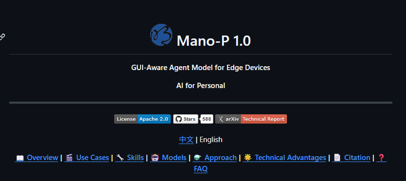
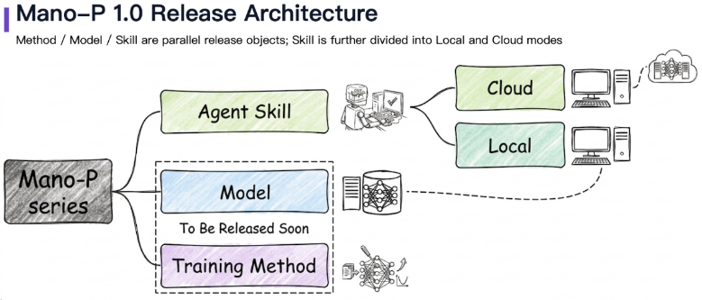
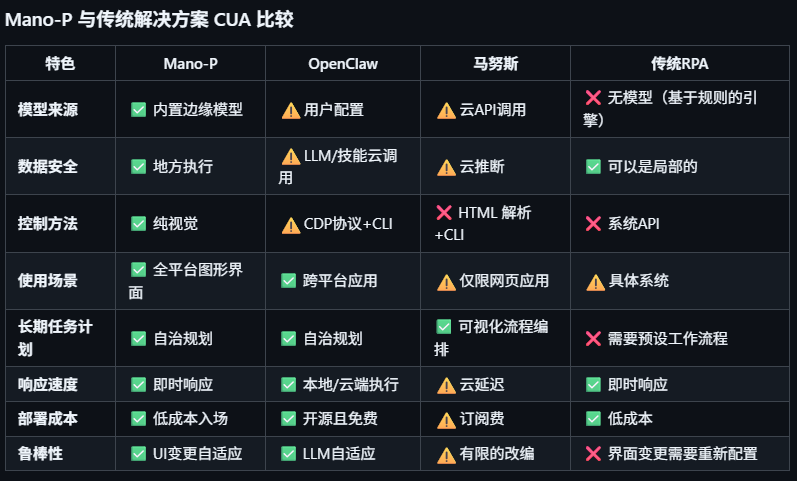
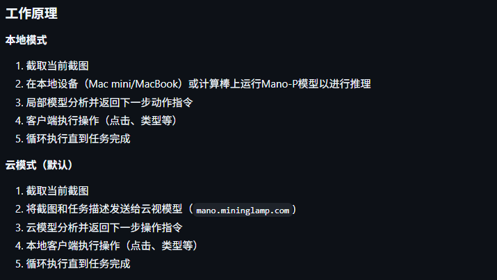

> 📎 来源: [繁星AI随笔](https://mp.weixin.qq.com/s?__biz=MzY5OTE1NzUzNw==&mid=2247484552&idx=1&sn=ffde3d01a56fdfa057310b1a074b218f&chksm=f577a82abfe77795e2c2117415d6fd9bac7f9bc8f33223ff495c022f41859da873fdea34b893&mpshare=1&scene=1&srcid=0420Z8tkGVTt4UEeIYqwMLTN&sharer_shareinfo=a6e168e7c3827e2637f71393effe4102&sharer_shareinfo_first=a6e168e7c3827e2637f71393effe4102) | 时间: 2026-04-20 21:32

---

大家好，这里是繁星。

年初，OpenClaw的爆火拉开了AI Agent应用落地的序幕。

于是，很多人尝试为AI装配各类skill，希望借此能让AI替代自己完成各种图形界面重复性操作。

但现实是：

多数技能依赖传统API对接，并局限于浏览器。

一旦涉及跨桌面应用，性能大幅下降。

直到最近，一个名为Mano-P 1.0的技术解决方案在GitHub上悄然开源。



一、项目介绍

Mano-P是明略科技开源的一个GUI-VLA Agent模型。

简单来说，它能让AI和我们操作电脑一样：看屏幕、理解界面、点击操作。

并且它不依赖CDP协议，不依赖HTML解析，也不依赖任何API。



项目名称取自西班牙语的Mano（手）。

P则有双重含义：Person与Party。

寓意无论是个人还是组织，都能用它创建属于自己的个性化AI。

二、项目特点

1、纯视觉驱动：

现阶段，大部分工具依赖CDP协议或HTML解析。

这套传统处理方式遇到桌面软件、3D应用等等便无从下手。

而Mano-P采用纯视觉GUI交互，可以做到直接识别屏幕截图。

2、数据安全：

本地模式下，所有截图和任务数据完全不出设备。

不需要联网，不需要调API，断网也能跑。



3、自适应界面改动：

传统RPA还有一个老问题：

应用界面升级改版，之前配好的自动化流程全报废。

Mano-P靠纯视觉理解，UI变化自适应，维护成本大幅降低。

三、快速入门

1、CLI工具：

```
brew tap HanningWang/tap
```

2、以Skill方式安装：

Claude Code、OpenClaw等Agent工具，可通过ClawHub一键安装 ：

```
# 安装skill
```

重启后，Agent遇到需要操控界面的任务，会自动调用。

3、Python SDK（即将发布）

4、硬件方面：

M4 芯片Mac+32GB内存。

没有M4 Mac，可以通过USB 4.0算力棒来跑。

当然，也有云端模式，不过敏感数据不会上传。

PS：如果没有配置本地模型，默认走云端模式。

Mano-P目前开源的是Mano-CUA Skills部分。

Mano-CUA的本地模型和SDK组件预计四月底开源。



四、结语

大部分GUI Agent依赖云端或API，而 Mano-P反其道而行：

模型跑在本地，靠纯视觉理解界面，数据全程不离开设备。

但比这些更值得关注的，是它指向的未来：

离线运行、能看懂屏幕、可自主操作的AI助手，未来可能常驻每个人的设备。

项目地址：

https://github.com/MININGLAMP-AI/MANO-P。

**以上就是今天的分享，希望对各位伙伴有所帮助，如果觉得内容不错，希望你能点个赞，给予鼓励。**
