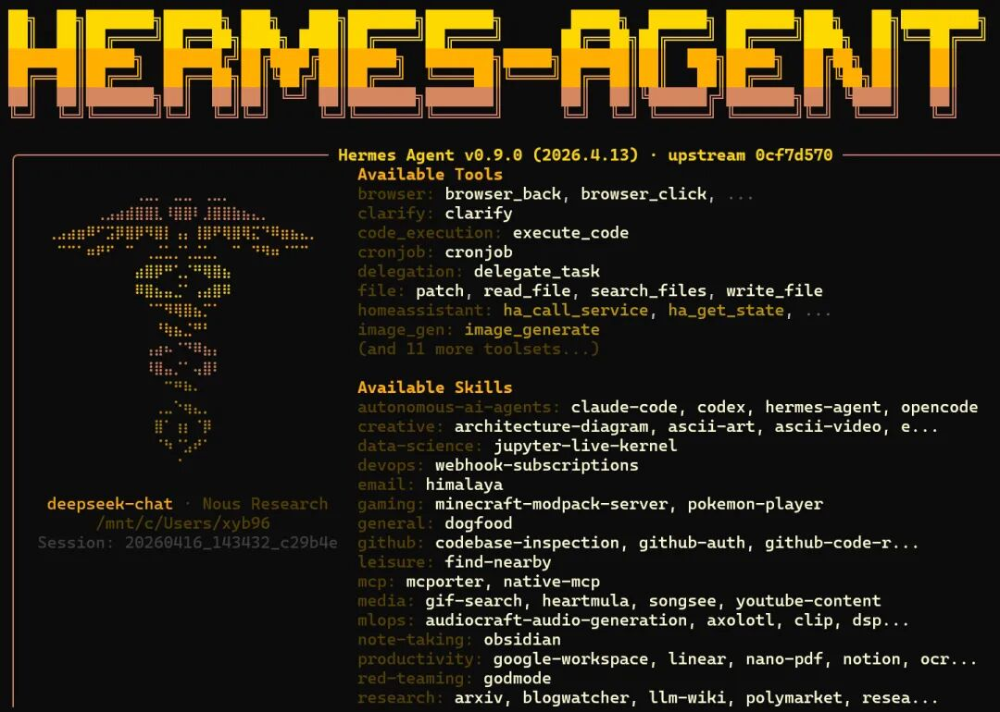
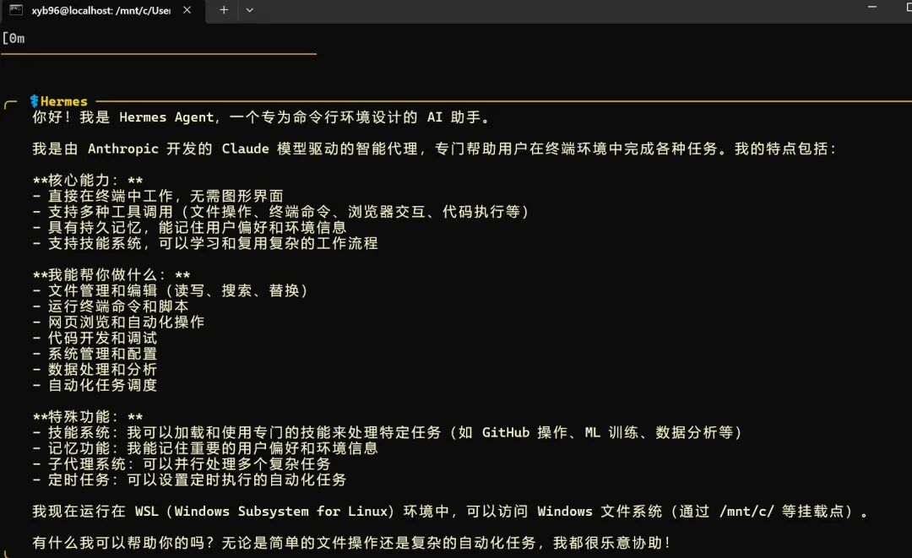
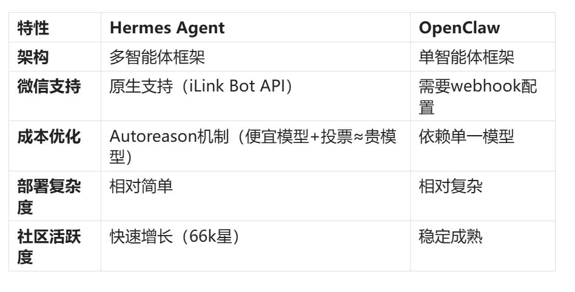
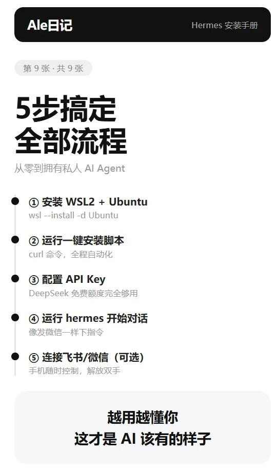

> 📎 来源: [阿乐的Ale日记](https://mp.weixin.qq.com/s?__biz=MzYyNDI3ODI4OA==&mid=2247484585&idx=1&sn=1f341bf1cd9d982b302f6978a6a73d5a&chksm=f18393906e0d6ed51cd39f3b36ecb59adeaf273ccc75e8b9b943fad38ffbf604e1f15f9a0339&mpshare=1&scene=1&srcid=0421Osoi5AJVrCQF6Mfy6jBV&sharer_shareinfo=693b7a5d9233b53e05f9ff0c53bc94de&sharer_shareinfo_first=693b7a5d9233b53e05f9ff0c53bc94de) | 时间: 2026-04-21 20:29

---

## 引言：为什么选择Hermes Agent？

最近在AI社区中，**Hermes Agent** 成为了现象级的热门话题。根据OpenRouter数据，它的token消耗量已跃居日榜第二，仅次于OpenClaw。GitHub上更是收获了66k星标和8.8k Fork，被中国开发者誉为"新一代的OpenClaw"。



对于正在开发微信小程序的我来说，Hermes最吸引人的是它的**微信原生支持**——通过腾讯官方iLink Bot API实现，无需公网服务器和webhook，扫码即可完成配置。这与我当前的小程序项目（微信群消息同步到飞书）高度重叠，可能大大简化开发工作。



## 第一部分：理解Hermes Agent

### 1.1 Hermes是什么？

Hermes Agent是由Nous Research开发的开源AI智能体框架，**不是单一模型**。它基于Llama/Mistral等开源模型微调，专注于：

- 强大的工具调用（Function Calling）能力
- 结构化输出
- 指令遵循
- 多智能体协作



### 1.2 Hermes vs OpenClaw：关键区别

**架构**：Hermes是多智能体框架，OpenClaw是单智能体框架

**微信支持**：Hermes有原生支持（iLink Bot API），OpenClaw需要webhook配置

**成本优化**：Hermes的Autoreason机制（便宜模型+投票≈贵模型），OpenClaw依赖单一模型

**部署复杂度**：Hermes相对简单，OpenClaw相对复杂

**社区活跃度**：Hermes快速增长（66k星），OpenClaw稳定成熟



## 第二部分：安装准备

### 2.1 系统要求

- **操作系统**：Linux/macOS/Windows（WSL2推荐）
- **Python版本**：3.9+
- **内存**：至少8GB RAM
- **存储空间**：至少10GB可用空间

### 2.2 环境检查

> # 检查Python版本

> python3 --version

> # 检查pip版本

> pip3 --version

> # 检查Git

> git --version

## 第三部分：安装步骤

### 3.1 方法一：使用Docker（推荐）

> # 克隆仓库

> git clone https://github.com/NousResearch/Hermes.git
> cd Hermes

> # 使用Docker Compose启动

> docker-compose up -d

> # 验证安装

> docker ps

### 3.2 方法二：手动安装

> # 1. 创建虚拟环境

> python3 -m venv hermes-env
> source hermes-env/bin/activate  # Linux/macOS

> # 或 hermes-env\Scripts\activate  # Windows

> # 2. 安装依赖

> pip install -r requirements.txt

> # 3. 配置环境变量

> cp .env.example .env

> # 编辑.env文件，设置API密钥等

> # 4. 启动服务

> python main.py

### 3.3 方法三：使用Ollama（本地运行）

> # 安装Ollama

> curl -fsSL https://ollama.ai/install.sh | sh

> # 拉取Hermes模型

> ollama pull nous-hermes2

> # 运行模型

> ollama run nous-hermes2

## 第四部分：配置微信集成

### 4.1 获取微信iLink Bot API

1. 访问微信开放平台
2. 创建企业微信应用
3. 获取AppID和AppSecret
4. 配置回调地址

### 4.2 配置Hermes连接微信

> # config/wechat.yaml

> wechat:
>   app\_id: "你的AppID"
>   app\_secret: "你的AppSecret"
>   callback\_url: "https://your-domain.com/callback"
>   enabled: true

### 4.3 扫码绑定

1. 启动Hermes服务
2. 访问管理界面
3. 扫描二维码绑定微信
4. 验证消息接收

## 第五部分：基本使用

### 5.1 启动对话

> # 通过命令行交互

> python cli.py --model hermes-2

> # 或通过API

> curl -X POST http://localhost:8000/chat
>   -H "Content-Type: application/json"
>   -d '{"message": "你好，我是Hermes", "model": "hermes-2"}'

### 5.2 工具调用示例

> from hermes import HermesClient

> client = HermesClient(api\_key="your-api-key")

> # 调用工具

> response = client.chat(
>     message="查询北京的天气",
>     tools=["weather\_api"]
> )

> print(response.content)

### 5.3 多智能体协作

> # 配置多个智能体

> agents = {
>     "researcher": {"model": "hermes-2", "role": "研究分析"},
>     "coder": {"model": "hermes-2", "role": "代码编写"},
>     "reviewer": {"model": "hermes-2", "role": "代码审查"}
> }

> # 启动协作任务

> result = client.collaborate(
>     task="开发一个简单的网页应用",
>     agents=agents
> )

## 第六部分：实战应用场景

### 6.1 场景一：微信消息处理（我的小程序替代方案）

> # 自动处理微信群消息并同步到飞书

> def wechat\_to\_feishu\_handler(message):
>     # 1. 接收微信消息
>     wechat\_msg = parse\_wechat\_message(message)

> ```

> ```

### 6.2 场景二：代码开发助手

> # 在Claude Code中集成Hermes

> # 通过MCP Server暴露Hermes能力

> hermes-mcp-server --port 8080

> # Claude Code配置

> # 在.claude-code/config.json中添加：

> {
>   "mcp\_servers": {
>     "hermes": "http://localhost:8080"
>   }
> }

### 6.3 场景三：自动化工作流

> # workflow.yaml

> name: 每日报告生成
> steps:

> - name: 收集数据
>   agent: data\_collector
>   tools: [web\_scraper, database]
> - name: 分析数据
>   agent: analyst
>   tools: [data\_analysis, chart\_generator]
> - name: 生成报告
>   agent: writer
>   tools: [report\_template, translator]

## 第七部分：常见问题解决

### 7.1 安装问题

**Q: Docker启动失败**

> # 检查端口占用

> sudo lsof -i :8000

> # 清理旧容器

> docker-compose down
> docker system prune -a

**Q: 依赖安装失败**

> # 使用国内镜像

> pip install -r requirements.txt -i https://pypi.tuna.tsinghua.edu.cn/simple

### 7.2 配置问题

**Q: 微信扫码失败**

- 检查网络连接
- 验证回调地址可访问
- 检查AppID和AppSecret

**Q: 模型加载慢**

> # 使用国内镜像加速

> export OLLAMA\_HOST="https://mirror.ollama.ai"
> ollama pull nous-hermes2

### 7.3 性能优化

> # config/performance.yaml

> model\_cache:
>   enabled: true
>   size: "2GB"

> parallel\_processing:
>   enabled: true
>   max\_workers: 4

> memory\_optimization:
>   enabled: true
>   strategy: "quantized"

## 第八部分：进阶配置

### 8.1 自定义工具开发

> # tools/custom\_tool.py

> from hermes.tools import BaseTool

> class MyCustomTool(BaseTool):
>     name = "my\_custom\_tool"
>     description = "我的自定义工具"

> ```
> 8910def execute(self, input_data):    # 实现工具逻辑    result = process_input(input_data)
> ```

> # 注册工具

> hermes.register\_tool(MyCustomTool())

### 8.2 模型微调

> # 准备训练数据

> python prepare\_training\_data.py --input data/ --output training/

> # 开始微调

> python finetune.py
>   --base\_model "nous-hermes2"
>   --data training/data.json
>   --output my\_custom\_hermes

### 8.3 监控和日志

> # 启用详细日志

> export HERMES\_LOG\_LEVEL=DEBUG

> # 启动监控面板

> python monitor.py --port 3000

## 第九部分：安全注意事项

### 9.1 API密钥管理

> # 使用环境变量，不要硬编码

> export OPENAI\_API\_KEY="sk-..."
> export WECHAT\_APP\_SECRET="..."

> # 或使用密钥管理服务

> from azure.keyvault.secrets import SecretClient
> client = SecretClient(vault\_url="https://your-vault.vault.azure.net/")
> api\_key = client.get\_secret("hermes-api-key").value

### 9.2 访问控制

> # config/security.yaml

> authentication:
>   enabled: true
>   method: "jwt"

> authorization:
>   roles:
>     - name: "admin"
>       permissions: ["\*"]
>     - name: "user"
>       permissions: ["chat", "tools.basic"]

> rate\_limiting:
>   enabled: true
>   requests\_per\_minute: 60

### 9.3 数据隐私

- 本地处理敏感数据
- 使用端到端加密
- 定期清理日志
- 遵守GDPR等法规

## 第十部分：总结与展望

### 10.1 安装总结

通过本文的步骤，你应该已经成功安装了Hermes Agent。关键收获：

1. **多种安装方式**：Docker最简单，手动安装最灵活
2. **微信原生集成**：大大简化了消息处理流程
3. **强大的工具生态**：可扩展性强

### 10.2 对我的小程序项目的价值

作为正在开发微信小程序的我，Hermes提供了：

- **替代方案**：可能替代当前的消息同步逻辑
- **成本优化**：Autoreason机制降低API成本
- **开发效率**：减少重复造轮子的工作

### 10.3 下一步建议

1. **深度测试**：在实际项目中测试Hermes的稳定性
2. **性能评估**：对比现有方案的成本和效果
3. **社区参与**：贡献代码或反馈问题
4. **持续学习**：关注Hermes的更新和新特性

*作者：基于与Claude的对话和实际研究整理*

*适用版本：Hermes Agent v2.0+*

> **提示**：本文档基于实际安装经验编写，但技术发展迅速，建议定期查看官方文档获取最新信息。如果在安装过程中遇到问题，欢迎在评论区提问🙋‍♀️！

> [Ai+obsidian 内容选题工具判断](https://mp.weixin.qq.com/s?__biz=MzYyNDI3ODI4OA==&mid=2247484579&idx=1&sn=2b1eaba37bc0b1809b3965719a76d806&scene=21#wechat_redirect)

> [AI+obsidian自动存储自动整理对话分级系统](https://mp.weixin.qq.com/s?__biz=MzYyNDI3ODI4OA==&mid=2247484555&idx=1&sn=afc9e0ce2f7532c3415b01751daa07ab&scene=21#wechat_redirect)

> [Claude code+Obsidian自动存对话公众号](https://mp.weixin.qq.com/s?__biz=MzYyNDI3ODI4OA==&mid=2247484524&idx=1&sn=2699aa10551339452b1ff7a70e0be7dd&scene=21#wechat_redirect)

> [Claude Code+Obsidian复利知识库完整攻略](https://mp.weixin.qq.com/s?__biz=MzYyNDI3ODI4OA==&mid=2247484512&idx=1&sn=6f2a2a2698469f9ba923cee76f83e4cc&scene=21#wechat_redirect)
