> 📎 来源: [逛逛GitHub](https://mp.weixin.qq.com/s?__biz=MzUxNjg4NDEzNA==&mid=2247533406&idx=1&sn=5cf3e7d5020d2d474cde1a8c35fb127a&chksm=f8ae92a3872170d99bc6a53ab2e1ca934ab25c6db5abd7c3d2798c667c8f3039c5f66fe86909&mpshare=1&scene=1&srcid=0502UpEAVwQEjfW7MqPEzWKQ&sharer_shareinfo=5e2d88838308073459f8d18976993f9e&sharer_shareinfo_first=5e2d88838308073459f8d18976993f9e) | 时间: 2026-05-02 13:50

---

01

**一个 Rust 写的省 token 神器**

如果你平时用 Claude Code，可能没注意到一个事情：每次执行 git status、npm test 这些命令的时候，AI 工具会把所有输出都塞进上下文窗口。

一次 git status 就能吃掉约 2000 个 token，跑一次测试更是上万。

这些冗余输出挤占了模型的推理空间，上下文窗口过早溢出，API 费用也跟着涨。

RTK 就是专门解决这个问题的。

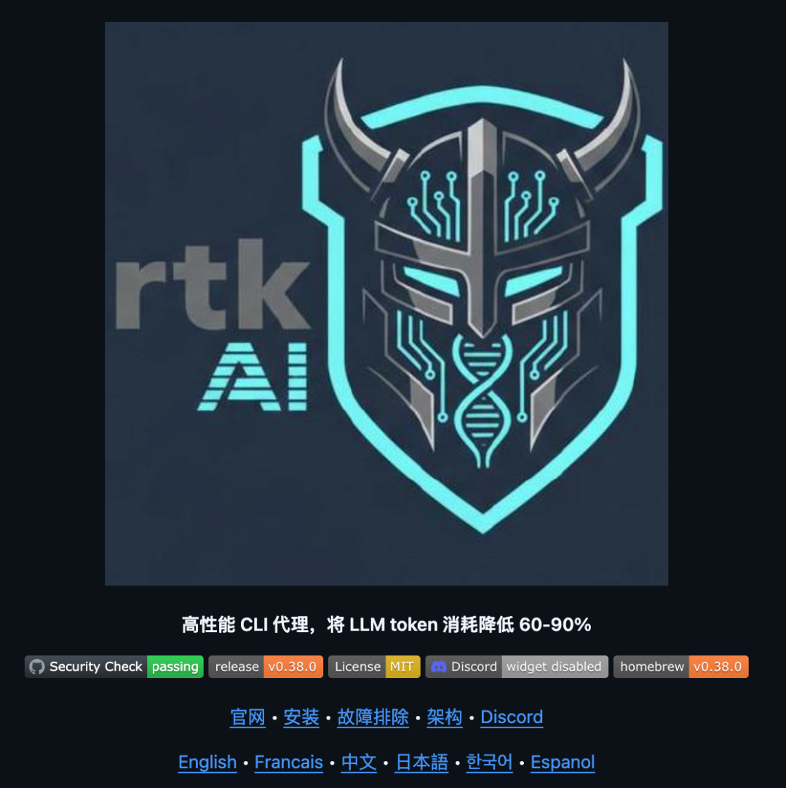

它是一个用 Rust 写的 CLI 代理工具，拦截并压缩这些命令的输出，平均压缩率能达到 80-90%。

支持超过 100 种命令的智能过滤，覆盖 git、测试框架、构建工具、Docker、AWS 等场景。

它的原理是通过 Hook 机制自动改写命令，比如把 git status 变成 rtk git status，对 AI 来说完全透明，你什么都不用改。

单个二进制文件，零依赖，开销低于 10ms，已经支持 Claude Code、Cursor、Gemini CLI、Codex 等 12 种 AI 工具。

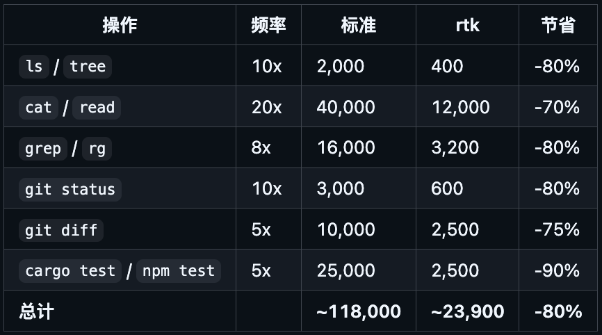

对于重度使用 AI Coding 工具的开发者来说，这个工具能直接帮你省钱，同时让会话的上下文活得更久，AI 的推理质量也更稳定。

```
开源地址：https://github.com/rtk-ai/rtk
```

02

**让 AI Coding 不再抛硬币**

用 AI Coding 工具修一个 bug，跑三次可能得到三个不同的结果。

有时候它会跳过测试，有时候忘了做代码审查，有时候 PR 描述写得乱七八糟。

每次运行都像抛硬币，缺乏确定性。

Archon 的核心理念是：Dockerfile 规范了基础设施，GitHub Actions 规范了 CI/CD，那 AI 编码流程也需要一个规范。

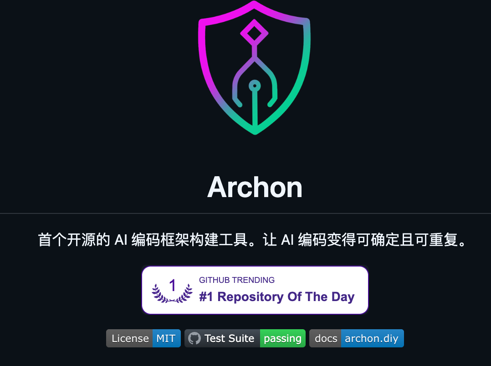

它把开发流程编码成 YAML 工作流，确定性步骤，跑测试、执行脚本和规划、代码生成混合编排，AI 只在需要智能的环节介入。

每次工作流运行在独立的 git worktree 中，5 个修复任务可以并行执行互不冲突。

内置了 17 个默认工作流，修 issue、从想法到 PR、代码审查、安全重构这些场景都有。

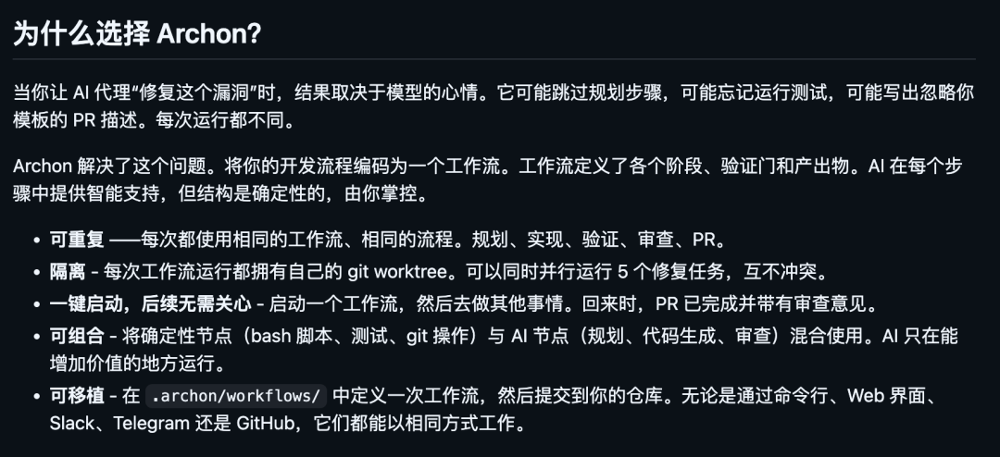

还有 Web UI 可以可视化拖拽编辑，支持从 Slack、Telegram、Discord、GitHub 远程触发。

这个项目最近刚经历了一次完全重写，从 Python 迁移到了 TypeScript，定位也从 AI Agent 构建器转型为 AI 编码工作流引擎。

```
开源地址：https://github.com/coleam00/Archon
```

03

**在手机上离线跑大模型**

Google 最近开源了一个端侧 AI 展示应用 AI Edge Gallery，让你直接在手机上跑大语言模型，完全离线，不用连网。

AI Chat 支持思考模式，可以看到模型的推理过程。


Ask Image 能理解图片内容，Audio Scribe 实时语音转录翻译，Prompt Lab 可以调参数做实验。

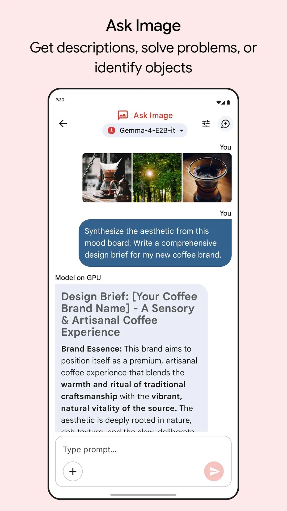

还有一个 Agent Skills 系统，可以加载模块化技能比如查 Wikipedia、地图交互等，把 LLM 从纯聊天工具变成主动助手。

它还支持模型基准测试，能对比不同模型在你手机上的性能表现。

底层基于 LiteRT 运行时做了优化，最新版已经支持 Gemma 4 系列模型。目前已经上架了 Google Play 和 App Store，Android 12+ 和 iOS 17+ 都能用。

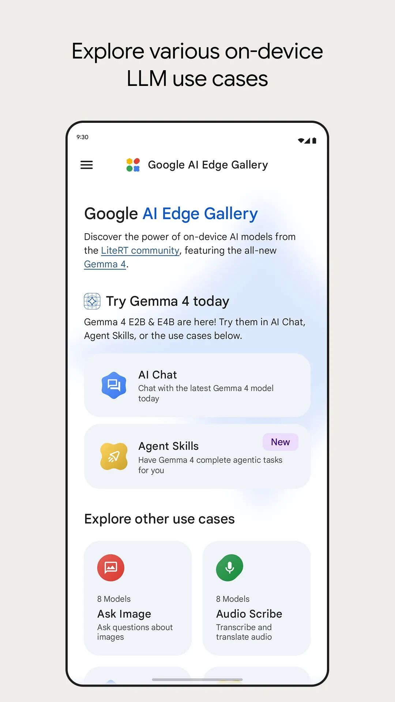

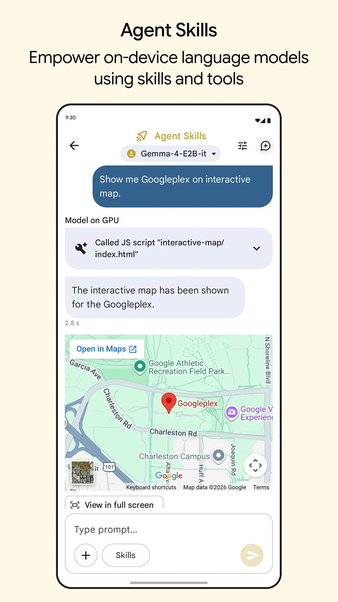

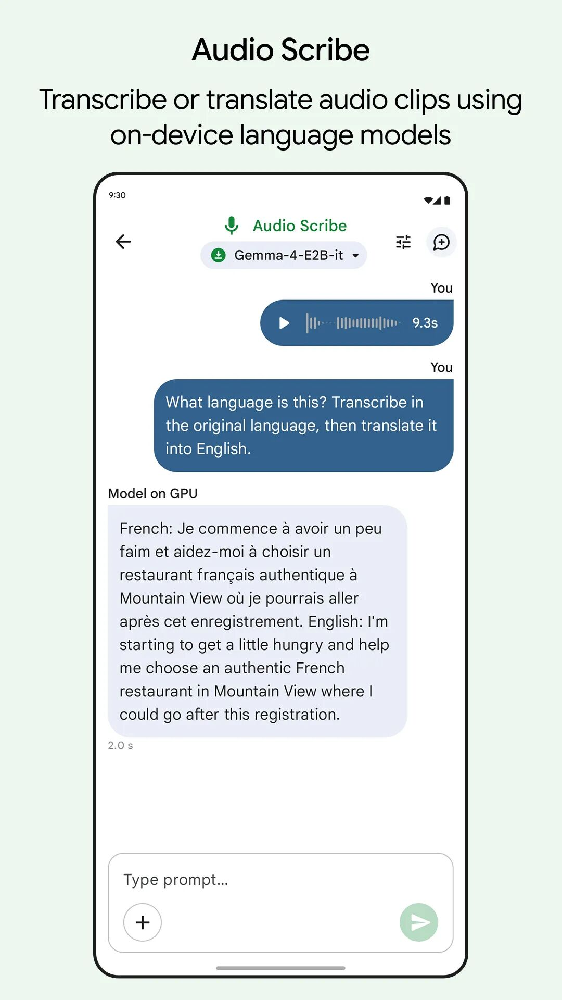

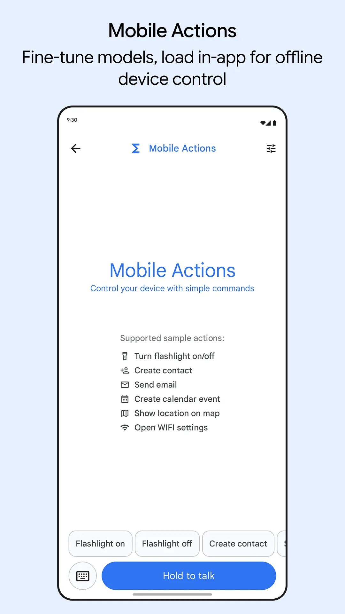

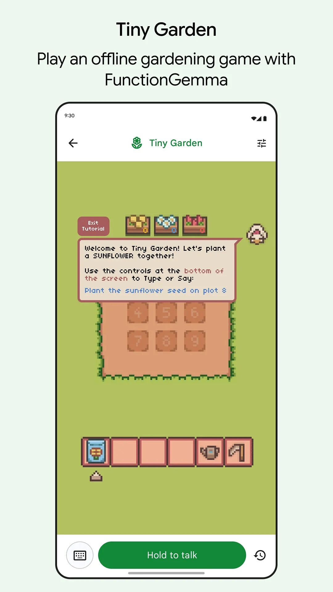

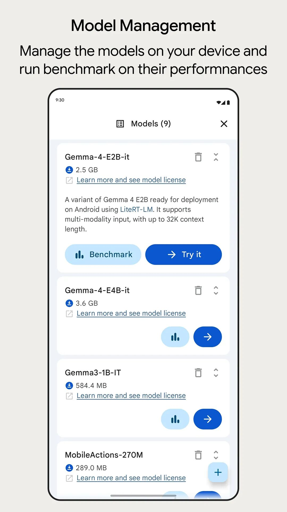

不管你是想体验一下端侧 AI 的能力，还是评估手机硬件能跑什么模型，都值得装一个试试。

```
开源地址：https://github.com/google-ai-edge/gallery
```

04

**AI 生成真正可编辑的 PPT**

PPT Master 生成的是真正的原生 PPTX 文件。


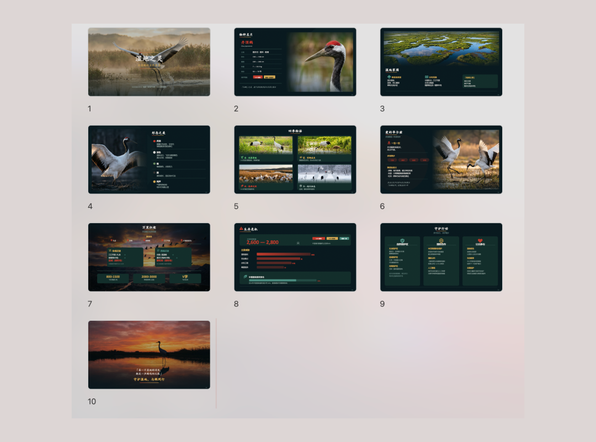

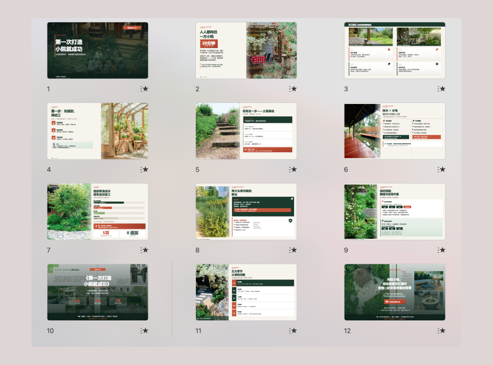

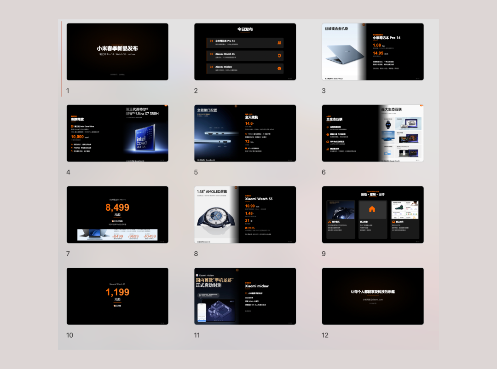

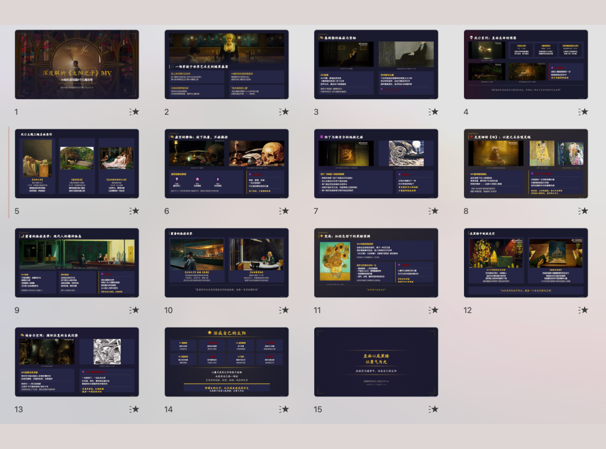

每个形状、文本框、图表都是独立的可编辑对象，在 PowerPoint 里想怎么改就怎么改。

使用方式很简单，丢给它 PDF、Word、URL 或者 Markdown 文档，它就能生成完整的演示文稿。

支持自定义模板，内置了 22 个示例项目共 309 页，还有各种风格可选：杂志风、学术风、暗黑艺术风、自然纪录片风、科技 SaaS 啥的。

```
开源地址：https://github.com/hugohe3/ppt-master
```

05

**3300 行代码实现自进化 Agent**

GenericAgent 是一个极简但野心很大的项目，核心代码只有约 3000 行，却实现了完整的自进化 Agent 系统。

目前 8.4K Star。

它的核心思路是用一棵技能树从小种子长出全面的系统控制能力。

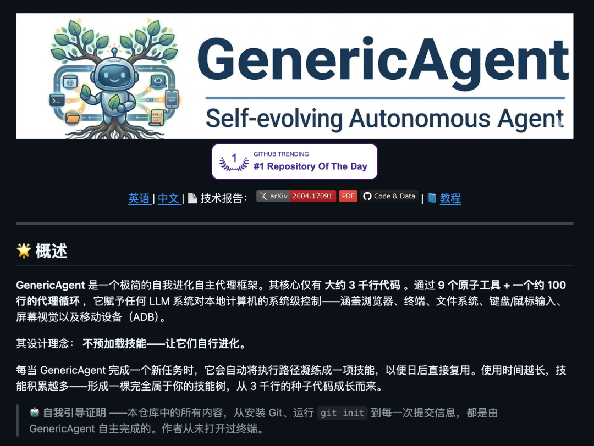

Agent 从 9 个原子工具读文件、写文件、执行命令、搜索等和约 100 行的 Agent Loop 出发，通过不断执行任务来积累和进化技能。

整个系统采用分层记忆架构 L0-L4，从短期工作记忆到长期知识库，让 Agent 能真正「记住」和「成长」。

单次任务消耗不到 30K token，而传统方案通常需要 200K 到 1M。


它支持 Claude、Gemini、Kimi、MiniMax 等多种模型，内置真实浏览器注入能力，还提供了 QQ、微信、Telegram、飞书、钉钉等机器人前端。

整个仓库的代码都是 Agent 自己开发的。

想研究怎么用最少的代码实现最强的 Agent 能力，这个项目值得深入研究。

```
开源地址：https://github.com/lsdefine/GenericAgent
```

06

**又一个 SKill 包**

mattpocock/skills 是 TypeScript 大佬 Matt Pocock 出品的 Claude Code Skills 合集。

口号是 Skills for Real Engineers。

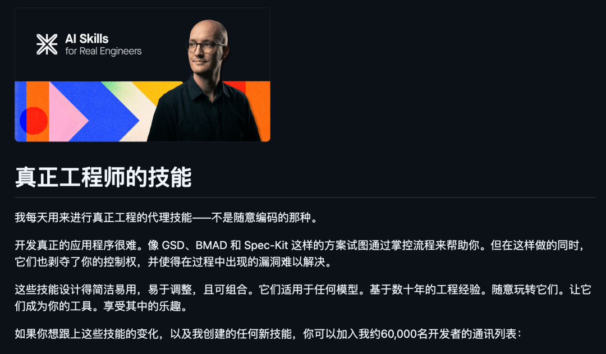

它针对 AI 编程的 4 个失败模式对症下药：

需求对不齐就用 /grill-me 和 /grill-with-docs 做深度问答，逼你把需求想清楚。

AI 输出啰嗦就建立共享语言和 CONTEXT.md 让沟通更精准。

代码容易出错就用 /tdd 强制测试驱动开发。

架构变成面条就靠 /caveman、/zoom-out、/improve-codebase-architecture 这些技能来重构。

此外还有 /diagnose 排查问题、/triage 分类 issue、/to-issues 拆任务、/to-prd 写产品文档等实用技能。

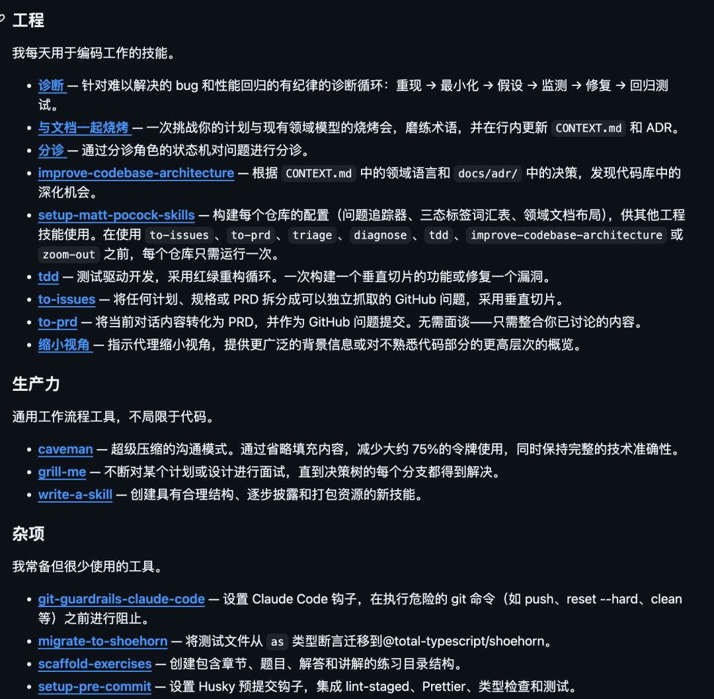

安装非常简单，一行命令搞定：`
`

```
npx skills@latest add mattpocock/skills
```

每个 Skill 都是精心设计的 Claude Code 工作流，不是简单的 prompt 模板，而是把最佳实践编码成可重复执行的流程。

如果你在用 Claude Code 做严肃的项目开发，这个技能包能让你的开发体验直接上一个台阶。

```
开源地址：https://github.com/mattpocock/skills
```

07

**Google 出品的端侧推理引擎**

LiteRT-LM 是 Google 推出的端侧大模型推理框架，专门为手机、树莓派这类资源有限的设备做优化。

目前已经用在了 Chrome、Chromebook Plus、Pixel Watch 等 Google 自家产品里。

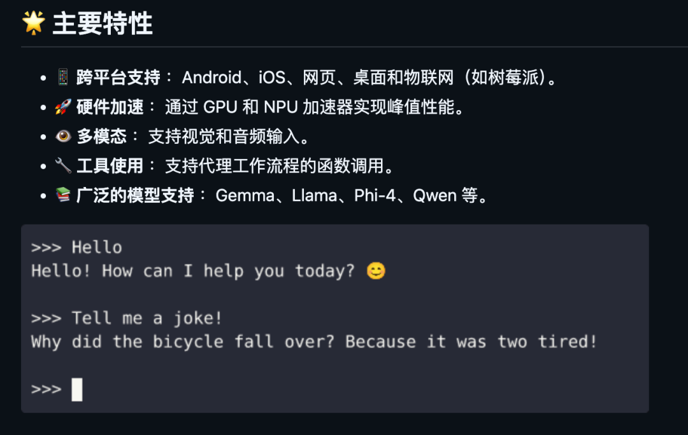

它支持 Android、iOS、Web、桌面、IoT 全平台，通过 GPU 和 NPU 硬件加速来压榨性能。

支持多模态输入和 Tool Use 函数调用，可以用来构建端侧的 AI Agent 工作流。模型兼容性也不错，Gemma、Llama、Phi-4、Qwen 这些主流模型家族都支持。

最近增了 Gemma 4 支持和一个 CLI 工具，一行命令就能在终端跑模型。

提供 Kotlin、Python、C++ 三种 API，Swift 版本还在开发中。如果你在做移动端或者嵌入式设备的 AI 集成，这个框架值得关注。

```
开源地址：https://github.com/google-ai-edge/LiteRT-LM
```

08

**其它热门项目**

下面这 8 个项目之前文章里已经详细介绍过了，这里简单带一下。

hermes-agent：这个月一口气涨了 10 万多 Star，是一个能随你一起成长的 Agent 框架，支持自定义工具和记忆系统。

markitdown：微软出品的文件转 Markdown 工具，你丢给它 PDF、Word、PPT、Excel 各种文件，它都能给你转成干净的 Markdown 格式，处理文档的时候非常方便。

andrej-karpathy-skills：作者基于 Karpathy 公开分享的对 LLM 编码陷阱的观察，整理出了一份 CLAUDE.md 配置文件。直接丢到你的项目里就能改善 Claude Code 的编码行为。

claude-mem：一个 Claude Code 的记忆插件，它能自动记录你每次和 Claude Code 的编码会话，压缩之后注入到以后的对话里，解决上下文丢失的老问题。

hackingtool：一个老牌的渗透测试工具合集，里面集成了各种安全测试工具，做安全的朋友应该都不陌生。

claude-howto：一个 Claude Code 的可视化教程，从基础概念到高级 Agent 开发，都配了可复制粘贴的示例模板，新手入门非常友好。

oh-my-codex：专门给 OpenAI Codex 加各种增强功能，加了 hooks、HUD 界面、Agent 团队协作这些功能，把 Codex 的体验拉高了一个档次。

free-claude-code：一个轻量级代理服务器，把 Claude Code 的 API 请求转发到免费的第三方 LLM 服务上，只需配两个环境变量就能用。

09

**点击下方卡片，关注逛逛 GitHub**

这个公众号历史发布过很多有趣的开源项目，如果你懒得翻文章一个个找，你直接关注微信公众号：逛逛 GitHub ，后台对话聊天就行了：


