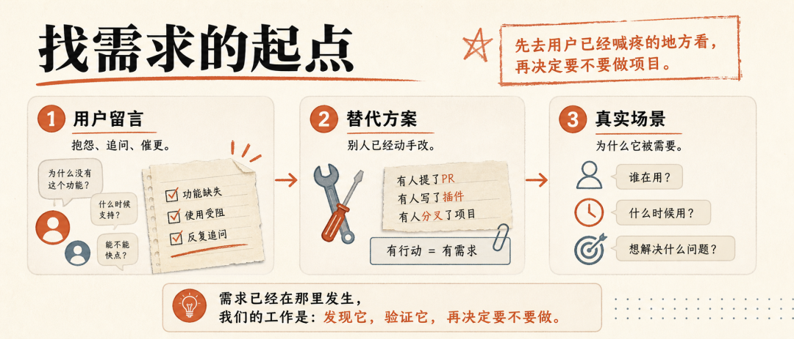
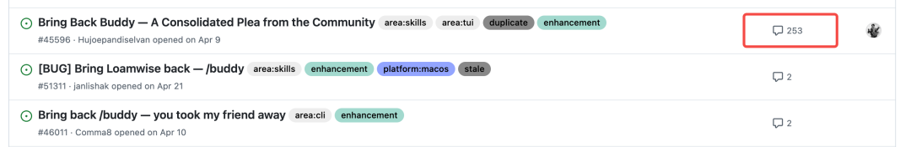
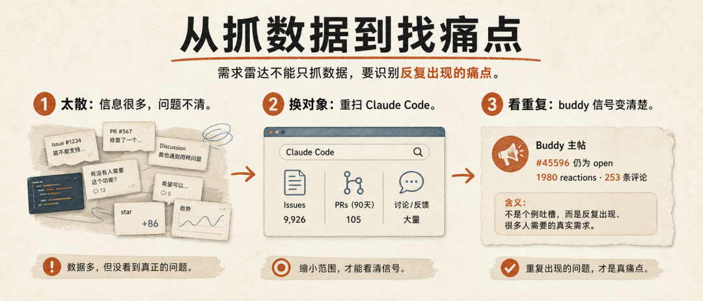
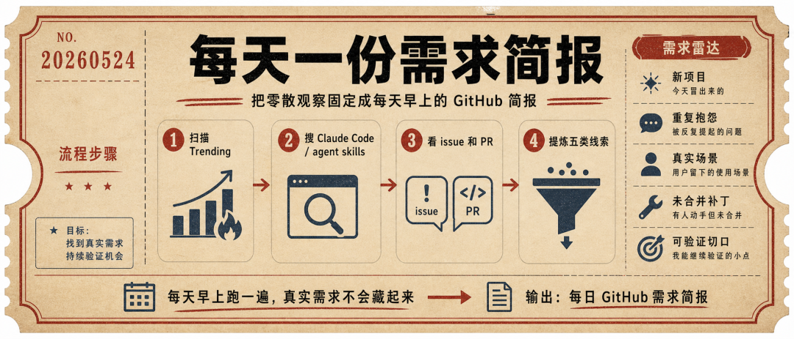
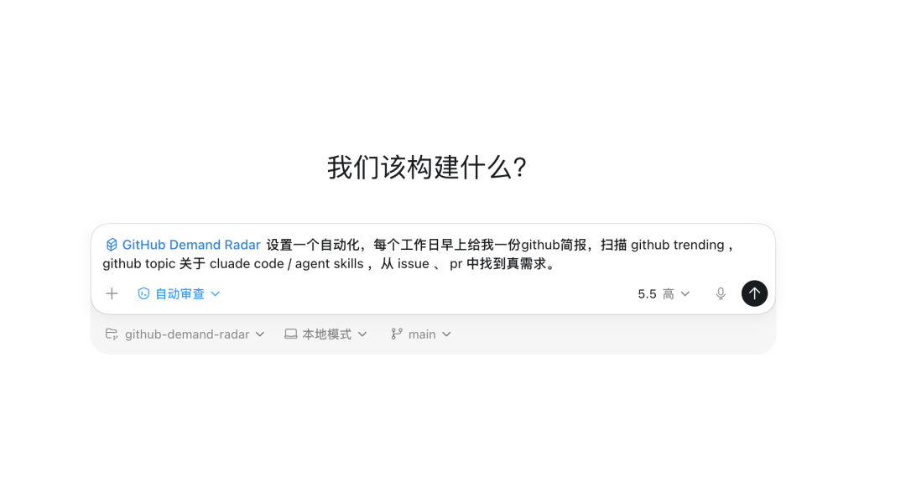
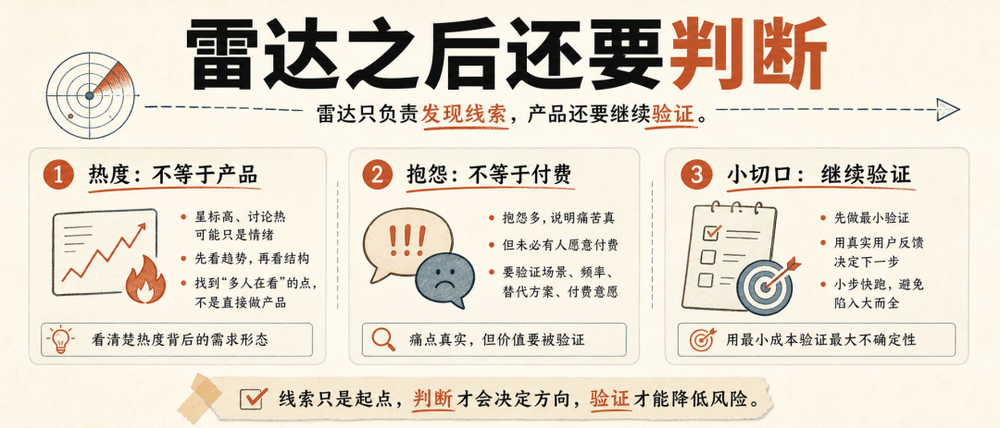

> 📎 来源: [极客杰尼](https://mp.weixin.qq.com/s?__biz=MzA5Njg4Mzk0NQ==&mid=2649825634&idx=1&sn=4fe35b390b3a73448c552b3855db8c56&chksm=8996acbf8f3de6193577e12c5d21afdbc1dadef09bed33bc3defc5b66184a58c19ebc0ca1e01&mpshare=1&scene=1&srcid=0528WCEE9S8uUMSXmwvydS7g&sharer_shareinfo=a4a881cd2cb425924f034c2d01fdb96d&sharer_shareinfo_first=a4a881cd2cb425924f034c2d01fdb96d) | 时间: 2026-05-28 21:06

---

x 

开源手记5 min read

我把找需求这件事做成了雷达

从一个简单想法出发，把 Github 里的用户需求整理成每天都能看的项目线索

极客杰尼

GithubCodex独立开发

大家好，我是极客杰尼。

周末我把 Github Demand Radar 开源了，一个帮你从 Github 里找真实需求的 Skill。

今天就聊聊我是怎么把这个想法做成工具的。

## 这个想法从哪来

我一直觉得，找项目最难的地方，不是写代码。

真正难的是：你怎么知道这个东西值得做？一般是从会从自己的灵感和需求出发，开始实现。

最近我发现 Github 一些热门项目里藏着很多小众需求。

一个项目的用户会在那里留言、讨论、写替代方案。

于是我立马实现了一个 Skill，通过 Hermes Agent 定时扫描一些热门项目的 Issue / PR。

## 我的一次实验

一开始我主要扫 Claude Code 项目。

Claude Code 里有一个叫 buddy 的小功能，很多用户想把它找回来。有人写长留言，有人补充使用场景，有人说自己为什么需要它。

这个需求在4月份热度非常高，后面有很多给 Claude Code 定制桌宠的项目，情绪价值拉满，我周六还写了一篇教程。[你可能不知道的玩法，Codex 还能定制桌面宠物...（附教程）](https://mp.weixin.qq.com/s?__biz=MzA5Njg4Mzk0NQ==&mid=2649825622&idx=1&sn=960d36504b04cf0df644aa3049d71a84&scene=21#wechat_redirect)

我的判断

一个小功能背后，可能藏着真实需求

1

用户反复提起

2

有人补充具体场景

3

情绪很强

4

需求边界逐渐清楚

重点观察数据背后的商业信号

## 我把它做成了工具

上个月我已经把这个流程做成了 Github Demand Radar Skill。

之前要手动翻 Github Trending、搜关键词、看用户留言。

现在我只需要把这套动作交给 Codex，每天早上定时发我一份简报。

## 保姆级配置一次

打开 Codex 桌面端，先下载 geekjourneyx/github-demand-radar 项目。

然后在输入框直接贴这句：

> 使用 Github Demand Radar 技能，设置一个自动化，每个工作日早上给我一份 Github 简报，扫描 Github Trending，以及 Claude Code / agent skills 相关 topic，从 issue 和 PR 中找到真需求。

issue 就当用户留言区，PR 就当别人提交的修改方案。

## 最后的思考

这次开源 Github Demand Radar，我真正想验证的是一件事：找需求能不能从偶然刷到，变成每天稳定出现的输入。

buddy 功能在当时很高，现在很明显已经过了产品化的时间段。

现在 Agent 可以帮我把线索整理的很全。

最后要不要做、怎么做、做到什么程度，还是要回到自己的判断。

如果你也在找项目，可以先拿一个熟悉项目跑一遍。

收藏这篇

关注后续

转给在找需求的朋友

下一步接入每日需求雷达

---

以上。

既然看到这里了，如果觉得有用，随手点个「赞」「在看」「转发」三连吧。

想第一时间收到推送，可以给我加个星标。
