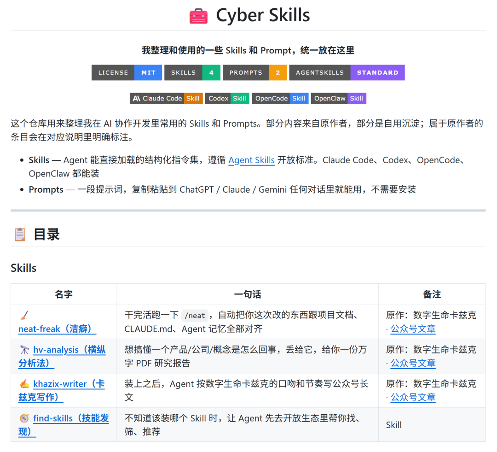

> 📎 来源: [赛博包工头](https://mp.weixin.qq.com/s?__biz=MzkxMjczOTU5Ng==&mid=2247483727&idx=1&sn=4a14cbdbd71c27c0961dca15038ea229&chksm=c0638234853497a389829b7e84684c4b193d7d114d7a3c32681221c58dc0493c10d23606ebeb&mpshare=1&scene=1&srcid=0513GmRS6eBerRnCVWIJbapr&sharer_shareinfo=ac3364b1df6cb8f02a4950b0e58030e2&sharer_shareinfo_first=ac3364b1df6cb8f02a4950b0e58030e2) | 时间: 2026-05-13 01:59

---

## 目录

1. 我做了一个很小的仓库
2. 为什么要整理 Skills 和 Prompts
3. 这个仓库里有什么
4. 怎么用
5. 最后

---

## 我做了一个很小的仓库

事情是这样的。

我这两天做了一个 GitHub 仓库，叫 Cyber Skills。

仓库地址是：

https://github.com/335812350/cyber-skills



里面放的东西很直白。

我平时在 AI 协作开发、写作、研究里常用的一些 Skills 和 Prompts，统一整理到这里。

现在仓库还不大。

4 个 Skills。

2 个 Prompts。

但我整理完以后，反而觉得这事值得单独写一篇。

因为过去一年我越来越明显地感觉到，很多人用 AI 的问题，已经不只是“不会写 Prompt”了。

更常见的问题是，好用的经验太散。

散在收藏夹里。

散在群消息里。

散在某个临时文档里。

散在某次和模型聊出来的上下文里。

当时觉得很好用，过两天再找，找不到了。

好不容易找到了，又忘了当时适合什么场景。

这就很麻烦。

## 为什么要整理 Skills 和 Prompts

AI 协作这件事，用得越久，我越觉得真正该沉淀的东西，已经从“某一句提示词”变成了“某一套可复用的工作习惯”。

Prompt 很有用。

但 Prompt 更像一段临时说明。

你把它复制给 ChatGPT、Claude、Gemini，它就按这段话试着干。

Skill 更像一个小工作流。

它会把角色、边界、流程、文件约定、检查方式都写清楚。

Agent 装上以后，下次遇到同类任务，就不用你从头解释一遍。

这个差别挺大。

所以我把仓库分成两层。

一层是 Skills。

给 Claude Code、Codex、OpenCode、OpenClaw 这类支持 Skill 的 Agent 用。

一层是 Prompts。

给还没用 Skill 系统的人用。

复制粘贴，也能跑。

这很现实。

不是每个人都已经进入 Agent 工作流。

有些人只是想先试一下，看看这个方法对自己有没有用。

所以 Prompts 这一层我也保留了。

它像一个入口，门槛低一点。

## 这个仓库里有什么

这个仓库目前分成两块。

Skills 是给 Agent 装的。

Prompts 是给人复制的。

看起来只是目录不同，其实对应的是两种使用方式。

### 1. neat-freak：收尾时把项目知识对齐

先说第一个 Skill。

neat-freak，中文我叫它洁癖。

这个东西解决的是一个很无聊但很要命的问题：项目文档过期。

你应该也见过这种情况。

代码已经改了七八轮。

README 还是旧命令。

docs 里写着已经废掉的接口。

CLAUDE.md 或 AGENTS.md 里还保留着三个月前的架构说明。

Agent 下一次进来一看，信了。

然后它很认真地基于旧信息继续干活。

这时候模型看起来像变笨了。

但很多时候，是你给它的项目知识已经过期。

neat-freak 做的就是收尾。

每次任务结束，你让 Agent 跑一下整理，它会把本次变更和项目文档、README、CLAUDE.md / AGENTS.md、Agent 记忆对齐一遍。

这件事靠人长期坚持很难。

太碎了。

也没什么即时快感。

交给 Agent，反而刚好。

### 2. hv-analysis：研究前先搭坐标系

第二个是 hv-analysis。

也就是横纵分析法。

这个适合做研究。

它的思路很朴素：纵向看时间线，横向看同期参照。

你要研究一个产品、公司、概念、人物，它会先把这个对象从诞生讲到现在，再把同一时期的竞品和参照物摆出来对比。

纵向看，你知道它怎么一步步变成今天这样。

横向看，你知道它在同一张桌子上到底坐在哪个位置。

这两个方向一交叉，判断会稳很多。

我一直觉得，很多所谓深度分析缺的不是资料。

缺的是坐标系。

只有时间线，很容易写成编年史。

只有竞品对比，又容易写成参数表。

横纵一起看，才更像研究。

所以这个 Skill 很适合写作前期。

先把地基打好，后面动笔就不会空。

### 3. khazix-writer：把写作风格变成可调用规则

第三个是 khazix-writer。

这个是数字生命卡兹克的写作 Skill。

它的定位很明确：让 Agent 按他的口吻和节奏写公众号长文。

这个 Skill 有意思的地方在于，它不只是要求“写得口语一点”。

它会规定很多具体禁忌。

不要写宏大开场。

不要动不动就写成报告。

不要满屏套话。

要有场景，有判断，有一点真实的人味。

这点我很认同。

AI 写作最大的问题，很多时候不在于不通顺。

恰恰是太通顺。

通顺到像客服话术。

礼貌，稳定，完整，但没有记忆点。

khazix-writer 的价值，就是把一套已经被验证过的写作习惯，沉淀成 Agent 可以调用的规则。

这里也说清楚。

仓库里涉及原作者的内容，我都在 README 里标了来源。

原作是谁，就是谁。

我只是整理、使用和说明。

开源也好，内容整理也好，来源一定要写清楚。

### 4. find-skills：不知道装什么时先让 Agent 找

第四个是 find-skills。

这个更像入口工具。

当你不知道该装哪个 Skill 时，让 Agent 先去开放生态里帮你找一圈。

这类东西以后会越来越有用。

因为 Skill 生态一旦多起来，问题就会从“有没有”变成“哪个靠谱”。

下载量、作者、维护状态、README 质量、真实使用场景，都会变成筛选成本。

find-skills 做的事情很简单。

先帮你找。

再帮你筛。

最后给你安装建议。

它不替你做决定，但能让你少在一堆链接里乱翻。

### 5. 两个 Prompt：不装 Skill 也能先跑起来

除了这 4 个 Skills，我还放了 2 个 Prompts。

第一个是横纵分析法 Prompt 版。

你可以把它理解成 hv-analysis 的轻量版。

还没用 Skill 系统，也可以直接把这段 Prompt 丢给 Deep Research 类型的模型跑。

第二个是 Codex 项目开发系统提示词。

这个是给工程协作用的。

它会要求 Codex 遇到大型任务时，先判断任务大小，再写方案，再做 Codex review，再修成 Plan v2，之后才拆 To-Do 和实施。

听起来有点重。

但你只要让 Agent 做过复杂需求，就知道这套流程为什么有必要。

很多 Agent 翻车，不是因为它不会写代码。

是因为它太急。

需求还没想清楚，它已经开始改文件。

改到一半发现方向不对，再补救，成本就上来了。

小改动当然没必要这么重。

改一行文案还要写 plan，那就太累了。

但涉及多文件、多模块、复杂业务逻辑时，先把方案写清楚，真的能少很多返工。

这也是我把它放进仓库的原因。

## 怎么用

如果你已经在用 Claude Code、Codex、OpenCode、OpenClaw，可以直接让 Agent 安装。

比如：

```
帮我安装这个 skill：https://github.com/335812350/cyber-skills/tree/main/neat-freak
```

把最后的 `neat-freak` 换成你想装的名字就行。

如果你还没用 Agent，也没关系。

先去 Prompts 目录里复制横纵分析法，或者复制 Codex 项目开发系统提示词试试。

先用起来。

用完觉得不顺手，就改。

Prompt 和 Skill 都不该被当成神谕。

它们更像工具柄。

真正握住它的人，还是你自己。

## 最后

我现在越来越觉得，AI 协作会慢慢从拼模型，走向拼习惯。

模型当然重要。

但同一个模型，交给不同的人，产出差异会非常大。

差异往往藏在工作流里。

你给它什么上下文。

你有没有验收标准。

你有没有把踩过的坑沉淀下来。

你有没有让下一次协作比这一次更聪明一点。

Cyber Skills 这个仓库现在只是一个小开始。

不大。

但我会继续慢慢整理。

如果你也在用 AI 做开发、写作、研究，可以去翻翻。

对你有用的话，给个 star 就行。

如果你有更好的 Skill 或 Prompt，也欢迎在 Issues / Discussions 里聊。

很多人都在追最强模型。

这当然没错。

但模型之外，那些小小的流程、规则、经验和习惯，也值得被认真保存。

因为真正改变日常工作的，往往就是某个你用顺手以后，再也回不去的小习惯。

这次，我只是先把其中几件，放到了一个仓库里。
