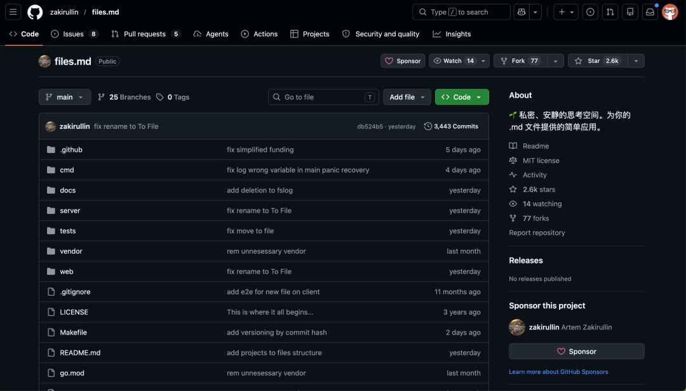
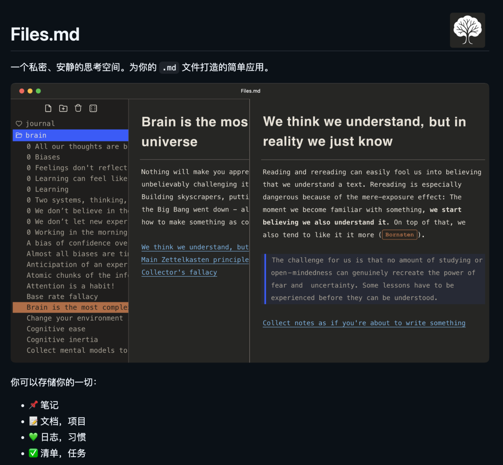
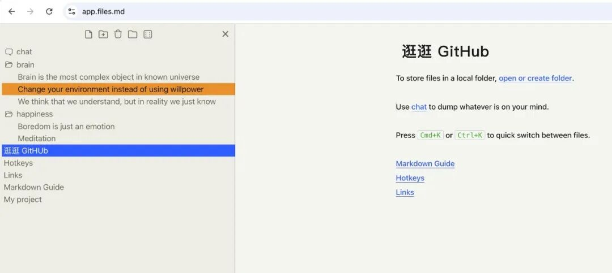
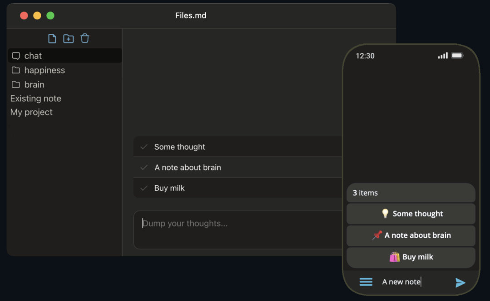
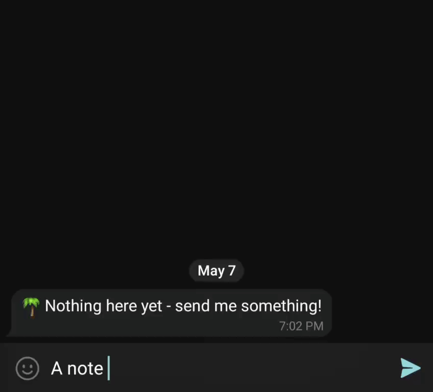
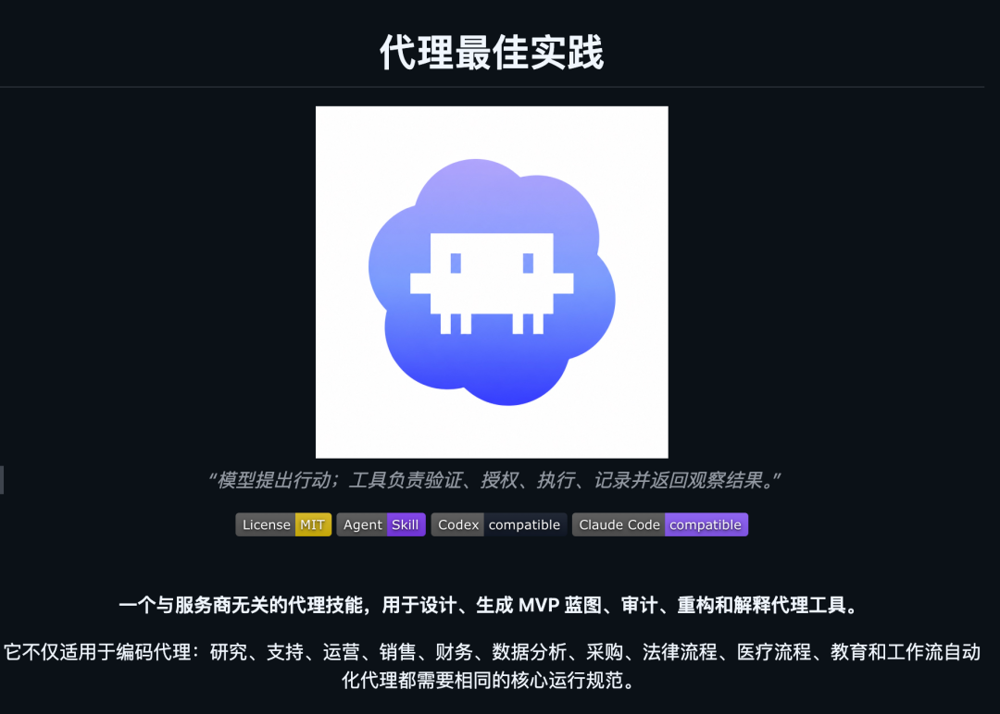
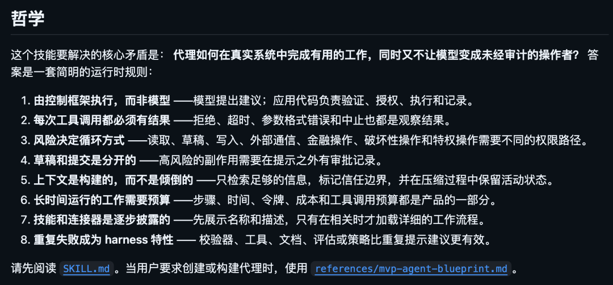
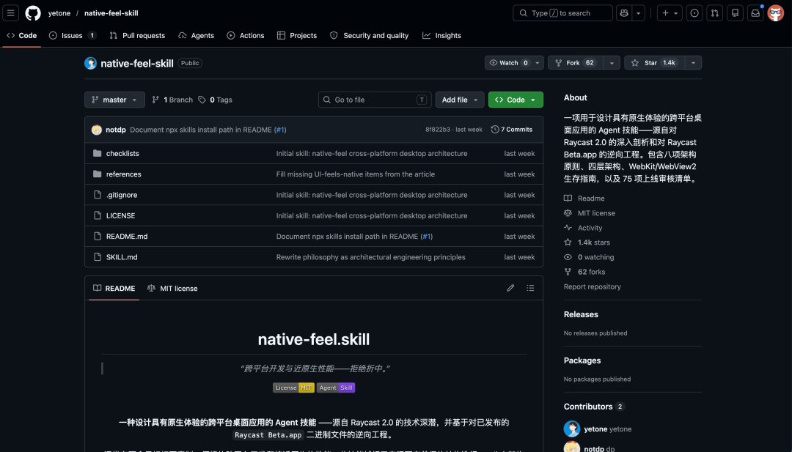

> 📎 来源: [逛逛GitHub](https://mp.weixin.qq.com/s?__biz=MzUxNjg4NDEzNA==&mid=2247534143&idx=1&sn=e1cc70e6f83be097bd48003712e0df8e&chksm=f8dc8bcd34462fee8d8bf3c6e88af7ed22b0eca8d1bfabe9f8b75e816ba1dda4b9c30744d763&mpshare=1&scene=1&srcid=0530CSXZQefhA5PWcR4I9Qpw&sharer_shareinfo=5324c18262eb8185c49f0c178a3621da&sharer_shareinfo_first=5324c18262eb8185c49f0c178a3621da) | 时间: 2026-05-30 18:06

---

01

**极简到极致的 Markdown 笔记工具**

最近刷 Hacker News 的时候，看到一个笔记工具：files.md。

这是一个极简的 Markdown 笔记应用，定位是 Obsidian 的开源替代品。



作者 Artem Zakirullin 花了 5 年时间打磨，目前在 GitHub 上拿到了 2000 多个 Star。

它就是你本地的一堆 .md 文件，加了一层很薄的 Web 界面。

**没有插件市场，没有模板系统，没有第二大脑的幻觉。** 作者的观点很直接：笔记越多不等于理解越深，工具越简单反而越能激发创造力。



几个让我印象深刻的点：

**零安装、零依赖。**

**浏览器打开 app.files.md 就能用，作者承诺 10 年后打开 HTML 文件照样能跑**



**数据完全属于你。**

**所有笔记就是本地的 .md 文件，可以用 iCloud、Dropbox、Google Drive 同步，也可以用官方提供的 Go 二进制文件自建服务端**



**LLM 友好。**

**项目自带 llms.txt 文件，复制到 CLAUDE.md 里，AI Agent 就能直接理解和操作你的笔记库。**

**有中文开发者在 X 上说，这才是 files.md 真正区别于 Obsidian 的地方：你的笔记库变成了 AI 能操作的知识库。**

而且还支持 Telegram 机器人快速记录想法、知识图谱关联、聊天式快速输入。



代码量极小，一个人就能看懂整个项目。

对 Obsidian 重度用户来说，files.md 可能太简陋了。

但如果你一直在找一个不被功能绑架的、真正属于你自己的笔记空间，这个项目值得试试。

```
开源地址：https://github.com/zakirullin/files.md
```

02

**一份给 AI Agent 的生产级生存指南**

agents-best-practices 是一个 Agent Skill，它是一套开发生产级 Agent 所需要的完整知识体系。

从架构设计、工具权限、上下文管理到安全评估。



这个项目的核心观点很清晰：**模型负责提议行动，Harness 负责验证、授权、执行和记录。** 

模型不是操作者，它只是建议者。有三大使用场景：

**生成 MVP Agent 蓝图：给定一个业务场景，输出最小可用的生产级安全 Agent 架构**

**审计现有 Agent：诊断你已有 Agent 的脆弱性、成本过高、调试困难等问题，给出修复优先级**

**设计工具、权限和连接器：教你怎么安全地让 Agent 接入 Slack、Linear、Google Drive、内部 API**

项目里 14 篇参考文档把 Agent 开发的方方面面都覆盖了。



8 条运行时哲学规则每一条都是实战经验。

比如"反复失败应成为 Harness 特性"，不要靠反复改 Prompt 来解决问题，而是从验证器、工具、文档层面根治。

安装也很简单，支持 Claude Code 和 Codex CLI，一行命令搞定。

有人用这个 Skill 做 Agent 系统的 code review 后，代码输出质量显著提升了。

```
开源地址：https://github.com/DenisSergeevitch/agents-best-practices
```

03

**跨平台桌面应用的终极指南**

## Raycast 用起来丝滑得像原生应用，但它底层其实是 WebView + Node.js。

有人直接反编译了 Raycast Beta.app，把答案扒了出来。



native-feel-skill 是一个 Agent Skill，专门教你怎么设计跨平台桌面应用，让它在 macOS 和 Windows 上运行时的体验跟原生应用几乎没有区别。

作者 yetone 也是 avante.nvim 插件的作者。

项目发布不到两天就在 GitHub 上拿到了 1000 多个 Star。

你可以用这个 Skill 完成两个事项：重构现有应用，使其更具原生感、从零开始开发跨平台原生体验应用

这个 Skill 的知识来源有两个：

一是 Raycast 团队公开的技术深度剖析文章，二是作者对 Raycast Beta v0.60.0 的逆向工程分析。

说白了，就是把 Raycast 的架构秘诀系统化地提炼了出来。

有人在 X 上说已经把这套方法论应用到了自己的 Tauri + Svelte + Rust 代码编辑器项目里。

如果你也在做跨平台桌面应用，这个 Skill 绝对值得装上。

```
开源地址：https://github.com/yetone/native-feel-skill
```

04

**点击下方卡片，关注逛逛 GitHub**

这个公众号历史发布过很多有趣的开源项目，如果你懒得翻文章一个个找，你直接关注微信公众号：逛逛 GitHub ，后台对话聊天就行了：


