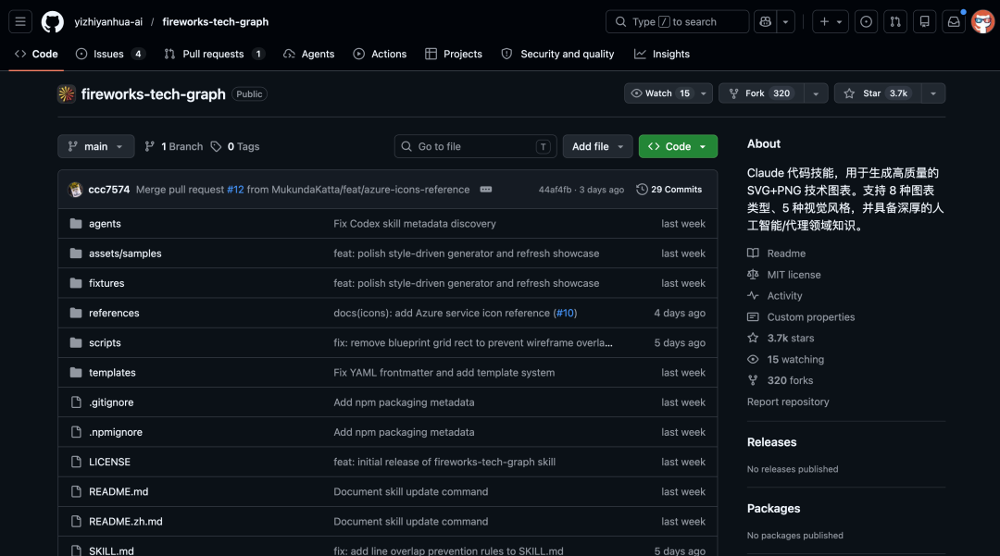
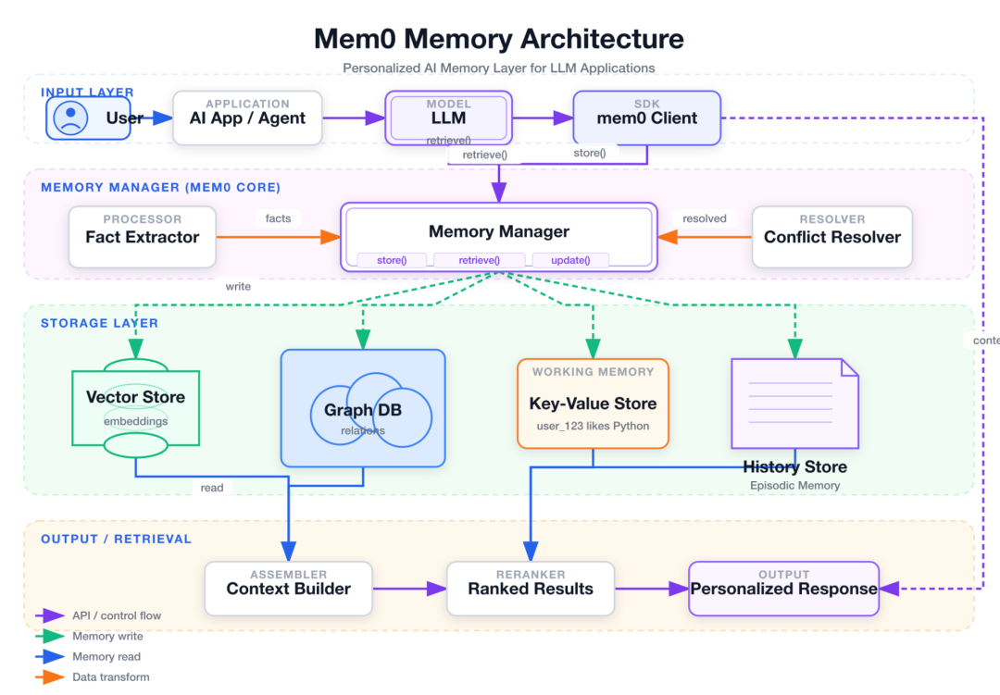
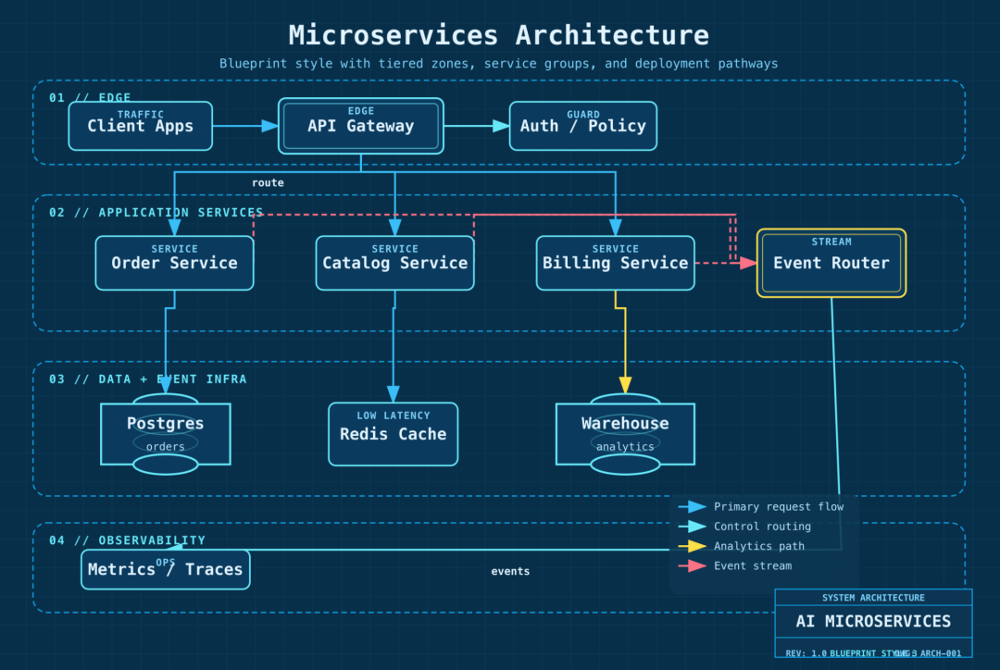
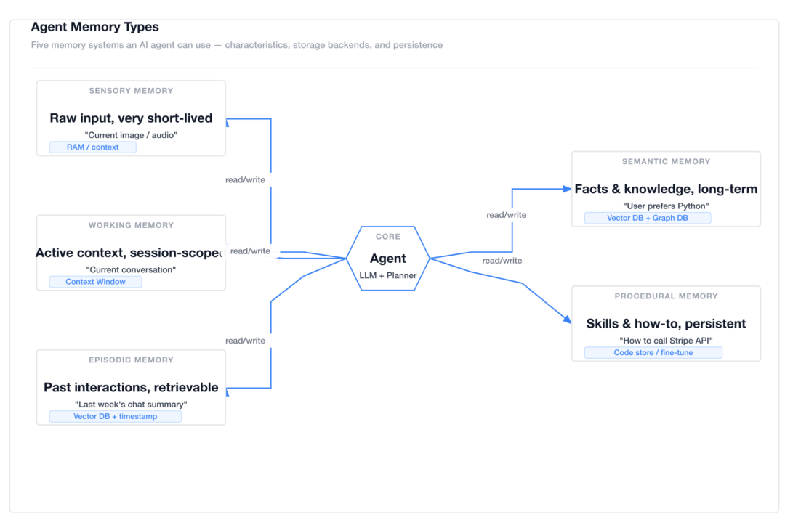
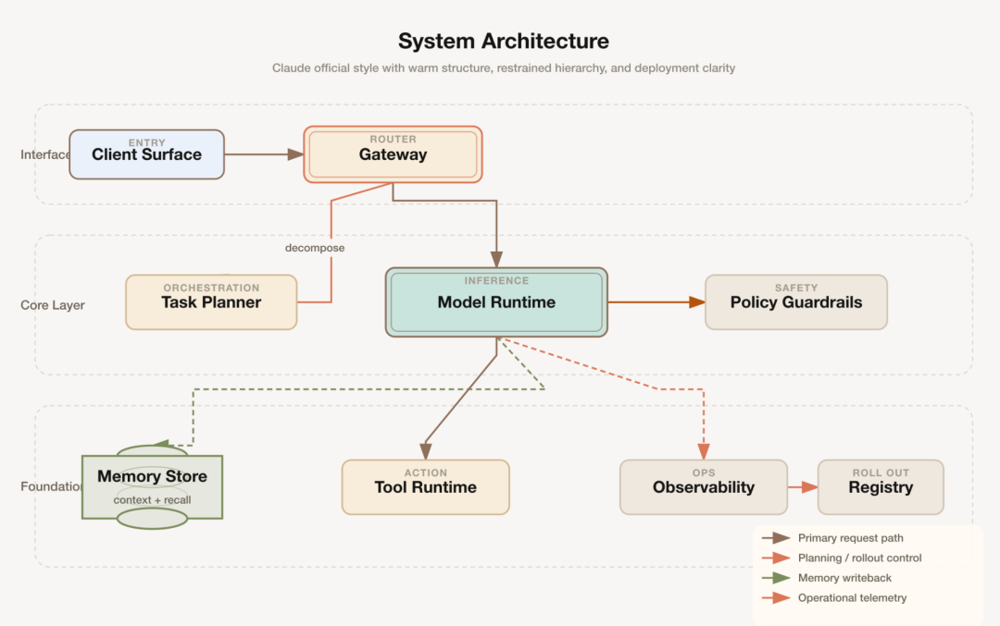
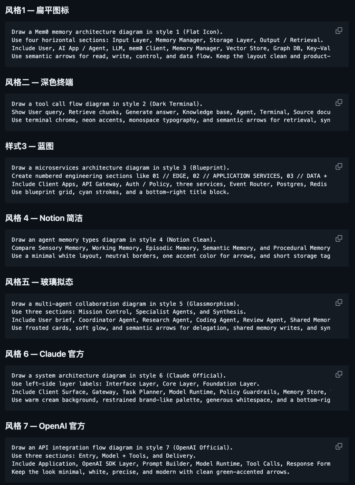
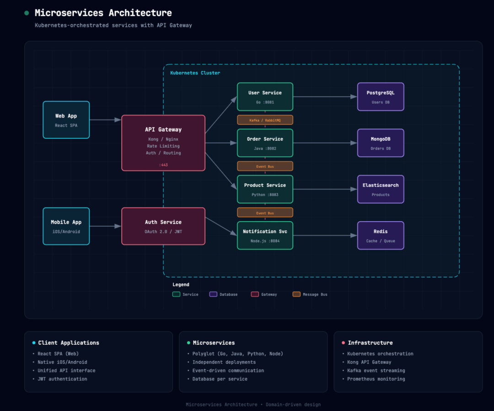
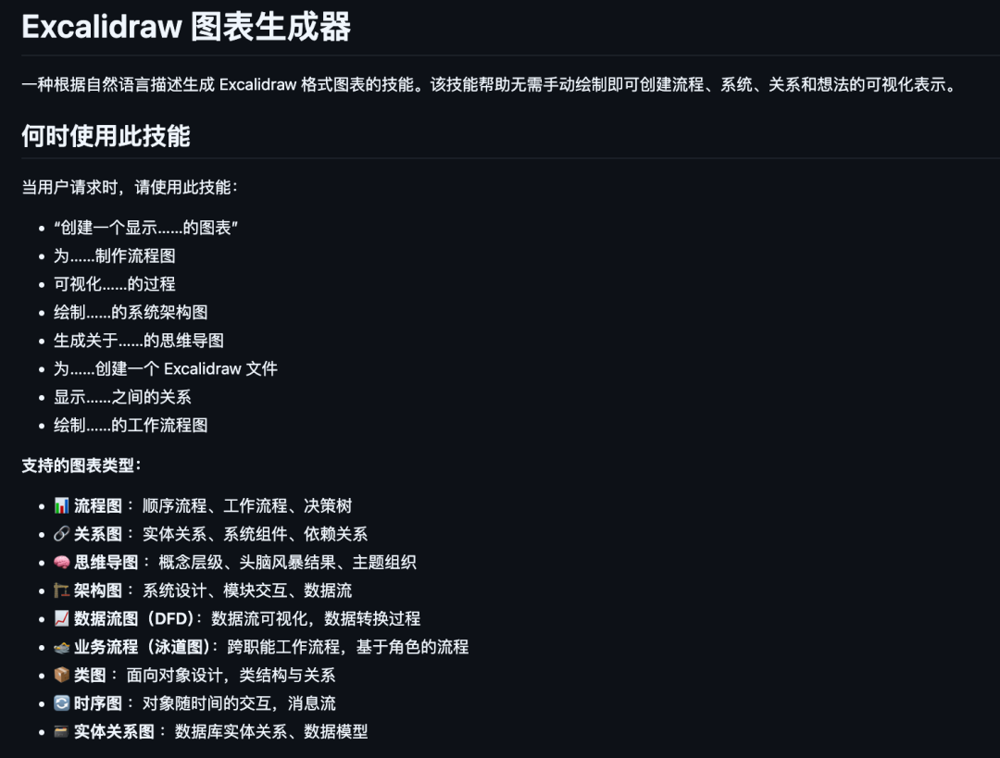
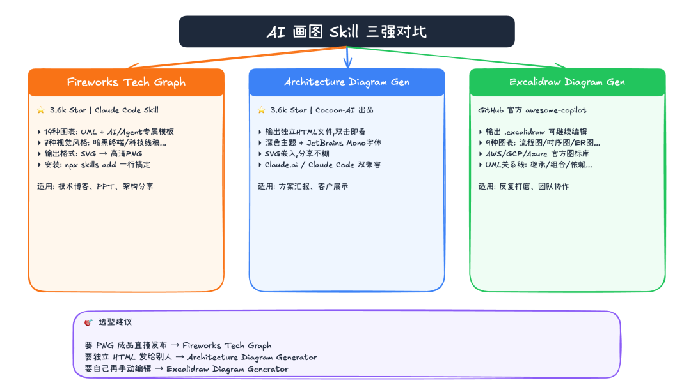

> 📎 来源: [逛逛GitHub](https://mp.weixin.qq.com/s?__biz=MzUxNjg4NDEzNA==&mid=2247533360&idx=1&sn=1847cadb7dbb7224a9a692729b8db51e&chksm=f8a15ce0878228fdf7680ea441b21ee5d323bb8c5f9694e8674f8700d5f57da9066c6976b156&mpshare=1&scene=1&srcid=0430Xiw3WVqgUOWlXxgVVd2w&sharer_shareinfo=663e07306f704a500dfbca8d03a3490b&sharer_shareinfo_first=663e07306f704a500dfbca8d03a3490b) | 时间: 2026-04-30 14:23

---

01

**一句话画出能直接发布的技术图**

最近在 GitHub 上翻到一个画图的 Skill，叫 fireworks-tech-graph，目前已经攒到了 3.6k Star。



这个项目干的事情说白了就是：你用大白话描述一下想要的图，它帮你生成 SVG，再导出成高清 PNG，直接就能塞到博客或者 PPT 里。

我看了一下它的能力矩阵，还挺顶的。

一共支持 14 种图表类型，UML 全家桶都有，还专门做了 AI/Agent 方向的模板。

比如 RAG pipeline、多 Agent 协作流程这种，在国内写 AI 相关内容的场景特别实用。









视觉风格也有 7 种可选，暗黑终端风、科技线稿风、手绘风都能切。

同一张图换个风格再生成一次就行，不用自己动手改样式。



它是个 Claude Code 的 Skill，装起来一行命令:

```
npx skills add yizhiyanhua-ai/fireworks-tech-graph
```

Mac 上还要 `brew install librsvg` 装一下底层依赖，用来把 SVG 转成 PNG。

装完之后，直接跟 Claude 说给我画一张 RAG pipeline 的流程图，用暗黑终端风格，几秒钟就给你一张能直接用的图。

```
开源地址：https://github.com/yizhiyanhua-ai/fireworks-tech-graph
```

02

**Architecture Diagram Generator**

画架构图还有一个很烦人的事，画完之后怎么发给别人看，如果导出图片清晰度可能不够，发 draw.io 文件对方还得装工具。

Cocoon-AI 开源的 architecture-diagram-generator 专门解决这个，Star 也冲到了 3.6k 这个量级。


它的输出形态很有意思，直接给你一个独立的 HTML 文件，里面嵌的是 SVG，双击就能在任何浏览器里打开看。

丢到微信、邮件都不会糊，分享起来相当无脑。

默认风格走的是深色主题，字体用的 JetBrains Mono，出来的图自带设计感，不用自己再去调配色。



这个 Skill 同时兼容 Claude.ai 和 Claude Code。

如果你在用 Claude.ai,直接去 Settings → Capabilities → Skills 把文件传上去就行。Claude Code 用户把文件扔到 `~/.claude/skills/` 下也能直接用。

挺适合那种要给老板或者客户做系统方案汇报的场景，出来的效果看着就挺专业。


```
开源地址：https://github.com/Cocoon-AI/architecture-diagram-generator
```

03

**Excalidraw Diagram Generator**

GitHub 官方出品，画完还能自己手动改

前面两个项目都是 AI 生成完就定稿了，想微调只能重新 prompt。如果你追求生成之后还能手动改，这个更合适。

它是 GitHub 官方 awesome-copilot 仓库里收录的一个 Skill，放在 `skills/excalidraw-diagram-generator` 下面。

最大的爽点在输出格式，生成的是 .excalidraw JSON 文件。

把文件拖到 excalidraw.com 里就能打开，然后所有元素都可以继续编辑。

excalidraw 就是那个 120K Star 的开源在线画板。



改颜色、挪位置、加箭头、删节点，全都没问题。

支持的图表种类也很全，我看了一下一共有 9 种：流程图、关系图、思维导图、架构图、数据流图、泳道图、类图、时序图、ER 图，日常画图基本都覆盖了。



特别值得一提的是它对 UML 关系线做了细致区分，继承、实现、关联、依赖、聚合、组合这几种线型全都按规范来，画类图显得特别专业。

要画云架构还能调 AWS、GCP、Azure 的官方图标库,不用自己再去找素材图。

挺适合需要反复打磨的场景，或者跟同事协作编辑的时候用。

```
开源地址:https://github.com/github/awesome-copilot/tree/main/skills/excalidraw-diagram-generator
```

04

**点击下方卡片，关注逛逛 GitHub**

这个公众号历史发布过很多有趣的开源项目，如果你懒得翻文章一个个找，你直接关注微信公众号：逛逛 GitHub ，后台对话聊天就行了：


