> 📎 来源: [逛逛GitHub](https://mp.weixin.qq.com/s?__biz=MzUxNjg4NDEzNA==&mid=2247534207&idx=1&sn=4529f12a1aaae6e83190754989d83ff2&chksm=f80804c29f79ed615c099d636672b441ba7d08b6ff561054e79014506a6b60beee557a5648b9&mpshare=1&scene=1&srcid=0531Y8NDXYXzhmMEApnu0weP&sharer_shareinfo=5443176e85f4567074d0a5a563a10cda&sharer_shareinfo_first=5443176e85f4567074d0a5a563a10cda) | 时间: 2026-05-31 14:07

---

01

**点一下桌面就能看穿所有窗口**

用 Mac 的人应该都知道，macOS Sonoma 有个挺舒服的交互：点击桌面空白处，所有窗口自动收起来，露出干净的桌面。

Windows 一直没有这个功能。

Scott Hanselman，微软的 VP 他自己也觉得这个体验应该有，所以写了个小工具叫 **PeekDesktop**。

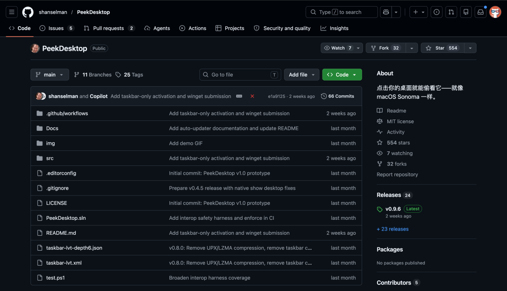

安装之后你什么都不用配。

点击桌面空白区域，所有窗口收起来。再点一下，或者点任何一个 App，窗口全部恢复到原来的位置。

跟 Mac 上一模一样的体验。

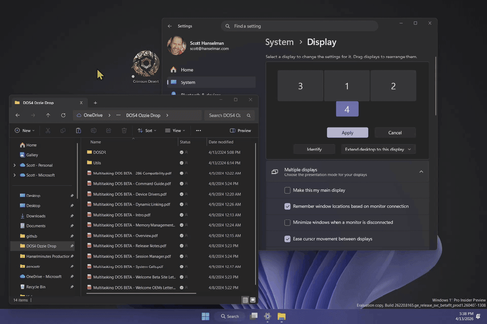

还支持 Fly Away 动画模式，窗口会飞出去，有点花哨但挺好玩

Hanselman 还专门写了一篇文章讲怎么把这个 .NET 程序从 65 MB 压到 1.88 MB，加了 LZMA 压缩之后甚至能塞进一张软盘。

整个工具不需要管理员权限，空闲时内存占用不到 5 MB。

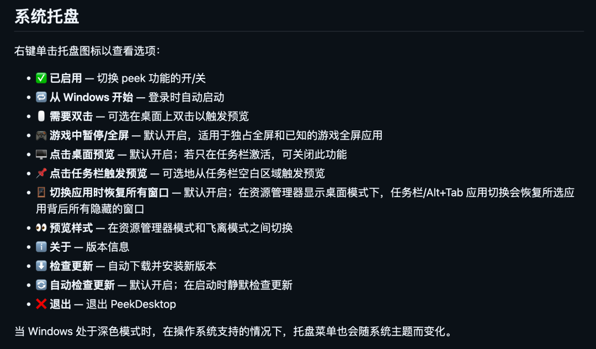

下载 zip 解压就能用，不需要安装 .NET 运行时，还自带自动更新。

```
开源地址：https://github.com/shanselman/PeekDesktop
```

02

**宫崎骏用了几十年的动画软件，免费开源**

如果你对 2D 动画感兴趣，OpenToonz 这个名字你应该听说过。

它是日本 DWANGO 公司开源的一款专业级 2D 动画制作软件，底层基于意大利 Digital Video 公司开发的 Toonz。

最关键的是**吉卜力工作室在这套软件上定制了十多年**，从《幽灵公主》时期就开始用了。

2016 年 DWANGO 把它开源，到今年正好 10 周年。

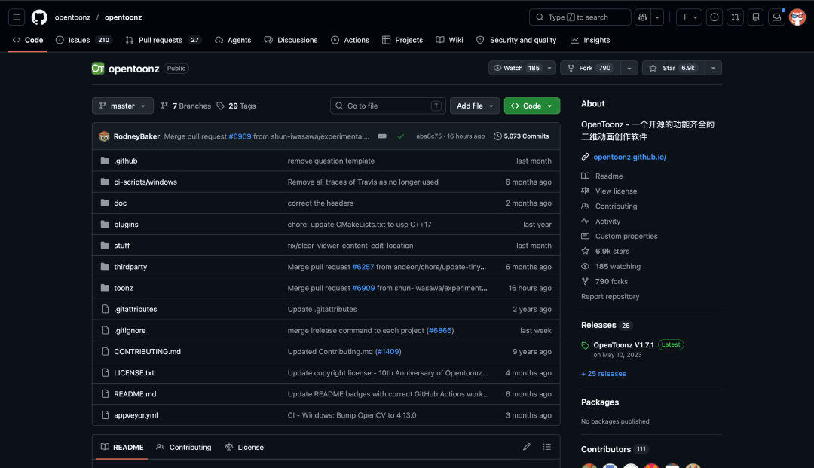

目前 GitHub 上大概 6900 Star，不算特别高，但这个项目的含金量不在 Star 数上。

这是一款真正在工业级动画制作流程中被验证过的工具。它能做这些：

- 矢量和光栅绘图，支持数位板压感
- 骨骼绑定（Skeleton Rigging），做角色动画效率很高
- 洋葱皮（Onion Skin），传统动画的核心功能
- 粒子特效、样式表管理

支持 Windows、macOS、Linux 全平台

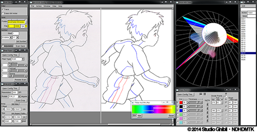

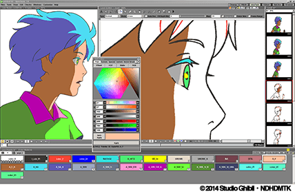

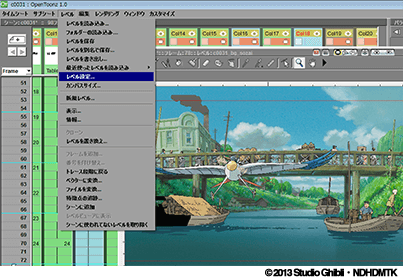

市面上免费的 2D 动画软件不多，能做到专业级别的更少。OpenToonz 算得上是最完整的一个。

```
开源地址：https://github.com/opentoonz/opentoonz
```

03

**录屏不用剪辑就能出片的开源工具**

做产品演示、教程视频的时候，录完屏通常还要花不少时间做后期。

加缩放、处理光标、加背景、调画面比例，一套下来比录屏本身还费劲。

Recordly 就是冲着解决这个问题来的。

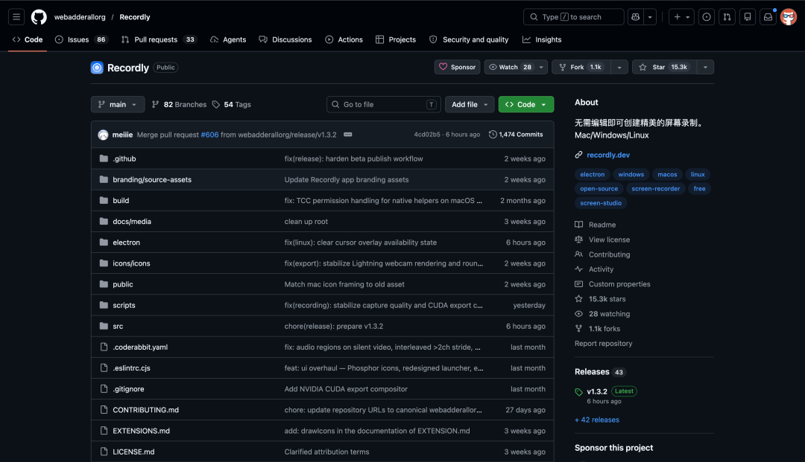

它是一个开源的桌面录屏 + 编辑工具，录完之后自动帮你把画面处理好。

光标会自动变平滑、点击时自动放大关键区域、还能给画面套上好看的边框和背景。

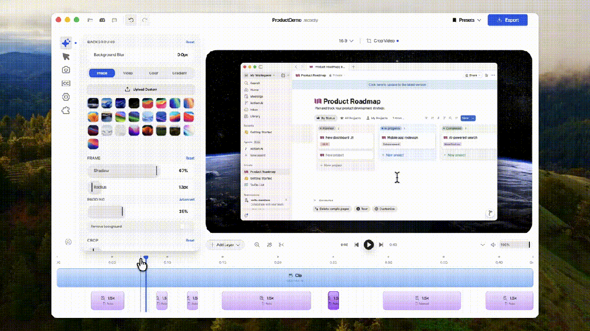

核心功能拆开看：

**自动缩放：根据光标活动自动生成 zoom 建议，聚焦观众注意力**

**光标美化：平滑移动、运动模糊、点击弹跳、摇摆效果，甚至可以用 macOS 风格的光标素材**

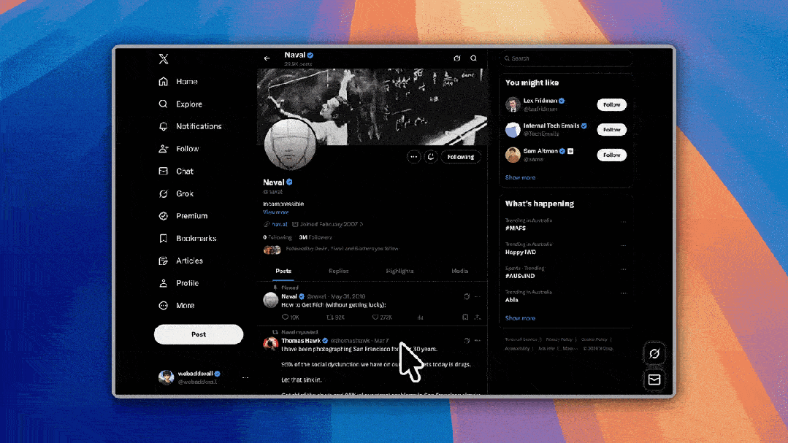

**时间线编辑：拖拽式的编辑器，支持裁剪、变速、添加标注、额外音轨**

**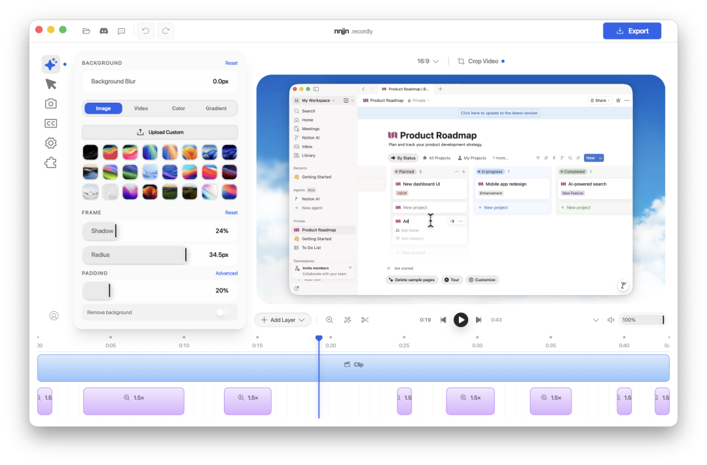

**摄像头气泡：可以把摄像头画面叠在录屏上，支持位置、大小、圆角、阴影等自定义****

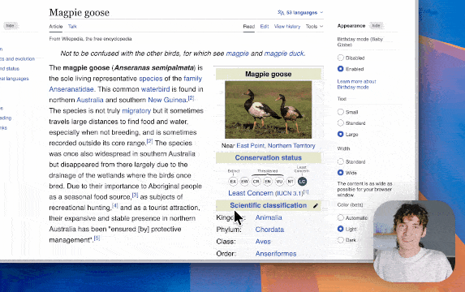

**样式化输出：内置壁纸、渐变背景、圆角、阴影、画面比例预设**

**扩展市场：有社区驱动的插件系统，可以安装点击音效、设备边框、浏览器 mockup 等**

支持导出 MP4 和 GIF，质量可选。跨平台运行，macOS、Windows、Linux 都能用。

对经常需要做演示视频的人来说，Recordly 能省掉大量后期时间。对比 Screen Studio 这类付费工具，Recordly 完全免费开源。

```
开源地址：https://github.com/webadderallorg/Recordly
```

04

**4.8 万程序员收藏的英语学习指南**

这是一个在 GitHub 上拿到近 4.8 万 Star 的英语学习指南，叫 **English-level-up-tips**。

作者 byoungd 当年为了帮朋友备考托福，整理了自己的英语学习经验。他高考英语和语文都是省第一（江苏卷），所以整理出来的方法论确实有两把刷子。

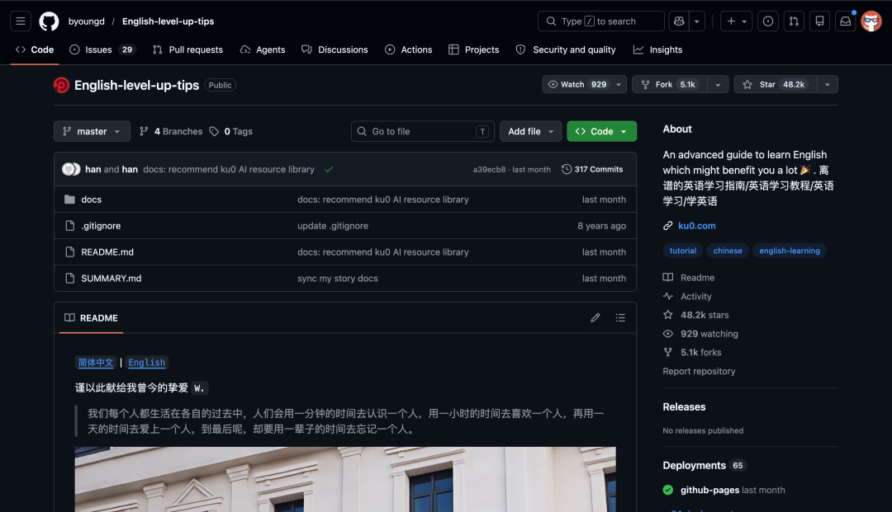

这份指南覆盖了英语学习的完整体系：

**理解、词汇、听力、阅读、口语、写作、AI 辅助**


好教你怎么用 Gemini 做英语学习主引擎，把 Gem、Live、Guided Learning、Canvas 等串成完整的训练流程。

同时讲了 ChatGPT、Claude、Perplexity、DeepL Write 如何分工使用

整个指南可以在线阅读，也提供了完整的高频词汇表。

这个项目不接受任何金钱赞助，他在 README 里写了一句话：

> 命运已经给了离谱诸多额外的馈赠，便不再需要其他奖赏。

```
开源地址：https://github.com/byoungd/English-level-up-tips
```

05

**点击下方卡片，关注逛逛 GitHub**

这个公众号历史发布过很多有趣的开源项目，如果你懒得翻文章一个个找，你直接关注微信公众号：逛逛 GitHub ，后台对话聊天就行了：


