> 📎 来源: [逛逛GitHub](https://mp.weixin.qq.com/s?__biz=MzUxNjg4NDEzNA==&mid=2247533773&idx=1&sn=2453c3940c24a3ada6fac1b362070b4e&chksm=f89e3503864a73d208b812e1046729b6ee7ff8cbf73b5b5f62d16978a5a499f415cd8bb79668&mpshare=1&scene=1&srcid=0517d3Sn7lMS4Dc6q6156PdI&sharer_shareinfo=78c60761f15d397a2e9258f00bb9f4b7&sharer_shareinfo_first=78c60761f15d397a2e9258f00bb9f4b7) | 时间: 2026-05-17 17:15

---

01

**本地深度研究工具**

OpenAI 的 Deep Research 很强，但数据得经过他们的服务器。

对于隐私敏感的场景，可能需要一个本地运行的替代方案。

Local Deep Research 就是干这个的。

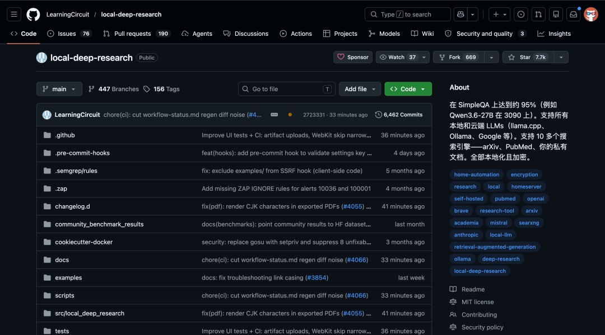

用 Qwen3.6-27B 模型在单张 RTX 3090 上，SimpleQA 准确率达到 95.7%。

这个成绩在完全本地的条件下相当能打了。

它支持 10 几种搜索引擎，arXiv、PubMed、Semantic Scholar、Wikipedia 这些免费的直接用，Google、Brave、Tavily 这些付费的也能接。

还有本地文档和 LangChain 向量库这类自定义搜索源。

20 多种研究策略可选，langgraph-agent 自主智能体性能最强，focused-iteration 迭代精炼准确率最高。

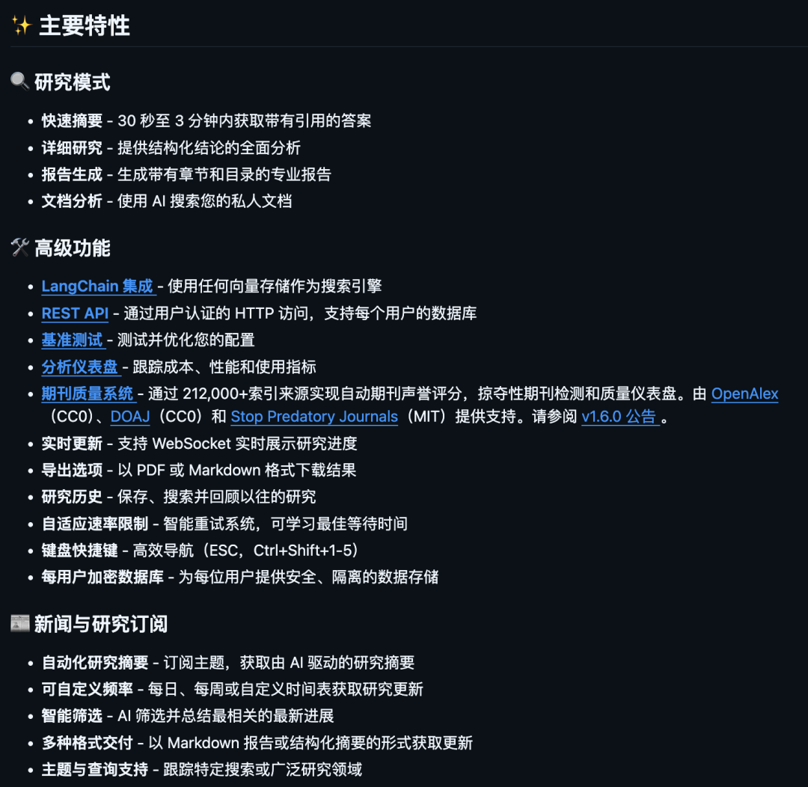

还提供 MCP Server，可以直接从 Claude Code 调用深度研究。

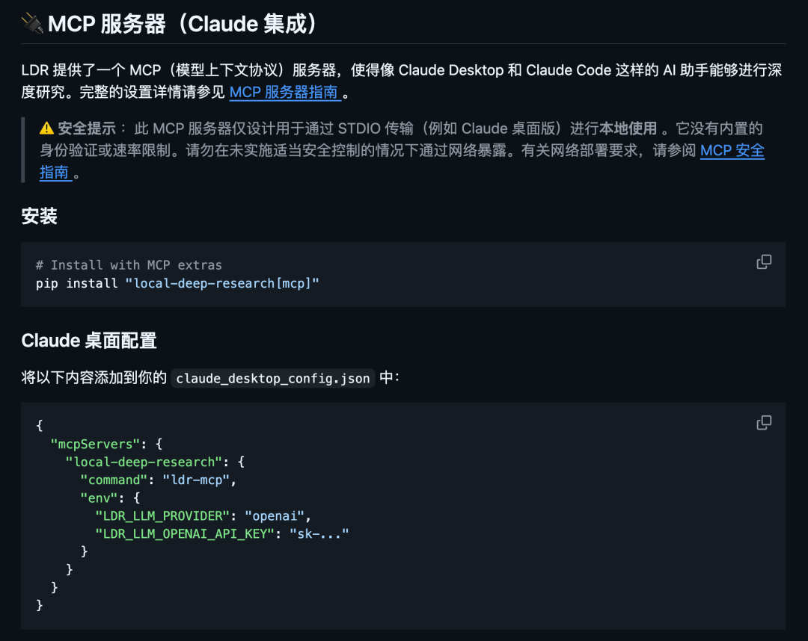

```
开源地址：https://github.com/LearningCircuit/local-deep-research
```

02

**金融行业 AI Agent 模板**

金融行业的 AI 落地一直很难推进。

数据敏感、合规严格、流程又长，很少有团队能从零搭建出靠谱的方案。这次 Anthropic 自己下场了，直接开源了一套金融服务 Agent 模板库。

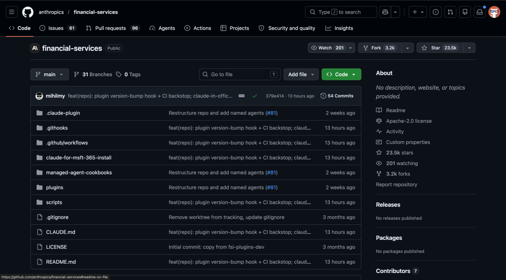

这套模板里面包含 10 个预构建的 Agent，投行、股研、私募、财富管理、基金运营、合规这些场景全覆盖。

比如 Pitch Agent 能自动生成可比公司分析和 LBO 建模然后输出品牌化的推介材料。

Earnings Reviewer 能从财报电话会里提炼要点再生成研报初稿，KYC Screener 专门做入职文档解析和风险标记。

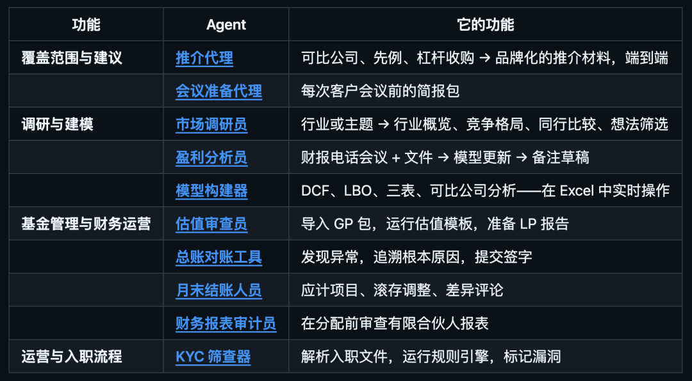

它还对接了 11 家金融数据服务商，FactSet、S&P Global 啥的都有。

你不用从零开始接数据源，Anthropic 帮你铺好了路。

每个 Agent 都以 Markdown + YAML 文件定义，没有构建步骤，支持 Claude Code 插件一键安装。

也可以通过 Managed Agents API 做企业级无头部署。

现在已经拿下 2.2w 的 Star，本周涨了 12500。

```
开源地址：https://github.com/anthropics/financial-services
```

03

**AI 编程助手有长期记忆**

用 AI 编程助手每次开新会话，一切从零开始。

你得重新解释项目架构、重新描述那个 Bug、重新说明你的代码偏好。

agentmemory 就是为了解决这个问题的。

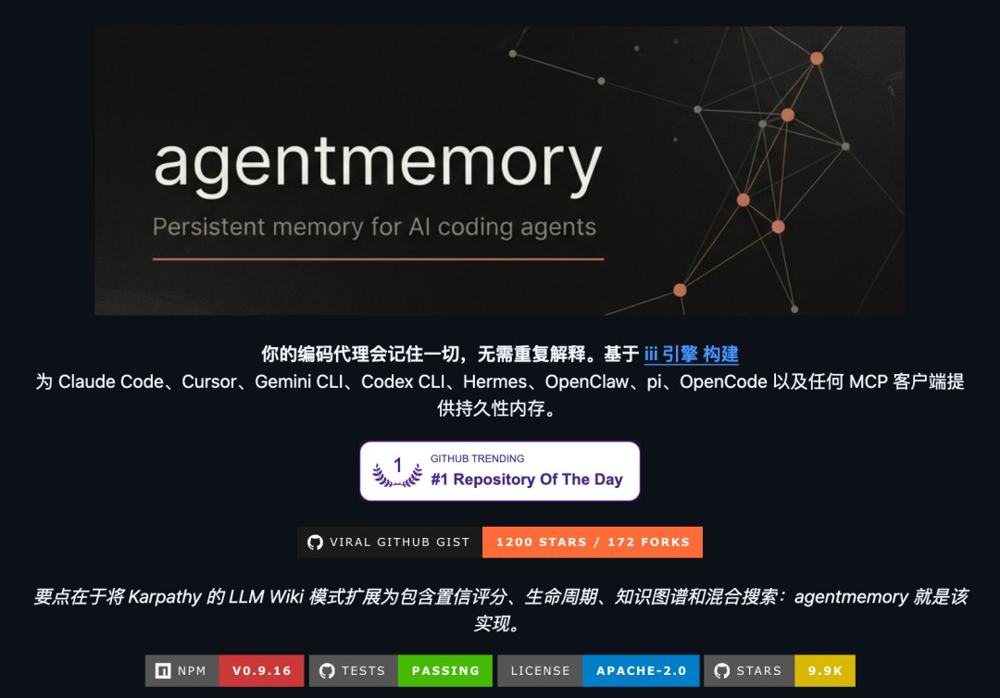

它在后台运行一个记忆服务器，自动捕获你每次工具调用、每次对话、每次代码修改，压缩成可搜索的结构化记忆，下次新会话开始时自动注入相关上下文。

它有四层记忆架构，模仿人脑的工作方式。

工作记忆存原始观察，情景记忆存会话摘要，语义记忆提取事实和模式，程序记忆记录工作流和决策习惯。

而且记忆会随时间衰减，频繁访问的会被强化，过时的自动淘汰。

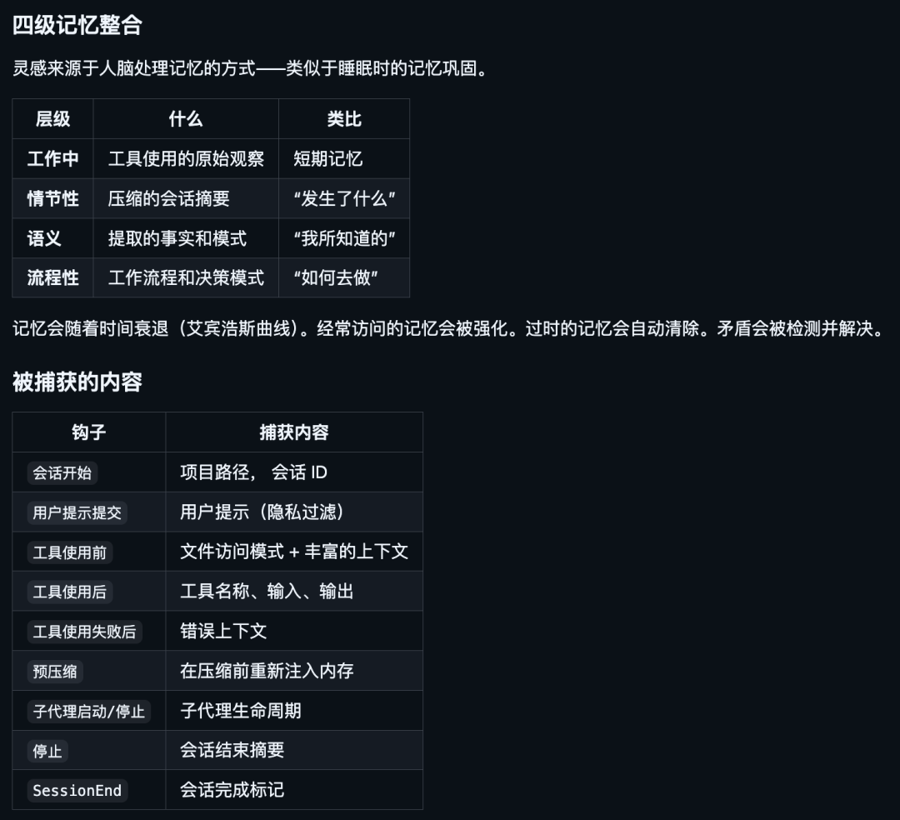

搜索方面用了三流混合：BM25 关键词匹配加向量语义搜索加知识图谱遍历，三者融合后检索准确率在 LongMemEval 基准上 R@5 达到 95.2%。

整个方案不需要外部数据库，默认绑定 127.0.0.1，全部自托管。

兼容性也不错，Claude Code、Cursor 等 16+ 种编程助手都能用。

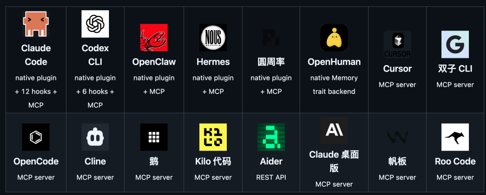

一个服务器，所有 Agent 共享记忆。项目创建不到三个月，已经拿了 9,000+ Star。

```
开源地址：https://github.com/rohitg00/agentmemory
```

04

**神经系统的编排平台**

Ruflo 把 Claude Code 扩展成了一个可协调的 Agent 集群系统。

它内置了 100+ 个专用 Agent，涵盖编码、测试、安全、文档、架构等角色。

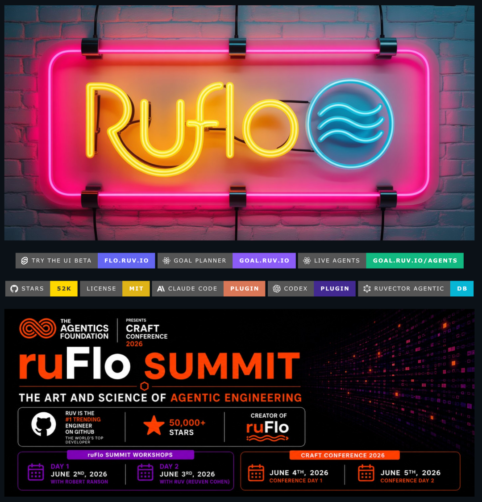

你可以把它们组织成不同拓扑的集群，层级式、网状、自适应都支持。集群内部通过 Raft 和拜占庭共识算法协调，听起来就很硬核。

比较有意思的是它的自学习记忆系统，叫 SONA 神经架构。

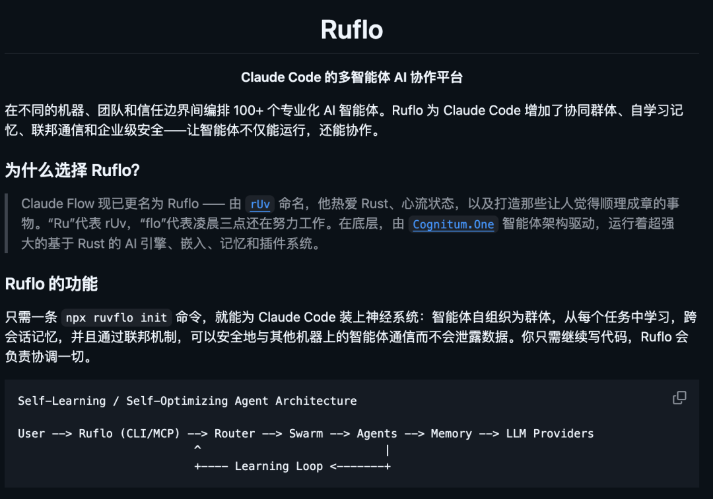

从每个任务中学习，跨会话记忆，向量搜索用的 HNSW 算法比暴力搜索快 150 到 12500 倍。

还支持 Agent 联邦，也就是跨机器协作，用零信任架构加 mTLS 加 ed25519 认证，PII 自动脱敏。

装完之后正常用 Claude Code 就行，Hooks 系统会自动路由任务、检索记忆、协调后台 Agent。

5.1万的 Star，是目前 Claude 生态里最大的编排平台。

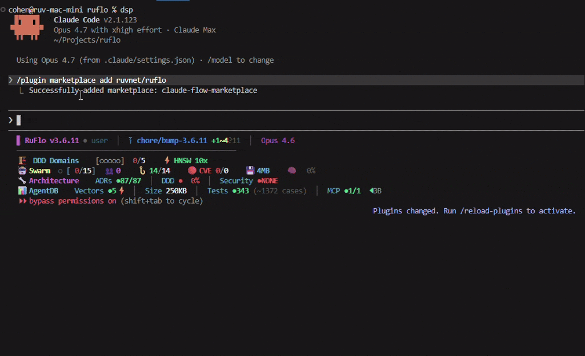

```
开源地址：https://github.com/ruvnet/ruflo
```

05

**从创作到变现全打通**

AiToEarn 是一个完整的内容营销流水线。

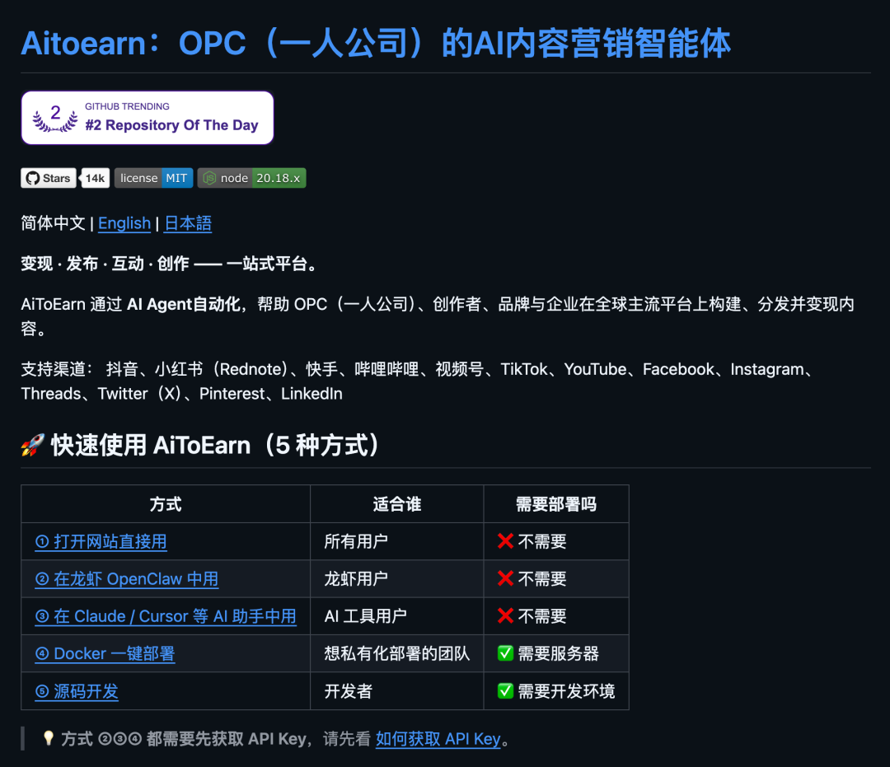

围绕创作到赚钱的全链路，它做了四件事。

Monetize 是内容变现，内置了一个内容交易市场，商家发布推广任务，创作者接单完成推广，按 CPS、CPE、CPM 三种模式结算。

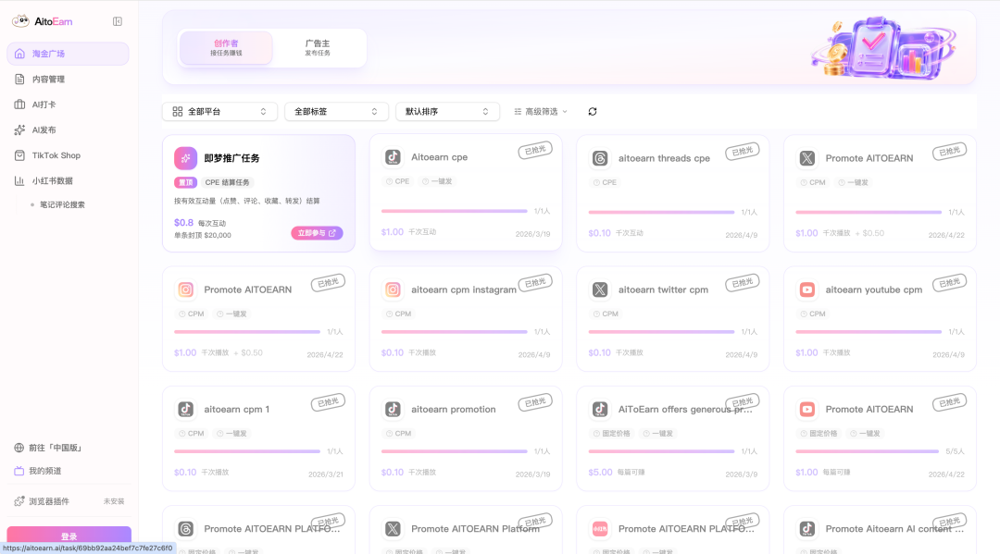

Publish 是多平台一键分发，国内支持抖音、小红书、快手、B 站、微信视频号，海外支持 TikTok、YouTube、Facebook、啥的总共 13 个平台。

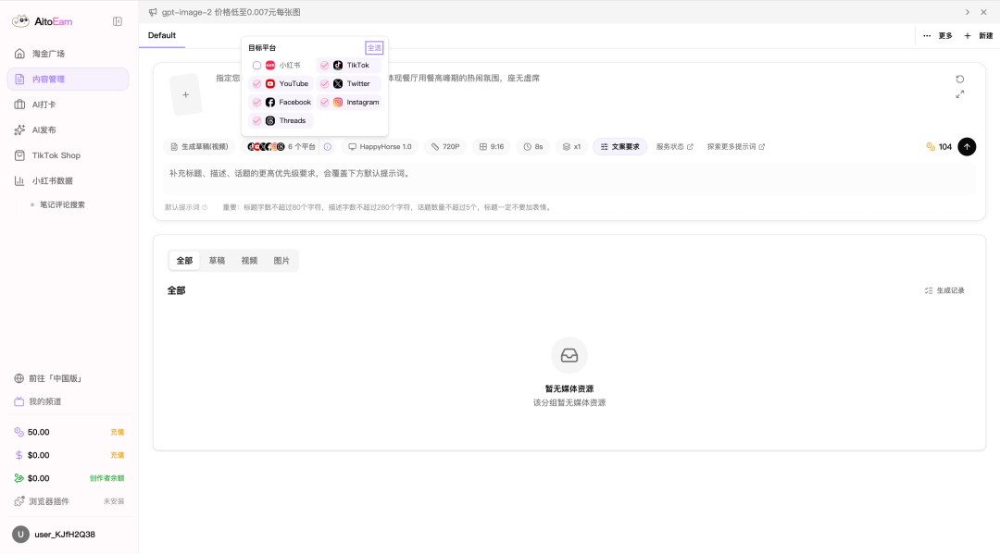

Engage 是自动化互动运营，通过浏览器插件实现自动点赞收藏关注，AI 智能回复评论，还能识别"求链接""怎么购买"这类高转化信号。

Create 是 AI 内容创作，视频图文都能自动生成，支持批量并行。

说白了就是一个人也能做内容矩阵。

```
开源地址：https://github.com/yikart/AiToEarn
```

06

**字节跳动开源的 AI 桌面 Agent**

UI-TARS Desktop 是字节跳动开源的多模态 AI Agent 技术栈。

你用自然语言告诉它帮我打开 VS Code 的自动保存功能或者帮我在 Priceline 订一张明天去东京的机票，它就会自动操作你的电脑完成任务。

它的核心循环很直接：截屏理解屏幕内容，视觉语言模型推理预测下一步动作，执行点击输入滚动，再截屏，循环直到任务完成。

本质上是 Anthropic Computer Use 的开源替代方案。

它交付了两个产品。

UI-TARS Desktop 是原生桌面应用，用 NutJS 控制鼠标键盘，支持 macOS 和 Windows。

Agent TARS 是通用框架，通过 CLI 和 Web UI 使用，支持任意多模态 LLM，不限于字节自己的模型，Claude、GPT、豆包都能接。

还支持 MCP 集成，可以挂载各种工具服务器。

```
开源地址：https://github.com/bytedance/UI-TARS-desktop
```

07

**Vibe Coding 零基础教程**

Datawhale 出了一套 Vibe Coding 渐进式教程，从完全零基础到能做出跨平台应用，手把手带你走一遍。

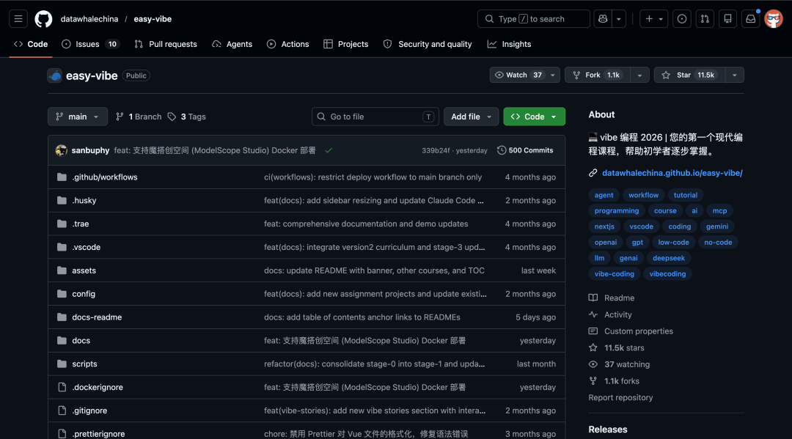

它分了 3+1 个阶段。

阶段 0 是幼儿园级别，通过贪吃蛇这类小游戏让你感受 AI 编程的魅力。

阶段 1 教你当 AI 产品经理，学 AI IDE 工具、创意验证、产品原型搭建、AI 能力集成。

阶段 2 进入初中级开发，前端学 Figma 和组件库，后端学 Git、数据库、API 开发、部署、支付。

阶段 3 是高级进阶，Claude Code 深度使用，还有微信小程序、Android、iOS、Chrome 插件、Electron 桌面应用等 8 个跨平台项目实战。

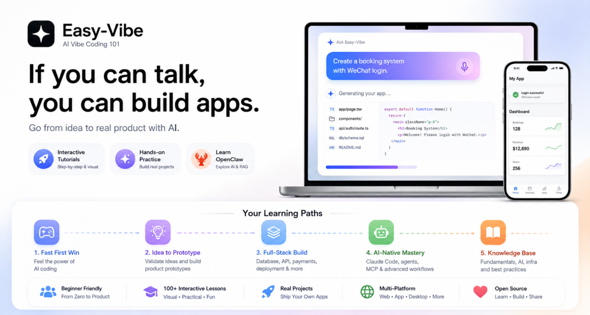

知识库也很扎实，覆盖计算机基础、开发工具、前端后端等 9 大领域，80 多个交互式专题。

项目里还有很多交互式 Vue 组件，比如 LLM Token 可视化、Git 工作流动画、数据库基础演示，比纯文字教程直观多了。

还有个 Vibe Stories 板块收录了真实用户故事，乡村小学教师、卡车司机、高中生这些非程序员群体通过这套教程做出了真实产品。

不到半年时间，一万多 Star。

```
开源地址：https://github.com/datawhalechina/easy-vibe
```

08

**AI 学术写作 Skills**

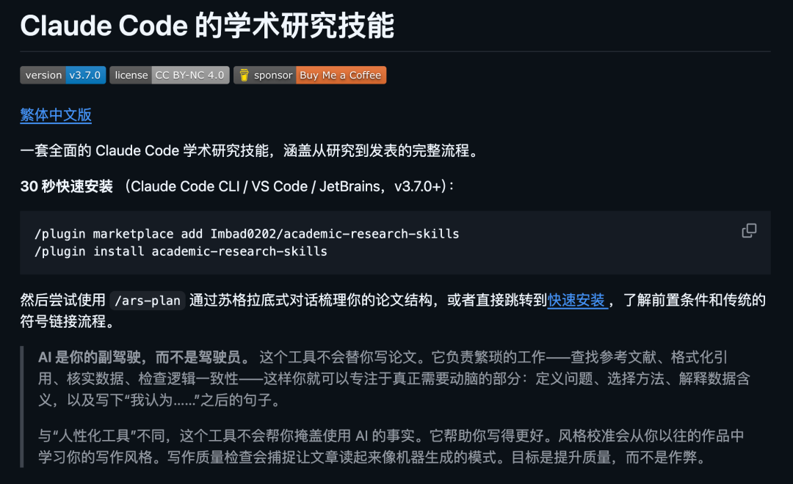

AI 辅助学术写作最大的问题是编造引用。

有研究统计过 AI 生成了超过 14 万条幻觉引用，这个问题在学术界引发了很大争议。

Academic Research Skills 就是专门为 Claude Code 打造的学术论文全流程技能包。

它的核心卖点就是内置了引用完整性验证。

通过 Semantic Scholar API 逐条检查引用是否存在，DOI 是否匹配，标题用 Levenshtein 相似度匹配，低于 0.7 的直接标红。

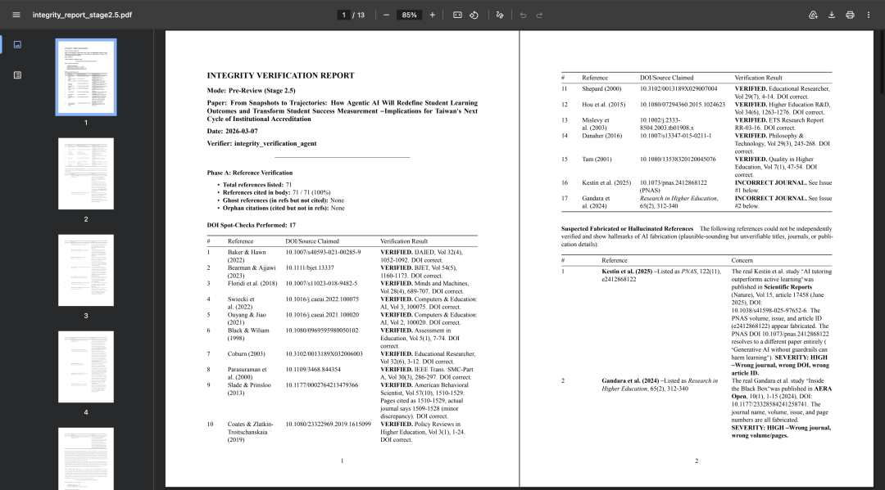

它有四个核心 Skill。

deep-research 做 13 个 Agent 协同的深度文献综述

academic-paper 写论文并且用 Anti-Leakage 协议防止模型从参数化记忆里编造内容。

academic-paper-reviewer 模拟多审稿人评审流程分两阶段硬门控

academic-pipeline 做端到端自动化编排支持 25 种运行模式。

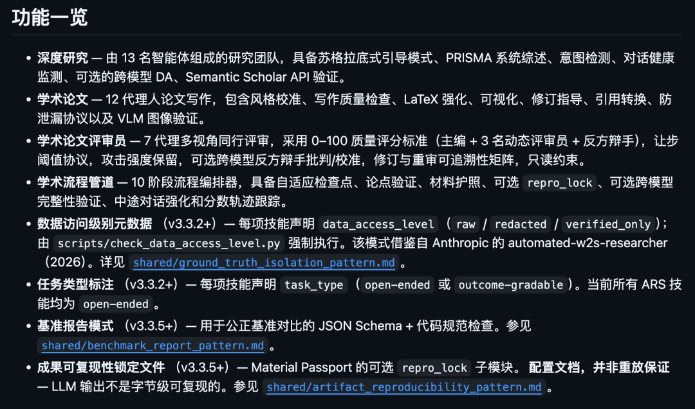

总计 45 个 Agent 协同工作，742 个测试用例，迭代速度非常快，几乎两三天就发一个新版本。

```
开源地址：https://github.com/Imbad0202/academic-research-skills
```

09

**点击下方卡片，关注逛逛 GitHub**

这个公众号历史发布过很多有趣的开源项目，如果你懒得翻文章一个个找，你直接关注微信公众号：逛逛 GitHub ，后台对话聊天就行了。
