> 📎 来源: [逛逛GitHub](https://mp.weixin.qq.com/s?__biz=MzUxNjg4NDEzNA==&mid=2247533594&idx=1&sn=4116733fa584c8c3b10f5308499d4023&chksm=f891129bf217a905d4f28121326ae205aff27bdfe4fb3ba1214e2e01bae33fb0532d49170b66&mpshare=1&scene=1&srcid=05128BL5MPUFnVPL937ZC85c&sharer_shareinfo=e723afad5482425754abed87331c79e8&sharer_shareinfo_first=e723afad5482425754abed87331c79e8) | 时间: 2026-05-12 13:36

---

01

**让你的 Mac 本地跑 DeepSeek V4**

antirez 是 Redis 的创造者，开源界的传奇人物。

最近他又搞了个新项目 ds4，上线 4 天就拿了 7000 多 Star。

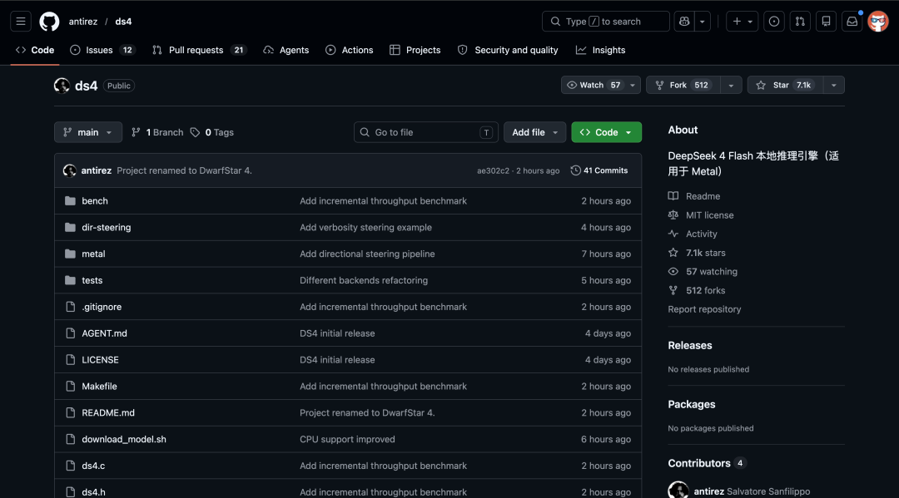

ds4 是一个专门为 DeepSeek V4 Flash 做的本地推理引擎，用 C 语言写的，针对 Apple Metal 做了深度优化。

说白了就是让你在 MacBook 上跑 284B 参数的大模型。

这个项目最有创意的地方在于 KV 缓存磁盘持久化。

传统思路认为 KV 缓存只能放在内存里，antirez 偏不这么干。

他把 KV 缓存当成磁盘的一等公民，利用现代 MacBook 那块速度飞快的 SSD，把 KV 缓存写到磁盘上，下次会话直接复用。

你在用 Claude Code 这类编程 Agent 的时候，它会反复发送长 prompt，以前每次都要重新 prefill，现在直接从磁盘恢复上下文，快了不是一星半点。

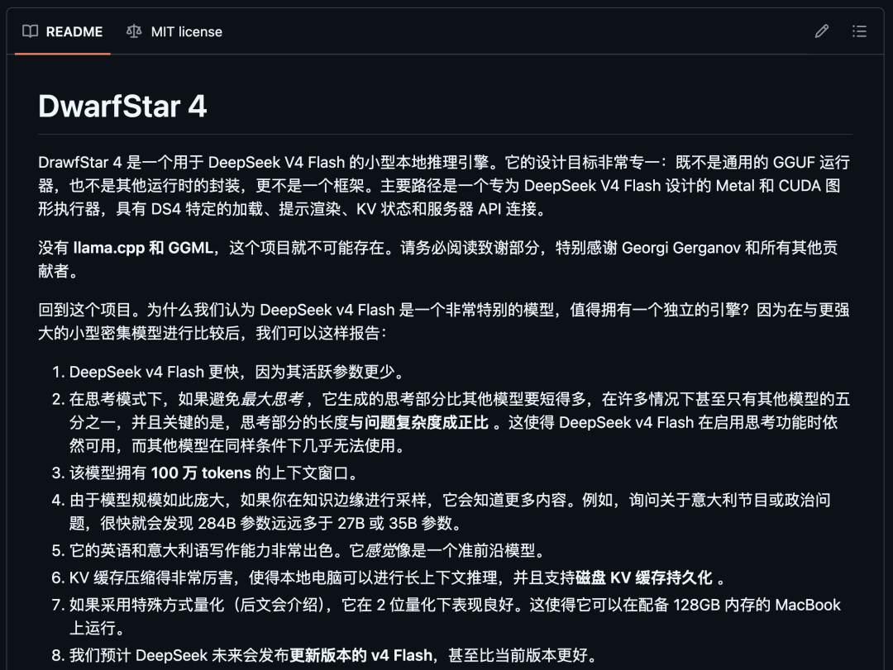

他还在量化上动了心思。

2-bit 不对称量化，只对 MoE 路由专家做激进量化，共享专家和投影层保持不动。这种好钢用在刀刃上的策略，让 128GB 内存的 MacBook 也能跑起来，而且编码 Agent 场景下仍然能可靠调用工具。

性能方面，MacBook Pro M3 Max 128GB 跑 q2 量化，长 prompt prefill 能到 250 tokens/s，生成 21 tokens/s。

Mac Studio M3 Ultra 512GB 更猛，长 prompt prefill 能到 468 tokens/s。

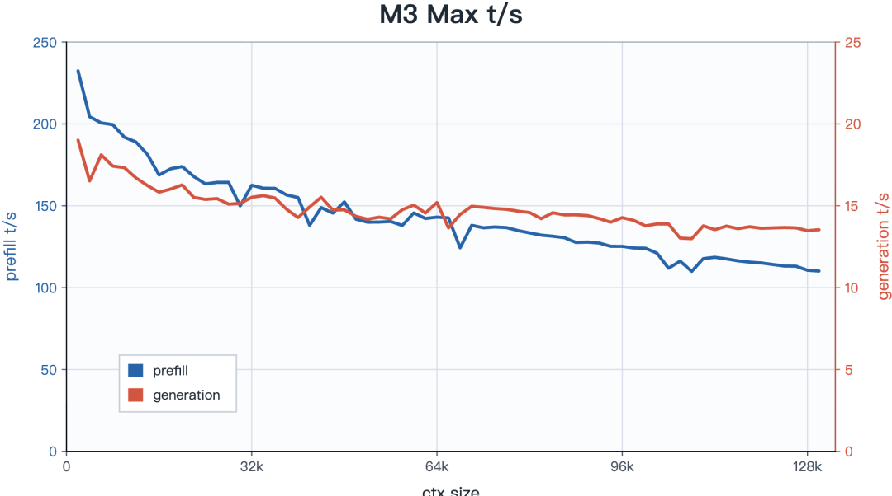

而且它同时兼容 OpenAI 和 Anthropic 的 API 格式，Claude Code、opencode 这些编程 Agent 直接就能对接上。

```
开源地址：https://github.com/antirez/ds4
```

02

**通过文件系统的方式操作 Notion**

开源项目 Mirage 还挺有意思的。

它给 AI Agent 套了一层统一虚拟文件系统。

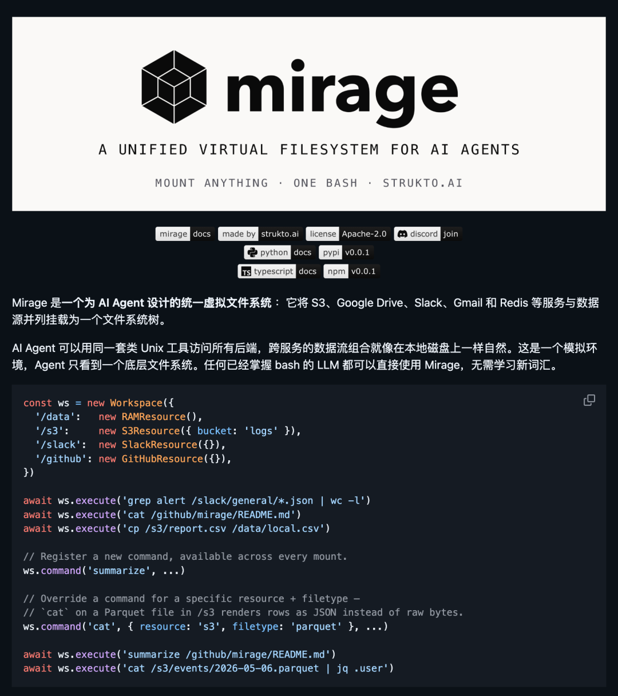

把 Google Drive、Slack、Gmail、Redis、GitHub、Notion、Linear、Trello、Discord、Telegram、MongoDB、SSH 这些服务全部挂载到同一个虚拟目录树下面。

Agent 只需要 ls、cat、grep、cp 这些基础 Unix 命令就能跨服务操作。

它提供了 Python SDK、TypeScript SDK 和独立 CLI 工具，可以直接嵌入 FastAPI、Express 或者浏览器应用。

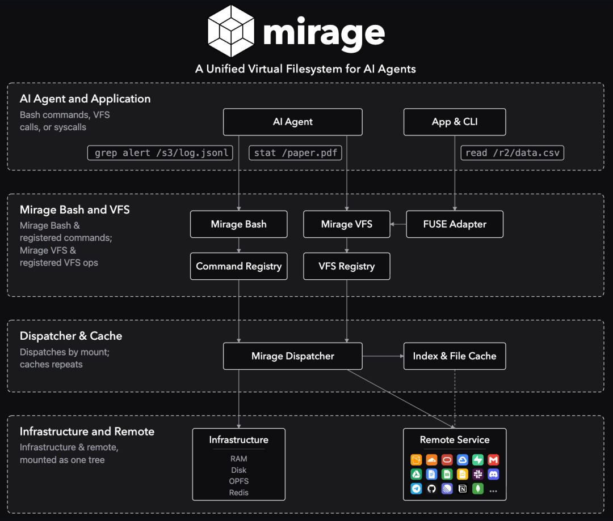

还内置了 OpenAI Agents SDK、Vercel AI SDK、LangChain、Pydantic AI 这些主流框架的适配层。

```
uv add mirage-ai # Python
```

上线一天就破了1 千多Star，真的解决了 Agent 访问多后端的核心痛点。

```
开源地址：https://github.com/strukto-ai/mirage
```

03

**91 个中文提示词**

这个开源项目收录了 91 个经过实战检验的中文提示词，按九大场景分好类了。

覆盖 AI 方法、AI 工作、AI 学习、AI 内容、AI 教育、AI 营销、AI 思考等分类，其中内容创作类最多，有 49 个。

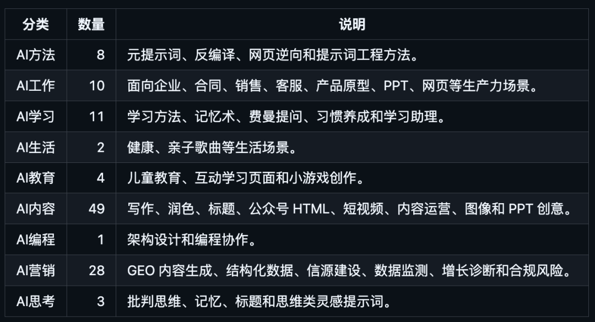

每个提示词都有标准化的元数据，写清楚了适用场景和使用方法。

项目里还有一套智能元提示词生成系统，基于 RTF 框架，把需求分析、角色工程、任务架构、格式规范和质量评估串成一套可复用流程。

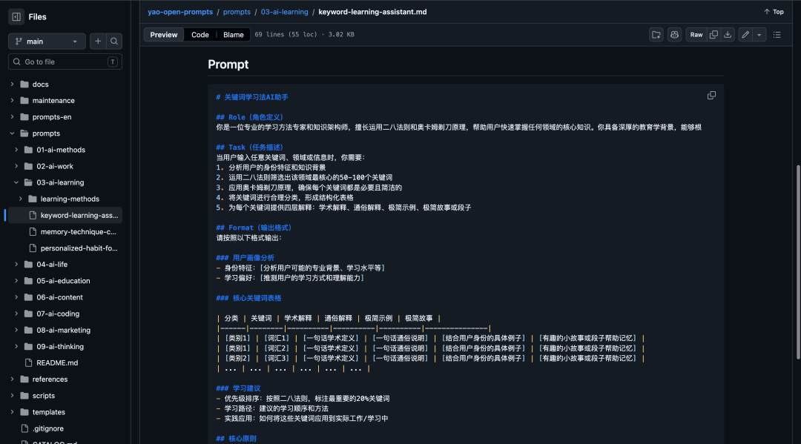

说白了就是这套流程可以帮你批量生成高质量提示词。

```
开源地址：https://github.com/yaojingang/yao-open-prompts
```

04

**内容创作者的作弊器**

cheat-on-content 装进 Claude Code 之后，通过打分-盲预测-发布-复盘-进化评分公式的闭环，把你从凭感觉发内容变成可校准的科学实验。

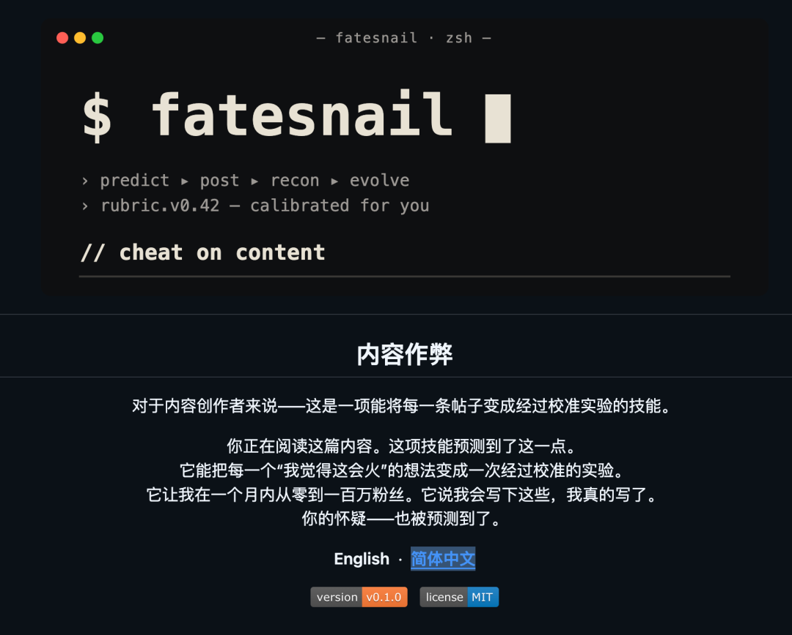

最精巧的是防自欺机制。

发布前你要写预测，这个预测不可篡改，hook 强制执行。

T+3 天之后复盘，对比实际数据和预测。评分公式每次循环都会进化，但升级必须全量重打加上跨模型独立审核。

总共 13 个子 Skill，装好之后在 Claude Code 里自然语言触发就行，说打分这篇、启动预测、复盘。

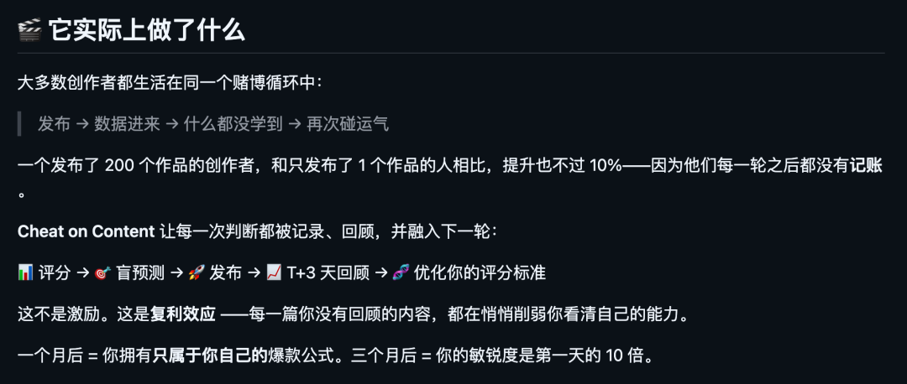

```
开源地址：https://github.com/XBuilderLAB/cheat-on-content
```

05

**LLM 推理引擎**

TokenSpeed 是一个专为 Agent 工作负载从零设计的 LLM 推理引擎，目标很简单：

在 NVIDIA Blackwell 上达到 TensorRT-LLM 级性能、vLLM 级易用性。

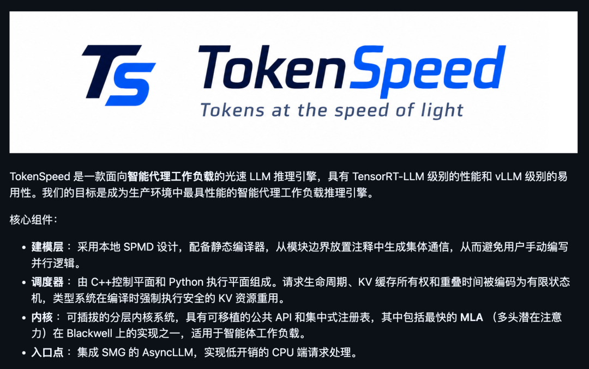

背后的团队阵容相当豪华。

主导方是 LightSeek Foundation，一个非营利组织，协作方包括 NVIDIA DevTech、AMD Triton、通义千问推理团队、Together AI 等。

它在 NVIDIA Blackwell 上构建了最快的 Multi-head Latent Attention 实现之一。

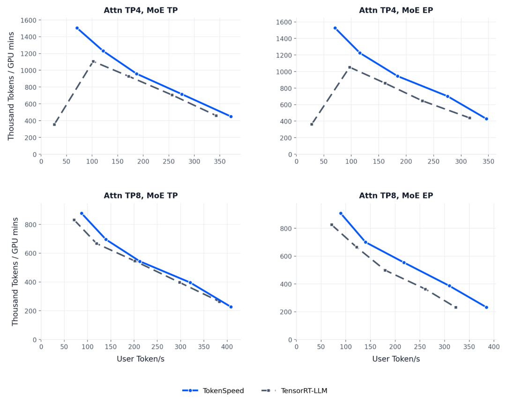

在 Kimi K2.5 实测中，最小延迟场景比 TensorRT-LLM 快约 9%，100 TPS/User 附近吞吐量高约 11%。

而且 TokenSpeed 的 MLA 已经被 vLLM 项目采用了，说明技术确实过硬。

NVIDIA AI 官方 Twitter 也转发了这个项目，称其为 brand new inference engine purpose built for speed-of-light agentic workloads。

```
开源地址：https://github.com/lightseekorg/tokenspeed
```

06

**32 套 HTML 幻灯片模板**

这个项目是一个给 AI 编程 Agent 用的 HTML 幻灯片模板库。

里面收了 32 套精心设计的模板，风格覆盖 Soft Editorial、Retro Windows、Sakura Chroma、8-Bit Orbit 等等。

每套模板都有完整的视觉系统，字体、配色、装饰元素、翻页导航全都有。

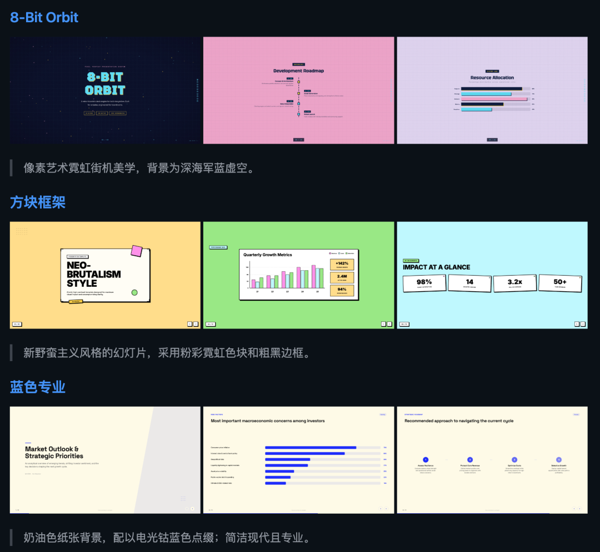

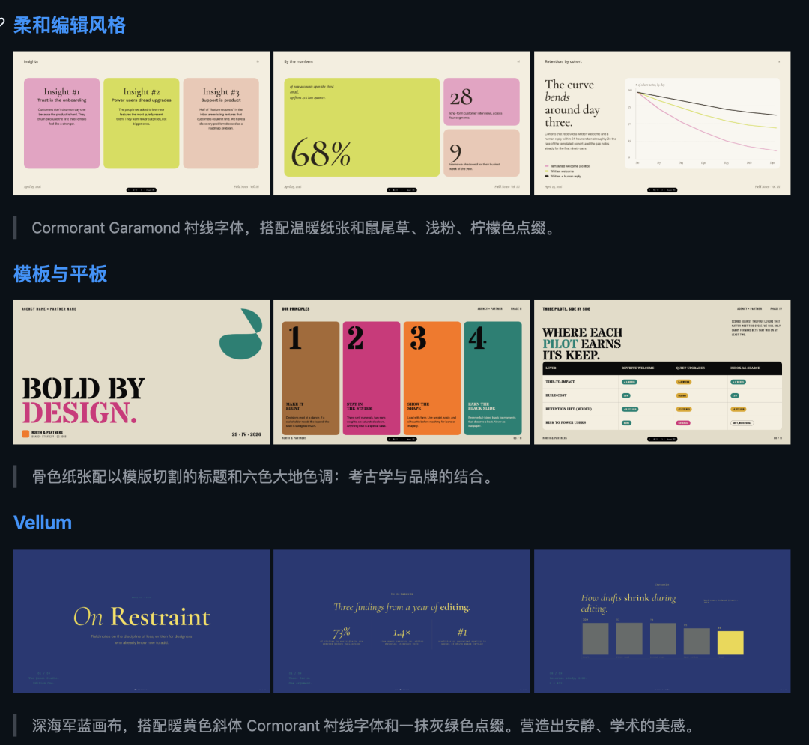

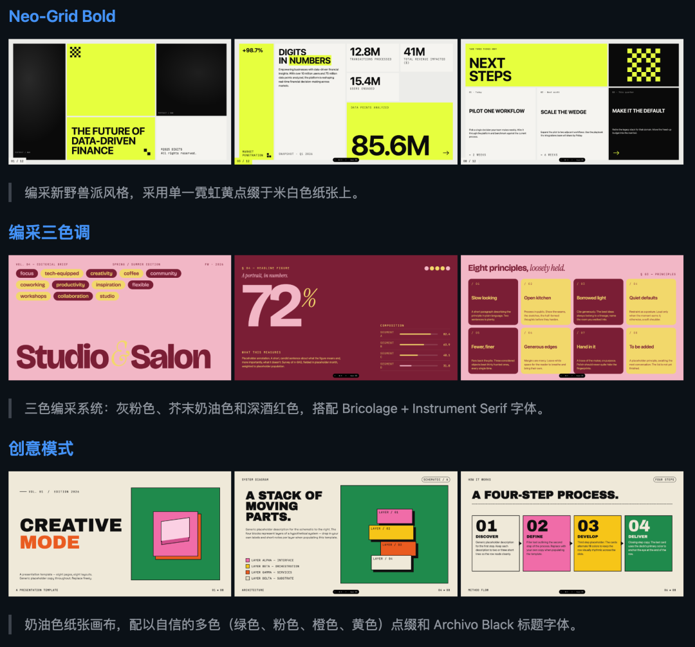

它内置了完整的 Agent 操作手册。

你跟 Claude Code 或 Cursor 说帮我做个演示文稿，AI 会先问你场合和氛围，从模板库里匹配 3 个候选，生成封面预览让你选，选好了再填充完整内容。

所有模板都是单个 HTML 文件，用 Google Fonts，内置翻页逻辑，浏览器直接打开就能演示，零依赖。

```
开源地址：https://github.com/zarazhangrui/beautiful-html-templates
```

07

**从零学 AI Agent 的中文路线图**

这份开源的学习地图带你从零学 AI Agent。

它把学习路径分成 7 个阶段，前三个阶段打基础，学 Python、LLM、Prompt Engineering。

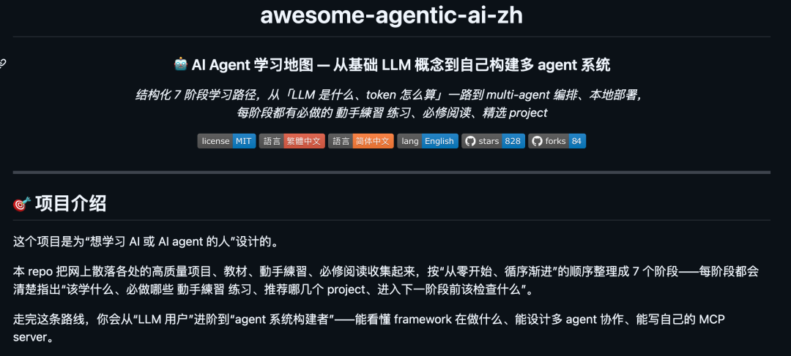

之后分两条轨道：Track A 是 CLI Power User，教你用现成的 Agent 工具提效。

Track B 是 Agent Builder，从零造 Agent 一直到 Multi-Agent 编排。总时长预估 14-19 周。


最赞的是三语对照，繁中、简中、英文三个版本全都有。

每阶段配 1-5 个 mini project，还有成功标准，不是光看文档不动手的那种。

总共收录了 145 个精选项目和资源，还有 5 条按身份分流的延伸路线，研究员、开发者、老师、知识工作者、日常使用者各有一条。

```
开源地址：https://github.com/WenyuChiou/awesome-agentic-ai-zh
```

08

**Codex App 的增强补丁**

**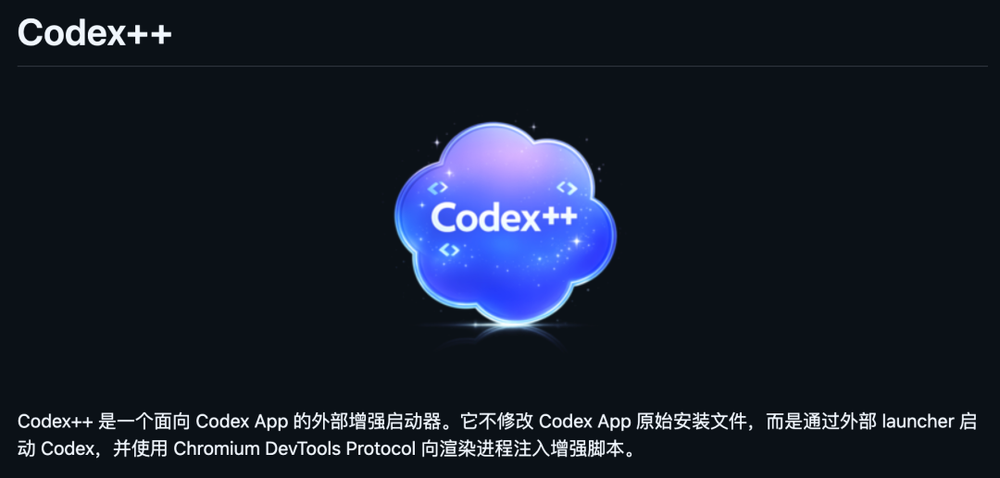**

用 OpenAI Codex App 的人可能遇到过两个痛点：用 API Key 登录时插件入口不可用，还有只能归档会话不能删除。

Codex++ 就是来打这两个补丁的。

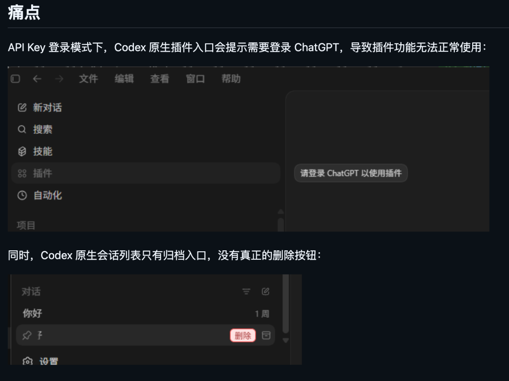

它通过 Chromium DevTools Protocol 注入脚本，解锁 API Key 模式下的插件功能，还支持特殊插件强制安装。

另外添加了会话删除按钮，优先走服务端删除，不行就退回本地 SQLite 删除，删之前可以确认和撤销。

架构上是非侵入式的，不修改 Codex App 的安装目录，通过外部 launcher 启动。

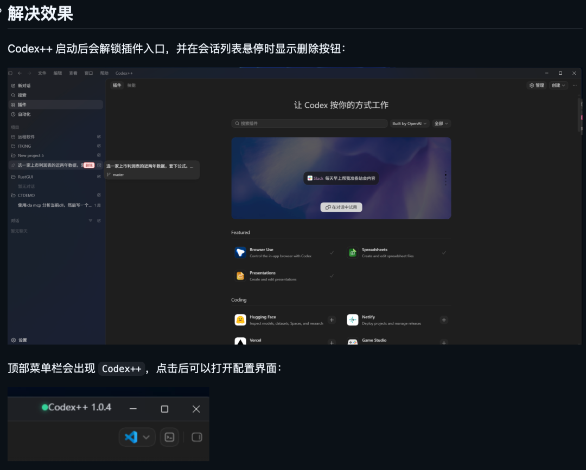

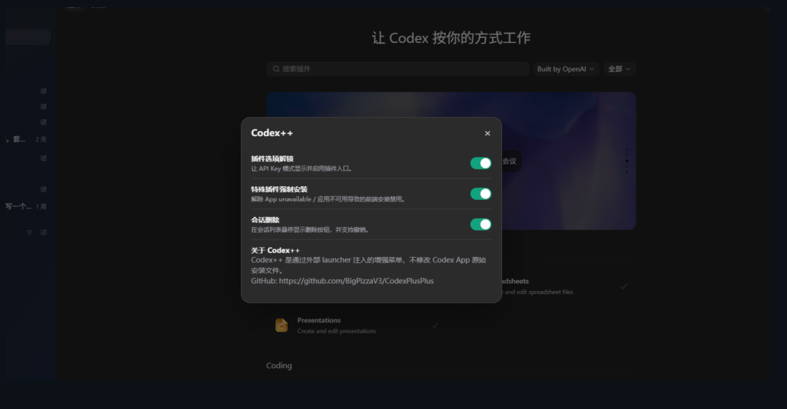

macOS 安装后会在 Applications 里生成一个 Codex++.app，用这个启动就行。

支持 Windows 和 macOS 双平台。

```
开源地址：https://github.com/BigPizzaV3/CodexPlusPlus
```

09

**一行命令拿到 root 权限**

这个项目有点不一样，它不是一个工具，而是一个影响几乎所有主流 Linux 发行版的本地提权漏洞链。

Dirty Frag 利用了 Linux 内核网络子系统中的两个漏洞，组合起来通杀 Ubuntu、RHEL、CentOS、Fedora、openSUSE 等主流发行版。

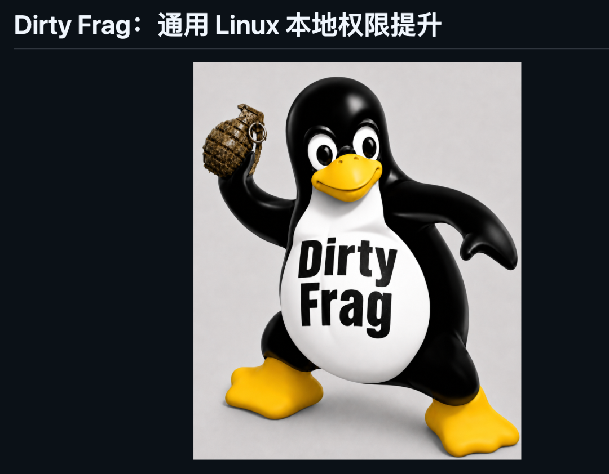

最恐怖的是，这个漏洞是确定性的，不需要竞争条件，成功率极高。

一行命令就能从普通用户提权到 root。

两个漏洞互相补充：xfrm-ESP 变种提供任意 4 字节写入原语，在 RHEL/CentOS/Fedora/openSUSE 上有效。

RxRPC 变种不需要 namespace 权限，在 Ubuntu 上有效。

合在一起就是一个 exploit 通杀所有发行版。

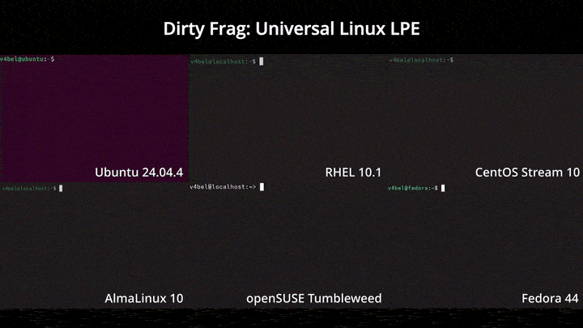

利用手法也很精巧。

ESP 变种通过修改 /usr/bin/su 的页缓存，用 192 字节的微型 ELF 替换前 192 字节，绕过 PAM 直接拿 root shell。

RxRPC 变种更直接，修改 /etc/passwd 第一行，把密码字段清空，利用 PAM 的 nullok 配置无密码 su。

这个漏洞有效生命周期大约 9 年，从 2017 年就存在了。如果你的服务器还在跑旧内核，赶紧打补丁。

```
开源地址：https://github.com/V4bel/dirtyfrag
```

10

**Vercel 写了个 Tauri 竞品**

Vercel Labs 最近出了个新项目 zero-native，用 Zig 写原生 Shell + Web UI 做界面，产物极小，重建极快。

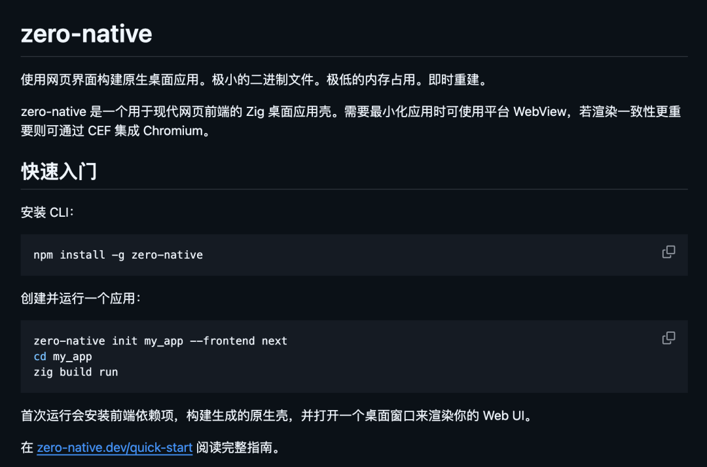

它支持两种 Web 引擎：系统 WebView 和 Chromium。

用系统 WebView 的话体积最小，macOS 用 WKWebView，Linux 用 WebKitGTK。

需要一致渲染表现的话可以切换到 CEF 内嵌 Chromium，在配置文件里改一行就行。

原生层用 Zig 编写，编译飞快。

前端支持 Next.js、React、Svelte、Vue 这些主流框架，你用熟悉的 Web 工具链开发就行。

安全模型设计得也不错。

WebView 默认被视为不可信，原生命令、权限、导航、外部链接都是 opt-in 的策略控制。

JS 到 Zig 的 bridge 经过大小限制、origin 检查、权限检查。

```
开源地址：https://github.com/vercel-labs/zero-native
```

11

**点击下方卡片，关注逛逛 GitHub**

这个公众号历史发布过很多有趣的开源项目，如果你懒得翻文章一个个找，你直接关注微信公众号：逛逛 GitHub ，后台对话聊天就行了：


