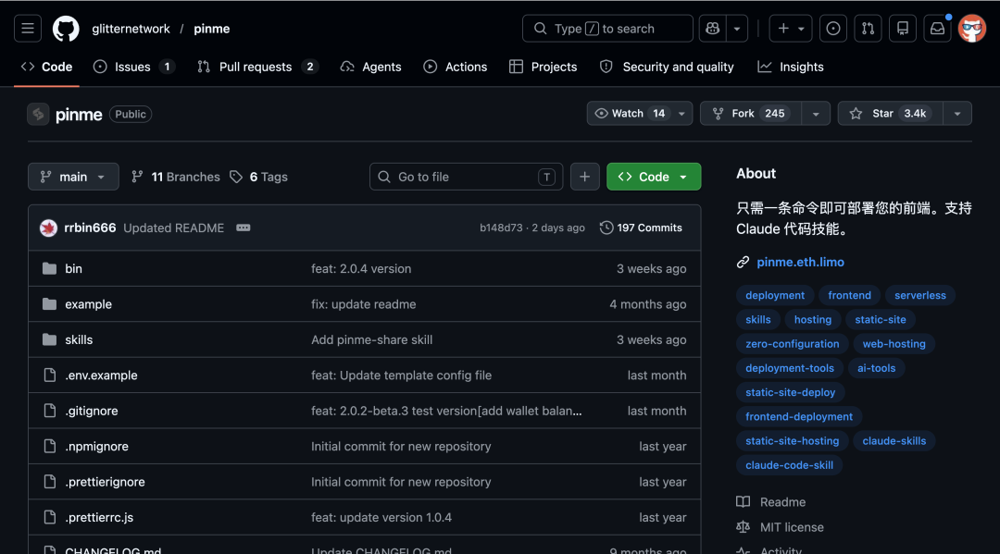
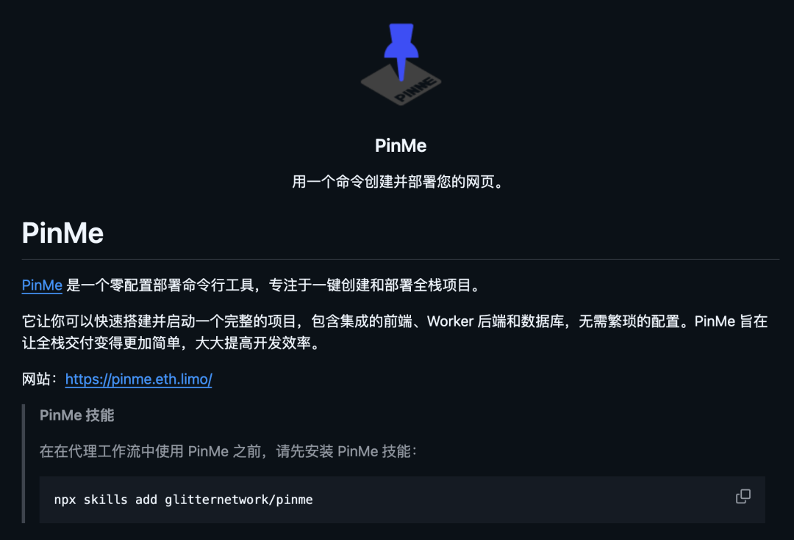
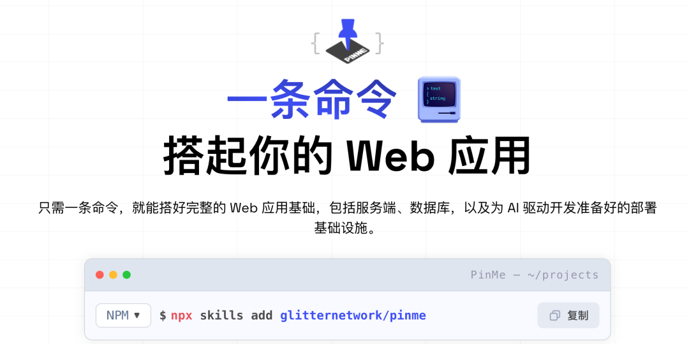
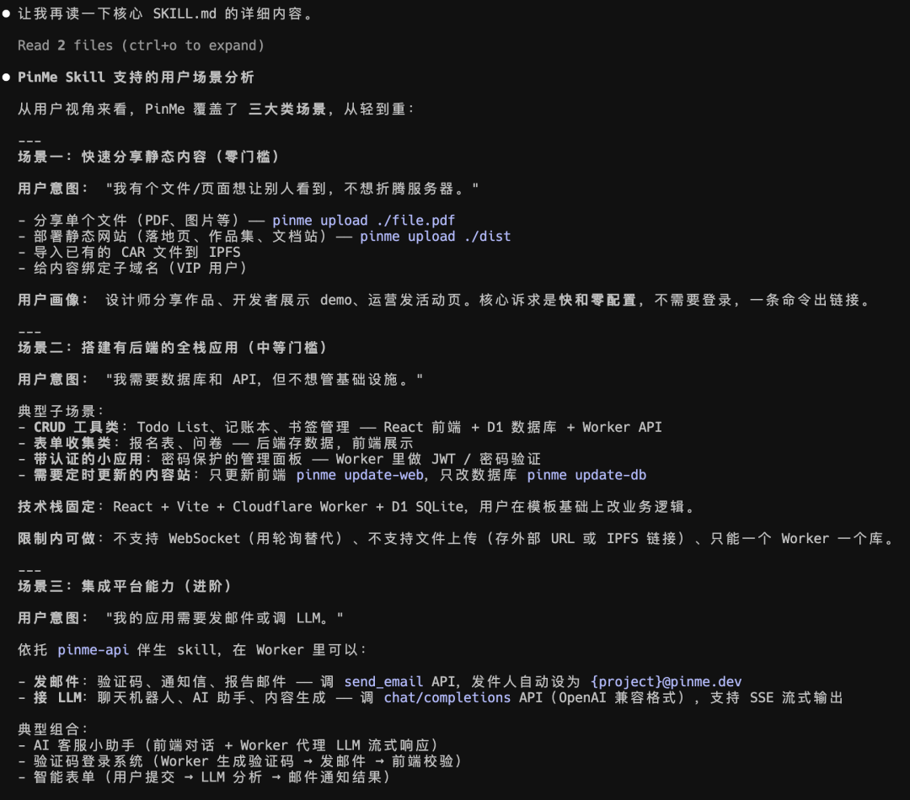
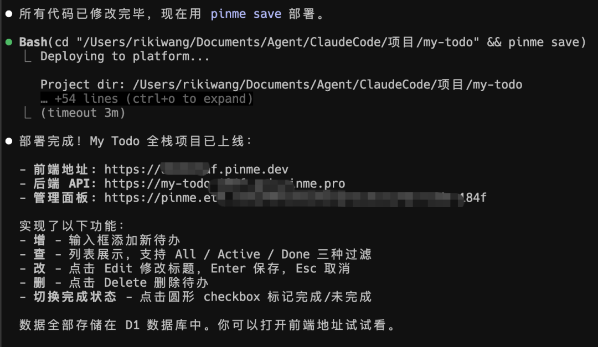
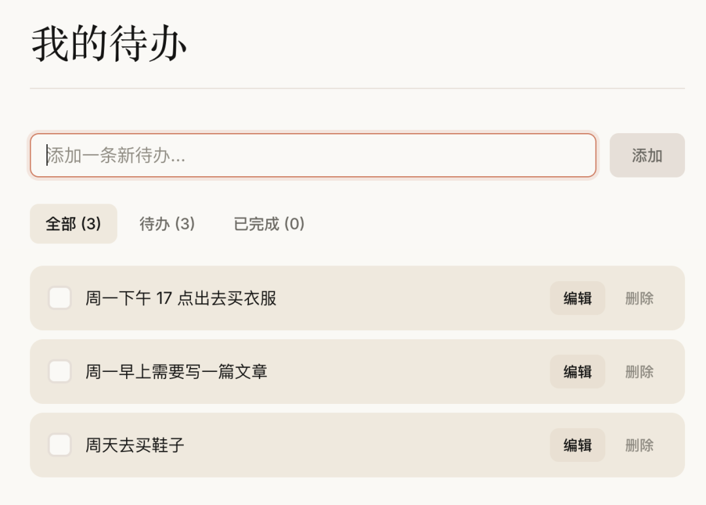
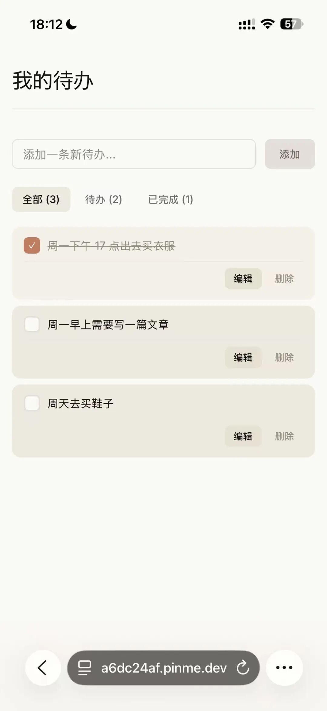
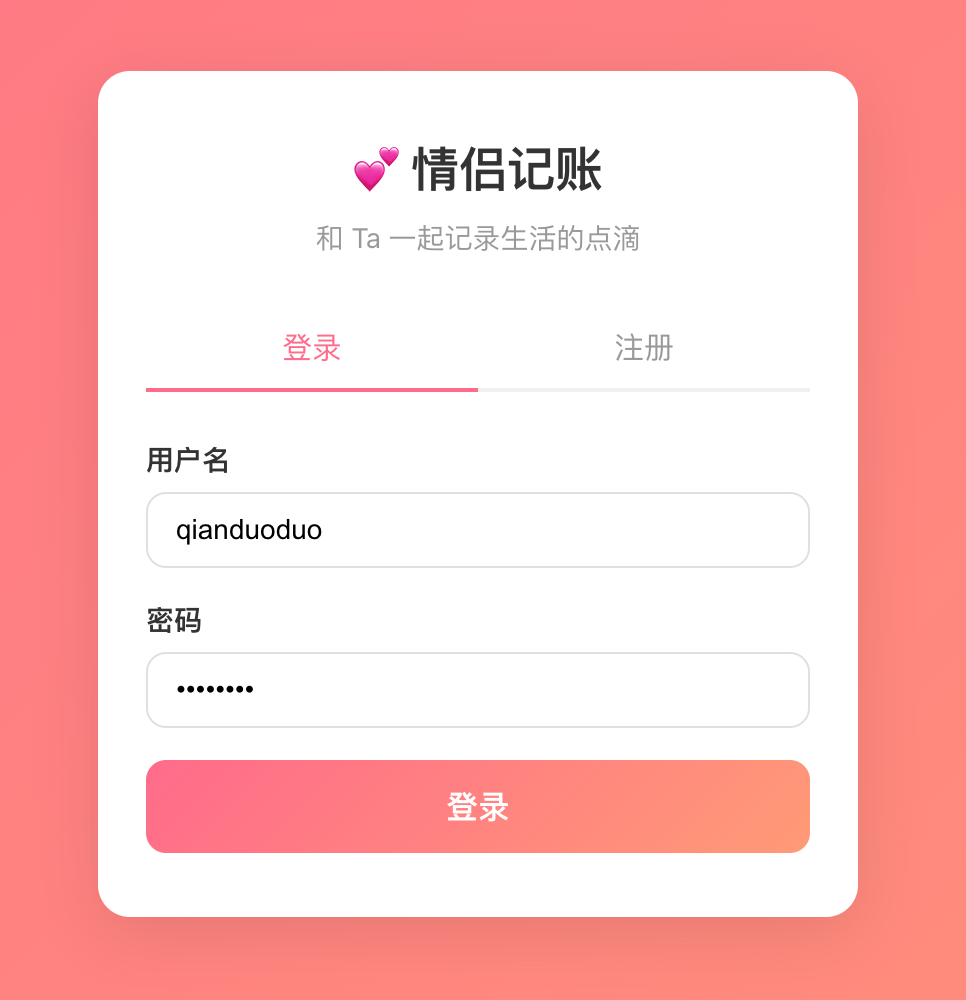
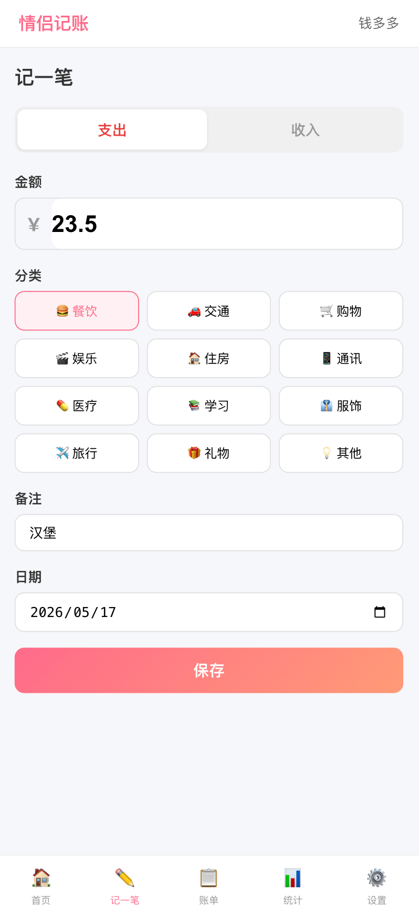
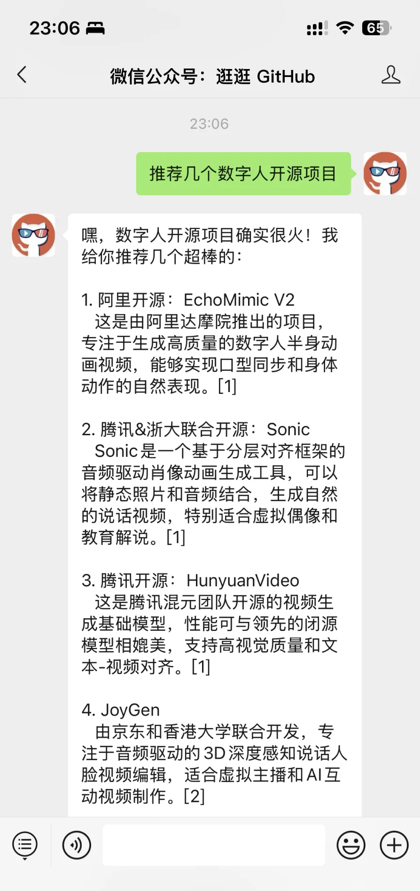

> 📎 来源: [逛逛GitHub](https://mp.weixin.qq.com/s?__biz=MzUxNjg4NDEzNA==&mid=2247533854&idx=1&sn=6995478769c7e6d65f5db5d87a77e81f&chksm=f8db40ca34a0525a6bdcbfceb478a79140bc765d4d8428e2e360173a750e6743d6446ff59877&mpshare=1&scene=1&srcid=0521YnKmp8KqwodT5uyXKtbD&sharer_shareinfo=cbc39ff4c42a0caaa12c4d40fab07872&sharer_shareinfo_first=cbc39ff4c42a0caaa12c4d40fab07872) | 时间: 2026-05-21 15:07

---

之前给大家介绍过一个开源项目叫 [PinMe](https://mp.weixin.qq.com/s?__biz=MzUxNjg4NDEzNA==&mid=2247529713&idx=1&sn=b70b12d90dda42c1dd2abc2edb9a0565&scene=21#wechat_redirect)。

它能把你做好的一个静态网页、一张图片、或者任何本地文件，快速变成一个谁都能访问的公网链接。

对于自己做好的可视化网页，想分享给其它人看，用这个特别方便。



最近它升级了，不仅推出了自己 Skill，还支持一行命令帮你搭好一个完整的 Web 应用。

前端页面、服务端接口、数据库，全部就绪，连 AI Agent 的部署适配都帮你准备好了。

现在就是，你用自然语言描述完想要什么 App，AI Agent 写完代码之后直接帮你一键上线，你全程只管用自然语言提需求就行。



这个项目目前累计帮用户部署了超过 100 万个网站。

静态资源走 IPFS 分布式存储。

全栈项目采用前后端分离架构，前端是现代 SPA 框架，后端跑在 Edge Runtime 上，数据库用 Serverless SQL，一条命令即可完成全链路部署。

平台还内置了邮件推送和 LLM 调用能力，Worker 中直接调用即可。

> PinMe skill 让 AI 在对话中直接把代码变成线上服务，用户说做个网站或部署一下，AI 自动完成构建、部署、上线全流程，省去服务器配置、域名绑定、数据库搭建等所有基础设施操作。

01

**从静态部署到全栈脚手架**

PinMe 去年 4 月出了 1.0 版本，当时就是一个静态网页部署工具。

PineMe 可以再 30 秒内把网页、图片等资源转成公网链接，任何人打开都能看到你的页面。

但现在的 PinMe 2.0 直接进化了一个级别。



最核心的变化是：它把自己嵌进了 AI Agent 的工作流里，而且支持全栈应用部署了。

① 推出了 PinMe Skill



装完之后，你的 AI Agent 就多了一项能力：帮你把做好的东西直接发到公网上。

你用自然语言跟 AI 描述需求 → AI 写代码构建项目 → 自动调用 PinMe 部署 → 直接把可访问链接丢给你。

等于给 AI Agent 装了一双发布到互联网的手。

不只是静态页面，还支持全栈。

② 搭建有前后端的全栈应用

安装 PinMe Skill，除了帮你快速分享静态内容，现在还支持搭建有后端的全栈应用了。

比如带数据库的记账本、报名表收集应用、ToDo 等工具，原来需要数据库现在都支持开发完一键发布了。

比如：使用 PinMe Skill，帮我创建一个全栈项目叫 "my-todo"，需要一个待办事项的增删改查功能，数据存到数据库里，页面风格使用 Awesome Design 中 Claude 的视觉风格。

它从零帮你写代码、构建、部署上线。

你全程只需要说一句话。



不再是一个静态的页面，而是有数据库的动态网站。





再比如：使用 PinMe Skill，帮我写一个全栈项目,这个项目叫情侣记账，可以实现我和女朋友共同记账。你先规划一下这个项目具备的功能，再开发。

最后生成了一个具备前端、后端和数据存储的全栈项目。

我只需要把链接分享出去，别人完成注册登录就能一起记账了。





再比如：/pinme 做一个共享像素画板。任何人打开 URL 就能参与，无需登录。固定 100×100 画布，所有人共享同一份状态。底部 16 色调色板，选色后点画布任何一格即可上色，每个 IP 涂完一格冷却 5 秒防脚本刷屏。

客户端每秒轮询增量更新，别人涂的格子一秒内你就能看到，整张画布像有几百只手在同步涂鸦。画布状态持久化进数据库，关掉浏览器重来还在。

支持缩放和拖动，右上角一行“刚刚发生” ticker 显示最近 5 笔的坐标和颜色。

02

**五分钟快速上手**

三种场景，按需自取。

**场景一：纯静态页面部署**

```
npm install -g pinme
```

拿到链接，完事。当然你也可以注册登录 PinMe 的官网，直接拖拽文件上传，生成部署链接。

**场景二：全栈项目部署**

```
npm install -g pinme
```

前端 + 后端 + 数据库一键上线。

**场景三：在 Claude Code 里用**

**这个最简单，直接如下方式安装这个 Skill，或者直接把开源项目链接丢给 CC，让它帮你装。**

```
npx skills add glitternetwork/pinme
```

然后直接跟 Claude Code 说你想做什么，它写完代码自动帮你部署，把链接给你。

你描述需求，AI 写代码，AI 帮你部署，你拿到链接。

而且你要后续改这个应用，不需要重新部署，只需要跟 Claude Code 继续聊，PinMe 会继续自动帮你部署更新的，完全不用操心。

中间没有任何部署门槛，不需要配这配那。

对于做 MVP 验证、做 Demo 展示、做 AI 生成页面的人来说，这可能是目前很省事的方案了。

感兴趣的可以去研究研究这个开源项目。

```
开源地址：https://github.com/glitternetwork/pinme
```

03

**点击下方卡片，关注逛逛 GitHub**

这个公众号历史发布过很多有趣的开源项目，如果你懒得翻文章一个个找，你直接关注微信公众号：逛逛 GitHub ，后台对话聊天就行了：


