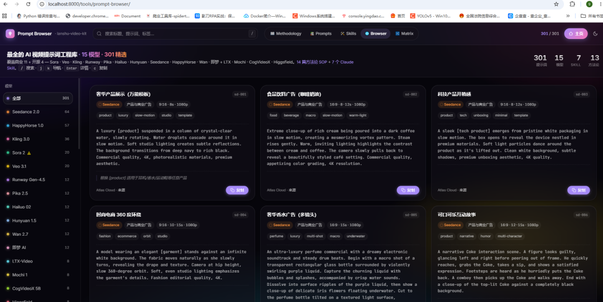
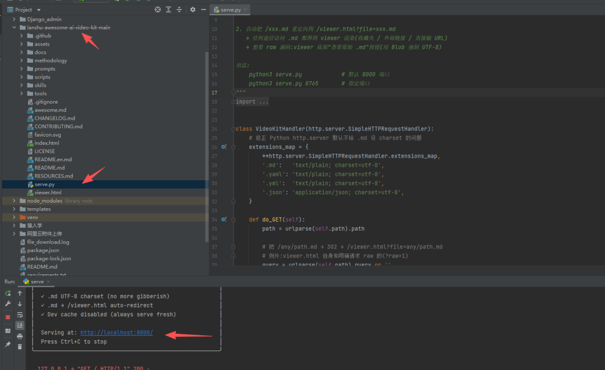

> 📎 来源: [简一陪伴站](https://mp.weixin.qq.com/s?__biz=Mzg3ODI5MTk4NA==&mid=2247485135&idx=1&sn=e070b653bb8c74419456b7dc2344c721&chksm=ce333a4550cd1bd2fc59c28aaf1e306a1569329f278a817c3ca1ef6a5e209cf99d5e23969cc9&mpshare=1&scene=1&srcid=0529FptF9bXJc4adwSZbAj1C&sharer_shareinfo=e4cde9f4c6e0295e91ff2ce3203930c3&sharer_shareinfo_first=e4cde9f4c6e0295e91ff2ce3203930c3) | 时间: 2026-05-29 12:34

---

> 431条实测Prompt + 16篇方法论 + 7个Claude Skill，企业级AI视频制作的"答案之书"

---


做AI视频最头疼的是什么？

不是模型不够多，而是**信息太乱**。

今天看到一个Prompt写得飞起，明天发现模型已经更新了——旧的Prompt直接报废。Stack Overflow、Reddit、各种AI视频群里东拼西凑来的Prompt，源头不明、过期失效、混杂拼凑，三个坑几乎没人能完全躲开。

最近GitHub上有个项目火了—— **lanshu-awesome-ai-video-kit**，上线不到一个月拿了128个Star，被作者称为"做企业AI视频项目逼出来的开源工具包"。

这不是那种"GitHub收集向"的列表项目，而是一个**真正从实战中长出来的工具集**。

---

## 一、这个项目到底解决了什么问题？

作者岚叔在项目介绍里直接捅破了那层窗户纸——市面上AI视频Prompt资源有三个通病：

| 痛点 | 这个项目的解法 |
| --- | --- |
| 来源不明，不知道能不能信 | 每条Prompt必带  ``` source ```  字段，链到官方文档 |
| 过期失效，用了白用 | GitHub Action每周一自动巡检32个官方端点，版本变化自动开Issue |
| 混杂拼凑，质量没保证 | 每个模型独立按其官方公式收录，不做大杂烩 |

**说人话就是：你不用再花时间分辨"这个Prompt还能不能用了"，因为有人帮你每周检查一遍。**

---

## 二、数据量到底有多大？

一句话概括：**431条实测Prompt，覆盖15个模型，29个场景。**

展开来看：

| 资源类型 | 数量 | 说明 |
| --- | --- | --- |
| 实测Prompt | **431条** | 321条单模型最佳实践 + 110条跨模型对照矩阵 |
| AI视频模型 | **15个** | 11个商业旗舰 + 4个开源 |
| 方法论SOP | **16篇** | 从入门公式到导演级写作框架全覆盖 |
| Claude Code Skill | **7个** | 一行命令安装，嵌入AI编程工作流 |
| Web工具 | **3个** | 全部零依赖单文件HTML，开箱即用 |
| 监控端点 | **32个** | 每周一自动巡检 |

光说数字你可能没感觉——这么说吧，把这431条Prompt对着15个模型逐个测一遍，按平均每个视频30秒生成时间算，你保守估计也得花200个小时。而有人已经帮你测完了。

---

## 三、15个模型一锅端：从Sora到可灵全有了

这个项目最大的价值之一，是它把市面上几乎所有主流的AI视频模型都收了进来。而且不是简单的罗列，每个模型都有**专属的Prompt公式和最佳实践**。



### 商业模型（11个）

| 模型 | 厂商 | 核心标签 | 一句话总结 |
| --- | --- | --- | --- |
| **Seedance 2.0** ⭐ | 字节·火山方舟 | 综合SOTA | 当前综合最强，8要素公式体系完整 |
| **Kling 3.0** | 快手·可灵 | 中文超强 | S级，2分钟长视频，Lip-sync一绝 |
| **Veo 3.1** | Google DeepMind | 原生音频最强 | S级，物理+音频顶格，148s链式生成 |
| **Sora 2** ⚠️ | OpenAI | 电影级画面 | 2026年4月已停服，但Prompt公式仍有参考价值 |
| **HappyHorse 1.0** | 阿里巴巴 | 短片专精 | 15s紧凑短片，原生环境音 |
| **Runway Gen-4.5** | Runway | ELO综合第一 | Aleph视频编辑独家功能 |
| **Pika 2.5** | Pika Labs | 性价比之王 | 15+创意特效，价格友好 |
| **Hailuo 02** | MiniMax | 物理仿真第一 | 业界最强物理模拟能力 |
| **Hunyuan Video 1.5** | 腾讯 | 开源最强商业版 | RTX 4090本地可跑 |
| **Wan 2.7** | 阿里通义 | 数字人最准 | Lip-sync精度最高 |
| **即梦 AI** | 字节剪映 | 中文最强 | 剪映内置，使用门槛最低 |

### 开源模型（4个）

| 模型 | 协议 | 核心亮点 |
| --- | --- | --- |
| **LTX-Video 0.9.7** | Apache 2.0 | 实时生成，5秒出5秒视频 |
| **Mochi 1** | Apache 2.0 | 10B参数最大开源模型 |
| **CogVideoX** | Apache 2.0 | 智谱清华出品，T2V/I2V双权重 |
| **Higgsfield Soul** | 部分开源 | 角色一致性专精 |

---

## 四、16篇方法论：从入门到导演级的完整路径

这个项目最让我惊喜的部分，不是Prompt数量，而是**方法论的体系化程度**。

它不是那种"给你一堆Prompt自己看着办"的项目，而是真的在教你"怎么写出好Prompt"。

| 编号 | 文档 | 适合谁 |
| --- | --- | --- |
| 01 | 基础公式 | 刚入门，没写过AI视频Prompt |
| 02 | **进阶8要素** ⭐ | 想出高质量视频，导演级写作框架 |
| 03 | 分镜时序 | 想做有叙事性的视频 |
| 04 | 情绪外化表 | 想让角色有"演技" |
| 05 | 运镜词典 | 想控制镜头语言 |
| 06 | 约束词清单 | 想精准控制画面 |
| 07 | 特殊字符规范 | 进阶技巧 |
| 08 | 避坑12问 | 踩过坑的人都懂有多值钱 |
| 09 | Kling三套写法 | 可灵用户必看 |
| 10 | 跨5模型对比 | 在多个模型间犹豫的 |
| 11 | Sora 2 Shot List | Sora用户的遗产级资料 |
| 12 | Veo 3.1 8元素 | Google系用户 |
| 13 | **六大模型公式速查** ⭐ | 12分钟速通6个模型Prompt公式 |
| 14 | 4大开源速查 | 想本地部署的 |
| 15 | Seedance Masterclass | 10个YouTube教学精华（50万+播放） |
| 16 | Gemini Omni公式 ⭐NEW | Google最新5大Prompt技巧 |

**推荐必读**：第02篇《进阶8要素》+ 第13篇《六大模型公式速查》，两篇加起来不超过1小时，但够你用半年。

---

## 五、7个Claude Code Skill：把方法论变成生产力

如果你用Claude Code（或者类似的AI编程助手），这7个Skill会让你的效率再上一个台阶。一行命令安装，直接在你的工作流里调用。

| Skill | 一句话说明 | 适用场景 |
| --- | --- | --- |
| **model-selector** | 15模型购物顾问 | "这个需求用哪个模型最好？" |
| **prompt-translator** | 跨模型Prompt转换 | "把Sora的Prompt转成Kling写法" |
| seedance-prompter | Seedance 8要素结构化 | 用Seedance生成视频时 |
| seedance-storyboard | 剧情→分镜 | 把一段剧情拆成可执行的分镜 |
| seedance-debugger | 12类诊断+修复 | Prompt出问题了 |
| happyhorse-prompter | 紧凑短片Prompt | 做5/10/15秒短片 |
| kling-prompter | 可灵三套写法自适应 | 用可灵做图生视频/中文剧情 |

这个设计思路很聪明——**方法论是理论，Skill是执行**。你不需要背那些公式，Skill会自动帮你套。

---

## 六、3个Web工具：零依赖，存下来就能用

所有工具都是**单文件HTML**，不需要npm install，不需要环境配置，下载下来双击就能打开。统一采用Liquid Glass（液态玻璃）主题，支持暗色/亮色切换。

| 工具 | 功能 | 亮点 |
| --- | --- | --- |
| **Prompt Browser** | 431条Prompt浏览器 | 15个模型彩虹色筛选，键盘导航，URL可分享 |
| **Cross-Model Matrix** ⭐ | 跨模型对照矩阵 | 10个场景×11个模型=110条横向对比，一眼看出差异 |
| **Markdown Viewer** | 文档渲染器 | 所有.md自动渲染成网页，带目录和代码高亮 |

这三件套放在一起用——先在Prompt Browser里找到你需要的场景和模型，再去Cross-Model Matrix里横向对比效果，最后在Markdown Viewer里查阅方法论文档。

---

## 七、自动化监控：每周一早上自动巡检

这是让我对项目产生信任的关键点。

作者用GitHub Action设置了一个每周一上午9点（北京时间）自动执行的巡检任务，监控32个官方端点（GitHub Releases / HuggingFace / 官方文档），通过SHA-256哈希比对内容变化，一旦检测到模型版本更新就自动开GitHub Issue。

这意味着：

- **你不会用到过期的Prompt**

  ，因为版本一更新，Issue立刻就标记出来了
- **你不用自己去盯着各家模型的更新公告**

  ，有人帮你盯
- 智能降噪机制过滤了timestamp/csrf-token等无意义的变化，只关注真正的版本更新

---

## 八、快速上手

**bash**

```
# 克隆仓库git clone https://github.com/cclank/lanshu-awesome-ai-video-kit# 进入目录cd lanshu-awesome-ai-video-kit# 启动本地服务python3 serve.py 8000# 浏览器打开 http://localhost:8000/
```

也可以直接访问在线Demo：**https://lanshu-awesome-ai-video-kit.lank.workers.dev**



---

## 九、适合谁用？

- 🎬 **在做AI视频项目的**：特别是企业/商业项目，对Prompt可追溯性和质量有要求的
- 📚 **想系统学AI视频Prompt写作的**：16篇方法论本身就是一套完整的课程
- 🔧 **做AI视频工具开发的**：7个Claude Skill可以直接嵌入工作流
- 🔍 **正在选AI视频模型的**：15个模型的对比 + 决策树，省掉大量试错时间
- 🌐 **团队作战的**：贡献模板设计得很好，团队成员能轻松贡献Prompt和视频

---

## 写在最后

这个项目让我想起一句话：**"真正好的工具，都是从痛苦中长出来的。"**

431条Prompt不是一天攒出来的，是作者在做企业AI视频项目的过程中，一条一条测出来、踩坑踩出来的。每周一早上自动巡检32个端点的机制，说明作者自己真的在用这个工具，而且是长期在用。

目前项目还在v0.9.0阶段，代码和文档还在持续更新中。按作者的计划，v1.0还有很多东西要加。

如果你最近正在接触AI视频生成，或者已经在项目中踩过上面说的那些坑——**这个仓库值得放进你的书签栏。**

---

> **项目地址**：https://github.com/cclank/lanshu-awesome-ai-video-kit 

> **在线访问**：https://lanshu-awesome-ai-video-kit.lank.workers.dev 

---

*如果你觉得这篇文章有用，欢迎转发给同样在做AI视频的朋友。*

**本文数据和模型信息来源于GitHub开源项目 lanshu-awesome-ai-video-kit**
