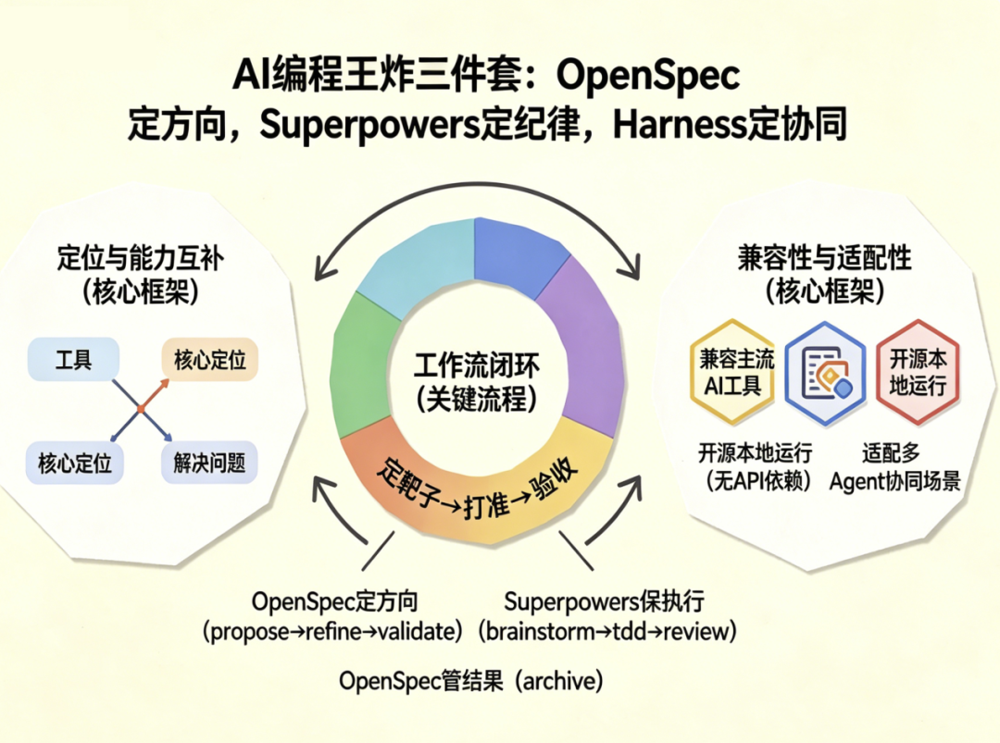
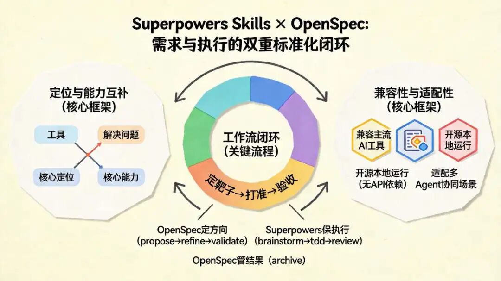
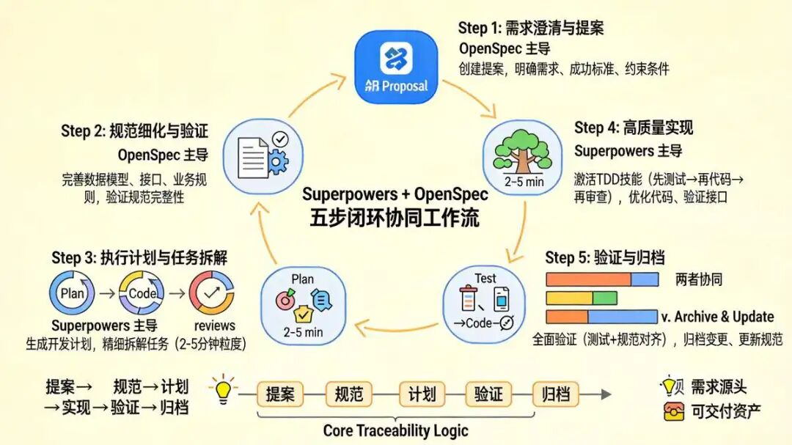
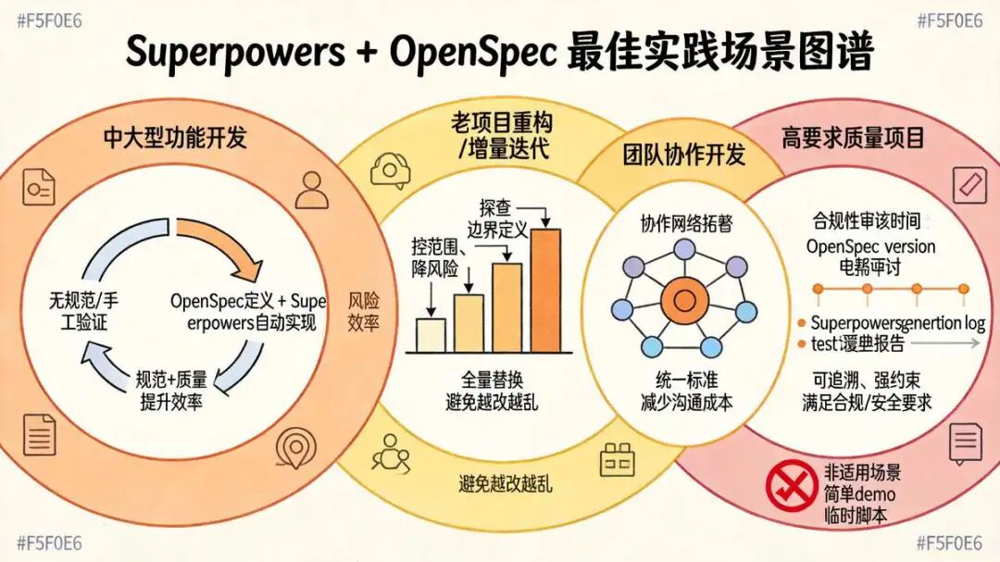
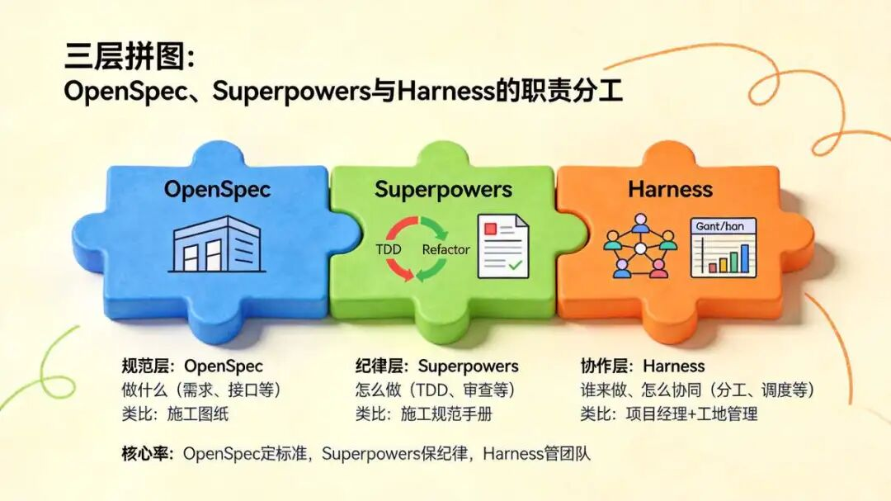
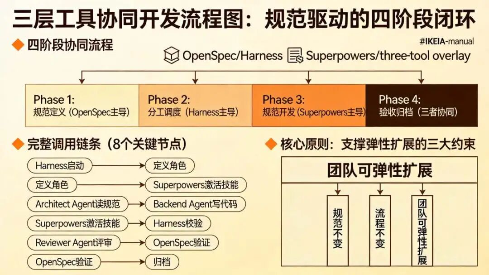
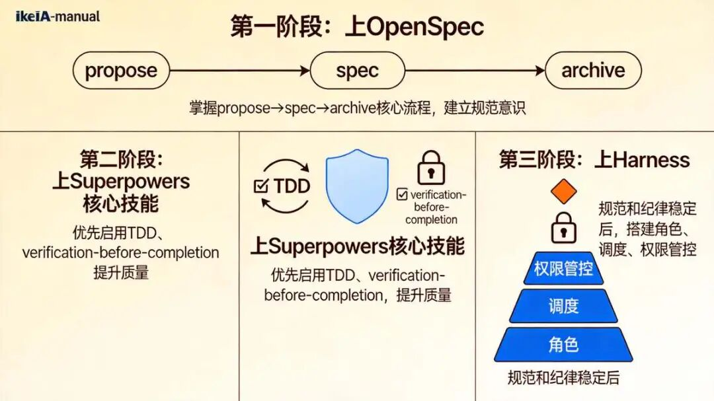

> 📎 来源: [技术自由圈](https://mp.weixin.qq.com/s?__biz=MzkxNzIyMTM1NQ==&mid=2247506739&idx=1&sn=45c99870e889fadd53db4037d3589ec5&chksm=c02f2ab9dec3ad71797877d631a38b73784aedd5b4de126b178bd84ac9c34672e6987534f9bc&mpshare=1&scene=1&srcid=0511YhFpkz2x44j60HWHGE30&sharer_shareinfo=927c3d043118e5c8f8aeef28ac376584&sharer_shareinfo_first=927c3d043118e5c8f8aeef28ac376584) | 时间: 2026-05-11 03:21

---

FSAC未来超级架构师

架构师总动员
实现架构转型，再无中年危机

## 尼恩说在前面

在45岁老架构师尼恩的**读者交流群**（50+人）里，最近不少小伙伴拿到了阿里、滴滴、极兔、有赞、希音、百度、字节、网易、美团这些一线大厂的面试入场券，恭喜各位！

前两天就有个小伙伴面腾讯、 京东、美团、小米等，  都 问到 **“你们怎么做AI编程  ？ 只是用了几个 AI插件吗？ ”**的场景题 ，小伙伴没有一点概念，导致面试挂了。


小伙伴  没有看过系统化的 答案，**回答也不全面** ，so，   面试官不满意  ， 面试挂了。

小伙伴找尼恩复盘， 求助尼恩。

通过这个 文章， 这里  尼恩给大家做一下   系统化、体系化的梳理，写一个系列的文章组成  尼恩编著   《Harness 架构与源码  学习圣经》  深入剖析 Harness AI 平台级 架构的  架构思维与 核心源码，使得大家可以充分展示一下大家雄厚的 “技术肌肉”，**让面试官爱到 “不能自已、口水直流”**。

同时，也一并把这个题目以及参考答案，收入咱们的 《[尼恩Java面试宝典PDF](https://mp.weixin.qq.com/s?__biz=MzkxNzIyMTM1NQ==&mid=2247497474&idx=1&sn=54a7b194a72162e9f13695443eabe186&scene=21#wechat_redirect)》V176版本，供后面的小伙伴参考，提升大家的 3高 架构、设计、开发水平。

## 尼恩编著   《Harness 架构与源码  学习圣经》

**第一章： 什么是 Harness架构？2026年AI核心范式解析 ： Harness架构与Agent工程化**

具体文章：  [54k+Star 爆火！AI  框架 新王者 Harness Agent 来了！尼恩 来一次Harness穿透式解读](https://mp.weixin.qq.com/s?__biz=MzkxNzIyMTM1NQ==&mid=2247506624&idx=1&sn=971fc1704672cfe09e6ecef35bd83ecd&scene=21#wechat_redirect)

**第二章：  Harness架构 与 LangChain、LangGraph 三者联动 的底层逻辑**

具体文章：  [Harness架构 与 LangChain、LangGraph 三者联动 的底层逻辑](https://mp.weixin.qq.com/s?__biz=MzkxNzIyMTM1NQ==&mid=2247506648&idx=1&sn=f5f76be83df2475b80f2917016e56dd8&scene=21#wechat_redirect)

**第三章： DeerFlow 源码 14层Middleware 源码解析 ，又一个 “洋葱责任链模式” 架构思维 的 经典案例**

具体文章： [DeerFlow 源码 14层Middleware 源码解析 ，又一个 “洋葱责任链模式” 架构思维 的 经典案例](https://mp.weixin.qq.com/s?__biz=MzkxNzIyMTM1NQ==&mid=2247506655&idx=1&sn=aca3e53c02c1b8f079cac151ee3d2861&scene=21#wechat_redirect)

**第四章： LangChain 超底层 四大设计模式 Design Patterns ，架构师 的 必备 内功，毒打面试官**

具体文章： [LangChain 超底层 四大设计模式 Design Patterns ，架构师 的 必备 内功，毒打面试官](https://mp.weixin.qq.com/s?__biz=MzkxNzIyMTM1NQ==&mid=2247506655&idx=1&sn=aca3e53c02c1b8f079cac151ee3d2861&scene=21#wechat_redirect)

**第五章：Harness宏观架构：基于 PPAF 思维 & REPL 思维，完成 Lead-Agent和Sub-Agent深度拆解**

具体文章： [第五章：Harness宏观架构：基于 PPAF 思维 & REPL 思维，完成 Lead-Agent和Sub-Agent深度拆解](https://mp.weixin.qq.com/s?__biz=MzkxNzIyMTM1NQ==&mid=2247506671&idx=1&sn=70a7f4bb276400e96371e24ebfe58a53&scene=21#wechat_redirect)

**第六章：Harness宏观架构：DeerFlow 2.0 断点续跑机制 架构设计与实现**

具体文章： [Harness宏观架构：DeerFlow 2.0 断点续跑机制 架构设计与实现](https://mp.weixin.qq.com/s?__biz=MzkxNzIyMTM1NQ==&mid=2247506691&idx=1&sn=5eb2d90418b00dc5fd8c4554f1b31937&scene=21#wechat_redirect)

**第七章：  Harness 平台实战： 用 DeerFlow 构建 一个企业自己的 Manus 平台（ 企业长任务智能体平台）**

具体文章： [Harness 平台实战： 用 DeerFlow 构建 一个企业自己的 Manus 平台（ 企业长任务智能体平台）](https://mp.weixin.qq.com/s?__biz=MzkxNzIyMTM1NQ==&mid=2247506698&idx=1&sn=52d12b43c61fb332261c56ec46421589&scene=21#wechat_redirect)

**第八章：  Harness 超牛逼的 三级记忆架构 上下文+历史分层+事实列表 ！ 落地价值 逆天！！**

具体文章： [Harness 超牛逼的 三级记忆架构 上下文+历史分层+事实列表 ！ 落地价值 逆天！！](https://mp.weixin.qq.com/s?__biz=MzkxNzIyMTM1NQ==&mid=2247506705&idx=1&sn=28025591c12e4df63ea27299a961a6bd&scene=21#wechat_redirect)

**第九章：  Harness 顶级架构：DeerFlow 2.0 沙盒 Sandbox 架构设计、Sandbox 源码深度解析（史上最深 、价值 逆天）**

具体文章： [Harness 顶级架构：DeerFlow 2.0 沙盒 Sandbox 架构设计、Sandbox 源码深度解析（史上最深 、价值 逆天）](https://mp.weixin.qq.com/s?__biz=MzkxNzIyMTM1NQ==&mid=2247506712&idx=1&sn=2aa816a59096b0c8f013d417f433b380&scene=21#wechat_redirect)

**第10章：  顶奢RAG架构之, 必不可少的 RAG评估体系：7大核心指标落地优化，让RAG从Demo走向生产**

【RAG评估、RAG度量指标】顶奢RAG架构之, 必不可少的 RAG评估体系：7大核心指标落地优化，让RAG从Demo走向生产 full - 技术自由圈

**第11章：Harness架构 ： DeerFlow 2.0 的   lead\_agent 任务总调度 架构设计与实现解析**

[Harness架构 ： DeerFlow 2.0 的   lead\_agent 任务总调度 架构设计与实现解析](https://mp.weixin.qq.com/s?__biz=MzkxNzIyMTM1NQ==&mid=2247506732&idx=1&sn=4cc1a185a934019af5ccbe1025ff6f0d&scene=21#wechat_redirect)

**第13章：  深度解析字节跳动DeerFlow 2.0：基于LangGraph的生产级Super Agent驾驭层实现**

具体文章： 尼恩还在写， 本周发布

**第14章： 基于 PPAF 思维，完成 与 Harness 工程化的 Lead-Agent 和 Sub-Agent 深度拆解.**

具体文章： 尼恩还在写， 本周发布

**第15章：Harness架构 核心一：断点续跑机制  的 架构设计  与底层源码分析 .**

具体文章： 尼恩还在写， 本周发布

**第16章：Harness架构 核心二： XXX**

具体文章： 尼恩还在写，后续发布

估计有 10章以上，具体请关注技术自由圈。




用AI写代码 越来越普遍了 ，很多公司都禁止手写代码， 然后，  大家 也遇到太多糟心事儿 。

比如 需求发给ai，但是 结果生成的代码要么偏离预期，要么漏洞百出；

再比如，自己用ai 写代码，还能把控质量，一旦团队上了规模，再加上几个AI Agent 协同，直接乱成一锅粥——分工不明、理解不一。

改来改去返工不断，最后项目延期，老板追问，自己也闹心。

其实，这不是大家能力不行。

也不是AI不够强，核心问题就一个：**你的AI编程，用的不专业。**

工业级的AI编程，  需要 Superpowers Skills、OpenSpec与Harness的组合逻辑 。

工业级的AI编程，本质上是搭建了“规范—执行—协作”的完整三层体系，刚好对应分层架构的核心思维，每一层各司其职、互不越界，又层层支撑、相辅相成，彻底解决AI编程的核心痛点。

说直白点：

- OpenSpec负责“做什么”，把模糊的需求变成明确的规范，确保所有人（包括AI Agent）都在一个频道上；
- Superpowers负责“怎么做”，用工程化纪律约束AI，避免它“走野路子”，保证代码质量；
- Harness负责“谁来做、怎么协同”，让多Agent像人类团队一样有序配合，不内耗、不冲突。

今天，尼恩就结合自己的实操经验，把这套体系掰开揉碎了讲：

- 从“Superpowers与OpenSpec的黄金搭档”
- 到“三层拼图的完整协同”
- 再到实操工作流、复杂场景案例和落地建议

全程干货，没有废话，无论是个人开发者还是团队，看完都能直接上手，实现开发效率与代码质量的双重提升。

## 一：  Superpowers Skills与OpenSpec  黄金搭档

很多人用Superpowers  和  OpenSpec，只是简单叠加，觉得“一个写规范，一个写代码”就完了。

大错特错！

尼恩负责任地说，这两个工具的核心价值，在于形成了“规范—执行—验证”的完整闭环，各自发挥不可替代的作用，是AI编程中“做什么”与“怎么做”的完美组合。

就像分层架构里，表现层和业务层的关系——没有表现层的需求输入，业务层就会盲目开发；没有业务层的规范执行，表现层的需求就无法落地。

下面，尼恩就从互补关系、适用场景、实操流程，再到真实案例，一步步给大家讲明白，这对黄金搭档到底该怎么用。



### 1.1、核心互补关系：为什么它们是黄金搭档？

**1. 定位与能力互补**

尼恩先给大家做个清晰的对比，一看就懂，不用死记硬背：

| **工具** | **核心定位** | **解决问题** | **核心能力** |
| --- | --- | --- | --- |
| OpenSpec | 轻量级规范驱动开发（SDD）框架 | 需求模糊、AI 幻觉、变更不可追溯、多Agent理解不一致；尼恩见过太多团队，因为没有统一规范，AI写的代码和人类开发者写的代码风格迥异，接口不兼容，最后整合时全是冲突 | 提案管理、规范沉淀、变更追踪、团队协作、需求验证；简单说，就是把“口头需求”变成“书面标准”，让所有人都有章可循 |
| Superpowers Skills | Claude Code 技能扩展库 | 执行失控、质量低下、流程不规范、Agent开发“走野路子”；尼恩早期用AI写代码，就遇到过AI不写测试、直接上手撸代码的情况，后期维护的时候，一个小修改就崩掉整个模块 | 头脑风暴、TDD（测试驱动开发）、代码审查、自动化验证、任务拆解；核心就是给AI“立规矩”，强制它遵循工程最佳实践，不能随心所欲 |

这里尼恩插一句：

两者的互补，本质上是“需求标准化”与“执行标准化”的结合。

**2. 工作流闭环**

很多人用这两个工具，之所以没效果，就是因为没形成闭环，要么只定规范不执行，要么只执行不定规范。

尼恩结合自己的实操，总结了一个最简单、最易落地的闭环流程，大家直接抄就行：

**第一步：OpenSpec 定方向。**

通过 propose（提案）、refine（细化）、validate（验证）三个步骤，把模糊的需求转化为结构化规范，作为开发的“唯一事实源”。

也就是说，不管是人类开发者，还是AI Agent，都必须以这份规范为标准，不能凭自己的理解来——这一步，尼恩建议大家多花点时间，规范定得越细，后续返工就越少。

**第二步：Superpowers 保执行。**

通过 brainstorm（头脑风暴）、tdd（测试驱动开发）、review（代码审查），严格按照规范落地，强制执行工程纪律。比如，激活TDD技能后，AI必须先写测试用例，再写代码实现，测试不通过就不能继续；激活代码审查技能后，每段代码都要经过评审，有问题必须修改——这一步，就是避免AI“走野路子”的关键。

**第三步：OpenSpec 管结果。**

开发完成后，通过 archive（归档）功能，记录所有变更，更新规范，形成可追溯的迭代闭环。

尼恩提醒大家，归档不是走过场，每一次修改、每一个版本，都要记录清楚，后续排查问题、版本回滚，都会用到——这也是工程化开发的核心要求之一。

简单总结：**OpenSpec定好“靶子”，Superpowers保证“打准”，最后OpenSpec再“验收”，形成一个完整的闭环**，缺一不可。

**3. 兼容性与适配性**

这一点，尼恩必须重点夸一夸 这两个工具，这个哥俩 真的太“用户友好”了。

首先，两者都兼容 Claude Code、Cursor、Copilot 等主流 AI 工具。

不用你额外更换开发环境，无缝集成到现有开发流程里就行。

尼恩自己的团队，就是用Copilot配合这两个工具，开发效率直接提升了30%以上。

其次，两者都是开源、本地运行工具，无 API 依赖，使用成本极低。

不管是个人开发者，还是小型团队，不用花一分钱，就能用上规范驱动开发和工程化执行的能力——这也是尼恩推荐大家优先尝试的原因之一。

最后，它们能完美适配后续的多Agent协同场景。

很多人一开始只用Superpowers+OpenSpec做个人开发，后续团队扩大、引入多Agent，不用重新调整工具，直接叠加Harness就行，兼容性拉满。

### 1.2、Superpowers + OpenSpec 的最佳组合场景 ？

不是所有场景都需要同时用这两个工具。

尼恩结合自己的实操经验，总结了4个最适合的场景，能最大化发挥“规范+执行”的价值，减少返工、提升质量，大家可以对号入座：



**（1）  中大型功能开发（推荐）：**

这是最能体现两者价值的场景。比如开发一个用户管理系统、支付接口，OpenSpec可以定义完整的规范（需求、接口、数据模型），避免需求模糊导致的返工；

Superpowers按规范生成代码、执行TDD、代码审查，确保质量与规范一致。

尼恩团队上次开发企业级用户认证模块，就是用这套组合，原本需要5天的工作量，3天就完成了，而且测试通过率100%，没有出现一次返工。

**（2）  老项目重构 / 增量迭代：**

老项目的痛点，就是代码混乱、没有规范，重构的时候很容易破坏现有功能。

这时候，OpenSpec可以管理变更范围与影响，明确重构的目标和边界，避免“越改越乱”；

Superpowers保证重构过程的严谨性与可验证性，比如通过回归测试，确保原有功能不受影响，降低重构风险。

尼恩之前重构一个电商老项目的订单模块，就是靠这两个工具，顺利完成重构，还优化了性能，没有出现一次线上故障。

**（3）   团队协作开发：**

团队协作的核心痛点，就是沟通成本高、认知不统一。

OpenSpec提供共享规范，所有人都按同一套标准开发，减少“你理解的需求和我理解的不一样”的问题；

Superpowers强制执行统一开发流程（如TDD、代码审查），确保代码风格与质量一致，后续维护起来也更轻松。

尼恩的团队，现在不管是人类开发者还是AI Agent，都严格遵循这套流程，沟通成本减少了一半以上。

**（4） 高要求质量项目（金融、企业级）：**

这类项目，对代码质量和可靠性要求极高，不能有一丝马虎。

OpenSpec确保需求不跑偏，所有变更可追溯，一旦出现问题，能快速定位原因；

Superpowers强制质量关卡（测试先行、完成前验证、提交前审查），满足高可靠性要求。

总结一下：只要是需要“规范清晰、质量可控”的开发场景，用Superpowers+OpenSpec，准没错。

反之，如果是简单的demo开发、临时脚本编写，就没必要这么复杂，直接用AI写就行.

尼恩也不建议大家过度复杂，实用为主。

## 二、Superpowers + OpenSpec 黄金搭档实操

很多人看完理论，还是不知道怎么上手。

别慌，尼恩给大家整理了一套标准化的协同链路.

从需求到交付全程覆盖，可直接复制套用，兼顾个人开发与小型团队协作场景，每一步都有具体的操作指令，新手也能快速上手。



### 2.1 标准协同链路（5 步闭环）

**第一步：需求澄清与提案（OpenSpec主导）**

这一步的核心，是把模糊的需求，变成明确的提案。

尼恩建议大家，不要直接让AI写代码，先花10-20分钟，用OpenSpec创建提案，把需求、成功标准、约束条件写清楚。

具体操作指令大致如下：

```
# OpenSpec: 创建功能提案/opsx:new user-auth# 编辑提案：明确需求、成功标准、约束（尼恩提醒：越细越好，避免后续歧义）(1) 需求：实现用户认证功能，支持邮箱/手机号登录，两种方式可切换，登录状态持久化（7天有效）(2) 成功标准：能正常注册、登录，返回有效JWT令牌；密码错误提示清晰；登录失败次数过多锁定账号(3) 约束：密码需用bcrypt加密存储，接口需支持限流（10次/分钟）；不允许明文存储任何用户信息(4) 额外说明：兼容现有用户数据库，不影响现有用户正常登录
```

尼恩插一句：这里的约束条件，一定要写清楚，比如加密方式、限流规则，这些都是后续开发的核心依据，避免AI生成不符合要求的代码。

**第二步：规范细化与验证（OpenSpec主导）**

提案创建完成后，需要进一步细化规范，比如数据模型、接口定义、业务规则、错误码等，然后验证规范的完整性与一致性。

避免规范本身有漏洞，导致后续开发跑偏。

具体操作指令：

```
# OpenSpec: 完善规范（数据模型、接口、业务规则）/opsx:refine user-auth# 验证规范完整性与一致性（可邀请团队成员或AI Agent评审）/opsx:validate user-auth(1) 数据模型：定义User表（id、username、password、email、phone、role、createTime、lastLoginTime、isLocked）   - 字段约束：id为主键，自增；email和phone唯一；password非空，加密存储；isLocked默认false(2) 接口：POST /register（注册）、POST /login（登录）、GET /user/info（获取用户信息）、POST /user/unlock（解锁账号）   - 请求参数、响应格式、状态码，都要明确（比如注册接口，需要返回用户ID、token）(3) 业务规则：密码长度≥8位（含字母+数字），同一账号5分钟内登录失败≤3次，失败3次锁定30分钟；注册时需校验邮箱/手机号格式(4) 错误码：定义400（参数错误）、401（认证失败）、429（限流）、403（账号锁定）、500（服务器错误），每个错误码对应具体提示信息
```

尼恩提醒：这一步的验证很重要，最好邀请团队成员一起评审，或者让AI Agent检查规范是否有冲突、是否遗漏需求。

尼恩之前就因为没验证规范，导致后续开发时，接口字段定义不一致，返工了半天。

**第三步：执行计划与任务拆解（Superpowers主导）**

规范定好后，就该进入开发阶段了。

但不要让AI直接上手写代码，先让Superpowers生成详细的开发计划，再精细拆解任务（建议2-5分钟粒度），明确每一步要做什么、依赖什么，避免盲目开发。

具体操作指令：

```
# Superpowers: 基于规范生成详细开发计划/superpowers:brainstorm --prompt "基于OpenSpec规范，生成用户认证模块开发计划，覆盖项目初始化、依赖安装、模型实现、接口开发、测试、审查全流程"# 精细拆解任务（2-5分钟粒度，尼恩建议：任务越细，执行越顺畅）/superpowers:writing-plans(1) 初始化项目目录，创建src、test、config三个文件夹，明确各文件夹用途(2) 安装依赖（express、jsonwebtoken、bcrypt、express-rate-limit、mongoose），配置依赖版本(3) 定义User数据模型，配置数据库连接（MongoDB），实现密码加密逻辑（bcrypt）(4) 编写注册接口逻辑，实现参数校验、邮箱/手机号格式校验、密码加密存储(5) 编写登录接口逻辑，实现账号密码校验、登录失败次数统计、账号锁定、JWT令牌生成(6) 编写用户信息接口和账号解锁接口，实现对应业务逻辑(7) 编写接口限流逻辑，配置限流规则（10次/分钟）(8) 编写测试用例，覆盖所有接口的正常场景、异常场景(9) 进行代码审查，优化代码结构、补充异常处理(10) 本地测试，验证所有功能是否符合OpenSpec规范
```

尼恩经验：任务拆解的粒度，一定要适合自己的开发节奏。

如果是个人开发，2-5分钟一个任务，能避免疲劳；

如果是团队开发，可以根据成员分工，调整任务粒度——核心是“不盲目、有计划”。

**第四步：高质量实现（TDD + 代码审查，Superpowers主导）**

这一步是核心，也是保证代码质量的关键。

尼恩建议大家，一定要激活Superpowers的TDD技能，严格遵循“先写测试、再写代码、最后审查”的流程，避免AI“走野路子”。

具体操作指令：

```
# 激活TDD工作流（核心：先测试，再代码）/superpowers:workflow activate tdd# 生成测试用例 → 生成代码 → 代码审查（三步缺一不可）/superpowers:tdd generate-test --module user-auth/superpowers:tdd generate-code --module user-auth/superpowers:code-review --file src/auth/.js(1) 测试用例：覆盖注册参数校验、密码加密、登录失败、账号锁定、限流、解锁等所有场景   - 比如：测试密码长度不足8位的提示；测试登录失败3次后账号锁定；测试限流场景下的响应(2) 代码实现：按测试用例编写接口逻辑，确保所有测试用例通过（尼恩提醒：测试不通过，绝不进入下一步）(3) 代码审查：检查代码规范、安全漏洞（如密码明文存储、接口无参数校验）、性能问题（如数据库查询冗余）(4) 优化调整：根据审查意见修改代码，重新运行测试，确保测试100%通过(5) 验证接口：使用Postman测试接口，确保接口响应与OpenSpec规范一致，错误提示清晰(6) 补充注释：为核心逻辑（如密码加密、JWT生成）添加注释，提升可维护性——后续自己或团队修改，能快速看懂*
```

这里尼恩再强调一句：TDD不是形式，而是一种工程化思维。

很多人觉得“先写测试太麻烦”，但尼恩用经验告诉你，先写测试，能避免后续大量返工。

你想，测试用例定好了，代码只要满足测试用例，就不会偏离需求，也能减少漏洞。

**第五步：验证与归档（两者协同）**

开发完成后，不要直接交付，一定要做最后验证，然后归档变更，形成可追溯的记录——这是工程化开发的必备环节，也是后续维护的重要依据。

具体操作指令：

```
# Superpowers: 完成前验证（全面检查，避免遗漏）/superpowers:verification-before-completion# OpenSpec: 归档变更，更新主规范（尼恩提醒：归档要详细，便于后续追溯）/opsx:archive user-auth(1) 运行所有测试用例，确保100%通过，测试覆盖率≥80%(2) 验证接口响应与OpenSpec规范一致，所有业务规则都已实现(3) 归档提案，生成变更日志，记录开发过程、修改内容、测试结果(4) 更新主规范文档，同步至团队共享目录（如GitLab、GitHub），确保所有成员都能查看(5) 备份测试报告、API文档，便于后续排查问题、版本回滚
```

流程图：Superpowers × OpenSpec 协同工作流（原文图示保留，核心逻辑为“提案→规范→计划→实现→验证→归档”）

尼恩总结：这5步闭环，看似繁琐，但只要坚持下来，你会发现，开发效率和代码质量都会大幅提升——少返工、少踩坑，这才是工程化开发的意义。

###

*尼恩提示：原文3w字以上， 超过平台限制， 此处省略 1000字，具体请参考  免费pdf。*

*完整版本，请参考 尼恩 免费百度网盘 免费pdf ，**点赞收藏本文后**，截图 找尼恩获取*

###

## 三：Superpowers、OpenSpec、Harness = AI 编程 工具链  三层拼图+黄金王炸

很多开发者都有个误区，觉得只要模型够强，就能搞定所有开发问题，其实真不是这样。

AI编程从“让模型写代码”走向“让模型像团队一样开发”，**中间差的不是更强的模型，而是一套能落地、能闭环的工程基础设施**。

这其中，OpenSpec、Superpowers、Harness三者的组合，恰好搭起了“规范—执行—协作”的完整三层体系，完美解决多Agent协同中的分工混乱、规范不一、质量不可控等核心痛点。



**OpenSpec管“做什么”，Superpowers管“怎么做”，Harness管“谁来做、怎么协同”。**

三者各管一层，互不越界却又层层支撑，合在一起才是完整的AI编程工程化开发体系。这里尼恩必须插一句，这套体系的核心逻辑，其实暗合了咱们架构设计里的**分层架构思维**。

每一层只负责自己的核心职责，层与层之间低耦合、高内聚，既保证了每一层的独立性，又能通过协同实现整体价值最大化，这也是我为什么一直推崇这套组合的核心原因。

很多开发者在使用AI编程时，都会经历这样的演进，一般都是这样的：

- 一开始，就是让模型直接写代码。 这个场景 ，能跑，但质量完全不可控。  没有规范、没有测试、没有审查，改了这里崩了那里，AI幻觉一上来，写的代码能偏离需求十万八千里。
- 后来，慢慢开窍了，开始给模型加规则，写AGENTS.md、加Prompt约束、上Harness，开发过程确实稳了不少，至少不会出现明显的低级错误。
- 再后来，项目大了，开始上多Agent协作——角色分工、并行开发、自动审查，本以为能事半功倍，结果新问题又来了：每个Agent都按自己的理解做事，规范不统一，流程不一致，协作效率低下，甚至出现权限冲突、任务重复的问题。

相信很多同学都遇到过这种情况，对吧？

其实，要解决第三阶段的问题，很简单，就是让三层东西同时到位：统一的规范、统一的流程纪律、统一的团队协作框架。对应的，就是OpenSpec、Superpowers和Harness，三者层层递进、相互支撑，构成完整的AI工程化体系，缺一不可。

### 3.1、三层拼图各管什么？

很多同学分不清这三个工具的定位，总觉得它们是重复的，

其实不然。尼恩做了一张清晰的对比表，大家一看就懂，不用死记硬背：

| **层次** | **工具** | **管什么（核心职责）** | **类比** |
| --- | --- | --- | --- |
| 规范层 | OpenSpec | 做什么——需求、接口、验收标准、变更管理，确保所有Agent对需求理解一致 | 施工图纸 |
| 纪律层 | Superpowers | 怎么做——TDD、代码审查、验证流程、任务拆解，确保Agent按工程最佳实践开发 | 施工规范手册 |
| 协作层 | Harness / Agent Team | 谁来做——角色分工、任务调度、权限管控、多Agent协同，确保团队有序高效配合 | 项目经理 + 工地管理 |

一句话总结三者关系，记牢这句话，你就抓住了核心：

OpenSpec 定标准，Superpowers 保纪律，Harness 管团队。

三者结合，才能实现AI编程从“能跑”到“可靠、可维护、可协同”的跨越，这也是AI编程能落地到生产级项目的关键。尼恩见过太多团队，要么缺规范，要么缺纪律，要么缺协作，最后项目烂尾，真的很可惜。

### 3.2、三层工具详细解析（核心功能+价值）

下面尼恩结合自己的实操经历，逐一拆解这三个工具，不讲虚的，只讲实际用法、痛点和价值，保证大家看完就能上手。

#### 1. 规范层：OpenSpec——锁定“做什么”

先跟大家说，OpenSpec是一个Spec-Driven Development（规范驱动开发）框架，由Fission-AI开源，核心解决的就是“多Agent协作时，如何保证大家对‘做什么’的理解一致”的问题。

可能有同学会说，我一个人开发，不用这么麻烦吧？

一开始，大家都这么想，觉得规范是团队才需要的东西，个人开发怎么省事怎么来。

结果呢？

一个小项目，可能会改三次需求，每次都忘了之前定的接口字段，最后越改越乱，返工了整整两天——这就是没有规范的代价，哪怕是个人开发，规范也能帮你少走很多弯路。

#### 无 OpenSpec 的痛点

你在聊天窗口里告诉Agent“加一个用户认证模块”，Agent按自己的理解去做。

做出来发现接口字段命名不一致、验收标准不明确、功能遗漏，改了三轮还在返工；多Agent协作时，每个Agent都按自己的理解开发，最后整合时出现大量冲突，无法正常运行。

尼恩某vip反馈说他们team 之前做一个支付模块，就是因为没有用OpenSpec，后端Agent写的接口字段是“user\_id”，前端Agent理解成了“userId”，联调时卡了整整一天，最后只能返工修改，浪费了大量时间。这种低级错误，其实只要有规范，就能完全避免。

#### 有 OpenSpec 的优势

很简单，先写一份spec文件，明确定义需求、接口、数据模型、验收条件，所有Agent（及人类开发者）都读同一份spec开工，做完了按spec验证：

- 符合就通过
- 不符合就打回
- 从根源上减少需求偏离和返工。

还是刚才的支付模块， 如果 引入了OpenSpec，提前在spec里明确了所有接口字段、数据类型、业务规则，前端和后端Agent都按spec开发，联调时一次性通过，效率直接翻倍。

这就是规范的力量，它不是束缚，而是效率的保障。

#### OpenSpec 的核心工作流

其实很简单，就四步：

- propose（提出变更）→ spec（编写规格）→ verify（验证产出）→ archive（归档）
- 全程可追溯，不用记复杂的操作。

输出的openspec/  目录包含：提案、规格、任务拆解、验证结果。

特点：结构化、可追溯、所有Agent共享，确保需求不再只活在聊天记录里，而是可查阅、可修改、可追溯的结构化文档。

尼恩现在不管做什么项目，都会先建一个openspec目录，把需求规范写清楚，后续不管是自己修改，还是交给Agent开发，都能省很多事。

#### OpenSpec  关键价值

- **需求结构化**：将口头需求、聊天记录转化为规范文档，避免模糊不清。尼恩见过太多需求，口头说的和实际想要的完全不一样，写进spec里，大家都能看明白，减少沟通成本。
- **理解统一**：多Agent共享同一份规范，不会各做各的，减少协作冲突。这一点，团队开发尤其重要，避免出现“各说各的理”的情况。
- **验收明确**：有清晰的验收标准，不是“看起来差不多就行”，确保交付质量。尼恩之前做项目，经常遇到“做完了，但不符合预期”的情况，有了spec，验收标准一目了然，避免扯皮。
- **变更可追溯**：每一次需求变更都有提案、验证、归档记录，便于后续排查问题、版本回滚。项目越大，这点越重要，不然出现问题，都不知道是哪一次变更导致的。

#### 2. 纪律层：Superpowers——锁定“怎么做”

聊完规范，再聊执行。

有了“做什么”的标准，还得有“怎么做”的纪律，不然Agent还是会走野路子，写出来的代码质量依旧不可控。

Superpowers就是干这个的，它是一个面向AI编程的技能系统，由obra开源，核心解决“怎么让Agent按工程最佳实践写代码，而不是走野路子”的问题。

大家一开始用Agent开发，就遇到过这样的问题：

- Agent直接上手写代码，不写测试、不做计划、不走审查，代码能跑但不可维护，测试覆盖率为零，存在安全漏洞和性能问题；
- 不同Agent的开发风格差异大，后续维护成本极高。

如果引入了Superpowers，这些问题都能得到解决。

#### 无 Superpowers 的痛点

Agent直接上手写代码，不写测试、不做计划、不走审查，代码能跑但不可维护，测试覆盖率为零，存在安全漏洞和性能问题；

不同Agent的开发风格差异大，后续维护成本极高。

尼恩曾接手一个别人用Agent开发的项目，代码没有一句注释，没有一个测试用例，改一个小bug，牵一发而动全身，最后只能推倒重写，真的太坑了。

#### 有 Superpowers 的优势

Agent在开发前被加载对应技能，强制执行工程最佳实践。

- 比如加载TDD技能，就必须先写测试、再写实现，测试不通过就不能继续；
- 加载代码审查技能，每段代码都必须经过评审才能合并，从流程上保证代码质量。

尼恩现在开发，都会给Agent加载TDD和代码审查技能，哪怕是简单的接口开发，也必须先写测试用例，再写代码。

这样做虽然多花了一点时间，但后续维护起来特别轻松，也很少出现bug，长期来看，效率反而更高。

这里其实也融入了咱们**模块化设计**的思维，Superpowers的每一个技能都是一个独立的模块，按需加载，既不冗余，又能精准解决问题，这也是它好用的核心原因。

#### Superpowers 的核心能力（技能详解）

很多同学觉得Superpowers技能多，不好记，尼恩挑核心的、常用的给大家讲，不用全部掌握，重点掌握2-3个就够了：

| **技能** | **核心作用** |
| --- | --- |
| test-driven-development（TDD） | 先写测试用例，再编写代码实现，测试不通过则持续修改，确保代码符合预期功能。这是尼恩最推荐的技能，没有之一，能从根源上保证代码质量。 |
| writing-plans | 开发前先输出详细开发计划，明确步骤、依赖、时间粒度，不允许直接上手写代码。避免Agent盲目编码，减少返工。 |
| code-review | 代码编写完成后，自动审查代码规范、安全漏洞、性能问题，提出优化建议，不通过则无法合并。相当于给代码加了一道“安全阀”。 |
| verification-before-completion | 开发完成前，自动验证代码是否符合OpenSpec规范、测试是否通过，防止“嘴上完成但实际未达标”。避免出现“交付了，但不能用”的情况。 |
| brainstorming | 面对复杂问题，先进行头脑风暴，梳理解决方案和开发思路，再动手开发，避免盲目编码。适合复杂功能开发，能帮Agent理清思路。 |

补充说明：Superpowers的技能是纯Markdown定义，零依赖，可以嵌入任何AI会话，支持按需加载。

按需加载 ，就是  不是一次性塞满所有技能，而是根据任务类型激活对应技能，避免上下文过长导致模型表现变差。

如果 一开始 把所有技能都加载上，结果Agent反应变慢，还会经常出错， 按需加载，效果好了很多。

#### 关键价值

- **流程有纪律**：Agent的开发流程被严格约束，遵循TDD、审查、验证等最佳实践，不走野路子。尼恩现在团队开发，所有Agent都必须遵循Superpowers的技能纪律，代码质量提升了不止一个档次。
- **质量有保障**：代码不仅“能跑”，还具备可维护性、安全性，测试覆盖率达标，减少后续bug。这也是生产级项目的核心要求，不能只追求“能跑”，还要追求“可靠”。
- **风格统一**：强制执行统一的开发规范和代码风格，便于团队协作和后续维护。不用再面对“千人千风格”的代码，后续修改、迭代都很轻松。
- **降低门槛**：即使是不熟悉工程最佳实践的Agent，也能通过加载技能，输出高质量代码。尼恩团队的新人Agent，只要加载对应的技能，就能快速上手，不用花大量时间培训。

#### 3. 协作层：Harness / Agent Team——锁定“谁来做”

有了规范（OpenSpec），有了纪律（Superpowers），最后就是解决“谁来做、怎么协同”的问题——这就是Harness的核心作用。

Harness在这个体系里负责的是多Agent的编排与管控，核心解决“多个Agent怎么分工、怎么并行、怎么不互相冲突”的问题，是多Agent协同开发的核心支撑。

尼恩一个cto级的vip反馈，他们团队在做大型项目时，一开始没有用Harness，多Agent协同简直是“灾难”。

前端Agent和后端Agent对接口的理解不一致，测试Agent拿到的是过时的代码，安全Agent根本不知道其他人改了什么；

出现权限冲突（如多个Agent同时修改同一个文件）、任务重复、并行效率低下等问题，甚至导致项目崩溃过一次，现在想起来都心有余悸。

#### 无 Harness 的痛点

多个Agent各自领了任务开始干，但没人统一分工：前端Agent和后端Agent对接口的理解不一致，测试Agent拿到的是过时的代码，安全Agent根本不知道其他人改了什么；出现权限冲突（如多个Agent同时修改同一个文件）、任务重复、并行效率低下等问题，甚至导致项目崩溃。

尼恩一个cto级的vip，他们 之前做一个电商平台的订单模块，因为没有Harness，两个Agent同时修改同一个文件，导致代码冲突，丢失了部分功能，返工了整整两天。

#### 有 Harness 的优势

通过明确角色分工、任务调度、权限管控，让多Agent像人类团队一样有序协作，并行开发、互不干扰，同时通过硬约束确保开发流程不跑偏。

尼恩一个cto级的vip ，他们 团队引入Harness后，多Agent协同效率提升了60%，再也没有出现过权限冲突、任务重复的问题，项目推进也顺畅了很多。

#### Harness 的核心功能

- **角色定义**：通过AGENTS.md明确每个Agent的职责——比如架构师（负责整体架构设计）、后端开发（负责接口实现）、测试（负责测试用例编写与执行）、安全（负责安全漏洞检测）、Team Lead（负责任务调度与评审）。尼恩会在AGENTS.md里写清楚每个Agent的职责边界，避免越权操作。
- **任务调度**：Team Lead Agent读取OpenSpec的任务列表，根据各Agent的职责，将任务分派给对应角色，确保任务不重复、不遗漏。不用人工手动分派任务，节省了大量时间，也避免了任务分配不合理的问题。
- **权限管控**：每个Agent只能操作自己负责的文件和目录，避免越权操作（如测试Agent不能修改后端代码），防止权限冲突。这一点特别重要，能有效避免代码被误改、功能丢失的问题。
- **硬约束**：设置提交前的校验规则——必须跑测试、Lint、安全扫描，不通过就不让合并，从源头避免不合格代码进入项目。尼恩团队设置了严格的硬约束，凡是测试不通过、有安全漏洞的代码，一律不能合并，确保了代码质量。
- **反馈回路**：测试失败后，自动将失败信息回灌给开发Agent，开发Agent修复后重新提交，形成“开发—测试—修复”的闭环。不用人工手动反馈，提升了问题修复效率，也避免了问题遗漏。

#### 关键价值

- **协作有序**：多Agent分工明确、调度合理，不再各自为战，提升协同效率。尼恩团队现在多Agent协同，各司其职，并行开发，项目周期缩短了30%以上。
- **风险可控**：权限隔离防止越权操作，硬约束防止偷工减料，减少项目风险。生产级项目，风险控制是重中之重，Harness恰好解决了这一点。
- **效率提升**：支持任务并行开发，可追踪、可回滚，大幅缩短开发周期。尤其是大型项目，并行开发能节省大量时间，提前完成交付。
- **可扩展性强**：项目大了可以增加Agent角色，项目小了可以减少Agent，灵活适配不同项目规模。尼恩从个人小项目到企业级项目，都用Harness，适配性特别好。

### 3.3、三层工具怎么串起来？（完整开发周期）

很多同学看完三个工具，还是不知道怎么用，觉得很复杂。

其实不用慌，尼恩结合自己的实操经历，给大家梳理了一个完整的开发周期，三者协同配合，形成“规范—分工—开发—验收”的完整闭环，大家直接照搬就行，不用自己摸索。

而且回头讲实操录制为视频，大家一看就。

> 这里要再强调一句，这套闭环的核心，还是咱们的分层架构思维： 每一层各司其职，层与层之间协同配合，不越界、不缺位，这也是这套体系能稳定落地的关键。



*尼恩提示：原文3w字以上， 超过平台限制， 此处省略 1000字，具体请参考  免费pdf。*

*完整版本，请参考 尼恩 免费百度网盘 免费pdf ，**点赞收藏本文后**，截图 找尼恩获取*

####

### 3.6、核心优势总结

结合尼恩的实操经历，这套体系的核心优势，其实就5点，简单好记，大家记牢就行：

**(1) 需求不跑偏：OpenSpec固化需求为结构化规范，Superpowers严格按规范执行，Harness确保所有Agent围绕规范协作，避免AI幻觉与需求偏离。这一点，是这套体系最核心的优势，能从根源上减少返工。**

**(2) 质量有保障：Superpowers提供TDD、代码审查、自动化验证等全流程纪律约束，Harness增加提交前硬约束，OpenSpec负责验收验证，全方位确保代码质量与可靠性。生产级项目，质量就是生命线，这套体系能很好地保障质量。**

**(3) 协作更高效：OpenSpec提供共享规范，减少沟通成本；Harness实现多Agent有序分工、并行开发；Superpowers统一开发流程，让团队（含Agent）协作更顺畅。尼恩团队引入这套体系后，沟通成本减少了50%，协同效率提升了60%。**

**(4) 变更可追溯：OpenSpec负责提案、归档，记录每一次变更；Harness记录任务分配与完成情况；Superpowers记录开发过程，全程可追溯、可回滚，便于问题排查。项目越大，这点越重要，能有效降低维护成本。**

**(5) 灵活适配性：三者均为开源、低依赖工具，可无缝集成现有开发流程，适合从个人项目（Superpowers+OpenSpec）到企业级多Agent协同项目（三者全用）的各类场景。尼恩从个人小项目到团队协作项目，都在用这套体系，适配性特别好。**

### 3.7、分阶段落地建议

很多同学看到这套体系，觉得很复杂，不知道从哪里下手。



尼恩给大家的建议是：不用追求一步到位，按优先级逐步落地，投入产出比更高。结合尼恩的落地经验，分三个阶段来，新手也能快速上手：

**(1) 第一阶段：先上 OpenSpec（基础）哪怕只是手写一份简单的需求spec，也比在聊天窗口里口头描述强十倍。重点掌握propose（提案）、spec（规范）、archive（归档）核心流程，建立规范意识，确保需求有记录、有验收标准，解决“做什么”的问题。（1天可上手）尼恩一开始，就是从手写spec开始的，不用追求完美，只要把需求、接口、验收标准写清楚就行，后续再慢慢优化。**

**(2) 第二阶段：再上 Superpowers 核心技能（提升质量）不用加载所有技能，优先启用test-driven-development（TDD）和verification-before-completion（完成前验证），这两个技能投入产出比最高，能快速解决“怎么做”的问题，确保代码质量，避免Agent走野路子。后续再逐步添加brainstorm、code-review等技能。尼恩建议，新手先掌握TDD技能，这是提升代码质量的关键，也是最容易上手的技能。**

**(3) 第三阶段：最后上 Harness / Agent Team（协同增效）等需求规范和开发纪律稳定后，再引入Harness，实现多Agent协同开发。重点搭建角色分工（AGENTS.md）、任务调度和权限管控，避免过早引入协作层导致的混乱——分工越多，若规范和纪律不到位，乱得越厉害。尼恩团队就是在规范和纪律稳定后，才引入Harness的，这样能避免很多不必要的麻烦，协同效率也更高。**

### 3.8、避坑提醒（关键注意事项）

结合尼恩踩过的坑，给大家提5个关键注意事项，能帮大家少走很多弯路，一定要记牢：

- **Superpowers 技能按需加载**：不要全部加载，否则会让上下文过长，模型反而表现变差；根据任务类型（如开发、重构、测试）激活对应技能即可。尼恩一开始就犯过这个错，把所有技能都加载上，结果Agent反应变慢，还经常出错，后来按需加载，效果好了很多。
- **AGENTS.md 写精简**：只明确各Agent“先看什么（OpenSpec规范）、按什么流程（Superpowers技能）”，架构和业务细节放docs/目录，避免内容冗余。尼恩之前把AGENTS.md写得太复杂，Agent反而找不到重点，后来精简后，协作效率提升了不少。
- **避免技能冲突**：如果Harness自带代码审查、测试等能力，关掉Superpowers里的对应技能，避免重复校验，影响开发效率。尼恩团队之前就出现过重复校验的情况，导致开发效率变慢，关掉其中一个技能后，就好了。
- **规范先行**：无论项目大小，先定OpenSpec规范，再开始开发，避免“边开发边定规范”，导致需求反复、返工增多。这是尼恩踩过的最痛的坑之一，大家一定要避开。
- **小项目试水**：个人开发者或小型团队，可先用简单功能（如TODO列表、简单接口）实践Superpowers+OpenSpec的流程，熟练后再推广到复杂项目。新手不要一开始就用在大型项目上，先从小项目入手，积累经验，再逐步推广。

### 3.9、结语

最后，尼恩再跟大家聊几句心里话。Superpowers Skills、OpenSpec与Harness的组合，不仅是工具的叠加，更是AI编程理念的升级——从“随机生成代码”到“规范驱动、纪律执行、协同高效”的工程化开发。

OpenSpec锁需求，Superpowers锁纪律，Harness锁协作，三层拼齐，AI才能从“写代码的助手”变成“可靠的开发团队”。这不是未来的愿景，而是现在就能落地的工程实践。

OpenSpec、Superpowers和Harness都是开源项目，文档齐全，可以从最小配置开始用起。关键不在于一步到位，而在于知道三层各管什么、缺哪层会出什么问题，逐步优化、稳步落地。

尼恩从一开始的踩坑无数，到现在能熟练运用这套体系，带领团队高效开发，深刻体会到：AI编程的核心，从来不是模型有多强，而是有没有一套能落地的工程化体系。

无论是个人开发者，还是团队，掌握这套组合拳，都能在AI编程时代占据先机，大幅提升开发效率与代码质量，让AI真正成为高效、可靠的开发伙伴。

最后，尼恩想问大家：你在AI编程中，有没有遇到过需求跑偏、协作混乱的问题？

不妨试试这套体系，相信会给你带来惊喜。

如果大家在落地过程中遇到任何问题，也可以在评论区留言，尼恩会尽力帮大家解答。

## 下面的案例， 通过 尼恩 三高架构 +尼恩 AI架构 +尼恩 架构陪跑，  实现 P7 升级

[小伙赶在32岁 末班车，拿到 京东P7（60w），  撬开P8（年薪100W）通道， 逆天改命了！！！](https://mp.weixin.qq.com/s?__biz=MzIxMzYwODY3OQ==&mid=2247487192&idx=1&sn=284141b9a55954d371207c667e3a2443&scene=21#wechat_redirect)

[逆袭 100万 P8。37岁 空窗6个月，靠 Java+AI双栖架构， 2个月上岸 100w年薪到手，职业重生+逆天改命！](https://mp.weixin.qq.com/s?__biz=MzIxMzYwODY3OQ==&mid=2247487170&idx=1&sn=239470e9b38c511261839c9d6bb39f5e&scene=21#wechat_redirect)

[一飞冲天， 逆 首席： 37 岁  借力 Java+AI 逆袭  首席架构  ， 年薪80W+太香了](https://mp.weixin.qq.com/s?__biz=MzIxMzYwODY3OQ==&mid=2247487126&idx=1&sn=9016db06543f328a42cd37eadfceffee&scene=21#wechat_redirect)

[31岁 /专科 升架构成功， 收10个offer 变 offer 皇帝 ！！  下一步，直冲100W](https://mp.weixin.qq.com/s?__biz=MzIxMzYwODY3OQ==&mid=2247487047&idx=1&sn=0397145548d8c1e76ee900c7e5920f4d&scene=21#wechat_redirect)

[奇迹 :   一年 涨2倍，   年薪 60W 梦想实现  。 接下来，开启 40岁之前的 年薪  200W 梦想](https://mp.weixin.qq.com/s?__biz=MzIxMzYwODY3OQ==&mid=2247487014&idx=1&sn=5d1359a7adc7c9e46e6374597bb03138&scene=21#wechat_redirect)

[28岁/6年/被裁1年，收 3 大厂offer ， 成 大厂 皇后 。2本学历 51W 年薪，惊天 逆涨，涨薪2倍](https://mp.weixin.qq.com/s?__biz=MzIxMzYwODY3OQ==&mid=2247486987&idx=1&sn=ff977f450dd242446f228d3a6585e258&scene=21#wechat_redirect)，大厂皇后

[涨薪传奇： 18k->38K , 单月暴20K，32岁小伙伴 2个月时间年薪 翻1.5倍 ，一步登天+逆天改命](https://mp.weixin.qq.com/s?__biz=MzIxMzYwODY3OQ==&mid=2247486960&idx=1&sn=f57253a448694c32e834207381c42284&scene=21#wechat_redirect)

[低学历 传奇：29岁6年专套本，受够了外包，狠卷3个月逆袭大厂 涨 1倍， 逆天改命](https://mp.weixin.qq.com/s?__biz=MzIxMzYwODY3OQ==&mid=2247486945&idx=1&sn=f6ff6231ccf3585624161c2ef1f50fdf&scene=21#wechat_redirect)

[极速上岸： 被裁 后， 8天 拿下 京东，狠涨 一倍 年薪48W， 小伙伴 就是 做对了一件事](https://mp.weixin.qq.com/s?__biz=MzIxMzYwODY3OQ==&mid=2247486913&idx=1&sn=edd6774e9d17c39327e8dcb95fdd68d9&scene=21#wechat_redirect)

[外包+二本 进 美团： 26岁小2本 一步登天， 进了顶奢大厂（ 美团） ， 太爽了](https://mp.weixin.qq.com/s?__biz=MzIxMzYwODY3OQ==&mid=2247486904&idx=1&sn=e7c878f99ed101ebfbd1d80ec0e07401&scene=21#wechat_redirect)

[超牛的Java+Al 双栖架构： 34岁无路可走，一个月翻盘，拿 3个架构offer，靠  Java+Al   逆天改命！！！](https://mp.weixin.qq.com/s?__biz=MzIxMzYwODY3OQ==&mid=2247486848&idx=1&sn=ff43d058271b0801f84aba3f3d957855&scene=21#wechat_redirect)

java+AI 逆袭2：[：3年 程序媛 被裁， 25W-》40W 上岸， 逆涨60%。 Java+AI 太神了， 架构小白 2个月逆天改命](https://mp.weixin.qq.com/s?__biz=MzIxMzYwODY3OQ==&mid=2247486858&idx=1&sn=9cd122c18d166433b43d0952d3a7a7a8&scene=21#wechat_redirect)

[Java+AI逆袭3 ： 36岁/失业7个月/彻底绝望 。狠卷 3个月 Java+AI ，终于逆风翻盘，顺利 上岸](https://mp.weixin.qq.com/s?__biz=MzIxMzYwODY3OQ==&mid=2247486870&idx=1&sn=990a540a155cdb8254ebce6c75816882&scene=21#wechat_redirect)

[Java+AI逆袭 ： 闲了一年，41岁/失业12个月/彻底绝望 。狠卷 2个月 Java+AI ，终于逆风翻盘](https://mp.weixin.qq.com/s?__biz=MzIxMzYwODY3OQ==&mid=2247486880&idx=1&sn=a37033157c766ac5ae7c9195fe776693&scene=21#wechat_redirect)

[Java+AI逆袭5：1个月大涨2.5W，37岁 脱坑外包， 入了正编，GO+AI 要逆天了](https://mp.weixin.qq.com/s?__biz=MzIxMzYwODY3OQ==&mid=2247486885&idx=1&sn=4e26fbb093f45d437dedf14ea9b9e6c5&scene=21#wechat_redirect)

**职业救助站**

实现职业转型，极速上岸


关注**职业救助站**公众号，获取每天职业干货
助您实现**职业转型、职业升级、极速上岸**
---------------------------------

**技术自由圈**

实现架构转型，再无中年危机


关注**技术自由圈**公众号，获取每天技术千货
一起成为牛逼的**未来超级架构师**

**几十篇架构笔记、5000页面试宝典、20个技术圣经
请加尼恩个人微信 免费拿走**

**暗号，请在 公众号后台 发送消息：领电子书**

如有收获，请点击底部的"在看"和"赞"，谢谢
