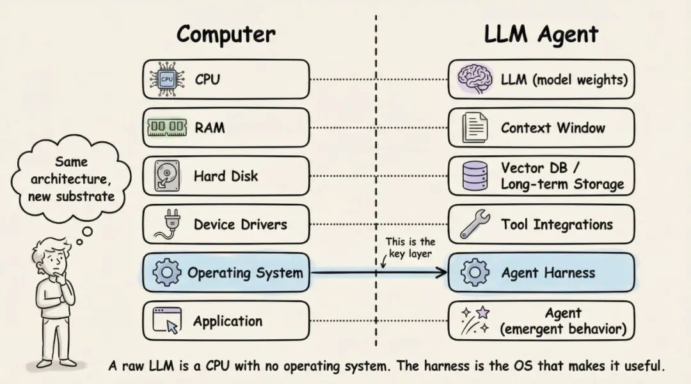
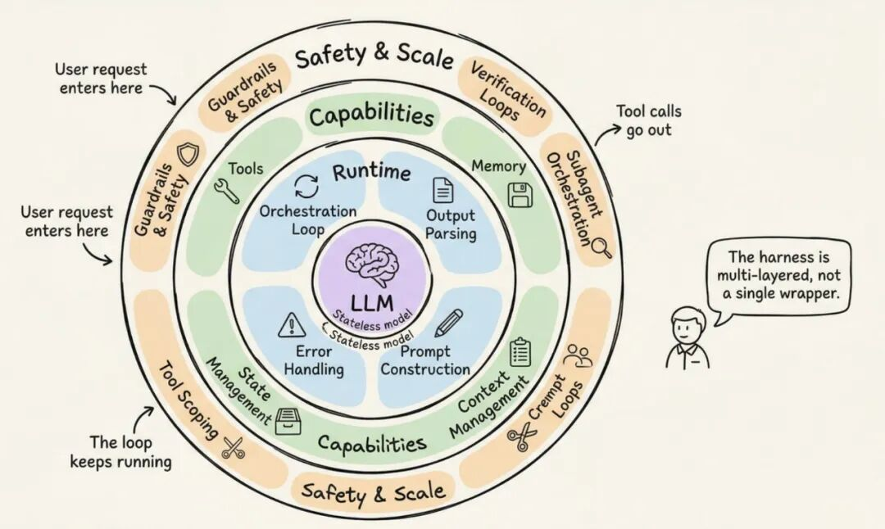
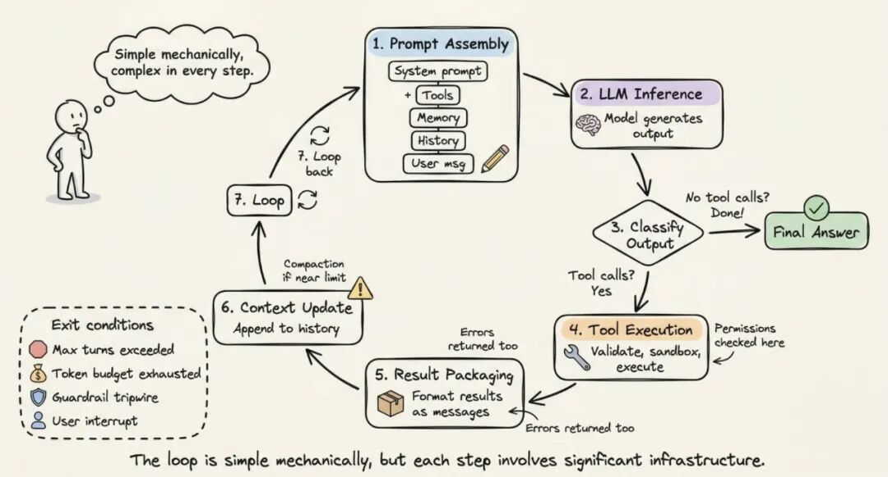
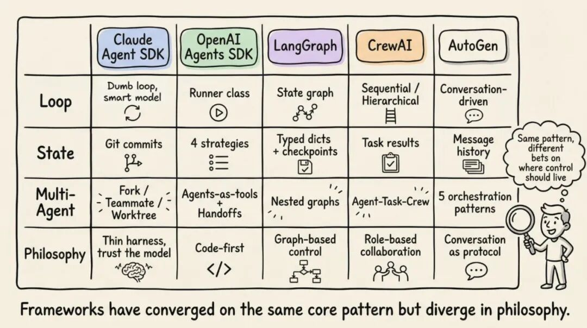
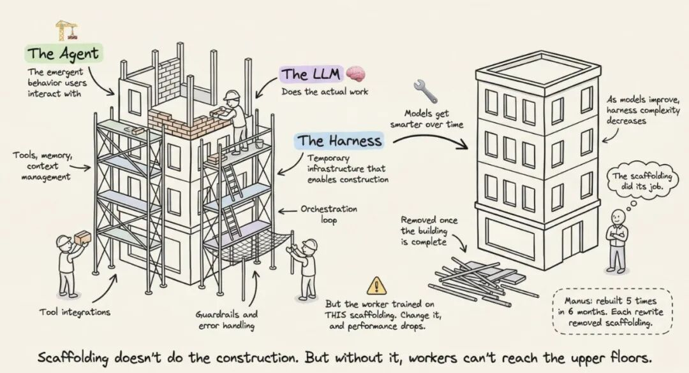
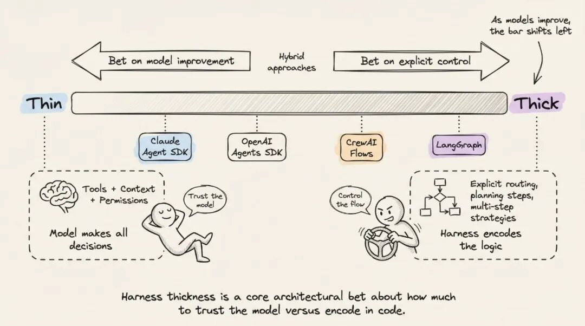
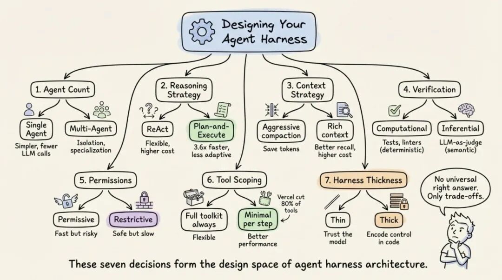

> 📎 来源: [克兰西AI](https://mp.weixin.qq.com/s?__biz=MzkxMTMxNDA1MA==&mid=2247484690&idx=1&sn=13b169304f340aa93b98460306d2df14&chksm=c0a9df5d8ae52c3b01f274ae517ba4fd5ecaf23c3594c6caeb34cfbaf5a1732176f05583fa08&mpshare=1&scene=1&srcid=0423I5uofjbD0BmDnCrBRXVq&sharer_shareinfo=fc34e6685ae2ef690783b941c5f682a9&sharer_shareinfo_first=fc34e6685ae2ef690783b941c5f682a9) | 时间: 2026-04-23 03:55

---

本文将深入剖析前沿AI公司/AI工具： Anthropic、OpenAI、Perplexity 和 LangChain 到底在构建什么。涵盖编排循环（Orchestration Loop）、工具、记忆、上下文管理，以及将无状态 LLM 转化为强大智能体的一切核心要素。

你搭过聊天机器人，也许还接了个 ReAct 循环（ReAct Loop）挂上几个工具。演示跑得挺好。然后你试着做一个生产级别的东西——就全面崩溃了：模型忘了三步前做过什么，工具调用悄无声息地失败，上下文窗口塞满了垃圾信息。

**问题不在模型，而在模型周围的一切。**

LangChain 已经证明了这一点：他们只改动了 LLM 外层的基础设施（同一个模型、同样的权重），就从 TerminalBench 2.0（一项智能体编码能力评测基准）排名前 30 开外跃升至第 5 名。另一个独立研究项目让 LLM 自己优化基础设施，达到了 76.4% 的通过率，超越了人工设计的系统。

这套基础设施有了名字：智能体脚手架（Agent Harness）。

这个术语在 2026 年初被正式提出，但概念早已存在。脚手架是包裹 LLM 的完整软件基础设施：编排循环、工具、记忆、上下文管理、状态持久化、错误处理和护栏（Guardrails）。Anthropic 的 Claude Code 文档直截了当地说：SDK 就是"驱动 Claude Code 的智能体脚手架"。OpenAI 的 Codex 团队使用同样的表述，明确将"智能体"和"脚手架"等同起来，指代让 LLM 真正可用的非模型基础设施。

LangChain 的 Vivek Trivedy 给出了一个我很喜欢的经典公式：**"如果你不是模型，你就是脚手架。"**

这里有个容易让人搞混的关键区分。"智能体"是涌现出的行为：那个有目标、会用工具、能自我纠错的实体，用户与之交互。脚手架则是产生这种行为的机械装置。当有人说"我构建了一个智能体"，他们的意思是构建了一套脚手架，然后把它指向一个模型。



Beren Millidge 在 2023 年的文章"Scaffolded LLMs as Natural Language Computers[1]"中精确地阐述了这个类比。一个裸 LLM 就是一颗没有 RAM、没有磁盘、没有 I/O 的 CPU。上下文窗口充当 RAM（快但容量有限），外部数据库充当磁盘存储（容量大但慢），工具集成相当于设备驱动，而脚手架就是操作系统。正如 Millidge 所写："我们重新发明了冯·诺依曼架构"——因为它是任何计算系统的自然抽象。

# 三层工程

围绕模型，有三个层次递进的工程：

- 提示工程（Prompt Engineering）精心设计模型接收的指令。
- 上下文工程（Context Engineering）管理模型看到什么、何时看到。
- 脚手架工程（Harness Engineering）涵盖前两者，外加整个应用基础设施：工具编排、状态持久化、错误恢复、验证循环（Verification Loops）、安全执行和生命周期管理。

**脚手架不是提示词的包装器。它是使自主智能体行为成为可能的完整系统。**

# 生产级脚手架的 12 个核心组件

综合 Anthropic、OpenAI、LangChain 及更广泛的实践者社区的经验，一套生产级智能体脚手架包含 12 个不同组件。让我们逐一拆解。



## 1. 编排循环

这是心脏跳动的节拍。它实现了 TAO 循环（思考 - 行动 - 观察，即 ReAct 循环）：组装提示词、调用 LLM、解析输出、执行工具调用、将结果回传、重复直到完成。

从机制上看，它往往就是一个 while 循环。复杂性不在循环本身，而在循环所管理的一切。Anthropic 将他们的运行时描述为一个"笨循环"——**所有智能都在模型里，脚手架只负责管理轮次**。

## 2. 工具

工具是智能体的双手。它们以 schema 的形式定义（名称、描述、参数类型），注入 LLM 的上下文中，让模型知道有哪些可用能力。工具层负责注册、schema 校验、参数提取、沙箱执行、结果捕获，以及将结果格式化为 LLM 可读的观察信息。

Claude Code 提供六大类工具：文件操作、搜索、执行、网络访问、代码智能和子智能体生成。OpenAI 的 Agents SDK 支持函数工具（通过 @function\_tool）、托管工具（WebSearch、CodeInterpreter、FileSearch）和 MCP 服务器工具。

## 3. 记忆

记忆在多个时间尺度上运作。短期记忆是单次会话内的对话历史。长期记忆跨会话持久化：Anthropic 使用 CLAUDE.md[2] 项目文件和自动生成的 MEMORY.md[3] 文件；LangGraph 使用按命名空间组织的 JSON Stores；OpenAI 支持基于 SQLite 或 Redis 的 Sessions。

Claude Code 实现了三级层次结构：轻量级索引（每条约 150 字符，始终加载）、按需拉取的详细主题文件、以及仅通过搜索访问的原始记录。一个关键设计原则：**智能体将自身记忆视为"提示"，在行动前与实际状态进行验证**。

## 4. 上下文管理

很多智能体就是在这里无声地翻车的。核心问题是上下文腐化（Context Rot）：当关键内容落在窗口中段位置时，模型性能下降超过 30%（Chroma 研究，得到 Stanford "Lost in the Middle" 研究的印证——该研究发现 LLM 对上下文窗口中间位置的信息关注度最低）。即便是百万 token 的窗口，随着上下文增长，指令遵循能力也会退化。

生产级策略包括：

- 压缩（Compaction）：在接近上下文限制时对对话历史进行摘要（Claude Code 保留架构决策和未解决的 bug，同时丢弃冗余的工具输出）
- 观察遮蔽（Observation Masking）：JetBrains 的 Junie 隐藏旧的工具输出，但保留工具调用可见
- 即时检索（Just-in-time Retrieval）：维护轻量级标识符，按需动态加载数据（Claude Code 使用 grep、glob、head、tail 而非加载完整文件）
- 子智能体委托（Sub-agent Delegation）：每个子智能体进行深入探索，但只返回 1,000 到 2,000 token 的精炼摘要

Anthropic 的上下文工程指南明确了目标：**找到最小的高信号 token 集合，最大化期望结果的可能性**。

## 5. 提示构建

这一步组装模型在每一轮实际看到的内容。它是分层的：系统提示词、工具定义、记忆文件、对话历史和当前用户消息。

OpenAI 的 Codex 使用严格的优先级栈：服务端控制的系统消息（最高优先级）、工具定义、开发者指令、用户指令（级联的 AGENTS.md[4] 文件，32 KiB 上限），最后是对话历史。

## 6. 输出解析

现代脚手架依赖原生工具调用——模型返回结构化的 tool\_calls 对象，而非需要解析的自由文本。脚手架的检查逻辑：有工具调用？执行并继续循环。没有工具调用？那就是最终答案。

对于结构化输出，OpenAI 和 LangChain 都支持通过 Pydantic 模型进行 schema 约束的响应。传统方案如 RetryWithErrorOutputParser（将原始提示、失败的补全和解析错误一起回传给模型）仍可用于边缘场景。

## 7. 状态管理

LangGraph 将状态建模为流经图节点的类型化字典，用 reducer 合并更新。检查点（Checkpointing）在超级步边界处执行，支持中断后恢复和时间旅行调试。OpenAI 提供四种互斥策略：应用内存、SDK sessions、服务端 Conversations API，或轻量级的 previous\_response\_id 链式调用。Claude Code 另辟蹊径：用 git commit 作为检查点，用 progress 文件作为结构化草稿本。

## 8. 错误处理

为什么这很重要？一个 10 步流程，即使每步成功率 99%，端到端成功率也只有约 90.4%。**错误累积的速度非常快**。

LangGraph 区分四种错误类型：瞬时错误（带退避的重试）、LLM 可恢复错误（将错误作为 ToolMessage 返回让模型自行调整）、用户可修复错误（中断等待人工输入）、意外错误（上抛用于调试）。Anthropic 在工具处理器内捕获失败并作为错误结果返回，以保持循环继续运行。Stripe 的生产级脚手架将重试次数上限设为两次。

## 9. 护栏与安全

OpenAI 的 SDK 实现了三个层级：输入护栏（在首个智能体上运行）、输出护栏（在最终输出上运行）和工具护栏（在每次工具调用时运行）。触发线（Tripwire）机制一旦触发就立即中止智能体。

Anthropic 在架构上将权限执行与模型推理分离。模型决定尝试什么；工具系统决定什么被允许。Claude Code 独立地管控约 40 个离散工具能力，分三个阶段执行：项目加载时的信任建立、每次工具调用前的权限检查、以及高风险操作的显式用户确认。

## 10. 验证循环

这是区分玩具级演示和生产级智能体的分水岭。Anthropic 推荐三种方式：基于规则的反馈（测试、lint、类型检查）、视觉反馈（通过 Playwright 截图用于 UI 任务）、以及 LLM 充当评审（LLM-as-judge，由独立的子智能体评估输出）。

Claude Code 的创建者 Boris Cherny 指出，**给模型一种验证自身工作的手段，能将质量提升 2 到 3 倍**。

## 11. 子智能体编排

Claude Code 支持三种执行模型：Fork（与父上下文字节级相同的副本）、Teammate（独立终端面板，通过基于文件的信箱通信）和 Worktree（拥有独立 git worktree，每个智能体一个隔离分支）。OpenAI 的 SDK 支持智能体即工具（agents-as-tools，专家处理有边界的子任务）和交接（Handoff，专家接管全部控制权）。LangGraph 则将子智能体实现为嵌套状态图。

# 循环运转：逐步演练

了解了各组件之后，让我们追踪一个完整循环中它们是如何协同工作的。



第 1 步（提示组装）：脚手架构建完整输入——系统提示词 + 工具 schema + 记忆文件 + 对话历史 + 当前用户消息。重要上下文被放置在提示的开头和末尾（即 "Lost in the Middle" 研究发现的最佳实践）。

第 2 步（LLM 推理）：组装好的提示发送至模型 API。模型生成输出 token：文本、工具调用请求，或两者兼有。

第 3 步（输出分类）：如果模型只产出了文本而没有工具调用，循环结束。如果请求了工具调用，则进入执行阶段。如果请求了交接（Handoff），则更新当前智能体并重启循环。

第 4 步（工具执行）：对每个工具调用，脚手架校验参数、检查权限、在沙箱环境中执行并捕获结果。只读操作可并行执行；修改操作串行执行。

第 5 步（结果封装）：工具结果被格式化为 LLM 可读的消息。错误被捕获并作为错误结果返回，以便模型自我纠正。

第 6 步（上下文更新）：结果追加到对话历史中。如果接近上下文窗口限制，脚手架触发压缩。

第 7 步（循环）：回到第 1 步。重复直到终止。

终止条件是分层的：模型产出了不含工具调用的响应、超过最大轮次限制、token 预算耗尽、护栏触发线触发、用户中断、或返回了安全拒绝。一个简单问题可能只需 1 到 2 轮，而一个复杂的重构任务可以跨多轮串联数十次工具调用。

对于跨越多个上下文窗口的长时间运行任务，Anthropic 开发了一种两阶段的"Ralph Loop"模式[5]（Ralph Loop 是 Anthropic 提出的长任务执行模式）：初始化智能体搭建环境（初始化脚本、进度文件、功能列表、初始 git commit），然后编码智能体在后续每个会话中读取 git 日志和进度文件来定位自己的位置，选取最高优先级的未完成功能，完成开发、提交并撰写摘要。文件系统在上下文窗口之间提供了连续性。

# 真实框架如何实现这套模式



Anthropic 的 Claude Agent SDK 通过一个 query() 函数暴露脚手架，该函数创建智能体循环并返回一个异步迭代器来流式传输消息。运行时就是一个"笨循环"，所有智能都在模型里。Claude Code 使用"收集 - 行动 - 验证"循环：收集上下文（搜索文件、阅读代码）、采取行动（编辑文件、执行命令）、验证结果（运行测试、检查输出），如此反复。

OpenAI 的 Agents SDK 通过 Runner 类实现脚手架，提供三种模式：异步、同步和流式。该 SDK 是"代码优先"的：工作流逻辑用原生 Python 表达，而非图 DSL。Codex 脚手架在此基础上扩展了三层架构：Codex Core（智能体代码 + 运行时）、App Server（双向 JSON-RPC API）和客户端界面（CLI、VS Code、Web 应用）。所有界面共享同一套脚手架——这就是为什么"Codex 模型在 Codex 自家界面上感觉比在通用聊天窗口里好用得多"。

LangGraph 将脚手架建模为显式状态图。两个节点（llm\_call 和 tool\_node）通过条件边相连：如果存在工具调用，路由到 tool\_node；如果没有，路由到 END。LangGraph 由 LangChain 的 AgentExecutor 演进而来——后者在 v0.2 中被弃用，因为难以扩展且缺乏多智能体支持。LangChain 的 Deep Agents 明确使用了"智能体脚手架"这个术语：内置工具、规划（write\_todos 工具）、用文件系统管理上下文、子智能体生成和持久化记忆。

CrewAI 实现了基于角色的多智能体架构：Agent（围绕 LLM 的脚手架，由角色、目标、背景故事和工具定义）、Task（工作单元）和 Crew（智能体集合）。CrewAI 的 Flows 层增加了"确定性骨架，在关键处注入智能"——管理路由和校验，而 Crew 负责自主协作。

AutoGen（正在演进为 Microsoft Agent Framework）率先提出了对话驱动的编排。它的三层架构（Core、AgentChat、Extensions）支持五种编排模式：顺序、并发（扇出/扇入）、群聊、交接，以及 magentic（管理者智能体维护一个动态任务账本来协调各专家）。

# 脚手架隐喻

脚手架这个比喻不是随便说说。它很精确。建筑脚手架是临时基础设施，让工人能到达原本够不着的楼层。脚手架本身不做建造工作，但没有它，工人就上不了高层。



关键洞察：**建筑完工后脚手架就该拆除。随着模型能力提升，脚手架复杂度应当降低**。Manus 在六个月内重建了五次，每次重写都在削减复杂度——复杂的工具定义变成了通用 shell 执行，"管理者智能体"变成了简单的结构化交接。

这揭示了协同进化原则：模型如今在训练后阶段（post-training）就将特定脚手架纳入闭环。Claude Code 的模型学会了使用它所训练时搭配的那套脚手架。正因为这种紧密耦合，修改工具实现可能导致性能下降。

脚手架设计的"前瞻性测试"：如果更强的模型能提升性能而无需增加脚手架复杂度，那么这个设计就是合理的。



# 定义每套脚手架的七个关键决策

每个脚手架架构师都要面对七个选择：



1. 1. **单智能体 vs. 多智能体。** Anthropic 和 OpenAI 都说：先把单智能体做到极致。多智能体系统带来额外开销（路由需要额外 LLM 调用、交接时上下文丢失）。只有当工具过载超过约 10 个重叠工具，或存在明确独立的任务领域时，才考虑拆分。
2. 2. **ReAct vs. 先规划后执行。** ReAct 在每一步交织推理和行动（灵活但单步成本高）。先规划后执行将规划与执行分离。LLMCompiler（一种并行优化 LLM 调用的研究方法）报告相比顺序 ReAct 有 3.6 倍的加速。
3. 3. **上下文窗口管理策略。** 五种生产级方案：基于时间的清除、对话摘要、观察遮蔽、结构化笔记和子智能体委托。ACON 研究（智能体上下文优化研究）表明，通过优先保留推理轨迹而非原始工具输出，可在保持 95% 以上准确率的同时减少 26% 到 54% 的 token 消耗。
4. 4. **验证循环设计。** 计算型验证（测试、lint）提供确定性的事实依据。推理型验证（LLM 充当评审）能捕获语义问题但增加延迟。Martin Fowler 的 Thoughtworks 团队将其总结为"向导"（前馈，行动前引导）和"传感器"（反馈，行动后观测）。
5. 5. **权限与安全架构。** 宽松模式（快但有风险，自动批准大多数操作）vs. 严格模式（安全但慢，每个操作都需审批）。选择取决于部署场景。
6. 6. **工具范围管理（Tool Scoping）策略。** 工具越多往往性能越差。Vercel 从 v0 中移除了 80% 的工具，反而获得了更好的效果。Claude Code 通过懒加载实现了 95% 的上下文缩减。原则：只暴露当前步骤所需的最小工具集。
7. 7. **脚手架厚度。** 多少逻辑放在脚手架里，多少留给模型。Anthropic 押注薄脚手架和模型能力提升。基于图的框架押注显式控制。Anthropic 定期从 Claude Code 的脚手架中删除规划步骤，因为新版本模型已经内化了这些能力。

# 脚手架即产品

使用相同模型的两个产品，仅凭脚手架设计的不同就能产生截然不同的性能表现。TerminalBench 的证据很明确：仅改变脚手架就让智能体的排名变动了 20 位以上。

脚手架既不是已解决的问题，也不是一个商品化的层。真正的硬核工程所在就在这里：将上下文作为稀缺资源来管理、设计在错误累积之前就能拦截的验证循环、构建提供连续性而不产生幻觉（Hallucination）的记忆系统，以及在"多少交给脚手架、多少留给模型"之间做出架构抉择。

行业正在走向更薄的脚手架。但脚手架本身不会消失。即使是最强大的模型也需要某种东西来管理上下文窗口、执行工具调用、持久化状态和验证输出。

**下次你的智能体失败了，别怪模型。看看脚手架。**

#### 引用链接

```
[1]
```

 Scaffolded LLMs as Natural Language Computers: *https://www.beren.io/2023-04-11-Scaffolded-LLMs-natural-language-computers/*

```
[2]
```

 CLAUDE.md: *http://claude.md/*

```
[3]
```

 MEMORY.md: *http://memory.md/*

```
[4]
```

 AGENTS.md: *http://agents.md/*

```
[5]
```

 对于跨越多个上下文窗口的长时间运行任务，Anthropic 开发了一种两阶段的"Ralph Loop"模式: *https://www.anthropic.com/research/long-running-Claude*

```
[6]
```

 @akshay\\_pachaar: *https://x.com/@akshay\_pachaar*
