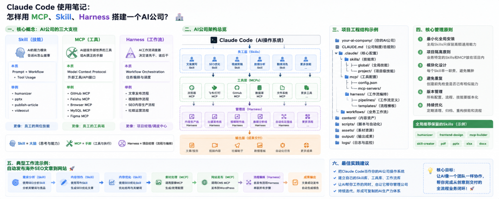

> 📎 来源: [斜杠小丸子](https://mp.weixin.qq.com/s?__biz=MzI2ODc0NjY5Nw==&mid=2247488346&idx=1&sn=7b723c6d42e9e285b7c05b84b5970df4&chksm=eb48a2c0d372bbcec736524cd6f8969e15fed4b4dc6dd08db210521ffc45caf2383a977c861c&mpshare=1&scene=1&srcid=0528FdhnuA8aZi6kSHQvY2lj&sharer_shareinfo=9158bcc8a8b3eff8b1c5e9b3af203f23&sharer_shareinfo_first=9158bcc8a8b3eff8b1c5e9b3af203f23) | 时间: 2026-05-28 12:19

---

我折腾 Claude Code 几个月了。

最开始用 Claude Code 的时候，我的状态是这样的：想做什么，就去问一下 Claude。

哪里不满意，重新问。哪里还差一点，手动改。

感觉挺好用的。

直到有一天，我同时在跑三个项目：

- 鱼池过滤器的海外 TikTok 内容
- 锦鲤经销商的国内招商视频
- 自己的个人 IP 文章

然后 Claude 开始乱了。

我让它写开场白，它写了英文——因为上一个任务是海外项目。
我让它写招商逻辑，它用了欧美消费者的思维——完全不对。
我越来越频繁地在对话框里说"不对不对，重新来"。

那个时候我才意识到：不是 Claude 变笨了，是我的系统乱了。

而且，我根本还没建立过什么"系统"。



## 我想清楚的第一件事：Claude Code 不是聊天框

我之前一直把它当一个"更聪明的搜索引擎"在用。后来我想明白了——它其实是一套 **AI 操作系统**。

就像 macOS 是台面上的操作系统，Claude Code 是我的 AI 员工们跑在上面的那套系统。

里面的每个组件，我现在是这样理解的：

| 组件 | 我的理解 | 核心职责 |
| --- | --- | --- |
| Skill | 员工技能手册 | 告诉 AI 怎么做某件具体的事 |
| MCP | 外部工具连接器 | 给 AI 真正能操作外部世界的能力 |
| Harness | 项目经理 | 决定谁干什么、按什么顺序干 |
| Agent | 员工 | 实际执行任务的角色 |
| CLAUDE.md | 公司制度文件 | 约束整个系统的行为准则 |
| Project | 业务部门 | 隔离不同业务的上下文 |

这套类比帮我想清楚了很多事：我不是在"装插件"、不是在"加功能"——

**我在搭一家 AI 公司。**

公司大了，就需要制度。需要分部门。需要流程。

这个认知的转变，直接改变了我后来所有的工程决策。

## 一、Skill：我给 AI 员工写的岗位手册

最开始装 Skill 的时候，我以为它就是"一段更长的系统提示词"。

后来我打开一个成熟的 Skill 看了看，发现不是这回事。

一个好的 Skill，里面其实包含三层东西：

> **Prompt（知识和规范）+ Workflow（执行步骤）+ Tool Usage（工具调用逻辑）**

以我自己在用的 publish-article 为例，它内部实际在干的事情是：

**第一层：知识层**

```
- 知道什么是好的文章结构- 知道 SEO 标题的写法规范- 知道公众号和独立站的排版差异- 知道图片 alt text 怎么写才对 SEO 友好
```

**第二层：流程层**

```
Step 1：检查文章结构是否完整Step 2：优化标题，生成 3 个备选方案Step 3：生成 SEO meta descriptionStep 4：格式化 Markdown，匹配目标平台规范Step 5：调用发布脚本上传文章Step 6：返回发布结果和链接
```

**第三层：工具调用层**

```
- 读取草稿文件- 调用发布脚本- 处理配图压缩和上传
```

我给它一篇草稿，它还我一篇已经发布在线上的文章。

这才是 Skill 真正的能量。不是换个角色扮演，是真的帮我干完了一件事。

### Skill 最让我惊喜的一点：它会积累

我调教好一个 videocut Skill 之后，下次做视频，它记得我所有的偏好——镜头节奏、字幕风格、封面逻辑。

我不需要每次都重新解释一遍"我是谁、我在做什么项目、我的风格是什么"。

**Skill 让 AI 越用越懂我，而不是每次都像刚认识。**

这个感觉，用过的人才知道有多爽。

## 二、MCP：我给 AI 员工配的真实工具

### 没有 MCP 之前，AI 只能在嘴上帮我

这是我踩过的一个认知坑。

有很长一段时间，我以为 AI 帮我"做了"某件事，其实它只是告诉了我"应该怎么做"。

真正让 AI 从"顾问"变成"执行者"的，是 MCP。

MCP 全称 Model Context Protocol，本质是：**让 AI 真正能连接并操作外部世界的协议。**

| MCP 类型 | 具体能做什么 | 我用在哪里 |
| --- | --- | --- |
| GitHub MCP | 读写代码仓库、提交 PR | 自动化发布流程 |
| 飞书 MCP | 读写文档、操作表格 | 从素材库拉取内容 |
| Browser MCP | 控制真实浏览器、模拟操作 | 自动登录后台发文章 |
| Figma MCP | 读取设计稿数据 | 设计稿转代码 |
| Filesystem MCP | 读写本地任意文件 | 处理素材和输出文件 |
| WordPress MCP | 发布文章、管理媒体库 | 内容自动发布 |
| YouTube MCP | 上传视频、管理字幕 | 视频发布自动化 |

### Skill 和 MCP 的区别：Skill 是大脑，MCP 是手脚。

只有 Skill，AI 是个纸上谈兵的顾问——知道很多，但什么都帮不到你。
只有 MCP，AI 是个没头脑的执行机器——能动，但不知道该干什么。
两者加在一起，AI 才是真正能独立完成任务的员工。

## 三、我怎么用 Skill + MCP 做内容发布

光说概念还是有点虚，我说一个我自己在跑的流程。

**场景：把一篇草稿发布成公众号文章。**

**这件事里，哪些是 Skill 的活，哪些是 MCP 的活**

**知识型工作 → Skill 来做：**

```
✅ 判断文章结构是否完整（有没有开头钩子、中间共鸣、结尾行动）✅ 优化标题，给我 3 个备选✅ 知道哪些词容易被微信限流，主动规避✅ 按公众号规范格式化排版
```

**执行型工作 → MCP 来做：**

```
✅ 去飞书里读取我的图片素材（飞书 MCP）✅ 压缩图片到合规尺寸（Filesystem MCP）✅ 打开浏览器，登录公众号后台（Browser MCP）✅ 上传配图，填写文章信息，保存草稿（Browser MCP）✅ 把发布结果记录到飞书数据表（飞书 MCP）
```

### 实际运行的完整链路

当我输入「把这篇文章发布到公众号」：

```
① Skill 读取文章，分析结构② Skill 生成优化标题（3 个备选）③ Skill 输出 SEO meta 描述④ MCP（飞书）读取配图素材⑤ MCP（Filesystem）压缩图片⑥ Skill 格式化排版，生成公众号 HTML⑦ MCP（Browser）打开浏览器，登录后台⑧ MCP（Browser）上传配图，填写信息⑨ MCP（Browser）保存草稿，截图确认⑩ MCP（飞书）记录本次发布数据
```

**我只说了一句话。**

这个流程跑完大概 3-5 分钟。以前我手动做，要 40 分钟。

## 四、Harness：现在还有点懵懂的部分

装好了 Skill，配好了 MCP，我以为已经很完整了。

但我发现还有一个问题：

**谁来决定这些东西按什么顺序跑？**
**某个步骤失败了，是重试还是走别的路？**
**多件事能不能同时做，不用等前面的跑完？**

这就是 Harness 存在的原因。

**Harness = AI 工作流调度器。**

我把它理解成项目经理。它不亲自干活，但它掌控全局——谁干什么、什么顺序、出了问题怎么处理。

### 我的视频制作 Harness 长什么样

当我说「做一条鱼池过滤器的视频号短视频」，Harness 会这样调度：

```
Step 1 → script-writing-skill（写 30 秒口播文案）Step 2 → 判断：文案字数和情绪是否符合规范         ↳ 不符合 → 重新生成，最多重试 3 次Step 3 → shot-breakdown-skill（拆 5 个镜头，匹配素材标签）Step 4 → filesystem-mcp（从素材库读取匹配镜头）Step 5 → tts-mcp（合成配音）Step 6 → remotion-mcp（渲染合成视频）Step 7 → browser-mcp（上传到视频号后台）Step 8 → 记录本次制作数据到飞书
```

我说了一句话，8 步流水线自动跑完。

### Harness 里让我最惊喜的四个能力

**条件判断**——文案不达标，不是报错停下来，而是自动重试，重试三次还不行才来问我。

**上下文传递**——Step 1 写的文案，会自动作为 Step 3 的输入依据。我不需要手动复制粘贴，不需要反复解释背景。

**并行调度**——配音生成和素材筛选可以同时跑。原来要 20 分钟的流程，压到 5 分钟。

**错误恢复**——某个 MCP 调用超时，Harness 自动重试，而不是整个流程崩掉。

## 五、CLAUDE.md：我之前都不知道的文件

我最开始装了一堆 Skill、配了好几个 MCP，但 CLAUDE.md 都没写过。

最多就几行话，类似"你是一个内容创作助手"。

后来我意识到这是个很大的漏洞。

**CLAUDE.md 是整个 AI 系统的宪法。**

Skill 和 MCP 是"能力"，CLAUDE.md 是"边界"。

没有边界的能力，AI 会按照自己对"好"的理解去做——但那个"好"，不一定是我要的。

### 我现在的 CLAUDE.md 里写了什么

一个好用的 CLAUDE.md，我觉得要包含四块：

**项目背景（我是谁，在做什么）**

```
这个项目是「顺佳兴鱼池过滤器海外内容系统」。目标受众是欧美地区的锦鲤爱好者，25-55岁，有一定消费能力。品牌调性：专业、可信赖、有温度，不要过度营销。
```

**行为规范（怎么做）**

```
- 所有对外内容必须用英文，不得出现中文- 价格信息不得写死，用"contact us for pricing"- 产品描述必须有数据支撑，不用空洞形容词
```

**文件结构（东西放在哪）**

```
- 产品资料在 /content/products/- 已发布文章在 /output/published/- 图片素材在 /assets/images/
```

**禁止事项（不能做什么）**

```
- 不得直接发布，必须先存草稿等待我确认- 不得使用未确认版权的图片
```

**一个没有 CLAUDE.md 的 AI 系统，就像一家没有任何制度文件的公司。**

大家都在凭感觉做事，最后的结果很难一致。

## 六、我真实踩过的三个坑

我在讲这些"应该怎么做"之前，想先说说我是怎么被坑到的。

### 坑一：上下文污染

我同时在做两个项目：

- 鱼池过滤器 TikTok（英文，卖给欧美买家）
- 锦鲤经销商招商（中文，卖给国内老板）

两个项目放在同一个环境里跑，共用同一套 Skill 和 CLAUDE.md。

然后 AI 就乱了：

> 我说「写一段开场白」→ AI 直接写了英文，因为刚刚做完英文项目。
> 我说「设计一个价格锚点」→ AI 用了欧美消费者的心理逻辑，完全不适合国内经销商。

这不是 AI 的问题，这是**上下文污染**。两个项目的信息混在一起，AI 不知道该用哪套逻辑。

### 坑二：Skill 冲突

我的全局 Skill 里有 humanizer（去 AI 腔），里面写了：

```
避免使用"显著"、"卓越"、"深刻"等词汇避免被动语态
```

但我的经销商招商文案，恰恰需要正式的书面感和权威感。

两个 Skill 互相打架，AI 输出了一个四不像——既不像有人味的内容，也没有专业感。

我反复让它改，越改越奇怪。

### 坑三：越用越乱

这是最隐蔽的一个坑。

我的 AI 刚开始用的时候表现很好。但项目越来越多，我往全局塞了越来越多的 Skill，往 CLAUDE.md 里加了越来越多的规则。

AI 要同时遵守 20 多条可能互相矛盾的规则，要在十几个 Skill 里判断该用哪个，要在好几个项目的背景里找到正确的那个……

结果就是：**AI 越来越混乱，响应越来越偏，我越来越抓狂。**

最重要的是，耗Token，那可是我的钱啊！

## 七、我现在用的工程结构

踩过那些坑之后，我把每个项目都重新整理了一遍。

现在每个项目，我都会这样组织：

```
鱼池过滤器-海外项目/│├── CLAUDE.md                  ← 这个项目的"宪法"│├── .claude/│   ├── skills/│   │   ├── geo-blog/          ← GEO 优化博文写作│   │   ├── youtube-script/    ← YouTube 脚本格式│   │   └── dealer-content/    ← 经销商内容逻辑│   ││   ├── mcp/│   │   ├── wordpress.json     ← 连接 WordPress│   │   ├── youtube.json       ← 连接 YouTube│   │   └── browser.json       ← 浏览器自动化│   ││   ├── harness/│   │   ├── blog-pipeline.md   ← 博客发布完整流程│   │   └── video-pipeline.md  ← 视频制作完整流程│   ││   └── workflows/│       ├── weekly-content.md  ← 每周内容排期流程│       └── seo-audit.md       ← SEO 定期审计流程│├── content/├── scripts/├── assets/└── output/
```

**每个项目都是一家独立运营的"分公司"，有自己的制度、自己的员工技能、自己的工具连接。**

不同项目之间，互不干扰。

### 每个目录的意义

\*\*CLAUDE.md\*\*——AI 进入这个项目，第一件事读这个文件，明白自己在哪里、要守什么规则。

\*\*.claude/skills/\*\*——只有这个项目用得到的技能。geo-blog 是鱼池项目专属的，不应该跑进我的个人 IP 项目里去。

\*\*.claude/mcp/\*\*——每个项目连接的外部工具可能不同。鱼池项目需要 WordPress，个人 IP 项目需要公众号。分开配置，各管各的。

\*\*.claude/harness/\*\*——把"做一篇博文的完整流程"写清楚，Harness 按照这个文件来调度。以后我自己回来看，或者让别人接手，也能一眼看懂。

\*\*.claude/workflows/\*\*——每周内容排期、每月 SEO 审计，这些周期性的固定任务，流程写在这里。

## 八、全局 vs 项目：我的判断方法

每次装新 Skill，我都要想一个问题：**这个放全局还是放项目？**

我现在的判断逻辑很简单：

**放全局的，是跟具体业务无关的通用能力：**

```
humanizer        → 任何内容都可能需要去 AI 腔frontend-design  → 任何有前端页面的项目都可能用pdf / pptx / xlsx → 通用文档处理，哪个项目都可能用到
```

**放项目的，是跟这个业务强绑定的专属知识：**

```
鱼池过滤器项目：  geo-blog（锦鲤养殖主题的 GEO 写作规范）  dealer-content（国内经销商的招商逻辑）个人 IP 项目：  ip-video-script（我自己的视频风格和节奏）  wechat-formatter（公众号专属排版规范）
```

判断的时候，我会问自己这几个问题：

| 问题 | 是 | 否 |
| --- | --- | --- |
| 这个能力所有项目都可能用到吗？ | 放全局 | 放项目 |
| 这个能力包含特定品牌/受众/规范？ | 放项目 | 可考虑全局 |
| 放全局的话，会不会影响其他项目的风格？ | 放项目 | 可考虑全局 |
| 这是通用技能还是业务知识？ | 放全局 | 放项目 |

**我自己最常犯的错误：把业务 Skill 塞到全局。**

只要做到"业务 Skill 永远放项目"，80% 的混乱问题就解决了。

## 九、我现在理解的四个阶段

回头看我自己这几个月的路，大概经历了这样四个阶段。

### 第一阶段：纯小白

我那时候的状态：

- 把 AI 当搜索引擎，想到什么问什么
- 每次都从零开始，AI 对我的项目毫无记忆
- AI 输出好不好，完全取决于我那次问得好不好

**这个阶段的瓶颈：我的时间。**每件事都要我亲自问、亲自改、亲自确认。

### 第二阶段：Prompt重度爱好者

开始研究怎么写系统提示词。知道怎么给 AI 设定角色，知道怎么问才能得到更好的答案。积累了一些自己的提示词模板。

**这个阶段的瓶颈：Prompt 能承载的信息太有限了。**稍微复杂一点的任务，AI 很快就忘记了前面定下来的规范。

### 第三阶段：AI 工具大师

开始用 Skill，开始配 MCP，开始搭一些基础的自动化流程。

**这个阶段生产力会有一个明显的提升。**但如果不做工程隔离，项目一多，系统就会开始乱。我在这个阶段踩了前面说的那些坑。

### 第四阶段：AI 系统使用者

每个项目独立隔离。有 Harness 调度复杂流程。知道什么能力放全局、什么属于项目。

AI 系统会越用越顺手，而不是越来越乱。

**拥有的不是一个工具，而是一套自动化生产系统。**

我现在算是在第三到第四阶段之间——有些项目做到了完整隔离，有些还在整理。

这条路没有终点，但每往前走一步，都能感受到明显的差别。

## 写在最后

如果你现在也在折腾 Claude Code，我的建议是——

**第一步（今天就能做）：** 检查你的全局 Skill，把那些跟具体业务绑定的，挪到对应的项目目录下。

**第二步（这周做）：** 给你最重要的项目认真写一个 CLAUDE.md。不需要很长，但要包含：项目背景、目标受众、行为规范、禁止事项。

**第三步（这个月做）：** 选一个你最频繁重复的任务，把它的完整步骤写成 Harness 配置。

**第四步（持续做）：** 每开一个新项目，都用独立的目录结构从头搭起来。不要图省事往全局塞。

> **CLAUDE.md + Skill + MCP + Harness + Workflow + 项目隔离 + Context 管理**
> 七块拼在一起，才是完整的 AI 工程系统。

> 缺任何一块，跑的是工具。
> 七块都到位，跑的是系统。

工具会让你快一点。系统会让你快十倍。

-END
