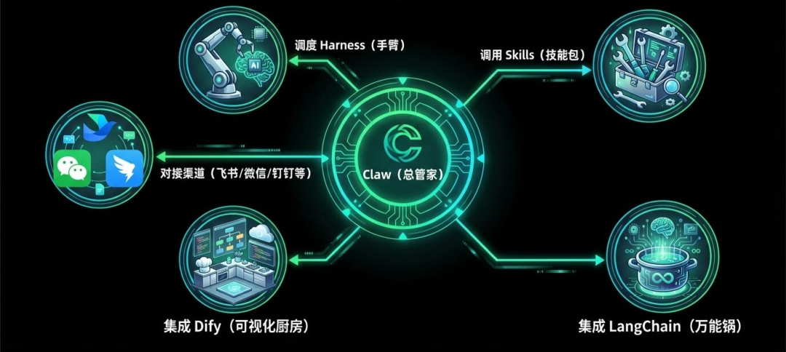

> 📎 来源: [橘子AI小栈](https://mp.weixin.qq.com/s?__biz=MzYzOTc2ODA4Mg==&mid=2247483918&idx=1&sn=3feb5f812fdb816fcd9889bb3bc59860&chksm=f13f2b82272b6da49396d304eaba8aac90faa018cb4c29507e137bdb153fcb545d3667232dda&mpshare=1&scene=1&srcid=0425laoy4gUolm8eHQwAJN5q&sharer_shareinfo=68856789b207d5c247b1b8777a1ddfd5&sharer_shareinfo_first=68856789b207d5c247b1b8777a1ddfd5) | 时间: 2026-04-25 18:07

---

最近这两年随着AI的发展，不断的有新的技术名词冒出，26年初Harness一词又在圈内爆火，今天一篇文章讲清楚它们之间的关系

LangChain 是一个开源 Python/JS 框架，核心作用是把 N 个 LLM（大语言模型） 调用、工具、记忆、提示词串成一条"链"，让 AI 完成复杂多步骤任务。现已全面转向构建智能体应用。

主要面向开发者，门槛较高，需要写代码。

Dify（dify.ai）是一个开源 LLM 应用开发平台，核心理念是让非技术人员也能可视化构建 AI 应用。通过拖、拉、拽的方式快速搭建和部署智能体应用

面向开发者或非开发者

Harness就是大语言模型的“行车系统”，用于把 LLM 的 “智能” 转化为可靠、可落地、可生产的能力。

大模型目前的能力极强，但是还有几个致命缺点。

1、一个完整的项目往往做了3、4个功能就宣布 “项目完成”

2、代码写完了但环境有bug，模型自己不知道

3、功能清单上标注 “已完成”，但实际功能是坏的

4、每次新的运行都要重新问 “代码在哪个文件夹”

而Harness这套系统完美解决了这些问题。

2026年3月，LangChain团队做了一个实验，他们把同一个模型（GPT-5.2-Codex）放在两套不同的Harness架构里运行。

结果是：仅仅优化了Harness，在编程权威榜单上的得分从52.8%飙升至66.5%，排名直接从30名开外冲进前5名

这意味着，汽车的“发动机”没变，换了一套“行车系统”，性能就翻倍了，这对于造车（AI应用层）的厂商来说无疑是重磅喜讯。从此“Harness Engineering”正式被确立为AI应用层的核心课题

面向开发者，让开发者少写代码

Skills 是 AI Agent 能力的模块化延伸，可以理解为AI 的 App Store——每个 Skill 是独立功能模块，可被独立安装、更新、替换

如果说Harness解决的是“能不能可靠的做完的问题”，那Skills解决的就是“会不会做”的问题。被调用时按需激活，执行完毕后休眠

对于不熟悉底层开发的普通用户来说，他感知到的就是 “我调用了财报分析”这个Skill，AI就把活儿干完了。这也正是Skills火起来的原因，它把复杂的Harness工程细节对用户隐藏了，提供了一种更简单、更直观的交互方式

Claw的设计初衷是控制个人电脑，读写文件、整理邮箱，让其7x24小时工作，用来提升个人工作效率的工具。其本身其实就是Harness工程在个人场景的落地产品

面向C端用户、个人

所以

普通用户，想用 AI 提升效率，直接上手市面上的各种Claw

业务人员，搭建 AI 应用不写代码，用 Dify或扣子，可视化落地快

开发者，深度定制 AI 工作流，用 LangChain

给 AI 装新能力，找对应 Skills 安装

让 AI 可靠持续的运行，关注 Harness 体系

工具在变，核心逻辑没变。

理解它们的关系，你就能理解 AI 应用开发的现在，也就能看清它的下一步。
