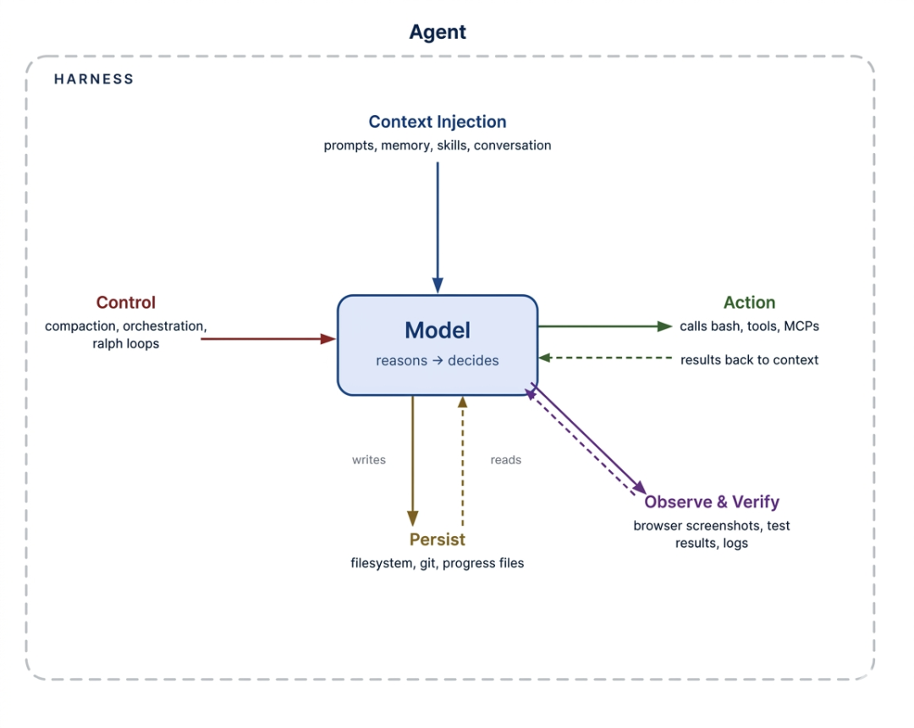
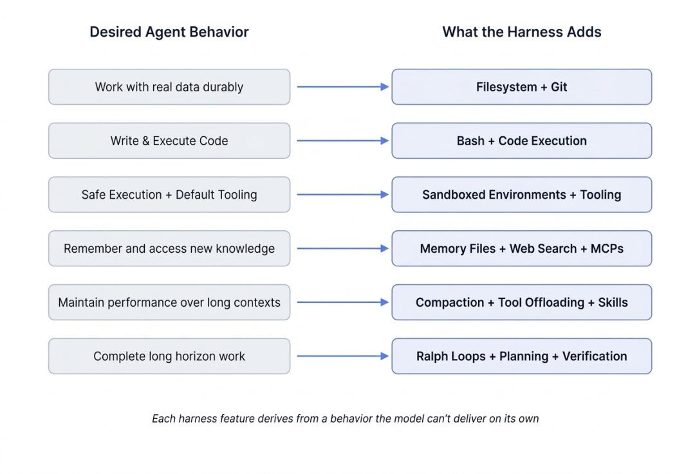
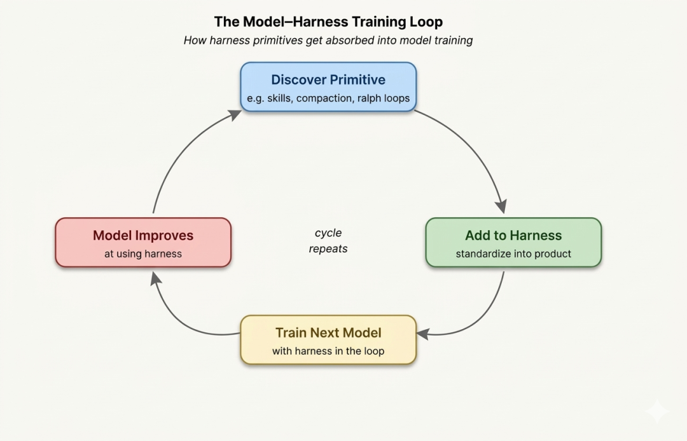

> 📎 来源: [技术极简主义](https://mp.weixin.qq.com/s?__biz=MjM5NzA1NzMyOQ==&mid=2247486854&idx=1&sn=2c5abf99e3cff4a8cb4169e01967ef2a&chksm=a736007f223b13248674797571b82e2d57463d0af7e5bf40eba460a9c16f608fa99428a2fd52&mpshare=1&scene=1&srcid=0422L0hMSG6GwkHPum2PTaX1&sharer_shareinfo=58693e3655f2580657a4b17355d5d935&sharer_shareinfo_first=58693e3655f2580657a4b17355d5d935) | 时间: 2026-04-22 17:35

---

最近常常听到一个声音，Prompt 工程过时了，Context 工程过时了，现在只要学好 Harness 工程就够了。短短一个月，**Harness Engineering** 从一篇博客文章变成了开发者社区的高频词。

在 AI 智能体编程领域，决定结果好坏的最大变量，往往不是模型有多聪明，而是模型之外那一整套状态、工具、环境、反馈回路与约束系统。如果 AI 将成为软件开发流程中的长期参与者，那么软件工程系统本身也需要进化。

LangChain 作者 **Vivek Trivedy** 这篇《The Anatomy of an Agent Harness[1]》试图回答一个越来越关键，但行业内经常被说得很模糊的词：**Harness**。

## 什么是 Harness？

**Agent = Model + Harness**

**如果你不是模型，那就是 Harness。**

这句话听起来有点绝对，但确实抓住了关键。Harness 本质上就是模型之外的一切：代码、配置，以及各种执行逻辑。模型本身只是能力的来源，只有通过 Harness 把状态、工具调用、反馈循环和约束机制串起来，它才真正变成一个 Agent。

具体来看，Harness 一般包括这些部分：

- **系统提示词**：定义模型的角色和目标
- **工具、技能、MCP**：模型可以调用的外部能力
- **基础设施**：文件系统、沙箱、浏览器等运行环境
- **编排逻辑**：子 Agent、任务拆分、模型路由等
- **钩子/中间件**：压缩、续写、代码检查等确定性流程

**为什么要用「模型 vs Harness」来划分系统？**

因为这是一个更清晰的边界。很多关于 Agent 的定义都容易变得模糊，但用这个方式去看问题，会逼你回答一件事：**模型负责什么？剩下的系统要补什么？**

接下来，我们就从这个定义出发，拆解 Harness 的核心组件，并从「模型能做什么」反推「为什么需要这些设计」。



## 为什么需要 Harness？

**原因很简单：有些事我们希望 Agent 能做，但模型本身做不到。**

听起来像句废话，但关键就在这里——先搞清楚模型的边界。大多数模型的输入是文本、图像、音频，输出是文本。仅此而已。也就是说，模型本质上只是一个**输入 → 输出的函数。**

它本身并不会：

- 在多轮交互中**记住状态**
- **执行代码**
- 获取**实时信息**
- 操作环境（比如装依赖、跑程序）

这些能力，都不在模型里，而是在外面补的。也就是——**Harness**。

举个最常见的例子：聊天。「聊天」看起来很自然，但模型其实并不会聊天。

要实现这个体验，你至少需要做几件事：

- 维护一段对话历史
- 每次请求时把历史拼进上下文
- 不断循环接收用户输入和模型输出

本质上就是一个简单的循环，把模型包起来用。所以关键点其实只有一句话：**你希望 Agent 表现出的能力，最终都要落在 Harness 上实现。**

这也是 Harness Engineering 的核心思路：不是去「调教模型能不能做到」，而是换个方向——**先想清楚你要它做到什么，再把这些能力一个个补到 Harness 里。**



## 文件系统：持久化存储和上下文管理

**我们希望 Agent 能做的，其实很直接：能用真实数据，能把放不下的内容挪出去，还能把工作保存下来。**

模型只能处理当前上下文窗口里的内容。没有文件系统的时候，用户只能不断复制粘贴，把信息喂给模型——这对人来说都麻烦，更别说让 Agent 自主工作了。

现实世界里，我们就是靠文件系统来组织一切工作的。模型在大量数据中也早就「学会了」这一点。所以一个很自然的结论是：**Harness 需要提供文件系统抽象，以及对应的读写操作（fs-ops）。**

有了文件系统，很多能力才真正出现：

- Agent 有了自己的工作空间，可以读写数据、代码和文档
- 信息可以按需加载，而不是一股脑塞进上下文
- 中间结果可以落盘，状态可以跨会话保留
- **文件本身就是协作接口**：人和多个 Agent 可以围绕同一份内容协同工作

再往前一步，加上版本控制（比如 Git），事情就更完整了：

- 可以记录每一步改动
- 出问题可以回滚
- 可以开分支做不同尝试

从这个角度看，文件系统其实不是一个「附加能力」，而是最基础的 Harness 原语之一。后面很多能力（状态管理、协作、任务拆分）都会依赖它。

## Bash + 代码执行：通用问题解决工具

**我们真正想要的，是让 Agent 能自己把问题解决掉，而不是每一步都提前帮它设计好工具。**

但现实是，大多数 Agent 还是在用一套固定模式：

- 想一步（推理）
- 调一个工具（行动）
- 看结果（观察）
- 再继续循环

问题在于：**它只能用你提前给好的那些工具。**这就带来一个很实际的限制——你不可能提前穷举所有工具。所以更直接的做法是：**别给一堆工具，直接给它一台「能干活的机器」。**也就是：**在 Harness 里提供 Bash + 代码执行能力。**

一旦有了这个能力，事情就变了：

- 模型可以自己写脚本解决问题
- 可以临时「造工具」，而不是依赖预定义接口
- 可以组合已有能力，拼出新的工作流

本质上，你不再是在「设计工具列表」，而是在提供一个**通用执行环境。**当然，Harness 里仍然可以有各种现成工具，但在很多场景下，代码执行会成为**默认策略。**

## 沙箱环境和工具：安全执行与工作验证

**给了 Agent「能存」和「能执行」，还不够——它还需要一个能放心干活的地方。**

代码总得在某个环境里运行。但如果直接在本地执行模型生成的代码，风险很高；同时，本地环境也很难支撑多任务、并发的 Agent 工作。

更合理的做法是：**把执行放进沙箱里。**

沙箱解决了两个核心问题：

### 1. 安全性

- 隔离执行环境，避免影响本地系统
- 可以限制命令、禁用网络、控制权限
- 即使出错，也被限制在沙箱内部

### 2. 可扩展性

- 可以按需创建环境
- 多个任务并行执行
- 用完就销毁，不留下状态污染

但光有「环境」还不够，还要让它开箱就能用。这就是 Harness 要做的另一件事：**准备一套合理的默认工具。**比如：

- 语言运行时和常用依赖
- Git、测试工具等 CLI
- 浏览器（用于页面交互和验证）

这些工具的价值，不只是「能用」，而是让 Agent 能**观察自己的工作结果**：

- 看日志
- 跑测试
- 截图页面
- 检查输出

一旦有了这些能力，就能形成一个很关键的闭环：**写代码 → 运行 → 观察 → 修复 → 再运行**，也就是一个简单但有效的**自我验证循环。**

所以这里的重点不是「提供一个运行环境」，而是：**决定 Agent 在什么环境里工作、能用什么工具、能看到什么结果，以及如何判断自己做对了没有。**这些，全部都是 Harness 的职责。

## 记忆与搜索：持续学习能力

**我们希望 Agent 不只是「当下聪明」，还要能记住东西、查到新信息。**

但模型本身做不到。它的知识只来自两部分：

- 训练时学到的内容（权重）
- 当前上下文里提供的信息

除此之外，没有「记忆」。也不能主动更新知识。所以问题就变成一句话：**怎么把「新知识」放进模型？**答案其实只有一个：**通过上下文注入。**在这件事上，文件系统再次变成基础设施。

一种常见做法是让 Harness 维护一些「记忆文件」（比如 

```
AGENTS.md
```

）：

- Agent 在运行过程中可以往里面写信息
- 下次启动时，这些内容会被重新加载进上下文
- 文件更新了，上下文也随之更新

这其实就是一种很朴素的「学习方式」：**写下来 → 保存 → 下次继续用**，虽然没有改模型权重，但已经能做到跨会话积累经验。

但还有一个问题：**模型不知道「现在发生了什么」。**比如：

- 新发布的库版本
- 最新的 API 变化
- 实时数据

这些都不在训练数据里。

这时候就需要另一类能力：**搜索和外部知识获取。**比如：

- Web Search
- 像 Context7 这样的上下文查询工具（MCP）

它们的作用很直接：**把模型「看不到」的信息，拉进上下文。**

## 对抗上下文衰减：智能压缩策略

**我们不希望 Agent 越用越「笨」。**

但现实是，一旦上下文越来越长，模型的表现往往会变差。

这就是所谓的 Context Rot（上下文衰减）：

- 信息变多，但有效信息比例下降
- 关键线索被淹没
- 推理能力开始不稳定

本质原因很简单：**上下文是有限资源，而且很容易被浪费。**所以问题变成：**怎么让 Agent 在长时间工作中，始终用「干净」的上下文？**这正是 Harness 要解决的事情。可以把今天很多 Harness 理解成一件事：**把「上下文管理」这件事工程化。**

最核心的手段是：

### 1. 压缩（Compaction）

当上下文快满时，不能只是「继续堆」，必须处理已有内容。常见做法是：

- 对已有对话做总结
- 保留关键信息
- 把细节移出上下文

这样，Agent 可以在不丢失关键信息的情况下继续工作。

### 2. 工具调用卸载（Tool Output Offloading）

工具输出往往是最大的问题来源：

- 日志很长
- 返回结果很杂
- 但真正有用的信息很少

一种更合理的策略是：

- 只保留**开头 + 结尾**（关键信号）
- 完整内容写入文件系统
- 需要时再读取

本质就是一句话：**不要让「噪音」占据上下文。**

### 3. 技能（Skills）与延迟加载

还有一个常见问题：Agent 一启动，就把大量工具说明、MCP 描述全部塞进上下文。结果还没开始干活，上下文已经被污染了。

更好的方式是：**按需加载（渐进式披露）。**也就是：

- 先给最小必要信息
- 需要某个能力时，再把相关内容引入

可以把 Skills 理解为：**对工具和能力的「懒加载机制」。**

## 长期自主执行

**我们真正想要的，是让 Agent 能把一件复杂的事从头做到尾。**

但现实还差得很远。现在的模型常见问题是：

- 容易提前结束（还没做完就停了）
- 不擅长拆解复杂任务
- 一旦跨多个上下文窗口，工作就开始变得不连贯

所以问题不在「它会不会写代码」，而在：**它能不能把工作持续推进下去。**这正是 Harness 要解决的核心问题之一：**如何让工作跨时间、跨上下文持续进行。**这里其实不是一个能力，而是一组能力叠加出来的结果。

### 文件系统 + Git：把过程「记下来」

长任务一定会产生大量中间结果，不可能全靠上下文撑住。

所以必须把工作外部化：

- 文件系统记录当前状态
- Git 记录历史和变化
- 新的 Agent 可以快速接手已有进度

当多个 Agent 协作时，这套东西本质上就是一个**共享笔记本。**

### Ralph 循环：防止「做一半就停」

模型很容易在「看起来差不多了」的时候结束。

Ralph 循环的思路很直接：

- 拦截「我要结束」的信号
- 重新给它一个干净的上下文
- 让它继续朝目标推进

关键在于：**上下文可以重置，但状态不能丢。**这也是为什么文件系统是前提。

### 规划 + 自我验证：让过程不跑偏

能持续做，还不够，还要**做对**。这里有两个关键机制：

#### 1. 规划（Planning）

- 把目标拆成步骤
- 写进文件
- 持续更新

这样每一步都有「参照物」，不容易偏离方向。

#### 2. 自我验证（Self-Verification）

每做完一步，就检查：

- 跑测试
- 看日志
- 检查输出

如果失败：

- 把错误信息喂回模型
- 继续修

这就形成了一个稳定的闭环：**执行 → 检查 → 反馈 → 修正**

## Harness 与模型的共同进化

今天的 Agent 产品，比如 Claude Code 和 Codex，是模型和 Harness 同时演化的结果。

在训练过程中，模型不仅学习生成文本，还被训练去更好地使用 Harness 提供的工具和流程，比如：

- 文件系统操作
- Bash 执行
- 任务规划
- 与子 Agent 并行工作

这形成了一个**反馈循环**：

1. 1. Harness 提供原语和操作能力
2. 2. 模型学习如何使用这些原语
3. 3. 训练结果又反馈回下一代模型
4. 4. 模型在相同的 Harness 环境中表现越来越好

这种共同进化虽然让模型在特定 Harness 下更有能力，但也有副作用：

- 模型可能对特定工具或逻辑「过拟合」
- 换了不同的 Harness 环境，性能可能下降

一个例子来自 Codex-5.3 提示指南：用于编辑文件的 

```
apply_patch
```

 工具，如果模型在训练中只接触一种逻辑方式，切换补丁方法时可能出现问题。

这也说明：最适合你任务的 Harness **不一定是训练时使用的那个。**

例如，Terminal Bench 2.0 测试就显示了这一点：Claude Code 中的 Opus 4.6 得分远低于其他 Harness 中的 Opus 4.6。通过优化 Agent 运行环境（如文档结构、验证回路、追踪系统），LangChain 的编码 Agent 在同一基准下，排名从全球第 30 位升到第 5 位，得分从 52.8% 提升到 66.5%



## 结语

随着模型越来越强大，今天在 Harness 中承担的一些功能可能会被模型自身吸收。模型在规划、自我验证和长时程任务保持连贯性方面会更可靠，因此对上下文注入的依赖也会减少。

这似乎意味着 Harness 会变得不那么重要。但就像提示工程今天依然有价值一样，**Harness Engineering 很可能仍然对构建高效 Agent 起关键作用。**

原因很简单：

- Harness 不仅弥补模型的不足
- 它还是设计系统的方式，让模型能够更有效地完成任务
- 配置良好的环境、合适的工具、持久状态和验证循环，让任何模型都能发挥最大效率

可以把这个比作舞台与演员的关系：

- **Harness 是舞台和幕后控制系统**
- **Agent 是舞台上的演员**

无论演员多么出色，没有舞台和规则，他们也难以发挥全部能力。

#### 引用链接

`[1]` The Anatomy of an Agent Harness: *https://blog.langchain.com/the-anatomy-of-an-agent-harness*

 

**既然看到这里了，如果觉得有启发，随手点个赞、推荐、转发三连吧，你的支持是我持续分享干货的动力。**
