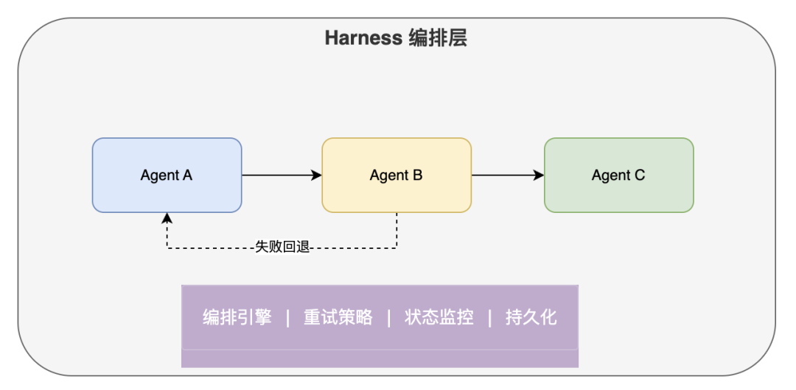
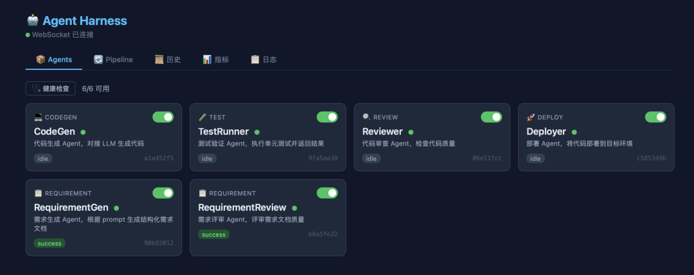
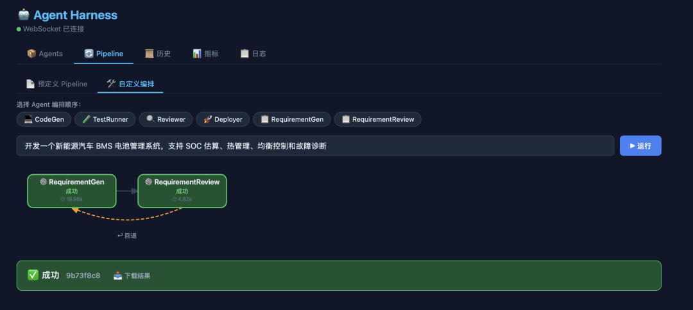

> 📎 来源: [AI学习的杨同学](https://mp.weixin.qq.com/s?__biz=MzE5ODExMjI3Mw==&mid=2247487831&idx=1&sn=f4d5b3d7f4f94f07d0b8b84a69ff6f50&chksm=9758614dcbbcc5080d69472787ecd9b08c6b1fe2b5f612d7a8fc60a685dff31dfec324606e3c&mpshare=1&scene=1&srcid=0420118c2l0dcKg7jgOA7mR0&sharer_shareinfo=bdcf08c3635123871d32c2518462ad80&sharer_shareinfo_first=bdcf08c3635123871d32c2518462ad80) | 时间: 2026-04-20 15:41

---

大家好，我是AI学习的杨同学。当你有多个 AI Agent 需要协同工作时，谁来决定它们的执行顺序？失败了怎么重试？怎么监控整个流程？这就是 Harness 要解决的问题。今天我们一起动手搭建一个Agent Harness，完成多智能体协同工作。


一、为什么需要 Harness

假设你在做一个 AI 驱动的软件开发流程：

```
需求生成 → 需求评审 → 评审不通过 → 回到需求生成 → 再评审 → 通过 → 继续
```

每个环节是一个独立的 Agent。问题来了：

• 谁来决定执行顺序？

• 评审不通过时，谁负责把错误信息传回给生成 Agent？

• 最多重试几次？超时了怎么办？

• 整个过程怎么记录和监控？

这些都不是 Agent 自己该操心的事。Agent 只管做好自己的活，编排的事交给 Harness。

Harness 的定位：多 Agent 的编排层，不关心 Agent 内部逻辑，只管把它们按流程串起来、处理失败、记录一切。

二、架构设计



核心模块：

|  |  |
| --- | --- |
| 模块 | 职责 |
| Agent 基类 | 统一接口，继承 run() 即可接入 |
| Pipeline | 定义执行流程（串行/并行/条件/回退） |
| Harness 引擎 | 驱动 Pipeline 执行，处理重试和回退 |
| Registry | Agent 注册中心，统一管理生命周期 |
| Monitor | 事件流，WebSocket 实时推送 |
| Store | SQLite 持久化，执行记录不丢失 |
| Scheduler | 任务队列，并发控制 |

三、5 分钟跑起来

环境准备

```
# 克隆项目git clone <项目地址>cd agent-harness # 一键启动./start.sh
```

浏览器打开 http://localhost:8080，你会看到 Dashboard：

• 📦 Agents Tab：查看所有注册的 Agent，健康状态一目了然

• 🔄 Pipeline Tab：选择预定义流程或自定义编排，点击运行

• 📜 历史 Tab：查看所有执行记录，点击可浏览 workspace 文件

• 📊 指标 Tab：成功率、平均耗时、告警信息

运行第一个 Pipeline

在 Pipeline Tab 选择 dev-test-deploy，点击「▶ 运行」，你会看到：

1. CodeGen 节点变蓝（执行中）→ 变绿（成功）

2. TestRunner 节点变蓝 → 变红（失败）→ 黄色弧线指回 CodeGen（回退）

3. CodeGen 再次变蓝（重新生成）→ 变绿

4. TestRunner 再次执行 → 变绿（通过）

5. Reviewer → Deployer 依次执行

整个闭环自动完成，不需要人工干预。

四、核心概念详解

4.1 Agent：最小执行单元

```
from agent_harness import Agent, AgentContext, AgentResultclass MyAgent(Agent):    asyncdef run(self, ctx: AgentContext) -> AgentResult:        # 从 workspace 读写文件        ws = ctx.ensure_workspace()                # 读取上游产物        code = (ws / "solution.py").read_text()                # 执行你的逻辑（调 LLM、跑测试、任何事）        result = await do_something(code)                # 写入产物        (ws / "output.txt").write_text(result)                # 上报结果        return AgentResult(success=True, data={"file": "output.txt"})
```

关键点：

• Agent 之间不直接传递数据，通过共享 workspace（文件系统）交换产物

• ctx.shared 传递元信息（prompt、错误信息），不传代码内容

• Agent 不需要知道其他 Agent 的存在

4.2 Pipeline：编排流程

- 用 YAML 定义，不需要写代码：

```
# pipelines/requirement-loop.yamlname: requirement-loopdescription: 需求生成→评审闭环default_prompt: 开发一个新能源汽车 BMS 电池管理系统steps:  - agent: RequirementGen  - agent: RequirementReview    on_fail_goto: RequirementGen   # 评审不通过，回退到生成    max_loops: 5                   # 最多循环 5 次
```

- 支持的编排能力：

```
# 串行- agent: A- agent: B# 并行- agent: [A, B]# 条件执行- agent: C  condition: prev_success# 失败回退- agent: D  on_fail_goto: A  max_loops: 3# 带重试- agent: E  retry:    strategy: exponential    max_retries: 3    base_delay: 1.0
```

4.3 三种 Agent 接入方式

方式一：Python 类（进程内）

```
# agents.yaml- name: CodeGen  module: agent_harness.agents.codegen  class: CodeGenAgent  category: codegen  config:    mock: true
```

方式二：HTTP 远程服务

```
- name: RequirementGen  type: remote  endpoint: http://localhost:9001/run  health_endpoint: http://localhost:9001/health  category: requirement
```

远程 Agent 只需实现两个接口：

```
POST /run请求：{"prompt": "...", "workspace": "/path/...", "last_error": "...", "loop_count": 0}响应：{"success": true, "data": {...}, "error": null} GET /health响应：{"status": "ok"}  (返回 200 即可)
```

任何语言都能接入，Python/Go/Java/Node 都行。

方式三：Shell 命令

```
- name: Linter  type: shell  command: "python3 -m pylint {workspace}/solution.py"  category: review
```

五、实战：新能源汽车需求闭环

这是一个真实场景的演示：需求生成 Agent 根据 prompt 生成需求文档，评审 Agent 按 ISO 26262、UN R155 等新能源汽车标准评审，不通过则自动回退修改。

启动远程 Agent

```
# 配置 LLM API Keycp remote_agents/.env.example remote_agents/.env# 编辑 .env 填入你的 API Key # 启动两个远程 Agent./remote_agents/start_agents.sh
```

启动 Harness

```
./start.sh
```

运行之后在agent标签页面可以看到当前注册的智能体，已经它们的健康状况。



在 Dashboard 的 Pipeline Tab 选择 requirement-loop，输入：

```
开发一个新能源汽车 BMS 电池管理系统，支持 SOC 估算、热管理、均衡控制和故障诊断
```



点击运行，观察：

1. RequirementGen 生成需求文档 v1

2. RequirementReview 按汽车标准评审 → 不通过（缺少 ISO 26262 功能安全定义、缺少 TARA 分析…）

3. 自动回退，RequirementGen 根据评审意见修改 → 生成 v2

4. RequirementReview 再次评审 → 通过（评分 82/100）

运行完成后点击「📥 下载结果」，得到：

• requirement.md — 最终的需求文档

• review\_report.md — 评审报告

六、生产化能力

框架内置了生产环境需要的能力：

|  |  |
| --- | --- |
| 能力 | 实现 |
| 超时控制 | 每个 Agent 独立超时，asyncio.wait\_for |
| 断点续跑 | 失败时自动保存 checkpoint，POST /api/resume/{id} 继续 |
| 并发安全 | 每次 pipeline 构建 deepcopy Agent 实例 |
| Workspace 隔离 | 每次运行独立目录，自动清理（TTL 24h，上限 50 个） |
| Git 集成 | workspace 自动 init，每步 commit，支持 diff 查看 |
| 配置热重载 | agents.yaml 改了 5 秒内自动生效，不用重启 |
| 优雅关闭 | SIGTERM 时等正在运行的任务完成再退出 |
| 认证 | HARNESS\_API\_TOKEN 环境变量，Bearer Token |
| 限流 | HARNESS\_RATE\_LIMIT 控制每分钟最大请求数 |
| Docker | docker-compose up 一行启动 |

七、项目结构

 

agent-harness/

├── agent\_harness/           # 核心框架

│   ├── agent.py             # Agent 基类、Context、Result

│   ├── harness.py           # 编排引擎

│   ├── pipeline.py          # Pipeline 定义

│   ├── registry.py          # Agent 注册中心

│   ├── monitor.py           # 事件监控

│   ├── store.py             # SQLite 持久化

│   ├── scheduler.py         # 任务队列

│   ├── metrics.py           # 指标和告警

│   ├── retry.py             # 重试策略

│   ├── config.py            # YAML 解析

│   ├── loader.py            # 插件式加载

│   ├── cleanup.py           # Workspace 清理

│   ├── git\_integration.py   # Git 集成

│   ├── notify.py            # Webhook 通知

│   └── agents/              # 内置 Agent

├── remote\_agents/           # 远程 Agent 示例

│   ├── requirement\_gen/     # 需求生成

│   └── requirement\_review/  # 需求评审

├── frontend/                # Vue Dashboard

├── pipelines/               # Pipeline YAML 配置

├── tests/                   # 37 个测试用例

├── server.py                # FastAPI 后端

├── agents.yaml              # Agent 注册配置

├── docker-compose.yml       # Docker 部署

├── start.sh                 # 一键启动

└── README.md                # 完整文档

 

 

八、总结

划重点

1. Harness 的本质是编排层

它不关心 Agent 内部怎么实现，只管三件事：谁先跑、失败了怎么办、记录一切。这个边界一定要清晰，否则框架会无限膨胀。

2. 失败回退循环是最核心的能力

不是简单的重试（同一个 Agent 再跑一遍），而是跨步回退（测试失败 → 回到代码生成 → 带上错误信息重新生成 → 再测试）。这才是多 Agent 闭环的关键。

3. Agent 之间通过 Workspace 交换产物，不直接传递数据

Agent A 把文件写到 workspace，Agent B 从 workspace 读。Harness 只传递元信息（prompt、错误信息）。这样 Agent 可以用任何语言实现，可以独立部署和扩缩容。

4. 开发优先级很重要

先做 P0（能跑起来）→ P1（生产可用）→ P2（规模化）→ P3（锦上添花）。不要一开始就做 OpenTelemetry 和多租户，先把编排引擎和错误恢复做扎实。

5. 并发安全是生产环境的第一个坑

Agent 实例必须 deepcopy，不能共享。并行执行时 context 必须隔离。SQLite 要用 WAL 模式。这些不做，demo 能跑，生产必挂。

适用场景

• AI 驱动的软件开发流程（需求→设计→编码→测试→部署）

• 多模型协作（不同 LLM 负责不同环节）

• 自动化测试闭环（生成→验证→修复→再验证）

• 文档生成和审核流程

• 任何需要多个 AI Agent 按流程协作的场景

不适用场景

• 单个 Agent 的内部逻辑编排（那是 Agent 自己的事，用 LangGraph 等工具）

• 实时对话场景（Harness 是批处理模式）

• 需要人工实时介入每一步的场景（目前没有暂停/恢复）

 

如果这篇文章对你有帮助，欢迎关注公众号。回复「agent harness」获取完整项目 GitHub 代码链接，开箱即用。


- End -

往期推荐


PREVIOUS RECOMMENDATIONS

[从入门到实战：一文吃透PyTorch核心技术](https://mp.weixin.qq.com/s?__biz=MzE5ODExMjI3Mw==&mid=2247486407&idx=1&sn=b9fca8c4f1790f77b53c0785197ea151&scene=21#wechat_redirect)

[AI实战篇：RAG评估从0到1落地，让你的检索增强生成系统能量化、能优化](https://mp.weixin.qq.com/s?__biz=MzE5ODExMjI3Mw==&mid=2247487536&idx=1&sn=9c8306a1552a43b85d2e59103a9e54d9&scene=21#wechat_redirect)

[「高质量数据集」制作SOP：从数据收集、清洗到迭代优化的完整指南](https://mp.weixin.qq.com/s?__biz=MzE5ODExMjI3Mw==&mid=2247486485&idx=1&sn=863b846189591cd416e5a96283f7d76b&scene=21#wechat_redirect)
