> 📎 来源: [树灰的AI笔记](https://mp.weixin.qq.com/s?__biz=MzAxOTUwMTY5Mw==&mid=2247484804&idx=1&sn=7a84d0ca33448299e59cbfd83050d8c5&chksm=9ae7da320fe2edc64d82062de1cbae21950fc447bec03bdca46a8d7d58f461bdc2e4d7398151&mpshare=1&scene=1&srcid=0425eTrHG8Z78VSfwKR8hgBV&sharer_shareinfo=a27c55e4366b82fd74056892f0e29949&sharer_shareinfo_first=a27c55e4366b82fd74056892f0e29949) | 时间: 2026-04-25 18:06

---

更直观、可视化的图解，帮助大家（尤其是非技术背景的同学）快速建立对 Harness & Hermes 核心机制的全局认知

# Harness 是什么？

> LangChain在 blog 这样描述：

## 🔶 Agent = Model + Harness

Harness：一个套在 AI Agent 外部的“运行环境+管控体系”，确保 Agent 在长链路任务中稳定、可靠、高效运行

Harness Engineering：驾驭工程，旨在从系统架构层面重新定义 Agent 的开发范式，而非在现有框架上修补

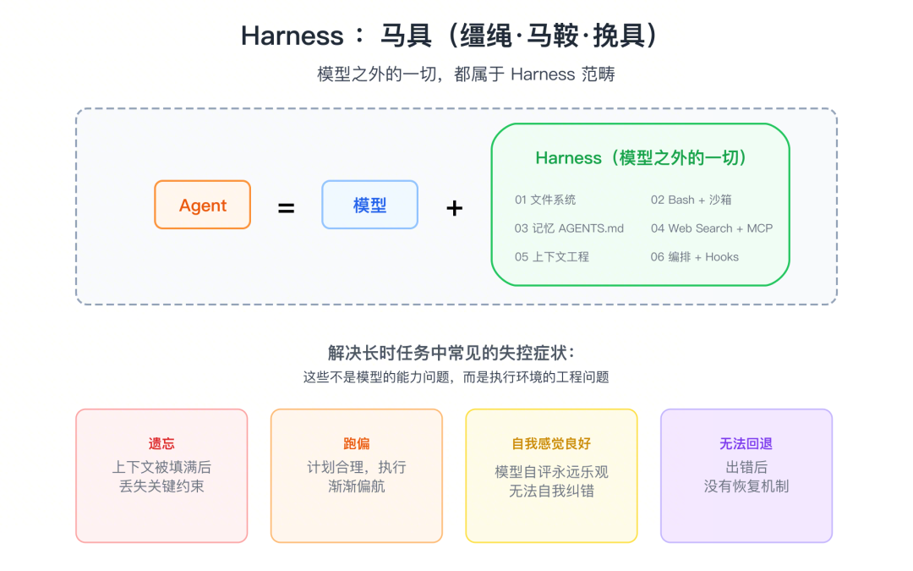

拿小龙虾🦞来举例，OpenClaw没有发布任何新模型，只给大模型搭建了一套完整的工作环境：文件系统、代码沙箱、工具链、反馈循环、自动验收。

同一个模型，在这套环境中，不再是一个只会对话的聊天机器人，而是一个能持续工作、自主解决问题的智能体。

变量只有一个：壳。而这层壳，现在有了一个正式的名字，Harness。大模型和harness，就像引擎和车架的关系，两者合起来才能风驰电掣。

## 🔶 AI 工程的演进变化

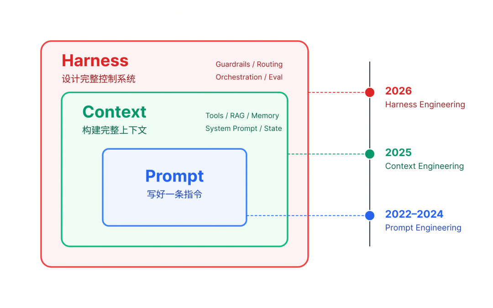

|  |  |  |  |
| --- | --- | --- | --- |
| **时期** | **范式** | **核心问题** | **关键技术** |
| 2023-2024 | Prompt Engineering | 怎么把任务说清楚？ | 角色设定、Few-Shot、格式约束 |
| 2025 | Context Engineering | 怎么把信息给对？ | RAG、记忆管理、Skills 渐进式披露 |
| 2026 | **Harness Engineering** | **怎么让执行稳得住？** | **架构约束、执行****编排****、故障恢复** |

演进路径：

Harness Engineering 是继 Prompt Engineering、Context Engineering 后的第三代AI工程实践。

三者为包含关系：

- Prompt：适用于简单场景

- Context：适用于需外部知识的场景

- Harness：适用于长链路、低容错的复杂场景

# Harness Engineering 的核心是什么？

## 🔶 四个关键实践洞察

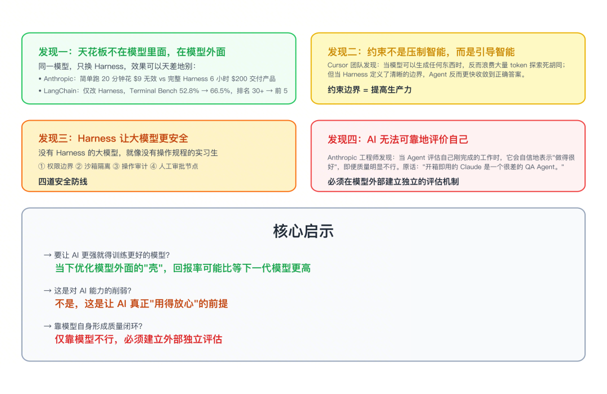

发现一：天花板不在模型里面，在模型外面仅更换 Harness，即可显著提升同一模型的效果。

| 来源 | 实验 | 结果 |
| --- | --- | --- |
| Anthropic | 同模型同 prompt，对比简单运行与完整 Harness | - **简单跑**：花费 $9，耗时 20 分钟，**核心功能无效**。 - **完整 Harness**：花费 $200，耗时 6 小时，**交付可用产品**。 |
| LangChain | 同模型仅改 Harness，在 Terminal Bench 2.0 测试 | - **成绩提升**：**52.8% → 66.5%** - **排名跃升**：从 30+ **直接进入前 5**。 |

发现二：约束不是压制智能，而是引导智能

实践：Cursor 团队实验发现，为 Agent 定义清晰的边界（约束），能使其更快收敛到正确答案。

公式：约束解空间 = 提高生产力

发现三：Harness 让大模型更安全

Harness 通过四道防线，保障 AI 在企业生产环境中的安全可控：

- 权限边界：明确可访问的系统范围。

- 沙箱隔离：分离执行环境与生产环境。

- 操作审计：确保所有动作可追溯。

- 人工审批节点：为高风险操作设置二次确认。

发现四：AI 无法可靠地评价自己

现象：Anthropic 发现 Agent 自我评估时倾向于给出正面反馈，即使产出质量不佳。

结论：必须在模型外部建立独立的评估机制，形成质量闭环。这是 L5“评估与观测”层的核心价值。

## 🔶 成熟 Harness 的六层架构

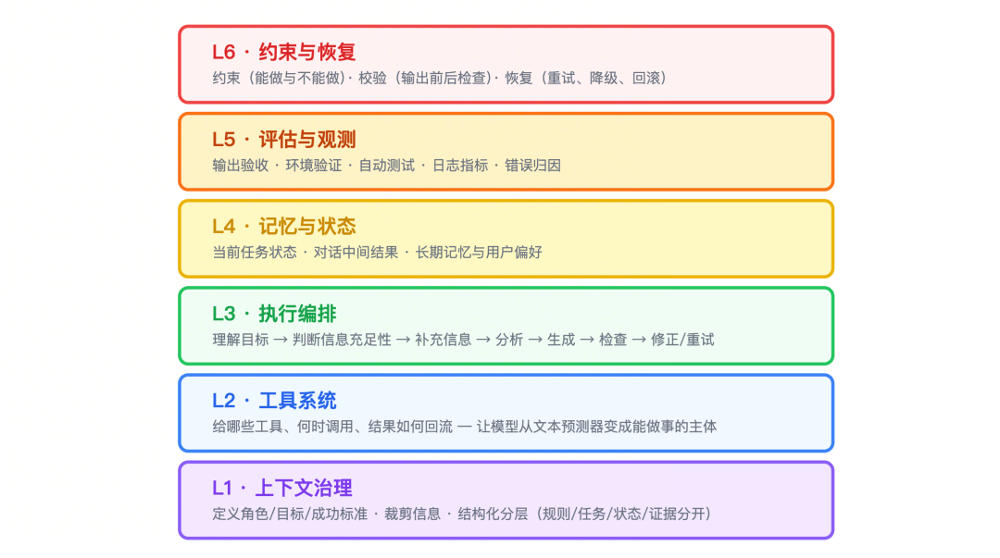

Q：Skills 应该在哪一层？

A：L2 层，是工具系统的标准化范式

> - **定义**：Skills 是基于自然语言描述的能力单元，封装了“是什么、能干什么、怎么调用”。
> - **价值**：

> - **通用性**：可以被不同 Harness 框架调用。
> - **复用性**：通过 **SkillHub** 等平台沉淀、复用和共享能力。

> - **模式**：工具系统从“重复造轮子”走向“能力市场”模式。

|  |  |  |
| --- | --- | --- |
|  |  |  |
|  |  |  |
|  |  |  |
|  |  |  |
|  |  |  |
|  |  |  |
|  |  |  |

#

# Harness 架构设计怎么做好？

## 🔶 轻量化三原则

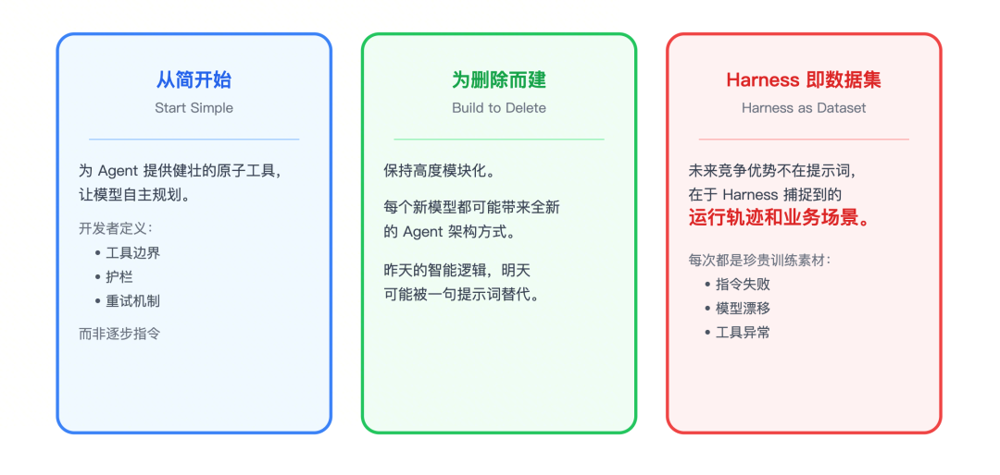

## 🔶 行业实践案例

OpenAI：5 个月内，0 行手写代码，产出百万行级产品。

Anthropic：实现创意迭代的飞跃。

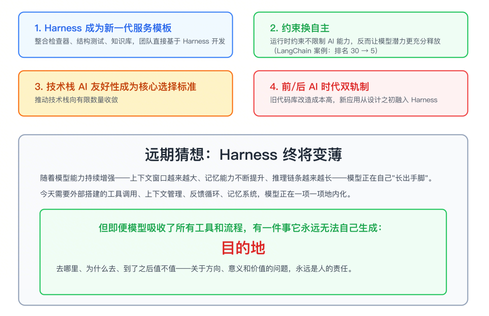

未来趋势：

- **Harness → 新一代服务模板**

  ：整合检查器、结构测试、知识库，使团队可直接基于 Harness 开发。
- **约束 → 自主性**

  ：运行时约束**充分释放模型潜力**（例：LangChain 排名从 30+ 提升至前 5）。
- **技术栈收敛**

  ：**AI 友好性**成为技术选型核心标准，推动技术栈向少数几个方向收敛。
- **双轨制**

  ：旧代码库改造成本高，**新应用从设计之初就融入 Harness Engineering**。

# Harness 和 Hermes一样吗？

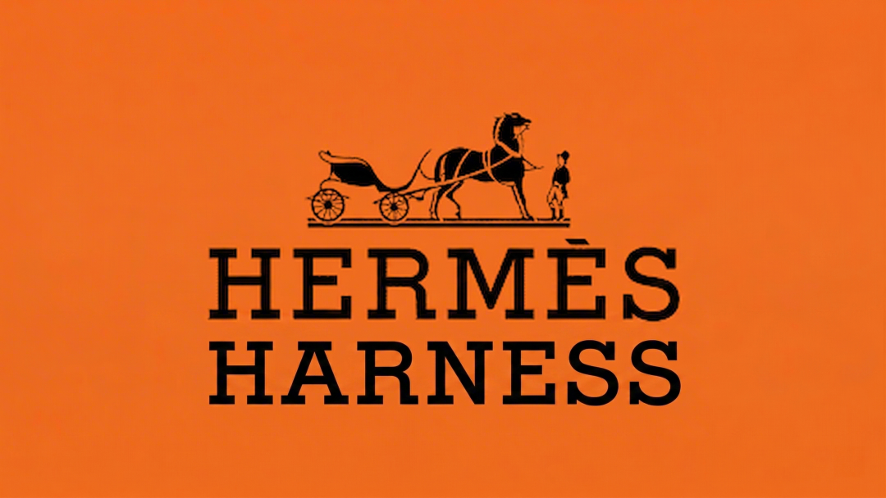

## 🔶 Hermes Agent 的概念

Hermès：创始人姓氏法语拼写（带闭音符 è），源自希腊神话的赫尔墨斯

Harness Engineering：一个工程/技术概念。

Hermes Agent：一个新的Agent 品牌名，图标是赫尔墨斯象征物双蛇杖☤

Hermes Agent在定位上是OpenClaw的“高阶替代品”，核心差异在于其学习与进化能力。

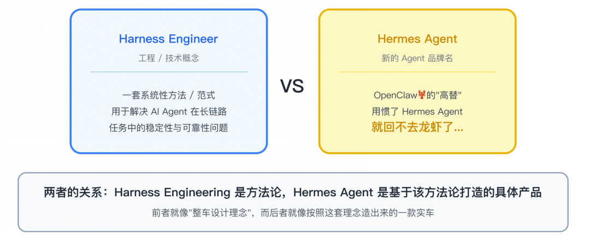

Hermes Agent 是 Nous Research 开发的开源自主 AI智能体，核心定位是“与你共同成长的智能体”

它具备持续学习与自我进化能力，通过内置的闭环学习系统实现跨会话持久记忆

核心差异：独特的学习闭环设计。

- 完成复杂任务后，自动提炼可复用的 **Skills** 并保存为独立文档。
- Skills 在后续使用中被按需加载，并根据新的反馈**不断自我改进**。

> **抄袭争议**：2026 年 4 月，国内开发者指责 Hermes Agent 抄袭其项目 EvoMap 的核心概念，Hermes 负责人否认。无论结果如何，这种“会自我进化”的 Agent 形态已展现出更强的生命力。

##

## 🔶 OpenClaw vs Hermes Agent

OpenClaw：价值在于连接广度，但不会“长大”，记忆是“写死的配置”

Hermes Agent：与用户协作越久，能力越强，价值呈指数级增长，记忆是“活的经验”

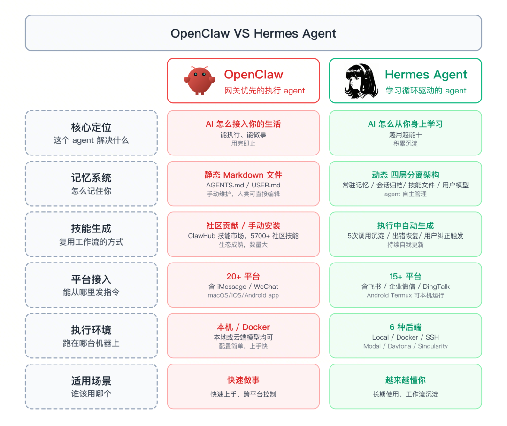

|  |  |  |
| --- | --- | --- |
| **维度** | **OpenClaw** | **Hermes Agent** |
| **核心价值** | 连接广度 (20+ 平台, 44K+ 插件) | **认知深度** (记忆管理, 学习机制) |
| **记忆模型** | **静态**：写死的配置，读取后不变 | **动态**：每次交互自动沉淀、进化 |
| **技能创建** | 需人工编写 Skill 或 prompt | **自动从执行经验中蒸馏** |
| **纠正学习** | 纠正后下次仍需重提 | **一次纠正，自动学习**，下次自动做对 |
| **适用场景** | 快速搭建多平台 AI 助手 | 有重复演化工作流、愿意长期培养 |

#

# Hermes Agent 的核心架构是？

## 🔶 四层记忆架构：像人类一样记忆

Hermes 的记忆系统参照人类记忆机制设计，分为四层：

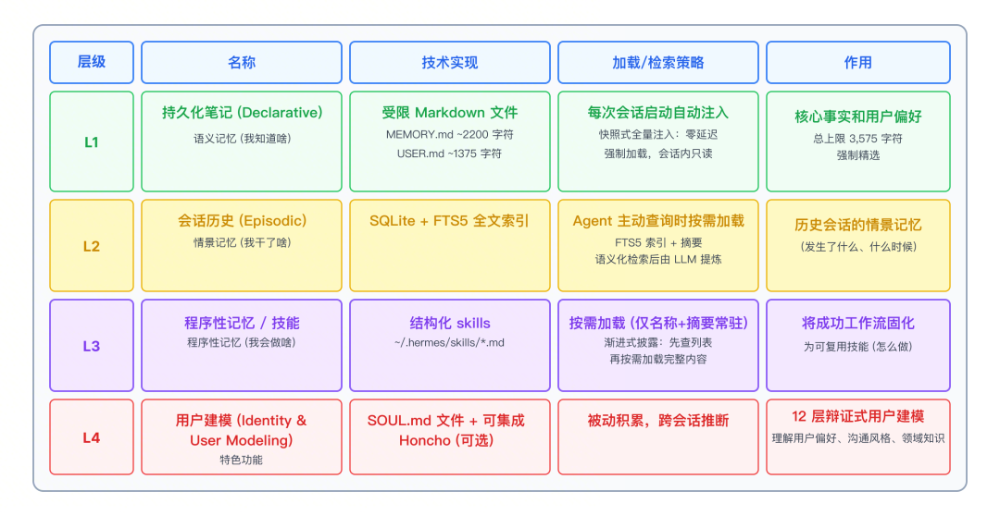

与认知科学 Tulving 记忆框架的映射：

|  |  |
| --- | --- |
| **Tulving 分类** | **Hermes****对应** |
| **情景记忆**   (我干了啥) | - **L2**：SQLite 会话历史   (按需检索)：仅在特定话题中有用的历史 |
| **语义记忆**   (我知道啥) | - **L1**：`MEMORY.md` / `USER.md`   (快照加载)：每次对话都需用到的信息 |
| **程序化记忆**   (我会做啥) | - **L3**：`SKILL.md` 技能系统   (技能库)：可复用的操作流程 |
| / | - **L4 (用户画像)**：用户的长期偏好和思维模式。   超出了Tulving的原始框架，属于"社会认知"范畴，这也是Hermes最有特色的设计之一。 |

##

## 🔶 Hermes 的自我进化机制是如何实现的？

> **self-evolving：**无需人工干预即可**自主学习、持续进化的闭环机制**。

反直觉的"有限记忆"哲学

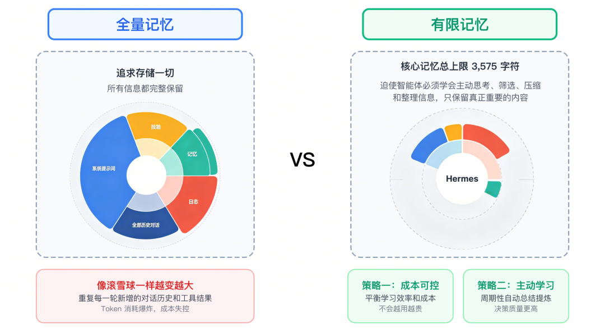

- 策略：Hermes 主动采纳“有限记忆”策略，核心记忆文件有约 3575 字符的硬性上限。

- 目的：迫使智能体学会主动筛选、压缩和整理信息，只保留最核心内容。

两大好处：

- 成本可控：核心记忆以固定大小注入系统提示词，每个会话的基础 Token 消耗稳定，不会越用越贵
- 信息密度高：避免信息泛滥稀释价值，类似人类将海量经验提炼为智慧，反而决策质量更高

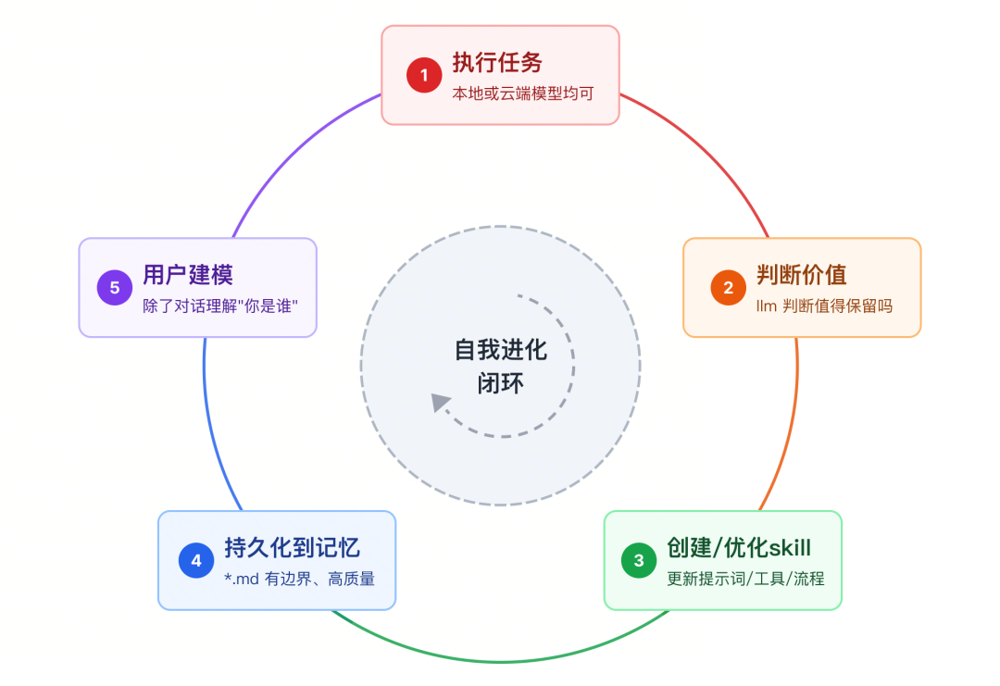

自我改进闭环：越用越强

冻结快照策略：平衡学习效率和成本

- 动作：会话开始时，将 MEMORY.md 和 USER.md 的内容作为“快照”注入系统提示词，在会话期间保持冻结。

- 目的：保护 LLM 的前缀缓存（Prefix Cache），避免频繁更新长提示词导致的高额计算成本。

- 机制：新学习内容写入磁盘，仅在下一次会话开始时加载新快照。

Nudge 机制：主动学习的触发器

- **自动技能创建**

- 任务涉及 **≥5 次**工具调用时，自动触发自我评估。将成功的工作流“蒸馏”为 `SKILL.md`

- **技能持续优化**

- 每次调用技能时，观察结果。发现更优方案或失败时，自动修补（auto-patch）技能文档

- **记忆主动维护**

- 定期审视并更新持久记忆

总结下：

Hermes“有限精选”的记忆哲学，可以确保其长期运行的准确性和低成本

- AI 应该记住什么：强迫 AI 学会“思考什么值得记忆”，而非记住所有信息

- 像人类一样记忆：人类处理复杂问题依赖筛选关键信息的能力，而非记忆总量

- 未来趋势： “重质量、轻数量”的记忆路线，可能比“堆存储、全量检索”的路线更具潜力
