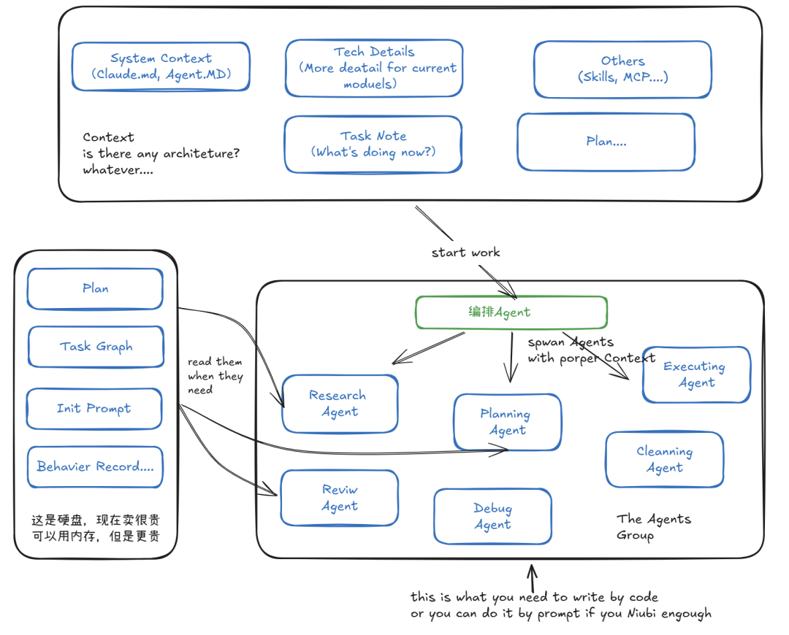

> 📎 来源: [程序员的鱼缸](https://mp.weixin.qq.com/s?__biz=MzAwNjYwMzY1OQ==&mid=2247483973&idx=1&sn=6903aca768a958842994cd07af533e8f&chksm=9acc7d46f4f5c38999875c566f6304f5be3646e99a25cd3ae4f76008fd5b972d5e40f67cb879&mpshare=1&scene=1&srcid=0429zrTmlolwxrHpg62Lbv1l&sharer_shareinfo=990955a79969c689011f0994f8932806&sharer_shareinfo_first=990955a79969c689011f0994f8932806) | 时间: 2026-04-29 03:39

---

Harness被说的太多，但是绕来绕去都是那几篇文章中介绍的理论。我不知道其他人看起来感觉如何，反正我是看了半天也不知道他们说的啥。

所以，talking is cheap, show me the prompt。

接下来用实践介绍Harness到底是如何应用的。

开始之前，仍然要重申Harness四大支柱。

上下文架构(Context Architecture):

上下文需要根据当前Agent的需要去披露，而不是在最开始一股脑的就全扔给他。还记得之前的Skill“渐进式披露”的概念吗。对，就是要构建一个上下文的架构出来，让agent在不同的时候能拿到指定的上下文。

这也就引出了下一个支柱。

Agent专业化(Agent Specialization)

用专门的Agent去执行专业领域的任务。比如搜索、测试、review等行为，通过system prompt，指定的工具集，只属于自己的context等来执行自己的任务。

持久化记忆(Persistent Memory)

对于任务进度、任务执行图等信息，将它们存储在外部存储里面，而不是塞到上下文。这样不管是特意或者被迫的重新开始会话，我们都可以得到必要的信息，而不是依赖上下文。甚至在一些地方，比如sub agent任务等，我们需要摒弃掉之前的context，通过持久化记忆去构建新的context。

结构化执行(Structure Execution)

我简单的理解，就是将任务的执行分为三个阶段：计划->执行->验证。在计划阶段形成规划和步骤，执行阶段按照步骤生成代码，验证结果之后根据情况是否重复计划阶段重做，

什么，要怎么分这三个阶段？那当然是人工……划掉……当然是Sepecial Agent啊……

所谓的四大支柱也就是Harness的一个理论体系，意思就是说，要通过这四个方面来指导和约束Agent的行为，从而实现Harness Engineering。

展示个图吧，让灵魂画手上线：

所以，要构建一个基本的harness工程的需要做的工作就是：

1. 准备好context，除了全局的，还有各种局部的详细的context，包括实现说明、计划、想要达到的目标等等；

2. 定义好你的Agent群，这些Agent按照整体目标和个体目标承担不同的工作项；

3. 规划好完成工作的步骤，分阶段分目标制定不同的输入/输出结果；

4. 指挥Agent们按照1和3的规定来进行工作。

怪不得都说Harness是大模型的操作系统，要是让我手搓这一套玩意出来那干脆还是人肉来干活吧，比Token便宜，对，哪怕是Coding Plan也不行。

不过还好，编程佬的世界里，永远都有轮子。

Atomic(https://github.com/flora131/atomic) + Claude Code

可以在开发项目中实现Harness Engineering，立马上手，童叟无欺。

Atomic是一个终端工具，通过驱动CC/OpenCode/Copolit CLI来干活。

来看看它的使用流程：

atomic chat -a claude(因为我用的claude code) 启动终端；

/init 初始化项目，生成claude.md和agent.md。这就是harness中常驻的context，只要在这个项目中就需要遵守这些约定。

/research-codebase [输入要解决的问题，理解为user story]。这个时候，就会针对user story，形成一份详尽的技术背景、框架、主流程的文档。实践中，需要仔细审查这份文档，修改其中你认为不妥当的地方。

/create-spec research-file-path research-file-path就是上一步中生成的研究报告。根据这个研究报告，生成spec。这是一份完备的目标、实现方式的文档，如果是前端页面，还会包括设计框架。实践中，需要仔细审查这份文档，修改其中你认为不妥当的地方。

上面两部的黑体字部分就是人类需要完成的主要工作。

检查完毕之后，通过指令 /ralph 来开始工作。/ralph后面的参数可以是直接的指令，也可以是spec文件。

ralph就是atomic设计的主编排Agent。他会让Atomic定义的一群Agent按照spec开始干活，并且生成持久化记忆中需要的各种文档。

整体的流程如下图所示：

最后还会通过Debug来进行调试、测试，根据结果重新进行循环。

可以看到，atomic的工作机制完整的实现了harness四大支柱，也是harness理论的一个完备工程实现，具备了很强的参考价值和实用性。

不过，要慎用。

因为真的挺费钱的。
