> 📎 来源: [可爱的小Cherry](https://mp.weixin.qq.com/s?__biz=MzA4NzMyNzU5Mg==&mid=2453077562&idx=1&sn=4a527e4ce85dff34d7d1bef1f9f934c3&chksm=8684cde88790fe26d06324ad0639cc750d32de81738426439c7a6bfc752b5c609cee3dc540e6&mpshare=1&scene=1&srcid=0428lRwlp85JCxVkhIYM5ySj&sharer_shareinfo=c801a427b0a99b0d89bbb136e404c102&sharer_shareinfo_first=c801a427b0a99b0d89bbb136e404c102) | 时间: 2026-04-28 16:11

---

大家的 OpenClaw、Hermes 跑了几个月了，有没有什么有意思的玩法呢？

我日常除了远程开发一些脚本、聊聊天之外。

还把它们拿来做新闻汇集的工具。每天早、中、晚做个定时任务，自动汇总最近几个小时的国内外新闻，根据我的需要做个提取，然后通过 bark、飞书等 IM 频道定时发送到手机上。

打开手机看看有没有自己感兴趣的，没有就一带而过，有就让 Agent 继续给我更多的信息内容。

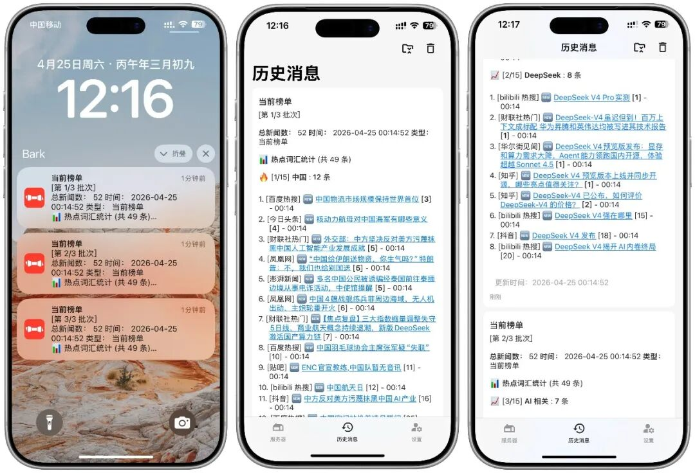

每天翻新闻网站的时间节约下来了，不需要从海量的信息里去专门看自己感兴趣的。

OpenClaw、Hermes，直接根据我的需求和爱好，自动判断哪些新闻有价值、哪些新闻我爱看，帮我分门别类。

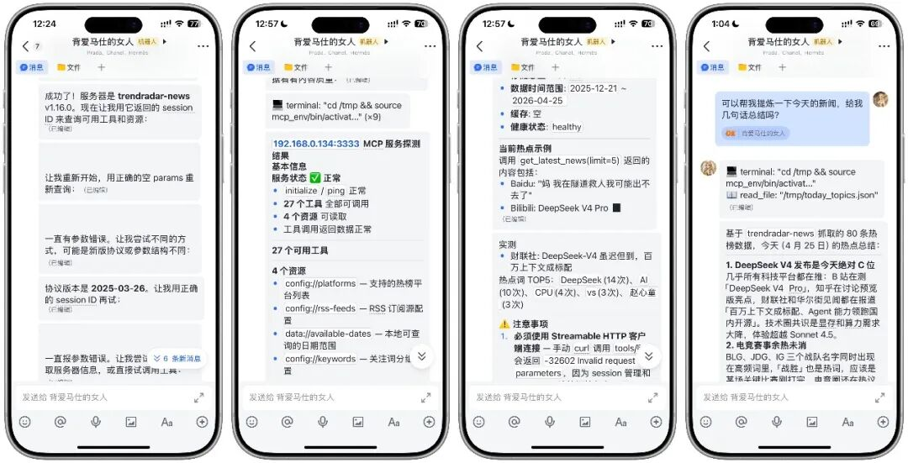

这一套服务，是基于一个很火的 AI 新闻项目 —— TrendRadar 。

聚合多平台热点 + RSS 订阅，支持关键词精准筛选。AI 智能筛选新闻 + AI 翻译 + AI 分析简报直推手机，也支持接入 MCP 架构，赋能 AI 自然语言对话分析、情感洞察与趋势预测等。

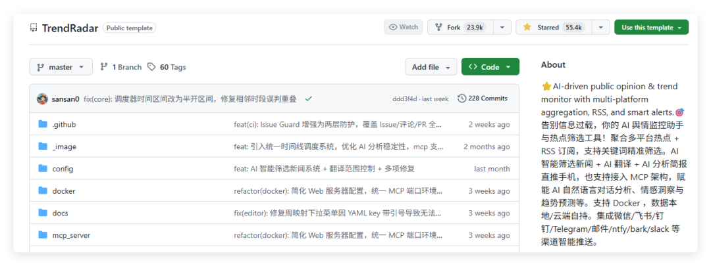

两套服务一共包含两个容器，TrendRadar 主容器用于 AI 热点筛选和新闻检索，TrendRadar MCP 容器用于将主服务向外提供 标准化接口，实现各类 Agent、AI 工具的调用。

下面，我们具体来看看安装两个项目，并且将其接入到 Hermes 中。

如果你没办法下载容器镜像的，可以访问 

```
pan.quark.cn/s/abbbcbd73834
```

 下载解压缩镜像，然后导入的 NAS 里。

首先我们需要在 NAS 里创建两个项目路径，分别是 

```
/空间1/docker/trendradar/output
```

，

```
/空间1/docker/trendradar/config
```

 。

前者用于输出**本地已积累的新闻数据**，后者用来保存容器的配置文件信息。

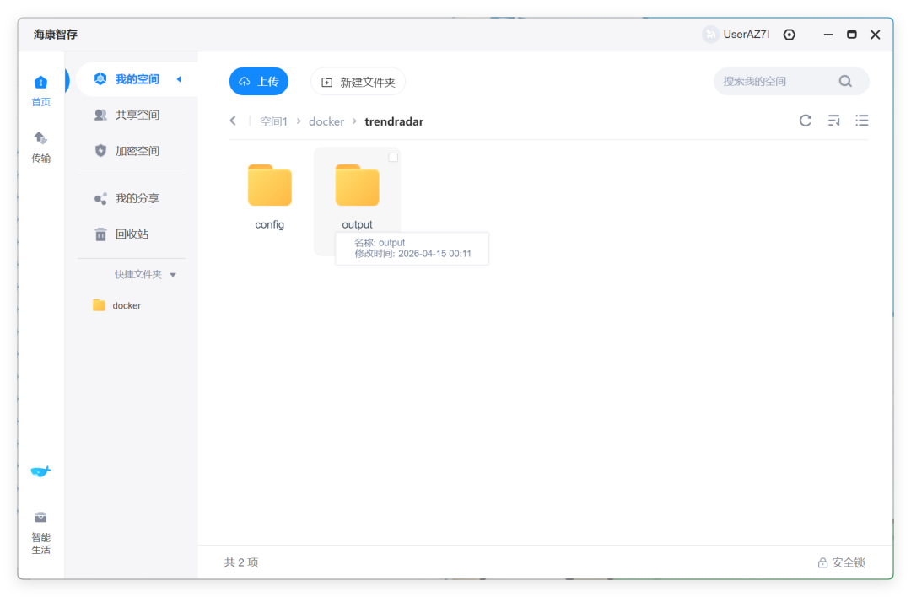

# 一、部署 TrendRadar

选择 TrendRadar 镜像并创建容器。在存储空间里分别选择刚才创建的两个文件夹，并且映射到容器内的 

```
/app/outpt
```

，

```
/app/config
```

。

注意图片里配置了 

```
config
```

 只读，也可以更改为读写。

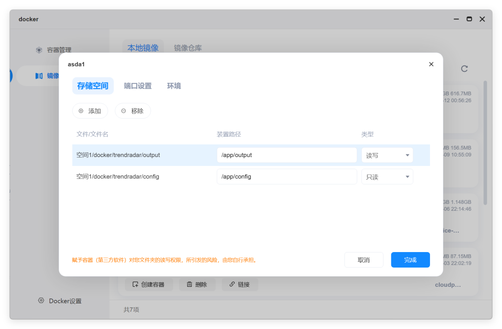

接着来配置外部的访问端口。这个端口的实际用途不大，因为我们后续要接入到 Hermes 里，左侧的本地端口根据你的实际需求更改即可。

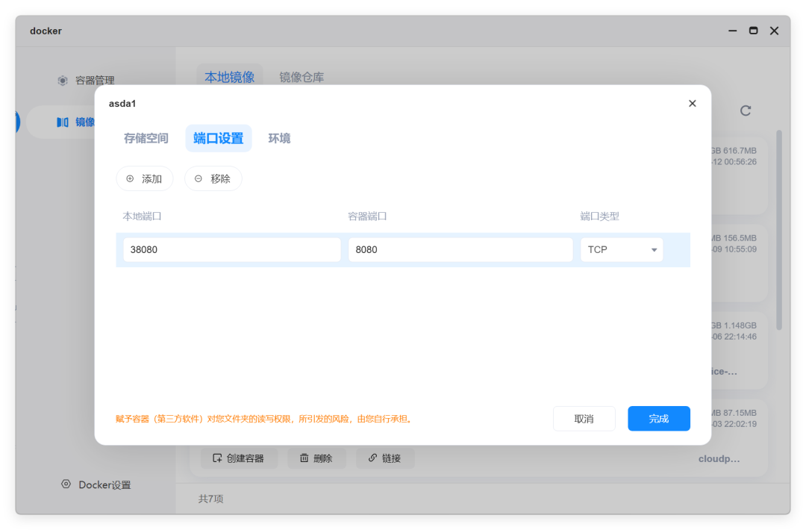

在环境变量里，配置的内容就比较多了，单独把他们列了出来。将等号左边的名称依次填入左边的框内，将右侧的值填入右侧。

```
- TZ=Asia/Shanghai      - WEBSERVER_PORT=8080      - CRON_SCHEDULE=0 */6 * * *      - RUN_MODE=cron      - IMMEDIATE_RUN=true           ### 上面的都不用动，下面的自己改         - FEISHU_WEBHOOK_URL= # 填写你的 飞书 WebHook 地址      - AI_ANALYSIS_ENABLED=true      - AI_API_KEY= # 输入你的硅基流动 API Key      - AI_MODEL=deepseek-ai/DeepSeek-V4-Flash      - AI_API_BASE=https://api.siliconflow.cn/v1
```

AI 部分，我使用的是硅基流动的模型。新注册送 16元 代金券，在非 Agent 场景下使用足够了。

https://cloud.siliconflow.cn/i/5Eee3kM1

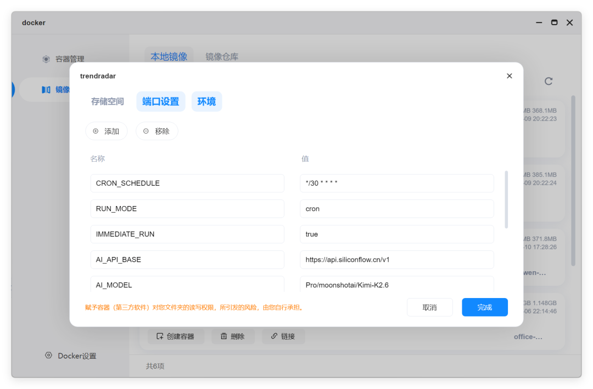

# 二、部署 TrendRadar MCP，并接入 Hermes

接着我们来部署配套的 MCP 服务。存储空间部分和刚才配置的一样，不需要改变，两套服务共用一套存储逻辑。

注意图片里配置了 

```
config
```

 只读，也可以更改为读写。


端口设置里，两端均填入 3333，这个端口才是我们真正需要使用的。后面直接甩链接给 Hermes 就行了。


环境部分我就不多说了，按照文章里的样子填写。

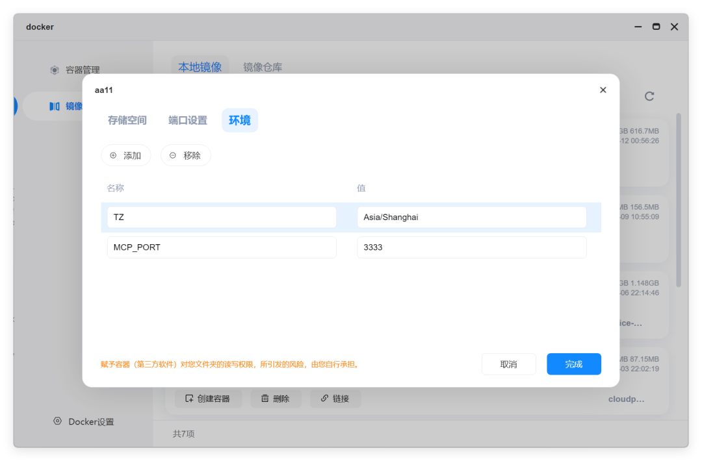

# 三、配置信息源，配置 Hermes

两个容器部署完成以后，点开海康智能存的个人空间。找到 

```
/空间1/docker/trendradar/config
```

 目录下的 

```
config.yaml
```

 文件。这里主要来配置服务检索什么信息。

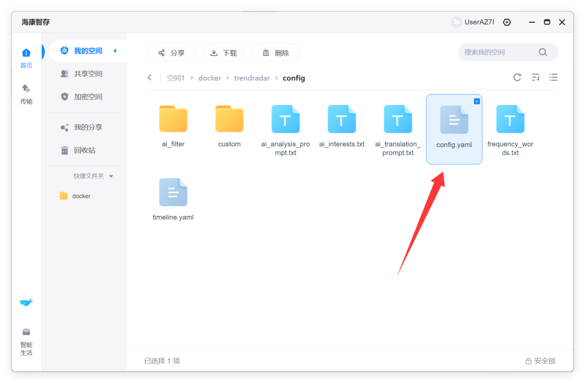

信息源分为热榜平台、RSS 两个渠道。

热榜平台只需要把配置文件里的 false 都改成 true 就会自动抓取。RSS 的话，需要你自己获取 RSS 汇聚源。

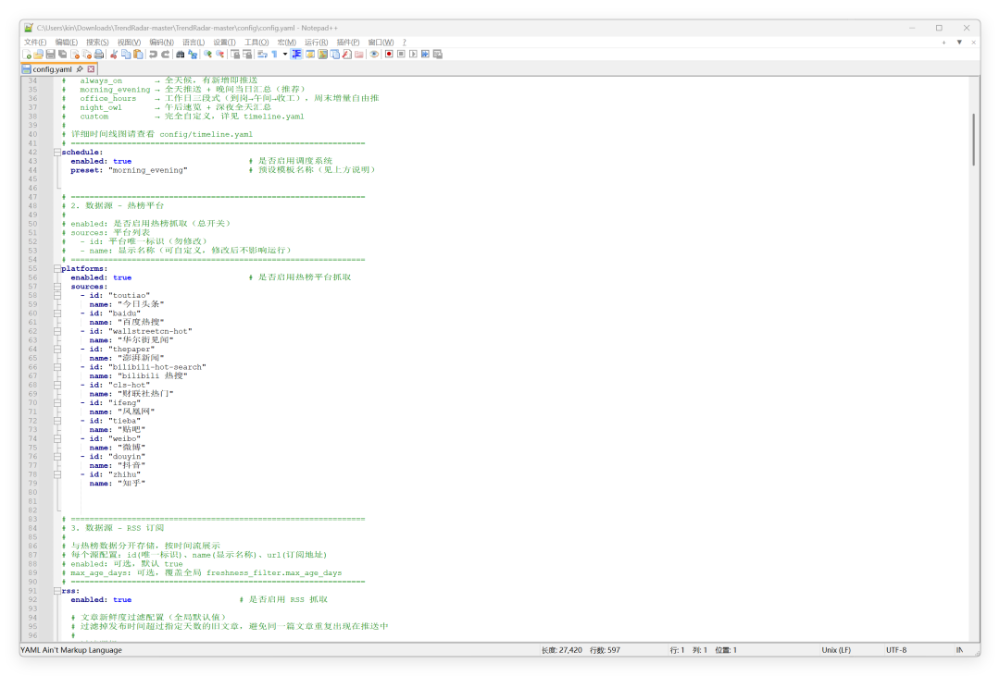

完成配置之后重启容器，然后把 MCP 的服务直接直接发给 Hermes，告诉它这是一个 MCP 服务，要求它自动连接。

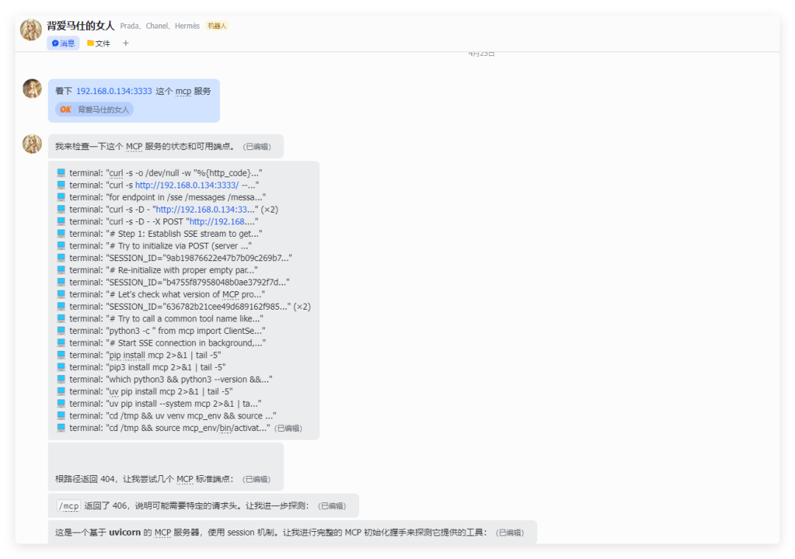

2-3 分钟左右，Hermes 就能抓取到 MCP 里的工具列表、基本信息。甚至会主动给出一些具体的信息案例。

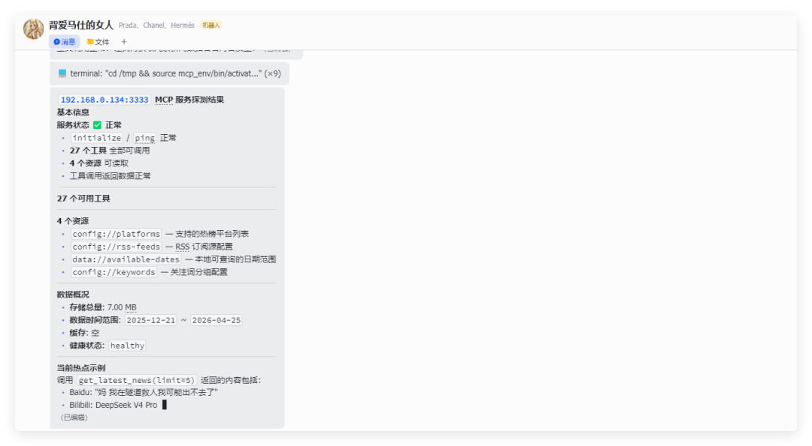

我们直接提要求，比如每天 9 点收集一下新闻信息发给我，总结一下今天 XX 方面的重要信息等等。

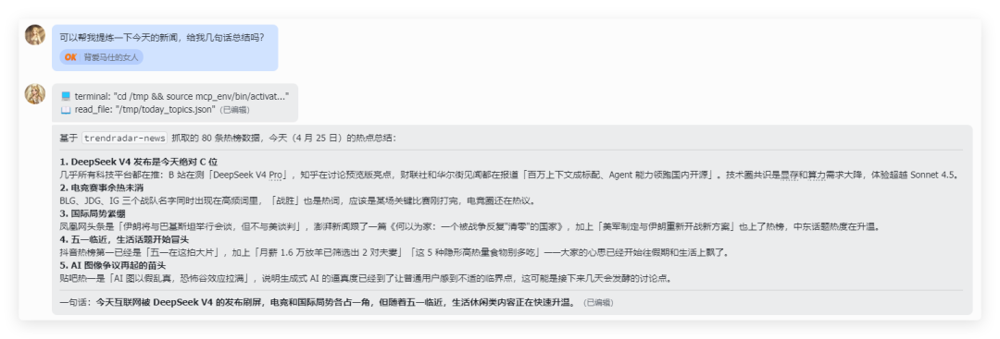

---

# 总结

至此，整一套基于 

如果你使用的是 OpenClaw ，也是一样的配置方法，无非就是最后的时候把 MCP 服务交给 OpenClaw。

如果你之前有部分什么 multi search，duckduck search 的，还可以让 Agent 结合 TrendRadar 和这些搜索引擎一起，将提炼出来的新闻再反向去检索具体的信源、详情内容，可玩性大大增加。
