> 📎 来源: [IT全维故障通](https://mp.weixin.qq.com/s?__biz=Mzk5MDMwNTczMg==&mid=2247484175&idx=1&sn=2553f9adc52a40aae052805a755716e0&chksm=c427b26309241fb4f91dd0d6430c37aad83791f3e0aa53f083d95151e24eb6d91c7bed0e4bdc&mpshare=1&scene=1&srcid=0430SagnlL8nBAfrRUewLM5V&sharer_shareinfo=c9f90c2f670a43eea272d23958cd5944&sharer_shareinfo_first=c9f90c2f670a43eea272d23958cd5944) | 时间: 2026-04-30 19:48

---

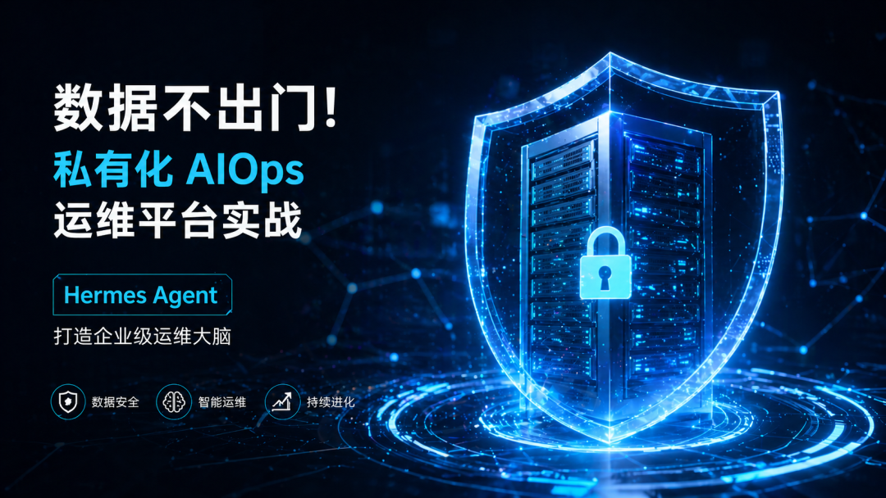

2025 年，我们的第一门课教会了很多工程师用公有 API 做 AIOps。学员们把线上日志丢给 GPT-4，告警摘要做得有模有样，领导点头称好。

然后，有人被安全审计叫去谈话了。

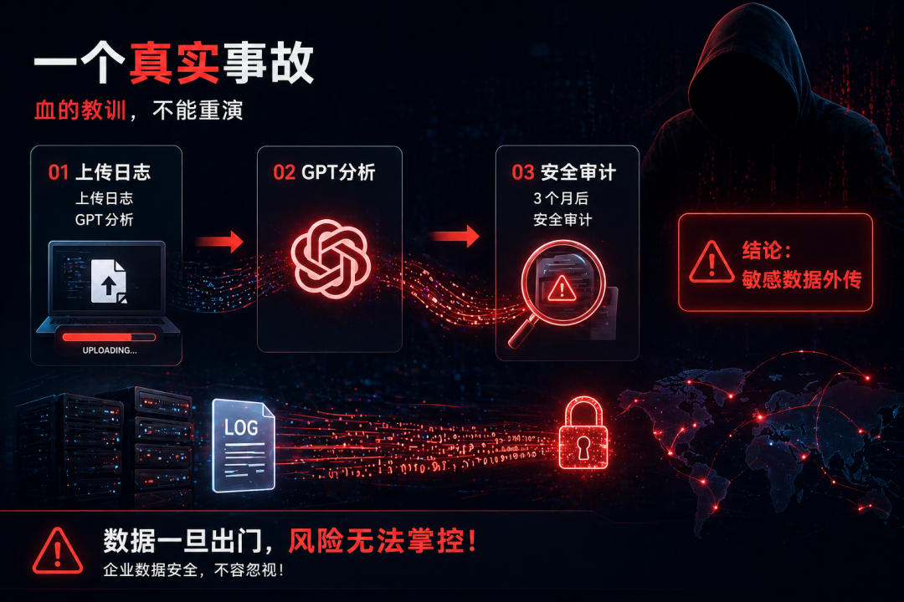

这不是个例。随着企业 AI 化程度加深，数据合规的红线越来越清晰，而公有 API 模式的三道枷锁，开始让越来越多的团队感到窒息。

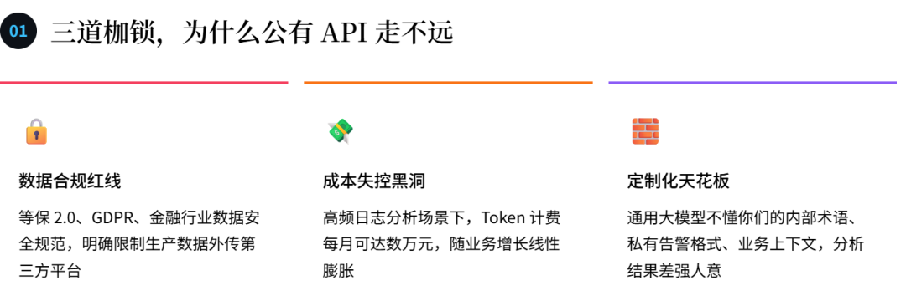

面对这三道枷锁，答案只有一个方向：**把模型和数据都留在内网**。而 2026 年，这件事已经真正变得可行了。

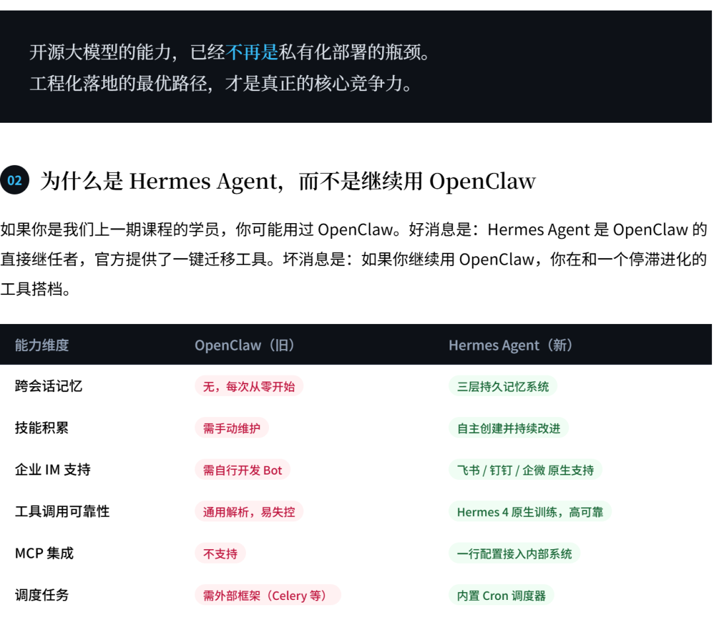

**更关键的是底层模型**：Hermes Agent 背后是 Nous Research 专为 Agent 场景打磨的 Hermes 4 模型。它的训练数据以真实 Agent 工具调用轨迹为主，这意味着在多步骤自动化场景下，它不会"跑着跑着忘了自己在做什么"——这是所有其他本地模型的通病。

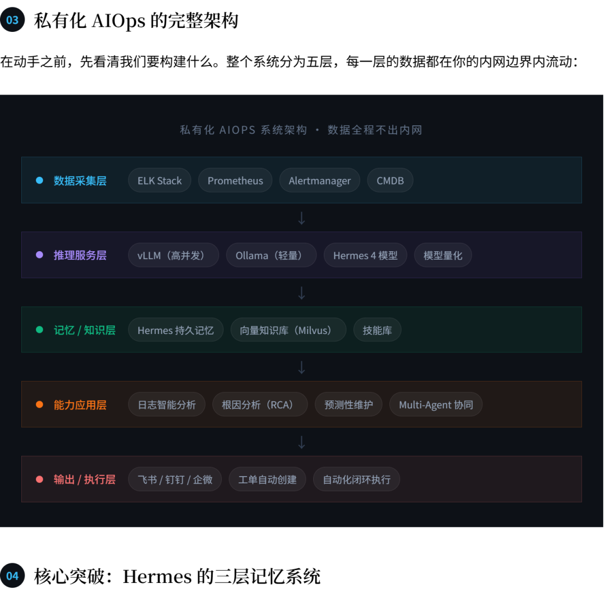

这是与 OpenClaw 时代最本质的差异，也是整个课程最值得反复咀嚼的设计。**传统 AI 调用是无状态的**——每次调用都从零开始，它不记得上周五的那次数据库故障，不知道你们的生产主节点 IP，不懂你们对 P0 告警的定义。

Hermes Agent 通过三层记忆彻底改变了这个范式：

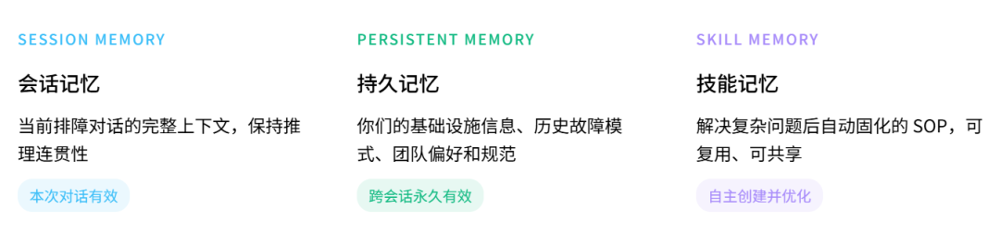

举个具体的例子：第一次处理 Redis Cluster 脑裂故障，你和 Hermes 一起排查了 40 分钟。故障解决后，Hermes 自动将排查思路和修复步骤固化为一个技能文件。第二次出现类似告警，Hermes 直接调用这个技能——排查时间从 40 分钟压缩到 3 分钟。

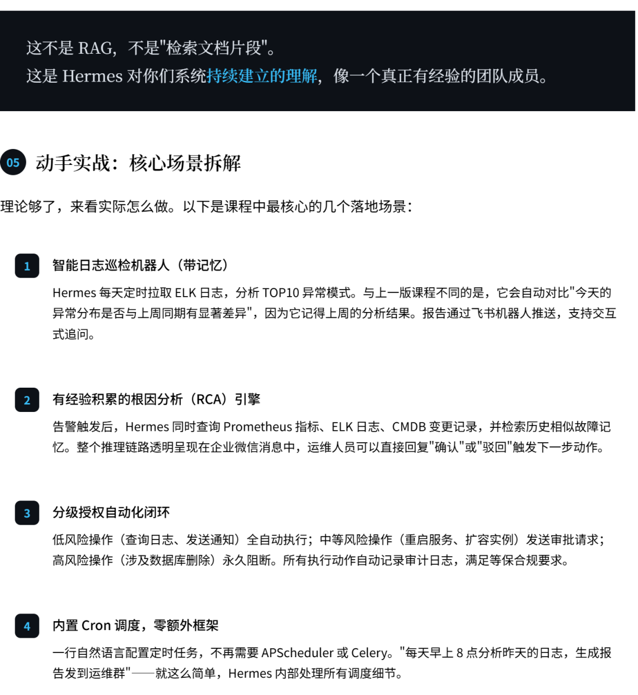

来看一段真实的部署配置，感受一下这套系统有多"反直觉地简单"：

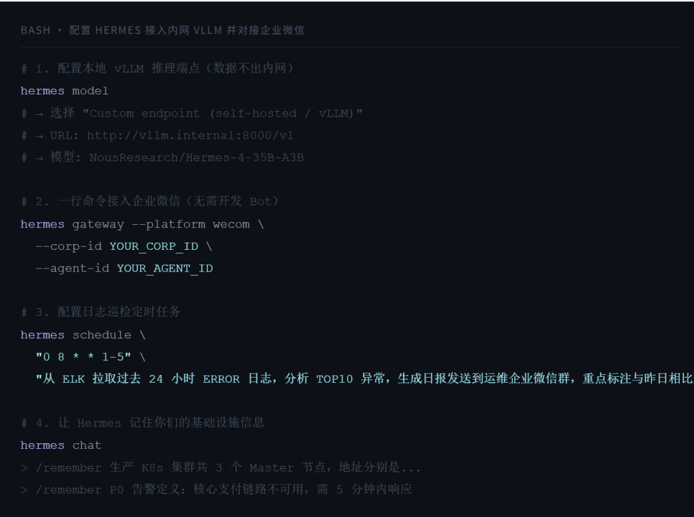

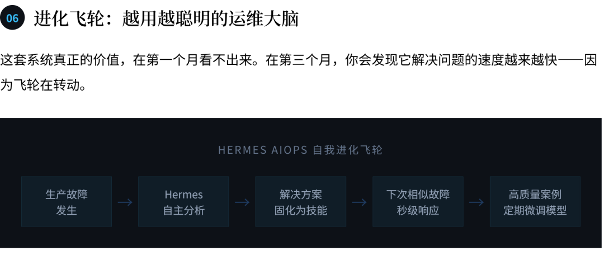

六个月后，你的 Hermes 实例和你同事的 Hermes 实例，是完全不同的两个"人"——因为它们积累了不同的运维经验、学会了不同的技能、记住了不同系统的特征。**这才是真正属于你们团队的运维大脑**。

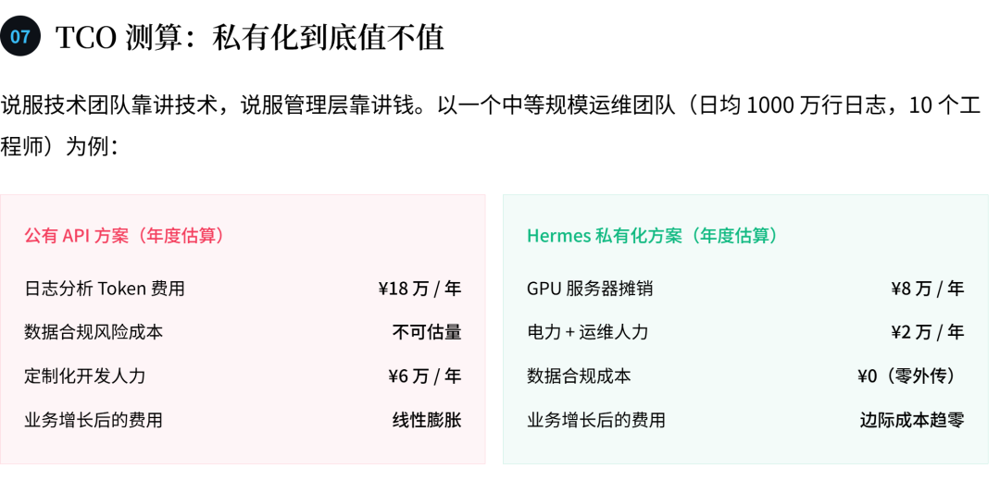

第一年 ROI 大约在 1.5 倍。第三年，随着技能库和记忆的积累，团队 MTTR（平均修复时间）下降 60%，这部分业务损失减少的价值，远不止账面上的费用差额。

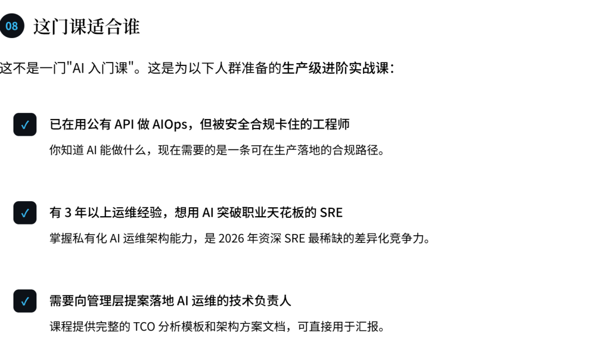

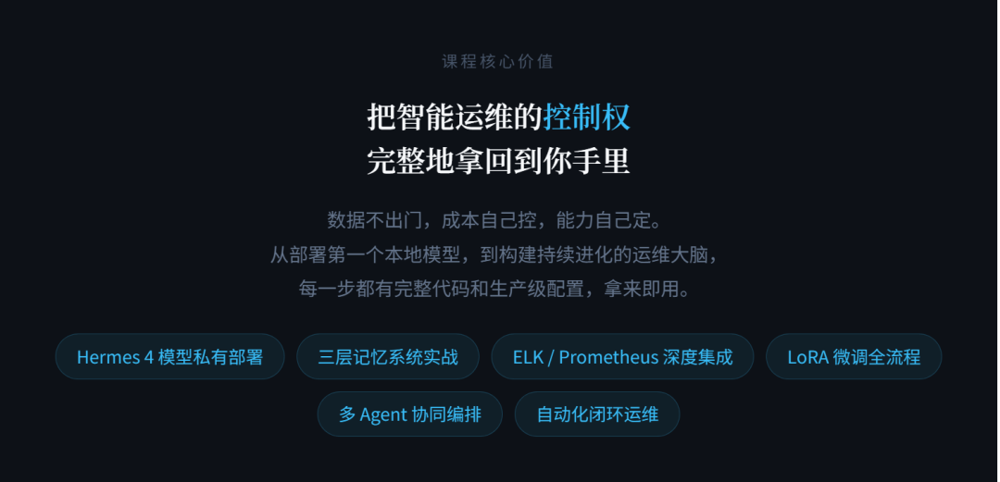
