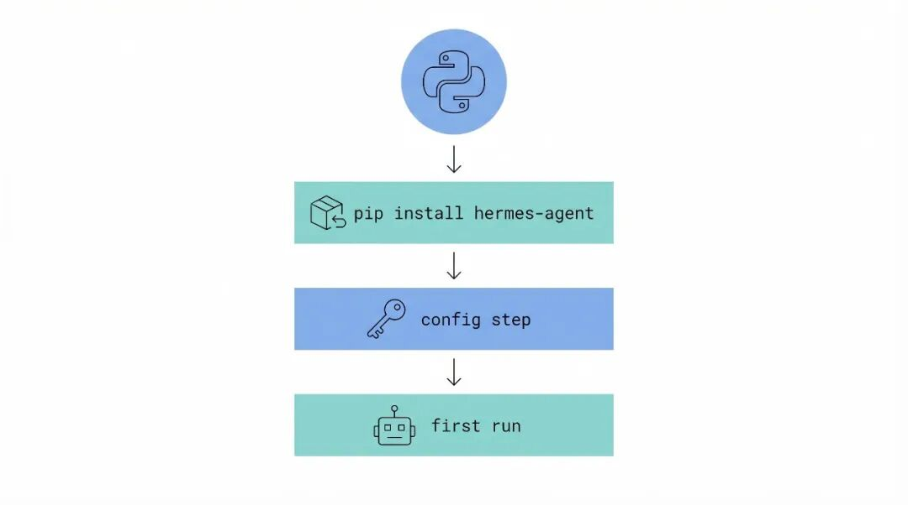
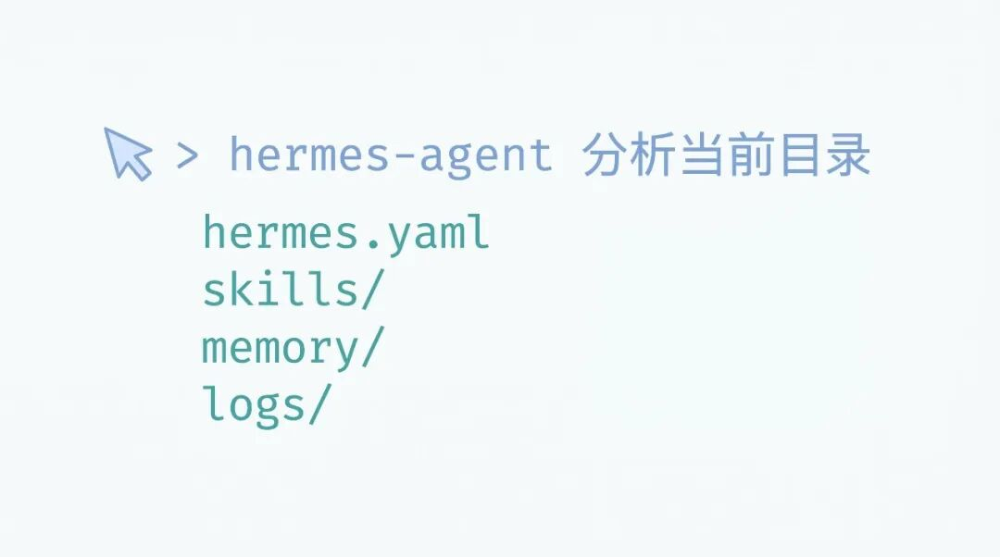

> 📎 来源: [CostaLong](https://mp.weixin.qq.com/s?__biz=MzA5NzgzNjE1Ng==&mid=2247485784&idx=1&sn=bfe105edcf35830c6fe3f96bb7c5c6ad&chksm=914c243ec657eb839ad4c43ed8347232ed5642204284c25f495892ba66bce662178fbf3e0f9c&mpshare=1&scene=1&srcid=0420BzIgGkslTJKBlKfDsIax&sharer_shareinfo=2126254ac3b2a1964df362ae07cccfe1&sharer_shareinfo_first=2126254ac3b2a1964df362ae07cccfe1) | 时间: 2026-04-20 15:36

---



Hermes Agent 安装配置流程图，展示从环境准备到第一个 Agent 运行的全过程

**ℹ️ 📚 系列导航**

本文是《AI Agent 进阶教程》系列第 2/22 篇。
上一篇：[什么是 Hermes Agent：让 AI 从问答升级到替我做事](https://mp.weixin.qq.com/s?__biz=MzA5NzgzNjE1Ng==&mid=2247485773&idx=1&sn=71ce212219d2f8d3a8e40a61829db225&scene=21#wechat_redirect)

下一篇：核心概念：Memory、Tool、Agent Loop

上篇介绍了 Hermes Agent 的概念，这篇直接动手。安装方式是从源码克隆 + uv 安装，不同于常见的 pip install。这篇把安装问题的排查方法整理清楚，帮你 5 分钟搞定。

---

## 前置要求：Python 环境

Hermes Agent 基于 Python 开发，需要 **Python 3.11**。这篇把安装问题的排查方法整理清楚，帮你 5 分钟搞定。

先确认你的版本：

|  |  |
| --- | --- |
|  | bash |

```
python3 --version# 输出应该类似：Python 3.11.x
```

版本不对？用 pyenv 升级：

|  |  |
| --- | --- |
|  | bash |

```
# macOS 安装 pyenvbrew install pyenv# 安装 Python 3.11pyenv install 3.11# 设置全局默认版本pyenv global 3.11# 验证python3 --version
```

---

## 安装 Hermes Agent

Hermes Agent 不是 pip 包，需要从源码克隆。确认 Python 版本无误后，安装 Hermes Agent：

### 方式一：一键安装（推荐）

Linux/macOS/WSL2 用户可以直接用官方安装脚本：

|  |  |
| --- | --- |
|  | bash |

```
curl -fsSL https://raw.githubusercontent.com/NousResearch/hermes-agent/main/scripts/install.sh | bash
```

### 方式二：手动安装

手动安装需要几个步骤，但更可控：

**第一步：克隆源码**

|  |  |
| --- | --- |
|  | bash |

```
git clone --recurse-submodules https://github.com/NousResearch/hermes-agent.gitcd hermes-agent
```

> [!注意]

> ```
> --recurse-submodules
> ```

>  必须加，否则部分依赖会缺失。如果忘记加，可以用 

> ```
> git submodule update --init --recursive
> ```

>  补上。

**第二步：创建虚拟环境并安装依赖**

|  |  |
| --- | --- |
|  | bash |

```
# 安装 uv（如果还没有）pip install uv# 创建 Python 3.11 虚拟环境uv venv .venv --python 3.11# 激活虚拟环境source .venv/bin/activate# 安装 Hermes Agent 及所有依赖uv pip install -e ".[all]"
```

**第三步（可选）：安装子模块和额外功能**

|  |  |
| --- | --- |
|  | bash |

```
# 安装 tinker-atropos 子模块git submodule update --init submodules/tinker-atropos# 如果需要浏览器操控或 WhatsApp 集成npm install
```

**第四步：添加到 PATH**

安装脚本会自动创建 symlink。如果没有，手动创建：

|  |  |
| --- | --- |
|  | bash |

```
# 把 hermes 添加到 PATH（添加到 ~/.zshrc 或 ~/.bashrc）export PATH="$PATH:/path/to/hermes-agent"source ~/.zshrc
```

---

## 配置 API 密钥

Hermes Agent 需要连接大模型 API 才能工作。配置使用 

```
hermes model
```

 交互式命令完成：

|  |  |
| --- | --- |
|  | bash |

```
# 运行交互式配置hermes model
```

按提示选择 provider，输入 API key。

如果你偏好手动配置，创建配置文件和环境变量文件：

|  |  |
| --- | --- |
|  | bash |

```
# 创建配置目录mkdir -p ~/.hermes# 创建 API Key 文件cat > ~/.hermes/.env << 'EOF'# MiniMax（国内）MINIMAX_CN_API_KEY=你的MiniMax_API_Key# 或使用其他 Provider：# OPENROUTER_API_KEY=sk-or-v1-xxx# DEEPSEEK_API_KEY=sk-xxx# ZAI_API_KEY=xxxEOF# 设置文件权限（必须）chmod 0600 ~/.hermes/.env# 创建配置文件cat > ~/.hermes/config.yaml << 'EOF'model:  provider: "minimax-cn"  default: "minimax-m2.7"memory:  memory_enabled: true  user_profile_enabled: true  memory_char_limit: 2200  user_char_limit: 1375approvals:  mode: manual  timeout: 60EOF
```

> [!注意]
> 配置文件位置是 

> ```
> ~/.hermes/config.yaml
> ```

> ，不是 

> ```
> ~/.config/hermes-agent/
> ```

> 。

**💡 Tip**

MiniMax API Key 获取：登录 MiniMax 开放平台https://platform.minimaxi.com，进入 **账户管理 → API Keys** 创建。

---

## 验证安装

安装和配置都完成后，用 

```
hermes doctor
```

 验证一切正常：

|  |  |
| --- | --- |
|  | bash |

```
hermes doctor
```

应该看到类似输出：

|  |  |
| --- | --- |
|  | code |

```
[✓] Python 3.11 detected[✓] Dependencies installed[✓] Config file found[✓] API key configured[✓] Ready to run
```

如果有问题，按提示修复。常见问题：

| 问题 | 解决方法 |
| --- | --- |
| ``` command not found: hermes ``` | 使用完整路径   ``` ~/.hermes/hermes-agent/.venv/bin/hermes ```   或添加 PATH |
| ``` MINIMAX_CN_API_KEY ```   invalid | 确认 API Key 有效，可在 MiniMax 平台检查 |
| Python version error | 确认是 Python 3.11 |

---

## 运行你的第一个 Agent

配置完成后，直接运行 

```
hermes
```

 启动：

|  |  |
| --- | --- |
|  | bash |

```
hermes
```

看到类似输出说明 Agent 启动成功：

|  |  |
| --- | --- |
|  | code |

```
Hermes Agent v0.9.1───────────────配置: ~/.hermes/config.yaml模型: minimax-m2.7 (via minimax-cn)───────────────────────────────────────────INFO: Memory initializedINFO: Ready. Type your request or 'exit' to quit.
```

也可以用 TUI 模式启动（推荐）：

|  |  |
| --- | --- |
|  | bash |

```
hermes --tui
```

**💡 Tip**

如果 

```
hermes
```

 命令找不到，使用完整路径：

```
~/.hermes/hermes-agent/.venv/bin/hermes 返回结果：
```



Hermes Agent 执行效果示例，展示用户输入与 Agent 响应的对话流程

整个过程 Agent 自动完成，不需要你指定用哪个工具。

---

## 常用命令一览

| 命令 | 作用 |
| --- | --- |
| ``` hermes --tui ``` | 启动 TUI 界面（推荐） |
| ``` hermes chat ``` | 启动 Agent 聊天 |
| ``` hermes model ``` | 配置 LLM provider 和模型 |
| ``` hermes doctor ``` | 诊断安装问题 |
| ``` hermes status ``` | 查看状态 |
| ``` hermes sessions list ``` | 列出会话 |

**💡 Tip**

如果 

```
hermes
```

 命令找不到，使用完整路径：

```
~/.hermes/hermes-agent/.venv/bin/hermes --tui
```

---

## 常见问题排查

### API 密钥认证失败

|  |  |
| --- | --- |
|  | code |

```
Error: Authentication failed. Check your API key.
```

检查环境变量是否正确设置：

|  |  |
| --- | --- |
|  | bash |

```
# 验证环境变量cat ~/.hermes/.env | grep MINIMAX_CN_API_KEY# 应该看到 sk-cp-... 这样的密钥# 如果是空的，重新设置echo 'MINIMAX_CN_API_KEY=你的key' >> ~/.hermes/.envchmod 0600 ~/.hermes/.env
```

另一个常见原因：密钥过期或者额度用完。在 MiniMax 开放平台检查账户状态。

### hermes 命令找不到

|  |  |
| --- | --- |
|  | code |

```
zsh: command not found: hermes
```

使用完整路径运行，或添加到 PATH：

|  |  |
| --- | --- |
|  | bash |

```
# 方式一：使用完整路径~/.hermes/hermes-agent/.venv/bin/hermes --tui# 方式二：添加到 PATH（永久）echo 'export PATH="$PATH:$HOME/.hermes/hermes-agent/.venv/bin"' >> ~/.zshrcsource ~/.zshrchermes --tui
```

### 依赖安装失败

如果 

```
uv pip install -e ".[all]"
```

 报错，尝试：

|  |  |
| --- | --- |
|  | bash |

```
# 升级 uvpip install --upgrade uv# 重新安装uv pip install -e ".[all]" --no-cache
```

Agent 跑起来后，下一篇会深入讲它的三大核心组件——Memory、Tool、Action。

后续的文章会逐步深入：下一篇讲 Memory、Tool、Action 三大核心组件的设计理念，帮你从"会用"进阶到"会设计"。

---

**💡 📚 下一篇预告**

《核心概念：Memory、Tool、Agent Loop》— 理解 Hermes Agent 三大核心组件的设计理念：Agent 是怎么记忆上下文、如何调用工具、又是怎么把用户的指令转化为具体行动的。

往期推荐

- 1

  [什么是 Hermes Agent：让 AI 从问答升级到替我做事](https://mp.weixin.qq.com/s?__biz=MzA5NzgzNjE1Ng==&mid=2247485773&idx=1&sn=71ce212219d2f8d3a8e40a61829db225&scene=21#wechat_redirect)
