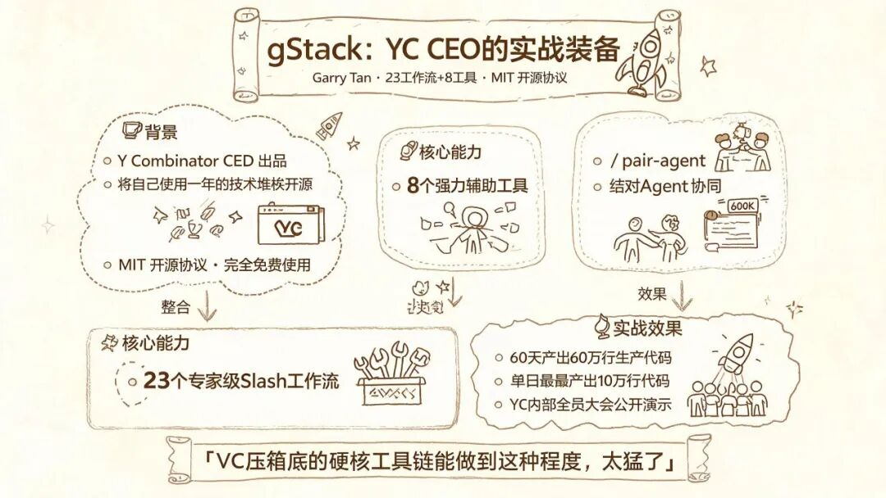
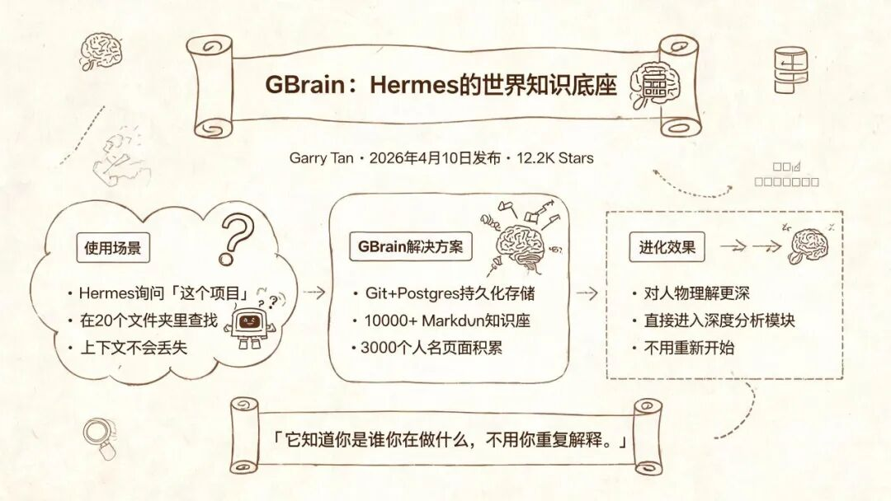
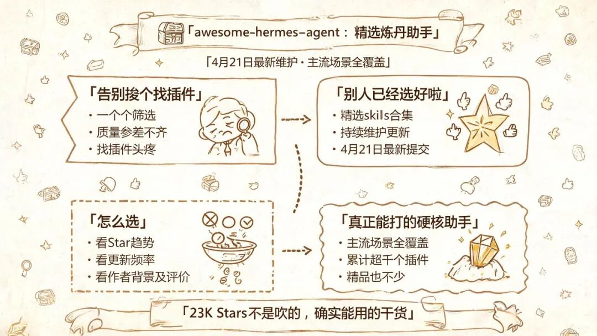
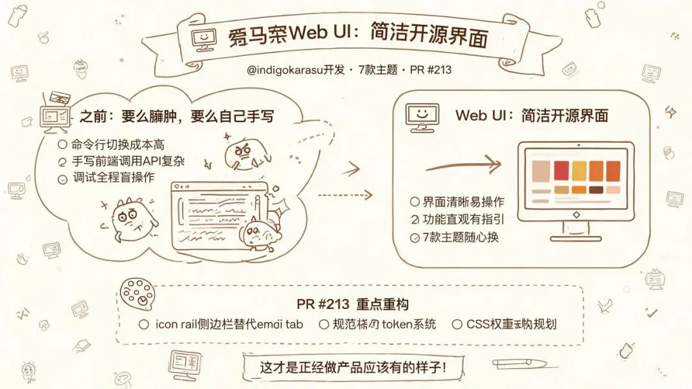
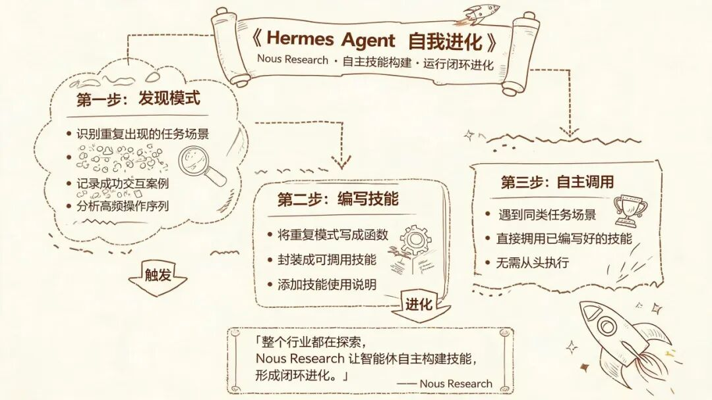

> 📎 来源: [小波AI日志](https://mp.weixin.qq.com/s?__biz=MzkxMDUzMjM4OQ==&mid=2247484631&idx=1&sn=96ef13daa12dab63a2b00ff71751ca40&chksm=c0ccf3591f08c3bcfd9bfcf70c58ea9eb9e663e4b1b9dd12d78eaf3fd7f49c6a138d088839a6&mpshare=1&scene=1&srcid=0501DEhlDd7yj98u8goV4C11&sharer_shareinfo=2eb61f5261647cb2d3aa0590d23697a9&sharer_shareinfo_first=2eb61f5261647cb2d3aa0590d23697a9) | 时间: 2026-05-01 12:30

---

说实话，我一开始用 Hermes 的时候，就觉得这玩意儿吧……底子是真不错，但用起来总觉得缺了点什么。就像你买了辆配置拉满的车，结果中控台一堆功能不知道怎么用。

直到我把这 5 个 skills 装上。

**gStack**（ garrytan/gstack ）

这个是让我最眼前一亮的一个。 Y Combinator CEO Garry Tan 把自己用了一年多的配置直接 开源 了——23 个专家级 slash 工作流， 8 个强力工具， MIT license ，没有任何付费门槛。

60 天用它发了 60 万行生产代码。

什么概念？一天 10 万行。这个数字放在任何一家中大型科技公司，都够开一场全员大会庆祝了。

更离谱的是，他把整套东西设计成了"/pair-agent"模式——你的 Claude Code 和 Hermes 可以同时盯着同一个浏览器窗口，调试的时候两边步调一致，不用来回切换 context 。

说实话 YC 旗下那么多项目，能把工具链体验做到这个程度的，真不多。

**GBrain**（ garrytan/gbrain ， GitHub 12.2K ⭐）

如果说 gStack 是给 Hermes 装上了手脚，那 GBrain 就是给它装上了一个真正能思考的大脑。

Garry Tan 在今年 4 月 10 日把这套东西 开源 了， MIT license 。他自己跑这套系统的时候，背后是 10,000 多个 Markdown 文件和 3,000 个人名页面——这不是一个小数目，是一个完整的世界知识库。

GBrain 用 Git 和 Postgres 做持久记忆。你问它"帮我看看那个项目"，它真的知道你说的是哪个项目，而不是在你二十个文件夹里乱翻。

更关键的是，这套记忆系统是会进化的——你用得越多，它对你的"世界观"理解越深。下次再问同类问题，它能直接调用之前的分析框架，不用从零开始。

**awesome-hermes-agent**（ 0xNyk/awesome-hermes-agent ）

这是一个聚合类的 skills 合集，有点像是 Hermes 界的"得到精品课"——别人帮你把好用的 skills 筛选好了，你直接装就行。

最新提交是 4 月 21 日，说明维护得很勤。

我之前自己一个一个找，找到吐。 23K Stars 说明什么问题？说明用 Hermes 的人都在用这个东西"偷懒"。说实话，里面的 skills 质量参差不齐，但架不住量大，主流场景基本都覆盖了。

当然，精品里也夹杂着不少凑数的——那种一个函数就敢发一个 skill 的操作，属实是把生态搞乱了。不过你认真淘，还真能淘到宝。

**Hermes Web UI**

这个是我用过的最干净的 Hermes 图形界面。

之前要么在终端里跟 Hermes 交互，要么自己写前端调 API 。 Hermes Web UI 直接给你一个开箱即用的网页端，界面清爽，功能该有的都有，没有那些花里胡哨的干扰项。

更骚的是，它支持 7 套主题切换， PR #213 的视觉重设计直接把手势操作和 emoji tab 全部砍掉，换成了 icon rail 侧边栏——这才是正经做产品的团队干的事。

稳定性这个事儿吧，用过烂的才知道好的有多难得。

**Hermes Agent Self-Evolution**（ Nous Research ）

这个是技术含量最高的，也是我装了之后"挖"得最深的。

核心功能就一件事：让 Agent 在运行过程中自我进化。它不是靠外部干预，是 Hermes 自己从错误里学习，然后调整自己的决策模式。

官方博客 YUV.AI 提到了它的 Autonomonous Skill Creation 能力——基于重复出现的模式和成功交互， Hermes 可以给自己写新的函数。如果它发现你经常让它做某种分析，它会主动把这类操作编码成一个可复用的 skill 。

这个方向，坦白说，整个 AI Agent 行业都还在探索阶段， Nous Research 敢把这个能力开放出来，格局是真的打开了。

---

5 个 skills 装完是什么体验？

就是那种……你的 Hermes 终于完整了的感觉。从"能聊"到"能干活"到"能干好活"，每一步都有人帮你把路铺平了。

gStack 负责连接， GBrain 负责记忆， awesome-hermes-agent 负责给你弹药库， Web UI 负责让你舒服地用， Self-Evolution 负责让它越用越聪明。

你说这东西有没有缺点？有。

就是装多了之后，你再也回不去原生 Hermes 了。
