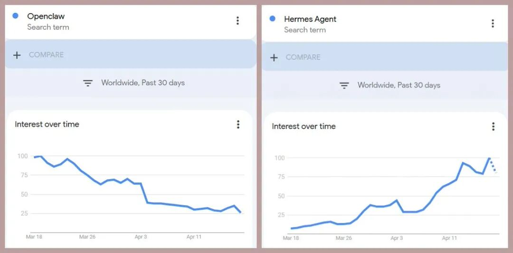
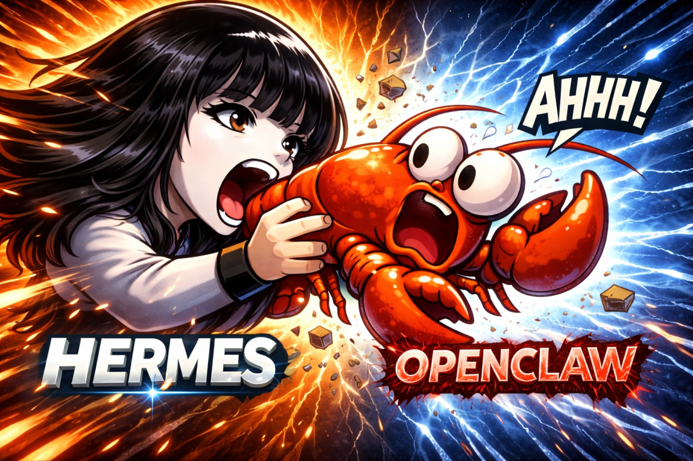

> 📎 来源: [小王的咖啡馆](https://mp.weixin.qq.com/s?__biz=MzYzNzgwNzc3MA==&mid=2247484555&idx=1&sn=463e77db2ded9fc7f56f04e92f8e2726&chksm=f168b1c8301188b78dce7ae7800125541a7397bc80d6172d466c41fb95a9124b9034c5d72dfe&mpshare=1&scene=1&srcid=0420RwPNDggLIqfkfBcvxq11&sharer_shareinfo=d6f56a7a89524b44f724745a12167135&sharer_shareinfo_first=d6f56a7a89524b44f724745a12167135) | 时间: 2026-04-20 20:45

---

**这个赛博鲨鱼正在改写 AI Agent 的规则**。

---

Hermes Agent 正在彻底碾压 OpenClaw。

8周内斩获9.9万 GitHub 星标。

没有大厂背书，没有融资消息，一个普通用户的一句话截图，就在 GitHub Trending 上把 OpenClaw 按在地上磨擦。

## 它凭什么？

99k 星是什么概念？

这个速度已经超过了绝大多数明星开源项目——不是"还不错"，是"历史级"。对比几个大家熟悉的数据：

•LLaMA 2 ：5 个月才到 10 万

•vLLM ：头半年也就几K

•OpenClaw ：我用了快半年，现在还在爬

而 Hermes 用了 8 周。

速度不是偶然。几个关键词值得细看：

**开源**。 不是"看源码需付费"，不是"社区版功能残血"——是真的开源，全部能力开放。

**本地运行**。 不依赖云端 API ，不把数据送给第三方。对于在意数据隐私的开发者来说，这是硬需求。

**记忆一切**。 区别于每次对话都是"空白上下文"的 Agent ， Hermes 有持久化记忆层，能跨 session 积累。这解决了 AI Agent 最大的使用障碍之一：用一次忘一次。

**Self-improving**。 这点最让开发者兴奋——系统能根据使用反馈自己迭代，而不是等着人工发版。

---

## OpenClaw 做错了什么？

客观说， OpenClaw 不是差产品。它有完整的工作流、有社区积累、有一批早期用户。

但它犯了几个"经典 SaaS 错误"：

**过度工程化**。 为了"团队协作"加了太多抽象层，普通开发者根本用不上。这和 AI 编程的"简洁即正义"精神背道而驰。

**记忆缺失**。 每次新建 session ， Agent 就失忆了。你得反复告诉它你是谁、你想要什么。痛苦。

**闭源锁用户**。 当用户意识到"我的 Agent 工作流数据都在别人服务器上"的时候，迁移只是时间问题。

而 Hermes 的每个特点，恰好都在打 OpenClaw 的软肋。

---

## 这件事为什么值得关注？

不是因为"又有新工具"。是因为这是 AI Agent 领域第一次出现"开源 + 本地 + 记忆"三者同时做到的产品。

这三个特性加在一起，意味着什么？

意味着任何一个人——不需要信用卡，不需要 API key ，不需要信任某个第三方——只要有一台电脑，就能运行一个真正属于自己的 AI Agent 。

这不是"另一个 ChatGPT 替代品"。这是个人 AI 基础设施的开始。

---
