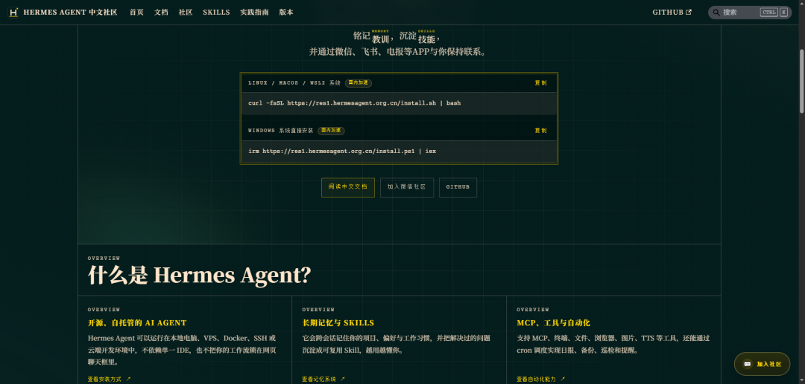

> 📎 来源: [鸿枫技术栈](https://mp.weixin.qq.com/s?__biz=MzI4NTA2MjE5OA==&mid=2247485156&idx=1&sn=11bf967b64b1505e548d68b0fd6479b6&chksm=eaec18621aeeaf3e423c23902b440bb8203527f2722a7d3764be3b9340ba7aaadcc386d9621e&mpshare=1&scene=1&srcid=0421umqOHVmUuPrW4YcxkWLo&sharer_shareinfo=8da5bb10c6d842febd1a2b93311183d4&sharer_shareinfo_first=8da5bb10c6d842febd1a2b93311183d4) | 时间: 2026-04-21 23:48

---

> 如果你还在犹豫选 OpenClaw 还是 Hermes Agent，或者已经装了 Hermes 但不知道怎么用好它——这篇文章应该能帮到你。



2026 年 2 月，Nous Research 发布了 Hermes Agent，一个"会自我进化"的开源 AI Agent 框架。不到两个月，GitHub 星标突破 35k，成为 AI Agent 赛道增长最快的项目之一。和 OpenClaw 那种"做完就走"的无状态模式不同，Hermes 的核心理念是 \*\*"the agent that grows with you"\*\*——越用越懂你，用得越久能力越强。

但说实话，很多中文用户装完之后会发现：官方文档全是英文，网上的教程要么太浅要么太散，真正能指导日常使用的高阶技巧几乎找不到。这篇文章就是想把这个缺口补上。我会从实际使用场景出发，把 Hermes Agent 最值得掌握的功能——上下文文件、记忆系统、技能体系、定时任务、安全沙箱——逐个拆开讲，同时在关键位置穿插和 OpenClaw 的对比，帮你看清两者的本质区别。

---

## 一、先说选择：Hermes Agent vs OpenClaw，到底差在哪？

很多文章喜欢用表格列一堆功能做对比，但看完还是不知道怎么选。我用一句话总结它们的根本区别：

> **OpenClaw 是"拿来主义"——有 13000+ 社区技能直接装，接上就能干活；Hermes Agent 是"自我进化"——技能是自己长出来的，用两个月后你会发现它比你更了解你的工作流程。**

具体来说，差异体现在五个核心维度：

**1. 记忆机制**

OpenClaw 的记忆依赖 Markdown 文件（SOUL.md、AGENTS.md），高级能力如向量检索需要额外装插件，本质上是"你让 AI 记什么，它才记什么"。Hermes Agent 则内置了多层原生记忆架构：

- **MEMORY.md**（约 2,200 字符上限）：存储 Agent 自动提炼的项目笔记、环境偏好、工作流规律，不需要你手动告诉它记什么
- **USER.md**（约 1,375 字符上限）：Agent 自动维护你的用户画像——角色、技术栈、沟通偏好、目标方向
- **SQLite 会话历史**：所有对话存入本地数据库，支持 FTS5 全文检索，可以搜索几周前的对话内容
- **Honcho 集成**（可选）：AI 原生的用户建模后端，通过辩证推理从长期交互中推导你的偏好和习惯

这两套记忆文件在每次会话启动时自动注入上下文，所以你不用每次重新解释"我的项目用 FastAPI、测试用 pytest、不要提交 .env"这类东西——Hermes 已经记住了。

**2. 技能体系**

OpenClaw 的技能完全依赖人工编写或从 ClawHub 社区下载，目前有 13729+ 个扩展插件，生态确实庞大。但技能不会自己变多，能力边界由你装了多少插件决定。

Hermes Agent 的技能系统走的是另一条路。每当 Agent 完成一个复杂任务——特别是中间出过错然后自己修了、走了非显而易见但有效的路径、或者你做了纠正——它会自动触发学习循环，在 

```
~/.hermes/skills/
```

 目录下生成一个标准的 SKILL.md 文件，包含完整的步骤、陷阱和验证方法。格式兼容 agentskills.io 开放标准，理论上可以和 OpenClaw 生态互通。

说得直白一点：OpenClaw 是**用现成技能**，Hermes 是**自己造技能**。

**3. 安全设计**

这个维度差距特别明显。OpenClaw 没有默认内置安全沙箱，ClawHub 上的插件质量参差不齐——根据安全研究机构的报告，高达 36.8% 的插件被查出存在严重漏洞或被投毒。"ClawHavoc"攻击事件中，恶意插件甚至直接扫荡了用户的本地目录，窃取聊天记录和钱包私钥。

Hermes Agent 从第一天起就内建了五层安全防线：

- 用户授权机制
- 危险命令审批（支持一次/会话/始终/拒绝四种策略）
- 容器隔离（支持 local、Docker、SSH、Daytona、Singularity、Modal 六种终端后端）
- MCP 凭证过滤
- 上下文文件注入扫描

截至 2026 年 4 月，Hermes Agent 没有公开记录的任何 CVE 漏洞。

**4. 成本控制**

OpenClaw 默认全量加载所有已安装技能，技能越多，每次请求携带的技能定义文本就越大，token 消耗自然就高。Hermes Agent 用了渐进式加载（Progressive Disclosure）：先只加载技能列表（约 3k token），等 Agent 真正需要某个技能时才加载完整内容。简单任务用便宜模型，复杂任务切到强模型，

```
hermes model
```

 命令可以随时切换。很多社区用户反馈"Hermes Agent 比 OpenClaw 便宜"。

**5. 消息平台覆盖**

| 平台 | Hermes Agent | OpenClaw |
| --- | --- | --- |
| Telegram | ✅ | ✅ |
| Discord | ✅ | ✅ |
| Slack | ✅ | ✅ |
| WhatsApp | ✅ | ✅ |
| Signal | ✅ | ✅ |
| 企业微信 | ✅（v0.9.0 原生支持） | ✅ |
| 飞书 | ✅ | ✅ |
| 钉钉 | ✅ | ✅ |
| 微信 | ✅（腾讯 Bot API） | ✅ |
| iMessage | ❌ | ✅ |

Hermes 走的是国际主流加密通讯平台的路线，对国内社交渠道的支持在 v0.9.0 之后快速补齐。OpenClaw 在国内平台生态上积淀更深，覆盖也更成熟。值得一提的是，Hermes 官方在宣布支持微信时专门用中文发推、用中文回复社区留言，这个细节在中文圈刷了不少好感度。

**选型建议一句话版：**

- 追求开箱即用、海量插件 → **OpenClaw**
- 追求越用越强、省心安全、低成本 → **Hermes Agent**
- 两个都用也行，技能格式可以互通，Hermes 甚至内置了 

  ```
  hermes claw migrate
  ```

   一键迁移命令

---

## 二、上下文文件：让 Agent 一进项目就"懂行"

Hermes Agent 有三个关键上下文文件，理解了它们，你就掌握了让 Agent 快速进入状态的方法。

### 2.1 AGENTS.md —— 项目规则，自动注入

在项目根目录放一个 

```
AGENTS.md
```

 文件（也兼容 

```
.cursorrules
```

 和 

```
.cursor/rules/*.mdc
```

），Hermes 启动会话时会自动读取并注入系统提示。你不用每次都跟它解释"这个项目用 Python、测试用 pytest、别碰 main 分支"。

一个典型的 AGENTS.md 长这样：

```
# 项目上下文- 这是一个 FastAPI 后端项目，使用 SQLAlchemy ORM- 所有数据库操作必须使用 async/await- 测试文件放在 tests/ 目录下，使用 pytest-asyncio- 禁止提交 .env 文件- API 路由统一使用 /api/v1/ 前缀- Git commit message 遵循 Conventional Commits 规范
```

这个机制和 Claude Code 的 CLAUDE.md、Cursor 的 .cursorrules 是同一个思路——Hermes 的 Issue #681 也明确提到，这是研究 30+ AI Agent 界面后发现的最普遍的 UX 模式。如果你已经在用 Cursor，现有的 

```
.cursorrules
```

 文件不用改，Hermes 直接就能读。

### 2.2 SOUL.md —— 人格配置，定义 Agent 的"性格"

```
~/.hermes/SOUL.md
```

 是全局人格文件，定义了 Agent 在所有项目中的行为风格。和 AGENTS.md 不同的是，SOUL.md 不是项目级的，而是跟着你走的。

```
# 灵魂You are a senior backend engineer. Be terse and direct.Skip explanations unless asked. Prefer one-liners over verbose solutions.Always consider error handling and edge cases.
```

这个文件控制的是"Agent 怎么说话"而不是"Agent 做什么"。如果你觉得 Agent 太啰嗦，或者回复风格不对胃口，改这个文件比每次在对话里纠正效率高得多。

### 2.3 .cursorrules 兼容

如果你是 Cursor 用户，不用担心配置迁移的问题。Hermes 会自动检测并读取以下位置的文件：

- ```
  .cursorrules
  ```

  （项目根目录）
- ```
  .cursor/rules/*.mdc
  ```

  （Cursor 规则目录）

不需要额外配置，也不用复制粘贴。这个兼容性设计对从 Cursor IDE 切换过来的开发者特别友好。

---

## 三、记忆系统：不是"记住对话"，而是"理解你"

很多人把 Hermes 的记忆简单理解为"聊天记录存盘"，其实远不止于此。它的记忆是一个分层体系，每一层有不同用途和不同时间跨度：

| 记忆类型 | 工作方式 | 持久性 | 最适合存储 |
| --- | --- | --- | --- |
| MEMORY.md | Agent 自主维护的笔记，~2,200 字符上限 | 永久（磁盘） | 项目细节、偏好、环境备注 |
| USER.md | Agent 自主维护的用户画像，~1,375 字符上限 | 永久（磁盘） | 角色、技术栈、沟通风格 |
| 会话历史 | SQLite + FTS5 全文索引 | 永久（磁盘） | 回溯历史对话、搜索上下文 |
| Honcho 结论 | 辩证推理推导的用户洞察 | 永久（云/自托管） | 深度用户建模、偏好模式 |
| 技能（过程记忆） | 从经验中提取的可复用能力 | 永久（磁盘） | 学到的工作流、任务流程 |
| 工作上下文 | 当前会话的对话窗口 | 仅当次会话 | 当前任务、进行中的工作 |

关键点在于"Agent 自主维护"这几个字。MEMORY.md 和 USER.md 的内容不是你手动写的，而是 Agent 根据对话模式自己决定存什么。2,200 字符的上限看起来很小，但这个限制反而迫使 Agent 只保留最重要的信息——相当于一种自动的信息压缩机制。

如果你想扩大记忆容量，可以接入 Honcho 作为外部记忆提供者，支持无限量的跨会话用户建模和语义搜索。截至 2026 年 4 月，Hermes 已支持 8 种外部记忆提供者插件，同一时间只能激活一个 alongside 内置记忆。

**实际使用技巧：**

- 不需要手动编辑 MEMORY.md 或 USER.md——让 Agent 自己管理
- 如果发现 Agent "忘记"了某些重要信息，可以在对话中强调："记住这个，以后每次都要这样处理"
- ```
  hermes memory search "关键词"
  ```

   可以快速搜索历史记忆
- ```
  hermes sessions
  ```

   可以浏览、导出、清理过去的会话记录
- Docker 部署时记得把 

  ```
  ~/.hermes
  ```

   挂载为 volume，否则容器重建会丢失记忆

---

## 四、CLI 进阶技巧：那些文档里不太提但很好用的命令

Hermes 的 CLI 设计得相当完善，支持多行编辑、斜杠命令补全和历史搜索。除了基本的 

```
hermes
```

、

```
hermes setup
```

、

```
hermes gateway
```

 之外，这些命令特别值得记住：

### 4.1 会话管理

```
hermes -c              # 恢复最近一次会话（continue）hermes -c "部署"        # 恢复标题包含"部署"的最近会话hermes -r "fix-auth"   # 按标题精确恢复某个会话（resume by title）
```

这三个命令解决了一个高频痛点：你昨天跟 Agent 聊了一半的调试任务，今天想接着来。不用重新描述上下文，直接 

```
-c
```

 就能无缝续接。

### 4.2 斜杠命令速查

在 CLI 或消息平台里输入 

```
/
```

 可以看到所有可用命令。最实用的几个：

| 命令 | 作用 | 场景 |
| --- | --- | --- |
| `/compress` | 手动压缩对话上下文 | 对话变长、token 快用完时 |
| `/verbose` | 切换工具执行进度显示 | 调试 Agent 行为时开到 verbose |
| `/model claude-sonnet-4` | 实时切换模型 | 简单任务切便宜模型，复杂任务切强的 |
| `/model provider:model` | 跨供应商切换 | 从 OpenRouter 切到本地 Ollama |
| `/usage` | 查看 token 消耗和成本 | 控制预算 |
| `/title 我的调试会话` | 给当前会话命名 | 方便以后用 `-r` 恢复 |
| `/bg ` | 后台执行任务 | 不阻塞当前对话，完成后弹出结果 |
| `/btw ` | 临时提问（不入历史） | 快速确认一个小问题，不污染对话流 |
| `/branch 分支名` | 分叉当前会话 | 想同时探索两个方案时 |
| `/plan <需求>` | 先生成计划不执行 | 复杂任务先看看 Agent 的思路对不对 |
| `/rollback [n]` | 文件系统回滚 | Agent 改坏了东西，一键还原 |

### 4.3 Context Caching 省钱技巧

LLM 的 API 定价里有一个容易被忽略的细节：如果连续请求的系统提示（system prompt）完全相同，很多模型提供商会自动命中缓存，缓存命中的 input token 价格通常比正常便宜 50% 以上。

Hermes Agent 的系统提示由固定的框架结构 + 动态的上下文文件 + 记忆文件 + 工具定义组成。要想最大化缓存命中率：

1. **保持系统提示稳定**：不要频繁修改 SOUL.md 和 AGENTS.md，改了之后缓存就失效了
2. \*\*善用 

   ```
   /compress
   ```

   \*\*：在上下文快到上限之前主动压缩，而不是等到被迫截断
3. **技能用渐进式加载**：这就是 Progressive Disclosure 的价值——不用一次性把所有技能塞进上下文

---

## 五、技能系统详解：从零创建一个自定义 Skill

### 5.1 目录结构

所有技能存放在 

```
~/.hermes/skills/
```

 目录下，这是唯一的技能来源。安装时自带一批 bundled skills，Hub 安装的和 Agent 自动创建的也放在这里。

```
~/.hermes/skills/                  # 技能根目录├── mlops/                         # 分类目录│   ├── axolotl/│   │   ├── SKILL.md               # 技能主文件（必需）│   │   ├── references/            # 参考文档│   │   ├── templates/             # 模板文件│   │   └── scripts/               # 脚本文件│   └── training-monitor/│       └── SKILL.md└── my-category/    └── my-skill/        ├── SKILL.md        └── config.yaml
```

### 5.2 SKILL.md 格式

```
---name: my-skilldescription: 简述这个技能做什么version: 1.0.0platforms: [macos, linux]          # 可选：限制平台metadata:  hermes:    tags: [python, automation]    category: devops    fallback_for_toolsets: [web]   # 仅在 web 工具集不可用时显示    requires_toolsets: [terminal]  # 仅在 terminal 工具集可用时显示    config:                        # 可选：非敏感配置项    - key: wiki.path      description: "Wiki 目录路径"      default: "~/wiki"      prompt: "请输入 Wiki 目录路径"---# 技能标题## When to Use触发条件——什么场景下应该用这个技能。## Procedure1. 第一步：做什么2. 第二步：做什么## Pitfalls- 已知的失败模式和修复方法## Verification怎么确认技能执行成功了。
```

### 5.3 渐进式加载（Progressive Disclosure）

这是 Hermes 技能系统最精巧的设计之一。技能不是一次性全部塞进上下文的，而是按需加载：

```
Level 0: skills_list()           → [{name, description, category}, ...]   (~3k tokens)Level 1: skill_view(name)        → 完整内容 + 元数据                       (不定)Level 2: skill_view(name, path)  → 加载特定的参考文件                       (不定)
```

Agent 先拿到技能列表（Level 0，约 3k token），判断需要哪个技能后才加载完整内容（Level 1）。如果技能还引用了外部文件（比如模板或脚本），再按需加载（Level 2）。这比 OpenClaw 全量加载所有技能省 token 多了。

### 5.4 条件激活（Fallback Skills）

技能可以根据当前可用的工具自动显示或隐藏。一个实际例子：内置的 

```
duckduckgo-search
```

 技能设置了 

```
fallback_for_toolsets: [web]
```

。如果你配了 

```
FIRECRAWL_API_KEY
```

，web 工具集可用，Agent 用 

```
web_search
```

 做搜索，DuckDuckGo 技能自动隐藏。如果 API Key 没配，web 工具集不可用，DuckDuckGo 技能就自动冒出来作为替代方案。

这个机制的好处是：你可以给同一类任务准备"高级方案"和"备选方案"，不用手动切换。

### 5.5 安全的环境变量管理

技能可以在 SKILL.md 里声明所需的环境变量：

```
required_environment_variables:  - name: TENOR_API_KEY    prompt: Tenor API key    help: 从 https://developers.google.com/tenor 获取    required_for: full functionality
```

当缺少对应值时，Hermes 只在本地 CLI 安全地询问你（消息平台不会在聊天里问敏感信息）。一旦设置好，这些环境变量会自动传递给 

```
execute_code
```

 和 

```
terminal
```

 沙箱，技能脚本可以直接用 

```
$TENOR_API_KEY
```

。

---

## 六、定时任务实战：搭建一个每日 AI 新闻简报机器人

Hermes 内置了 cron 调度器，不需要额外装任何东西。下面用一个真实场景演示完整流程：**每天早上 8 点，自动搜索 AI 新闻并发送到 Telegram**。

### 6.1 启动调度器

```
hermes cron start
```

### 6.2 创建定时任务

两种方式都行：

**方式一：用斜杠命令**

```
/cron add "0 8 * * *" "搜索今天最重要的 AI 新闻，总结为 5 条要点，用中文回复"
```

**方式二：用自然语言**

```
每天早上 8 点给我发一份 AI 新闻简报
```

Agent 会自动解析你的意图并创建 cron job。

### 6.3 其他常用操作

```
hermes cron list          # 查看所有定时任务hermes cron status        # 查看调度器状态和下次执行时间/cron pause           # 暂停某个任务/cron resume          # 恢复暂停的任务/cron run             # 立即执行一次（测试用）/cron remove          # 删除任务
```

### 6.4 进阶：工作日 standup 报告

```
/cron add "45 8 * * 1-5" "Review my git log for the last 24 hours and draft a standup update: what I did yesterday, what I'm doing today, any blockers."
```

```
1-5
```

 表示只在周一到周五执行。

### 6.5 重要注意事项：Cron 任务的"自包含"原则

定时任务在独立的会话中运行，**无法访问当前对话的上下文**。所以 cron 任务的 prompt 必须是自包含的（self-contained），把所有必要信息都写在 prompt 里，不要依赖"Agent 应该知道我之前说过什么"。

例如，不要这样写：

```
帮我整理昨天讨论的那个 bug 的进展
```

应该这样写：

```
查看 ~/projects/myapp 目录下最近 24 小时的 git log，总结代码变更和 bug 修复进展，生成 standup 报告。
```

### 6.6 平台投递

如果你从 Telegram 创建了 cron job，结果会自动发回同一个 Telegram 聊天。你也可以在创建时指定投递平台：

```
/cron add "0 7 * * *" "生成天气简报并发送到我的 Telegram"
```

### 6.7 子 Agent 委派：并行处理复杂任务

如果定时任务需要同时做几件独立的事情，可以用 

```
delegate_task
```

 创建子 Agent 并行处理：

```
每天早上 8 点，同时做三件事：1. 搜索 AI 新闻并总结2. 检查我的 GitHub 仓库有没有新的 issue3. 查看今天的日程安排把结果合并成一份早报发给我
```

Hermes 会把三个子任务分配给隔离运行的子 Agent，并行执行后合并结果。

---

## 七、安全实践：让 Agent 跑起来但不"跑偏"

### 7.1 终端后端选择

Hermes 支持六种终端后端，安全级别从低到高：

| 后端 | 安全级别 | 适用场景 |
| --- | --- | --- |
| `local` | 低（直接执行） | 个人开发机，信任环境 |
| `docker` | 中（容器隔离） | 推荐大多数用户使用 |
| `ssh` | 中（远程隔离） | VPS 或远程服务器 |
| `daytona` | 高（无服务器持久化） | 企业级，空闲自动休眠 |
| `singularity` | 高（HPC 场景） | 超算集群 |
| `modal` | 高（无服务器） | 弹性计算 |

配置 Docker 后端：

```
# .env 或 hermes setup 中配置TERMINAL_BACKEND=dockerTERMINAL_DOCKER_IMAGE=hermes-sandbox:latest
```

Docker 模式下，Hermes 采用"容器硬化"策略：只读根文件系统、最小权限、命名空间隔离。文件系统操作默认限定在挂载的工作目录内。

### 7.2 危险命令审批

当 Agent 要执行可能危险的操作时（比如 

```
rm -rf
```

、

```
sudo
```

、修改系统文件），Hermes 会弹出审批提示，提供四种策略：

- **一次（once）**：这次允许
- **会话（session）**：本次会话内同类命令都允许
- **始终（always）**：以后同类命令都放行
- **拒绝（deny）**：不允许

如果你完全信任 Agent（比如在沙箱环境里），可以用 

```
--yolo
```

 参数或 

```
/yolo
```

 命令跳过所有审批，但不建议在生产环境这么做。

### 7.3 消息平台安全

接入 Telegram 或企业微信时，建议配置用户白名单：

```
# .envTELEGRAM_ALLOWED_USERS=123456789,987654321
```

这样只有指定用户才能跟 Agent 对话。Hermes 还支持私聊配对机制：用户通过特定的配对码注册身份，未注册的用户发送的消息会被忽略。

### 7.4 上下文文件注入扫描

Hermes 会扫描 AGENTS.md、SOUL.md 等上下文文件中是否包含 prompt injection 攻击向量。这是一个经常被忽略但至关重要的安全层——如果你的项目中有第三方贡献者提交的 AGENTS.md，这个扫描可以防止恶意指令被注入到 Agent 的系统提示中。

---

## 八、从 OpenClaw 迁移：三步搞定

如果你之前在用 OpenClaw，Hermes 提供了一键迁移工具：

```
hermes claw migrate
```

这个命令会检测 

```
~/.openclaw
```

 目录，把你的技能、上下文文件、工作流配置全部迁移过来。Hermes 首次安装时也会自动检测 OpenClaw 的存在并提示迁移。

迁移完成后，原来的 OpenClaw 配置不会被删除，所以你可以两个都留着对比使用。agentskills.io 格式的技能文件在两个平台之间是互通的。

---

## 九、中文社区资源

Hermes Agent 的官方文档虽然是英文的，但中文社区已经相当活跃：

- **中文社区官网**：hermesagent.org.cn —— 全中文文档体系，覆盖安装指南（含 Windows / WSL2 / Android Termux）、快速入门、核心能力详解、消息平台配置等
- **中文 WebUI**：github.com/Web3CZ/Web3Hermes —— 全程汉化的浏览器管理界面，和 CLI 功能完全对等
- **飞书用户群**：超过 550 人的中文用户群，每天都有活跃的问答和案例分享
- **CSDN / 掘金 / 知乎**：搜索"Hermes Agent"可以找到大量中文教程

如果你是刚开始接触 Hermes Agent，建议的路线是：先看中文社区的快速入门指南装起来 → 配好模型 → 试着用 CLI 聊几轮 → 接一个消息平台（推荐 Telegram 或飞书）→ 设置第一个 cron 定时任务 → 等待 Agent 自动生成第一个 Skill。整个流程大约 1-2 小时就能走完。

---

**最后的建议**：Hermes Agent 最大的价值不在于某个单一功能，而在于"时间复利"。第一天用和第三十天用，体验是完全不同的——因为 Agent 在这段时间里积累了你的工作习惯、项目上下文、常用操作模式，并且把这些全部转化为了可复用的技能。这种"越用越强"的特性，是 OpenClaw 的"做完就走"模式做不到的。

如果你已经决定试试，hermesagent.org.cn 是最好的中文起点。


