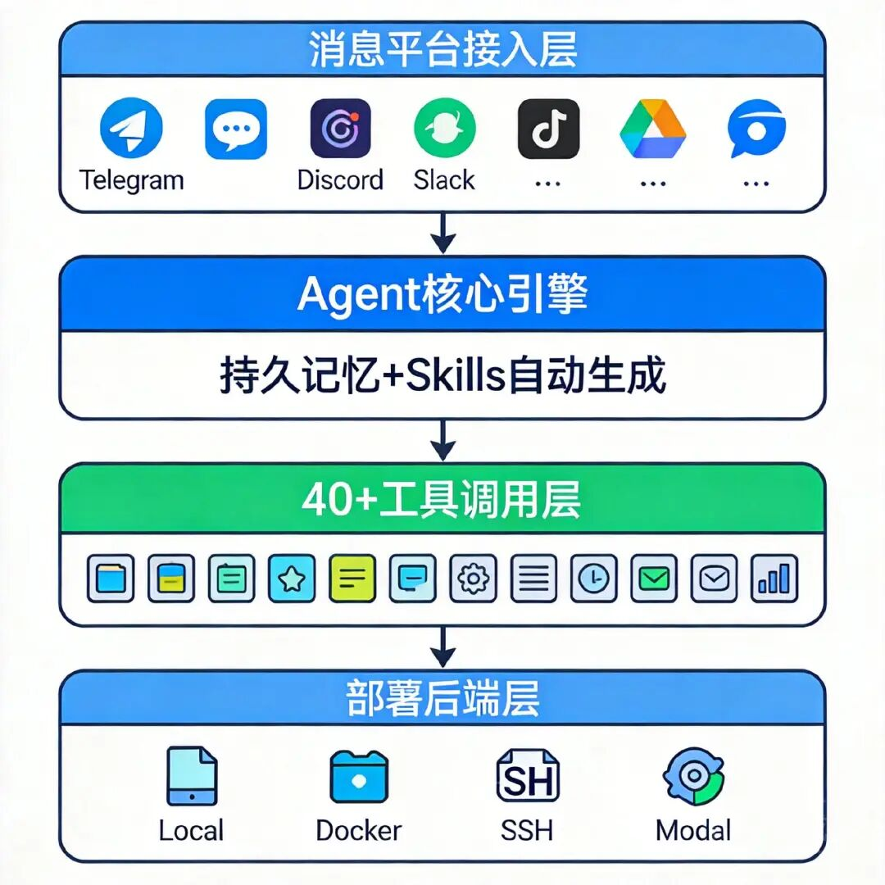

> 📎 来源: [前端前沿技术](https://mp.weixin.qq.com/s?__biz=MzA5NzU3Mzc1Nw==&mid=2247495836&idx=1&sn=e1595ede6a3796d3cf6cd9939c62fd55&chksm=910e3b2cde3e79f8d0f97660968fed6869e05462d0c85d7dbb59612cfc6588fa92616c9fb0af&mpshare=1&scene=1&srcid=04216wrs0RvnPEsRPIj9olwg&sharer_shareinfo=d08e928cb47690a3f4f2a00bd219622d&sharer_shareinfo_first=d08e928cb47690a3f4f2a00bd219622d) | 时间: 2026-04-21 21:13

---

**Hermes Agent 是由 Nous Research 打造的开源自主 AI Agent，支持一行命令安装，可在 Linux、macOS、WSL2 和 Termux 上直接运行。** 与依赖框架的 Agent 方案不同，Hermes Agent 内置自学习循环，能自主创建技能、优化自身行为，并通过 Telegram、Discord、Slack 等 6 大平台网关统一接入。截至 2026 年 4 月，该项目在 GitHub 上已获得 **52,800 Stars**，最新版本为 v0.8.0（2026 年 4 月 8 日发布）。



# Hermes Agent 是什么？

**Hermes Agent（项目标志 ☤）是 Nous Research 旗下的自主 AI Agent 应用层，与 Hermes 系列大模型配套但不强绑定。** 它的设计目标是"可独立部署的 Agent"，而非某个 Agent 框架的插件。

Nous Research 是美国开源 AI 运动的重要参与机构，其旗舰模型 Hermes 3（基于 Llama-3.1 70B 微调，技术报告 arxiv:2408.11857）专门针对函数调用和结构化输出进行了优化。Hermes Agent 正是在此基础上构建的应用层，继承了模型的工具调用能力。

**Hermes Agent 的三个核心差异点：**

| 维度 | Hermes Agent | 典型 Agent 框架 |
| --- | --- | --- |
| 部署方式 | 一行 curl 安装，无需配置环境 | 需手动安装依赖、配置环境变量 |
| 执行后端 | 支持 6 种（local/Docker/SSH/Daytona/Singularity/Modal） | 通常绑定本地或单一云平台 |
| 自我进化 | 内置自学习循环，自主创建技能 | 需人工维护 prompt 和工具链 |

# 系统要求

在安装前确认以下环境满足要求：

- **操作系统**：Linux（主流发行版）、macOS、Windows WSL2、Android Termux
- **Python**：3.10+
- **内存**：建议 4GB+（本地运行 Hermes 模型需 16GB+）
- **网络**：需访问 GitHub 及选定的 LLM 提供商 API

# 安装 Hermes Agent：一行命令完成

### 标准安装（推荐）

```
# 一行命令完整安装
```

安装脚本自动完成：Python 依赖安装、路径配置、初始化向导触发。

### 验证安装

```
hermes --version
```

### 手动安装（网络受限环境）

```
git clone https://github.com/NousResearch/hermes-agent.git
```

# 配置 Hermes Agent：逐步完成

安装后首次运行会进入交互式配置向导，也可通过以下子命令单独配置各模块：

### Step 1：运行完整配置向导

```
hermes setup
```

`hermes setup` 会依次引导完成 LLM 提供商选择、工具启用和网关配置。

### Step 2：选择 LLM 模型

```
hermes model
```

Hermes Agent 支持以下 LLM 提供商，无需修改代码即可切换：

| 提供商 | 说明 |
| --- | --- |
| Nous Portal | 官方 Hermes 系列模型（推荐，原生支持函数调用） |
| OpenRouter | 接入 200+ 模型，包括 Claude、GPT、Gemini |
| OpenAI | GPT-4o、GPT-4o-mini 等 |
| Kimi | 国内可用，支持长上下文 |
| MiniMax | 国内多模态模型 |

> **提示**：如需在国内网络环境接入多个模型并统一管理 API Key，可通过兼容 OpenAI 标准接口的中间层服务（如七牛云 MCP 服务）实现模型路由，无需本地部署即可构建 Agent 应用。

### Step 3：配置工具

```
hermes tools
```

启用/禁用内置工具模块，包括：文件操作、Shell 执行、网络请求、浏览器控制等。

### Step 4：配置消息网关（可选）

```
hermes gateway setup
```

支持将 Hermes Agent 接入以下平台，实现跨平台统一调用：

- Telegram
- Discord
- Slack
- WhatsApp
- Signal
- CLI（本地命令行）

### Step 5：单项配置修改

```
# 修改单个配置项
```

# 六种执行后端配置

Hermes Agent 支持在不同计算环境中执行任务，通过 `hermes setup` 或配置文件指定：

| 后端 | 适用场景 | 配置方式 |
| --- | --- | --- |
| local | 本地开发调试 | 默认，无需额外配置 |
| docker | 隔离执行环境 | 需安装 Docker，hermes config set backend docker |
| ssh | 远程服务器执行 | 配置 SSH 密钥和目标主机 |
| daytona | 无服务器持久化（$5/月 VPS 可运行） | 注册 Daytona 账号后授权 |
| singularity | HPC 高性能计算集群 | 需 Singularity 环境 |
| modal | 云端函数执行 | 需 Modal 账号和 token |

# 自动化任务：内置 Cron 调度器

Hermes Agent 内置调度器，支持用自然语言定义定时任务：

```
# 示例：每天早 8 点总结昨日邮件
```

# Hermes Function Calling：函数调用子框架

对于需要在代码中直接集成 Hermes 函数调用能力的开发者，Nous Research 提供了独立的函数调用框架 hermes-function-calling（1,300 ★）。

### 安装

```
git clone https://github.com/NousResearch/hermes-function-calling.git
```

### 基本使用：定义工具函数

```
# functions.py 中添加自定义工具
```

### 调用示例（ChatML 格式）

```
# 模型默认：NousResearch/Hermes-2-Pro-Llama-3-8B
```

# Hermes 3 模型本地部署（进阶）

如需在本地运行 Hermes 3 模型（而非调用外部 API），以下为主要方式：

### 方式一：HuggingFace Transformers

```
from transformers import AutoTokenizer, LlamaForCausalLM
```

### 方式二：vLLM 高性能推理服务

```
pip install vllm
```

### 方式三：GGUF 量化版本（低显存设备）

```
# 通过 llama.cpp 运行量化版
```

**可用量化版本：**

- NousResearch/Hermes-3-Llama-3.1-70B-GGUF（llama.cpp 适用）
- NousResearch/Hermes-3-Llama-3.1-70B-FP8（高性能 GPU 适用）

## 从 OpenClaw 迁移到 Hermes Agent

Hermes Agent 原生支持从 OpenClaw 自动迁移，执行以下命令：

```
hermes migrate --from openclaw
```

迁移内容包括：

- SOUL.md（Agent 身份配置）
- 记忆（Memory）
- 已安装的技能（Skills）
- API Key 配置

## Hermes Agent vs 同类 Agent 框架对比

| 特性 | Hermes Agent | AutoGPT | CrewAI | OpenClaw |
| --- | --- | --- | --- | --- |
| GitHub Stars | 52,800 ★ | ~169k ★ | ~28k ★ | — |
| 安装方式 | 一行 curl | pip install | pip install | 云镜像/桌面端 |
| 自学习循环 | 是 | 否 | 否 | 否 |
| 消息平台网关 | 6 种 | 否 | 否 | 9 种（Linclaw） |
| 执行后端 | 6 种 | 本地为主 | 本地为主 | 云端 |
| 国内模型支持 | Kimi、MiniMax | 有限 | 有限 | 丰富 |
| 技能生态 | agentskills.io | 插件系统 | 工具链 | LinSkills（16+ 精选） |

# 常见问题

**Q：Hermes Agent 安装后找不到 hermes 命令怎么办？**

安装脚本会将可执行文件路径写入 ~/.bashrc。执行 source ~/.bashrc 重新加载环境变量，或关闭终端重新打开。如果仍然找不到，检查 ~/.local/bin 是否在 PATH 中：echo $PATH | grep local。

**Q：Hermes Agent 必须使用 Hermes 系列模型吗？**

不必须。Hermes Agent 支持通过 OpenRouter 接入 200+ 模型，包括 Claude、GPT-4o、Gemini 等。只有 hermes-function-calling 子框架在使用函数调用时对 Hermes 模型有优化，其他功能与模型无关。

**Q：在 $5/月 VPS 上能正常运行吗？**

可以运行 Hermes Agent 应用层（不含本地模型推理）。通过配置 Daytona 后端 + 外部 LLM API，Agent 的内存占用很低，可在 1 核 1GB 内存的 VPS 上稳定运行。本地推理 Hermes-3-70B 需要 48GB 显存，不适合 VPS。

**Q：如何让 Hermes Agent 在 Telegram 上响应消息？**

执行 hermes gateway setup，选择 Telegram，输入通过 @BotFather 创建的 Bot Token 即可。配置完成后 hermes start，Agent 将在后台监听 Telegram 消息。

**Q：hermes-function-calling 和 Hermes Agent 的关系是什么？**

两者是独立项目。hermes-function-calling（1,300 ★）是专为 Hermes 模型优化的函数调用 SDK，适合开发者在代码中集成工具调用能力；Hermes Agent（52,800 ★）是面向最终用户的完整 Agent 应用，内部集成了函数调用能力，无需单独使用 SDK。

# 总结

Hermes Agent 是目前 GitHub 上 Stars 增速最快的开源 Agent 项目之一，其核心优势在于一行安装、模型无关、自我进化三点结合。 v0.8.0 版本（2026 年 4 月 8 日）进一步完善了多平台网关和 Atropos RL 训练数据集成，标志着该项目从"可用"迈向"生产就绪"。

根据 Nous Research 官网披露，Hermes 4 已在最新基础设施（hermes4.nousresearch.com）上运行，对应 Agent 版本更新预计随后发布。
