> 📎 来源: [AI编程瓜哥](https://mp.weixin.qq.com/s?__biz=Mzk5MDcyODQ2Mw==&mid=2247493784&idx=1&sn=6552de8d94bb9d6fbdd17febd299b7ba&chksm=c42672aabb2fffd5c71612737e8db65d2c80a3518d1d703433fc2600f30de991d2d6bdfe6ee4&mpshare=1&scene=1&srcid=0429m1a47QepFoeWoZoJ4SKV&sharer_shareinfo=8cf1c23d340b78ebc8aec034523ffaff&sharer_shareinfo_first=8cf1c23d340b78ebc8aec034523ffaff) | 时间: 2026-04-29 11:54

---

> 大家好！我是瓜哥。前互联网技术副总裁，现在带队死磕 AI 编程。

Hermes Agent 入门教程继续。

很多人问我：瓜哥，现在 AI 编程工具（CC/Codex/Cursor）已经很强了，为什么还要折腾 Hermes Agent？

原因很简单，因为OpenClaw 和 Hermes Agent 这类智能体，能长在你的手机里。

一旦将智能体接入飞书这种通讯软件，你就拥有了一个 7X24 小时、随叫随到的私人 AI 助手。无论是下班路上还是在咖啡厅，只要能发消息，它就能帮你干活。

前两期分别介绍了，Hermes 的安装和 Web UI 配置后。

今天直接上硬菜：如何让 Hermes 与飞书完美对接。


### 往期回顾

Hermes 安装：[Hermes Agent 新手入门：个人自进化 AI 助手，第一步怎么走？](https://mp.weixin.qq.com/s?__biz=Mzk5MDcyODQ2Mw==&mid=2247493598&idx=1&sn=6ef6bc323f7c9d39cf973c1d4f96dd34&scene=21#wechat_redirect) 

Hermes Web UI：[Hermes Agent 入门第二弹：原厂 UI 丑到哭，换上这款国产看板瞬间爱上！](https://mp.weixin.qq.com/s?__biz=Mzk5MDcyODQ2Mw==&mid=2247493727&idx=1&sn=d7506647f85f028bf89bc194ff9385f5&scene=21#wechat_redirect)

---

这种超级干货，强烈建议先收藏再阅读！了解更多 AI 编程实战技巧，点 '关注' 上车！文末领隐藏福利~

---

⚡️ 省流版清单

1. 运行 hermes setup 选快速模式
2. 配置 Minimax 或 Claude 的 API Key
3. 在飞书开放平台新建机器人并开启 IM 权限
4. 复制会话 ID 到终端完成配对
5. 重启 Gateway 并执行授权命令

## 01 / Hermes 接入飞书 - 保姆级喂饭教程

首先，在终端运行设置命令。

别怕命令行，整个配置过程都已经 “ **步骤化** ” 了，跟着一路下一步就行。

```
hermes setup
```

#### ① 选择快速设置模式

启动后，我们选 【Quick setup】（快速设置），回车直接进入。

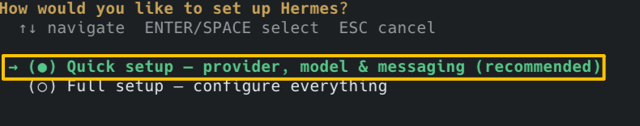

#### ② 模型设置

进入到模型配置页面，我自己用的是 Minimax 的 Coding Plan。土豪请直接配置你的Claude Opus / GPT 5.5 哈。

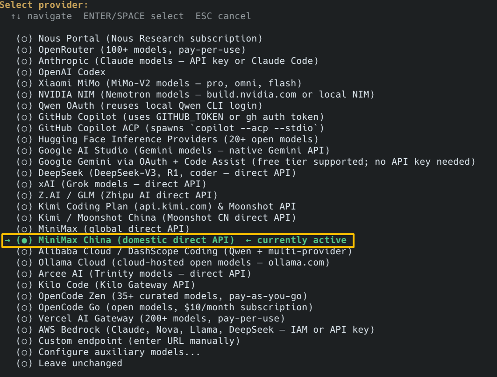

选择模型后，输入你的 API Key，继续

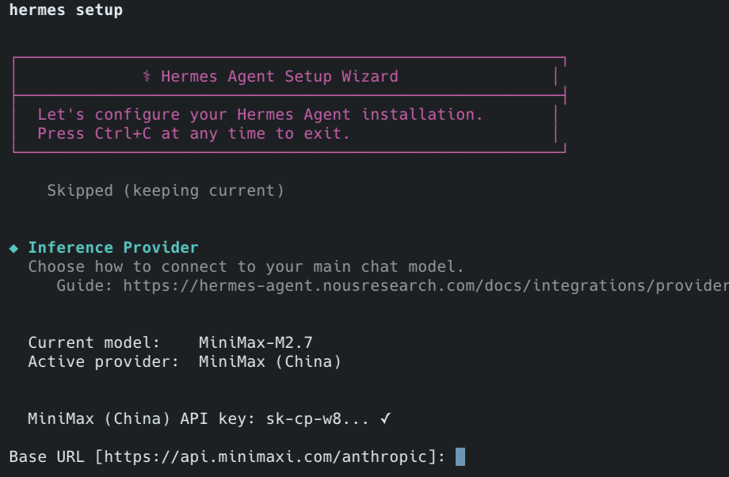

选择具体的模型，我就直接选最新的 M2.7

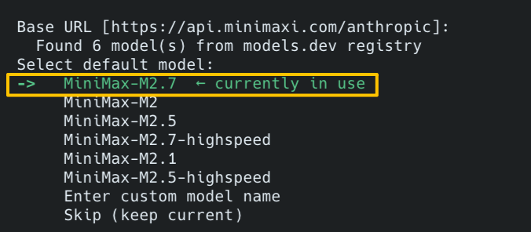

#### ③ 配置飞书

选择【Set up messaging now】，现在就配置消息通道。

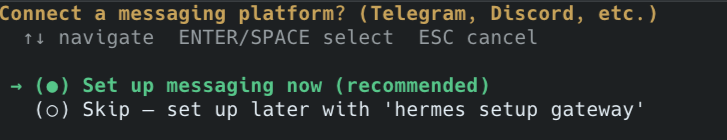

在列表中选择【Feishu / Lark】

*tips：国内版本叫飞书，海外版本叫Lark*

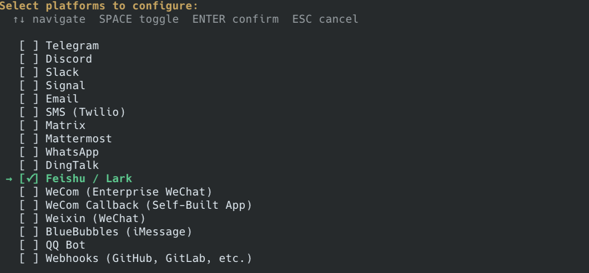

直接选【Create a new bot】，创建一个新的飞书机器人

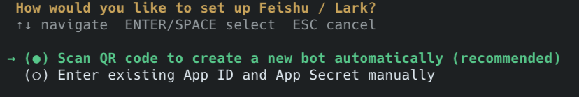

这时候屏幕会跳出链接

用手机扫描，或直接复制到浏览器，打开飞书开放平台

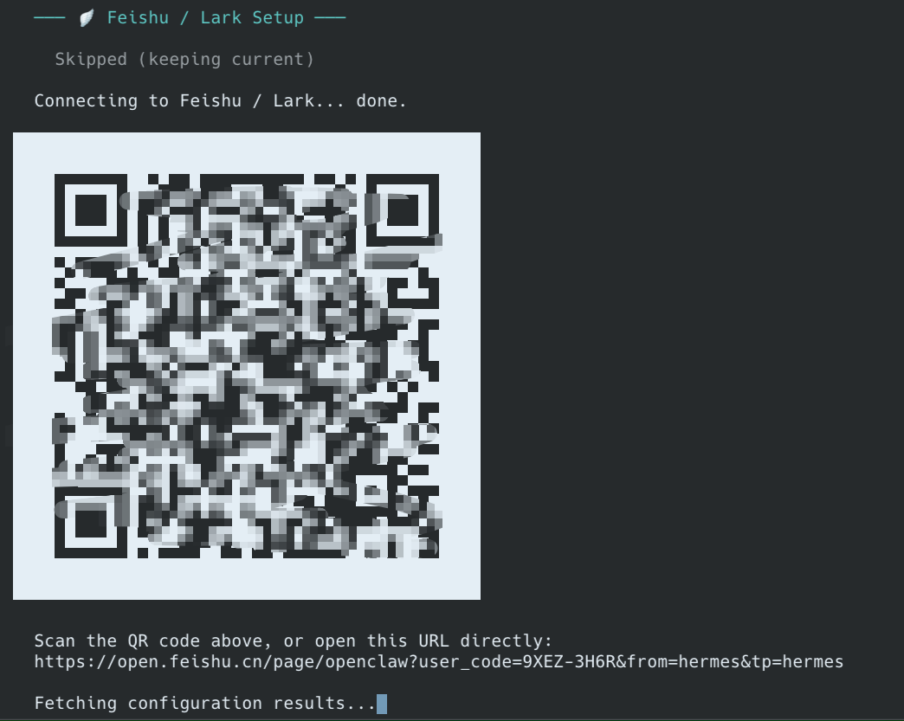

输入机器人名字，比如 '我的 Hermes 助手'，点击【立即创建】

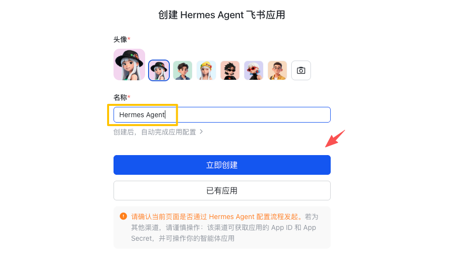

稍作等待，大概几秒钟就好了


看到这个界面，你的飞书机器人就创建成功了！


回到终端，选择【Use DM pairing approval】。

这步是为了安全，使用私信配对审批。

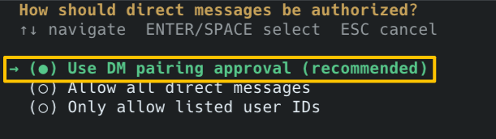

设置群聊权限，推荐选【仅在群内被 @ 时才回复】，防止它在群里token消耗被拉爆。

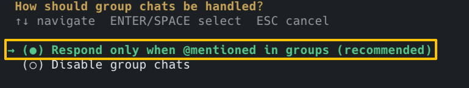

接下来是关键一步：设置主会话 ID，用于定时任务、消息通知。

在刚才创建机器人的网页，点击【打开应用】


进入飞书 App，找到刚创建的机器人，复制会话 ID

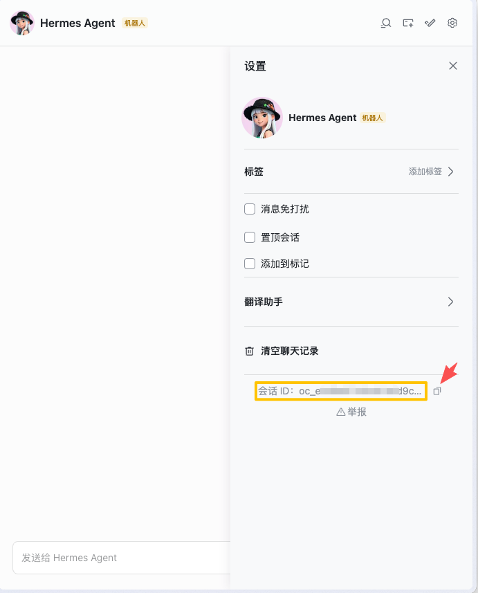

把这串字符粘贴回终端，回车！


看到绿色打钩，飞书通道就算打通了。但这还没完，最后需要重启一次 Hermes Agent 网关。

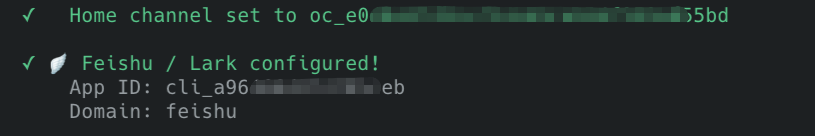


恭喜你，设置成功！

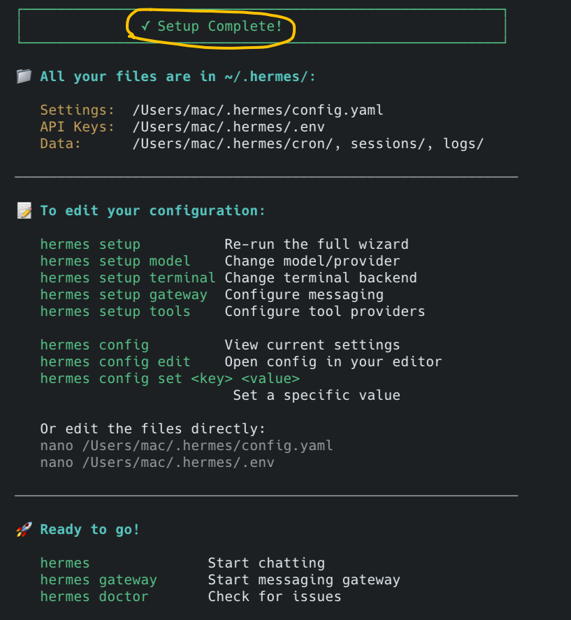

去飞书里随便发个消息，提示我们还未注册。

别慌，这是前面说的安全机制，复制这条命令到终端执行。

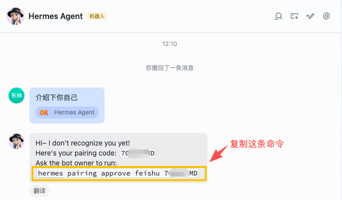

授权通过！从此以后，这个飞书机器人就是你的私人助手了。

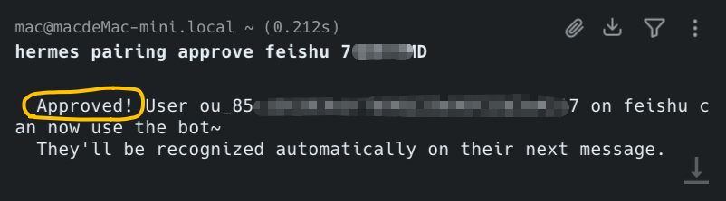

再次回到飞书IM，Hermes Agent 已经对第一条消息进行回复。

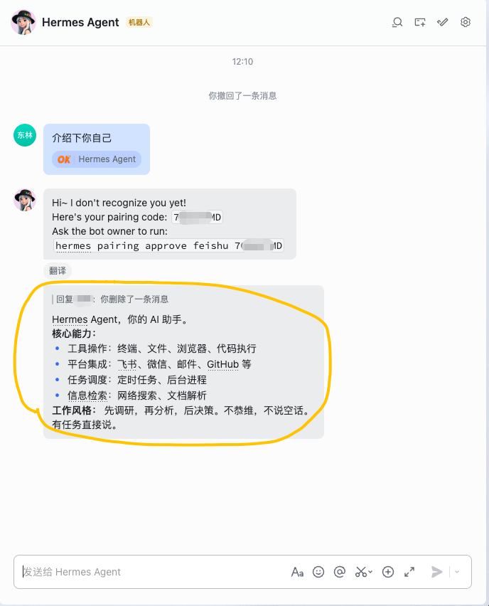

接下来，就快乐的玩耍起来吧。

## 02 / 实测感受

因为有配置向导，整个 Hermes Agent 配置的过程不算难，大概 15 分钟搞定。

分享过程里的两个小技巧：

#### ① 英文看不懂

我也常碰到看不懂的英文，解决方案很简单：开两个窗口，一个跑Hermes Agent 的终端，一个豆包，直接复制英文到豆包翻译，了解清楚内容后，继续下一步。

#### ② Token烧不起

这类智能体为了实现较好的记忆能力，Memory（记忆） 和 Context（上下文）持续增长，如果新手小白不会设置记忆管理和上下文压缩，而且你的大模型还是按API 用户付费，那是真烧不起。

现在不是有很多国产模型厂商都出了Coding Plan（固定费用），比如这个 Minimax 包年，最便宜一档，290元/年，合着24元/月。这是不是就问题不大了。

这不是广告哈，大家自己去找找这种包月包年的套餐。

我只想表达，玩这类智能体，别走API用量计费，走包年包月哈。

## 03 / 下期预告

今天咱一步步，把 Hermes Agent 接入到了飞书。

我知道很多朋友，是不用飞书的，更是更希望在微信里玩，我懂~

下一期，我带大家搞定 Hermes Agent 如何接入个人微信。

点个关注，别错过下期更新！

---

能看到这里的，都是对效率有极致追求的硬核玩家。不妨点个 **'关注'** 和 **'在看'** ，给我继续更新一点支持！

## 🎁 福利领取

送你一份价值 **399元** 的《Hermes Agent 胚胎级喂饭手册》。点个 **‘关注’**，私信回复**「hermes」**，即可免费获取！

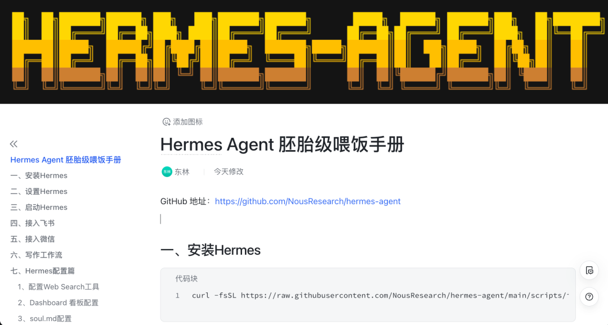

## 🚀 加入 AI 探索者社区

别再一个人摸索了，技术迭代这么快，圈子很重要。

扫码进核心交流群。与 **300+** AI 编程高手/爱好者一起，把 '**会用 AI**' 变成真正的竞争力！


## 📚 阅读更多

[有好内容，没好图？我用一个 Skill 治愈你](https://mp.weixin.qq.com/s?__biz=Mzk5MDcyODQ2Mw==&mid=2247493558&idx=1&sn=07eda4db980e5289c54ed885a495a968&scene=21#wechat_redirect)

[给你的小龙虾盖个房：推荐 4 套热门开源 Openclaw 的可视化看板，用上就回不去了！](https://mp.weixin.qq.com/s?__biz=Mzk5MDcyODQ2Mw==&mid=2247493523&idx=1&sn=1c97d2546209528614b976c4d99ee068&scene=21#wechat_redirect)

[极度简化！从 2500+ 接口到  19 个Skill，飞书 CLI 正在补齐智能体，最后一块办公拼图！](https://mp.weixin.qq.com/s?__biz=Mzk5MDcyODQ2Mw==&mid=2247493435&idx=1&sn=59458b13858bbd6897c9f7f5b294e735&scene=21#wechat_redirect)
