> 📎 来源: [智能时代指南针](https://mp.weixin.qq.com/s?__biz=MzkwMzQzNzQ2OQ==&mid=2247484164&idx=1&sn=5445e15e0611f70aa963a640acb3d9ee&chksm=c19a40ad04f29080baef706b550549de9b237d052eae351543bad7b9ab66efaba234cc3c7eb8&mpshare=1&scene=1&srcid=0427nsgY8Jv0IUb148l8HBEs&sharer_shareinfo=639aad1f1bc7fc870dde23681efa69b1&sharer_shareinfo_first=639aad1f1bc7fc870dde23681efa69b1) | 时间: 2026-04-27 16:19

---

Hermes Agent 不是装完包就能直接跑起来的工具。新手最容易卡住的地方，不在命令本身，而在虚拟环境、API Key、辅助模型、记忆、通道和 skill 的配置顺序。

简单说，Hermes Agent 是一个面向日常工作流的 AI agent 框架。它可以接入大模型、调用工具、记住用户偏好、连接聊天软件，也可以通过 ACP 接进 IDE，帮你把“对话里的想法”变成可执行的开发、整理和自动化任务。

我对照 AGENTS.md 和社区反馈，把 10 个最常见的配置坑整理成一条入门路径。你可以把它当成第一次安装 Hermes Agent 前的检查清单。

## 一、Hermes Agent 安装：先激活 venv

很多人第一步就会敲：

BASH

```
pip install hermes⁠-⁠agent
```

这条命令本身没错，问题是它经常装错地方。AGENTS.md 明确要求：运行 Python 前必须先激活虚拟环境。

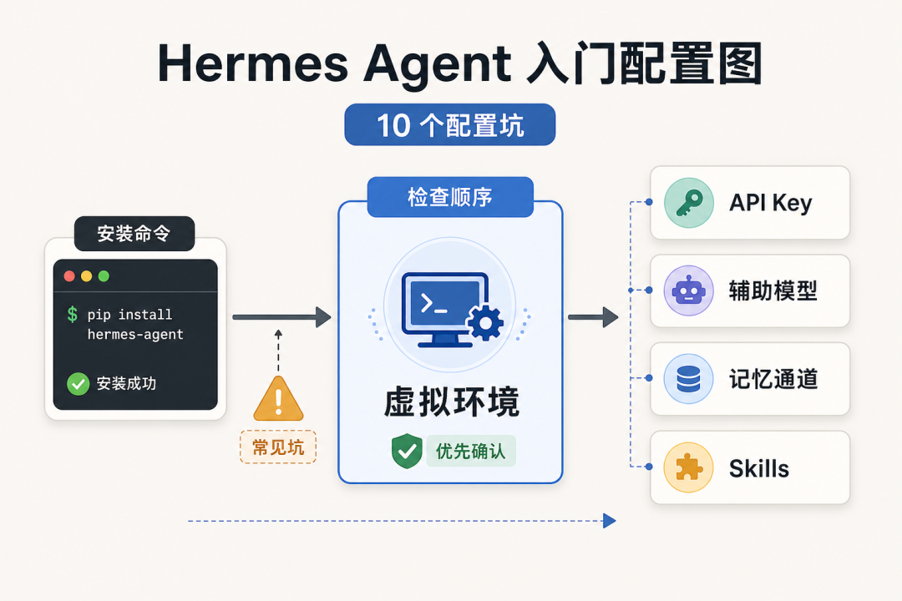

更稳的顺序是：

BASH

```
python3 -⁠m venv .⁠venvsource .⁠venv⁠/⁠bin⁠/⁠activatepip install hermes⁠-⁠agent
```

这里有三个隐性门槛：Python 版本、pip 路径、虚拟环境激活顺序。只要 venv 没激活，包就可能装到系统 Python，后面 import 全部报错。

## 二、API Key 配置：config.yaml 和 .env 缺一不可

很多教程只提醒你改 ~/.hermes/config.yaml，但它只解决 provider 和模型选择。

Hermes Agent 入门：config.yaml 和 .env 两步配置

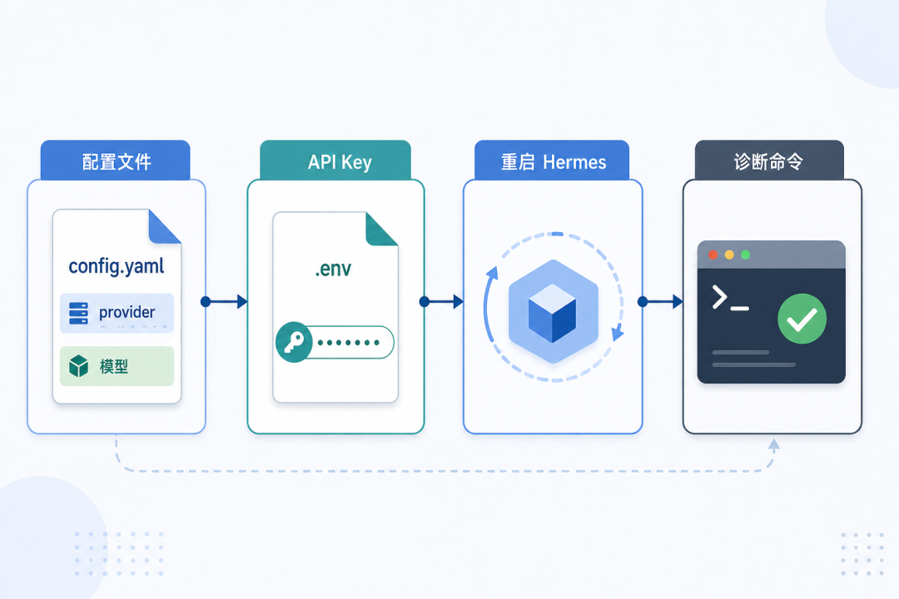

真正放 API Key 的入口通常是 .env。AGENTS.md 里定义的 OPTIONAL\_ENV\_VARS，每个变量都有 prompt、url、password 字段，说明 Hermes 会把凭证配置当成独立步骤处理。

新手可以按这个顺序检查：

1. config.yaml 写清楚 provider 和模型
2. .env 写对应 provider 的 API Key
3. 重启 Hermes，再跑一次诊断命令

少了任何一步，都可能出现认证错误。

## 三、辅助模型配置：别只配一个 LLM

Hermes 里有一个容易被忽略的配置：auxiliary\_client。

Hermes Agent 入门：主模型和辅助模型分工

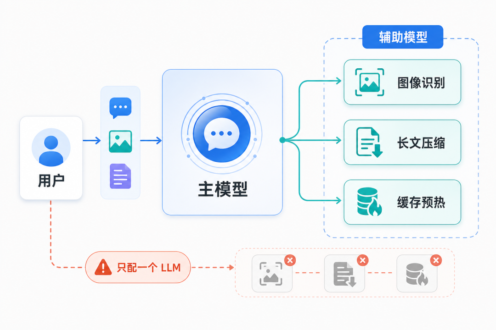

主模型负责核心对话，辅助模型负责图像识别、长文压缩、缓存预热等边缘任务。只配置一个主模型，短对话可能没问题，但一旦涉及图片、总结或长上下文，就容易报错或超 token。

实用配置思路是：主模型用能力强的，辅助模型用性价比高的。这样既能保证关键任务质量，也能控制成本。

## 四、SOUL.md 配置：先定义 Hermes 是谁

AGENTS.md 里不一定会重点介绍 SOUL.md，但这个文件会影响 Hermes 的工作风格。

Hermes Agent 入门：SOUL.md 定义工作边界

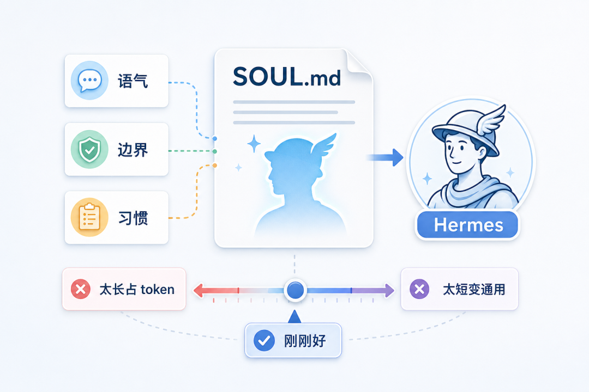

它适合写 Hermes 的语气、边界和工作习惯。写得太长，会占 token；写得太短，Hermes 又容易变成通用助手。

建议控制在 3-5 条原则、500 字以内。例如：

- 先读文件，再修改文件
- 不确定时先问用户
- 不主动回滚用户已有改动

这些约束越具体，实际效果越稳定。

## 五、记忆配置：不要把所有东西都塞进 memory

Hermes 的记忆不是简单的聊天记录，而是三层分工：

1. memory tool：存用户偏好和环境事实
2. session\_search：搜索历史对话
3. skill\_manage：沉淀可复用技能

Hermes Agent 入门：三层记忆机制分工

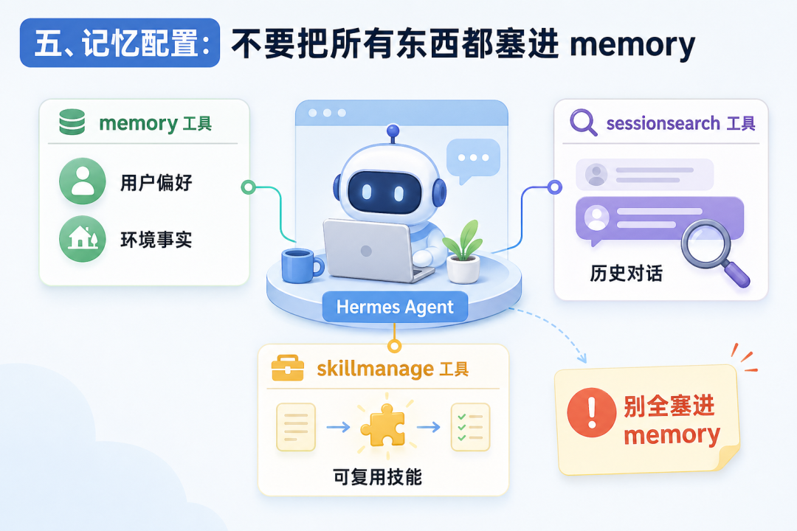

新手最常犯的错，是把每次任务结果都写进 memory。AGENTS.md 明确提醒：session outcomes 不写 memory。

memory 只适合存会反复用到的事实，比如“用户偏好 TypeScript”或“项目默认用 pnpm”。“今天修了某个 bug”这种一次性结果，交给 session\_search 就够了。

## 六、聊天通道配置：Gateway token 要加锁

Hermes 支持 telegram、discord、slack、whatsapp、homeassistant、signal 等通道。

Hermes Agent 入门：Gateway 多通道接入

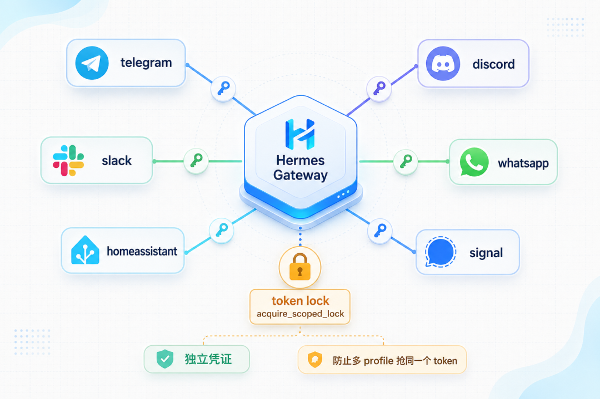

真正容易踩坑的是 token 复用。每个通道都要单独配置凭证，而且 Gateway adapter 应该使用 acquire\_scoped\_lock()，避免多个 profile 同时抢同一个 token。

如果两个 profile 同时连 Telegram bot token，平台可能判断为重复连接。这个问题看起来像网络故障，实际是凭证并发使用导致的。

## 七、hermes doctor：装完先跑诊断

装完 Hermes 后，别急着开始对话，先运行：

BASH

```
hermes doctor
```

Hermes Agent 入门：用 hermes doctor 检查配置

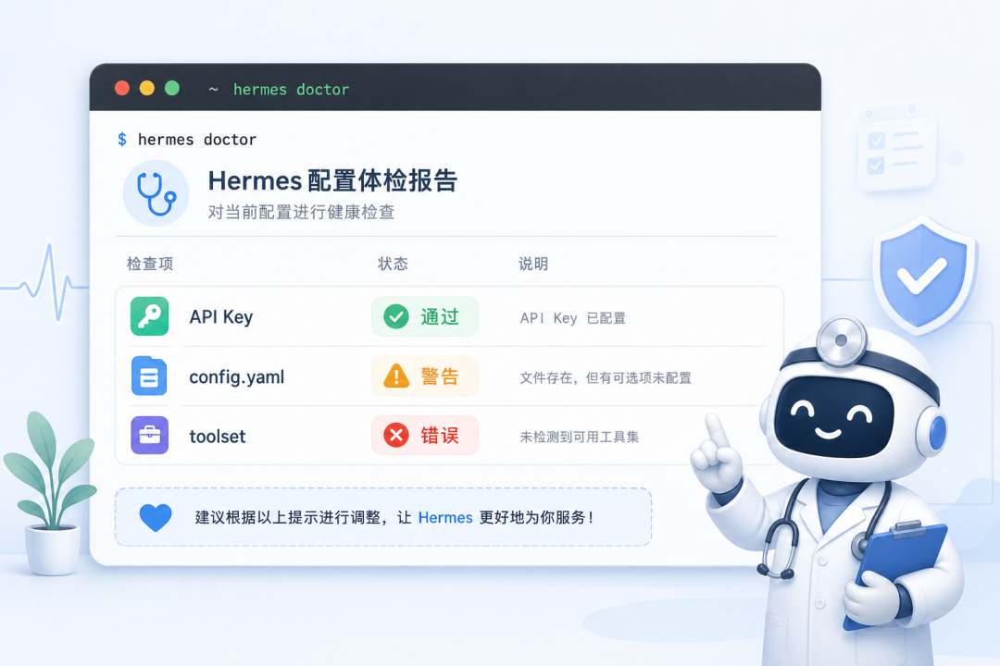

它会检查 API Key、config.yaml、toolset 等关键项。输出通常分三类：

- 通过：可以继续
- 警告：可选配置缺失
- 错误：必需配置缺失

这一步能提前发现大部分“为什么不工作”的问题。

## 八、ACP 接入 IDE：新手先选 stdio

Hermes 可以通过 ACP 接入 VS Code、Zed、JetBrains 等 IDE。

Hermes Agent 入门：ACP 接入 IDE 的两种模式

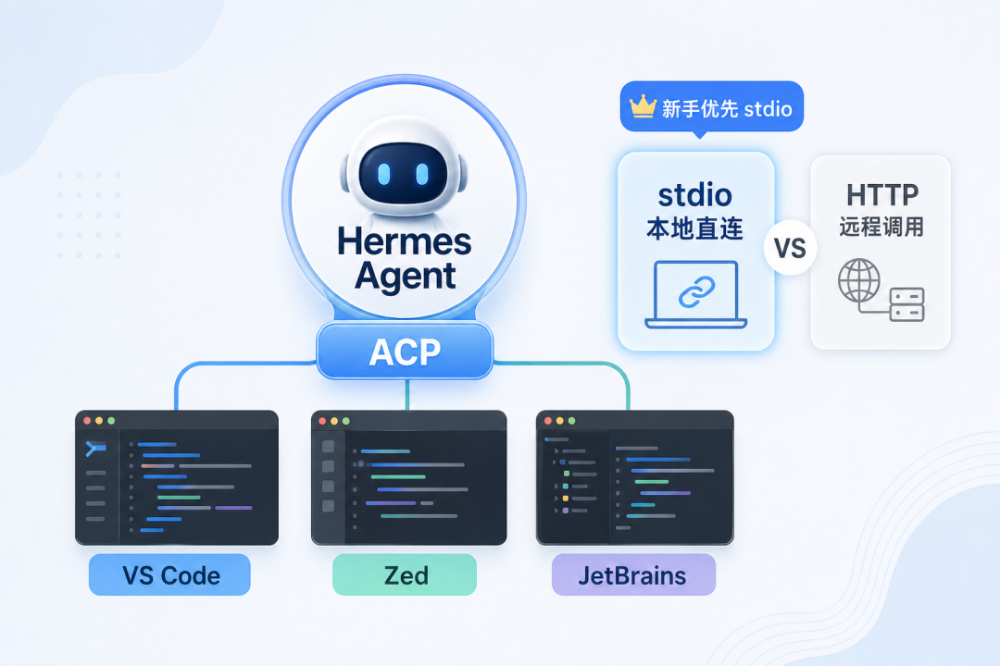

ACP 常见两种模式：

1. stdio：终端直连，适合本地开发
2. HTTP：远程调用，适合服务器或团队共享

第一次配置时，优先选 stdio。它少一个网络层，排错更简单。等你需要多台机器共享同一个 Hermes 实例，再考虑 HTTP。

## 九、OpenClaw 迁移：别期待一键无缝

如果你之前用 OpenClaw，Hermes 提供了迁移命令：

BASH

```
hermes skills import -⁠-⁠from openclaw
```

Hermes Agent 入门：从 OpenClaw 迁移 skills

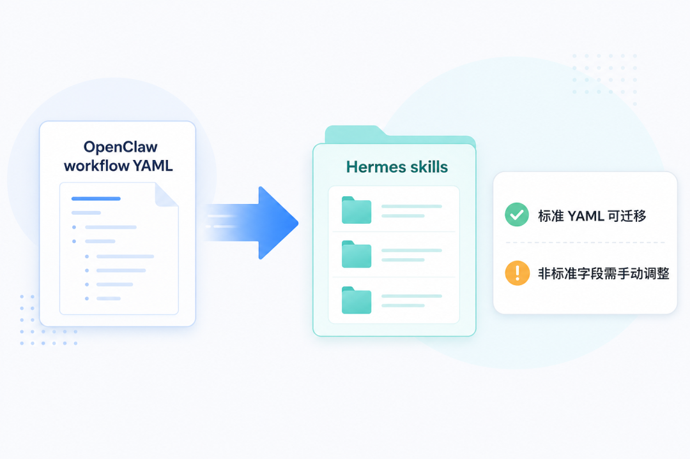

这条命令的前提是：你的 OpenClaw workflow YAML 足够标准。AGENTS.md 提醒过，skills are pure data，迁移本质是结构映射，不是魔法转换。

非标准字段、私有约定、写死路径，都可能需要手动调整。迁移后最好逐个 skill 做一次实际调用测试。

## 十、skill 管理：常用的留 5-8 个

Hermes 的 skill 通常有三种来源：

1. 内置 skill：开箱即用
2. 用户 skill：存在 ~/.hermes/skills/
3. Skills Hub：社区共享，可搜索安装

Hermes Agent 入门：skill 来源和加载策略

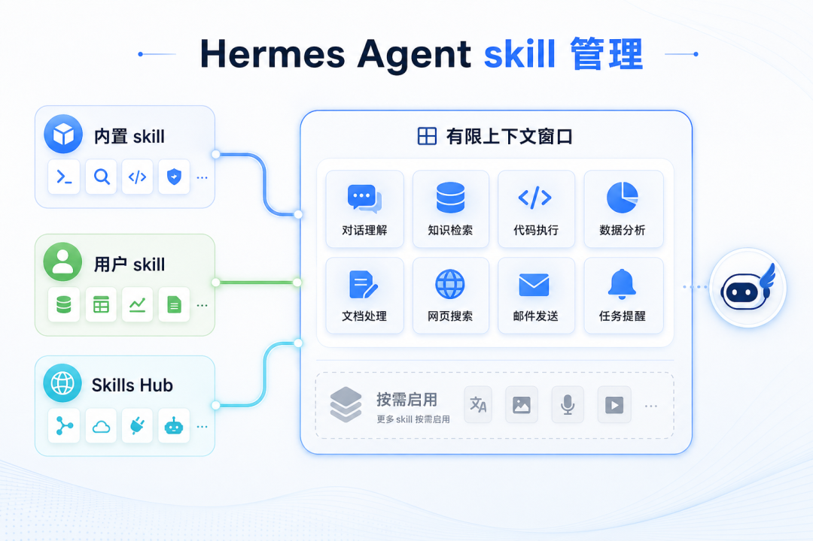

关键区别是：内置 skill 不一定占用同样的上下文预算，用户 skill 往往会进入 context。装太多 skill，对话窗口会被技能描述塞满，真正干活的空间反而少。

建议常用 skill 保留 5-8 个，其余按需安装、按需启用。

## 社区高频问题：三类坑最常见

整理社区反馈，最常见的问题集中在三类：

Hermes Agent 入门：社区高频配置问题

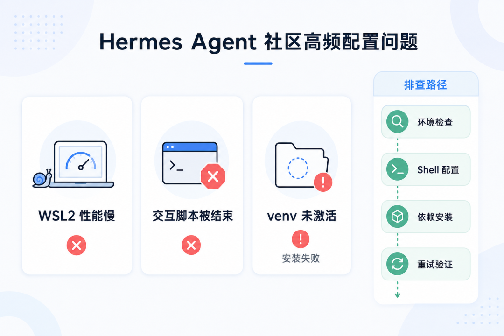

1. WSL2 巨慢、卡死：通常和 Docker backend 的性能瓶颈有关，建议优先用原生 Linux 或 macOS
2. 交互脚本被检测到就结束：多半是 background 模式没用对
3. 一行命令装不上：回到第一步，先检查 venv 是否激活

这些问题不是 Hermes 独有，但在 agent 工具里会被放大，因为它要同时调用模型、工具、终端和外部服务。

## 总结：先配环境，再配能力

Hermes Agent 的入门顺序可以压缩成一句话：先配环境，再配能力。

Hermes Agent 入门：从环境配置到能力扩展

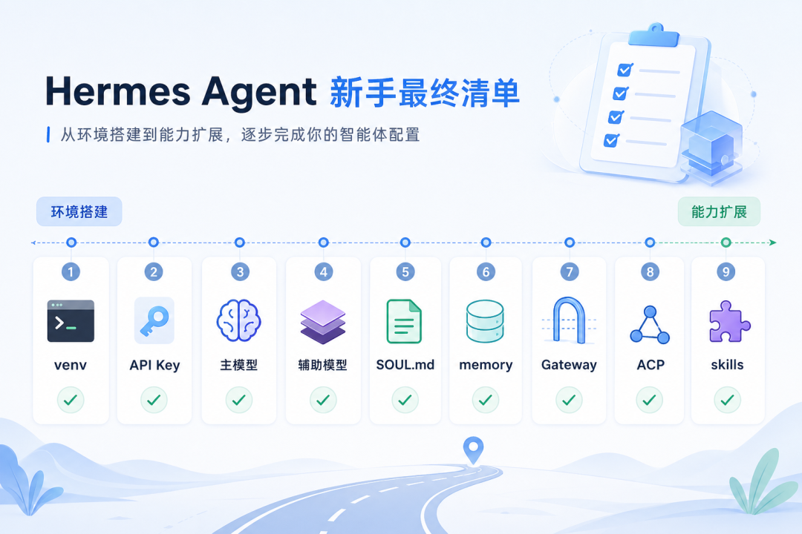

先把 venv、API Key、主模型、辅助模型跑通，再配置 SOUL.md、memory、Gateway、ACP 和 skills。顺序对了，十个坑会变成一张清单；顺序反了，每一步都可能变成排查现场。

**参考**：

- 官方文档：hermes-agent/AGENTS.md（项目内）
- Hermes GitHub 仓库 Issues 区
