> 📎 来源: [守护的AI笔记](https://mp.weixin.qq.com/s?__biz=MzYyNDE5NTM4Ng==&mid=2247484544&idx=1&sn=73cde356a39db9c7a4e5e30c654bd819&chksm=f1ab84b8dd3568ef7ef46428b4d119ca1945f8475efa9a55a1136c3166f60a14f227208cf394&mpshare=1&scene=1&srcid=0422m2rtlNMqWeZPC2LfC9H7&sharer_shareinfo=db72d7ec1ca8127d90b7b33240fbd283&sharer_shareinfo_first=db72d7ec1ca8127d90b7b33240fbd283) | 时间: 2026-04-22 01:11

---

有个场景可能你很熟悉：

好不容易把 Hermes Agent 装好了，要改个模型配置，打开终端，找到 

```
~/.hermes/config.yaml
```

，改了几行，重启，报错了。

看半天发现是 YAML 缩进写错了。

配个 API key，不知道改哪个 .env 文件，改完不生效，干脆重装。

现在这些不用碰命令行了。

Hermes 官方刚刚上线了 Web UI，所有配置在浏览器里点几下就搞定。

### 快速上手

两步：

```
12hermes updatehermes dashboard
```

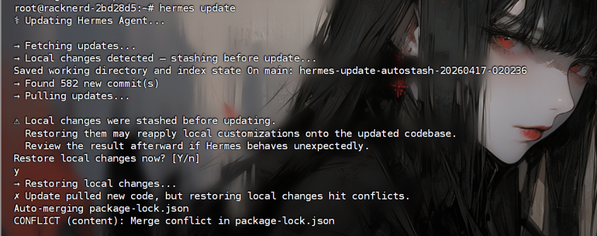

 update 先把版本更新到最新，dashboard 把 Web UI 跑起来。

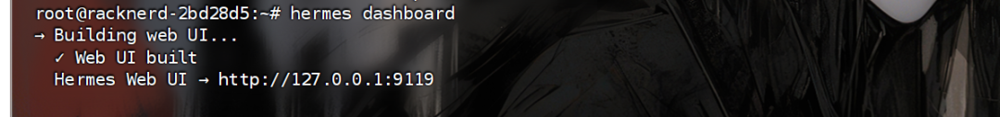

默认地址 

```
127.0.0.1:9119
```

，浏览器打开就行。

如果已经是最新版本了，那么直接执行下面的命令就好啦

```
1hermes dashboard
```

如果你是服务器的话，需要使用 ssh 搭个隧道，这样你才能在本地打开页面。和小龙虾是类似。

我使用的是 finalshell，在设置-隧道里面里面添加即可。

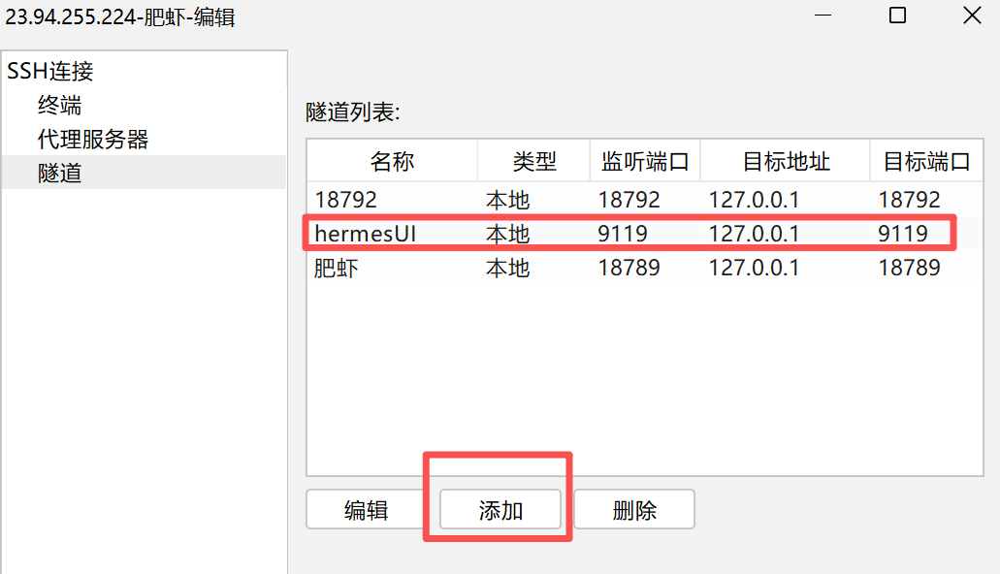

### 界面概览

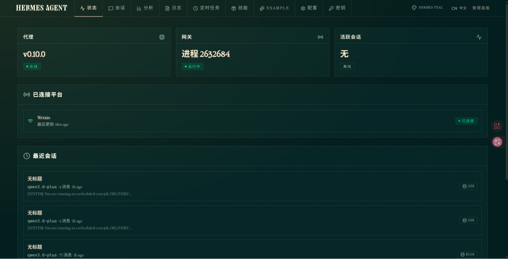

Hermes Web UI 的定位是管理工具，它没有聊天界面，不知道后面会不会支持。

打开界面后，你会看到这些内容（右上角可以切换中文面板）：

**·状态Status** 

相当于系统的健康检查面板。hermes 版本号、Gateway 进程 ID、当前有多少活跃会话，一目了然。

消息平台的连接状态和心跳时间也在下面排着。

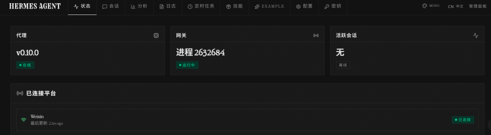

**如果微信突然不响应消息了，先看这里的心跳时间就知道是不是连接断了。**

**·会话Sessions** 

这里汇聚了所有平台的对话记录。每条会话都标注了用了什么模型、来回了多少条消息、调用了几个工具、从哪个平台来的（cron定时、weixin微信）。

右上角可以直接搜消息内容。

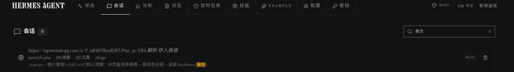

**找之前某个聊天的上下文，比在微信和终端之间来回切快多了。**

**·分析Analytics** 

token 用了多少、会话多少、api 调用、多少个模型，都有图表展示。

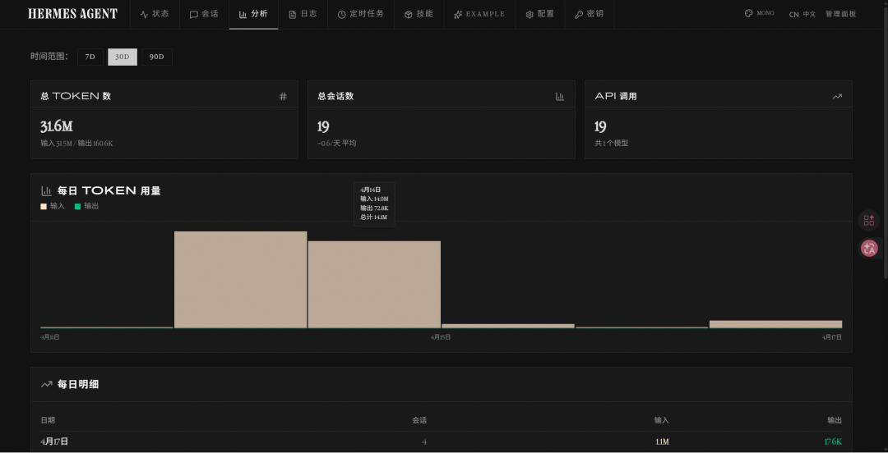

**吐槽个事**：这个数字的小数点，真不好辨认，第一眼看成了 316M token，这不比龙虾还费，细一看有个小数点，31.6M。还好，虚惊一场。

**·日志Logs** 

运行日志直接在浏览器里滚动，非技术同学排查问题时这里用得最多。

不用 SSH 到服务器翻日志了，还是很方便的，一目了然。

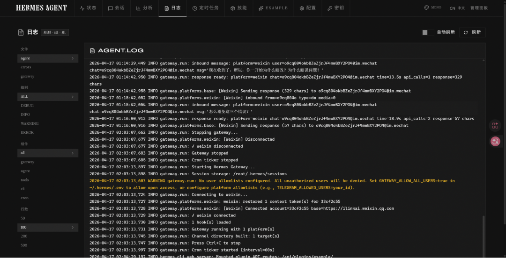

**·定时任务Cron** 

定时任务的管理入口。目前只有新建功能，比较简单。

已有的定时任务，支持暂定、触发、删除。暂没看到修改的地方，后面应该会支持的。

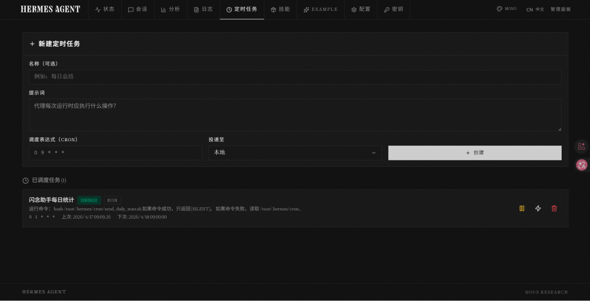

**·技能Skills** 

自带了一堆的 skill 和工具，默认全部开启，大家根据需要可以自己关一些，免得模型不知道用什么。

自己写的也会在里面展示，目前功能就只有启用，禁用。

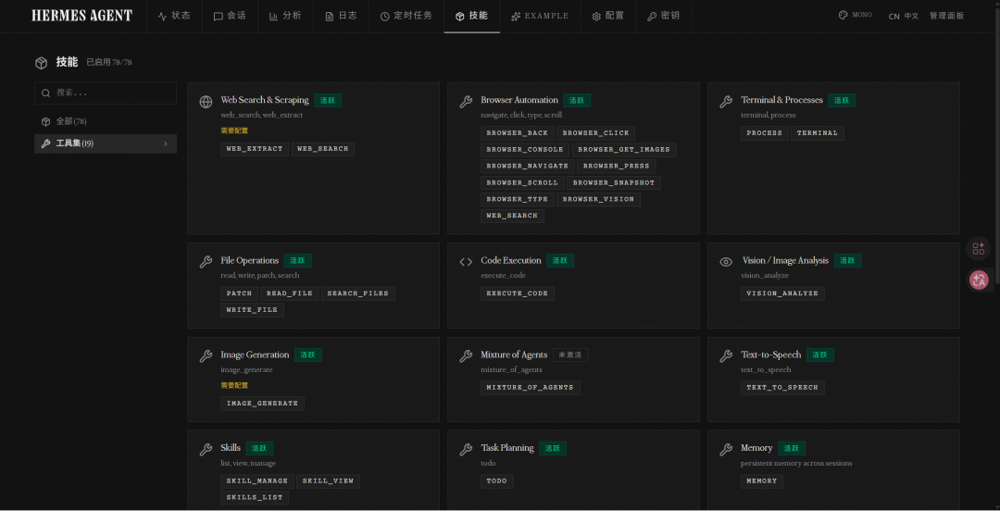

**·配置Config** 

这是最有价值的页面。General、Agent、Terminal、Memory、Security、Browser、Voice 等 15 个分类，覆盖所有配置项。

同样支持 yaml 这种方式修改，和改配置文件是一样的。

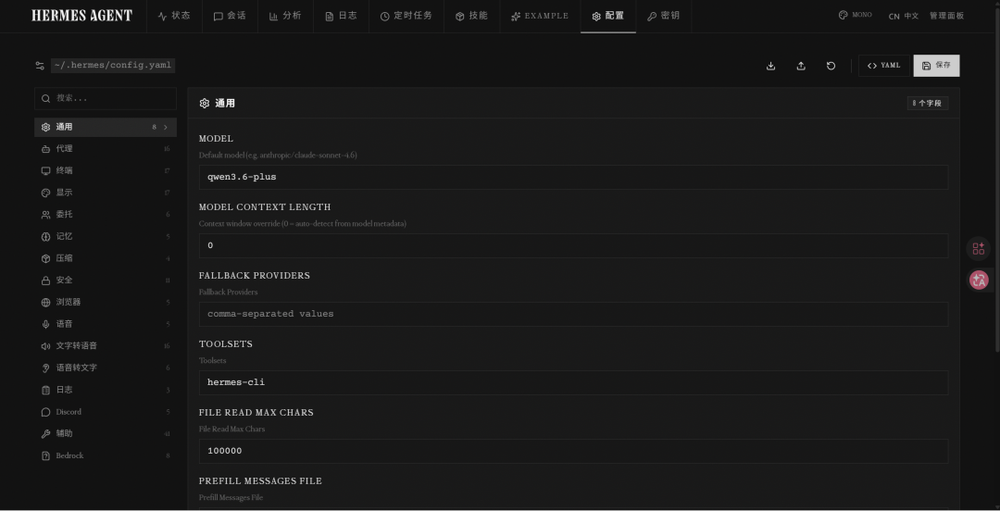

每个配置项都有对应的输入框，改完保存就行。

**以前改配置最怕缩进写错，现在表单帮你省了这步。**右上角的导入导出按钮也方便，换机器部署时直接导出配置文件再导入。

**·密钥Keys** 

和小龙虾不一样的是，密钥都是在 env 环境文件，和配置文件是隔离的。

可以直接读取你本地安装的常用的 ai 工具，比如我这台安装了 codex cli。

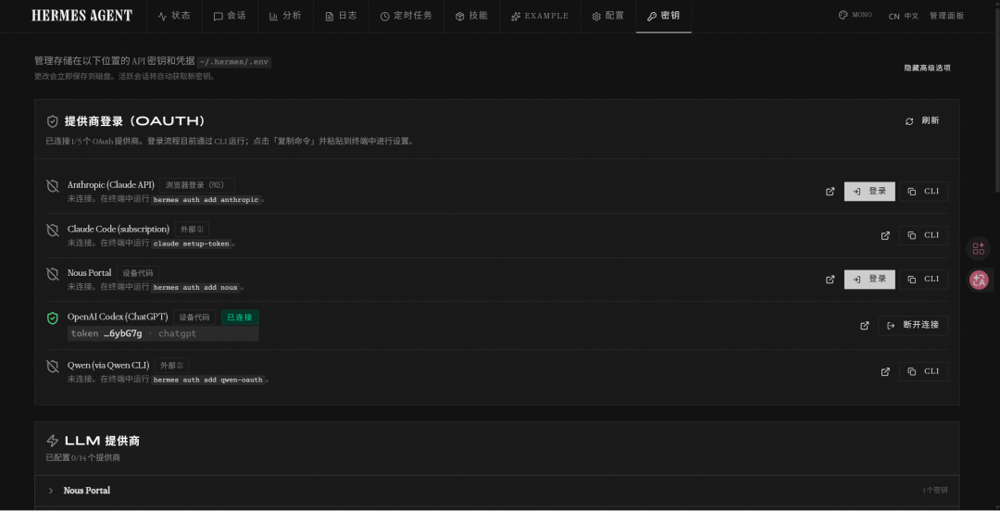

下面是 llm 提供商，每个 API provider 旁边都有 "Get key" 链接，点过去申请，回来填上保存。主流供应商都有。

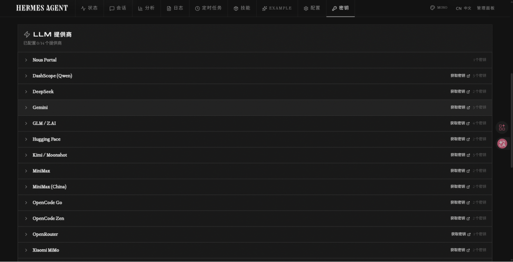

下面还有其他的密钥、消息平台、和其他配置，基本上和密码有关的都在这里，找起来就方便多了。

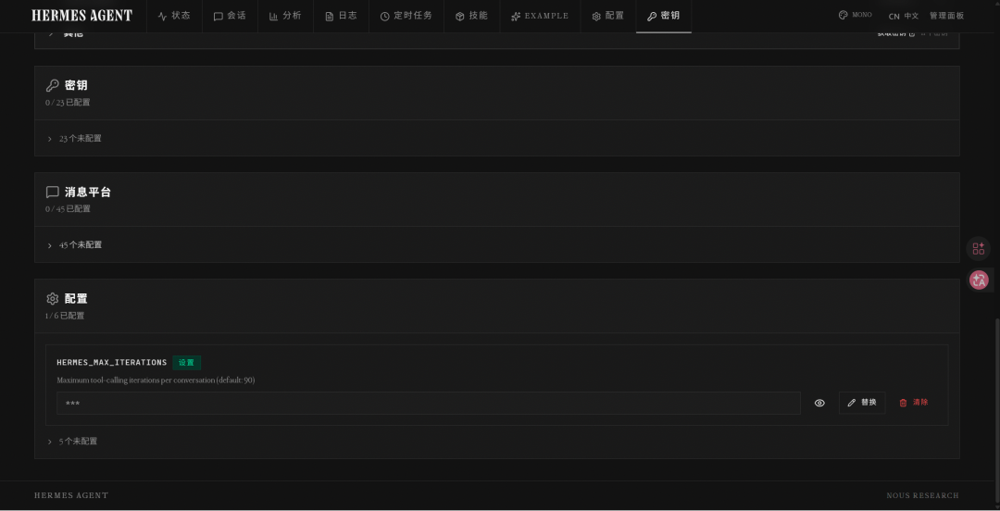

### 最后

说这么多，其实就 Config 和 Keys 两个页面就够用了，其他的是锦上添花。

功能比较简洁，期待后面会更新更多的内容，对小白也会更加的友好。

出了问题不用再来回翻终端和 .env 文件了，至少能先看一眼状态面板和 Logs 页面，缩小范围。

Hermes 用上了吗？欢迎在评论区聊聊。

‍‍

---

感谢看到最后，本篇结束~

如果我的内容对你有所帮助，感谢点赞、关注支持一下🙏

⬇️ 关注我，获取最新 AI 干货笔记和实操，少走弯路、多出成果！


‍
