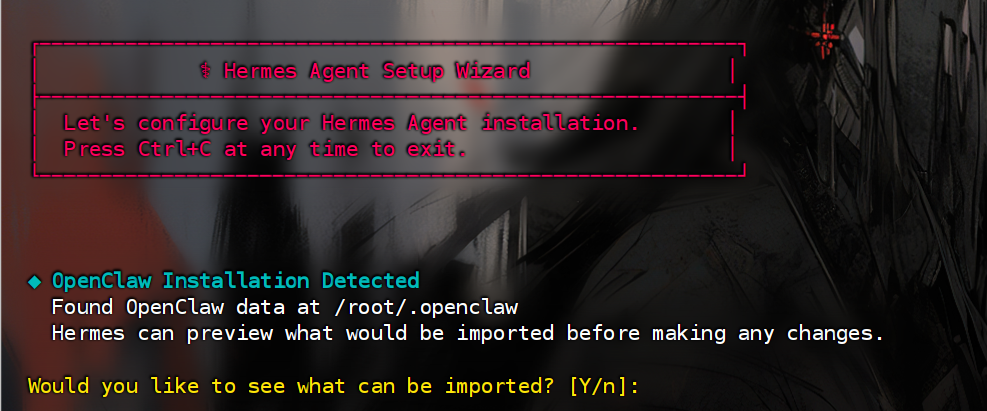
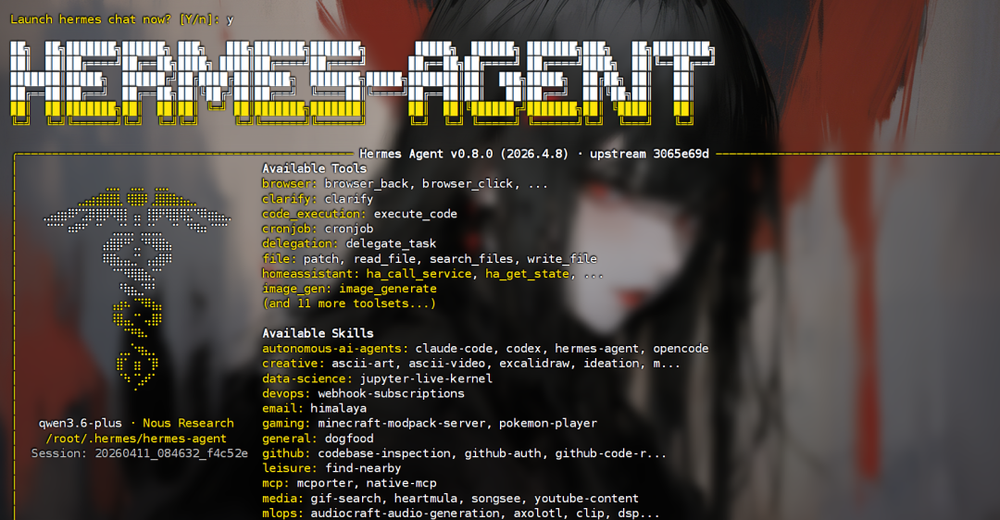
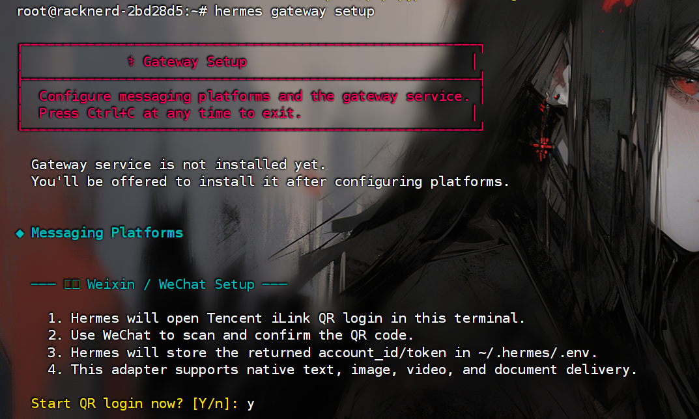
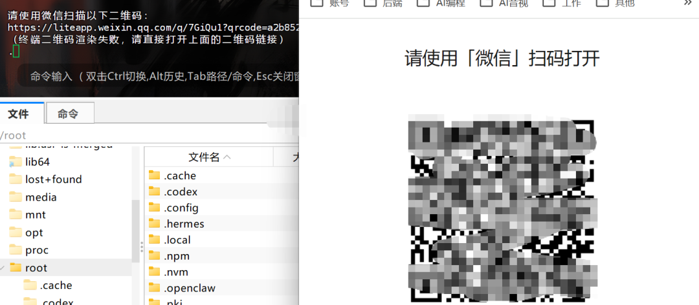
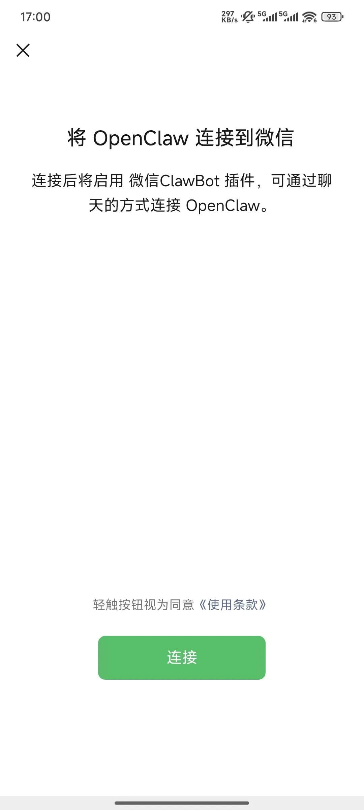
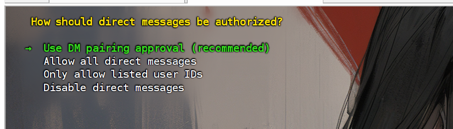
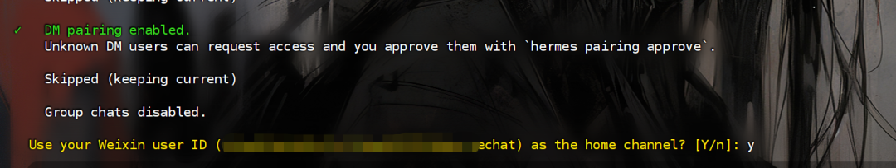
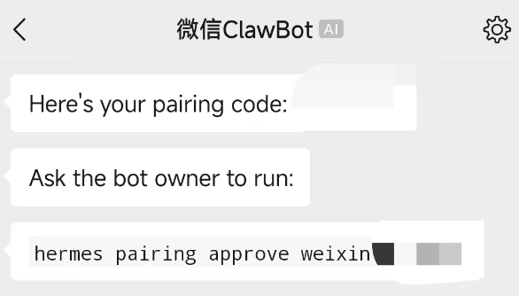
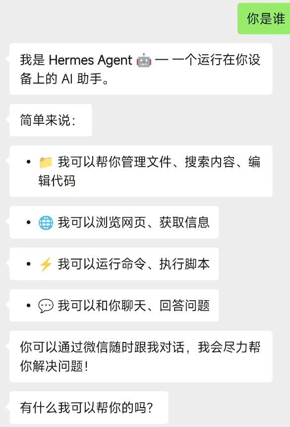
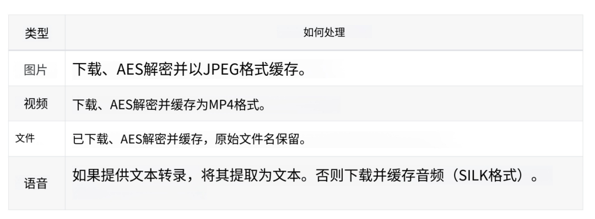

> 📎 来源: [守护的AI笔记](https://mp.weixin.qq.com/s?__biz=MzYyNDE5NTM4Ng==&mid=2247484524&idx=1&sn=85a49f2ea45e68e1ec9c1d9880c750e4&chksm=f18b78172b66aad6ae559ea3a2bb32260f73864f02ec442c8bed8a501293adc9b4e30cfaa160&mpshare=1&scene=1&srcid=0424PoBTxfYH1zzByYbXflrz&sharer_shareinfo=21d85be8159d6b2d0b0dd50a406e4384&sharer_shareinfo_first=21d85be8159d6b2d0b0dd50a406e4384) | 时间: 2026-04-24 21:34

---

Hermes Agent 最近更新了微信原生支持，用的还是腾讯官方的 iLink Bot API，不是那种容易被封的第三方协议。

加上它本身有内置学习循环机制，越用越聪明，值得试一下。

而且直接在微信里面完成闭环，直接让 AI 处理，方便多了。

这篇文章给你完整的安装和微信连接教程，从零基础到能用，大约 5 分钟。

### 第一步：一键安装

安装非常简单，一条命令搞定。（mac 和 linux 可以直接安装，windows 不支持，需要用 WSL2。如果你之前没装过 WSL2，先去微软商店装一个 Ubuntu，再在 WSL2 里跑上面的命令。）

这里使用服务器给大家演示一下，直接执行命令，然后等待即可。

```
1curl -fsSL https://raw.githubusercontent.com/NousResearch/hermes-agent/main/scripts/install.sh | bash
```

安装完成后会自动检测系统环境，如果之前用过 OpenClaw，它会提示你是否迁移配置：



```
12检测到 OpenClaw 配置，是否迁移？导入 SOUL.md、USER 设定、消息设定、模型供应商信息等
```

选择迁移的话，SOUL.md、用户设定、消息配置、大模型供应商信息、已安装的 Skills 都会自动导入。省了不少事。

如果之前没有 OpenClaw 配置，安装脚本会引导你一步步设置模型供应商、Agent 配置、消息平台等。

配置完成后，重新刷新资源（不刷新的话，会找不到 hermes 命令），然后启动对话。

```
12source ~/.bashrc   # or: source ~/.zshrchermes             # Start chatting!
```



### 第二步：配置微信连接

**1. 配置网关**：

```
1hermes gateway setup
```

你会看到一个配置列表，我们直接选微信 **Weixin**。

如果之前没配置过，后面会显示 "not configured"。



**2. 扫码连接**

终端会问你是否使用二维码登录，输入 

```
Y
```

。

二维码可能在终端里渲染失败。如果你装了 

```
qrcode
```

 包就能显示，没装也无所谓（安装命令是下面的）：

```
1pip install qrcode
```

再说一点，还需要 安装 python 的 aiohttp cryptography 这两个包，没有安装就好了

```
1pip install aiohttp cryptography
```

终端里渲染不了，它会给你一个链接。复制到浏览器打开，一样能看到二维码。用微信扫就行。



**注意**：二维码有时效，尽快扫。

**3. 手机确认**

扫码后，手机微信会弹出确认页面，显示"OpenClaw"询问是否连接。

别慌，Hermes 和 OpenClaw 共用同一个 iLink Bot 接口，所以显示的是 OpenClaw。

点"连接"就行。

之后微信会出现一个新的对话窗口，就是这个 AI 机器人。



### 第三步：权限配置与配对

微信连上后，终端会继续引导你配置权限。

**1. 访问权限设置**

给你四个选项：



| 选项 | 说明 |
| --- | --- |
| 私信配对审批 | 官方推荐，需要审批才能对话 |
| 允许所有消息 | 任何人都能发消息 |
| 仅允许列出的用户 ID | 白名单模式 |
| 禁用消息 | 谁都发不了 |

我们使用第一个就好，和小龙虾是一样的。

**2. 群聊设置**

接下来问你怎么处理群聊：

忘截图了。。。

| 选项 | 说明 |
| --- | --- |
| 禁用群聊 | 默认关闭，官方推荐 |
| 允许所有群聊 | 所有群都响应 |
| 仅允许列出的群聊 ID | 群白名单 |

**建议先关闭群聊**，把私聊跑通再说。主要也是怕频繁在群里响应消息，被微信风控盯上。

最终确认：



**3. 配对**

配对是第一次对话前必须要做的。微信端会发给你一个配对码，然后在终端里执行：



```
1hermes pairing approve weixin <配对码
```

配对完成后，就可以开始对话了。



目前适配的消息类型。



### 第四步：启动网关

配置全部完成后，启动 Hermes 网关：

```
1hermes gateway
```

这个命令会保持后台运行，通过长轮询接收微信消息。只要进程在跑，微信就能收到 AI 回复。

**这里需要注意**：网关退出后微信就收不到消息了。重新运行 

```
hermes gateway
```

 就能恢复。

### 配置文件

如果需要手动修改配置，编辑 

```
~/.hermes/.env
```

 文件：

```
123456WEIXIN_ACCOUNT_ID=你的账号ID          # 必填WEIXIN_TOKEN=你的bot-token           # 必填（扫码自动获取）WEIXIN_DM_POLICY=allowlist           # 私信策略WEIXIN_ALLOWED_USERS=用户ID          # 私信白名单WEIXIN_GROUP_POLICY=disabled         # 群聊策略（默认关闭）WEIXIN_GROUP_ALLOWED_USERS=群ID      # 群白名单
```

### 最后的想法

Hermes 支持个人微信，最大的意义是给了一个官方认可的路径。之前靠第三方桥接的方案总让人担心被封号，这次用的是腾讯自己开放的 iLink Bot API，正规多了。

回复速度上确实还有些慢，偶尔发条消息要等几秒。但这和模型响应速度、网关延迟都有关系，后续应该会优化。

如果你只想记住一点：安装一行命令，连接四步搞定。门槛低，但需要你愿意折腾一下命令行。

你试过把 AI 接进微信吗？欢迎在评论区分享你的经验。

---

**相关链接**

- 项目地址：https://github.com/NousResearch/hermes-agent
- 官网文档：https://hermes-agent.nousresearch.com
- 微信接入文档：https://hermes-agent.nousresearch.com/docs/user-guide/messaging/weixin
