> 📎 来源: [Nancy学AI](https://mp.weixin.qq.com/s?__biz=MzE5MTg5NjM2NA==&mid=2247485895&idx=1&sn=acfbb7fdb2017216d0f7c3a5fa896cb5&chksm=975f6e3819cf8a69e1e55a191c0aef43a14bb59373c8bb20e294cd15a7f6f75e2fe22cf82a16&mpshare=1&scene=1&srcid=0429hgSKxmuH8jUVXDJdUSOz&sharer_shareinfo=7ab291eaa5e9fb82f49a841512940d41&sharer_shareinfo_first=7ab291eaa5e9fb82f49a841512940d41) | 时间: 2026-04-29 15:43

---

## 1. 什么是 Hermes Agent？

### 1.1 产品定位

**Hermes Agent** 是由 **Nous Research** 开发的自进化 AI 智能体框架。它的核心理念是：

> **"The agent that grows with you"** —— 随你成长的智能体

Hermes 不是一次性配置好的聊天机器人，而是一个能够：

- 从经验中学习并创建新技能
- 在使用过程中自我改进
- 记住你的偏好和工作习惯
- 跨会话保持上下文连续性
- 在多种平台上与你交互

### 1.2 命名由来

Hermes（赫尔墨斯）是希腊神话中的：

- 🏃 众神的信使
- 💼 商业与贸易之神
- 🎯 旅行者与边界跨越者的守护神

这个名字寓意 Hermes Agent 作为"AI 信使"，在不同平台、不同任务、不同场景之间传递和执行你的意图。

### 1.3 开发团队

**Nous Research** 是一家专注于 AI 研究的机构，以开发高质量的开源指令微调模型而闻名：

- Hermes 系列开源模型（基于 Llama、Mistral 等）
- 专注于提升模型的指令遵循能力和对话表现
- 现在将研究积累应用于 Agent 框架开发

### 1.4 核心设计理念

| 理念 | 说明 |
| --- | --- |
| 🔓 **模型无关** | 支持 200+ 模型，无厂商锁定 |
| 🧠 **自学习** | 内置学习循环，自动创建/改进技能 |
| 📱 **无处不在** | 在任意平台与你对话，在任意环境执行任务 |
| 🔒 **安全可控** | 命令审批、沙箱隔离、细粒度权限 |
| 💰 **成本友好** | 支持 serverless 部署，闲置时几乎零成本 |

---

## 2. 核心特性详解

### 2.1 🧠 自学习循环（Built-in Learning Loop）

Hermes 最核心的差异化特性是**内置学习循环**。这不是简单的"记住对话历史"，而是真正的程序化学习：

#### 学习机制流程图

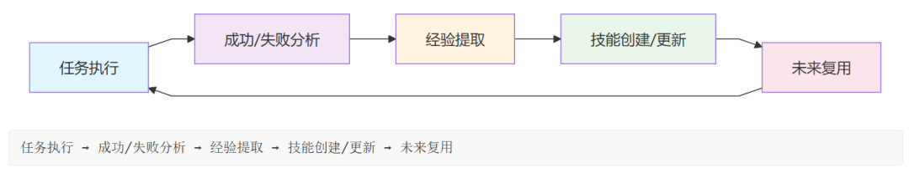

#### 学习触发条件

Hermes 会在以下情况自动创建或更新技能：

| 场景 | 说明 |
| --- | --- |
| ✅ 完成复杂任务 | 5+ 工具调用的非平凡工作流 |
| ⚠️ 遇到错误后找到解决方案 | 记录踩坑路径和最终解法 |
| 👤 用户纠正方法 | 学习用户的偏好方式 |
| 💡 发现新工作流 | 识别可复用的模式 |

#### 技能自改进

技能不是静态的。Hermes 可以在使用过程中：

- 发现更优方法时自动更新技能
- 根据实际执行反馈优化步骤
- 合并相似技能，消除冗余

---

### 2.2 📝 程序化记忆系统（Procedural Memory）

Hermes 的记忆系统设计精巧，分为多个层次：

#### 记忆系统架构

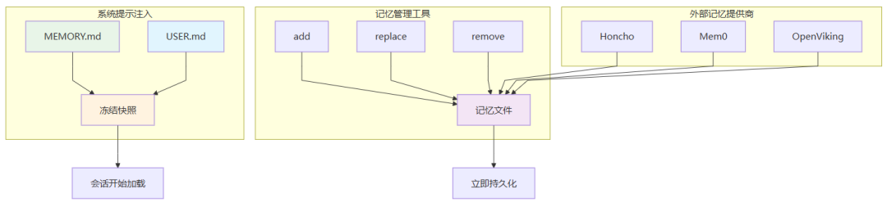

#### 核心记忆文件

| 文件 | 用途 | 容量限制 |
| --- | --- | --- |
| ``` MEMORY.md ``` | Agent 的个人笔记（环境事实、项目约定、经验教训） | 2,200 字符 (~800 tokens) |
| ``` USER.md ``` | 用户画像（偏好、沟通风格、期望） | 1,375 字符 (~500 tokens) |

#### 记忆管理

- **自动注入**：会话开始时自动加载到系统提示
- **工具管理**：Agent 通过 

  ```
  memory
  ```

   工具增删改记忆
- **容量控制**：达到上限时自动合并或替换旧条目
- **去重机制**：自动拒绝完全重复的条目
- **安全扫描**：检测注入攻击和凭证泄露模式

#### 记忆内容示例

```
# 好的记忆条目（信息密度高）
```

#### 会话搜索（Session Search）

除了核心记忆，Hermes 还维护完整的会话历史：

- 所有 CLI 和消息会话存储在 SQLite (

  ```
  ~/.hermes/state.db
  ```

  )
- 支持 FTS5 全文搜索
- 使用 Gemini Flash 进行摘要
- 可以找回几周前讨论的具体内容

**记忆 vs 会话搜索对比：**

| 特性 | 持久记忆 | 会话搜索 |
| --- | --- | --- |
| 容量 | ~1,300 tokens | 无限制（所有会话） |
| 速度 | 即时（系统提示内） | 需搜索 + LLM 摘要 |
| 用途 | 关键事实始终可用 | 查找特定历史对话 |
| 管理 | Agent 手动精选 | 自动存储所有会话 |
| Token 成本 | 每会话固定 | 按需搜索 |

---

### 2.3 🛠️ 40+ 工具与工具集

Hermes 内置丰富的工具能力：

#### 工具能力矩阵

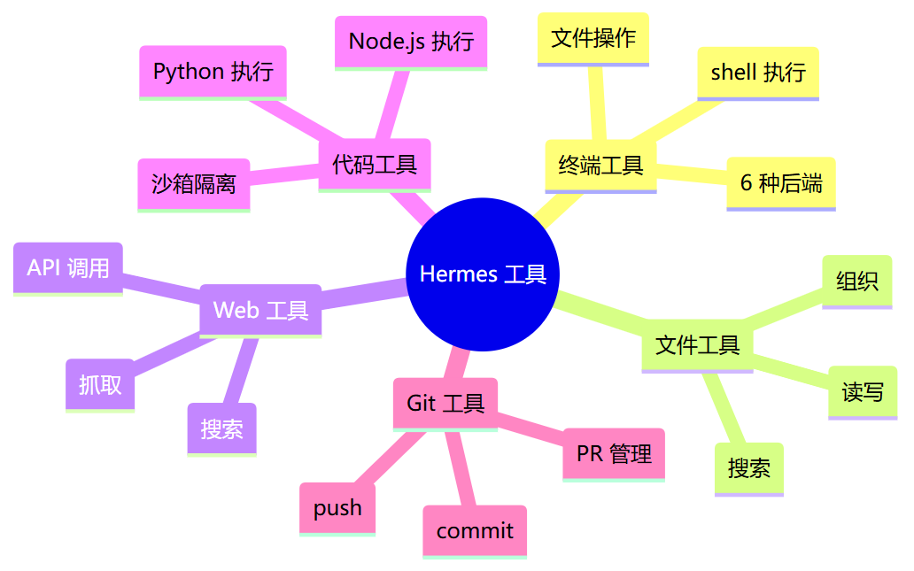

#### 核心工具集

| 工具集 | 包含工具 | 说明 |
| --- | --- | --- |
| ``` terminal ``` | shell 执行、文件操作 | 支持本地/Docker/SSH 后端 |
| ``` files ``` | 读写、搜索、组织 | 工作区文件管理 |
| ``` web ``` | 搜索、抓取、API 调用 | 需要 API 密钥（如 Firecrawl） |
| ``` code ``` | 执行 Python/Node.js 等 | 沙箱隔离执行 |
| ``` git ``` | 版本控制操作 | commit、push、PR 等 |
| ``` skills ``` | 技能管理 | 浏览、安装、创建技能 |

#### 工具后端

Hermes 支持 6 种终端后端，适应不同安全需求：

| 后端 | 适用场景 |
| --- | --- |
| ``` local ``` | 本地开发，完全信任环境 |
| ``` docker ``` | 沙箱隔离，防止系统污染 |
| ``` ssh ``` | 远程服务器执行 |
| ``` daytona ``` | Serverless 工作空间 |
| ``` singularity ``` | 高性能计算环境 |
| ``` modal ``` | Serverless GPU/计算资源 |

---

### 2.4 📱 多平台消息网关

Hermes 可以在你使用的任何平台上对话：

#### 支持平台

| 平台 | 功能 |
| --- | --- |
| Telegram | 完整功能支持 |
| Discord | 支持服务器/私聊 |
| Slack | 企业协作 |
| WhatsApp | 移动端优先 |
| Signal | 隐私保护 |
| Email | 异步任务 |
| Home Assistant | 智能家居集成 |
| CLI | 本地终端界面 |

#### 网关特性

- **统一配置**：单个网关进程管理所有平台
- **跨平台连续性**：在不同平台继续同一对话
- **语音备忘录**：支持语音转文字
- **命令审批**：敏感操作需确认
- **DM 配对**：限制授权用户访问

---

### 2.5 ⏰ 内置调度器（Cron）

Hermes 内置 cron 调度系统，支持自然语言定时任务：

```
# 示例：每日报告
```

#### 调度特性

- 自然语言描述任务
- 支持 cron 表达式
- 交付到任意平台
- 无人值守运行
- 失败重试机制

---

### 2.6 🔄 子智能体委托

Hermes 可以生成隔离的子智能体并行处理任务：

#### 子智能体工作流

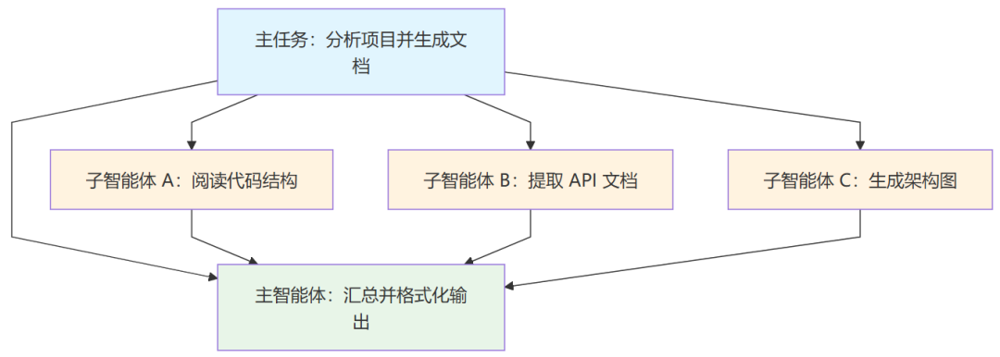

```
主任务：分析项目并生成文档
```

#### 优势

- **并行执行**：多个任务同时进行
- **上下文隔离**：子任务不污染主会话
- **零上下文成本**： collapsed 多步骤流程
- **RPC 调用**：Python 脚本可通过 RPC 调用工具

---

### 2.7 🌐 模型无关性

Hermes 支持 200+ 模型，无厂商锁定：

#### 支持的提供商

| 提供商 | 代表模型 | 配置方式 |
| --- | --- | --- |
| **Nous Portal** | Nous 自研模型 | OAuth 登录 |
| **OpenAI** | GPT-4、Codex | API 密钥或 OAuth |
| **Anthropic** | Claude 系列 | API 密钥 |
| **OpenRouter** | 200+ 模型路由 | API 密钥 |
| **NVIDIA NIM** | Nemotron | API 密钥 |
| **Z.AI** | GLM 系列 | API 密钥 |
| **Kimi/Moonshot** | 月之暗面 | API 密钥 |
| **MiniMax** | MiniMax 模型 | API 密钥 |
| **Alibaba** | Qwen 系列 | API 密钥 |
| **Hugging Face** | 开源模型 | API 密钥 |
| **DeepSeek** | 深度求索 | API 密钥 |
| **GitHub Copilot** | Copilot 订阅 | OAuth |
| **自定义端点** | VLLM、Ollama 等 | Base URL + 密钥 |

#### 切换模型

```
# 交互式选择
```

**重要提示：** Hermes 要求模型至少支持 **64K tokens 上下文**。上下文过小的模型无法维持多步骤工具调用工作流。

---

## 3. 快速入门指南

### 3.1 安装流程图

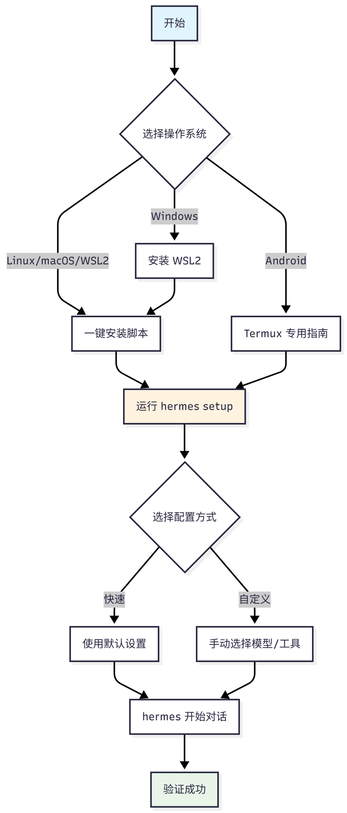

### 3.2 系统要求

| 系统 | 支持情况 |
| --- | --- |
| Linux | ✅ 原生支持 |
| macOS | ✅ 原生支持 |
| WSL2 | ✅ 支持（Windows 用户推荐） |
| Android (Termux) | ✅ 支持（需特殊配置） |
| Windows | ⚠️ 需通过 WSL2 |

### 3.3 安装步骤

#### 3.3.1 一键安装

```
# Linux / macOS / WSL2 / Android (Termux)
```

#### 3.3.2 运行设置向导

```
# 完整交互式设置
```

设置向导会引导你：

- 选择 LLM 提供商和模型
- 配置 API 密钥
- 选择终端后端（local/docker/ssh 等）
- 设置消息平台（可选）

#### 3.3.3 开始对话

```
# 经典 CLI
```

#### 3.3.4 验证会话恢复

```
# 恢复最近会话
```

### 3.4 常用命令速查

| 命令 | 说明 |
| --- | --- |
| ``` hermes ``` | 开始对话 |
| ``` hermes model ``` | 选择模型 |
| ``` hermes tools ``` | 配置工具 |
| ``` hermes setup ``` | 完整设置向导 |
| ``` hermes doctor ``` | 诊断问题 |
| ``` hermes update ``` | 更新到最新版 |
| ``` hermes gateway ``` | 启动消息网关 |
| ``` hermes --continue ``` | 恢复上次会话 |
| ``` hermes sessions list ``` | 查看历史会话 |
| ``` hermes skills browse ``` | 浏览技能 |

### 3.5 斜杠命令

在对话中输入 

```
/
```

 可查看可用命令：

| 命令 | 说明 |
| --- | --- |
| ``` /help ``` | 显示所有命令 |
| ``` /tools ``` | 列出可用工具 |
| ``` /model ``` | 切换模型 |
| ``` /personality ``` | 设置人格 |
| ``` /save ``` | 保存对话 |
| ``` /skills ``` | 管理技能 |
| ``` /new ```   或   ``` /reset ``` | 新对话 |
| ``` /retry ``` | 重试上次 |
| ``` /undo ``` | 撤销上次 |
| ``` /compress ``` | 压缩上下文 |
| ``` /usage ``` | 查看用量 |

---

## 4. 技能系统深度解析

### 4.1 什么是技能？

技能是 Hermes 的**可复用工作流文档**。当 Agent 学会一个复杂任务的处理方法后，可以将其保存为技能，供未来复用。

### 4.2 SKILL.md 格式

技能使用标准的 

```
SKILL.md
```

 格式（兼容 agentskills.io 开放标准）：

```
---
```

### 4.3 技能目录结构

```
~/.hermes/skills/          # 技能主目录（唯一真实来源）
```

### 4.4 使用技能

#### 4.4.1 作为斜杠命令

```
# 带参数使用
```

#### 4.4.2 自然对话调用

```
hermes chat --toolsets skills -q "你有什么技能？"
```

### 4.5 渐进式披露（Progressive Disclosure）

技能使用 Token 高效的加载模式：

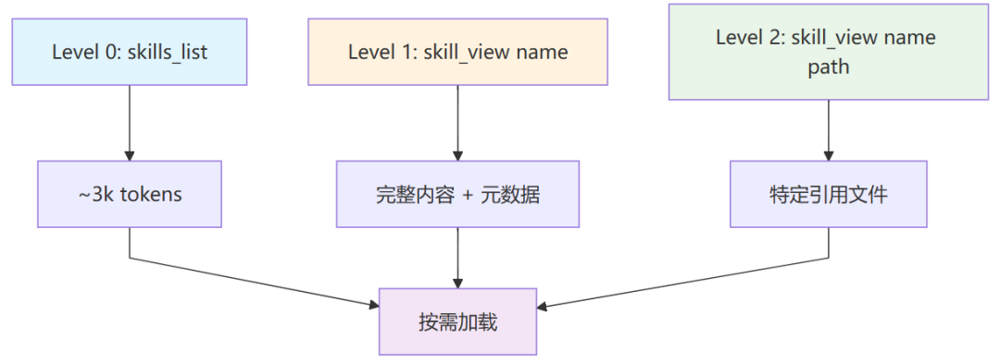

```
Level 0: skills_list() → [{name, description, category}, ...]  (~3k tokens)
```

Agent 只在真正需要时才加载完整技能内容。

### 4.6 Skills Hub

Hermes 集成了多个技能市场和注册表：

#### 4.6.1 支持的 Hub 源

| 源 | 示例 | 说明 |
| --- | --- | --- |
| ``` official ``` | ``` official/security/1password ``` | Hermes 官方可选技能 |
| ``` skills-sh ``` | ``` skills-sh/vercel-labs/... ``` | Vercel 公开技能目录 |
| ``` well-known ``` | ``` well-known:https://mintlify.com/docs ``` | 网站 /.well-known/skills/ 端点 |
| ``` github ``` | ``` openai/skills/k8s ``` | 直接 GitHub 仓库 |
| ``` clawhub ``` | - | 第三方技能市场 |
| ``` claude-marketplace ``` | - | Claude 插件市场风格 |
| ``` lobehub ``` | - | LobeHub 代理目录 |
| ``` url ``` | ``` https://example.com/SKILL.md ``` | 直接 URL |

#### 4.6.2 常用命令

```
# 浏览技能
```

### 4.7 安全扫描

所有 Hub 安装的技能都经过安全扫描：

| 检查项 | 说明 |
| --- | --- |
| 数据泄露 | 检测未经授权的 API 调用 |
| 提示注入 | 检测恶意提示模式 |
| 破坏性命令 | 检测危险系统操作 |
| 供应链攻击 | 检测可疑依赖 |

**信任级别：**

| 级别 | 源 | 策略 |
| --- | --- | --- |
| ``` builtin ``` | 随 Hermes 发布 | 始终信任 |
| ``` official ``` | optional-skills/ | 内置信任，无第三方警告 |
| ``` trusted ``` | openai/skills, anthropics/skills | 比社区源更宽松 |
| ``` community ``` | 其他所有 | 可用   ``` --force ```   覆盖非危险警告 |

---

## 5. 记忆系统工作机制

### 5.1 记忆存储位置

```
~/.hermes/memories/
```

### 记忆如何进入系统提示

每个会话开始时，记忆文件被加载并注入到系统提示中：

```
══════════════════════════════════════════════
```

**冻结快照模式：** 系统提示注入在会话开始时捕获一次，会话中不变。这是为了保留 LLM 的前缀缓存以提升性能。Agent 在会话中添加/删除的记忆会立即持久化到磁盘，但直到下次会话开始才会出现在系统提示中。

### 5.3 记忆工具操作

Agent 使用 

```
memory
```

 工具管理记忆：

| 操作 | 说明 |
| --- | --- |
| ``` add ``` | 添加新记忆条目 |
| ``` replace ``` | 替换现有条目（使用子串匹配） |
| ``` remove ``` | 删除不再相关的条目（使用子串匹配） |

**子串匹配：**

```
replace
```

 和 

```
remove
```

 使用短唯一子串匹配，不需要完整条目文本。

```
# 如果记忆包含 "用户偏好所有编辑器使用暗色模式"
```

### 5.4 两种目标详解

#### 5.4.1 memory — Agent 个人笔记

用于 Agent 需要记住的环境、工作流和经验教训：

- 环境事实（操作系统、工具、项目结构）
- 项目约定和配置
- 工具怪癖和变通方法
- 已完成任务的日记条目
- 有效的技能和技巧

#### 5.4.2 user — 用户画像

用于用户的身份、偏好和沟通风格：

- 姓名、角色、时区
- 沟通偏好（简洁 vs 详细、格式偏好）
- 讨厌的事情和需要避免的事项
- 工作流习惯
- 技术技能水平

### 5.5 应该保存什么 vs 跳过什么

#### 5.5.1 应该保存（Agent 主动保存）

| 类型 | 示例 |
| --- | --- |
| 用户偏好 | "我偏好 TypeScript 而非 JavaScript" → 保存到 user |
| 环境事实 | "这台服务器运行 Debian 12 + PostgreSQL 16" → 保存到 memory |
| 纠正 | "Docker 命令不需要 sudo，用户在 docker 组" → 保存到 memory |
| 约定 | "项目使用制表符、120 字符行宽、Google 风格文档字符串" → 保存到 memory |
| 完成的工作 | "2026-01-15 将数据库从 MySQL 迁移到 PostgreSQL" → 保存到 memory |
| 明确请求 | "记住我的 API 密钥轮换是每月一次" → 保存到 memory |

#### 5.5.2 应该跳过

| 类型 | 原因 |
| --- | --- |
| 琐碎/明显信息 | "用户询问了 Python" — 太模糊无用处 |
| 容易重新发现的事实 | "Python 3.12 支持 f-string 嵌套" — 可以网络搜索 |
| 原始数据转储 | 大代码块、日志文件、数据表 — 对记忆来说太大 |
| 会话特定临时信息 | 临时文件路径、一次性调试上下文 |
| 已在上下文文件中的信息 | SOUL.md 和 AGENTS.md 内容 |

### 5.6 容量管理

| 存储 | 限制 | 典型条目数 |
| --- | --- | --- |
| memory | 2,200 字符 | 8-15 条目 |
| user | 1,375 字符 | 5-10 条目 |

**当记忆满时会发生什么：**

当尝试添加会超出限制的条目时，工具返回错误：

```
{
```

Agent 应该：

1. 读取当前条目（在错误响应中显示）
2. 识别可以删除或合并的条目
3. 使用 

   ```
   replace
   ```

    将相关条目合并为更短版本
4. 然后添加新条目

**最佳实践：** 当记忆超过 80% 容量（在系统提示标题中可见）时，在添加新条目前合并条目。

### 5.7 外部记忆提供商

对于超越 MEMORY.md 和 USER.md 的更深层持久记忆，Hermes 提供 8 个外部记忆提供商插件：

| 提供商 | 特性 |
| --- | --- |
| Honcho | 辩证用户建模 |
| OpenViking | 知识图谱 |
| Mem0 | 语义搜索 |
| Hindsight | 自动事实提取 |
| Holographic | 跨会话用户建模 |
| RetainDB | 关系记忆 |
| ByteRover | 自主记忆管理 |
| Supermemory | 超级记忆 |

```
# 设置外部记忆
```

---

## 6. 多平台消息网关

### 6.1 网关架构

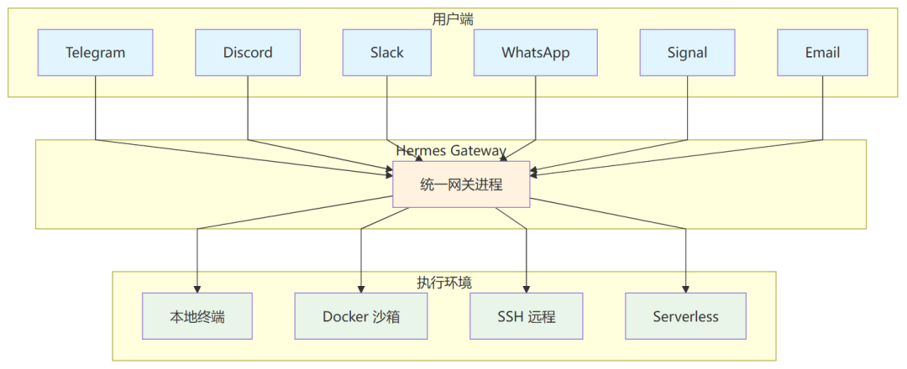

```
┌─────────────────┐
```

### 6.2 设置网关

```
# 交互式平台配置
```

### 6.3 平台特定功能

#### 6.3.1 Telegram

- 支持群组和个人聊天
- 支持语音消息转文字
- 支持文件传输
- 支持内联键盘（需配置）

#### 6.3.2 Discord

- 支持服务器和私聊
- 支持线程
- 支持反应表情
- 支持嵌入消息

#### 6.3.3 Slack

- 支持频道和私聊
- 支持线程
- 支持工作流集成

#### 6.3.4 WhatsApp

- 通过 WhatsApp Business API
- 支持群组
- 支持媒体消息

### 6.4 安全特性

| 特性 | 说明 |
| --- | --- |
| **命令审批** | 敏感操作需要用户确认 |
| **DM 配对** | 限制授权用户访问网关 |
| **平台工具限制** | 可为不同平台配置不同工具集 |
| **容器隔离** | 在 Docker 中运行网关增加安全性 |

---

## 7. Hermes Agent vs OpenClaw

基于公开信息和文档，以下是两款 Agent 框架的详细对比：

### 7.1 基本信息对比

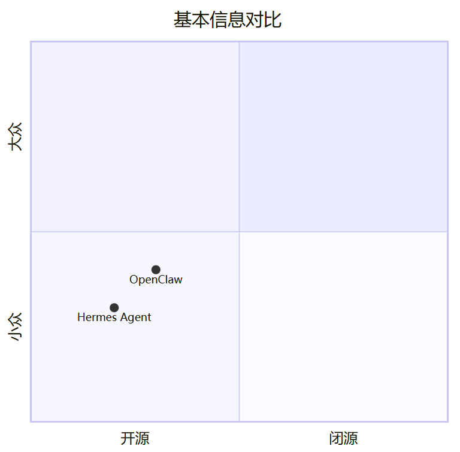

| 维度 | **Hermes Agent** | **OpenClaw** |
| --- | --- | --- |
| **开发团队** | Nous Research | OpenClaw 社区 |
| **GitHub** | github.com/NousResearch/hermes-agent | github.com/openclaw/openclaw |
| **文档** | hermes-agent.nousresearch.com/docs | docs.openclaw.ai |
| **社区** | Discord | Discord + clawhub.ai |
| **许可证** | MIT | 需确认 |
| **首次发布** | 2024-2025 | 需确认 |

### 7.2 核心定位对比

| 维度 | **Hermes Agent** | **OpenClaw** |
| --- | --- | --- |
| **核心理念** | "随你成长的智能体" | AI 智能体网关与编排平台 |
| **学习机制** | ✅ 内置学习循环，自动创建/改进技能 | ⚠️ 依赖手动技能开发 (SKILL.md) |
| **记忆系统** | ✅ 程序化记忆 + Honcho 用户建模 + FTS5 会话搜索 | ✅ MEMORY.md + 日常记忆文件 + 会话历史 |
| **技能生态** | ✅ Skills Hub (agentskills.io 标准) + 多源集成 | ✅ 本地技能目录 + clawhub.ai 社区市场 |
| **技能格式** | SKILL.md (兼容 agentskills.io) | SKILL.md (OpenClaw 规范) |

### 7.3 技术能力对比

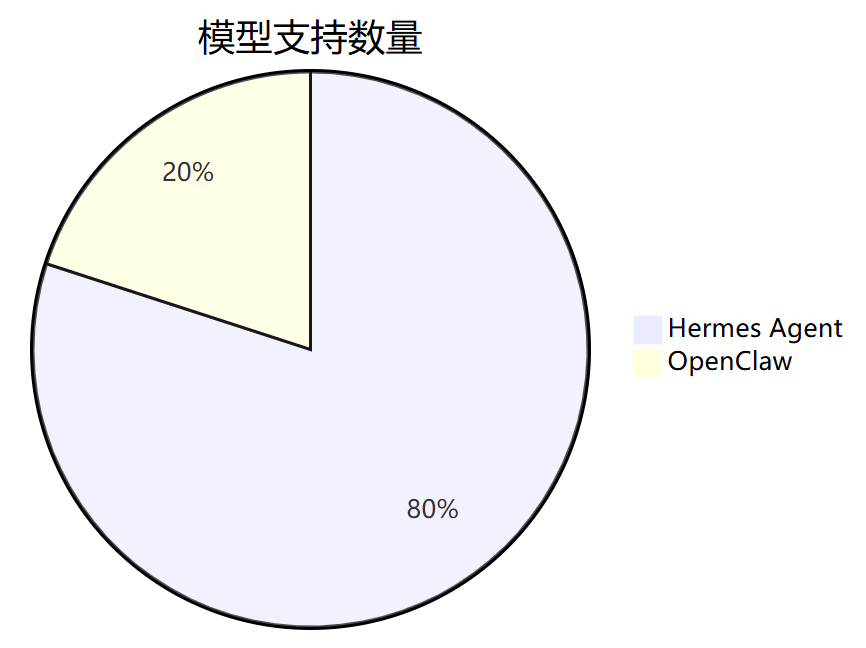

| 维度 | **Hermes Agent** | **OpenClaw** |
| --- | --- | --- |
| **模型支持** | 200+ 模型 (OpenRouter/NVIDIA/多厂商) | 多模型支持 (Anthropic/Qwen/Google 等) |
| **最小上下文** | 64K tokens 要求 | 需确认 |
| **多平台支持** | Telegram/Discord/Slack/WhatsApp/Signal/CLI/Email | Telegram/Discord/Signal/WhatsApp/飞书/企业微信等 |
| **终端界面** | ✅ 完整 TUI (多行编辑/命令补全/鼠标支持) | ⚠️ Web/消息平台为主 |
| **运行环境** | 6 种后端 (本地/Docker/SSH/Daytona/Singularity/Modal) | 本地/WSL2/服务器部署 |
| **Serverless** | ✅ 支持 Daytona/Modal | ⚠️ 需确认 |
| **调度系统** | ✅ 内置 cron 调度器 | ✅ 内置 cron 调度器 |
| **子智能体** | ✅ 并行子智能体委托 + RPC | ✅ sessions\_spawn/subagents |
| **MCP 集成** | ✅ 支持 MCP 服务器扩展 | ⚠️ 需确认支持情况 |
| **语音模式** | ✅ 支持语音转文字 (faster-whisper) | ⚠️ 需确认 |
| **编辑器集成** | ✅ ACP (Agent Communication Protocol) | ✅ ACP 支持 |

### 7.4 安全与治理

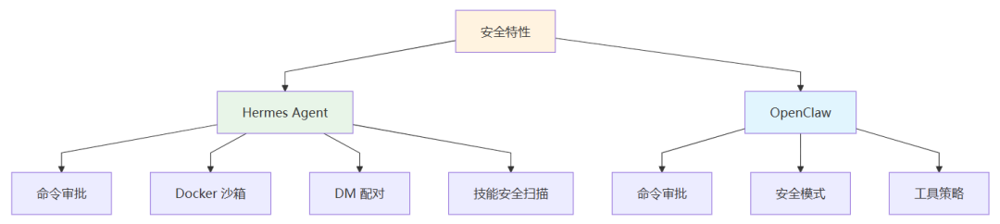

| 维度 | **Hermes Agent** | **OpenClaw** |
| --- | --- | --- |
| **命令审批** | ✅ 支持 | ✅ 支持 |
| **沙箱隔离** | ✅ Docker/容器后端 | ✅ 安全模式/工具策略 |
| **DM 配对** | ✅ 支持 | ⚠️ 需确认 |
| **技能安全扫描** | ✅ 内置扫描器 | ⚠️ 需确认 |
| **记忆安全扫描** | ✅ 注入/泄露检测 | ⚠️ 需确认 |
| **环境隔离** | ✅ 配置与密钥分离 | ✅ 配置与密钥分离 |

### 7.5 迁移与兼容

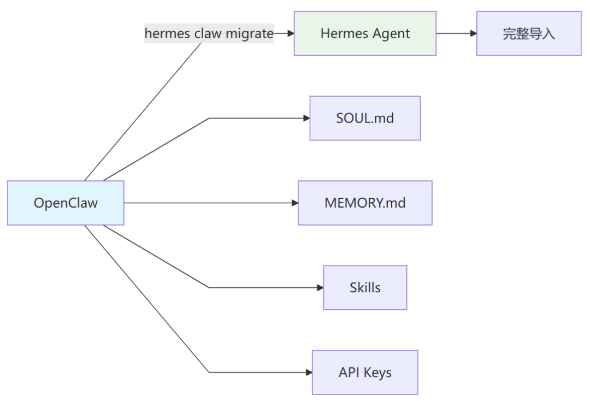

| 维度 | **Hermes Agent** | **OpenClaw** |
| --- | --- | --- |
| **从 OpenClaw 迁移** | ✅   ``` hermes claw migrate ```   工具 | - |
| **迁移内容** | SOUL.md、记忆、技能、API 密钥、工作区指令 | - |
| **技能兼容** | 兼容 agentskills.io 标准 | SKILL.md 规范 |
| **记忆格式** | MEMORY.md + USER.md | MEMORY.md + memory/\*.md |

### 7.6 生态系统

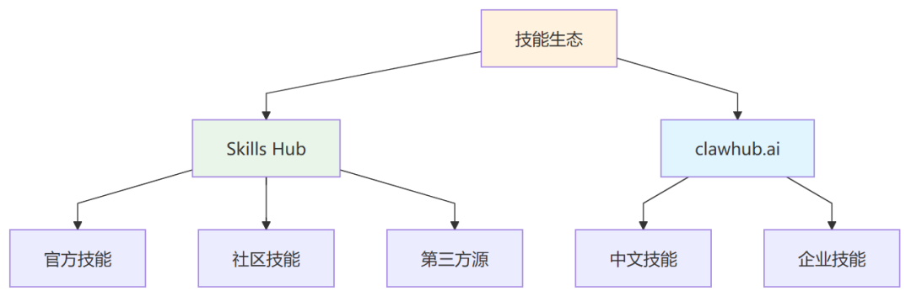

| 维度 | **Hermes Agent** | **OpenClaw** |
| --- | --- | --- |
| **技能市场** | Skills Hub (多源集成) | clawhub.ai |
| **第三方工具** | 丰富 (WebUI、桌面应用、管理面板) | 发展中 |
| **社区贡献** | 活跃 (GitHub 345+ 相关仓库) | 活跃 |
| **文档完整性** | ✅ 完整文档站点 | ✅ 完整文档站点 |

### 7.7 独特优势

#### 7.7.1 Hermes Agent 的独特优势

1. **自进化能力**：真正的学习循环，自动创建和改进技能
2. **模型无关性**：200+ 模型支持，无厂商锁定
3. **Serverless 部署**：Daytona/Modal 支持，闲置时几乎零成本
4. **完整 TUI**：现代终端界面，多行编辑、命令补全、鼠标支持
5. **多记忆提供商**：8 个外部记忆插件可选
6. **迁移工具**：官方提供从 OpenClaw 迁移的工具

#### 7.7.2 OpenClaw 的独特优势

1. **网关编排**：专注于多平台网关的统一管理
2. **本地化部署**：更适合需要精细控制的场景
3. **中文社区**：clawhub.ai 提供更多中文技能
4. **飞书集成**：对中国企业用户更友好
5. **简洁架构**：可能更易于理解和定制

---

## 8. 两者结合方案

Hermes Agent 和 OpenClaw 并非竞争关系，而是可以**互补共存**。以下是几种结合方案：

### 8.1 方案一：技能共享生态

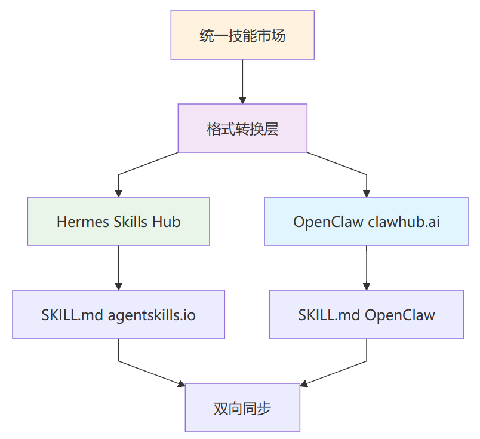

**目标：** 建立统一的技能市场，支持两种格式

**实现方式：**

1. 制定 SKILL.md 格式转换规范
2. 开发格式转换工具
3. 在 clawhub.ai 和 Skills Hub 之间建立同步机制

**优势：**

- 技能开发者一次编写，多处运行
- 用户可访问更丰富的技能库
- 促进社区协作

**挑战：**

- 两种格式的细节差异需要对齐
- 平台特定功能需要抽象层

### 8.2 方案二：记忆同步层

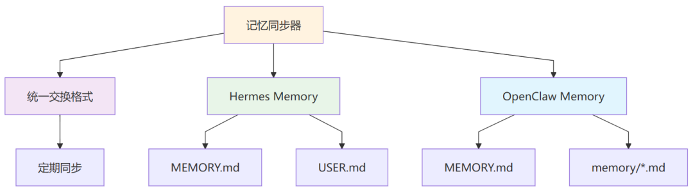

**目标：** 让两者共享长期记忆

**实现方式：**

1. 定义统一的记忆交换格式
2. 开发记忆同步工具（双向）
3. 支持定期自动同步

**同步内容：**

- MEMORY.md 条目
- USER.md 条目
- 关键项目上下文

**优势：**

- 在不同 Agent 之间保持连续性
- 避免重复学习
- 提升用户体验

**挑战：**

- 记忆格式差异
- 冲突解决策略
- 隐私和安全考虑

### 8.3 方案三：网关路由层

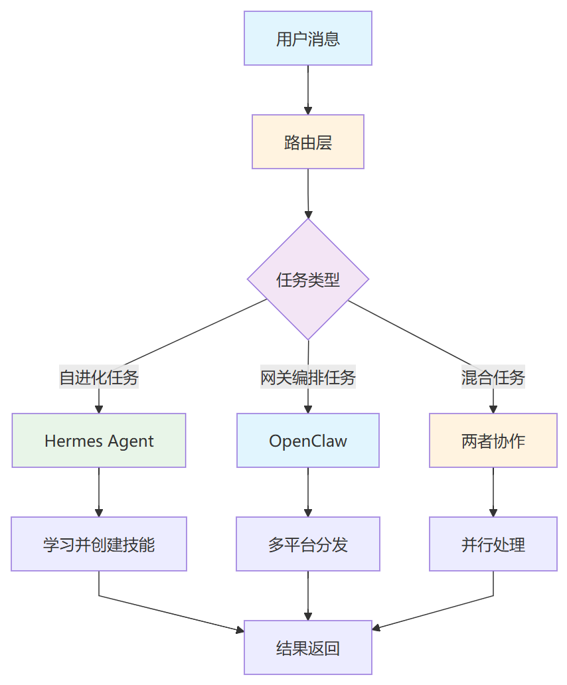

**目标：** 在消息层做智能路由，根据任务类型分发

**架构：**

```
用户消息 → 路由层 → 判断任务类型
```

**路由规则示例：**

- 需要学习新技能的任务 → Hermes
- 需要多平台分发的任务 → OpenClaw
- 需要精细安全控制的任务 → OpenClaw
- 需要 serverless 执行的任务 → Hermes

**优势：**

- 发挥各自优势
- 用户无感知切换
- 灵活扩展

**挑战：**

- 路由逻辑设计
- 跨 Agent 上下文传递
- 结果汇总

### 8.4 方案四：混合部署

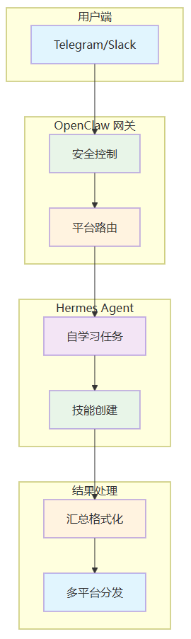

**目标：** 在同一工作流中使用两者

**场景示例：**

```
1. 用户在 Telegram 发送任务
```

**优势：**

- OpenClaw 处理网关和安全
- Hermes 处理学习和进化
- 各司其职

**挑战：**

- Agent 间通信协议
- 状态同步
- 错误处理

### 8.5 方案五：开发工具链整合

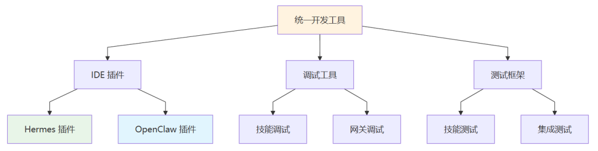

**目标：** 统一开发和调试体验

**实现方式：**

1. 开发支持两种框架的 IDE 插件
2. 统一的技能调试工具
3. 共享的测试框架

**优势：**

- 降低开发者学习成本
- 提高开发效率
- 促进技能质量提升

---

## 9. 实际使用案例

### 9.1 案例一：个人研究助手

**场景：** Nancy 研究 AI 前沿知识并撰写技术博文

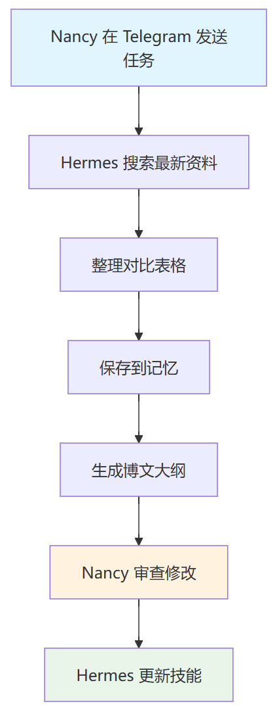

**Hermes 配置：**

- 模型：Claude Opus（深度分析）
- 记忆：保存研究方向、写作风格偏好
- 技能：文献检索、摘要生成、博文模板

**工作流：**

```
1. Nancy 在 Telegram 发送："帮我研究最新的 Agent 框架对比"
```

**学习成果：**

- 创建"技术博文写作"技能
- 记住 Nancy 的写作风格
- 积累研究资料库

### 9.2 案例二：自动化运维

**场景：** 管理多台服务器和云服务

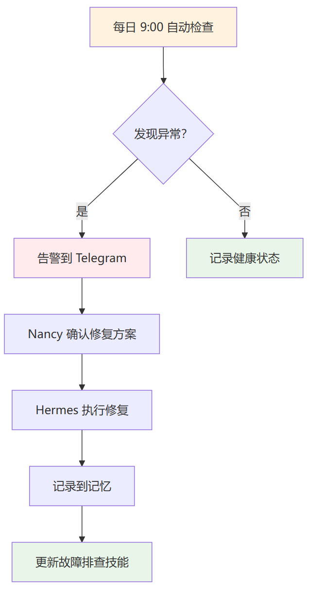

**Hermes 配置：**

- 终端后端：SSH
- 调度：每日健康检查、每周安全审计
- 技能：部署、监控、故障排查

**工作流：**

```
1. 每日 9:00 自动检查服务器状态
```

### 9.3 案例三：团队协作

**场景：** 开发团队共享技能和知识

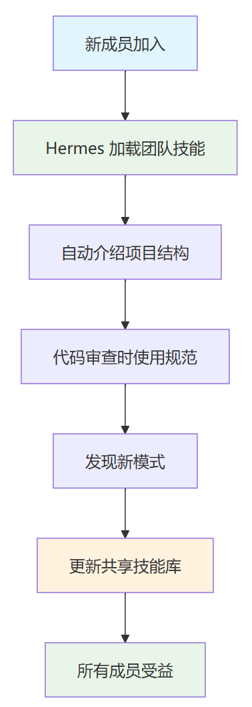

**配置：**

- 外部技能目录：

  ```
  /home/shared/team-skills
  ```
- 记忆共享：团队约定和项目规范
- 平台：Slack + GitHub

**工作流：**

```
1. 新成员加入，Hermes 加载团队技能
```

### 9.4 案例四：混合部署（Hermes + OpenClaw）

**场景：** 企业级 AI 助手

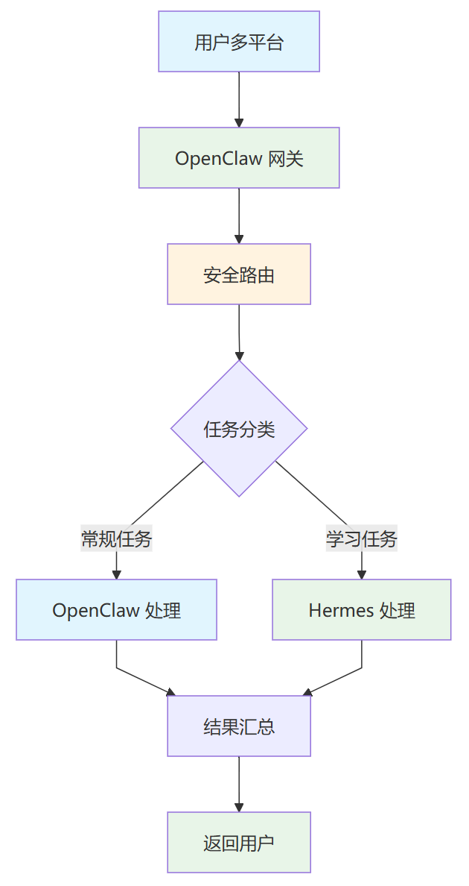

**架构：**

```
用户 (多平台) → OpenClaw 网关 (安全/路由)
```

**优势：**

- OpenClaw 处理企业安全要求
- Hermes 处理需要学习的复杂任务
- 统一用户体验

---

## 10. 常见问题解答

### Q1: Hermes Agent 和 Nous Hermes 模型是什么关系？

**A:** 两者都来自 Nous Research，但是不同的产品：

- **Nous Hermes 模型**：基于 Llama/Mistral 的指令微调开源模型
- **Hermes Agent**：完整的 AI 智能体框架，可以使用任何模型（包括 Hermes 模型）

### Q2: 我需要 GPU 才能运行 Hermes 吗？

**A:** 不需要。Hermes 本身是 Python 应用，可以在普通 CPU 上运行。它调用的是云端或本地的 LLM API。只有当你运行本地模型时才需要 GPU。

### Q3: Hermes 支持中文吗？

**A:** 支持。Hermes 支持任何你选择的模型，包括：

- Qwen（通义千问）
- GLM（智谱）
- Kimi（月之暗面）
- DeepSeek（深度求索）
- 以及任何支持中文的多语言模型

### Q4: 从 OpenClaw 迁移到 Hermes 复杂吗？

**A:** 不复杂。Hermes 提供官方迁移工具：

```
# 预览迁移内容
```

### Q5: 我可以同时运行 Hermes 和 OpenClaw 吗？

**A:** 可以。两者可以并行运行，甚至可以通过消息网关相互通信。注意配置不同的端口和路径以避免冲突。

### Q6: Hermes 的技能系统和 OpenClaw 的技能系统有什么区别？

**A:** 主要区别：

| 方面 | Hermes | OpenClaw |
| --- | --- | --- |
| 格式 | SKILL.md (agentskills.io 标准) | SKILL.md (OpenClaw 规范) |
| 学习 | 自动创建/改进技能 | 手动创建 |
| 市场 | Skills Hub (多源) | clawhub.ai |
| 条件激活 | 支持 (fallback/requires) | 需确认 |
| 外部目录 | 支持 | 需确认 |

### Q7: 成本如何？

**A:** 成本主要来自 LLM API 调用：

**Hermes 成本优化：**

- 支持 serverless 部署 (Daytona/Modal)，闲置时几乎零成本
- 支持模型路由，可选择性价比最高的模型
- 渐进式技能加载，减少 Token 消耗

**OpenClaw 成本优化：**

- 本地部署，无额外基础设施成本
- 支持多模型选择

### Q8: 安全性如何保证？

**A:** 两者都提供多层安全：

**Hermes：**

- 命令审批
- Docker 沙箱
- DM 配对
- 技能安全扫描
- 记忆注入扫描
- 配置与密钥分离

**OpenClaw：**

- 命令审批
- 安全模式
- 工具策略
- 配置与密钥分离

### Q9: 适合什么场景使用 Hermes？

**A:** Hermes 特别适合：

- 需要持续学习和适应的场景
- 多平台交互需求
- 复杂工作流自动化
- 个人 AI 助手
- 研究和开发辅助

### Q10: 适合什么场景使用 OpenClaw？

**A:** OpenClaw 特别适合：

- 需要精细安全控制的场景
- 中国企业用户（飞书等集成）
- 多平台网关统一管理
- 本地化部署需求
- 技能开发和分享

---

## 资源链接

| 资源 | 链接 |
| --- | --- |
| Hermes 官网 | https://hermes-agent.nousresearch.com |
| Hermes 文档 | https://hermes-agent.nousresearch.com/docs |
| Hermes GitHub | https://github.com/NousResearch/hermes-agent |
| Skills Hub | https://agentskills.io |
| Nous Research | https://nousresearch.com |
| Discord 社区 | https://discord.gg/NousResearch |
| OpenClaw 文档 | https://docs.openclaw.ai |
| OpenClaw GitHub | https://github.com/openclaw/openclaw |
| ClawHub | https://clawhub.ai |
