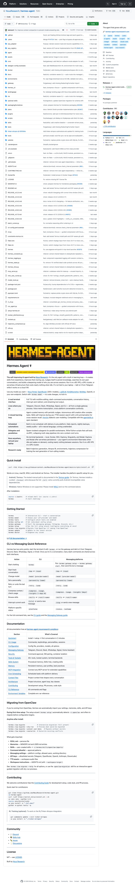

> 📎 来源: [手指改变世界](https://mp.weixin.qq.com/s?__biz=MzkxODMxNTQ2OA==&mid=2247484180&idx=1&sn=23553e53fba39ffc898861625b51a321&chksm=c09ae2581f60e555075046d5e6640435cafb25dc5413d091d6c6848cc11834250996fd448471&mpshare=1&scene=1&srcid=04245G5PVIvUWgnQJJZcBJ8g&sharer_shareinfo=2d15446f05f362a6fcea53a869f705f3&sharer_shareinfo_first=2d15446f05f362a6fcea53a869f705f3) | 时间: 2026-04-24 00:00

---

**导读：**上一篇文章讲了安装配置，这篇文章讲实战。很多人装了 Hermes Agent 但不知道能干嘛——47个内置工具、14+消息平台、MCP扩展……这篇文章用具体案例告诉你，它到底能替你做什么。

▲ Hermes Agent 内置 47 个工具，覆盖所有主流场景

## 01 能力全景图

Hermes Agent 内置 **47 个工具**，分布在 **37 个工具集**中，涵盖：

|  |  |  |
| --- | --- | --- |
| 能力类别 | 工具数量 | 代表工具 |
| 浏览器自动化 | 10 个 | navigate, click, snapshot |
| 文件操作 | 4 个 | read, write, patch, search |
| 终端命令 | 2 个 | terminal, process |
| 网页工具 | 2 个 | web\_search, web\_extract |
| Home Assistant | 4 个 | ha\_get\_state, ha\_call\_service |
| RL 训练 | 10 个 | 强化学习反馈回路 |
| 其他独立工具 | 15 个 | 记忆、任务、委托等 |

## 02 实战案例详解

### 案例 1：自动化研究调研

**场景：**你让 Hermes Agent 调研 "最新 AI Agent 发展趋势"，它会自动：

1. **web\_search** → 搜索最新资讯

2. **web\_extract** → 抓取关键文章正文

3. **read\_file** → 读取本地背景资料

4. **write\_file** → 生成调研报告

5. **memory** → 记住调研结论，下次直接调用

💡 效果：研究任务提速 ~40%（Skill 沉淀后）

### 案例 2：多平台消息中枢

**场景：**你在 Telegram 跟 Hermes 说 "把这条消息发到飞书群"，它会：

1. 接收 Telegram 消息

2. 解析消息内容和意图

3. **send\_message** → 通过飞书网关发送

4. 跨平台上下文不丢——飞书用户看到的是完整对话

💡 一套配置跑 14+ 平台，再也不用切换工具

### 案例 3：智能家居控制

**场景：**你跟 Hermes 说 "晚上 10 点把灯调暗，早安模式 7 点启动"，它会：

1. **cronjob** → 创建定时任务

2. **ha\_set\_state** → 设置灯光亮度

3. **ha\_call\_service** → 调用 Home Assistant 服务

4. 定时自动执行，无需人工干预

💡 真正的 "张嘴就来" 智能家居

### 案例 4：代码开发 + 自动化测试

**场景：**让 Hermes Agent 帮你开发一个 Web 项目：

1. **terminal** → 创建项目结构

2. **execute\_code** → 沙箱执行代码片段

3. **browser\_navigate** → 打开浏览器测试

4. **browser\_snapshot** → 验证页面状态

5. **delegate\_task** → 并行跑多个测试用例

💡 一个人就是一个开发团队

### 案例 5：内容创作 + 配图生成

**场景：**让 Hermes Agent 帮你写公众号文章并配图：

1. **web\_search** → 搜索热点素材

2. **image\_gen** → 生成封面图

3. **vision\_analyze** → 分析配图效果

4. **write\_file** → 保存文章草稿

5. **send\_message** → 推送草稿箱

💡 自动化内容生产线

## 03 MCP 扩展能力

MCP（Model Context Protocol）让 Hermes Agent 可以**无限扩展**：

|  |  |
| --- | --- |
| MCP 扩展方向 | 说明 |
| 本地 stdio 服务 | 连接本地 MCP 服务器 |
| 远程 HTTP 服务 | 通过 API 接入远程工具 |
| per-server filtering | 按需暴露工具子集，安全可控 |
| 动态注册 | 无需重启，自动发现工具 |

# 配置示例

mcp\_servers:

 my\_tool:

   command: python

   args: ["/path/to/server.py"]

💡 工具数量无上限，想接什么接什么

## 04 对比同类产品

|  |  |  |  |
| --- | --- | --- | --- |
| 能力 | Hermes | OpenClaw | Claude Code |
| 内置工具数 | 47 个 | 30+ | 受限 |
| 自进化能力 | ✅ 自动写 Skill | ❌ 人工维护 | ❌ 无 |
| 三层记忆 | ✅ SQLite+FTS5 | ✅ 文件存储 | ❌ 无 |
| 消息平台数 | 14+ | 10+ | 0 |
| MCP 扩展 | ✅ 双向支持 | ✅ 支持 | ❌ 无 |

## 05 适用场景总结

|  |  |  |
| --- | --- | --- |
| 场景 | 推荐度 | 核心工具 |
| 个人 AI 助手 | ⭐⭐⭐⭐⭐ | 全工具链 |
| 自动化运维 | ⭐⭐⭐⭐⭐ | terminal, cronjob |
| 智能家居控制 | ⭐⭐⭐⭐ | ha\_\*, cronjob |
| 内容创作 | ⭐⭐⭐⭐ | image\_gen, web\_search |
| 代码开发 | ⭐⭐⭐⭐ | terminal, browser |
| 多平台运营 | ⭐⭐⭐⭐⭐ | gateway, send\_message |

## 06 总结

Hermes Agent = 47个工具 + 14+平台 + 自进化 + MCP扩展

它不只是一个 AI 对话工具，是一个**会学习、会工作、会成长的智能体平台**。用得越久，它越懂你、越能干。

GitHub：github.com/NousResearch/hermes-agent

— END —

话题标签：

AI Agent Hermes Agent 实战案例 47工具 MCP扩展 Nous Research 人工智能 技术分享
