> 📎 来源: [鹏哥自由人生](https://mp.weixin.qq.com/s?__biz=MzU3ODAwNTQ5MQ==&mid=2247486415&idx=1&sn=542f822423bc35b5719ecf8a88ae2a63&chksm=fc5a2e9c2ef3a49065718ae43ba964a2c944e72d2971727ea4a433ddbe6cd377cdc8246ff8b9&mpshare=1&scene=1&srcid=0420h8kG6k27Y1dDI0BEhsdH&sharer_shareinfo=49388433b1dba972e5fbd3e250f32070&sharer_shareinfo_first=49388433b1dba972e5fbd3e250f32070) | 时间: 2026-04-20 15:45

---

4 月 13 日，Hermes Agent 发布了v0.9.0 版本，在这个版本中，个人微信也终于可以接入了。

作为国民级应用，微信有 14 亿月活用户（全球第 7 大社交平台），在Hermes 的生态中无疑有着举足轻重的地位。

需要说明的是，当前个人微信的接入并不是微信官方提供的，而是一位中国的开源贡献者提供的。

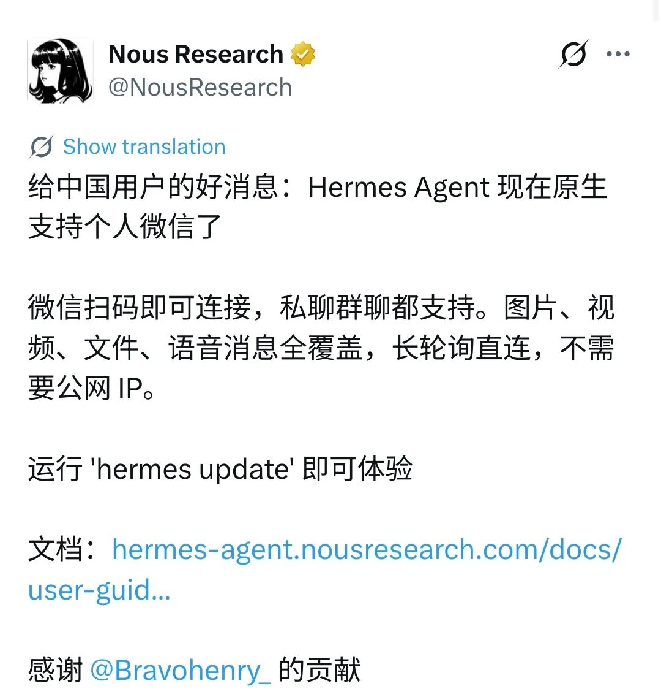

因此，虽然目前Hermes能够支持在个人微信上使用，但是还有一定的局限性，例如不支持电脑端的微信，也不支持群聊。

按照当前Hermes的发展势头（当前已有 8 万+ star，一周前这个数字是4万），相信不久后微信会推出官方的支持插件。

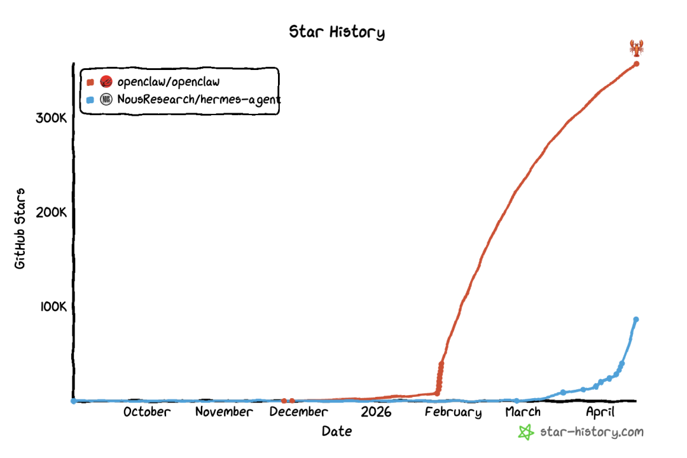

当前可以认为是尝鲜版。我把完整的安装和配置教程写在下面，想要体验的朋友可以参考哈。

本地安装 VS 云端安装

Hermes Agent 支持云端安装（运行在云服务器上），也支持本地安装（运行在本地电脑）。

两种安装方式的对比如下：

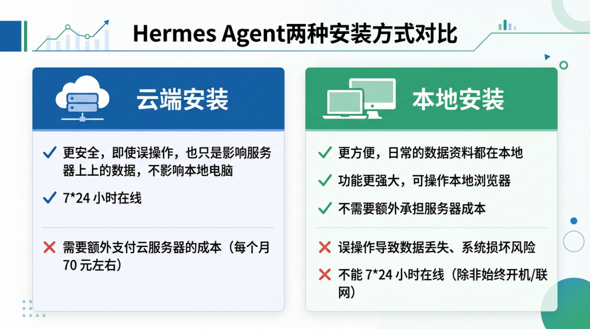

如果是新手用户，我更建议采用云端安装，除了上面说的这些优点外，还有一个就是操作系统的因素。

很多用户使用的是Windows系统，而安装和后期维护常常需要进行一些命令行操作，在Linux系统上的支持会更好，同样的安装步骤，在Windows上也可能会遇到一些奇怪的环境问题。

如果是有经验的用户，且使用的是MacOS 系统的电脑，本地安装也是一种很好的选择。

准备工作

在安装之前，我们需要先准备好如下 2 种资源：

1. 云服务器（个人电脑）

2. 大模型API Key

关于云服务的购买和大模型的购买，可以参考我[上一篇文章](https://mp.weixin.qq.com/s?__biz=MzU3ODAwNTQ5MQ==&mid=2247486385&idx=1&sn=d596119f9cccd1b0d7316b269072fb06&scene=21#wechat_redirect)中的准备工作部分，此处不再赘述。

安装Hermes

命令行一键安装

在命令行执行Hermes一键安装命令。

```
curl -fsSL https://raw.githubusercontent.com/NousResearch/hermes-agent/main/scripts/install.sh | bash
```

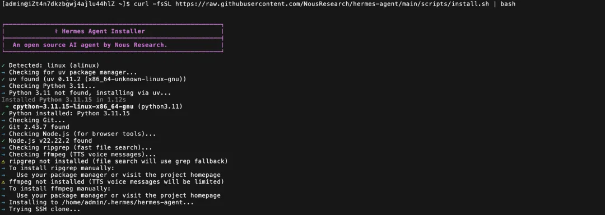

等待大概 2 分钟左右，就会完成安装。

配置大模型和微信

接下来，会提示是否进入配置流程，选择Quick setup。

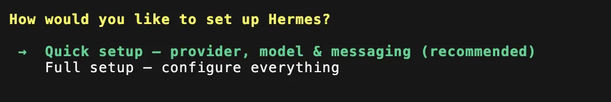

然后进入大模型配置页面，选择自己使用的大模型供应商，并配置API key。

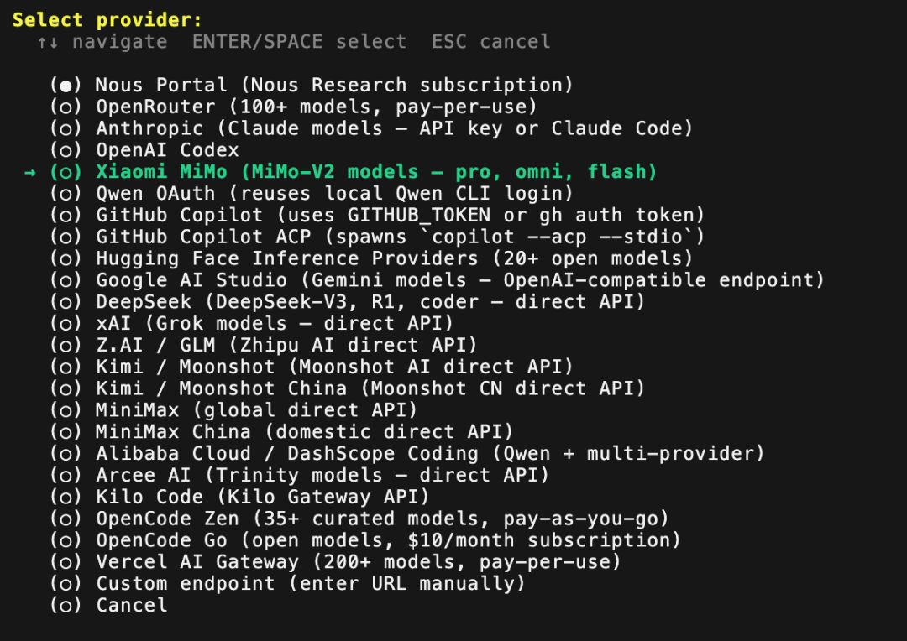

v0.9.0版本的供应商列表选项更多了，xiaomi也成为了默认的大模型供应商（上一个版本还没有）。

接下来配置社交软件。

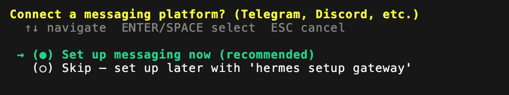

直接从列表里选择Weixin。

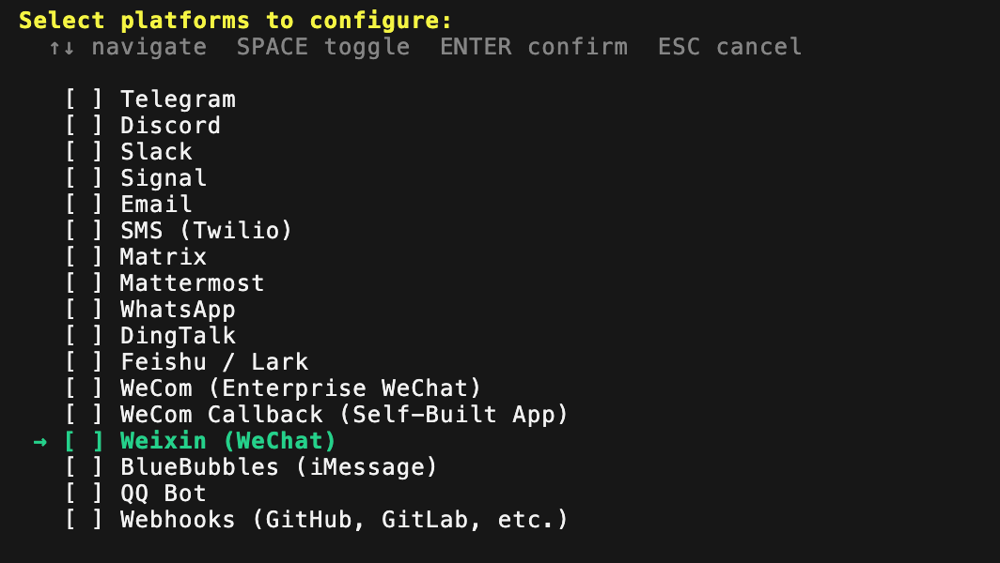

我选择这个以后，直接提示配置完成（感觉还是流程有点问题）。

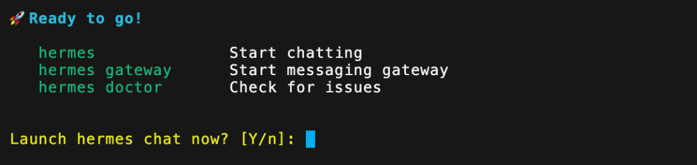

我们先选择n退出，然后执行

```
hermes gateway setup
```

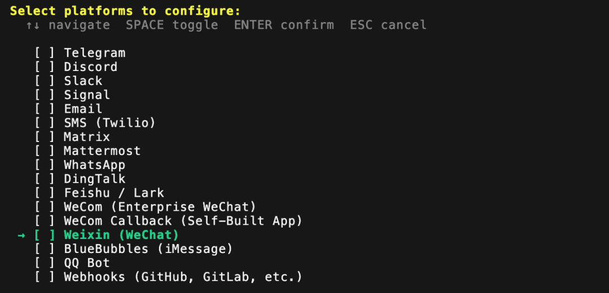

再次选择微信，这次会提示是否通过二维码完成配置。

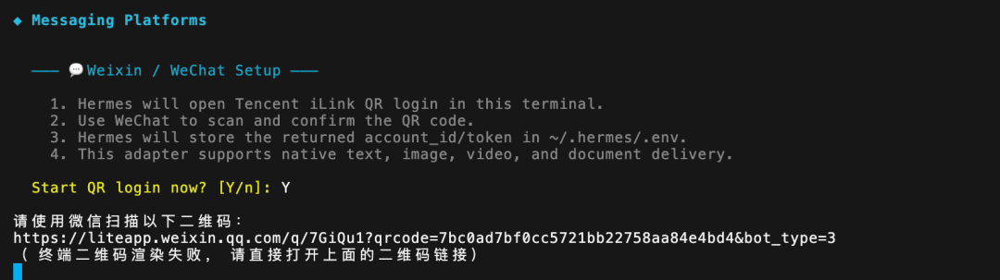

输入Y确认后，会展示一个二维码链接。

点击链接，并用微信扫码，即可进入微信ClawBot页面。

接下来，在配置流程中，会询问我们如何给微信授权。

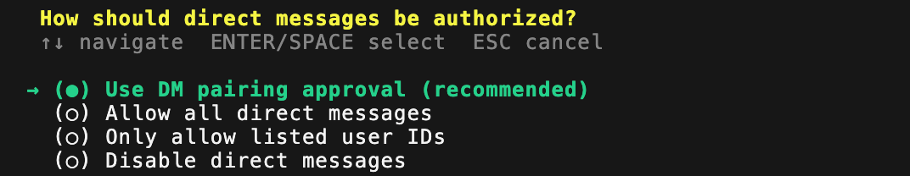

选择推荐的第一项即可。接下来也都选择默认选项。

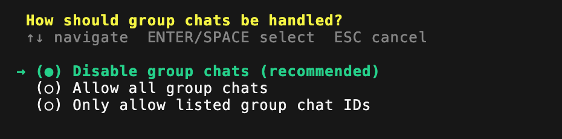


这样就完成微信的配置了。

然后，我们执行如下命令安装网关。

```
hermes gateway install
```

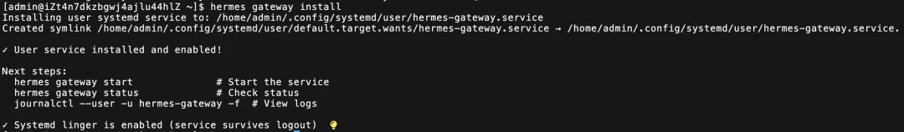

最后，启动hermes服务。

```
hermes gateway start
```

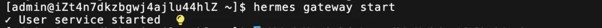

使用hermes gateway status命令查看一下运行状态。

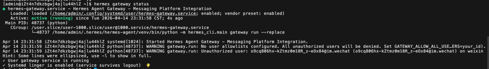

看到绿色的running，说明启动成功。

去微信里跟它说句话。

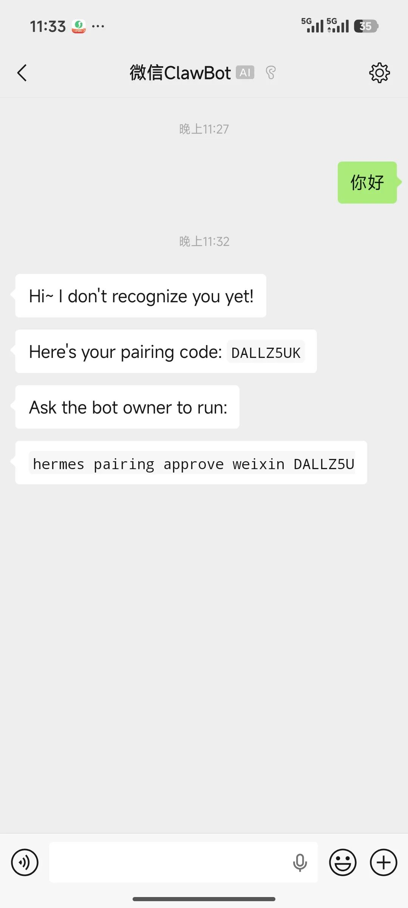

第一次，会提示我们配对。

把最后一行在命令行里运行即可。

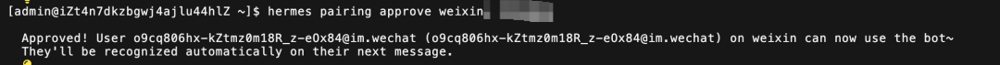

现在，我们就可以在微信中正常的跟Hermes 聊天了。

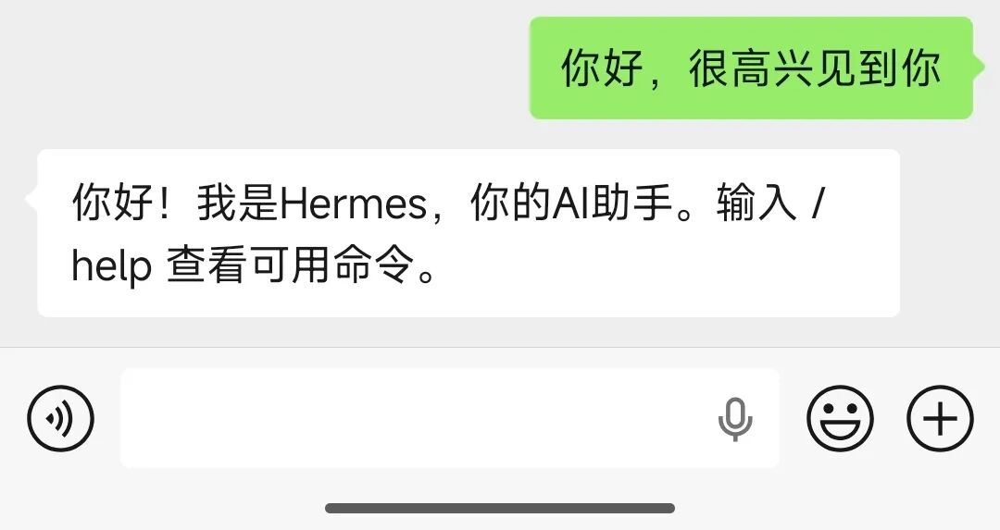

使用体验

支持语音和图片

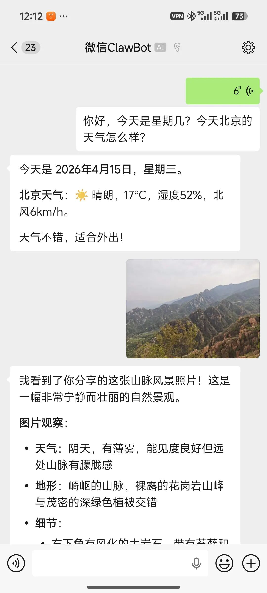

不支持群聊

虽然Hermes在公告里说个人微信支持群聊，但是实际上当前并不支持，如果想要支持群聊，还是需要使用企业微信。

帮Hermes接入个人微信的开源贡献者本人也确认了这一点。

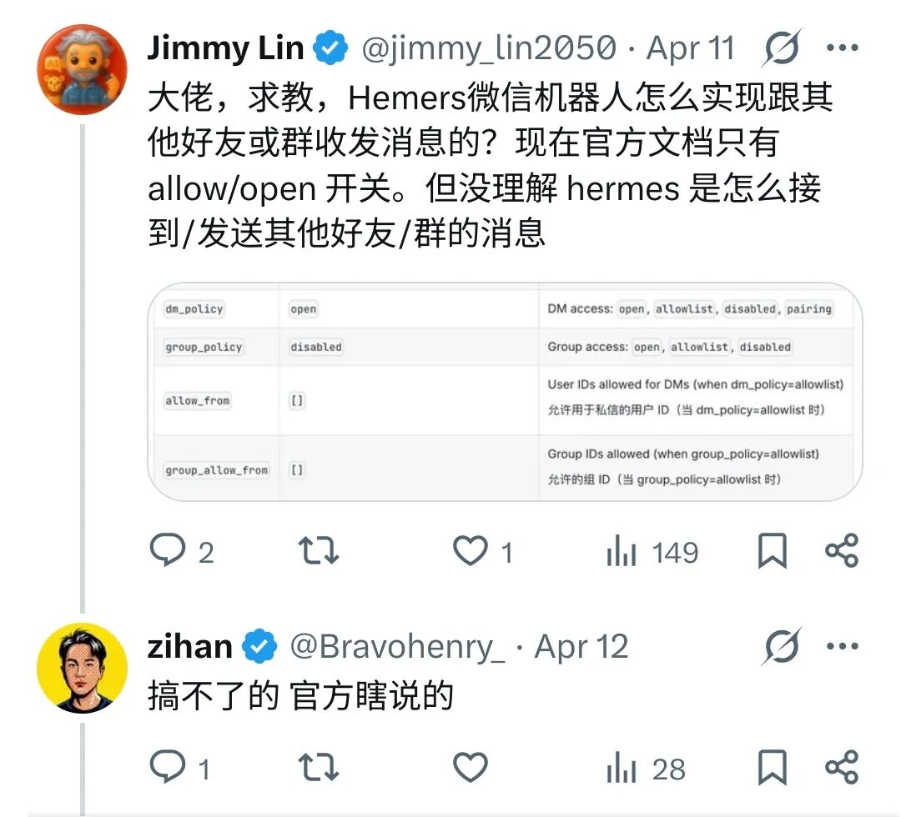

不支持电脑端微信

当前，如果使用个人微信的话，仅支持在手机微信里使用，不支持电脑端的微信。

这是我让我的Hermes去查源码后确认的结果。

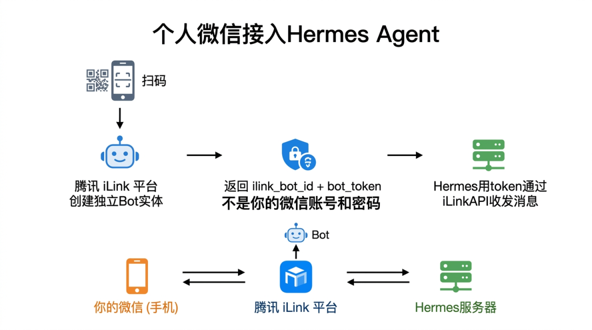

简单来说，当前使用的是腾讯 iLink **BotAPI接入的，它只是在我们扫码时，帮我们创建了一个机器人，并展示在个人手机微信里。**

写在最后

当前 AI 的发展速度实在是太快了，各种新名词层出不穷，什么Agent、Skill、MCP、Herness……让人眼花缭乱。

各家公司的个人助理也是百花齐放，什么OpenClaw、QClaw、EasyClaw、Kimi Claw……，还有现在的Hermes，将来也一定会有更多的工具出现。

相信有很多人（包括我自己），常常会有一些焦虑，担心自己跟不上变化。

但事实上，现在的 AI 已经快到没人能完全跟得上。我们不一定非要紧跟潮流，买最先进的模型、用最新的工具。

更有价值的是先改变过去凡事都亲力亲为的观念，尝试让 AI 走进我们的生活，让它开始在我们工作/生活的真实场景中逐步的替我们完成越来越多的任务，从而把自己解放出来，去处理更重要的事情。

只要能真正的发挥出价值，用什么模型、什么工具都不是最重要的，关键是慢慢的用起来，用起来才知道什么最合适，哪里还可以更好。

我考虑接下来写几篇 AI 应用类的文章，权作抛砖引玉，与大家共同探讨作为一个的普通人，如何让 AI 真正的发挥价值，敬请期待。
