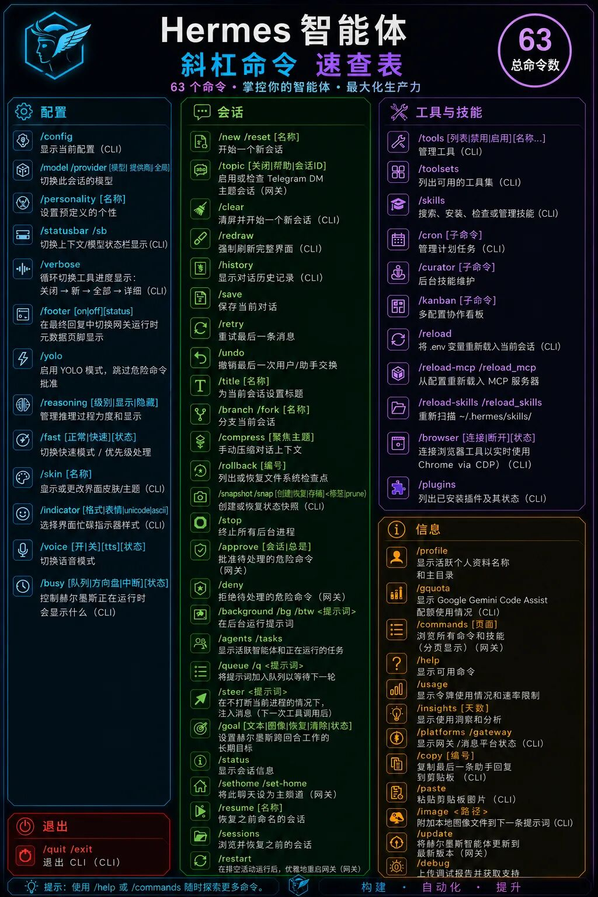
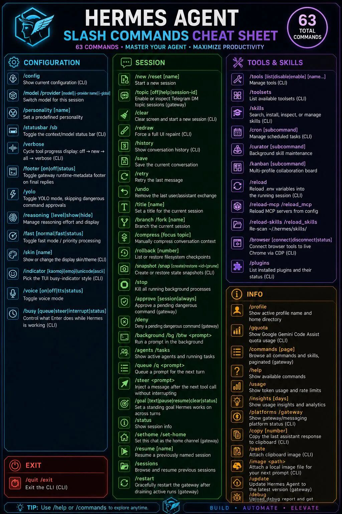

> 📎 来源: [极客BIM设计工坊](https://mp.weixin.qq.com/s?__biz=MzI2MjA3ODk0OQ==&mid=2648117105&idx=1&sn=ce5db9455df4d332f31a7ed1d0f177fb&chksm=f3a693e18f3f147258ff3207e12e6f00d74802f19423b02f4b30ea36ba77fa3050db23a3e433&mpshare=1&scene=1&srcid=051153RCgeoGmi6AvGbDl8Y1&sharer_shareinfo=e031d6c98826f15a4ca8766de678c08d&sharer_shareinfo_first=e031d6c98826f15a4ca8766de678c08d) | 时间: 2026-05-11 00:07

---

#Hermes #SlashCommands #速查

长话短说

Hermes Agent 内置 60+ 条斜杠命令，散记不可能。正确做法是理解命令框架的四抽屉结构——只要记住分类逻辑和核心动词，用到时按类别 + / + Tab 就能找到。

4

命令抽屉

60+

内置命令

/Tab

自动补全

命令行工具的命令越记越多，记了就忘，忘了又查——这是所有 CLI 用户的常态。Hermes Agent 的斜杠命令有 **60 多条**，如果靠死记硬背，不出一周就会混成一团。

但命令不是用来背的，是用来理解的。这 60 多条命令可以拆成 **四个抽屉**，每个抽屉对应一类操作。记住抽屉结构，比记住每条命令本身重要得多。



四抽屉结构

无论打开哪个工具的帮助文档，第一件事不是看命令列表，而是看分类。Hermes 的斜杠命令天然落在四个维度上：

●　**会话（Session）** — 关于当前对话怎么开始、怎么保存、怎么回溯

●　**模型与工具（Model & Tools）** — 用什么模型、开什么工具、装什么技能

●　**配置（Config）** — 人格、主题、语音、推理力度等全局设定

●　**信息（Info）** — 用量统计、帮助、系统状态

这四类对应四种不同的意图。当你需要做一件事时，先判断它属于哪个抽屉，再去那个抽屉里找具体命令。

抽屉一：会话——最常用的那一批

会话命令解决的是"对话生命周期"问题。记住一个核心原则：**会话命令的动词都跟时间线相关**——开始、继续、撤回、保存、分支。

▸　**/new** 或 **/reset** — 新会话（清空历史，生成新 ID）

▸　**/resume [名称]** — 回到之前命名的会话

▸　**/title [名称]** — 给当前会话起名字，方便后续 /resume

▸　**/retry** / **/undo** — 重试上一条 / 撤回上一轮交换

▸　**/save** / **/history** — 保存到磁盘 / 查看对话历史

▸　**/compress [焦点]** — 手动压缩上下文（把记忆落地、对话总结）

▸　**/branch** / **/fork** — 从当前对话分叉，探索另一条路径

▸　**/background [提示]** — 后台跑一个任务，不阻塞当前对话

速记方法：想象一条时间线从左到右。**/new 在最左，/resume 是跳回中间某点，/save 是拍照，/branch 是分叉。**理解了时间线，这些命令的关系就清楚了。

抽屉二：模型与工具——切换能力组合

这个抽屉的命令改变了 Agent 的能力——用什么大脑、带什么工具箱、装什么插件。

▸　**/model [模型] [--global]** — 切换模型（加 --global 设为默认）

▸　**/tools** / **/toolsets** — 当前会话的工具开关 / 工具集列表

▸　**/skills [动作]** — 搜索、安装、管理技能

▸　**/cron** — 定时任务面板

▸　**/reload** — 重新加载 .env（不重启会话）

▸　**/reload-mcp** — 重新加载 MCP 服务器配置

速记方法：**/model 管大脑，/tools 管能力，/skills 管扩展**。三层：模型是运行基础，工具是内置能力，技能是社区扩展。新增一个能力源，就用 /reload 激活。

抽屉三：配置——调 Agent 的"样子"

配置命令改变的是 Agent 的行为模式，不是对话内容。这些命令通常在切换使用时设置一次，不会频繁操作。

▸　**/config** — 查看当前完整配置

▸　**/personality** — 设置人格（如"代码审查者""导师模式"）

▸　**/reasoning** — 调节推理力度（如深入思考 vs 快速回应）

▸　**/skin** — 切换 TUI 界面主题

▸　**/voice** — 语音模式开关

速记方法：**"改样子"**——人格是内在样子（怎么回答），语音是输出样子（说还是写），皮肤是界面样子（长什么样）。

抽屉四：信息——问 Agent 关于自己

这些命令不改变任何东西，只用于查询状态。它们是自我诊断的入口。

▸　**/usage** — 令牌和费用统计

▸　**/insights** — 用量分析快照

▸　**/profile** — 查看当前用户/身份信息

▸　**/help** — 查看可用命令

▸　**/quit** — 退出当前会话

速记方法：**"问 Agent 三个问题"**——你花了多少钱（/usage）、你是谁来着（/profile）、你还能干什么（/help）。

真正的速记法：分类 + 核心动词

四类命令的核心动词可以压缩成一张表，记住这些动词，命令就能推出来：

会话：

```
new | resume | save | undo | branch | bg
```

模型工具：

```
model | tools | skills | cron | reload
```

配置：

```
config | personality | skin | voice
```

信息：

```
usage | insights | profile | help | quit
```

**一句话口诀**：*"开会话 / 换模型 / 调样子 / 查状态"*——每一步对应一个抽屉，每个抽屉有 5-7 个核心动词。只要记住哪个抽屉管什么事，输入

```
/
```

 +

```
Tab
```

 就能看到该抽屉下的完整命令列表。

**重点**　输入

```
/
```

 即可触发自动补全菜单，命令不区分大小写。这是命令行内置的安全网——忘了精确拼写也不要紧。

别忘了技能也是命令

Hermes 的一个特殊设计：**安装的技能会自动注册为斜杠命令**。比如安装了

```
/plan
```

 技能后，输入

```
/plan
```

 就能直接进入计划模式。这意味着你的命令列表会随着安装的技能动态增长——这也是为什么理解分类比记住每条命令更重要：新技能通常按领域归属到"模型与工具"抽屉。

配套速查图



X 用户 @NeoAIForecast 制作了一张 Hermes Agent 斜杠命令速查图，将 60+ 条命令以视觉方式做了四色分类。完整图像可在原帖中查看。

官方完整命令参考（持续更新）：hermes-agent.nousresearch.com/docs/reference/slash-commands

TIP快速上手法

**第一步** — 进会话后先敲

```
/
```

 ，看自动补全列表，感性地认识一遍。

**第二步** — 做一件事之前，先判断它是哪个抽屉的："开会话 / 换模型 / 调样子 / 查状态"。

SOURCES

Hermes Agent 官方文档 — hermes-agent.nousresearch.com/docs/reference/slash-commands

@NeoAIForecast — X 帖子速查图 / 社区整理
