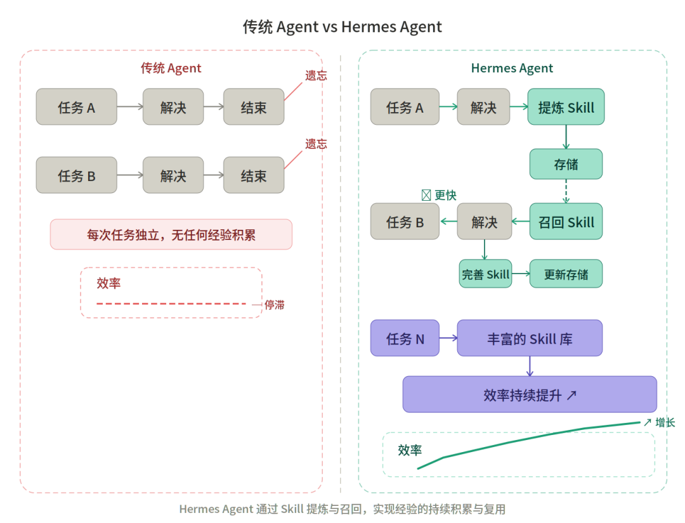
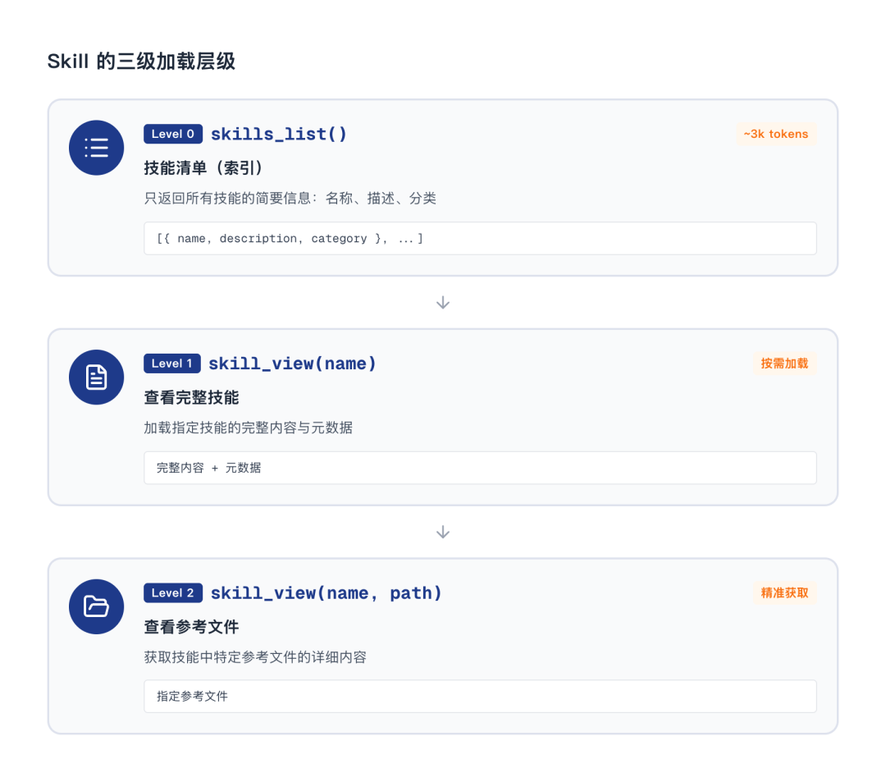

> 📎 来源: [亲爱的缪斯](https://mp.weixin.qq.com/s?__biz=Mzk4ODIzNzc4OQ==&mid=2247484695&idx=1&sn=64b945fc7ce2b117af17c2b5000ca737&chksm=c44e51aff3ee0c07f91da58e0974330ad440361ad82a86389bde0a1537732fe44e802b155897&mpshare=1&scene=1&srcid=0429qmdSmcWxoDIGBboa4NVu&sharer_shareinfo=cb9982394a2b4b8b1d7dd0e633c8dbbb&sharer_shareinfo_first=cb9982394a2b4b8b1d7dd0e633c8dbbb) | 时间: 2026-04-29 14:07

---

#### 1. 什么是 Hermes Agent

Hermes Agent 是由 Nous Research 开发的**自我进化 AI Agent 框架**，以 MIT 协议开源。

它解决的核心问题是"Agent 失忆症"——绝大多数 AI 工具在会话结束后会把所有经验清空，下次从头开始。Hermes 的设计哲学是让 Agent 真正积累经验：



##### 核心特性：

- **闭环学习**：Agent 完成复杂任务后自动蒸馏出可复用的 Skill，并写入持久记忆
- **三层记忆架构**：跨会话的自动记忆，记住你的偏好、项目上下文和工作习惯
- **多平台接入**：CLI、Telegram、Discord、Slack、WhatsApp、Signal、Email 等 15+ 平台，通过同一个 Gateway 进程统一管理
- **后端灵活**：支持 6 种终端后端（本地、Docker、SSH、Daytona、Singularity、Modal）
- **模型无关**：支持 Nous Portal、OpenRouter、Anthropic、OpenAI、DeepSeek、Ollama 等 20+ 供应商，

  ```
  hermes model
  ```

  一键切换，无需改代码
- **开放标准 Skill**：兼容 agentskills.io 开放标准，Skill 可在 Hermes、Claude Code、Cursor 等工具间共享
- **内置 Cron 调度**：自然语言描述定时任务，结果推送到任意平台
- **研究级功能**：批量轨迹生成、RL 训练（Atropos 集成）、ShareGPT 格式导出

#### 2. 部署教程

##### 前置要求

**唯一硬性前置依赖是 

```
git
```

。**其余所有依赖（uv、Python、Node.js、ripgrep、ffmpeg）均由安装脚本自动处理，无需手动安装。

验证 git 是否可用：

```
git --version
```

##### Mac / Linux 安装

**macOS 和 Linux 安装命令相同**

```
curl -fsSL https://raw.githubusercontent.com/NousResearch/hermes-agent/main/scripts/install.sh | bash
```

安装脚本会自动完成：Python 环境配置、依赖安装、全局 

```
hermes
```

命令注册、以及 LLM 供应商初始配置。

安装结束后，重载 Shell 环境变量：

```
# Bash 用户source ~/.bashrc# Zsh 用户（macOS 默认）source ~/.zshrc
```

##### Windows 安装（WSL2）

**原生 Windows 不受支持。**官方唯一支持的 Windows 路径是通过 WSL2（Windows Subsystem for Linux 2）运行。

**步骤 1：安装 WSL2**

打开 PowerShell（以管理员身份运行）：

```
wsl --install
```

安装完成后重启电脑，然后打开 WSL2 终端（Ubuntu）。

**步骤 2：在 WSL2 内运行安装命令**

```
curl -fsSL https://raw.githubusercontent.com/NousResearch/hermes-agent/main/scripts/install.sh | bash
```

**步骤 3：重载 Shell**

```
source ~/.bashrc
```

> **WSL2 特别提示（Gateway 服务）：**WSL2 的 systemd 支持不稳定，启动 Gateway 服务请使用 

> ```
> hermes gateway run
> ```

> （前台运行），而不是 

> ```
> hermes gateway start
> ```

> 。若需持久运行，建议配合 tmux：

> ```
> tmux new -s hermes 'hermes gateway run'
> ```

##### 安装后验证

```
# 1. 检查命令是否可用hermes --version# 2. 诊断环境问题（如有异常）hermes doctor# 3. 配置 LLM 供应商（首次必做）hermes model# 4. 运行 Setup 向导（一步配置全部选项）hermes setup# 5. 启动对话hermes           # 经典 CLIhermes --tui     # 现代 TUI（推荐，支持鼠标和模态界面）
```

#### 3. 基础使用

##### 启动对话

```
hermes              # 启动交互式 CLIhermes --tui        # 启动现代 TUI 界面hermes -c           # 恢复最近一次会话（短格式）hermes --continue   # 恢复最近一次会话
```

##### 一次性查询（非交互）

```
# 问一个简单问题，返回一句结果后退出hermes chat -q "用一句话解释什么是大语言模型"# 让回答更简洁hermes chat --quiet -q "帮我写一句适合发朋友圈的早安文案"# 调用 web / terminal / skills 等能力完成更复杂的任务hermes chat --toolsets web,terminal,skills -q "帮我查找并总结最近的 AI 新闻"
```

##### 配置管理

```
hermes model                                        # 交互式切换 LLM 供应商和模型hermes tools                                        # 配置可用工具hermes config set model anthropic/claude-opus-4-6  # 设置具体配置项hermes config set OPENROUTER_API_KEY sk-or-...     # 设置 API Key（自动写入 .env）hermes config show                                  # 查看当前所有配置hermes config check                                 # 检查配置完整性
```

配置文件位置：

- **API Key / 密钥**→ 

  ```
  ~/.hermes/.env
  ```
- **非机密配置**→ 

  ```
  ~/.hermes/config.yaml
  ```

##### 常用斜杠命令（对话内使用）

| 命令 | 作用 |
| --- | --- |
| `/help` | 显示所有可用命令 |
| `/tools` | 列出当前可用的工具 |
| `/model` | 在已配置的模型间切换 |
| `/model claude-opus-4-6 --global` | 切换模型并持久保存 |
| `/save` | 保存当前对话 |
| `/skills` | 查看已安装的 Skill |
| `/skill-name` | 调用指定 Skill |
| `/quit` | 退出对话 |

#### 4. Skill 系统详解

##### 什么是 Skill

Skill 是 Hermes 的**程序性记忆**——一种按需加载的知识文档，遵循「渐进式披露」模式以最小化 Token 消耗。



Agent 只在真正需要时才加载完整的 Skill 内容， 从清单 →详情 →参考文件逐层深入， 从而将 Token 消耗降到最低。

##### Skill 系统的目录结构与路径

**主目录：

```
~/.hermes/skills/
```**

```
~/.hermes/skills/                  # 主目录（读写）├── mlops/                         # 分类目录（可自定义）│   ├── axolotl/│   │   ├── SKILL.md               # 主指令文件（必须）│   │   ├── references/            # 附加参考文档│   │   ├── templates/             # 输出格式模板│   │   ├── scripts/               # 可由 Skill 调用的辅助脚本│   │   └── assets/                # 补充资产文件│   └── vllm/│       └── SKILL.md├── devops/│   └── deploy-k8s/                # Agent 自动创建的 Skill│       ├── SKILL.md│       └── references/├── .hub/                          # Skills Hub 状态│   ├── lock.json│   ├── quarantine/│   └── audit.log└── .bundled_manifest              # 内置 Skill 的追踪清单
```

**关键规则：**

- ```
  ~/.hermes/skills/
  ```

  是唯一的写入来源；Hub 安装和 Agent 自动创建的 Skill 都写入这里
- 外部目录（external\_dirs）只读，用于跨工具共享 Skill
- 每个 Skill 的入口文件必须命名为 

  ```
  SKILL.md
  ```

##### SKILL.md 格式规范

以下是官方定义的完整 SKILL.md 格式：

```
---name: my-skilldescription: 本 Skill 的简短描述（用于 skills_list 展示和斜杠命令自动补全）version: 1.0.0platforms: [macos, linux]     # 可选 — 限定 OS 平台metadata:  hermes:    tags: [python, automation]    category: devops    fallback_for_toolsets: [web]    # 可选 — 条件激活（见下文）    requires_toolsets: [terminal]   # 可选 — 条件激活（见下文）    config:                          # 可选 — 声明 config.yaml 设置项      - key: my.setting        description: "此设置项的作用说明"        default: "value"        prompt: "Setup 时的提示语"---# Skill 标题## When to Use触发本 Skill 的条件描述。## Procedure1. 第一步2. 第二步## Pitfalls- 已知的失败场景及解决方法## Verification如何确认执行结果是正确的。
```

**```
platforms
```

字段取值：**

| 值 | 匹配平台 |
| --- | --- |
| `macos` | macOS (Darwin) |
| `linux` | Linux |
| `windows` | Windows |

当 

```
platforms
```

字段设置后，Skill 会在不兼容平台上自动从系统 prompt、

```
skills_list()
```

和斜杠命令中隐藏。若不设置，默认在所有平台可见。

#### 5. Skill 开发教程

##### 手动创建一个 Skill

以创建一个「早安文案助手」Skill 为例：

**步骤 1：创建目录结构**

```
# Mac / Linux / WSL2mkdir -p ~/.hermes/skills/creative/morning-copywritertouch ~/.hermes/skills/creative/morning-copywriter/SKILL.md
```

**步骤 2：编写 SKILL.md**

```
---name: morning-copywriterdescription: 帮你生成适合朋友圈、微信或社交平台发布的早安文案version: 1.0.0platforms: [macos, linux]metadata:  hermes:    tags: [writing, social, content]    category: creative---# 早安文案助手## When to Use当用户想写一句早安文案、朋友圈配文、温柔问候语或正能量短句时使用。## Procedure1. 先判断用户想发到哪里，例如朋友圈、微信群、微博或小红书。2. 确认文案风格，例如温柔、正式、可爱、幽默或励志。3. 根据场景生成 3 到 5 条不同风格的短文案。4. 如果用户没有说明风格，默认给出简洁、自然、日常的版本。5. 如果用户需要，还可以顺手补充 emoji、标题或结尾祝福语。## Pitfalls- 不要一次写得太长，优先生成适合直接复制发送的短句。- 避免使用过于夸张、鸡汤感太重的表达。- 如果用户说明了对象，例如同事、朋友、客户，要调整语气。## Verification生成的内容应简短、自然、容易直接使用，并且至少提供 3 个可选版本。
```

**步骤 3：验证 Skill 是否被识别**

```
hermes chat -q "列出所有可用的 Skill"# 或在对话中输入：/morning-copywriter
```

##### 平台限定与条件激活

**条件激活字段说明：**

| 字段 | 行为 |
| --- | --- |
| `fallback_for_toolsets` | 当列出的 Toolset **可用时**，Skill 隐藏；当 Toolset **不可用**时，Skill 显示 |
| `fallback_for_tools` | 同上，但粒度到具体 Tool |
| `requires_toolsets` | 当列出的 Toolset **不可用时**，Skill 隐藏；**可用时**，Skill 显示 |
| `requires_tools` | 同上，但粒度到具体 Tool |

**示例：**内置的 

```
duckduckgo-search
```

Skill 使用 

```
fallback_for_toolsets: [web]
```

。当你配置了 

```
FIRECRAWL_API_KEY
```

后，web toolset 可用，Agent 直接用 

```
web_search
```

，DuckDuckGo Skill 自动隐藏；若 API Key 未设置，DuckDuckGo Skill 自动作为备用方案显示。

##### 声明环境变量与 Config 设置

**声明必要的环境变量（Skill 按需提示用户配置）：**

```
required_environment_variables:  - name: TENOR_API_KEY    prompt: Tenor API key    help: 从 https://developers.google.com/tenor 获取    required_for: 完整功能
```

- 本地 CLI 中：缺少变量时，Hermes 会在 Skill 首次加载时交互式提示
- 消息平台（如飞书）中：不会在聊天中要求输入密钥，而是告知用户使用 

  ```
  hermes setup
  ```

  或 

  ```
  ~/.hermes/.env
  ```

  完成配置
- 配置完成后，声明的环境变量自动透传到 

  ```
  execute_code
  ```

  和 

  ```
  terminal
  ```

  沙箱

**声明非机密的 Config 设置：**

```
metadata:  hermes:    config:      - key: myplugin.path        description: 插件数据目录路径        default: "~/myplugin-data"        prompt: 插件数据目录
```

设置值存储在 

```
~/.hermes/config.yaml
```

的 

```
skills.config
```

节点下，Skill 加载时自动注入到上下文。

##### 外部 Skill 目录

如果你在多个 AI 工具间共享 Skill，可以在 

```
~/.hermes/config.yaml
```

中添加外部目录：

```
skills:  external_dirs:    - ~/.agents/skills          # 共享目录    - /home/shared/team-skills  # 团队目录    - ${SKILLS_REPO}/skills     # 环境变量路径
```

**规则：**

- 外部目录**只读**：Agent 创建或编辑 Skill 时，始终写入 

  ```
  ~/.hermes/skills/
  ```
- **本地优先**：同名 Skill 存在时，本地版本覆盖外部版本
- 外部 Skill 与本地 Skill 完全等同：出现在系统 prompt 索引、

  ```
  skills_list
  ```

  、

  ```
  skill_view
  ```

  和斜杠命令中
- 不存在的路径静默跳过，不报错

#### 6. 常用开发工程化命令

##### 安装与更新

```
# Mac / Linux / WSL2：一键安装curl -fsSL https://raw.githubusercontent.com/NousResearch/hermes-agent/main/scripts/install.sh | bash# 全平台：拉取最新代码并重装依赖hermes update# 全平台：从系统移除 Hermeshermes uninstall# 全平台：诊断配置和依赖问题hermes doctor# 全平台：输出可复制粘贴的 Debug 摘要（用于提 issue）hermes dump
```

##### 配置管理

```
hermes setup                              # 完整 Setup 向导hermes setup model                        # 仅配置供应商/模型hermes setup terminal                     # 仅配置终端后端hermes setup gateway                      # 仅配置消息平台hermes setup tools                        # 仅配置工具开关hermes setup agent                        # 仅配置 Agent 行为hermes config show                        # 查看所有配置hermes config set             # 设置单个配置项hermes config check                       # 检查配置完整性hermes config migrate                     # 迁移旧版配置（提示未配置的设置项）
```

##### Skill 工程化命令

```
# 浏览与搜索hermes skills browse                              # 浏览所有 Hub Skill（官方优先）hermes skills browse --source official            # 仅显示官方可选 Skillhermes skills search kubernetes                   # 全源搜索hermes skills search react --source skills-sh    # 在 skills.sh 目录搜索# 预览与安装hermes skills inspect openai/skills/k8s           # 安装前预览hermes skills install openai/skills/k8s           # 安装（含安全扫描）hermes skills install official/security/1password # 安装官方 Skillhermes skills install well-known:https://mintlify.com/docs/.well-known/skills/mintlify# 管理hermes skills list --source hub                   # 列出已从 Hub 安装的 Skillhermes skills check                               # 检查已安装 Skill 是否有上游更新hermes skills update                              # 更新有变更的 Hub Skillhermes skills audit                               # 重新安全扫描所有 Hub Skillhermes skills uninstall k8s                       # 卸载指定 Skillhermes skills reset my-skill                      # 解除"用户已修改"标记hermes skills reset my-skill --restore            # 解除标记并恢复内置版本（会删除本地改动）# 发布与同步hermes skills publish skills/my-skill --to github --repo owner/repohermes skills snapshot export setup.json          # 导出 Skill 配置快照hermes skills tap add myorg/skills-repo           # 添加自定义 GitHub 源
```

##### Gateway 服务管理

```
# Mac / Linux（systemd 环境）hermes gateway run                  # 前台运行（调试推荐）hermes gateway start                # 后台服务（需要 systemd/launchd 支持）hermes gateway stop                 # 停止服务hermes gateway restart              # 重启服务hermes gateway status               # 查看服务状态hermes gateway install              # 安装为系统服务（Linux: systemd, macOS: launchd）hermes gateway uninstall            # 移除系统服务hermes gateway setup                # 交互式配置消息平台# WSL2 / Windows（systemd 不稳定，使用前台模式 + tmux）tmux new -s hermes 'hermes gateway run'
```

##### 会话管理

```
hermes sessions                    # 浏览会话列表hermes --continue                  # 恢复最近会话hermes --continue "项目名"         # 恢复指定名称的最近会话hermes --resume        # 按 ID 恢复指定会话
```

##### 日志与监控

```
hermes logs                        # 查看日志hermes status                      # 查看 Agent、认证、平台状态hermes insights                    # 查看 Token / 费用 / 活动分析hermes backup                      # 备份 Hermes 主目录到 zip 文件hermes import          # 从备份恢复
```

#### 7. Skill Hub：从社区安装 Skill

你可以把 **Skill Hub**理解成 Hermes 的“插件商店”。

看到想要的 Skill，装下来就能用。
新手只需要记住 **3 个命令**：

```
# 1. 浏览有哪些 Skillhermes skills browse# 2. 按关键词搜索hermes skills search writing# 3. 安装你想要的 Skillhermes skills install openai/skills/writing
```

比如你想装一个和写作有关的 Skill，可以直接运行：

```
hermes skills install openai/skills/writing
```

安装完成后，可以这样查看和使用：

```
# 查看已安装的 Skill/skills# 在对话中直接调用/writing
```

如果你担心装错，也可以先看详情再安装：

```
hermes skills inspect openai/skills/writing
```

#### 8. Skill 效果验证教程

创建好 Skill 后，可以用下面几种简单方法确认它有没有生效。
下面以 

```
morning-copywriter
```

为例，如果你的 Skill 名称不同，把命令里的名字替换掉即可。

##### 方法一：先看它有没有出现在 Skill 列表里

```
hermes chat -q "列出所有可用的 Skill"
```

或者进入 Hermes 后输入：

```
/skills
```

如果一切正常，你应该能在列表里看到：

- Skill 的名称
- Skill 的描述
- Skill 所属分类

##### 方法二：直接调用这个 Skill

在 Hermes 对话里输入：

```
/morning-copywriter
```

如果想一边调用一边说明需求，也可以直接写：

```
/morning-copywriter 帮我写 3 句适合发朋友圈的早安文案，语气温柔一点
```

如果调用成功，Hermes 就会按照这个 Skill 的说明来生成内容。

##### 方法三：让 Hermes 自动判断并使用它

你也可以不手动输入 Skill 名，而是直接描述你的需求：

```
hermes chat -q "帮我写 3 句适合发朋友圈的早安文案，语气温柔一点"
```

如果你的 Skill 写得清楚，尤其是 

```
When to Use
```

这一部分写得明确，Hermes 就更容易自动识别并使用这个 Skill。

##### 怎么判断算验证成功

只要满足下面任意几点，基本就说明这个 Skill 已经生效了：

- 能在 

  ```
  /skills
  ```

  里看到它
- 输入 

  ```
  /morning-copywriter
  ```

  后可以正常调用
- 描述相关需求时，Hermes 能按这个 Skill 的用途给出结果

#### 9. 延伸阅读

以下均为官方文档链接：

- **官方文档首页：https://hermes-agent.nousresearch.com/docs**
- **安装指南：https://hermes-agent.nousresearch.com/docs/getting-started/installation**
- **快速入门：https://hermes-agent.nousresearch.com/docs/getting-started/quickstart**
- **CLI 命令完整参考：https://hermes-agent.nousresearch.com/docs/reference/cli-commands**
- **Skill 系统详解：https://hermes-agent.nousresearch.com/docs/user-guide/features/skills**
- **内置 Skill 目录：https://hermes-agent.nousresearch.com/docs/reference/skills-catalog**
- **可选 Skill 目录：https://hermes-agent.nousresearch.com/docs/reference/optional-skills-catalog**
- **消息平台接入指南：https://hermes-agent.nousresearch.com/docs/user-guide/messaging**
- **FAQ & 故障排查：https://hermes-agent.nousresearch.com/docs/reference/faq**
- **GitHub 仓库：https://github.com/NousResearch/hermes-agent**
- **Nous Research Discord：https://discord.gg/NousResearch**
- **agentskills.io 开放标准：https://agentskills.io**

---

✨ 有任何问题欢迎随时联系缪斯


