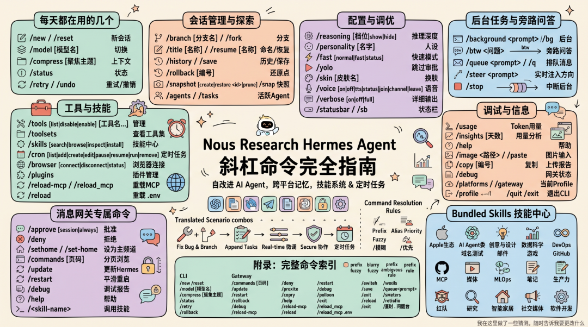

> 📎 来源: [鸟窝聊技术](https://mp.weixin.qq.com/s?__biz=MzU2ODc4NzUxMg==&mid=2247490356&idx=1&sn=370b1094a35235a20b1b71a34cec4c80&chksm=fd45d448c9ad50024fcf184411956b16779ddaf696bfb4c146e744c40159201dc17a9afabbd6&mpshare=1&scene=1&srcid=0428ZWcWQUEHb32fJAZyonrn&sharer_shareinfo=9174e34d36721fb2dcd3b3f6063e5137&sharer_shareinfo_first=9174e34d36721fb2dcd3b3f6063e5137) | 时间: 2026-04-28 19:44

---



#

Hermes Agent 提供了大量的斜杠命令和内置的Skill——不仅打通了 Telegram、Discord、飞书等多个消息平台，还在会话管理、技能系统和记忆机制上引入了不少新玩法。今天我把 Hermes 的斜杠命令体系完整梳理一遍，按使用频率分类，方便大家各取所需。

> **Hermes Agent** 是由 Nous Research[^1] 打造的自改进 AI Agent，内置学习循环、跨会话记忆、技能系统、任务调度和多平台消息网关。支持 OpenRouter（200+模型）、Anthropic、OpenAI、GLM、MiniMax 等任意 LLM Provider，一条命令安装，Linux/macOS/WSL2/Termux 均可运行。

• • •

## 一、每天都在用的几个

### ``` /new ```  和  ``` /reset ```

```
/new
```

 开一个新会话，

```
/reset
```

 是别名。如果想换模型，直接 

```
/new gpt-4o
```

 或者 

```
/new claude-opus
```

 都可以，支持模糊匹配。

执行后：清空会话历史、重置会话 ID、清除会话级别的模型覆盖和安全状态，全新开始。

### ``` /model ```  —— 切换模型

```
/model [模型名][--global]
```

```
/model
```

 切换当前会话的模型，支持多种方式：

- ❋直接切换：

  ```
  /model claude-opus-4-6
  ```
- ❋跨 provider 切换：

  ```
  /model zai:glm-5
  ```

  （切换到 zai provider 的 glm-5）
- ❋自定义端点：

  ```
  /model custom:model
  ```

   或 

  ```
  /model custom:name:model
  ```

  （命名自定义 provider）
- ❋自动检测：

  ```
  /model custom
  ```

  （自动从端点识别模型）

加上 

```
--global
```

 参数，把模型设置永久写入 

```
config.yaml
```

。

> **注意**：

> ```
> /model
> ```

>  只能切换到已配置好的 provider。要新增 provider 或配置 API key，需要在终端里退出会话，执行 

> ```
> hermes model
> ```

>  命令。

### ``` /compress ```  —— 长对话的救星

```
/compress [聚焦主题]
```

对话太长、上下文快撑不住的时候用。它会把当前会话的上下文压缩一遍，同时可以指定重点保留什么。

比如：

```
/compress 重点保留代码部分，其余简化
```

**什么信号说明该 compress 了？**

- ❋模型开始"失忆"，重复前面说过的东西
- ❋

  ```
  /status
  ```

   里看到上下文占用很高
- ❋输出质量明显下降

### ``` /status ```  —— 一眼看清当前状态

```
/status
```

查看当前会话的执行状态、模型信息、provider 用量和配额。比翻配置页快多了。

### ``` /retry ```  和  ``` /undo ```

```
/retry/undo
```

```
/retry
```

 重新发送上一条消息给 agent，相当于"再来一次"；

```
/undo
```

 删除最近一轮对话（用户消息 + AI 回复），回退一步。

• • •

## 二、会话管理与探索

### ``` /branch ```  —— 岔路探索，不伤主线

```
/branch [分支名]
```

别名 

```
/fork
```

。从当前对话分支出去，探索另一个方向，但不影响主线对话。

想象成 git 的分支——主线上继续推进，分支里随便试错。分支命名用 

```
[分支名]
```

，不填就自动生成。

### ``` /title ```  —— 给会话起个名字

```
/title [名称]
```

给当前会话起个标题，方便后续 

```
/resume
```

 恢复时辨认。标签、版本号、功能名都行。

### ``` /resume ```  —— 恢复历史会话

```
/resume [名称]
```

恢复一个之前命名过的会话。配合 

```
/title
```

 使用体验最佳——每个项目会话都起好名字，下次直接 

```
/resume 项目名
```

 切回来。

### ``` /save ```  —— 导出会话

```
/save
```

把当前对话保存到本地文件（CLI 专用）。方便存档、分享或事后分析。

### ``` /history ```  —— 翻会话历史

```
/history
```

查看当前会话的所有消息记录。CLI 界面里滚动浏览，消息网关里以列表形式呈现。

### ``` /rollback ```  —— 文件系统还原点

```
/rollback [编号]
```

查看或恢复文件系统检查点。AI 写代码时如果改乱了，用这个还原。

### ``` /snapshot ```  —— 配置状态快照

```
/snapshot [create|restore <id>|prune]
```

别名 

```
/snap
```

。创建或恢复 Hermes 配置/状态的快照：

- ❋

  ```
  snapshot create [标签]
  ```

   — 保存当前快照
- ❋

  ```
  snapshot restore <id
  ```

   — 恢复到指定快照
- ❋

  ```
  snapshot prune [N]
  ```

   — 删除旧快照（保留最近 N 个）
- ❋不带参数 — 列出所有快照

### ``` /agents ```  —— 查看活跃 agent

```
/agents
```

别名 

```
/tasks
```

。显示当前会话中所有活跃的 agent 和正在运行的后台任务。

• • •

## 三、配置与调优

### ``` /reasoning ```  —— 控制推理深度

```
/reasoning [none|minimal|low|medium|high|xhigh|show|hide] [--global]
```

控制模型的**推理思考深度**，不同模型支持的档位不同。

**使用场景：**

- ❋调 Bug，上 

  ```
  /reasoning high
  ```

  ，让它多想
- ❋闲聊翻译，

  ```
  /reasoning low
  ```

   或 

  ```
  /reasoning off
  ```

  ，省钱省时间
- ❋想看模型的思考过程？

  ```
  /reasoning show
  ```
- ❋加 

  ```
  --global
  ```

   持久化到 

  ```
  config.yaml
  ```

### ``` /personality ```  —— 切换人设

```
/personality [名字]
```

在预设人格之间切换。适合不同场景用不同"模式"——工作用严谨人设，头脑风暴用创意人设，一句话切换。

### ``` /fast ```  —— 切换快速模式

```
/fast [normal|fast|status]
```

切换快速模式（Anthropic Fast Mode / OpenAI Priority Processing）。

```
/fast on
```

 开启，

```
/fast off
```

 关闭，

```
/fast status
```

 查看当前状态。

### ``` /yolo ```  —— 跳过所有审批

```
/yolo
```

开启 YOLO 模式，**跳过所有危险命令的确认弹窗**。适合自己用、不想每次都点确认的场景。安全环境里很香，公共环境慎用。

### ``` /skin ```  —— 换主题皮肤

```
/skin [皮肤名]
```

切换 CLI 的视觉主题。内置多个皮肤，也可以自定义。

```
/skin
```

 不带参数查看所有可选皮肤。

### ``` /voice ```  —— 语音模式

```
/voice [on|off|tts|status]
```

开关语音输入输出，或者切换 TTS 提供商。在 Discord 上还支持 

```
join
```

、

```
channel
```

、

```
leave
```

 来管理语音频道。

### ``` /verbose ```  —— 详细输出

```
/verbose [on|off|full]
```

开启详细工具输出模式，查看每一步工具调用的完整结果。适合调试 agent 行为。**群聊里慎用，会暴露内部推理过程。**

> **注意**：

> ```
> /verbose
> ```

>  默认仅 CLI 可用，但可通过在 

> ```
> config.yaml
> ```

>  中设置 

> ```
> display.tool_progress_command: true
> ```

>  来为消息平台启用。

### ``` /statusbar ```  —— 状态栏开关

```
/statusbar
```

别名 

```
/sb
```

。切换上下文 / 模型状态栏的显示与隐藏。

• • •

## 四、后台任务与旁路问答

### ``` /background ```  —— 后台跑任务

```
/background
```

别名 

```
/bg
```

。把一个任务丢到后台执行，不阻塞当前对话。等它跑完再看结果，适合耗时的分析或生成任务。

### ``` /btw ```  —— 问个题外话

```
/btw <问题
```

提一个旁路问题，**答完不会污染后续对话上下文**。

正在讨论一个复杂方案，突然想问一个完全不相关的小问题，但又不想打断整个对话的节奏？用 

```
/btw
```

。它答完，这句问答不会进入后续的会话记忆，下一轮对话继续原来的主题，干净。

### ``` /queue ```  —— 排队消息

```
/queue
```

别名 

```
/q
```

。把消息加入队列，**不中断当前正在执行的任务**，等当前轮次结束后自动处理。适合在 AI 工作的间隙追加新任务。

> **注意**：

> ```
> /q
> ```

>  同时被 

> ```
> /queue
> ```

>  和 

> ```
> /quit
> ```

>  认领，取决于注册顺序。建议直接用 

> ```
> /queue
> ```

>  避免歧义。

### ``` /steer ```  —— 实时注入方向

```
/steer
```

**增强版**

```
/queue
```

。和 

```
/queue
```

 一样不打断当前任务，但 

```
/steer
```

 在下一个 **tool call 之后** 注入消息，而不是等到当前轮次结束。适合想要实时调整 AI 行为、又不想等待 turn 边界的场景。

### ``` /stop ```  —— 中断后台进程

```
/stop
```

杀掉所有正在运行的后台进程。当 AI 在跑一个错误方向的长任务时，及时止损。

• • •

## 五、工具与技能

### ``` /tools ```  —— 管理工具集

```
/tools [list|disable|enable] [工具名...]
```

查看、启用或禁用特定工具。

```
/tools list
```

 列出所有可用工具，

```
/tools disable 网络请求
```

 关闭某类工具的执行权限。

**使用场景：**

- ❋安全要求高的环境，关闭某些高危工具
- ❋只想用 AI 做分析时，禁用 write/execute 类工具

> **注意**：禁用工具会触发会话重置。

### ``` /toolsets ```  —— 查看工具集

```
/toolsets
```

列出所有可用的工具集（toolsets）。工具集是一组相关工具的打包，比如 

```
browser
```

、

```
web
```

、

```
file
```

 等，可以按组批量管理。

### ``` /skills ```  —— 技能中心

```
/skills [search|browse|inspect|install]
```

搜索、安装或管理技能。Hermes 的技能系统是一个可插拔的模块化体系，涵盖代码开发、数据分析、图片生成、MLOps 等多个领域。

- ❋

  ```
  /skills search github
  ```

   — 搜索 GitHub 相关技能
- ❋

  ```
  /skills browse
  ```

   — 浏览技能中心
- ❋

  ```
  /skills install workflow-drawing
  ```

   — 安装指定技能

### ``` /cron ```  —— 定时任务

```
/cron [list|add|create|edit|pause|resume|run|remove]
```

管理定时任务——每天早报、每周数据汇总、每月备份通知，全部用自然语言配置，自动推送到任意消息平台。

### ``` /browser ```  —— 连接浏览器

```
/browser [connect|disconnect|status]
```

将浏览器工具连接到本地 Chrome（通过 CDP），用于 AI 驱动的网页自动化操作。

```
connect
```

 默认连接 

```
ws://localhost:9222
```

，无 debugger 时自动启动 Chrome。

### ``` /plugins ```  —— 插件管理

```
/plugins
```

列出已安装的插件及其状态。Hermes 支持插件扩展，可以接入 Spotify 播放控制、飞书、微信等平台。

### ``` /reload-mcp ```  —— 重载 MCP 服务器

```
/reload-mcp
```

别名 

```
/reload_mcp
```

。重载配置文件中定义的所有 MCP（Model Context Protocol）服务器。修改 MCP 配置后无需重启 gateway，直接跑这个命令。

### ``` /reload ```  —— 重载 .env 变量

```
/reload
```

将 

```
.env
```

 文件中的变量重新载入当前 session，无需重启即可读取新的 API key。

• • •

## 六、调试与信息

### ``` /usage ```  —— Token 用量与费用

```
/usage
```

查看当前会话的 token 用量、费用明细和会话时长。比翻账单快多了。

### ``` /insights ```  —— 用量分析

```
/insights [天数]
```

查看 token 用量的趋势分析，按天汇总。

```
/insights 30
```

 看最近一个月的统计（默认显示 30 天）。

### ``` /help ```  —— 命令帮助

```
/help
```

列出所有可用命令。配合具体命令名使用，查看用法说明。

### ``` /image ```  和  ``` /paste ```  —— 图片输入

```
/image <路径>/paste
```

```
/image
```

 附加本地图片文件，

```
/paste
```

 从剪贴板检测并附加图片。CLI 专用，用于视觉任务（图片分析、OCR 等）。

### ``` /copy ```  —— 复制上条回复

```
/copy [编号]
```

将上一条助手回复复制到剪贴板（CLI 专用）。加数字参数可复制倒数第 N 条。

### ``` /debug ```  —— 上传调试报告

```
/debug
```

上传系统信息 + 日志，生成可分享的链接，方便在社区求助时提供上下文。CLI 和消息网关都可用。

### ``` /update ```  —— 更新 Hermes

```
/update
```

Gateway 专用命令，检查并更新 Hermes Agent 到最新版本。升级后 gateway 自动重载，无需手动重启。

### ``` /platforms ```  —— 网关状态

```
/platforms
```

别名 

```
/gateway
```

。查看所有已配置消息平台的连接状态。CLI 专用。

### ``` /profile ```  —— 当前 Profile

```
/profile
```

显示当前激活的 profile 名称和 home 目录路径。

• • •

## 七、消息网关专属命令

以下命令**仅在消息网关平台**（Telegram、Discord、飞书等）可用：

| 命令 | 功能 |
| --- | --- |
| ``` /approve [session|always] ``` | 手动批准危险命令，  ``` session ```   仅本次审批，  ``` always ```   加入永久白名单 |
| ``` /deny ``` | 拒绝危险命令 |
| ``` /sethome ```   （别名   ``` /set-home ```  ） | 把当前对话设为主频道 |
| ``` /restart ``` | 平滑重启 gateway，等待所有活跃任务结束后进行 |
| ``` /commands [页码] ``` | 分页浏览所有命令和技能 |
| ``` /update ``` | 检查并更新 Hermes |

• • •

## 八、几个实战场景组合

### 场景 1：修复 Bug 并开分支探索

```
正在用 Claude Sonnet 修 Bug，感觉方向不对……/branch 方案B（切换到另一个解法思路）（探索完，觉得方案A 其实是对的）/new（回到主线，用 Opus 重新分析）
```

### 场景 2：长任务中途追加新任务

```
（AI 正在跑一份数据报告）/queue 顺便帮我查一下最新的 GLM 模型更新（消息入队，等当前轮次完成后自动处理）/background 生成一个代码流程图（后台执行，完全不阻塞）（报告跑完了，继续追问）
```

### 场景 3：实时微调 AI 行为

```
（AI 正在写代码，稍等片刻）/steer 改成更函数式的写法（AI 在下一个 tool call 完成后立即响应方向调整）（继续原来的任务，方向已纠正）
```

### 场景 4：安全协作审批

```
/yolo off（关闭自动审批）（AI 发出了一个高危操作请求）/approve session（批准本次操作，审批状态仅限当前会话）
```

### 场景 5：定时任务推送

```
/cron list（查看所有定时任务）/cron add（创建每日早报任务）每天早上 8 点自动推送新闻摘要到飞书，下班前推送代码统计到 Telegram，一条命令搞定。
```

• • •

## 九、附录：完整命令索引

### CLI 命令（交互式终端）

| 命令 | 类别 | 说明 |
| --- | --- | --- |
| ``` /new ``` | 会话 | 开新会话（别名   ``` /reset ```  ） |
| ``` /clear ``` | 会话 | 清屏并开新会话 |
| ``` /model ``` | 配置 | 切换模型，可   ``` --global ```   持久化 |
| ``` /compress ``` | 会话 | 压缩上下文，可指定聚焦主题 |
| ``` /status ``` | 会话 | 当前状态 |
| ``` /retry ``` | 会话 | 重试上一条 |
| ``` /undo ``` | 会话 | 撤销一轮 |
| ``` /branch ``` | 会话 | 分支探索（别名   ``` /fork ```  ） |
| ``` /title ``` | 会话 | 命名会话 |
| ``` /resume ``` | 会话 | 恢复历史会话 |
| ``` /save ``` | 会话 | 导出会话 |
| ``` /history ``` | 会话 | 查看历史 |
| ``` /rollback ``` | 会话 | 文件系统还原 |
| ``` /snapshot ``` | 会话 | 配置状态快照（别名   ``` /snap ```  ） |
| ``` /agents ``` | 会话 | 查看活跃 agent（别名   ``` /tasks ```  ） |
| ``` /background ``` | 后台 | 后台执行（别名   ``` /bg ```  ） |
| ``` /btw ``` | 后台 | 旁路问答 |
| ``` /queue ``` | 后台 | 排队消息（别名   ``` /q ```  ） |
| ``` /steer ``` | 后台 | tool call 后注入消息 |
| ``` /stop ``` | 后台 | 中断进程 |
| ``` /reasoning ``` | 配置 | 推理深度，  ``` --global ```   持久化 |
| ``` /personality ``` | 配置 | 切换人设 |
| ``` /fast ``` | 配置 | 快速模式 |
| ``` /yolo ``` | 配置 | 跳过审批 |
| ``` /skin ``` | 配置 | 换皮肤 |
| ``` /voice ``` | 配置 | 语音模式 |
| ``` /verbose ``` | 配置 | 详细输出 |
| ``` /statusbar ``` | 配置 | 状态栏开关（别名   ``` /sb ```  ） |
| ``` /tools ``` | 工具 | 管理工具 |
| ``` /toolsets ``` | 工具 | 查看工具集 |
| ``` /skills ``` | 技能 | 技能中心 |
| ``` /cron ``` | 技能 | 定时任务 |
| ``` /browser ``` | 技能 | 连接浏览器 |
| ``` /plugins ``` | 技能 | 插件管理 |
| ``` /reload-mcp ``` | 技能 | 重载 MCP（别名   ``` /reload_mcp ```  ） |
| ``` /reload ``` | 技能 | 重载 .env |
| ``` /usage ``` | 信息 | Token 用量 |
| ``` /insights ``` | 信息 | 用量分析 |
| ``` /debug ``` | 信息 | 调试报告 |
| ``` /help ``` | 信息 | 帮助 |
| ``` /image ``` | 信息 | 附加图片 |
| ``` /paste ``` | 信息 | 剪贴板图片 |
| ``` /copy ``` | 信息 | 复制回复 |
| ``` /platforms ``` | 信息 | 平台状态（别名   ``` /gateway ```  ） |
| ``` /profile ``` | 信息 | 当前 Profile |
| ``` /gquota ``` | 信息 | Gemini 代码辅助配额 |
| ``` /terminal-setup ``` | 信息 | 配置终端键位 |
| ``` /quit ``` | 退出 | 退出 CLI（别名   ``` /exit ```  ） |

### 消息网关命令（Telegram/Discord/飞书等）

| 命令 | 说明 |
| --- | --- |
| ``` /new ``` | 开新会话 |
| ``` /reset ``` | 重置会话 |
| ``` /status ``` | 当前状态 |
| ``` /stop ``` | 中断任务 |
| ``` /model [provider:model] ``` | 切换模型 |
| ``` /personality [name] ``` | 切换人设 |
| ``` /fast [normal|fast|status] ``` | 快速模式 |
| ``` /retry ``` | 重试 |
| ``` /undo ``` | 撤销 |
| ``` /sethome ```   （别名   ``` /set-home ```  ） | 设为主频道 |
| ``` /compress [focus topic] ``` | 压缩上下文 |
| ``` /title [name] ``` | 会话命名 |
| ``` /resume [name] ``` | 恢复会话 |
| ``` /usage ``` | Token 用量 |
| ``` /insights [days] ``` | 用量分析 |
| ``` /reasoning [level|show|hide] ``` | 推理深度 |
| ``` /voice [on|off|tts|join|channel|leave|status] ``` | 语音控制（含 Discord 语音频道管理） |
| ``` /rollback [number] ``` | 文件系统还原 |
| ``` /background <prompt> ``` | 后台任务 |
| ``` /reload-mcp ```   （别名   ``` /reload_mcp ```  ） | 重载 MCP |
| ``` /yolo ``` | YOLO 模式 |
| ``` /commands [page] ``` | 分页浏览命令 |
| ``` /approve [session|always] ``` | 批准危险命令 |
| ``` /deny ``` | 拒绝危险命令 |
| ``` /update ``` | 更新 Hermes |
| ``` /restart ``` | 平滑重启 gateway |
| ``` /debug ``` | 调试报告 |
| ``` /help ``` | 帮助 |
| ``` /<skill-name> ``` | 调用任意已安装的技能 |

### 快速命令（自定义别名）

在 

```
~/.hermes/config.yaml
```

 中配置 

```
quick_commands
```

，将短别名映射到复杂指令：

```
quick_commands:review:"Review my latest git diff and suggest improvements"deploy:"Run the deployment script at scripts/deploy.sh and verify the output"morning:"Check my calendar, unread emails, and summarize today's priorities"
```

输入 

```
/review
```

、

```
/deploy
```

、

```
/morning
```

 直接触发。快速命令在分发时解析，不出现在内置自动补全列表中。

• • •

## 十、Bundled Skills 技能中心

Hermes 内置了大量技能（Skill），安装在 

```
~/.hermes/skills/
```

 目录下。技能的使用方式与斜杠命令完全一致——直接输入 

```
/技能名
```

 即可调用，比命令更强大的是可以带有参数和上下文，完成复杂的多步骤任务。

### 使用方法

```
/<技能名>                          # 直接调用/<技能名> <参数>                   # 带参数调用/skills search <关键词>            # 搜索技能/skills install <技能名>           # 安装技能
```

### Apple 生态

| 技能 | 说明 |
| --- | --- |
| ``` /apple-notes ``` | 管理 Apple Notes（创建、查看、搜索、编辑），通过 macOS 的 memo CLI |
| ``` /apple-reminders ``` | 管理 Apple Reminders（列表、追加、完成、删除），通过 remindctl CLI |
| ``` /findmy ``` | 追踪 Apple 设备和 AirTag，通过 FindMy.app（macOS AppleScript + 屏幕截图） |
| ``` /imessage ``` | 发送和接收 iMessages/SMS，通过 macOS 的 imsg CLI |

### AI Agent 委托

| 技能 | 说明 |
| --- | --- |
| ``` /claude-code ``` | 将编码任务委托给 Claude Code（Anthropic 的 CLI agent）。适合构建功能、重构、PR review、迭代开发。需安装 claude CLI |
| ``` /codex ``` | 将编码任务委托给 OpenAI Codex CLI。需要 codex CLI 和 git 仓库 |
| ``` /opencode ``` | 将编码任务委托给 OpenCode CLI agent，适合功能实现、重构、PR review 和长时自主会话 |
| ``` /hermes-agent ``` | Hermes Agent 完整指南——CLI 用法、设置、配置、派生 agent、gateway 平台、技能、语音、工具、profile 和贡献者参考 |

### 创意与设计

| 技能 | 说明 |
| --- | --- |
| ``` /architecture-diagram ``` | 生成深色主题的 SVG 软件架构图和云基础设施图（独立 HTML 文件） |
| ``` /ascii-art ``` | 用 pyfiglet（571 种字体）、cowsay、boxes、toilet、image-to-ascii 生成 ASCII 艺术 |
| ``` /ascii-video ``` | ASCII 艺术视频生产线——支持任意格式转彩色 ASCII 字符视频（MP4、GIF、图片序列） |
| ``` /baoyu-comic ``` | 知识漫画创作，支持多种艺术风格和基调，创建原创教育漫画 |
| ``` /baoyu-infographic ``` | 生成专业信息图，21 种布局类型 × 21 种视觉风格，自动推荐组合 |
| ``` /design-md ``` | 创作、验证、对比和导出 DESIGN.md 文件（Google 开源设计系统格式） |
| ``` /excalidraw ``` | 用 Excalidraw JSON 格式创建手绘风格图表，生成 .excalidraw 文件 |
| ``` /ideation ``` | 通过创意约束生成项目 idea，适合"我想做点什么"、"给我一个项目灵感" |
| ``` /manim-video ``` | 用 Manim Community Edition 制作数学/技术动画，3Blue1Brown 风格讲解视频 |
| ``` /p5js ``` | 用 p5.js 创作交互式和生成式视觉艺术，导出为独立 HTML 文件 |
| ``` /pixel-art ``` | 将图片转换为复古像素艺术，支持 NES、Game Boy、PICO-8、C64 等硬件精确调色板 |
| ``` /popular-web-designs ``` | 54 种从真实网站提取的生产级设计系统（Stripe、Linear、Vercel、Notion、Airbnb 等） |
| ``` /songwriting-and-ai-music ``` | 歌曲创作技巧、AI 音乐生成提示（Suno 为主）、仿写/改编技术 |

### 数据科学

| 技能 | 说明 |
| --- | --- |
| ``` /jupyter-live-kernel ``` | 连接 live Jupyter kernel 进行状态化迭代 Python 执行，适合数据探索、ML 实验、API 探索 |

### DevOps

| 技能 | 说明 |
| --- | --- |
| ``` /webhook-subscriptions ``` | 创建和管理 webhook 订阅，实现事件驱动的 agent 激活或推送通知（零 LLM 成本） |

### 域名测试

| 技能 | 说明 |
| --- | --- |
| ``` /dogfood ``` | 系统化探索性 QA 测试——找 bug、捕获证据、生成结构化报告 |

### 邮件

| 技能 | 说明 |
| --- | --- |
| ``` /himalaya ``` | 通过 IMAP/SMTP 管理邮件（列表、阅读、写作、回复、转发、搜索），支持多账户和 MML 撰写 |

### 游戏

| 技能 | 说明 |
| --- | --- |
| ``` /minecraft-modpack-server ``` | 从 CurseForge/Modrinth 服务器包 zip 搭建 modded Minecraft 服务器 |
| ``` /pokemon-player ``` | 通过无头模拟器自主玩宝可梦游戏——读取内存中的结构化游戏状态、战略决策、发送按键输入 |

### GitHub

| 技能 | 说明 |
| --- | --- |
| ``` /codebase-inspection ``` | 用 pygount 检查代码库——LOC 计数、语言分布、代码/注释比例 |
| ``` /github-auth ``` | 为 agent 设置 GitHub 认证（HTTPS token、SSH key、credential helper、gh auth） |
| ``` /github-code-review ``` | 审查代码变更，分析 git diff，在 PR 上留下内联评论 |
| ``` /github-issues ``` | 创建、管理、分类和关闭 GitHub issues，搜索、添加标签、指派人员 |
| ``` /github-pr-workflow ``` | 完整 PR 生命周期——创建分支、提交变更、打开 PR、监控 CI、自动化修复失败、合并 |
| ``` /github-repo-management ``` | 克隆、创建、fork、配置和管理 GitHub 仓库，管理 remotes、secrets、releases |

### MCP（Model Context Protocol）

| 技能 | 说明 |
| --- | --- |
| ``` /native-mcp ``` | 内置 MCP 客户端，连接外部 MCP 服务器、发现工具并注册为 Hermes 原生工具，支持 stdio 和 HTTP 传输 |

### 媒体

| 技能 | 说明 |
| --- | --- |
| ``` /gif-search ``` | 用 Tenor API 搜索和下载 GIF（仅需 curl + jq） |
| ``` /heartmula ``` | 设置和运行 HeartMuLa 开源音乐生成模型（Suno 风格），从歌词 + 标签生成完整歌曲 |
| ``` /songsee ``` | 从音频文件生成频谱图和音频特征可视化（mel、chroma、MFCC、tempogram 等） |
| ``` /spotify ``` | 控制 Spotify——播放音乐、搜索目录、管理播放列表和库、查看设备状态 |
| ``` /youtube-content ``` | 获取 YouTube 视频字幕并转换为结构化内容（章节、摘要、线程、博客文章） |

### MLOps

| 技能 | 说明 |
| --- | --- |
| ``` /audiocraft-audio-generation ``` | PyTorch 音频生成库——MusicGen 文本转音乐、AudioGen 文本转音效 |
| ``` /axolotl ``` | 用 Axolotl 微调 LLM 的专家指导——YAML 配置、100+ 模型、LoRA/QLoRA、DPO/KTO/ORPO/GRPO |
| ``` /dspy ``` | 用 DSPy 构建复杂 AI 系统——声明式编程、自动优化提示、模块化 RAG 和 agent |
| ``` /huggingface-hub ``` | Hugging Face Hub CLI（hf）——搜索、下载、上传模型和数据集，管理 repos |
| ``` /llama-cpp ``` | llama.cpp 本地 GGUF 推理 + HF Hub 模型发现 |
| ``` /lm-evaluation-harness ``` | 用 60+ 学术基准评估 LLM（MMLU、HumanEval、GSM8K、TruthfulQA 等） |
| ``` /obliteratus ``` | 用 OBLITERATUS 移除开源 LLM 的拒绝行为——机械解释性技术（diff-in-means、SVD、LEACE 等） |
| ``` /outlines ``` | 保证生成内容为有效 JSON/XML/代码结构，Pydantic 模型类型安全输出 |
| ``` /segment-anything-model ``` | 图像分割基础模型，零样本迁移，用点/框/遮罩提示分割任意物体 |
| ``` /fine-tuning-with-trl ``` | 用 TRL 微调 LLM——SFT 指令调优、DPO 偏好对齐、PPO/GRPO 奖励优化 |
| ``` /unsloth ``` | Unsloth 快速微调专家指导——2-5x 更快训练、50-80% 更少内存、LoRA/QLoRA 优化 |
| ``` /serving-llms-vllm ``` | 用 vLLM 高吞吐服务 LLM，PagedAttention 和连续批处理，OpenAI 兼容 API |
| ``` /weights-and-biases ``` | 跟踪 ML 实验，自动日志记录，实时可视化训练，超参数搜索，模型注册表管理 |

### 笔记

| 技能 | 说明 |
| --- | --- |
| ``` /obsidian ``` | 读取、搜索和创建 Obsidian vault 中的笔记 |

### 生产力

| 技能 | 说明 |
| --- | --- |
| ``` /google-workspace ``` | Gmail、Calendar、Drive、Contacts、Sheets、Docs 集成（Hermes 管理的 OAuth2） |
| ``` /linear ``` | 通过 GraphQL API 管理 Linear issues、projects 和团队（API key 认证，无需 OAuth） |
| ``` /maps ``` | 位置智能——地理编码、反向地理编码、附近地点（46 个 POI 类别）、路线规划、时区查询 |
| ``` /nano-pdf ``` | 用自然语言指令编辑 PDF（修改文本、修复错别字、更新标题） |
| ``` /notion ``` | Notion API 创建和管理 pages、databases、blocks，搜索、创建、更新、查询 workspace |
| ``` /ocr-and-documents ``` | 从 PDF 和扫描文档提取文本（web\_extract、pymupdf、marker-pdf） |
| ``` /powerpoint ``` | 任何涉及 .pptx 文件的任务——创建幻灯片、读取/解析/提取内容 |

### 红队

| 技能 | 说明 |
| --- | --- |
| ``` /godmode ``` | 用 G0DM0D3 技术越狱 API 服务的 LLM——33 种 Parseltongue 输入混淆技术、GODMODE CLASSIC 模板 |

### 研究

| 技能 | 说明 |
| --- | --- |
| ``` /arxiv ``` | 搜索和获取 arXiv 学术论文（免费 REST API，无需 API key） |
| ``` /blogwatcher ``` | 监控博客和 RSS/Atom feeds 更新，添加博客、扫描新文章、跟踪阅读状态 |
| ``` /llm-wiki ``` | Karpathy 的 LLM Wiki——构建和维护持久化互联的 markdown 知识库 |
| ``` /polymarket ``` | 查询 Polymarket 预测市场数据——搜索市场、价格、订单簿、价格历史（公开 API，无需 key） |
| ``` /research-paper-writing ``` | ML/AI 研究论文端到端流水线——从实验设计到分析、草稿、修订、投稿（NeurIPS、ICML、ICLR 等） |

### 智能家居

| 技能 | 说明 |
| --- | --- |
| ``` /openhue ``` | 通过 OpenHue CLI 控制飞利浦 Hue 灯光、房间和场景——开关、调亮度、颜色、色温、场景激活 |

### 社交媒体

| 技能 | 说明 |
| --- | --- |
| ``` /xurl ``` | 通过 xurl（官方 X API CLI）与 X/Twitter 互动——发帖、回复、引用、搜索、时间线、点赞、转推、关注、DM |

### 软件开发

| 技能 | 说明 |
| --- | --- |
| ``` /plan ``` | 进入 plan mode——检查上下文，在活跃工作区的   ``` .hermes/plans/ ```   目录写 markdown 计划，但不执行 |
| ``` /requesting-code-review ``` | pre-commit 验证流水线——静态安全扫描、质量门、独立审查 subagent、自动修复循环 |
| ``` /subagent-driven-development ``` | 执行多步骤实现计划，dispatch 独立 delegate\_task 进行两阶段审查（规格合规 → 代码质量） |
| ``` /systematic-debugging ``` | 遇到任何 bug、测试失败或异常行为时使用——4 阶段根因调查（不先理解问题不修复） |
| ``` /test-driven-development ``` | 实现任何功能或 bugfix 之前使用——强制 RED-GREEN-REFACTOR 循环，测试优先 |
| ``` /writing-plans ``` | 有规格或需求的多步骤任务——创建包含小任务、精确文件路径和完整代码示例的详细实施计划 |

• • •

## 十一、命令解析规则

Hermes 的斜杠命令支持**前缀匹配**和**别名优先**机制：

- ❋输入 

  ```
  /h
  ```

   自动解析为 

  ```
  /help
  ```

  ，

  ```
  /mod
  ```

   解析为 

  ```
  /model
  ```
- ❋前缀模糊时（匹配多个命令），按注册顺序优先
- ❋全称和已注册别名永远优先于前缀匹配

• • •

- ❋[^1]: Nous Research https://nousresearch.com https://nousresearch.com
