> 📎 来源: [逍遥环游记](https://mp.weixin.qq.com/s?__biz=MzA5MDI0MTk0OQ==&mid=2247484029&idx=1&sn=466d9fef2bf83eab7c72802d1d5a2546&chksm=91f7b5ce0d820b84bee9435695dcf8f0ad5eaf1a03968abc739ae5ced63c335d0339e4dcd6c6&mpshare=1&scene=1&srcid=04212xA97t3UbRIWOeWLPivV&sharer_shareinfo=93626a442d6755a7159634ac4d97f1ec&sharer_shareinfo_first=93626a442d6755a7159634ac4d97f1ec) | 时间: 2026-04-21 11:55

---

# 本文你会看到什么

1. 系统全景
2. 核心 Agent 引擎
3. 工具系统与注册中心
4. 网关与多平台适配
5. 数据流转
6. 配置与状态管理
7. 安全模型
8. 可扩展性体系
9. 设计哲学

---

## 1. 系统全景

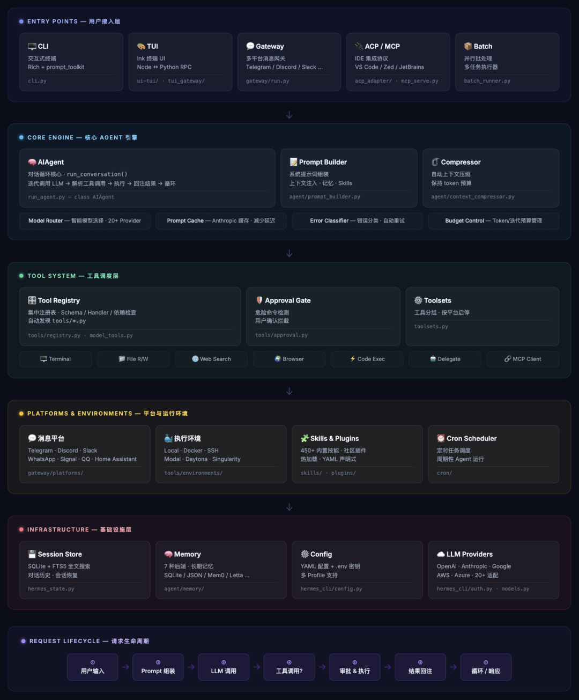

---

## 2. 核心 Agent 引擎

### 2.1 AIAgent 类设计

`AIAgent`（`run_agent.py`）是整个系统的心脏。它采用**大类单文件**的设计——所有核心逻辑汇聚于一个文件中，文件体量庞大，但保证了核心循环的**内聚性**和**可追踪性**。

#### 构造器参数体系

```
classAIAgent:def__init__(self,# 模型配置        model: str = "anthropic/claude-opus-4.6",        max_iterations: int = 90,# 工具控制        enabled_toolsets: list = None,        disabled_toolsets: list = None,# 行为控制        quiet_mode: bool = False,        save_trajectories: bool = False,# 上下文标识        platform: str = None,           # "cli", "telegram", "discord" ...        session_id: str = None,# 上下文加载控制        skip_context_files: bool = False,        skip_memory: bool = False,# 回调机制        clarify_callback = None,        # 澄清回调        approval_callback = None,       # 审批回调        sudo_callback = None,           # 提权回调        progress_callback = None,       # 进度回调# ... 共计 60+ 参数): ...
```

**设计分析**：60+ 构造器参数有点"参数爆炸"，但每个参数都有明确的语义分区：模型配置、工具控制、行为模式、平台上下文、回调注入。这是一种配置注入（Configuration Injection）模式，让每个 Agent 实例完全自包含。

#### 双接口设计

```
def chat(self, message: str) -> str:"""简单接口 — 返回最终响应字符串"""def run_conversation(self, user_message: str, system_message: str = None,                     conversation_history: list = None, task_id: str = None) -> dict:"""完整接口 — 返回含 final_response + messages 的字典"""
```

`chat()` 是面向外部消费者的简洁门面；`run_conversation()` 是面向内部及高级场景的完整接口。这是经典的 **Facade + Full API** 双层设计。

### 2.2 核心循环

```
while api_call_count < self.max_iterations and self.iteration_budget.remaining > 0:# 1. 预飞检查 — 压缩上下文、检查 token 预算if needs_compression(messages, model_context_length):        messages = context_compressor.compress(messages)# 2. API 调用 — 适配多种后端    response = client.chat.completions.create(        model=model, messages=messages, tools=tool_schemas    )# 3. 工具调用分支if response.tool_calls:# 并行执行（当多个工具调用无依赖时）for tool_call in response.tool_calls:            result = handle_function_call(                tool_call.name, tool_call.args, task_id            )            messages.append(tool_result_message(result))        api_call_count += 1# 4. 终止条件 — 无工具调用即为最终回复else:return response.content
```

**关键设计决策**：

| 决策 | 选择 | 理由 |
| --- | --- | --- |
| 同步 vs 异步 | 同步循环 | 保持可预测性，避免并发复杂性 |
| 迭代控制 | 双重限制（max\_iterations + IterationBudget） | 线程安全的预算管理 |
| 上下文压缩 | 触发式（非固定频率） | 仅在接近 token 上限时启动，减少不必要开销 |
| 工具并行 | 支持并行执行 | 通过 ThreadPoolExecutor 实现无依赖工具并行 |

### 2.3 IterationBudget — 线程安全预算管理

```
classIterationBudget:"""Thread-safe iteration budget for sub-agent coordination."""def__init__(self, total: int):        self._remaining = total        self._lock = threading.Lock()    @propertydefremaining(self) -> int:with self._lock:return self._remainingdefconsume(self, n: int = 1) -> bool:with self._lock:if self._remaining >= n:                self._remaining -= nreturnTruereturnFalse
```

这个设计解决了子代理委派场景下的预算共享问题——父代理和子代理可以共享同一个预算实例，通过锁机制保证线程安全。

### 2.4 上下文压缩（ContextCompressor）

`agent/context_compressor.py`实现了一个精密的 **5 阶段压缩管线**：

```
阶段1: 工具输出裁剪 (Prune)  └─ 截断超长工具返回值，保留首尾摘要阶段2: 头部保护 (Protect Head)  └─ 锁定系统提示 + 前 N 轮对话，不参与压缩阶段3: Token 预算尾部定位 (Find Tail)  └─ 从消息尾部向前累积 token，定位"安全尾部"边界阶段4: 结构化摘要 (Summarize)  └─ 对被截断的中间部分进行 LLM 结构化摘要阶段5: 工具对消毒 (Sanitize Tool Pairs)  └─ 确保所有 tool_use / tool_result 消息成对出现
```

**防抖机制（Anti-Thrashing）**：如果检测到连续多次压缩，说明 Agent 可能陷入循环——此时会触发紧急降级，直接截断而非再次调用 LLM 摘要。

### 2.5 Prompt 缓存策略

```
# agent/prompt_caching.py — Anthropic system_and_3 策略def apply_anthropic_cache_control(messages):"""在 system prompt + 最后 3 条非系统消息上放置 cache_control 断点"""    breakpoints = [        system_message,      # 断点 1: 系统提示（最稳定）        messages[-3],        # 断点 2: 倒数第 3 条        messages[-2],        # 断点 3: 倒数第 2 条        messages[-1],        # 断点 4: 最后一条    ]
```

这是一个**经济学优化**——Anthropic 的缓存按前缀匹配，系统提示几乎不变，放在第一个断点可以最大化缓存命中率。最后 3 条消息作为"滑动窗口"，平衡了缓存效率和对话流畅性。

### 2.6 多 API 模式适配

### Hermes Agent 通过统一的 Agent 循环对接 4 种不同的 LLM API 协议。内部维护统一的 OpenAI 消息格式，在 API 调用前动态转换为目标协议格式。

### 四种 API 模式 (Wire Protocols)：

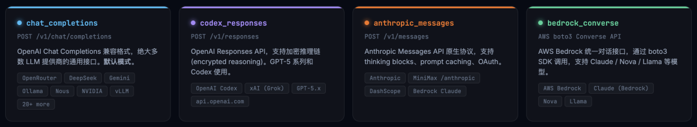

API 模式检测与适配器分发：

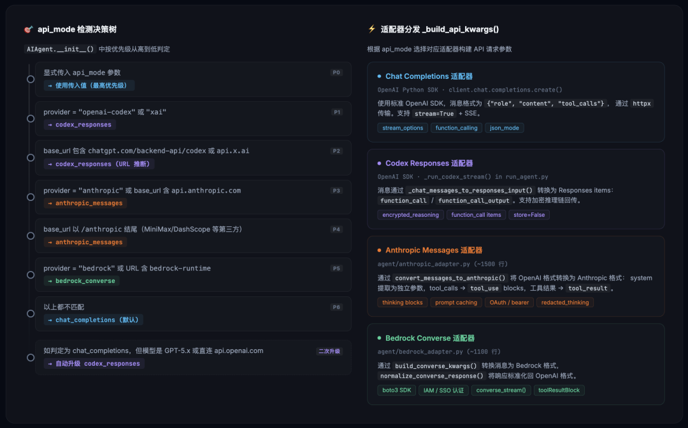

核心设计思想：

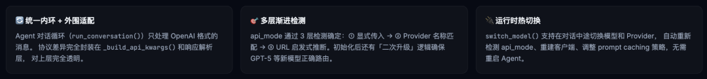

## 3. 工具系统与注册中心

### 3.1 Registry 架构

`tools/registry.py`是工具系统的基石，一个**内存内的、线程安全的、自动发现的**工具注册中心。

```
class ToolEntry:    __slots__ = ('name', 'toolset', 'schema', 'handler', 'check_fn','requires_env', 'platform_filter', 'is_mcp')class ToolRegistry:"""Singleton tool registry with thread-safe registration."""    _instance = Nonedef register(self, name, toolset, schema, handler,                  check_fn=None, requires_env=None, platform_filter=None):"""注册工具 — 每个工具文件在 import 时自动调用"""def get_available_tools(self, platform=None, enabled_toolsets=None):"""获取当前平台可用的工具 schema 列表"""def dispatch(self, name, args, **kwargs):"""统一分发 — 自动处理同步/异步"""
```

**设计亮点**：

- **AST 自动发现**

  ：`discover_builtin_tools()` 通过 AST 分析 `tools/` 目录下的文件，检测含 `registry.register()` 调用的文件并动态 import——无需维护手动导入列表
- **MCP 影子保护**

  ：当 MCP 工具与内置工具同名时，MCP 版本被标记为 `is_mcp=True`，分发时优先内置版本
- **`__slots__` 优化**

  ：`ToolEntry` 使用 `__slots__` 减少内存开销——在注册大量 MCP 工具时效果显著

### 3.2 工具分层

### Hermes Agent 的 6 层工具系统 — 从底层执行环境到顶层 Agent 循环，每一层职责清晰、单向依赖。

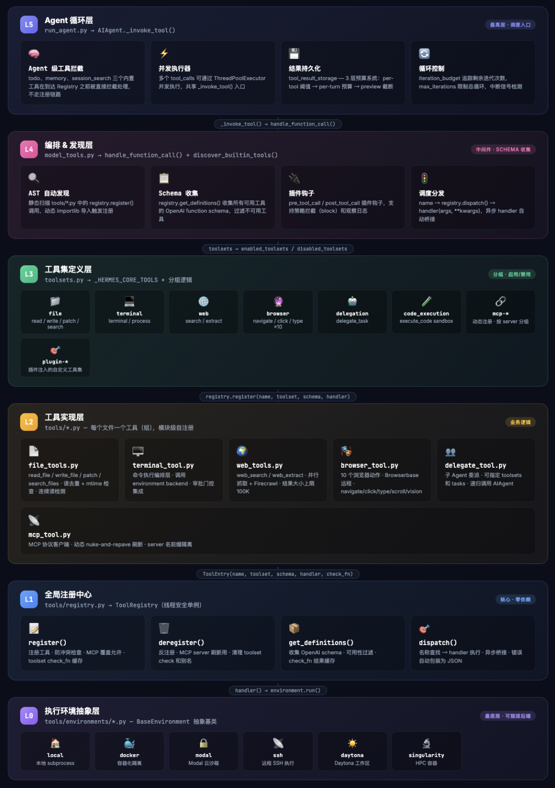

### 3.3 工具集定义（Toolsets）

```
# toolsets.py_HERMES_CORE_TOOLS = ["terminal",      # 终端执行"file",          # 文件操作"web",           # 网络搜索"browser",       # 浏览器"mcp",           # MCP"delegate",      # 子代理"code_execution",# 代码沙盒# ...]
```

工具集是**逻辑分组**——用户可以通过 `enabled_toolsets` / `disabled_toolsets` 精确控制 Agent 可用的工具范围，而不必了解每个工具的具体名称。

3.4 工具调用完整生命周期

从 LLM 返回 tool\_calls 到结果回注的 8 步流程：

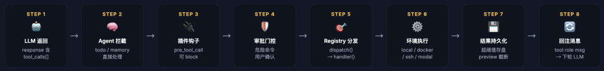

4. 网关与多平台适配

### 4.1 Gateway 架构

### Hermes Agent 的多平台消息网关是 一个异步事件循环，20+ 平台适配器并发运行，统一路由到 AIAgent 核心。

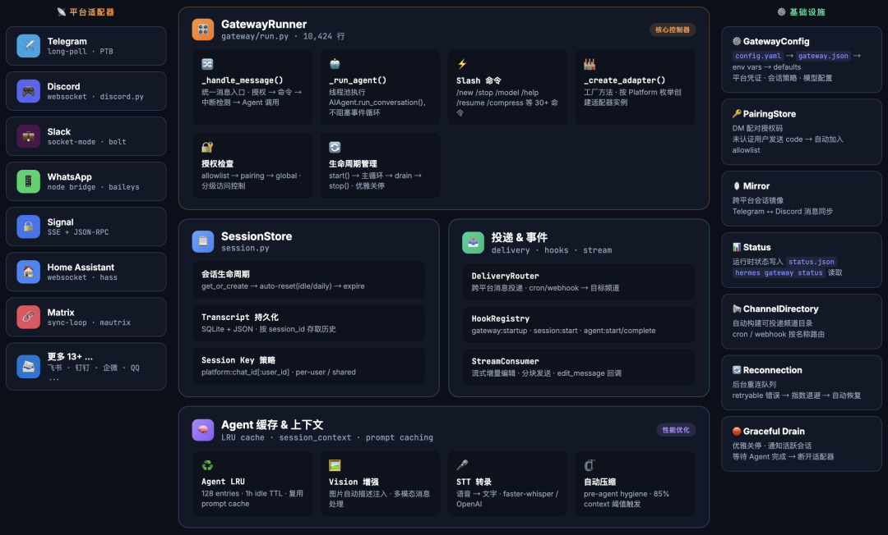

### 消息处理完整管线：

### 从平台收到消息到响应返回的 10 步流程：

### \_handle\_message() → \_handle\_message\_with\_agent() 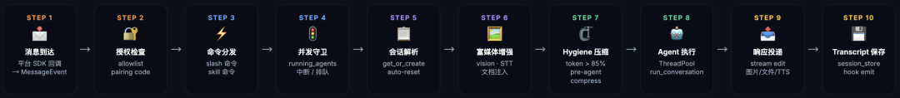

### 4.2 平台适配器模式

```
# gateway/platforms/base.py (2,239 行)classBasePlatformAdapter(ABC):"""所有平台适配器的基类"""# 4 个必须实现的抽象方法    @abstractmethodasync def send_text(self, chat_id, text): ...    @abstractmethodasync def send_typing(self, chat_id): ...    @abstractmethodasync def get_display_name(self, user_id): ...    @abstractmethodasync def start(self): ...# 10+ 可选覆盖方法async def send_media(self, chat_id, media): ...async def extract_media(self, message): ...async def send_long_text(self, chat_id, text): ...  # 智能分片# ...
```

**适配器继承体系**：

```
BasePlatformAdapter├── TelegramAdapter├── DiscordAdapter├── SlackAdapter├── WhatsAppAdapter├── QQBotAdapter├── SignalAdapter├── HomeAssistantAdapter├── YuanbaoAdapter├── MatrixAdapter├── RocketChatAdapter├── ... (20+ 适配器)
```

**设计模式**：这是经典的 **Template Method + Strategy** 混合模式。`BasePlatformAdapter` 提供了完整的消息处理管线（Template），每个子类只需填充平台特定的发送/接收逻辑（Strategy）。

### 4.3 会话管理

```
# gateway/session.py (1,252 行)class SessionStore:"""双写持久化 + 智能重置策略"""# 持久化策略: SQLite (主) + JSONL (向后兼容)def save(self, session_id, messages, metadata):        self._save_to_sqlite(session_id, messages, metadata)        self._save_to_jsonl(session_id, messages)  # 向后兼容# 重置策略    RESET_POLICIES = {"idle": "空闲超时后重置","daily": "每日定时重置",     }
```

### 4.4 Agent 缓存

```
# LRU 缓存策略agent_cache = LRUCache(maxsize=128)  # 最多缓存 128 个 Agent 实例def get_or_create_agent(session_id, model, **kwargs):if session_id in agent_cache:return agent_cache[session_id]    agent = AIAgent(model=model, session_id=session_id, **kwargs)    agent_cache[session_id] = agentreturn agent
```

128 的缓存上限是一个**资源感知**的设计——每个 Agent 实例持有完整的对话历史和配置，过多实例会导致内存压力。

---

## 5. 数据流转

### 5.1 用户输入 → AI 响应（主流程）

### 从键盘击键到屏幕显示的完整生命周期：覆盖 CLI 入口、Agent 循环、LLM API、工具执行、流式渲染、会话持久化。


### 5.2 工具调用流

```
AIAgent 收到 tool_calls  │  ├─ Agent 级拦截检查  │   ├─ todo_tool → 直接处理（不进入 registry）  │   └─ memory_tool → 直接处理（不进入 registry）  │  ├─ model_tools.handle_function_call()  │   │  │   ├─ 参数类型强转（JSON string → dict/list）  │   ├─ task_id 注入  │   │  │   └─ tools/registry.dispatch()  │       │  │       ├─ 内置工具优先（MCP 影子保护）  │       ├─ check_fn() 可用性检查  │       │  │       ├─ 需要审批？  │       │   ├─ 是 → approval.py 多层评估  │       │   │   ├─ 环境豁免？→ 跳过  │       │   │   ├─ YOLO 模式？→ 跳过  │       │   │   ├─ LLM 智能评估 → 安全/危险  │       │   │   └─ 人工审批 → 回调入口层  │       │   └─ 否 → 直接执行  │       │  │       └─ handler(args, task_id=task_id)  │           │  │           └─ 返回 JSON string  │  └─ 结果包装为 tool_result message      └─ 追加到 messages 列表
```

### 5.3 多轮对话状态管理` `

### `6. 配置与状态管理`

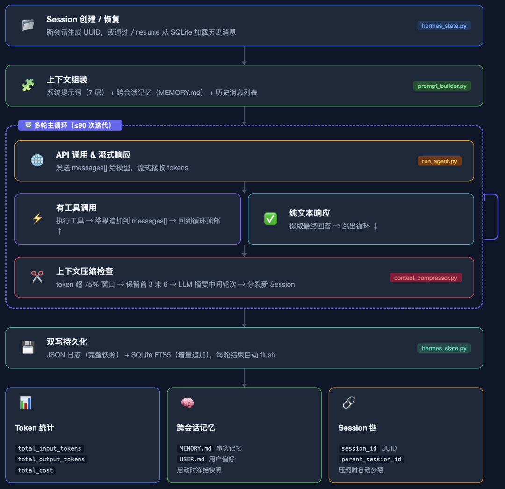

### 6.1 双轨配置系统

```
~/.hermes/├── config.yaml          # 结构化配置 (YAML)│   ├── model: "anthropic/claude-opus-4.6"│   ├── max_iterations: 90│   ├── display:│   │   ├── skin: "default"│   │   ├── tool_progress: true│   │   └── ...│   ├── tools:│   │   ├── enabled: [...]│   │   └── disabled: [...]│   └── _config_version: 5│├── .env                 # 环境变量 (API keys)│   ├── ANTHROPIC_API_KEY=...│   ├── OPENAI_API_KEY=...│   └── ...│├── skins/               # 用户自定义皮肤│   └── my-skin.yaml│├── skills/              # 已安装技能│   └── ...│└── sessions/            # 会话数据    └── hermes_sessions.db  (SQLite)
```

### 6.2 三套配置加载器

| 加载器 | 使用者 | 位置 |
| --- | --- | --- |
| `load_cli_config()` | CLI 交互模式 | `cli.py` |
| `load_config()` | 子命令：  `hermes tools`  `hermes setup` | `hermes_cli/config.py` |
| 直接 YAML 加载 | Gateway | `gateway/run.py` |

三套加载器的存在看似冗余，实际上服务于不同的生命周期需求——CLI 需要合并运行时覆盖，子命令需要纯配置读写，Gateway 需要最小依赖的快速加载。

### 6.3 状态持久化（SessionDB）

```
# hermes_state.py (1,294 行)class SessionDB:"""SQLite + FTS5 全文搜索"""# WAL 模式 — 读写并发# Schema 版本 6 — 自动迁移# Jitter 写重试 — 处理锁竞争# 周期性 WAL 检查点def save_session(self, session_id, messages, metadata): ...def load_session(self, session_id) -> dict: ...def search_sessions(self, query: str) -> list: ...  # FTS5def prune_old_sessions(self, max_age_days: int): ...
```

**FTS5 全文搜索**是一个亮点——用户可以通过 `/search` 命令搜索历史对话内容，这在长期使用中极具价值。

---

## 7. 安全模型

### 7.1 多层审批体系

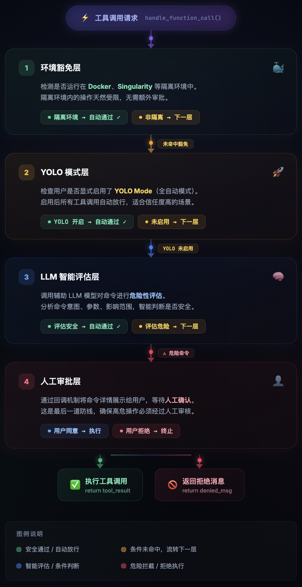

```
YOLO 模式是 hermes-agent 中的一种危险命令审批绕过机制。
```

### 7.2 危险模式检测

```
# tools/approval.py (995 行)DANGEROUS_PATTERNS = [# 文件系统破坏r"rm\s+(-[rf]+\s+)?/",r"chmod\s+777",r"mkfs\.",# 网络风险r"curl.*\|\s*(bash|sh)",r"wget.*\|\s*(bash|sh)",# 权限提升r"sudo\s+",r"su\s+-",# 数据外泄r"scp\s+.*@",r"rsync.*--delete",# ... 30+ 模式]# Unicode 规范化反绕过def normalize_for_detection(command: str) -> str:"""将 Unicode 全角/零宽字符等规范化，防止通过    奇异字符绕过模式检测"""    command = unicodedata.normalize('NFKC', command)# 移除零宽字符    command = re.sub(r'[\u200b\u200c\u200d\ufeff]', '', command)return command
```

### 7.3 凭证保护

```
# 环境变量黑名单 — 工具执行时自动过滤CREDENTIAL_ENV_BLOCKLIST = {"ANTHROPIC_API_KEY","OPENAI_API_KEY","AWS_SECRET_ACCESS_KEY",# ... 完整的 API key 列表}# 文件操作保护SENSITIVE_PATHS = ["~/.ssh/","~/.gnupg/","~/.aws/credentials",# ...]
```

### 7.4 SSRF 防护

```
# gateway/platforms/base.pydef validate_url(url: str) -> bool:"""防止 SSRF 攻击 — 阻止内网地址访问"""    parsed = urlparse(url)    ip = socket.gethostbyname(parsed.hostname)# 阻止内网 IP 范围if ipaddress.ip_address(ip).is_private:raise SecurityError("SSRF: Private IP blocked")if ipaddress.ip_address(ip).is_loopback:raise SecurityError("SSRF: Loopback blocked")
```

### 7.5 安全设计哲学

Hermes 的安全模型遵循纵深防御（Defense in Depth）原则：

1. **最小特权**

   ：PTC 白名单仅暴露 7 个工具
2. **分层检查**

   ：4 层审批逐级递进
3. **反绕过**

   ：Unicode 规范化防止混淆攻击
4. **环境隔离**

   ：Docker/Singularity 环境自动豁免（因为本身就是沙盒）
5. **凭证隔离**

   ：环境变量黑名单阻止密钥泄漏
6. **路径保护**

   ：敏感文件/设备路径检测

---

## 8. 可扩展性体系

### 8.1 扩展点全景` `

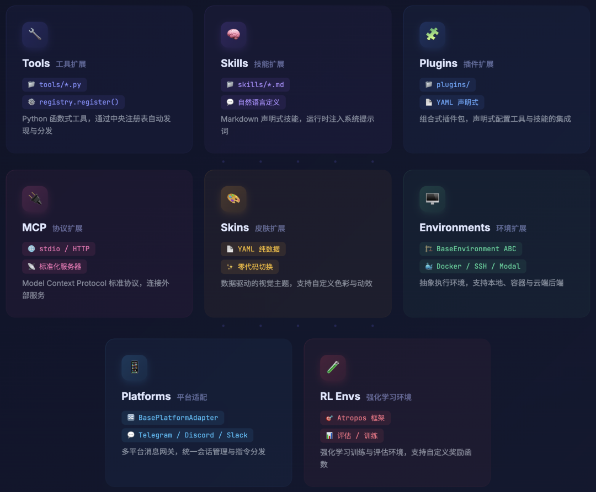

### 8.2 工具扩展（最核心的扩展机制）

添加新工具仅需 **2 个文件**：

```
# 1. 创建 tools/my_tool.pyfrom tools.registry import registrydef my_tool(param: str, task_id: str = None) -> str:return json.dumps({"result": "..."})registry.register(    name="my_tool",    toolset="my_toolset",    schema={...},    handler=lambda args, **kw: my_tool(args["param"], task_id=kw.get("task_id")),    check_fn=lambda: bool(os.getenv("MY_API_KEY")),    requires_env=["MY_API_KEY"],)# 2. 将 toolset 添加到 toolsets.py 的 _HERMES_CORE_TOOLS
```

**零配置自动发现**：AST 扫描 `tools/` 目录，检测到 `registry.register()` 调用就自动 import——新增工具文件无需修改任何导入列表。

### 8.3 技能系统（Skills）

```
~/.hermes/skills/├── python-expert/│   └── skill.md          # 自然语言定义的 "角色增强"├── code-reviewer/│   └── skill.md└── security-auditor/    └── skill.md
```

技能是**纯文本的能力增强**——通过自然语言描述注入到系统提示中，让 Agent 具备特定领域的专业知识。这是一种极其轻量的扩展方式，非开发者也能创建技能。

### 8.4 MCP 生态

Hermes 在 MCP 生态中扮演**双重角色**：Hermes 同时作为 MCP Server 和 MCP Client

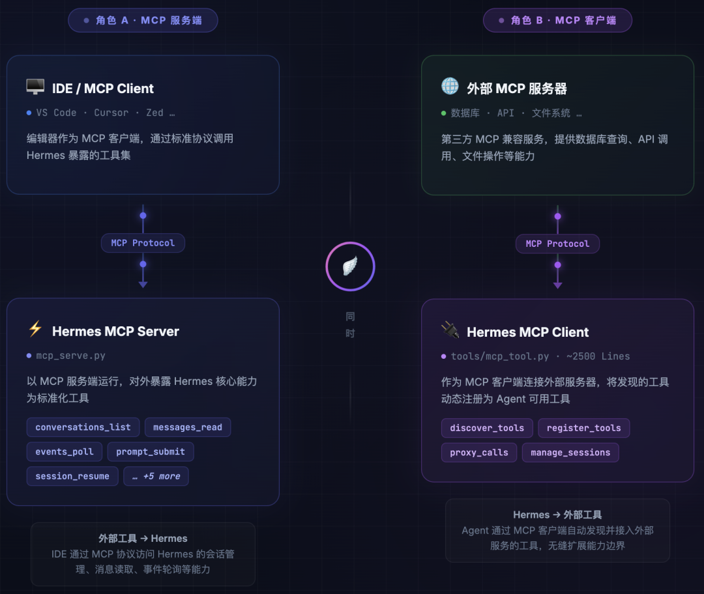

### 8.5 皮肤系统

```
# ~/.hermes/skins/my-theme.yamlname:my-themebanner_color:"#FF6B6B"spinner:faces: ["(◕‿◕)", "(◠‿◠)", "(✿◠‿◠)"]verbs: ["思考中", "推理中", "分析中"]wings: ["✧", "✦"]tool_prefix:"🔧"response_box:border_color:"#4ECDC4"title_color:"#FFE66D"
```

皮肤是**纯数据扩展**——用户只需编写 YAML 文件放入 `~/.hermes/skins/` 即可，无需任何代码修改。运行时可通过 `/skin` 命令即时切换。

---

## 9. 设计哲学

### 9.1 核心设计原则

#### 📌 实用主义胜于教条主义

Hermes 并不追求"教科书式"的架构纯洁性。它的文件组织反映了一种**有机演进**的哲学：

- `run_agent.py`

- 和 `gateway/run.py`是典型的"大文件"。但它们各自是**自包含的职责单元**——Agent 核心循环和 Gateway 消息管线。过度拆分会引入不必要的间接层和跨文件依赖
- 工具系统的 `registry.register()` 模式允许每个工具文件完全独立——这是一种**约定优于配置**的设计

#### 📌 回调注入实现界面无关

四个入口（CLI/TUI/Gateway/ACP）共享同一个 AIAgent，通过回调注入实现差异化交互。这是一种\*\*控制反转（IoC）\*\*的实际应用：

```
AIAgent 不依赖具体的 UI 实现  → 通过回调函数获取用户输入  → 通过回调函数报告进度  → 通过回调函数请求审批
```

#### 📌 分层而非分片

系统采用**清晰的分层**而非碎片化的微服务：

```
Layer 5: 入口层 (CLI/TUI/Gateway/ACP)Layer 4: Agent 引擎 (run_agent.py)Layer 3: 工具编排 (model_tools.py + registry)Layer 2: 工具实现 (tools/*.py)Layer 1: 基础设施 (config, auth, session, logging)Layer 0: 执行环境 (local, docker, ssh, modal...)
```

每一层只依赖下层，不跨层调用。

#### 📌 安全作为一等公民

安全不是事后追加的"中间件"，而是深度嵌入到架构中：

- 审批系统在工具**分发路径**上（不是包装层）
- 凭证保护在**环境变量传递**层（不是应用层过滤）
- SSRF 防护在**平台适配器基类**中（不是每个适配器单独实现）

#### 📌 约定优于配置

```
tools/*.py 中含 registry.register() → 自动发现skills/*.md 放入 ~/.hermes/skills/ → 自动加载skins/*.yaml 放入 ~/.hermes/skins/ → 自动可用platforms/*.py 继承 BasePlatformAdapter → 自动集成
```

### 9.2 架构权衡与取舍

| 权衡点 | 选择 | 代价 | 收益 |
| --- | --- | --- | --- |
| 大文件 vs 小模块 | 大文件(12K/10K 行) | IDE 导航较难 | 核心逻辑内聚，减少跨文件追踪 |
| 同步 vs 异步核心 | 同步循环 | 无法原生并发 | 可预测性、调试简单 |
| 单进程 vs 微服务 | 单进程 | 水平扩展受限 | 部署简单、延迟低 |
| 动态发现 vs 显式注册 | AST 动态发现 | 隐式依赖不直观 | 零配置添加工具 |
| 双写持久化 | SQLite + JSONL | 写入开销翻倍 | 向后兼容 + 结构化查询 |
| 60+ 构造器参数 | 扁平参数 | 参数列表冗长 | 避免复杂配置对象层级 |

### 9.3 与行业最佳实践的对照

| 实践 | Hermes 做法 | 行业标准 | 评价 |
| --- | --- | --- | --- |
| 依赖注入 | 回调注入 + 参数传递 | DI 容器 | ✅ 轻量有效 |
| 配置管理 | 版本化迁移 | Feature flags | ✅ 对 CLI 工具合适 |
| 可观测性 | 结构化日志 + 轨迹保存 | OpenTelemetry | ⚠️ 可进一步标准化 |
| 测试 | 29 个测试文件 | 高覆盖率 | ⚠️ 相对代码量偏少 |
| 错误处理 | JSON 错误包装 | 结构化错误码 | ✅ 统一格式 |
| 文档 | AGENTS.md + 内联注释 | API 文档生成 | ✅ 对 AI 辅助开发友好 |

## 总结

Hermes Agent 是一个**架构成熟、设计务实**的大型 AI Agent 框架。它在以下方面表现突出：

- **🏗️ 架构内聚性**

  ：核心循环、工具系统、网关、入口层的职责划分清晰，依赖链路单向无环
- **🔌 可扩展性**

  ：7 种扩展机制覆盖了从工具到界面的全部定制需求
- **🔒 安全纵深**

  ：4 层审批、Unicode 反绕过、SSRF 防护、凭证隔离等构成了完整的安全体系
- **🌍 平台广度**

  ：20+ 平台适配器 + 4 种入口模式实现了真正的"一次构建，处处运行"
- **⚡ 性能意识**

  ：Prompt 缓存、LRU Agent 缓存、WAL 模式、上下文压缩等优化措施

其主要改进空间在于：测试覆盖率提升、大文件的适度拆分、配置加载器统一、以及可观测性的标准化。这些都是**成熟项目的常见演进方向**，而非架构缺陷。

> **一句话总结**：Hermes 是一个以实用主义为导向、以可扩展性为骨架、以安全性为底线的工业级 AI Agent 框架，其架构设计在复杂性管理和灵活性之间取得了较好的平衡。

---

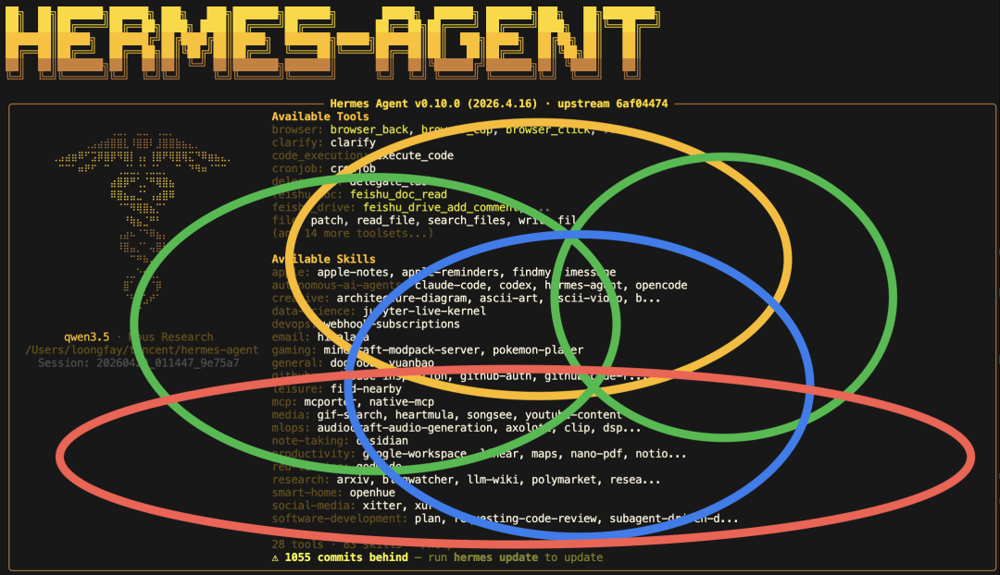
