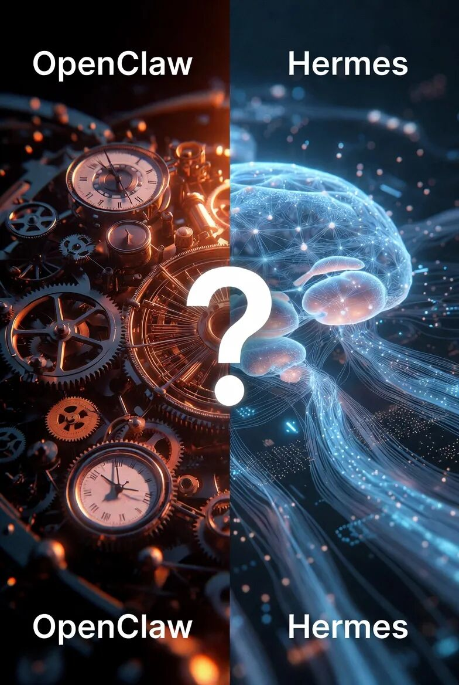
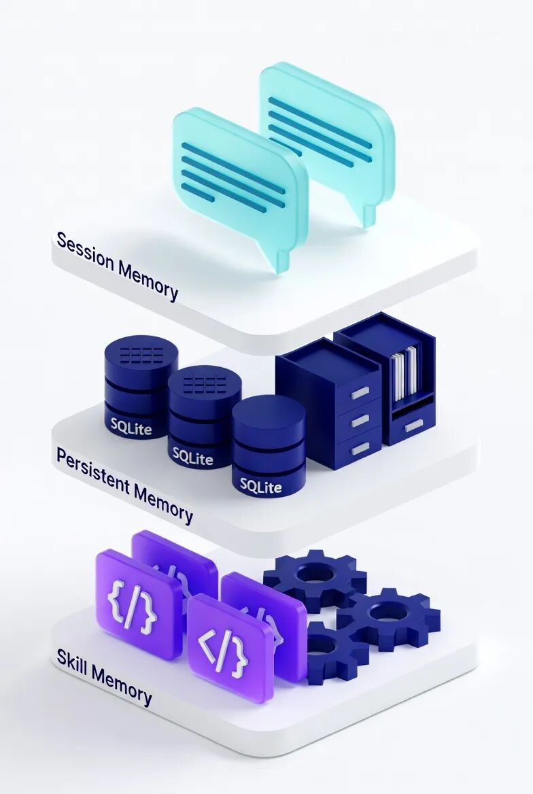

> 📎 来源: [探寻AIGC](https://mp.weixin.qq.com/s?__biz=MzkzODY5NTYyMA==&mid=2247483953&idx=1&sn=2e5f5f5c678f036dbf6e6b27689ce605&chksm=c3df4149b44969b72e664cfd2a279c3385362ca7657fbd1d4f90553e73c2bc75b8fc7c998874&mpshare=1&scene=1&srcid=0430P5hm0ZaynetOKyl5yTnG&sharer_shareinfo=42c67ef75ab8376803286eb384a29d87&sharer_shareinfo_first=42c67ef75ab8376803286eb384a29d87) | 时间: 2026-04-30 18:21

---

# Hermes Agent 架构深度拆解：记忆、检索与 Skill 如何构建自进化系统

> 传统 AI 助手每次对话都"从零开始"，而 Hermes Agent 却能越用越强。这背后隐藏着怎样的架构设计？本文带你深入拆解它的记忆系统、检索机制和 Skill 进化原理。

---

## 01 为什么传统 Agent 会"失忆"？

用过 ChatGPT 或 Claude 的朋友都有这种体验：每次新开对话，AI 都像个"陌生人"，完全不记得你们之前聊过什么。

这不是技术限制，而是**架构设计的选择**。

大多数 AI 助手采用"无状态"设计——每次请求都是独立的，服务器不会保存你的对话历史。好处是成本低、响应快，坏处就是**没有记忆**。



一些进阶方案尝试用"向量数据库"存储历史对话，但效果并不理想：

- 检索精度低，经常召回不相关内容
- 存储成本高，历史数据越积越多
- 缺乏结构化，重要信息淹没在海量记录中

**Hermes 的解决思路完全不同**：不是简单地"存储更多"，而是设计了一套分层的记忆架构，让 AI 像人脑一样工作。

---

## 02 三层记忆架构：像人脑一样分层存储

Hermes 把记忆分成三层，每层有明确的职责、存储位置和读取时机：

| 层级 | 名称 | 存储内容 | 容量 | 读取方式 |
| --- | --- | --- | --- | --- |



| 第一层 | 热记忆 | 当前会话上下文、系统提示词 | 8K tokens | 每次请求自动加载 |
| 第二层 | 温记忆 | MEMORY.md（环境/经验/约定）| ~800 tokens | 按需检索 |
| 第三层 | 冷记忆 | SQLite + FTS5 全量历史 | 无限制 | 关键词检索 |

### 热记忆：正在思考的内容

热记忆就是当前对话的上下文窗口。它包含：

- 系统提示词（告诉 AI 它是谁、能做什么）
- 当前对话的历史消息
- 正在进行的任务状态

**关键设计**：热记忆有容量限制（通常 8K-32K tokens），这迫使 AI 必须"专注"当前任务，避免被无关信息干扰。

### 温记忆：需要记住的约定

温记忆存储在两个 Markdown 文件中：

**MEMORY.md**（~2,200 字符）

- 环境信息（项目结构、技术栈）
- 经验教训（上次踩过的坑）
- 工作约定（代码风格、提交规范）

**USER.md**（~1,375 字符）

- 用户画像（你是谁、做什么的）
- 偏好设置（喜欢的技术、讨厌的方案）
- 沟通风格（简洁/详细、正式/随意）

这两文件会在每次对话开始时自动加载，让 AI 记住"你是谁"和"你们约定过什么"。

### 冷记忆：可追溯的历史

所有历史对话都存储在 SQLite 数据库中，通过 FTS5 全文检索引擎建立索引。

**为什么用 SQLite + FTS5？**

相比向量数据库的"语义模糊检索"，FTS5 的**关键词精确检索**更适合代码场景：

- 搜索 "docker-compose" 不会返回 "dockerfile"
- 支持布尔运算、短语匹配、前缀搜索
- 检索速度快，毫秒级响应

---

## 03 检索机制：如何快速找到需要的信息？

有了分层存储，还需要高效的检索机制。Hermes 采用"分层检索 + 智能摘要"的策略：

### 第一层：热记忆直接读取

当前对话的上下文直接放在提示词里，AI 能立即"看到"最近的几轮对话。


### 第二层：温记忆按需加载

当 AI 判断需要参考 MEMORY.md 或 USER.md 时，会主动读取这些文件。

**触发条件**：

- 用户提到之前的约定（"像上次那样..."）
- 任务涉及特定项目（"部署那个 K8s 应用"）
- 需要遵循特定规范（"按我们的代码风格..."）

### 第三层：冷记忆关键词检索

当温记忆不够用，AI 会执行 FTS5 搜索：

```
-- 搜索包含 "kubectl" 和 "error" 的历史对话SELECT content FROM sessions WHERE content MATCH 'kubectl AND error' ORDER BY timestamp DESC LIMIT 5;
```

**搜索结果会经过 LLM 摘要**，只保留最相关的片段，避免超出上下文限制。

### 外部记忆：无限扩展

除了内置的三层记忆，Hermes 还支持 8 种外部记忆提供者：

- **Honcho**：跨会话用户建模
- **Mem0**：语义记忆检索
- **Notion/Obsidian**：笔记集成
- **自定义 API**：连接你自己的知识库

这些外部记忆与内置系统**并行运行**，不替代而是增强。

---

## 04 Skill 系统：从经验到可复用能力

记忆解决的是"记住"问题，Skill 解决的是"复用"问题。

### 什么是 Skill？

Skill 是 Hermes 的**可执行经验**——把完成任务的完整流程（代码、命令、步骤）保存下来，下次遇到类似任务直接复用。

**Skill 文件示例**（部署到 K8s）：

```
# 部署应用到 K8s## 触发条件用户说"部署到 K8s"、"上线应用"等## 执行步骤1. 检查 kubectl 是否连接   ```bash   kubectl cluster-info
```

2. 应用配置文件

   ```
   kubectl apply -f k8s/
   ```
3. 检查部署状态

   ```
   kubectl rollout status deployment/myapp
   ```

## 常见错误处理

- ImagePullBackOff：检查镜像名称和仓库权限
- CrashLoopBackOff：查看日志 `kubectl logs ...`

```
### Skill 的自动创建Hermes 会在以下情况自动创建 Skill：1. **复杂任务完成后**（5+ 次工具调用）2. **找到可行路径后**（从错误中恢复）3. **用户纠正后**（"你应该这样做..."）4. **发现巧妙方法后**（非显而易见的工作流程）**创建流程**：1. Agent 复盘整个任务执行过程2. 提取关键步骤和决策点3. 生成 Markdown 格式的 Skill 文件4. 保存到 `~/.hermes/skills/` 目录### Skill 的自我进化更厉害的是，Skill 会**自我改进**。**场景示例**：1. 几周前创建了"部署到 K8s"的 Skill2. 今天再次使用，发现 `kubectl apply` 报错（API 版本已更新）3. Agent 自动用 `patch` 操作修复 Skill 中的命令4. 下次使用时自动用修复后的版本**关键**：这一切不需要用户干预，Agent 自主完成。---## 05 闭环学习：经验 → 技能 → 改进把记忆和 Skill 结合起来，就构成了 Hermes 的**自学习闭环**：
```

执行任务 → 评估结果 → 创建/更新 Skill → 下次复用 → 发现问题 → 自动改进

```
### 闭环的四个阶段**阶段 1：执行**使用 47+ 内置工具完成任务（部署、分析、生成...）**阶段 2：评估**通过显式反馈（用户纠正）和隐式信号（任务成功/失败）学习**阶段 3：创建**复杂任务（5+ 工具调用）后自动创建 Skill**阶段 4：改进**使用 Skill 时发现问题，自动修补更新### 为什么这很重要？传统 AI 是" Stateless "的——每次对话都是新的开始。Hermes 是" Stateful "的——它会积累知识、沉淀经验、持续进化。**类比**：- 传统 AI = 每次都换一个新实习生- Hermes = 培养一个跟你磨合多年的老搭档---## 06 与 OpenClaw 的本质区别很多人问：Hermes 和 OpenClaw 有什么区别？| 维度 | OpenClaw | Hermes ||------|----------|--------|| 记忆 | 无持久记忆 | 三层记忆架构 || 学习 | 人工维护 Skill | 自动创建 + 自我改进 || 进化 | 社区贡献 | 运行时自进化 || 定位 | 编程助手 | 自主 Agent |**一句话总结**：OpenClaw 是"工具"，Hermes 是"员工"。工具每次使用都一样，员工越用越顺手。---## 写在最后Hermes Agent 的架构设计揭示了一个趋势：**AI 正在从"工具"向"协作者"进化**。三层记忆让它"不忘事"，Skill 系统让它"会积累经验"，闭环学习让它"越用越强"。这不是简单的功能堆砌，而是对"什么是智能"的深刻理解——**智能不是知识多，而是能学习、能进化、能适应。**Hermes 还只是一个开始。当 AI 真正具备持续学习和自我改进的能力，我们的工作和生活方式都将被重新定义。---*本文基于 Hermes Agent 官方文档和技术分析整理，部分架构细节可能随版本迭代更新。*
```
