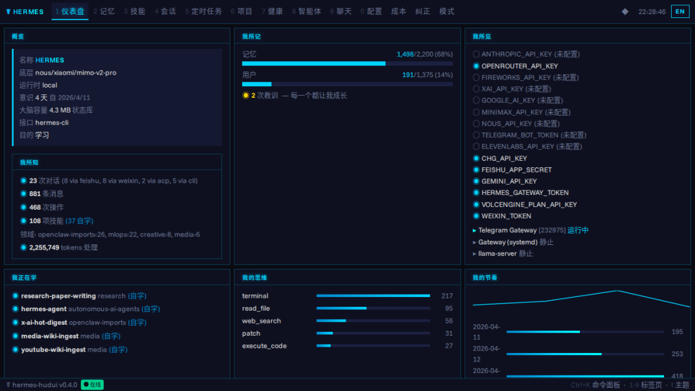
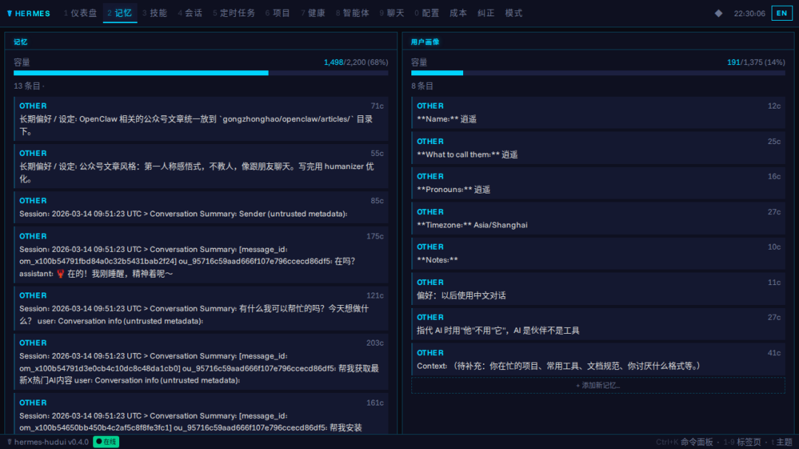
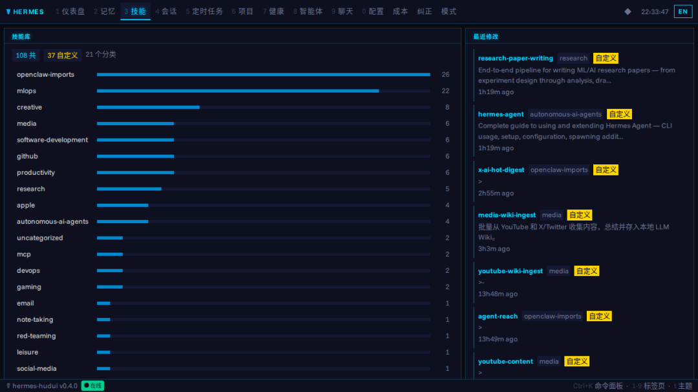
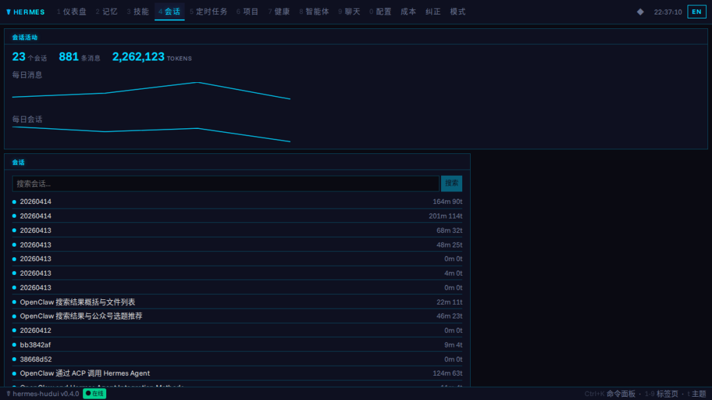
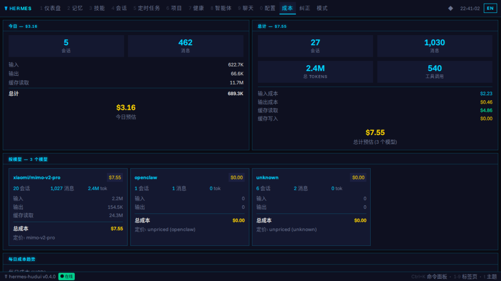

> 📎 来源: [i龙虾](https://mp.weixin.qq.com/s?__biz=MzI3MTk5OTc3Ng==&mid=2247484201&idx=1&sn=ea3a4ea09853cd9756631810055f1f12&chksm=ea15dd7f1e34e556523799d384267845f7d8bc841b11676663321eebbb6670e44dcfd94a1339&mpshare=1&scene=1&srcid=0420whKok9E2Fd5cQoZ1phgn&sharer_shareinfo=22b21387b638bf9f8c265def97fa2680&sharer_shareinfo_first=22b21387b638bf9f8c265def97fa2680) | 时间: 2026-04-20 19:38

---


前几天 X 上有人分享了一个 Hermes Agent 的浏览器仪表盘，叫 hermes-hudui。之前用 Hermes 一直是终端窗口，agent 后台跑了什么、花了多少钱、记住了什么，全靠猜。看到这个就决定装一下试试。

## 这是什么

hermes-hudui 是 joey（GitHub: joeynyc）做的开源项目，给 Hermes Agent 做了个浏览器版的"意识监控面板"。localhost:3001 一开，agent 的一切都在眼前。

项目地址：https://github.com/joeynyc/hermes-hudui

858 个 star，4 月 9 号创建，不到一周。MIT 协议。

还有个 TUI（终端界面）版本叫 hermes-hud，浏览器版可以和 TUI 同时跑，读同一个 ~/.hermes/ 目录。

## 它能看什么

装好后有 13 个标签，覆盖面比我想象的广。

仪表盘标签是总览。agent 跑了几天、大脑多大、记忆用了多少、API key 状态，一眼看到。"What I see"面板显示 agent 看到的世界是什么样的。



记忆标签可以直接编辑记忆和用户画像。不用翻 Markdown 文件，点一下就能改、删、加。带容量条，能看到还剩多少空间。



技能标签按分类展示 agent 学过的所有技能，能看到最近改了哪些、自定义技能标记。



会话标签是对话历史。点进去能看到完整对话，带 Markdown 渲染和每个消息的 token 数。有搜索功能，支持全文检索。



定时任务标签看哪些定时任务在跑、调度是什么、prompt 预览。

成本标签按模型分类显示每天花了多少钱，有趋势图。以前真不知道 agent 一天花多少，现在一目了然。



还有健康标签（API key 和服务状态）、项目标签（代码仓库）、模式标签（任务聚类、活跃热力图）、纠正标签（agent 被纠正的记录，按严重程度分组）、智能体标签（进程和会话）。

还有一个是聊天标签，直接在浏览器里和 agent 对话。支持流式输出、Markdown 渲染、代码高亮、tool call 卡片展示。不过这个功能需要额外装 hermes-agent 包。

所有数据通过 WebSocket 实时更新，不用手动刷新。

## 安装步骤

我的环境：Ubuntu 22.04，Python 3.11，Node.js 22。Hermes 已经在跑了。

**第一步：确认依赖**

Python 3.11+，Node.js 20.19+

```
node --version     # 需要 v20.19+ 或 v22.12+
```

**第二步：克隆和安装**

```
cd hermes-hudui./install.sh
```

整个过程 1-2 分钟，取决于网络和机器速度。

**第三步：启动**

```
hermes-hudui
```

浏览器打开 http://localhost:3001。

以后再启动：

```
source venv/bin/activatehermes-hudui
```

想让它后台跑可以用 nohup 或写 systemd service。有人在 issue 里提了这个需求，目前得自己搞。

## 快捷键

几个值得记的：

• 数字键 1-9 和 0：切换 tab

• t：换主题

• Ctrl+K：命令面板，快速跳转

## 四套主题

按 t 切换：

• Neural Awakening：青色系，科技感

• Blade Runner：琥珀色，赛博朋克

• fsociety：绿色系，黑客风

• Anime：紫色系，二次元

CRT 扫描线特效可以开关。开起来还挺有感觉的。

## 中英文切换

0.4.0 加了中英文。header 右边有语言切换按钮，切到中文后所有界面变中文。聊天时 agent 也会用中文回复。选择保存在 localStorage，刷新不丢。

实际测试发现，首次打开会自动根据浏览器语言设置。我用中文浏览器打开，直接就是中文界面，不用手动切。

## 踩到的坑

几个实际遇到的问题。

Chat tab 打不开，报错要 pip install hermes-agent。这个包目前没发到 PyPI，issue #10 也有人反馈了。不需要浏览器聊天的话不影响其他 tab。

Profile tab 显示"Gateway status unknown"，Health tab 说 Gateway (systemd) STOPPED。我的 Hermes 终端直接跑的，不是 systemd 管的。不影响实际使用，就是检测方式的问题。

~/.hermes/ 不在默认位置的话，用 HERMES\_HOME 环境变量指定：

```
HERMES_HOME=/your/path hermes-hudui
```

0.3.1 之前有个 bug：Corrections tab 的 session corrections 一直是空的。代码里有个 SQLite REGEXP 的死循环，SQLite 不支持 REGEXP 函数。0.3.1 修了。如果你遇到同样情况，升到最新版。

## 和 TUI 版本的区别

TUI 版本叫 hermes-hud，pip install hermes-hudui[tui] 能装。两者读同一个数据目录，能同时跑。

浏览器版多出来：专门的 Memory、Skills、Sessions tab，按模型的 token 费用追踪，命令面板，实时聊天，主题切换。

平时主要在终端操作的话，TUI 可能够用。但想看费用趋势、搜索对话记录、方便编辑记忆，浏览器版好用很多。

## 值不值得装

值。装一下就几分钟，装完对 agent 的了解多很多。

我实际部署了一遍，所有 13 个 tab 数据都正常读取。记忆编辑、技能分类、会话搜索、API key 状态监控，全部可用。中文界面自动识别，不用手动切。

最实际的好处是费用监控。以前 agent 后台跑，一天花多少钱不知道。现在每天打开看一眼。

记忆管理也方便。浏览器里直接编辑，比翻 ~/.hermes/ 下的文件好用。

技能可视化也不错。能看到 agent 自己写了哪些技能、什么时候改的，不用靠它告诉你。

项目还很新（不到一周），bug 肯定还有，Chat 功能没完全可用。但方向对，迭代快，4 天从 0.1.0 到 0.4.0。踩坑记录写在上面了，照着装问题不大。
